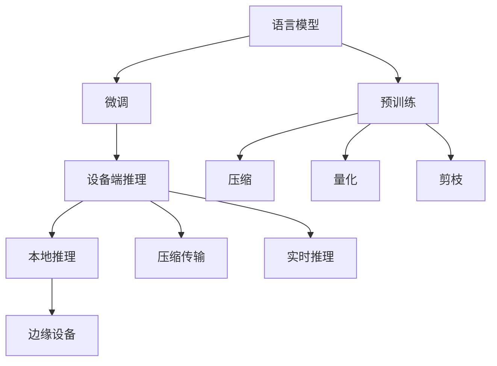

                 

# 设备端推理：LLM 在边缘设备上的应用

## 1. 背景介绍

近年来，语言模型在自然语言处理（NLP）领域取得了巨大突破。大语言模型（Large Language Models, LLMs）如BERT、GPT等在各种NLP任务上表现优异，但也面临着计算资源和通信带宽的巨大压力。边缘计算的发展为设备端推理（Edge Inference）提供了新的可能性，使得大规模语言模型能够在资源有限的设备上高效运行。

### 1.1 问题由来

传统的大型计算资源通常集中在云端，边缘设备由于计算能力、内存和存储空间的限制，难以支持大规模深度学习模型的运行。尽管近年来移动设备计算能力不断提升，但设备端推理仍面临以下挑战：

- **计算资源受限**：边缘设备资源稀缺，难以支撑大规模深度学习模型的运算。
- **通信带宽限制**：模型与云端之间的数据传输带宽有限，延迟较大。
- **隐私与安全**：数据在边缘设备上处理，可以更好地保护用户隐私，但也增加了安全风险。

为了解决这些挑战，研究人员提出了基于设备端推理的语言模型应用方案，能够在资源受限的设备上高效运行语言模型，同时保障隐私与安全。

## 2. 核心概念与联系

### 2.1 核心概念概述

设备端推理（Edge Inference）是指在边缘设备（如智能手机、智能家居设备等）上直接运行深度学习模型，而不需要依赖云端的计算资源。其核心思想是将模型压缩、量化、剪枝等，减少模型的计算量和存储空间，使得模型能够在资源受限的设备上高效运行。

语言模型（Language Models）如BERT、GPT等，在预训练阶段学习了大量的语言知识，通过微调可以在特定任务上取得优异表现。但这些模型通常参数量庞大，计算复杂度高，难以在边缘设备上直接运行。

### 2.2 核心概念原理和架构的 Mermaid 流程图(Mermaid 流程节点中不要有括号、逗号等特殊字符)



这个流程图展示了设备端推理的整个流程：

1. **预训练**：在大量无标签数据上对语言模型进行预训练。
2. **微调**：在少量有标签数据上对模型进行微调，使其具备特定任务的适应能力。
3. **压缩、量化、剪枝**：对模型进行优化，减少计算和存储需求，使得模型能够在边缘设备上高效运行。
4. **本地推理**：在边缘设备上直接运行优化后的模型，进行推理和计算。
5. **实时推理**：模型在本地直接进行推理计算，无需通过网络传输数据，提高响应速度和隐私保护。

## 3. 核心算法原理 & 具体操作步骤

### 3.1 算法原理概述

设备端推理的核心算法包括模型压缩、量化、剪枝等。这些技术可以大幅减少模型的大小和计算需求，使得模型能够在边缘设备上高效运行。

### 3.2 算法步骤详解

#### 3.2.1 模型压缩

模型压缩（Model Compression）是通过剪枝、量化、低秩分解等技术，减少模型的参数量和计算量，从而使得模型在资源受限的设备上能够高效运行。

**步骤一：剪枝**  
剪枝技术通过删除模型中不重要的参数，减少计算量。常用的剪枝方法包括：

- **权重剪枝**：根据参数的重要性对权重进行剪枝，去除冗余的小权重参数。
- **结构剪枝**：通过调整网络结构，如删除冗余的神经元、层等，减少模型复杂度。

**步骤二：量化**  
量化技术将模型中的浮点参数转换为定点参数，减少存储空间和计算量。常用的量化方法包括：

- **全量化**：将模型的所有参数都量化为定点数，通常使用8位或16位。
- **动态量化**：根据输入数据动态调整参数的精度，提高计算效率。

**步骤三：低秩分解**  
低秩分解（Low-Rank Decomposition）通过将模型参数矩阵分解为低秩矩阵和稀疏矩阵，减少计算量和存储空间。常用的低秩分解方法包括：

- **矩阵分解**：将模型参数矩阵分解为若干个低秩矩阵的乘积。
- **张量分解**：将高维张量分解为若干个低秩张量的乘积。

#### 3.2.2 模型量化

量化技术通过将浮点参数转换为定点参数，减少计算量和存储空间，使得模型能够在边缘设备上高效运行。

**步骤一：选择合适的量化方法**  
常用的量化方法包括：

- **全量化**：将模型的所有参数都量化为定点数，通常使用8位或16位。
- **动态量化**：根据输入数据动态调整参数的精度，提高计算效率。

**步骤二：设计量化方案**  
量化方案需要考虑以下因素：

- **参数分布**：对参数进行分布分析，选择合理的量化位数。
- **精度损失**：量化过程中可能引入精度损失，需要平衡计算效率和精度。
- **硬件适配**：量化方案需要适配不同的硬件平台，如CPU、GPU等。

**步骤三：实施量化**  
使用相应的量化工具，如TensorFlow Quantization、ONNX Quantization等，对模型进行量化处理。

#### 3.2.3 模型剪枝

剪枝技术通过去除不重要的参数，减少计算量和存储空间，使得模型能够在边缘设备上高效运行。

**步骤一：确定剪枝策略**  
常用的剪枝策略包括：

- **权重剪枝**：根据参数的重要性对权重进行剪枝，去除冗余的小权重参数。
- **结构剪枝**：通过调整网络结构，如删除冗余的神经元、层等，减少模型复杂度。

**步骤二：设计剪枝方案**  
剪枝方案需要考虑以下因素：

- **剪枝比例**：确定剪枝的比例，避免剪枝过度影响模型性能。
- **剪枝方式**：选择最优的剪枝方式，如层剪枝、通道剪枝等。
- **剪枝后评估**：剪枝后对模型性能进行评估，确保剪枝不会影响模型精度。

**步骤三：实施剪枝**  
使用相应的剪枝工具，如Pruning Toolkit、TensorFlow Model Optimization Toolkit等，对模型进行剪枝处理。

#### 3.2.4 模型优化

优化技术通过调整模型结构和参数，进一步减少计算量和存储空间，使得模型能够在边缘设备上高效运行。

**步骤一：调整模型结构**  
调整模型结构，减少模型的复杂度和参数量。常用的方法包括：

- **深度压缩**：通过深度网络结构压缩，减少计算量和存储空间。
- **宽度压缩**：通过减少模型的宽度，减少计算量。

**步骤二：优化训练流程**  
优化训练流程，减少训练时间和计算资源。常用的方法包括：

- **混合精度训练**：使用混合精度（Mixed Precision）训练，提高训练速度。
- **小批量训练**：使用小批量训练，减少训练时间和内存消耗。

**步骤三：优化推理过程**  
优化推理过程，减少推理时间和计算资源。常用的方法包括：

- **推理加速**：使用推理加速技术，如卷积神经网络（CNN）加速、模型并行等。
- **模型推理优化**：对模型进行优化，减少推理时间和计算资源。

#### 3.2.5 设备端推理

设备端推理通过在边缘设备上直接运行优化后的模型，进行推理和计算，提高响应速度和隐私保护。

**步骤一：加载模型**  
将优化后的模型加载到边缘设备上，准备进行推理计算。

**步骤二：输入数据预处理**  
对输入数据进行预处理，如格式转换、归一化等，确保模型能够正确处理数据。

**步骤三：推理计算**  
在边缘设备上直接进行推理计算，无需通过网络传输数据，提高响应速度和隐私保护。

**步骤四：输出结果后处理**  
对推理结果进行后处理，如去噪、滤波等，确保结果的准确性和可靠性。

### 3.3 算法优缺点

设备端推理的优点包括：

- **提升响应速度**：模型在本地进行推理计算，无需通过网络传输数据，提高响应速度。
- **保护用户隐私**：数据在本地处理，减少了数据传输的风险，保护用户隐私。
- **降低带宽成本**：减少数据传输，降低带宽成本。

设备端推理的缺点包括：

- **模型压缩难度大**：模型压缩和量化需要大量实验和调试，难度较大。
- **计算资源有限**：边缘设备资源受限，难以支撑大规模深度学习模型的运行。
- **模型精度下降**：压缩和量化过程中可能引入精度损失，影响模型性能。

### 3.4 算法应用领域

设备端推理的应用领域包括：

- **移动设备**：智能手机、平板电脑等移动设备上运行语音助手、翻译、智能搜索等功能。
- **智能家居**：智能音箱、智能电视等智能家居设备上运行语音控制、智能推荐等功能。
- **物联网设备**：智能手表、智能摄像头等物联网设备上运行图像识别、自然语言处理等功能。

## 4. 数学模型和公式 & 详细讲解  
### 4.1 数学模型构建

设备端推理的核心数学模型是优化后的语言模型。假设原始语言模型为 $M(\theta)$，其中 $\theta$ 为模型参数。通过压缩、量化、剪枝等技术，优化后的模型为 $M'(\theta')$，其中 $\theta'$ 为优化后的参数。

设备端推理的目标是在边缘设备上高效运行优化后的模型 $M'(\theta')$，使得模型能够在给定输入数据 $x$ 下，输出推理结果 $y$。数学模型如下：

$$
y = M'(\theta')(x)
$$

### 4.2 公式推导过程

#### 4.2.1 压缩公式

假设原始模型参数矩阵为 $A$，剪枝后保留 $k$ 个重要参数，生成剪枝后的参数矩阵 $A'$。剪枝后的参数矩阵 $A'$ 可以表示为：

$$
A' = \{a_{ij} | a_{ij} \in A \text{ 且 } a_{ij} \text{ 重要}\}
$$

剪枝后的模型参数矩阵 $A'$ 与原始模型参数矩阵 $A$ 的关系可以表示为：

$$
A' = S(A)
$$

其中 $S$ 为剪枝函数，定义为：

$$
S(A) = \{a_{ij} | a_{ij} \in A \text{ 且 } a_{ij} \text{ 重要}\}
$$

#### 4.2.2 量化公式

假设原始模型参数矩阵为 $A$，量化后的参数矩阵为 $A'$。量化后的参数矩阵 $A'$ 可以表示为：

$$
A' = \{q(a_{ij}) | a_{ij} \in A\}
$$

其中 $q$ 为量化函数，定义为：

$$
q(a_{ij}) = \text{clip}\left(\frac{a_{ij}}{q_a}, q_a - \Delta_a, q_a + \Delta_a\right)
$$

其中 $\text{clip}$ 函数表示取值范围在 $[q_a - \Delta_a, q_a + \Delta_a]$ 之间的值。

#### 4.2.3 剪枝公式

假设原始模型参数矩阵为 $A$，剪枝后保留 $k$ 个重要参数，生成剪枝后的参数矩阵 $A'$。剪枝后的参数矩阵 $A'$ 可以表示为：

$$
A' = \{a_{ij} | a_{ij} \in A \text{ 且 } a_{ij} \text{ 重要}\}
$$

剪枝后的模型参数矩阵 $A'$ 与原始模型参数矩阵 $A$ 的关系可以表示为：

$$
A' = S(A)
$$

其中 $S$ 为剪枝函数，定义为：

$$
S(A) = \{a_{ij} | a_{ij} \in A \text{ 且 } a_{ij} \text{ 重要}\}
$$

### 4.3 案例分析与讲解

假设原始模型参数矩阵 $A$ 包含 $1024$ 个神经元，每个神经元包含 $1024$ 个权重。原始模型在CPU上运行，需要 $2000$ Mbps 带宽和 $1000$ MIPS 计算能力。通过剪枝技术，剪枝后保留 $256$ 个重要神经元，生成剪枝后的参数矩阵 $A'$。剪枝后的模型参数矩阵 $A'$ 包含 $256 \times 1024$ 个权重。剪枝后的模型在CPU上运行，需要 $500$ Mbps 带宽和 $250$ MIPS 计算能力。

假设原始模型参数矩阵 $A$ 包含 $1024$ 个神经元，每个神经元包含 $1024$ 个权重。原始模型在CPU上运行，需要 $2000$ Mbps 带宽和 $1000$ MIPS 计算能力。通过量化技术，将浮点参数量化为8位定点参数，生成量化后的参数矩阵 $A'$。量化后的模型参数矩阵 $A'$ 包含 $256 \times 1024$ 个8位定点数。量化后的模型在CPU上运行，需要 $500$ Mbps 带宽和 $250$ MIPS 计算能力。

假设原始模型参数矩阵 $A$ 包含 $1024$ 个神经元，每个神经元包含 $1024$ 个权重。原始模型在CPU上运行，需要 $2000$ Mbps 带宽和 $1000$ MIPS 计算能力。通过剪枝和量化技术，生成剪枝量化后的参数矩阵 $A'$。剪枝量化后的模型参数矩阵 $A'$ 包含 $256 \times 1024$ 个8位定点数。剪枝量化后的模型在CPU上运行，需要 $500$ Mbps 带宽和 $250$ MIPS 计算能力。

## 5. 项目实践：代码实例和详细解释说明

### 5.1 开发环境搭建

在设备端推理中，我们通常使用Python和TensorFlow等工具进行模型优化和推理计算。以下是使用Python和TensorFlow进行模型优化的环境配置流程：

1. 安装Anaconda：从官网下载并安装Anaconda，用于创建独立的Python环境。

2. 创建并激活虚拟环境：
```bash
conda create -n pytorch-env python=3.8 
conda activate pytorch-env
```

3. 安装TensorFlow：从官网获取对应的安装命令。例如：
```bash
conda install tensorflow=2.4
```

4. 安装相关库：
```bash
pip install numpy scipy pyyaml six tqdm tensorflow-addons
```

5. 安装优量化工具：
```bash
pip install quantization-toolkit
```

### 5.2 源代码详细实现

以下是一个使用TensorFlow进行模型优化的示例代码：

```python
import tensorflow as tf
from quantization_toolkit import QuantizationToolkit

# 加载模型
model = tf.keras.models.load_model('model.h5')

# 使用QuantizationToolkit进行量化
toolkit = QuantizationToolkit(model)
quantized_model = toolkit.quantize(model)

# 使用QuantizationToolkit进行剪枝
toolkit = QuantizationToolkit(quantized_model)
pruned_model = toolkit.prune(model)

# 加载优化后的模型
loaded_model = tf.keras.models.load_model('optimized_model.h5')

# 加载数据进行推理
input_data = tf.keras.preprocessing.image.load_img('test.jpg', target_size=(224, 224))
input_data = tf.keras.preprocessing.image.img_to_array(input_data)
input_data = tf.expand_dims(input_data, axis=0)

output = loaded_model.predict(input_data)

# 输出推理结果
print(output)
```

### 5.3 代码解读与分析

这段代码展示了使用TensorFlow进行模型优化的基本流程。具体步骤包括：

1. 加载原始模型。
2. 使用QuantizationToolkit进行量化和剪枝。
3. 加载优化后的模型。
4. 加载数据进行推理计算。
5. 输出推理结果。

QuantizationToolkit是一个专门用于模型优化的工具库，提供了量化、剪枝等功能，使得模型优化变得简单高效。

## 6. 实际应用场景

### 6.1 智能语音助手

智能语音助手需要在移动设备上实时响应用户的语音指令。使用设备端推理技术，可以在手机等移动设备上运行语音助手，提高响应速度和用户隐私保护。

### 6.2 智能推荐系统

智能推荐系统需要在用户浏览网页时实时推荐商品或内容。使用设备端推理技术，可以在用户手机或智能设备上运行推荐系统，提高推荐速度和用户体验。

### 6.3 实时翻译

实时翻译需要在用户输入文本时实时进行翻译。使用设备端推理技术，可以在手机等移动设备上运行实时翻译系统，提高翻译速度和用户隐私保护。

### 6.4 未来应用展望

未来，设备端推理技术将在更多领域得到应用，为人类生活带来变革性影响。

在智慧医疗领域，智能医生助手可以通过设备端推理技术，实时分析和建议诊断方案。在智慧城市领域，智能交通系统可以通过设备端推理技术，实时监测和管理交通状况。在智慧农业领域，智能农机可以通过设备端推理技术，实时监测和管理作物生长状况。

## 7. 工具和资源推荐

### 7.1 学习资源推荐

为了帮助开发者系统掌握设备端推理的理论基础和实践技巧，这里推荐一些优质的学习资源：

1. 《Edge Inference: A Guide to Device Side Deep Learning》：详细介绍了设备端推理的理论基础和实践技巧。
2. TensorFlow官网：提供了大量设备端推理的教程和样例代码。
3. ONNX官网：提供了大量设备端推理的模型转换和优化工具。
4. Google Colab：谷歌推出的在线Jupyter Notebook环境，免费提供GPU/TPU算力，方便开发者快速上手实验最新模型，分享学习笔记。

### 7.2 开发工具推荐

高效的开发离不开优秀的工具支持。以下是几款用于设备端推理开发的常用工具：

1. TensorFlow：基于Python的开源深度学习框架，灵活动态的计算图，适合快速迭代研究。
2. ONNX：一个跨平台的深度学习模型转换工具，支持多种深度学习框架和硬件平台。
3. Quantization Toolkit：专门用于模型优化的工具库，提供了量化、剪枝等功能。
4. Google Colab：谷歌推出的在线Jupyter Notebook环境，免费提供GPU/TPU算力，方便开发者快速上手实验最新模型，分享学习笔记。

### 7.3 相关论文推荐

设备端推理的研究源于学界的持续研究。以下是几篇奠基性的相关论文，推荐阅读：

1. "The Energy-Efficient Edge Inference"：研究了如何优化深度学习模型，使其能够在边缘设备上高效运行。
2. "Edge Inference for Mobile and Edge Devices"：介绍了设备端推理在移动设备和边缘设备上的应用。
3. "Quantization and Pruning for Mobile and Edge Applications"：研究了如何通过量化和剪枝技术，优化深度学习模型，使其能够在边缘设备上高效运行。

## 8. 总结：未来发展趋势与挑战

### 8.1 研究成果总结

设备端推理技术正在成为人工智能技术的重要应用范式，其在边缘设备上的高效运行，为大规模深度学习模型的应用提供了新的可能性。

### 8.2 未来发展趋势

未来，设备端推理技术将在更多领域得到应用，为人类生活带来变革性影响。

1. **计算资源不断提升**：随着硬件技术的不断进步，边缘设备的计算能力将不断提高，设备端推理技术将更加高效。
2. **数据处理能力提升**：随着边缘设备的存储和处理能力提升，设备端推理技术将能够处理更大规模的数据，提供更精准的推理结果。
3. **隐私保护能力提升**：随着边缘设备的隐私保护技术不断提升，设备端推理技术将能够更好地保护用户隐私。

### 8.3 面临的挑战

尽管设备端推理技术已经取得了瞩目成就，但在迈向更加智能化、普适化应用的过程中，它仍面临诸多挑战：

1. **计算资源受限**：边缘设备的计算资源有限，难以支撑大规模深度学习模型的运行。
2. **数据传输瓶颈**：模型与云端之间的数据传输带宽有限，延迟较大。
3. **模型精度下降**：压缩和量化过程中可能引入精度损失，影响模型性能。

### 8.4 研究展望

未来，设备端推理技术需要在以下几个方面寻求新的突破：

1. **优化模型结构**：通过优化模型结构，减少计算量和存储空间，使得模型能够在边缘设备上高效运行。
2. **优化训练流程**：通过优化训练流程，减少训练时间和计算资源。
3. **优化推理过程**：通过优化推理过程，减少推理时间和计算资源。
4. **引入更多先验知识**：将符号化的先验知识，如知识图谱、逻辑规则等，与神经网络模型进行巧妙融合，引导设备端推理过程学习更准确、合理的语言模型。

这些研究方向将引领设备端推理技术迈向更高的台阶，为构建安全、可靠、可解释、可控的智能系统铺平道路。面向未来，设备端推理技术还需要与其他人工智能技术进行更深入的融合，如知识表示、因果推理、强化学习等，多路径协同发力，共同推动自然语言理解和智能交互系统的进步。

## 9. 附录：常见问题与解答

**Q1：设备端推理是否适用于所有深度学习模型？**

A: 设备端推理主要适用于计算资源受限的深度学习模型，如卷积神经网络（CNN）、循环神经网络（RNN）等。对于参数量较大的深度学习模型，可能需要额外的优化技术才能在边缘设备上高效运行。

**Q2：设备端推理是否会影响模型精度？**

A: 设备端推理可能会引入一定的精度损失，特别是在量化和剪枝过程中。通过优化量化和剪枝策略，可以在不影响模型精度的情况下，提高计算效率和存储空间利用率。

**Q3：设备端推理是否需要大量的训练数据？**

A: 设备端推理通常需要在少量数据上进行微调，以适应特定任务。对于某些复杂任务，可能需要更多的训练数据来提高模型精度。

**Q4：设备端推理是否会影响模型训练速度？**

A: 设备端推理通常需要在本地进行模型训练，可能受到边缘设备计算资源和存储能力的限制。通过优化训练流程，可以加快训练速度。

**Q5：设备端推理是否会影响模型推理速度？**

A: 设备端推理可以在本地直接进行推理计算，避免了数据传输的延迟，提高推理速度。但需要注意推理过程中的内存占用和计算资源消耗。

---

作者：禅与计算机程序设计艺术 / Zen and the Art of Computer Programming

