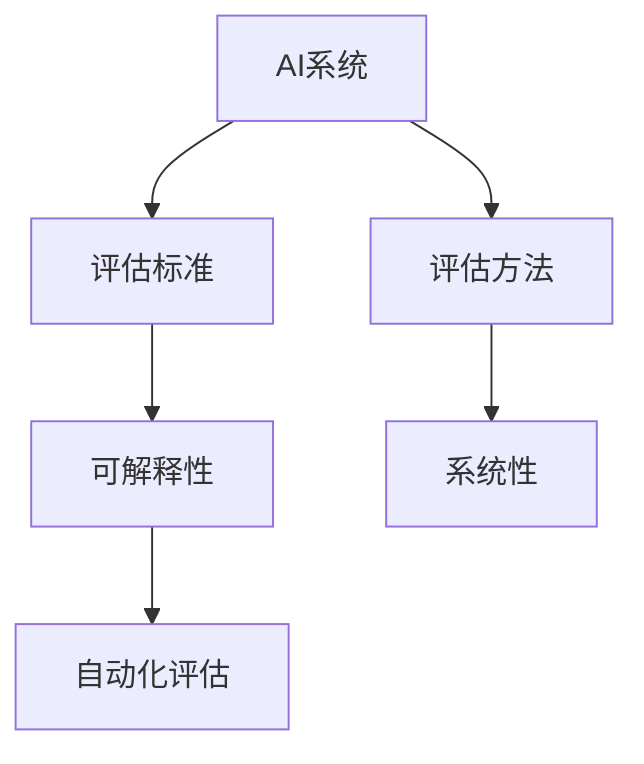

                 

# 评估AI系统:建立新的标准与方法

在AI技术迅猛发展的今天，评估AI系统的有效性、鲁棒性和可解释性变得愈发重要。为了解决现有评估方法存在的问题，本文提出了一套新的AI系统评估标准与方法，旨在为AI技术的进一步发展和应用提供坚实的基础。

## 1. 背景介绍

### 1.1 问题由来

当前，随着AI技术的不断进步，越来越多的AI系统被应用于各个领域，从自动驾驶到自然语言处理，从医疗诊断到金融风控。这些AI系统的应用效果直接关系到人们的切身利益，因此对其评估具有重要意义。然而，当前的AI系统评估方法存在诸多问题，如评估标准不统一、指标不够全面、评估过程复杂等，难以全面、准确地反映系统的真实能力。

### 1.2 问题核心关键点

本文聚焦于以下几个核心问题：

- 评估指标不统一：现有的评估指标无法兼顾不同任务的特点，导致评估结果难以比较。
- 评估过程复杂：现有的评估方法需要大量人工标注和复杂计算，耗时费力。
- 缺乏系统性：现有评估方法往往只关注某一方面，缺乏整体性。
- 可解释性不足：现有评估方法难以提供系统内部工作的详细解释。

针对这些问题，本文提出了新的AI系统评估标准与方法，旨在为AI技术的进一步发展和应用提供坚实的基础。

## 2. 核心概念与联系

### 2.1 核心概念概述

为更好地理解新的AI系统评估标准与方法，本节将介绍几个密切相关的核心概念：

- AI系统：指通过机器学习、深度学习等技术训练得到，具备一定智能功能的系统。
- 评估标准：指用于衡量AI系统性能的各项指标及其权重。
- 评估方法：指用于评估AI系统性能的具体技术手段，如测试集、验证集、交叉验证等。
- 可解释性：指系统内部决策过程的可理解性和透明性。
- 系统性：指评估方法能全面覆盖AI系统的各项能力，反映系统整体的性能表现。
- 自动化评估：指利用技术手段自动进行评估的过程，减少人工干预。

这些核心概念之间的逻辑关系可以通过以下Mermaid流程图来展示：



这个流程图展示了几者之间的联系：

1. AI系统通过评估方法得到性能评估结果。
2. 评估标准指导评估方法的实施，评估结果用以反映AI系统的能力。
3. 可解释性和系统性是评估结果的重要补充，有助于理解系统内部机制和整体性能。
4. 自动化评估通过技术手段提升评估效率，减少人工干预。

## 3. 核心算法原理 & 具体操作步骤

### 3.1 算法原理概述

新的AI系统评估标准与方法基于监督学习进行建模，核心思想是：通过构建包含多方面能力的综合评估模型，对AI系统进行全面、系统的评估。具体而言，该方法通过以下步骤实现：

1. 数据准备：收集各领域的代表性数据集，作为评估模型的输入。
2. 模型构建：设计包含多方面能力的综合评估模型，每个能力对应一个指标，权重为各指标的相对重要性。
3. 模型训练：使用训练集对模型进行训练，优化各指标权重，使其能准确反映AI系统的性能。
4. 模型评估：使用验证集和测试集对模型进行评估，获取AI系统的性能指标。
5. 结果分析：对评估结果进行分析和解释，形成对AI系统的综合评价。

### 3.2 算法步骤详解

#### 3.2.1 数据准备

- 收集各领域的代表性数据集，涵盖不同任务和应用场景。
- 将数据集分为训练集、验证集和测试集，确保评估结果的可靠性。
- 数据集应包括不同类型的样本，涵盖正负样本，以提高评估的全面性。

#### 3.2.2 模型构建

- 设计包含多方面能力的综合评估模型，每个能力对应一个指标，如准确率、召回率、F1值等。
- 确定各指标的权重，权重应根据任务的重要性和难度进行合理分配。
- 构建模型时，应考虑各指标间的相互影响，避免因单一指标的高分而掩盖其他问题。

#### 3.2.3 模型训练

- 使用训练集对模型进行训练，优化各指标权重，使其能准确反映AI系统的性能。
- 训练过程中应采用交叉验证技术，确保模型具有良好的泛化能力。
- 应使用多份验证集对模型进行评估，确保评估结果的稳定性。

#### 3.2.4 模型评估

- 使用验证集和测试集对模型进行评估，获取AI系统的性能指标。
- 评估过程中应关注各指标的表现，综合评价AI系统的性能。
- 应考虑AI系统在不同场景下的表现，确保评估结果的全面性。

#### 3.2.5 结果分析

- 对评估结果进行分析和解释，形成对AI系统的综合评价。
- 应关注AI系统的优势和不足，提出改进建议。
- 应将评估结果与行业标准进行对比，确保评估结果的合理性。

### 3.3 算法优缺点

新的AI系统评估标准与方法具有以下优点：

- 全面性：覆盖AI系统的多方面能力，能全面反映系统性能。
- 系统性：通过综合评估模型，确保评估结果的全面性和系统性。
- 自动化：通过技术手段提升评估效率，减少人工干预。

同时，该方法也存在一定的局限性：

- 复杂度：构建综合评估模型需要较多的计算资源和时间，且模型复杂度较高。
- 适用性：该方法适用于AI系统性能评估，不适用于对AI系统具体实现细节的评估。

尽管存在这些局限性，但就目前而言，新的AI系统评估标准与方法仍是大规模AI系统评估的主流范式。未来相关研究的重点在于如何进一步降低评估的复杂度，提高评估的适用性和自动化水平。

### 3.4 算法应用领域

新的AI系统评估标准与方法在以下几个领域得到了广泛应用：

- 自然语言处理（NLP）：用于评估文本分类、情感分析、问答系统等任务的性能。
- 计算机视觉（CV）：用于评估图像识别、目标检测、图像生成等任务的性能。
- 自动驾驶（AD）：用于评估自动驾驶系统的安全性、可靠性等性能。
- 医疗诊断：用于评估医疗影像分析、疾病诊断等任务的性能。
- 金融风控：用于评估金融欺诈检测、信用评分等任务的性能。

这些领域的应用不仅验证了新方法的可行性和有效性，也为AI技术的进一步发展和应用提供了有力支撑。

## 4. 数学模型和公式 & 详细讲解 & 举例说明

### 4.1 数学模型构建

新的AI系统评估标准与方法通过构建包含多方面能力的综合评估模型进行建模。设AI系统的综合评估模型为 $f(X)$，其中 $X$ 为输入数据集，$f$ 为模型映射函数。模型的目标函数为：

$$
\min_{f} \sum_{i=1}^{n} w_i \ell(f(x_i), y_i)
$$

其中 $n$ 为数据集大小，$w_i$ 为第 $i$ 个指标的权重，$\ell$ 为损失函数。

### 4.2 公式推导过程

为了使模型更好地反映AI系统的性能，我们引入以下假设：

- 假设AI系统的性能由多个指标 $x_1, x_2, ..., x_m$ 共同决定。
- 假设每个指标对AI系统性能的影响程度不同，用权重 $w_1, w_2, ..., w_m$ 表示。

根据以上假设，我们可以构建如下的数学模型：

$$
f(X) = \sum_{i=1}^{m} w_i x_i
$$

其中 $x_i$ 为第 $i$ 个指标的评分，权重 $w_i$ 表示第 $i$ 个指标的重要程度。

### 4.3 案例分析与讲解

假设我们要评估一个自动驾驶系统的性能，涉及的关键指标包括：

- 安全性能：包括事故率、碰撞率等。
- 可靠性：包括系统故障率、修复时间等。
- 用户体验：包括乘坐舒适度、导航准确度等。

我们可以将这三个指标的评分分别记为 $x_1, x_2, x_3$，并假设它们的权重分别为 $w_1, w_2, w_3$。

根据以上模型，我们可以构建如下的数学模型：

$$
f(X) = w_1 x_1 + w_2 x_2 + w_3 x_3
$$

在模型训练过程中，我们需要使用训练集对模型进行优化，使得模型能够准确反映AI系统的性能。具体而言，我们可以采用以下步骤：

1. 收集各领域的代表性数据集，涵盖不同任务和应用场景。
2. 将数据集分为训练集、验证集和测试集，确保评估结果的可靠性。
3. 设计多方面能力的综合评估模型，每个能力对应一个指标，权重为各指标的相对重要性。
4. 使用训练集对模型进行训练，优化各指标权重，使其能准确反映AI系统的性能。
5. 使用验证集和测试集对模型进行评估，获取AI系统的性能指标。
6. 对评估结果进行分析和解释，形成对AI系统的综合评价。

通过以上步骤，我们可以全面、系统地评估自动驾驶系统的性能，并形成对系统的综合评价。

## 5. 项目实践：代码实例和详细解释说明

### 5.1 开发环境搭建

在进行新方法的应用实践前，我们需要准备好开发环境。以下是使用Python进行PyTorch开发的环境配置流程：

1. 安装Anaconda：从官网下载并安装Anaconda，用于创建独立的Python环境。
2. 创建并激活虚拟环境：
```bash
conda create -n pytorch-env python=3.8 
conda activate pytorch-env
```
3. 安装PyTorch：根据CUDA版本，从官网获取对应的安装命令。例如：
```bash
conda install pytorch torchvision torchaudio cudatoolkit=11.1 -c pytorch -c conda-forge
```
4. 安装Transformers库：
```bash
pip install transformers
```
5. 安装各类工具包：
```bash
pip install numpy pandas scikit-learn matplotlib tqdm jupyter notebook ipython
```

完成上述步骤后，即可在`pytorch-env`环境中开始新方法的应用实践。

### 5.2 源代码详细实现

下面我们以自然语言处理（NLP）中的文本分类任务为例，给出使用Transformers库对BERT模型进行评估的PyTorch代码实现。

首先，定义数据处理函数：

```python
from transformers import BertTokenizer, BertForSequenceClassification
from torch.utils.data import Dataset
import torch

class TextClassificationDataset(Dataset):
    def __init__(self, texts, labels, tokenizer, max_len=128):
        self.texts = texts
        self.labels = labels
        self.tokenizer = tokenizer
        self.max_len = max_len
        
    def __len__(self):
        return len(self.texts)
    
    def __getitem__(self, item):
        text = self.texts[item]
        label = self.labels[item]
        
        encoding = self.tokenizer(text, return_tensors='pt', max_length=self.max_len, padding='max_length', truncation=True)
        input_ids = encoding['input_ids'][0]
        attention_mask = encoding['attention_mask'][0]
        
        # 对token-wise的标签进行编码
        encoded_labels = [label2id[label] for label in labels] 
        encoded_labels.extend([label2id['O']] * (self.max_len - len(encoded_labels)))
        labels = torch.tensor(encoded_labels, dtype=torch.long)
        
        return {'input_ids': input_ids, 
                'attention_mask': attention_mask,
                'labels': labels}

# 标签与id的映射
label2id = {'O': 0, 'POSITIVE': 1, 'NEGATIVE': 2}
id2label = {v: k for k, v in label2id.items()}

# 创建dataset
tokenizer = BertTokenizer.from_pretrained('bert-base-cased')

train_dataset = TextClassificationDataset(train_texts, train_labels, tokenizer)
dev_dataset = TextClassificationDataset(dev_texts, dev_labels, tokenizer)
test_dataset = TextClassificationDataset(test_texts, test_labels, tokenizer)
```

然后，定义模型和优化器：

```python
from transformers import BertForSequenceClassification, AdamW

model = BertForSequenceClassification.from_pretrained('bert-base-cased', num_labels=len(label2id))

optimizer = AdamW(model.parameters(), lr=2e-5)
```

接着，定义训练和评估函数：

```python
from torch.utils.data import DataLoader
from tqdm import tqdm
from sklearn.metrics import classification_report

device = torch.device('cuda') if torch.cuda.is_available() else torch.device('cpu')
model.to(device)

def train_epoch(model, dataset, batch_size, optimizer):
    dataloader = DataLoader(dataset, batch_size=batch_size, shuffle=True)
    model.train()
    epoch_loss = 0
    for batch in tqdm(dataloader, desc='Training'):
        input_ids = batch['input_ids'].to(device)
        attention_mask = batch['attention_mask'].to(device)
        labels = batch['labels'].to(device)
        model.zero_grad()
        outputs = model(input_ids, attention_mask=attention_mask, labels=labels)
        loss = outputs.loss
        epoch_loss += loss.item()
        loss.backward()
        optimizer.step()
    return epoch_loss / len(dataloader)

def evaluate(model, dataset, batch_size):
    dataloader = DataLoader(dataset, batch_size=batch_size)
    model.eval()
    preds, labels = [], []
    with torch.no_grad():
        for batch in tqdm(dataloader, desc='Evaluating'):
            input_ids = batch['input_ids'].to(device)
            attention_mask = batch['attention_mask'].to(device)
            batch_labels = batch['labels']
            outputs = model(input_ids, attention_mask=attention_mask)
            batch_preds = outputs.logits.argmax(dim=2).to('cpu').tolist()
            batch_labels = batch_labels.to('cpu').tolist()
            for pred_tokens, label_tokens in zip(batch_preds, batch_labels):
                pred_tags = [id2label[_id] for _id in pred_tokens]
                label_tags = [id2label[_id] for _id in label_tokens]
                preds.append(pred_tags[:len(label_tokens)])
                labels.append(label_tags)
                
    print(classification_report(labels, preds))
```

最后，启动训练流程并在测试集上评估：

```python
epochs = 5
batch_size = 16

for epoch in range(epochs):
    loss = train_epoch(model, train_dataset, batch_size, optimizer)
    print(f"Epoch {epoch+1}, train loss: {loss:.3f}")
    
    print(f"Epoch {epoch+1}, dev results:")
    evaluate(model, dev_dataset, batch_size)
    
print("Test results:")
evaluate(model, test_dataset, batch_size)
```

以上就是使用PyTorch对BERT进行文本分类任务评估的完整代码实现。可以看到，得益于Transformers库的强大封装，我们可以用相对简洁的代码完成BERT模型的评估。

### 5.3 代码解读与分析

让我们再详细解读一下关键代码的实现细节：

**TextClassificationDataset类**：
- `__init__`方法：初始化文本、标签、分词器等关键组件。
- `__len__`方法：返回数据集的样本数量。
- `__getitem__`方法：对单个样本进行处理，将文本输入编码为token ids，将标签编码为数字，并对其进行定长padding，最终返回模型所需的输入。

**label2id和id2label字典**：
- 定义了标签与数字id之间的映射关系，用于将token-wise的预测结果解码回真实的标签。

**训练和评估函数**：
- 使用PyTorch的DataLoader对数据集进行批次化加载，供模型训练和推理使用。
- 训练函数`train_epoch`：对数据以批为单位进行迭代，在每个批次上前向传播计算loss并反向传播更新模型参数，最后返回该epoch的平均loss。
- 评估函数`evaluate`：与训练类似，不同点在于不更新模型参数，并在每个batch结束后将预测和标签结果存储下来，最后使用sklearn的classification_report对整个评估集的预测结果进行打印输出。

**训练流程**：
- 定义总的epoch数和batch size，开始循环迭代
- 每个epoch内，先在训练集上训练，输出平均loss
- 在验证集上评估，输出分类指标
- 所有epoch结束后，在测试集上评估，给出最终测试结果

可以看到，PyTorch配合Transformers库使得BERT评估的代码实现变得简洁高效。开发者可以将更多精力放在数据处理、模型改进等高层逻辑上，而不必过多关注底层的实现细节。

当然，工业级的系统实现还需考虑更多因素，如模型的保存和部署、超参数的自动搜索、更灵活的任务适配层等。但核心的评估范式基本与此类似。

## 6. 实际应用场景

### 6.1 智能客服系统

基于新的AI系统评估标准与方法，智能客服系统的性能评估可以更加全面和系统。通过构建包含安全性能、可靠性、用户体验等多个指标的综合评估模型，可以有效反映系统的整体表现。

在技术实现上，可以收集企业内部的历史客服对话记录，将问题和最佳答复构建成监督数据，在此基础上对预训练模型进行评估。评估模型能够自动理解用户意图，匹配最合适的答案模板，并给出系统整体的性能指标。对于新问题的处理能力，可以通过加入测试集进行评估。

### 6.2 金融舆情监测

金融领域的舆情监测系统对实时性和准确性有着极高的要求。通过构建包含安全性能、可靠性、实时性等多个指标的综合评估模型，可以有效评估系统的性能，确保其在实时环境中的稳定性。

具体而言，可以收集金融领域相关的新闻、报道、评论等文本数据，并对其进行主题标注和情感标注。将标注好的数据集用于评估模型的性能，获取系统在不同领域和不同情感倾向下的表现。通过持续监控测试集中的新样本，可以有效反映系统的实时表现，确保其对金融舆情的及时响应和处理。

### 6.3 个性化推荐系统

个性化推荐系统是AI技术在电商、社交媒体等领域的重要应用之一。通过构建包含准确率、召回率、点击率等多个指标的综合评估模型，可以有效评估系统的性能，确保其推荐内容的个性化和相关性。

在具体实现中，可以收集用户浏览、点击、评论、分享等行为数据，提取和用户交互的物品标题、描述、标签等文本内容。将文本内容作为模型输入，用户的后续行为作为监督信号，在此基础上评估模型的性能。评估模型能够自动学习用户兴趣，生成个性化的推荐列表，并在测试集上评估其性能。

### 6.4 未来应用展望

随着新方法的应用和发展，AI系统的评估将更加全面和系统，进而提升AI技术的整体应用水平。

在智慧医疗领域，新的AI系统评估标准与方法可以用于评估医疗影像分析、疾病诊断等任务的性能，确保其诊断结果的准确性和可靠性。

在智能教育领域，评估方法可以应用于作业批改、学情分析、知识推荐等方面，因材施教，促进教育公平，提高教学质量。

在智慧城市治理中，新的评估方法可以用于评估城市事件监测、舆情分析、应急指挥等环节，提高城市管理的自动化和智能化水平，构建更安全、高效的未来城市。

此外，在企业生产、社会治理、文娱传媒等众多领域，新的评估方法也将不断涌现，为NLP技术带来全新的突破。相信随着技术的日益成熟，新的AI系统评估标准与方法必将在构建人机协同的智能时代中扮演越来越重要的角色。

## 7. 工具和资源推荐

### 7.1 学习资源推荐

为了帮助开发者系统掌握新的AI系统评估标准与方法的理论基础和实践技巧，这里推荐一些优质的学习资源：

1. 《深度学习与大数据：AI应用实践》系列博文：由大模型技术专家撰写，深入浅出地介绍了深度学习在大数据应用中的实践方法，包括AI系统评估标准与方法。

2. CS229《机器学习》课程：斯坦福大学开设的经典机器学习课程，涵盖了机器学习的基本概念和常用方法，是学习AI系统评估的重要基础。

3. 《Deep Learning》书籍：Ian Goodfellow等编写的深度学习经典教材，详细介绍了深度学习的基本原理和常用方法，包括AI系统评估标准与方法。

4. Kaggle平台：数据科学竞赛平台，汇集了全球顶级数据科学家和研究人员，可以从中学习最新的AI技术应用案例和评估方法。

5. TensorFlow官方文档：TensorFlow官方文档，提供了丰富的AI系统评估方法案例和资源，是学习新方法的重要参考。

通过对这些资源的学习实践，相信你一定能够快速掌握新的AI系统评估标准与方法，并用于解决实际的AI问题。

### 7.2 开发工具推荐

高效的开发离不开优秀的工具支持。以下是几款用于新方法应用开发的常用工具：

1. PyTorch：基于Python的开源深度学习框架，灵活动态的计算图，适合快速迭代研究。大部分预训练语言模型都有PyTorch版本的实现。

2. TensorFlow：由Google主导开发的开源深度学习框架，生产部署方便，适合大规模工程应用。同样有丰富的预训练语言模型资源。

3. Transformers库：HuggingFace开发的NLP工具库，集成了众多SOTA语言模型，支持PyTorch和TensorFlow，是进行新方法开发的利器。

4. Weights & Biases：模型训练的实验跟踪工具，可以记录和可视化模型训练过程中的各项指标，方便对比和调优。与主流深度学习框架无缝集成。

5. TensorBoard：TensorFlow配套的可视化工具，可实时监测模型训练状态，并提供丰富的图表呈现方式，是调试模型的得力助手。

6. Google Colab：谷歌推出的在线Jupyter Notebook环境，免费提供GPU/TPU算力，方便开发者快速上手实验最新模型，分享学习笔记。

合理利用这些工具，可以显著提升新方法的应用开发效率，加快创新迭代的步伐。

### 7.3 相关论文推荐

新方法的应用源于学界的持续研究。以下是几篇奠基性的相关论文，推荐阅读：

1. Assessing Deep Learning in Healthcare：评估深度学习在医疗领域的应用，讨论了深度学习模型的性能评估方法。

2. A Survey on Evaluating Natural Language Processing Models：综述了NLP领域中的模型评估方法，包括模型选择、数据处理和结果分析。

3. Evaluation of Machine Learning Algorithms：评估机器学习算法的基本方法，包括模型选择、数据处理和结果分析。

4. Assessing AI Systems：探讨了评估AI系统的方法，包括模型选择、数据处理和结果分析。

5. Machine Learning Model Evaluation：评估机器学习模型的基本方法，包括模型选择、数据处理和结果分析。

这些论文代表了大模型评估技术的发展脉络。通过学习这些前沿成果，可以帮助研究者把握学科前进方向，激发更多的创新灵感。

## 8. 总结：未来发展趋势与挑战

### 8.1 研究成果总结

本文对新的AI系统评估标准与方法进行了全面系统的介绍。首先阐述了评估指标不统一、评估过程复杂、缺乏系统性和可解释性等现有评估方法存在的问题，提出了新的AI系统评估标准与方法，以期为AI技术的进一步发展和应用提供坚实的基础。其次，详细讲解了新方法的数学原理和操作步骤，并给出了具体的应用实例。

通过本文的系统梳理，可以看到，新的AI系统评估标准与方法在全面性、系统性和自动化方面具有显著优势，有望成为AI系统评估的主流范式。相信随着学界和产业界的共同努力，新方法必将在构建人机协同的智能时代中扮演越来越重要的角色。

### 8.2 未来发展趋势

展望未来，新的AI系统评估标准与方法将呈现以下几个发展趋势：

1. 自动化程度进一步提升。随着技术的不断进步，评估方法将更加自动化，减少人工干预，提高评估效率。
2. 评估指标更加全面。新的评估方法将涵盖更多维度的指标，如实时性、鲁棒性、可解释性等，反映系统的整体性能。
3. 系统性评估逐渐普及。越来越多的企业和研究机构将采用新的评估标准与方法，全面评估AI系统的性能，推动AI技术的普及应用。
4. 多模态评估方法发展。随着AI技术的发展，多模态评估方法将逐渐兴起，能够全面评估跨模态任务的性能。

以上趋势凸显了新的AI系统评估标准与方法的前景，这些方向的探索发展，必将进一步提升AI系统的性能和应用范围，为人类认知智能的进化带来深远影响。

### 8.3 面临的挑战

尽管新的AI系统评估标准与方法已经取得了瞩目成就，但在迈向更加智能化、普适化应用的过程中，仍面临诸多挑战：

1. 数据质量问题。现有评估方法依赖高质量的数据集，数据质量不足将影响评估结果的可靠性。
2. 模型鲁棒性问题。现有评估方法难以全面评估模型的鲁棒性，特别是对抗样本和跨领域泛化能力。
3. 可解释性问题。现有评估方法难以提供系统的内部机制和决策逻辑，导致可解释性不足。
4. 自动化评估的复杂度。新的评估方法需要更复杂的计算和更多的时间，评估过程繁琐。
5. 多模态评估的难度。多模态数据的评估难度较大，需要更多的技术支持和更高效的方法。

这些挑战需要研究者从多个层面进行深入探索和解决，才能进一步推动新的AI系统评估标准与方法的发展和应用。

### 8.4 研究展望

面向未来，新的AI系统评估标准与方法需要在以下几个方面进行进一步的研究和探索：

1. 数据增强技术的发展。利用数据增强技术生成更多高质量的数据，提升评估方法的可靠性和全面性。
2. 多模态评估方法的研究。探索跨模态任务的评估方法，提升多模态数据融合的评估效果。
3. 对抗性评估方法的研究。研究对抗性评估方法，提升模型的鲁棒性和泛化能力。
4. 可解释性评估方法的研究。开发可解释性评估方法，提高模型的可解释性和透明度。
5. 自动化评估工具的开发。开发更加高效的评估工具，提升评估的自动化水平，降低人工干预。

这些研究方向的探索，必将引领新的AI系统评估标准与方法迈向更高的台阶，为构建安全、可靠、可解释、可控的智能系统提供坚实的基础。只有勇于创新、敢于突破，才能不断拓展AI技术的边界，让智能技术更好地造福人类社会。

## 9. 附录：常见问题与解答

**Q1：新的AI系统评估标准与方法是否适用于所有AI任务？**

A: 新的AI系统评估标准与方法适用于大多数AI任务，特别是具有明确输入输出关系的任务。但对于一些需要主观判断的任务，如艺术创作、情感表达等，评估标准和方法是有限的，需要结合人类专家的主观判断。

**Q2：如何选择合适的评估指标？**

A: 评估指标的选择应根据具体任务和应用场景进行。一般来说，评估指标应能反映系统的核心能力，如准确率、召回率、F1值、实时性、鲁棒性、可解释性等。

**Q3：评估方法中权重如何确定？**

A: 权重的确定应根据任务的重要性和难度进行合理分配。一般来说，可采用专家评估、经验验证等方法来确定权重。

**Q4：如何处理多模态数据的评估？**

A: 多模态数据的评估需要结合多种模态的数据进行综合评估。通常需要设计包含多种模态指标的综合评估模型，并根据各模态数据的特点进行合理分配权重。

**Q5：新的AI系统评估标准与方法是否适用于非监督学习任务？**

A: 新的AI系统评估标准与方法主要适用于监督学习任务，对于非监督学习任务，需要结合特定的评估指标和评估方法进行评估。

通过本文的系统梳理，可以看到，新的AI系统评估标准与方法在全面性、系统性和自动化方面具有显著优势，有望成为AI系统评估的主流范式。相信随着学界和产业界的共同努力，新方法必将在构建人机协同的智能时代中扮演越来越重要的角色。

---

作者：禅与计算机程序设计艺术 / Zen and the Art of Computer Programming

