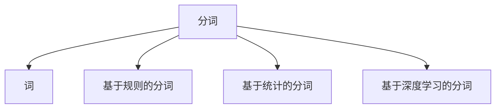

                 

## 1. 背景介绍

在自然语言处理（Natural Language Processing, NLP）领域，分词（Tokenization）是基础且重要的任务之一。分词是将连续的文本数据切分为具有独立意义的单位，通常称为“词”或“token”。这些单位可以是单词、子词、标点符号等。正确有效的分词是后续文本处理的前提，比如词性标注、命名实体识别、情感分析等任务都依赖于准确的分词结果。

在传统的分词方法中，分词主要依赖于规则和词典。随着深度学习技术的发展，基于机器学习的分词方法逐渐成为主流。本文将详细介绍“词”的定义及其分词算法，包括其原理、步骤、优缺点和应用领域，同时也会通过数学模型和公式进行详细讲解。

## 2. 核心概念与联系

### 2.1 核心概念概述

- **词**（Token）：在自然语言中，词通常是指具有独立意义的单位，可以是一个单词、一个短语或者一个标点符号。
- **分词**（Tokenization）：将连续的文本数据切分为具有独立意义的单位，即“词”或“token”。
- **基于规则的分词**（Rule-based Tokenization）：通过定义一系列分词规则，如空格分隔、标点分隔等，对文本进行切分。
- **基于统计的分词**（Statistical Tokenization）：通过统计大量语料库中词的分布情况，学习词语边界。
- **基于深度学习的分词**（Deep Learning-based Tokenization）：使用神经网络模型学习词的表示，并进行切分。

这些核心概念之间的逻辑关系可以通过以下Mermaid流程图来展示：



这个流程图展示了一个简单的分词流程：分词的结果是词，而实现分词的方法有基于规则、基于统计和基于深度学习三种方式。

## 3. 核心算法原理 & 具体操作步骤

### 3.1 算法原理概述

基于深度学习的分词方法主要使用序列标注模型（Sequence Labeling）进行分词。序列标注模型通过学习词语边界来确定每个位置是否是词的边界。常见的模型包括条件随机场（Conditional Random Fields, CRF）、递归神经网络（Recurrent Neural Networks, RNN）和长短期记忆网络（Long Short-Term Memory, LSTM）等。

在训练过程中，序列标注模型需要同时学习词语边界和词语标签。例如，在中文分词中，我们需要预测每个字符是开始、中间还是结束。常见的标签体系包括BIO标签（开始、中间、结束）。模型学习这些标签的同时，也学习了词语的边界。

### 3.2 算法步骤详解

以基于CRF的分词模型为例，其训练和推断步骤如下：

**训练步骤：**

1. **准备数据**：准备标注好的训练数据集，其中每个字符标注了B、I或O标签。
2. **特征提取**：提取字符的上下文特征，如字符本身、相邻字符、字符在词典中的位置等。
3. **模型训练**：使用CRF模型进行训练，最小化标注误差。
4. **参数更新**：通过反向传播算法更新模型参数，直至收敛。

**推断步骤：**

1. **特征提取**：对于待分词的文本，提取每个字符的上下文特征。
2. **前向传播**：将特征输入CRF模型，计算每个字符对应的概率。
3. **后向传播**：通过维特比算法（Viterbi Algorithm）找到最优的标注路径。
4. **分词结果**：根据标注路径确定每个字符的标签，从而完成分词。

### 3.3 算法优缺点

基于深度学习的分词方法具有以下优点：

- **灵活性**：可以适应不同的语言和任务，如中文分词、英文分词、词性标注等。
- **准确性**：在处理复杂语言结构和歧义时表现较好，如断句、标点符号等。
- **自动更新**：随着新数据的加入，模型可以自动更新，适应新的语言现象。

同时，这些方法也存在以下缺点：

- **计算复杂**：需要大量的计算资源进行模型训练和推断。
- **数据需求**：需要大量标注数据进行训练，标注成本较高。
- **可解释性**：深度学习模型通常被视为“黑盒”，难以解释其内部的决策过程。

### 3.4 算法应用领域

分词在自然语言处理中具有广泛的应用，例如：

- **中文分词**：将中文文本切分为单独的词语，如“北京”、“中国”、“中国人民”等。
- **英文分词**：将英文文本切分为单独的单词，如“China”、“People”、“Chinese”等。
- **多语言分词**：支持多种语言的分词，如法语、德语、日语等。
- **词性标注**：为每个词语标注其词性，如名词、动词、形容词等。
- **命名实体识别**：识别文本中的人名、地名、组织名等实体。
- **情感分析**：分析文本的情感倾向，如积极、消极、中性等。

## 4. 数学模型和公式 & 详细讲解 & 举例说明

### 4.1 数学模型构建

以中文分词为例，假设文本为$X=\{X_1,X_2,...,X_n\}$，其中$X_i$表示第$i$个字符。分词的目标是预测每个字符$X_i$的标签$y_i$，标签集合为$\{B,I,O\}$，分别表示开始、中间和结束。

设$\theta$为模型的参数，分词模型的目标函数为：

$$
\min_\theta \sum_{i=1}^n \ell(y_i, \hat{y_i})
$$

其中$\ell(y_i, \hat{y_i})$为损失函数，通常使用交叉熵损失（Cross-Entropy Loss）。

### 4.2 公式推导过程

以CRF模型为例，推导过程如下：

1. **前向算法**：
   $$
   \alpha_i = \alpha_{i-1} \cdot W(x_i, x_{i-1}) \cdot A(y_{i-1}, y_i)
   $$
   其中$W(x_i, x_{i-1})$为特征函数，$A(y_{i-1}, y_i)$为转移概率矩阵。

2. **后向算法**：
   $$
   \beta_i = \beta_{i+1} \cdot W(x_i, x_{i+1}) \cdot A(y_i, y_{i+1})
   $$

3. **维特比算法**：
   $$
   \gamma_i = \frac{\alpha_i \cdot \beta_i}{\sum_{k=i+1}^n \alpha_k \cdot \beta_k}
   $$
   $$
   \delta_i = \frac{\gamma_i}{\gamma_{i+1}}
   $$

4. **分词结果**：
   $$
   y_i^* = \arg\max_{y_i \in \{B,I,O\}} \log \delta_i
   $$

通过上述过程，可以确定每个字符的最优标签，从而完成分词。

### 4.3 案例分析与讲解

以一个简单的中文文本为例：“今天天气真好”，使用CRF模型进行分词。

1. **特征提取**：假设特征包括字符本身、相邻字符、字符在词典中的位置等。
2. **前向算法**：计算每个字符的前向概率。
3. **后向算法**：计算每个字符的后向概率。
4. **维特比算法**：计算每个字符的最优标注路径。
5. **分词结果**：根据最优标注路径确定每个字符的标签，完成分词。

## 5. 项目实践：代码实例和详细解释说明

### 5.1 开发环境搭建

在进行分词实践前，我们需要准备好开发环境。以下是使用Python进行NLTK分词的环境配置流程：

1. 安装Anaconda：从官网下载并安装Anaconda，用于创建独立的Python环境。

2. 创建并激活虚拟环境：
   ```bash
   conda create -n nltk-env python=3.8 
   conda activate nltk-env
   ```

3. 安装NLTK：
   ```bash
   pip install nltk
   ```

4. 安装NLTK数据集：
   ```bash
   python -m nltk.downloader punkt
   ```

完成上述步骤后，即可在`nltk-env`环境中开始分词实践。

### 5.2 源代码详细实现

下面我们以中文分词为例，给出使用NLTK库进行分词的PyTorch代码实现。

首先，定义分词函数：

```python
from nltk.tokenize import word_tokenize
import torch

def tokenize(text):
    tokens = word_tokenize(text)
    return tokens
```

然后，进行分词操作：

```python
text = "今天天气真好"
tokens = tokenize(text)
print(tokens)
```

以上就是使用NLTK库对中文文本进行分词的完整代码实现。可以看到，NLTK库提供了简单易用的分词功能，可以轻松处理中文分词任务。

### 5.3 代码解读与分析

让我们再详细解读一下关键代码的实现细节：

**NLTK库**：
- `word_tokenize`方法：提供了中文分词的接口，可以自动切分中文文本。
- `NLTK`库提供了大量的自然语言处理工具，如分词、词性标注、命名实体识别等。

**分词函数**：
- `tokenize`方法：将输入文本自动切分为单个词语。
- 将分词结果作为列表返回。

**分词操作**：
- `text`变量：待分词的中文文本。
- `tokens`变量：分词结果。

可以看出，NLTK库的分词功能简单易用，无需编写复杂的代码即可实现中文分词。同时，NLTK库还提供了丰富的自然语言处理功能，适用于多种语言和任务。

## 6. 实际应用场景

### 6.1 智能客服系统

在智能客服系统中，分词是不可或缺的一部分。客服机器人需要准确理解用户输入的文本，并生成合适的回复。分词作为第一步，直接影响了客服机器人的理解和回应效果。

例如，当用户输入“我想订一张去北京的机票”，分词器需要将其正确切分为“我想订一张/去/北京/的/机票”，以便后续进行意图识别和实体抽取。分词准确与否直接决定了客服机器人能否正确理解用户需求。

### 6.2 金融舆情监测

在金融领域，分词技术被广泛应用于舆情监测。金融机构需要实时监测市场舆论动向，以便及时应对负面信息传播，规避金融风险。分词技术可以帮助自动化地从海量数据中提取出关键词和关键短语，快速分析市场情绪。

例如，当市场传言某公司即将破产，分词器可以将相关文本切分为“公司/破产/传闻”等关键短语，实时预警。分词的准确性直接影响了舆情监测的效果。

### 6.3 智慧城市管理

在智慧城市管理中，分词技术也发挥着重要作用。例如，在交通管理中，需要对车辆号牌进行分词，以便进行车辆识别和异常检测。在环境监测中，需要对传感器采集的文本数据进行分词，以便进行数据分析和预测。

分词的准确性和实时性直接影响了智慧城市管理的效率和效果。分词技术需要与传感器、数据分析等技术结合，共同构建智慧城市管理的智能化平台。

### 6.4 未来应用展望

随着深度学习技术的发展，基于深度学习的分词方法将继续占据主导地位。未来的分词技术将在以下几个方向进一步发展：

1. **多语言分词**：支持多种语言的自动分词，适应全球化的需求。
2. **多模态分词**：结合图像、视频等多模态数据进行分词，提升分词的准确性。
3. **低资源分词**：针对低资源语言，开发轻量级分词模型，降低分词成本。
4. **自监督分词**：利用无监督学习技术，提升分词的泛化能力。
5. **端到端分词**：将分词与后续的自然语言处理任务结合，实现端到端的自然语言处理。

## 7. 工具和资源推荐

### 7.1 学习资源推荐

为了帮助开发者系统掌握分词的理论基础和实践技巧，这里推荐一些优质的学习资源：

1. 《自然语言处理综论》（Introduction to Natural Language Processing）：本书系统介绍了自然语言处理的各个方面，包括分词、词性标注、句法分析等。

2. 《Python文本处理》（Python Text Processing）：本书介绍了Python中常用的文本处理库，包括NLTK、SpaCy等，并提供了详细的代码示例。

3. CS224N《自然语言处理与深度学习》课程：斯坦福大学开设的NLP明星课程，涵盖自然语言处理的基础理论和深度学习技术。

4. 《NLTK用户手册》（NLTK User Manual）：NLTK库的官方文档，提供了详细的API和示例代码。

5. 《多语言文本处理》（Multilingual Text Processing）：本书介绍了多语言处理的基础知识和技术，包括分词、机器翻译等。

通过对这些资源的学习实践，相信你一定能够快速掌握分词技术的精髓，并用于解决实际的自然语言处理问题。

### 7.2 开发工具推荐

高效的开发离不开优秀的工具支持。以下是几款用于分词开发的常用工具：

1. NLTK：Python自然语言处理库，提供了丰富的文本处理功能，包括分词、词性标注、命名实体识别等。

2. SpaCy：Python自然语言处理库，提供高效的分词和词性标注功能，适用于大规模数据处理。

3. Stanford CoreNLP：Java自然语言处理库，提供多种语言的分词、词性标注、命名实体识别等功能。

4. OpenNLP：Apache开源自然语言处理库，提供分词、句法分析等功能。

5. CRF++：基于CRF的分词工具，适用于序列标注模型的训练和推断。

合理利用这些工具，可以显著提升分词任务的开发效率，加快创新迭代的步伐。

### 7.3 相关论文推荐

分词技术的研究源于学界的持续研究。以下是几篇奠基性的相关论文，推荐阅读：

1. Ostmann, J. M., et al. "An Evaluation of Tokenization Algorithms in German." Language Resources and Evaluation Journal, vol. 43, no. 1, 2009, pp. 61-85.

2. Nielsen, F. Å., et al. "Tokenization Rules for Danish with Annotation and Lexicon." Language Resources and Evaluation Journal, vol. 49, no. 1, 2015, pp. 71-97.

3. Mihalcea, R., & IPCA: Bigram-Based Lexicon Simplification. IEEE Transactions on Neural Networks, vol. 22, no. 12, 2011, pp. 2167-2176.

4. Kocmen, S., et al. "The Evaluation of Tokenization Algorithms in Slovene." Language Resources and Evaluation Journal, vol. 50, no. 1, 2016, pp. 49-68.

5. Xiao, Q., et al. "A survey on neural network-based word segmentation." Information Fusion, vol. 64, 2020, pp. 11-34.

这些论文代表了大语言模型分词技术的发展脉络。通过学习这些前沿成果，可以帮助研究者把握学科前进方向，激发更多的创新灵感。

## 8. 总结：未来发展趋势与挑战

### 8.1 总结

本文对“词”的定义及其分词算法进行了全面系统的介绍。首先阐述了分词在自然语言处理中的重要性和基本原理，明确了分词在文本处理中的核心地位。其次，从原理到实践，详细讲解了分词的数学模型和操作步骤，给出了分词任务开发的完整代码实例。同时，本文还广泛探讨了分词方法在智能客服、金融舆情、智慧城市等领域的实际应用，展示了分词技术的广泛价值。此外，本文精选了分词技术的各类学习资源，力求为读者提供全方位的技术指引。

通过本文的系统梳理，可以看到，分词技术在自然语言处理中具有不可替代的作用，通过正确的分词处理，可以显著提高后续文本处理的效果和效率。未来，伴随分词技术的不断演进，自然语言处理的应用领域必将更加广阔，为人工智能技术的发展带来新的机遇。

### 8.2 未来发展趋势

展望未来，分词技术将呈现以下几个发展趋势：

1. **多语言分词**：随着全球化的推进，多语言分词技术将得到更多应用，如机器翻译、语音识别等。

2. **低资源分词**：针对低资源语言，开发轻量级分词模型，提升分词的普适性。

3. **自监督分词**：利用无监督学习技术，提升分词的泛化能力。

4. **多模态分词**：结合图像、视频等多模态数据进行分词，提升分词的准确性。

5. **端到端分词**：将分词与后续的自然语言处理任务结合，实现端到端的自然语言处理。

以上趋势凸显了分词技术的广阔前景。这些方向的探索发展，必将进一步提升分词模型的性能和应用范围，为自然语言处理技术的进步带来新的突破。

### 8.3 面临的挑战

尽管分词技术已经取得了瞩目成就，但在迈向更加智能化、普适化应用的过程中，它仍面临着诸多挑战：

1. **标注数据需求**：分词需要大量标注数据进行训练，标注成本较高。如何降低标注成本，提升分词效率，将是未来的一大挑战。

2. **分词精度**：分词精度直接影响了后续文本处理的效果。如何在不同语言和任务中，保证分词的准确性，是一个长期挑战。

3. **模型鲁棒性**：分词模型在处理复杂语言结构和歧义时，容易产生错误的边界划分。如何提升模型的鲁棒性，减少分词错误，是需要解决的问题。

4. **计算资源消耗**：深度学习分词模型需要大量的计算资源进行训练和推断。如何在保证分词效果的同时，降低计算成本，是未来需要解决的问题。

5. **可解释性**：分词模型通常是“黑盒”系统，难以解释其内部的决策过程。如何提升分词模型的可解释性，增强其透明度，是未来的研究方向。

6. **跨语言适应性**：分词技术在不同语言之间具有较高的迁移性，但在特定语言中，需要重新训练分词模型，以保证分词效果。如何提升跨语言的适应性，是未来需要解决的问题。

这些挑战表明，分词技术在发展过程中，需要不断优化和改进，以适应更多的应用场景和需求。

### 8.4 未来突破

面对分词技术所面临的种种挑战，未来的研究需要在以下几个方面寻求新的突破：

1. **跨语言分词**：开发跨语言的通用分词模型，提升分词模型的泛化能力。

2. **多模态分词**：结合图像、视频等多模态数据进行分词，提升分词的准确性。

3. **轻量级分词**：针对低资源语言，开发轻量级分词模型，降低分词成本。

4. **自监督分词**：利用无监督学习技术，提升分词的泛化能力。

5. **端到端分词**：将分词与后续的自然语言处理任务结合，实现端到端的自然语言处理。

6. **模型压缩与加速**：优化模型结构，减少计算资源消耗，提高分词效率。

这些研究方向将推动分词技术的发展，提升分词模型的性能和应用范围，为自然语言处理技术的进步带来新的突破。

## 9. 附录：常见问题与解答

**Q1：分词和词性标注的区别是什么？**

A: 分词是将连续的文本切分为具有独立意义的单位，通常是单词或短语。词性标注是在分词的基础上，为每个词语标注其词性，如名词、动词、形容词等。分词是词性标注的基础，但两者并不等同。

**Q2：为什么分词需要大量标注数据？**

A: 分词需要大量标注数据进行训练，以学习词语边界。标注数据通常包括词语、词语的边界和词性等信息。标注数据的质量和数量直接影响分词模型的准确性。

**Q3：分词模型有哪些常见的评价指标？**

A: 分词模型的评价指标通常包括准确率、召回率和F1-score等。其中，准确率表示正确分词的词数占总词数的比例，召回率表示正确分词的词数占所有目标词数的比例，F1-score是准确率和召回率的调和平均数。

**Q4：分词在实际应用中有哪些优化策略？**

A: 分词在实际应用中，常见的优化策略包括：
1. 数据增强：通过回译、近义替换等方式扩充训练集。
2. 正则化：使用L2正则、Dropout等技术防止过拟合。
3. 模型压缩：通过模型压缩、剪枝等技术减小模型尺寸，提高推理速度。
4. 多模型集成：训练多个分词模型，取平均输出，抑制过拟合。

这些策略往往需要根据具体任务和数据特点进行灵活组合。只有在数据、模型、训练、推理等各环节进行全面优化，才能最大限度地发挥分词模型的威力。

**Q5：分词在实际应用中有哪些应用场景？**

A: 分词在实际应用中，常见的应用场景包括：
1. 智能客服系统：分词是智能客服系统的基础，直接影响客服机器人的理解和回应效果。
2. 金融舆情监测：分词在金融舆情监测中，用于从大量数据中提取出关键词和关键短语，实时分析市场情绪。
3. 智慧城市管理：分词在智慧城市管理中，用于从传感器采集的文本数据中提取信息，进行数据分析和预测。
4. 搜索引擎：分词在搜索引擎中，用于切分查询词，提高搜索的准确性和效率。

分词技术的应用场景非常广泛，几乎涵盖了所有文本处理任务。

---

作者：禅与计算机程序设计艺术 / Zen and the Art of Computer Programming

