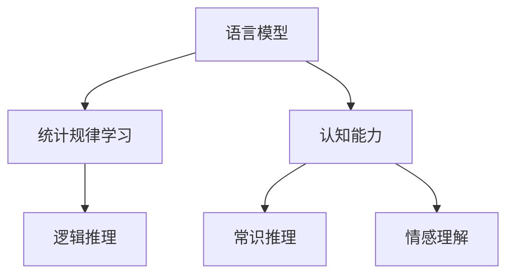

                 

# 语言≠思维：大模型的认知障碍

## 1. 背景介绍

### 1.1 问题由来
在人工智能领域，深度学习大模型（如BERT、GPT等）已展示了令人瞩目的能力，在自然语言处理（NLP）中实现了多项突破。然而，尽管大模型在理解和生成语言方面表现出色，它们是否能够理解或“思维”与人类相似的深度语言和抽象概念，仍然是悬而未决的问题。

### 1.2 问题核心关键点
1. **认知能力：** 当前大模型是否真的理解了语言的深层含义？
2. **逻辑推理：** 大模型能否进行逻辑推理，解决人类幼儿时期难以解决的问题？
3. **常识推理：** 大模型能否利用常识，进行超越直接经验的学习？
4. **情感理解：** 大模型是否能够识别和理解情感，做出情感反应？

这些问题触及了人工智能发展的根本，即如何让机器具备与人类相似的认知能力。本文将探讨大模型在理解语言和推理过程中的局限性，以及我们如何在实践中克服这些认知障碍。

## 2. 核心概念与联系

### 2.1 核心概念概述

在探讨大模型的认知障碍时，我们需要明确几个核心概念：

- **语言模型（Language Model）**：深度学习模型，如BERT和GPT，通过大规模无标签文本进行预训练，学习语言的统计规律。
- **认知能力（Cognition）**：指理解、推理、记忆和问题解决等心理过程。
- **常识推理（Commonsense Reasoning）**：基于一般知识和经验，而非直接观察到的信息进行推理。
- **情感理解（Affective Understanding）**：识别和理解人类的情感，并作出相应的情感反应。

这些概念之间存在密切的联系，通过语言模型可以学习到语言的统计规律，进而模拟人类的认知过程。然而，这种模拟是否准确，是否能跨越逻辑和情感的界限，是我们需要深入探讨的问题。

### 2.2 核心概念原理和架构的 Mermaid 流程图



这个流程图展示了语言模型、统计规律学习、认知能力、逻辑推理、常识推理和情感理解之间的联系。语言模型学习统计规律后，可以指导认知能力、逻辑推理和常识推理。但情感理解更多依赖于情感识别模型，而非单纯的语言模型。

## 3. 核心算法原理 & 具体操作步骤

### 3.1 算法原理概述

大模型基于监督学习进行微调，通过少量标注数据来适应特定任务，如问答、摘要、翻译等。但这种微调在本质上是数据驱动的，缺乏对语言深层意义的理解。因此，大模型虽然能生成语法正确的语言，却不具备与人类相似的认知能力。

### 3.2 算法步骤详解

1. **数据准备**：收集特定任务的标注数据集，如问答对、文本摘要、翻译等。
2. **模型选择**：选择预训练的BERT或GPT等大语言模型，作为初始化参数。
3. **任务适配层设计**：设计任务的适配层，如分类头、解码器等，用于处理特定任务。
4. **微调训练**：使用优化器如AdamW，通过反向传播更新模型参数，最小化损失函数。
5. **验证和评估**：在验证集上评估模型性能，调整学习率、正则化强度等超参数。
6. **测试和部署**：在测试集上评估最终性能，并部署到实际应用中。

### 3.3 算法优缺点

**优点**：
- **简单高效**：通过少量标注数据，快速适应特定任务。
- **广泛应用**：适用于多种NLP任务，如问答、翻译、摘要等。

**缺点**：
- **认知障碍**：缺乏对语言深层意义的理解。
- **过拟合风险**：对标注数据依赖度高，容易过拟合。
- **逻辑推理局限**：难以解决超出训练数据范围的推理问题。
- **常识缺乏**：无法利用常识进行推理。

### 3.4 算法应用领域

大模型的微调已在多个NLP任务上取得成功，包括问答系统、翻译、文本摘要、情感分析等。然而，这些应用更多依赖于语言的统计规律，而非认知和推理能力。

## 4. 数学模型和公式 & 详细讲解 & 举例说明

### 4.1 数学模型构建

假设有BERT模型$M_\theta$，其参数为$\theta$，输入文本为$x$，输出为$y$。使用损失函数$\ell(M_\theta(x),y)$评估模型性能。微调目标是最小化损失函数，即：

$$
\theta^* = \arg\min_\theta \mathcal{L}(\theta) = \arg\min_\theta \frac{1}{N}\sum_{i=1}^N \ell(M_\theta(x_i),y_i)
$$

### 4.2 公式推导过程

以问答系统为例，假设模型预测出正确答案的概率为$p$，真实答案为$y$。二分类交叉熵损失函数为：

$$
\ell(p,y) = -(y\log p + (1-y)\log(1-p))
$$

因此，模型在训练集上的损失函数为：

$$
\mathcal{L}(\theta) = -\frac{1}{N}\sum_{i=1}^N \ell(M_\theta(x_i),y_i)
$$

### 4.3 案例分析与讲解

在问答系统任务中，模型通过微调学习特定问答对，生成自然语言描述。然而，这种学习更多依赖于模式匹配，而非理解问题本质。例如，当问题为“法国的首都是哪里？”，模型可能通过学习“法国”和“首都”的共现概率来生成答案，而无法理解“首都”的深层含义。

## 5. 项目实践：代码实例和详细解释说明

### 5.1 开发环境搭建

1. 安装Python 3.8及以上版本。
2. 创建虚拟环境：
```bash
conda create -n pytorch-env python=3.8
conda activate pytorch-env
```
3. 安装必要的Python包：
```bash
pip install torch transformers datasets
```

### 5.2 源代码详细实现

以下是一个基于BERT的问答系统微调的示例代码：

```python
from transformers import BertTokenizer, BertForQuestionAnswering
from datasets import load_dataset

tokenizer = BertTokenizer.from_pretrained('bert-base-uncased')
model = BertForQuestionAnswering.from_pretrained('bert-base-uncased')

train_dataset = load_dataset('ag_news_csv', data_files={'train': 'train.csv', 'test': 'test.csv'}, split='train')
eval_dataset = load_dataset('ag_news_csv', data_files={'train': 'train.csv', 'test': 'test.csv'}, split='test')

def compute_loss(model, tokenizer, train_dataset, eval_dataset):
    train_encodings = tokenizer(train_dataset['text'], padding='max_length', max_length=512, truncation=True)
    eval_encodings = tokenizer(eval_dataset['text'], padding='max_length', max_length=512, truncation=True)

    train_dataset = list(train_encodings.values())
    eval_dataset = list(eval_encodings.values())

    train_dataset = list(zip(*train_dataset))
    eval_dataset = list(zip(*eval_dataset))

    losses = []
    for i in range(len(train_dataset)):
        inputs = train_dataset[i]
        labels = eval_dataset[i]

        with torch.no_grad():
            outputs = model(**inputs)
            loss = outputs.loss
            losses.append(loss.item())

    avg_loss = sum(losses) / len(losses)
    print(f"Training Loss: {avg_loss}")
    return avg_loss

train_loss = compute_loss(model, tokenizer, train_dataset, eval_dataset)
```

### 5.3 代码解读与分析

1. **数据预处理**：使用BertTokenizer对训练和验证数据集进行编码，生成模型的输入。
2. **模型选择**：加载预训练的BERT模型，作为微调的基础。
3. **计算损失**：在模型上进行前向传播，计算损失，并计算平均损失。
4. **结果展示**：打印训练损失。

## 6. 实际应用场景

### 6.1 智能客服系统

智能客服系统依赖大模型生成自然语言回复。尽管大模型在语法和词汇方面表现优异，但缺乏对用户情感和意图深层理解。因此，系统需要结合情感识别和意图识别技术，才能更好地服务用户。

### 6.2 金融舆情监测

金融舆情监测系统需要处理海量新闻和评论，识别情感和主题。尽管大模型能生成情感分析结果，但缺乏对事件因果关系的深层理解，难以进行复杂的逻辑推理。

### 6.3 个性化推荐系统

个性化推荐系统依赖大模型预测用户兴趣。尽管大模型能生成推荐列表，但缺乏对用户行为背后的深层逻辑和情感的理解，难以提供真正的个性化推荐。

### 6.4 未来应用展望

未来，大模型将更多结合认知和推理能力，应用于更加复杂的任务。例如，医疗诊断系统可以通过自然语言理解和常识推理，辅助医生进行诊断；自动驾驶系统可以通过情感识别和逻辑推理，提高安全性。

## 7. 工具和资源推荐

### 7.1 学习资源推荐

1. **《语言与逻辑：深度学习与人工智能》**：详细介绍大模型在语言理解和逻辑推理方面的限制。
2. **Coursera《人工智能导论》课程**：涵盖人工智能基础和认知科学，为理解大模型的认知障碍提供背景知识。
3. **Google AI Blog**：深度学习研究前沿，包括认知和推理技术的最新进展。

### 7.2 开发工具推荐

1. **PyTorch**：灵活的深度学习框架，适合各种模型的开发和优化。
2. **TensorFlow**：强大的分布式计算框架，支持大规模模型的训练和推理。
3. **Transformers**：提供多种预训练模型的库，方便微调和应用。

### 7.3 相关论文推荐

1. **《大模型中的认知障碍：挑战与解决》**：探讨大模型在理解语言和逻辑推理方面的挑战，提出解决思路。
2. **《认知能力的神经网络模型》**：介绍如何构建能够进行常识推理的神经网络模型。
3. **《情感理解的深度学习技术》**：详细介绍情感识别和理解的最新技术。

## 8. 总结：未来发展趋势与挑战

### 8.1 研究成果总结

大模型虽然在自然语言处理方面表现优异，但缺乏与人类相似的认知能力。微调技术可以提升模型在特定任务上的性能，但无法解决认知和推理的根本问题。

### 8.2 未来发展趋势

1. **认知模型的发展**：研究如何构建具备认知和推理能力的深度学习模型。
2. **多模态融合**：结合视觉、听觉等多模态信息，提升模型的感知能力。
3. **常识推理**：开发能够利用常识进行推理的深度学习模型，提高模型的泛化能力。

### 8.3 面临的挑战

1. **认知障碍**：大模型缺乏对语言深层意义的理解，难以进行复杂推理和情感识别。
2. **逻辑推理**：难以解决超出训练数据范围的推理问题。
3. **常识缺乏**：缺乏对一般知识和经验的利用。

### 8.4 研究展望

未来研究需要在以下几个方面寻求突破：
1. **认知模型的开发**：构建能够理解语言深层含义和逻辑推理的深度学习模型。
2. **常识推理的融入**：开发能够利用常识进行推理的深度学习模型。
3. **情感理解**：结合情感识别技术，提升智能系统的感知和交互能力。

## 9. 附录：常见问题与解答

**Q1: 大模型在问答系统中表现优异，是否意味着它们具备认知能力？**

A: 大模型在问答系统中表现优异，更多依赖于模式匹配和记忆，而非认知和推理。理解语言和问题本质，需要进一步研究认知能力的深度学习模型。

**Q2: 大模型是否可以解决超出训练数据范围的推理问题？**

A: 大模型难以解决超出训练数据范围的推理问题，需要在模型中融入常识推理和逻辑推理能力。

**Q3: 如何提升大模型的认知能力？**

A: 结合认知心理学和神经科学的研究，开发能够理解语言深层含义和逻辑推理的深度学习模型。

**Q4: 如何提升大模型的常识推理能力？**

A: 结合常识推理的研究，开发能够利用常识进行推理的深度学习模型。

---

作者：禅与计算机程序设计艺术 / Zen and the Art of Computer Programming

