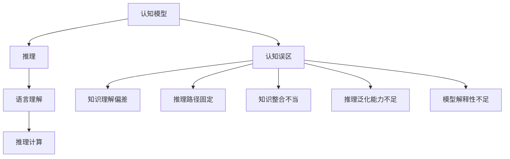

                 

# 语言与推理：大模型的认知误解

> 关键词：认知模型, 推理, 认知误区, 大模型, 语言理解, 推理计算

## 1. 背景介绍

### 1.1 问题由来
随着人工智能技术的飞速发展，特别是深度学习在大规模预训练语言模型中的广泛应用，越来越多的研究表明，大模型（如BERT、GPT-3、XLNet等）在理解自然语言方面取得了巨大成功。这些大模型通过在海量无标签数据上进行预训练，学习到了复杂的语言表示和丰富的知识，因此在诸如阅读理解、问答系统、语言生成等NLP任务中表现出色。然而，在具体应用过程中，人们逐渐意识到，这些大模型在认知推理方面的能力仍然存在一定的局限性，经常陷入一些认知误区。

### 1.2 问题核心关键点
为了更深入地理解大模型的认知能力，有必要首先明确认知模型的定义和特点。认知模型指的是通过模拟人类大脑的认知过程，以实现复杂任务的人工智能系统。这类模型通常包括感知、记忆、推理、学习等功能模块。大模型作为认知模型的一种形式，通过对语言的广泛学习，具备了一定的认知推理能力，但在实际应用中，这种能力也受到数据质量、训练方式、推理模型等多方面因素的制约。

大模型在推理方面常见的认知误区主要包括：
1. 知识理解偏差：尽管大模型可以从文本中学习到大量知识，但这些知识往往存在不完全、不准确的情况，无法满足实际推理任务的要求。
2. 推理路径固定：大模型在推理过程中往往依赖固定的推理路径，无法灵活应对不同情境下的复杂推理任务。
3. 知识整合不当：大模型在处理多源信息时，容易忽略信息间的相关性和优先级，导致推理结果不合理。
4. 推理泛化能力不足：大模型在特定任务上的表现往往较为稳定，但在不同领域或情境下的泛化能力有限。
5. 模型解释性不足：大模型的推理过程和决策逻辑难以解释，缺乏透明度，使得用户难以信任和理解其输出。

## 2. 核心概念与联系

### 2.1 核心概念概述

为了深入探讨大模型的认知推理问题，首先需要了解一些关键概念：

1. 认知模型：通过模拟人类大脑的认知过程，以实现复杂任务的人工智能系统，通常包括感知、记忆、推理、学习等功能模块。
2. 推理：指从已知条件出发，经过逻辑推理得出新结论的过程。在大模型中，推理通常指自然语言处理中的逻辑推理和常识推理。
3. 认知误区：指认知模型在推理过程中，由于模型自身或输入数据的不足，导致推理结果不符合逻辑或常识的现象。
4. 大模型：指通过大规模无标签数据预训练，学习到丰富语言表示的深度学习模型，如BERT、GPT系列、XLNet等。
5. 语言理解：指大模型对文本信息的理解和提取能力，是实现复杂推理任务的基础。
6. 推理计算：指大模型在推理过程中，通过计算图实现逻辑推理的过程，通常使用TensorFlow、PyTorch等深度学习框架实现。

这些概念之间的逻辑关系可以通过以下Mermaid流程图来展示：



这个流程图展示了大模型的核心概念及其之间的关系：

1. 认知模型通过推理实现复杂任务，推理依赖语言理解和推理计算。
2. 认知误区指认知模型在推理过程中可能存在的问题，包括知识理解偏差、推理路径固定、知识整合不当、推理泛化能力不足、模型解释性不足等。

## 3. 核心算法原理 & 具体操作步骤

### 3.1 算法原理概述

大模型的推理过程通常涉及以下几个关键步骤：

1. 文本表示提取：将输入的自然语言文本转换为模型可以理解的向量表示。
2. 逻辑推理计算：根据任务要求，使用计算图进行逻辑推理，得到推理结果。
3. 决策输出：根据推理结果，生成最终的决策或回答。

然而，大模型在推理过程中，往往存在认知误区，导致推理结果不正确或不可信。为解决这个问题，需要引入认知推理模型，对推理过程进行优化和修正。

### 3.2 算法步骤详解

大模型推理过程中常见的认知误区及其对应的改进方法包括：

1. 知识理解偏差：通过对输入文本进行标注，引入外部知识库，增加模型的知识广度和深度，减少知识的偏差。

2. 推理路径固定：引入启发式算法或搜索算法，增加推理过程中的随机性和多样性，避免固定推理路径的局限性。

3. 知识整合不当：使用注意力机制或交互式推理模型，增加模型对信息相关性的识别和处理能力。

4. 推理泛化能力不足：使用迁移学习或元学习，在大模型中增加泛化能力，提高其在不同情境下的推理性能。

5. 模型解释性不足：引入可解释性模型或使用对抗训练，增加模型的透明度和可信度，便于用户理解和信任。

### 3.3 算法优缺点

大模型推理的优势在于：

1. 大模型具备强大的语言理解能力，能够处理复杂的自然语言输入。
2. 大模型的推理过程通常高度自动化，适用于大规模的应用场景。

然而，大模型推理也存在以下缺点：

1. 推理过程复杂，难以解释，用户难以理解推理结果。
2. 推理结果容易受到输入数据和模型参数的影响，存在不确定性。
3. 推理过程依赖于预训练模型，模型泛化能力有限。

### 3.4 算法应用领域

大模型推理在多个领域中得到广泛应用，如问答系统、自然语言生成、文本摘要、情感分析等。这些任务通常需要模型具备一定的推理能力，才能更好地完成。

1. 问答系统：如智能客服、智能助手等，需要模型能够根据用户输入的问题，推理出正确的答案。
2. 自然语言生成：如机器翻译、文本摘要、对话生成等，需要模型具备一定的推理能力，生成符合语境的文本。
3. 文本摘要：如新闻摘要、文献摘要等，需要模型能够理解文本内容，进行逻辑推理，提取关键信息。
4. 情感分析：如情感识别、情绪分析等，需要模型能够理解文本的情感倾向，进行推理判断。

## 4. 数学模型和公式 & 详细讲解 & 举例说明

### 4.1 数学模型构建

在推理任务中，大模型通常使用计算图进行逻辑推理。假设输入为 $x$，推理任务为 $y$，大模型的推理过程可以表示为：

$$
y = f(x; \theta)
$$

其中 $f(\cdot)$ 表示模型的推理函数，$\theta$ 表示模型的参数。

对于二分类任务，通常使用逻辑回归或神经网络进行推理，其计算图可以表示为：

$$
\begin{aligned}
z &= W \cdot x + b \\
\hat{y} &= \sigma(z) \\
L &= -\frac{1}{N}\sum_{i=1}^N(y_i \log \hat{y}_i + (1-y_i) \log (1-\hat{y}_i)) \\
\frac{\partial L}{\partial \theta} &= \frac{1}{N}\sum_{i=1}^N(\hat{y}_i - y_i) \cdot \frac{\partial \hat{y}_i}{\partial z} \cdot \frac{\partial z}{\partial \theta}
\end{aligned}
$$

其中 $W$ 和 $b$ 表示模型的权重和偏置，$\sigma(z)$ 表示激活函数，$L$ 表示损失函数，$\frac{\partial L}{\partial \theta}$ 表示损失函数对模型参数的梯度。

### 4.2 公式推导过程

以逻辑回归为例，其推理过程可以分为以下几个步骤：

1. 输入表示：将输入文本 $x$ 转换为向量表示 $z$。
2. 线性变换：通过线性变换 $z = W \cdot x + b$，将输入向量映射到高维空间。
3. 激活函数：通过激活函数 $\sigma(z)$，将线性变换后的向量映射到 [0,1] 区间，表示预测概率。
4. 损失函数：使用交叉熵损失函数 $L$，计算模型预测结果与真实标签之间的差距。
5. 梯度计算：使用反向传播算法，计算损失函数对模型参数的梯度，更新模型参数。

### 4.3 案例分析与讲解

以情感分析为例，假设输入为一条评论文本，模型需要进行情感分类。推理过程可以表示为：

1. 输入表示：将评论文本转换为向量表示。
2. 特征提取：通过词向量表示，将文本转换为固定长度的向量。
3. 模型推理：通过神经网络对向量进行推理，得到情感分类结果。
4. 损失函数：使用交叉熵损失函数，计算模型预测结果与真实标签之间的差距。
5. 梯度计算：使用反向传播算法，计算损失函数对模型参数的梯度，更新模型参数。

## 5. 项目实践：代码实例和详细解释说明

### 5.1 开发环境搭建

在进行推理任务开发时，首先需要搭建好开发环境。以下是使用Python进行TensorFlow开发的环境配置流程：

1. 安装Anaconda：从官网下载并安装Anaconda，用于创建独立的Python环境。

2. 创建并激活虚拟环境：
```bash
conda create -n tf-env python=3.7
conda activate tf-env
```

3. 安装TensorFlow：根据CUDA版本，从官网获取对应的安装命令。例如：
```bash
conda install tensorflow-gpu=2.6 -c conda-forge
```

4. 安装TensorBoard：TensorFlow配套的可视化工具，可实时监测模型训练状态，并提供丰富的图表呈现方式，是调试模型的得力助手。
```bash
conda install tensorboard
```

5. 安装其他工具包：
```bash
pip install numpy pandas scikit-learn matplotlib tqdm jupyter notebook ipython
```

完成上述步骤后，即可在`tf-env`环境中开始推理任务开发。

### 5.2 源代码详细实现

下面以情感分析任务为例，给出使用TensorFlow对逻辑回归模型进行推理的代码实现。

首先，定义情感分析任务的数据处理函数：

```python
import tensorflow as tf
from tensorflow.keras.datasets import imdb

def load_data(limit=None):
    (x_train, y_train), (x_test, y_test) = imdb.load_data(num_words=10000, limit=limit)
    x_train = tf.keras.preprocessing.sequence.pad_sequences(x_train, maxlen=256)
    x_test = tf.keras.preprocessing.sequence.pad_sequences(x_test, maxlen=256)
    return (x_train, y_train), (x_test, y_test)
```

然后，定义模型和推理函数：

```python
class LogisticRegression(tf.keras.Model):
    def __init__(self, num_classes):
        super(LogisticRegression, self).__init__()
        self.dense1 = tf.keras.layers.Dense(64, activation=tf.nn.relu)
        self.dense2 = tf.keras.layers.Dense(num_classes, activation=tf.nn.softmax)

    def call(self, inputs):
        x = self.dense1(inputs)
        x = self.dense2(x)
        return x

def predict(model, inputs):
    return tf.argmax(model(inputs), axis=-1)
```

接着，定义训练和推理函数：

```python
def train(model, train_data, train_labels, epochs, batch_size):
    model.compile(optimizer='adam', loss='sparse_categorical_crossentropy', metrics=['accuracy'])
    model.fit(train_data, train_labels, epochs=epochs, batch_size=batch_size, validation_split=0.2)

def evaluate(model, test_data, test_labels):
    return model.evaluate(test_data, test_labels)

def predict(model, inputs):
    return tf.argmax(model(inputs), axis=-1)
```

最后，启动训练流程并在测试集上评估：

```python
(x_train, y_train), (x_test, y_test) = load_data(20000)

model = LogisticRegression(num_classes=2)
train(model, x_train, y_train, epochs=10, batch_size=64)
accuracy = evaluate(model, x_test, y_test)
print('Accuracy:', accuracy)
```

以上就是使用TensorFlow对逻辑回归模型进行情感分析任务推理的完整代码实现。可以看到，TensorFlow提供了丰富的API和工具，使得模型开发和推理过程变得简洁高效。

### 5.3 代码解读与分析

让我们再详细解读一下关键代码的实现细节：

**load_data函数**：
- 定义了数据加载函数，用于从IMDB数据集中加载情感分类数据。
- 对文本数据进行分词、截断和填充，以统一长度。

**LogisticRegression类**：
- 定义了一个简单的逻辑回归模型，包括两个全连接层。
- 实现了模型前向传播的`call`方法，用于计算模型输出。

**train函数**：
- 定义了模型训练函数，使用Adam优化器进行训练。
- 使用`fit`方法进行模型训练，并计算模型在验证集上的准确率。

**evaluate函数**：
- 定义了模型评估函数，使用`evaluate`方法计算模型在测试集上的准确率。

**predict函数**：
- 定义了模型预测函数，使用`argmax`方法得到预测结果。

可以看到，TensorFlow提供的高级API和工具，使得模型开发和推理过程变得简洁高效。开发者可以将更多精力放在数据处理、模型改进等高层逻辑上，而不必过多关注底层的实现细节。

当然，工业级的系统实现还需考虑更多因素，如模型的保存和部署、超参数的自动搜索、更灵活的任务适配层等。但核心的推理范式基本与此类似。

## 6. 实际应用场景

### 6.1 智能客服系统

基于大模型的推理技术，可以广泛应用于智能客服系统的构建。传统客服往往需要配备大量人力，高峰期响应缓慢，且一致性和专业性难以保证。而使用推理模型，可以7x24小时不间断服务，快速响应客户咨询，用自然流畅的语言解答各类常见问题。

在技术实现上，可以收集企业内部的历史客服对话记录，将问题和最佳答复构建成监督数据，在此基础上对预训练模型进行微调。微调后的推理模型能够自动理解用户意图，匹配最合适的答案模板进行回复。对于客户提出的新问题，还可以接入检索系统实时搜索相关内容，动态组织生成回答。如此构建的智能客服系统，能大幅提升客户咨询体验和问题解决效率。

### 6.2 金融舆情监测

金融机构需要实时监测市场舆论动向，以便及时应对负面信息传播，规避金融风险。传统的人工监测方式成本高、效率低，难以应对网络时代海量信息爆发的挑战。基于大模型推理的文本分类和情感分析技术，为金融舆情监测提供了新的解决方案。

具体而言，可以收集金融领域相关的新闻、报道、评论等文本数据，并对其进行主题标注和情感标注。在此基础上对预训练语言模型进行推理，使其能够自动判断文本属于何种主题，情感倾向是正面、中性还是负面。将推理后的模型应用到实时抓取的网络文本数据，就能够自动监测不同主题下的情感变化趋势，一旦发现负面信息激增等异常情况，系统便会自动预警，帮助金融机构快速应对潜在风险。

### 6.3 个性化推荐系统

当前的推荐系统往往只依赖用户的历史行为数据进行物品推荐，无法深入理解用户的真实兴趣偏好。基于大模型推理的个性化推荐系统可以更好地挖掘用户行为背后的语义信息，从而提供更精准、多样的推荐内容。

在实践中，可以收集用户浏览、点击、评论、分享等行为数据，提取和用户交互的物品标题、描述、标签等文本内容。将文本内容作为模型输入，用户的后续行为（如是否点击、购买等）作为监督信号，在此基础上推理预训练语言模型。推理后的模型能够从文本内容中准确把握用户的兴趣点。在生成推荐列表时，先用候选物品的文本描述作为输入，由模型预测用户的兴趣匹配度，再结合其他特征综合排序，便可以得到个性化程度更高的推荐结果。

### 6.4 未来应用展望

随着大模型推理技术的不断发展，推理模型将在更多领域得到应用，为传统行业带来变革性影响。

在智慧医疗领域，基于推理模型的医疗问答、病历分析、药物研发等应用将提升医疗服务的智能化水平，辅助医生诊疗，加速新药开发进程。

在智能教育领域，推理技术可应用于作业批改、学情分析、知识推荐等方面，因材施教，促进教育公平，提高教学质量。

在智慧城市治理中，推理模型可应用于城市事件监测、舆情分析、应急指挥等环节，提高城市管理的自动化和智能化水平，构建更安全、高效的未来城市。

此外，在企业生产、社会治理、文娱传媒等众多领域，基于大模型推理的AI应用也将不断涌现，为经济社会发展注入新的动力。相信随着技术的日益成熟，推理范式将成为人工智能落地应用的重要范式，推动人工智能技术向更广阔的领域加速渗透。

## 7. 工具和资源推荐

### 7.1 学习资源推荐

为了帮助开发者系统掌握大模型推理的理论基础和实践技巧，这里推荐一些优质的学习资源：

1. 《深度学习》课程：斯坦福大学开设的深度学习明星课程，有Lecture视频和配套作业，带你入门深度学习的基本概念和经典模型。

2. TensorFlow官方文档：TensorFlow的官方文档，提供了海量的API和教程，是学习推理模型的必备资料。

3. 《TensorFlow实战》书籍：TensorFlow实战指南，系统讲解了TensorFlow的使用方法和最佳实践，适合快速上手TensorFlow。

4. Weights & Biases：模型训练的实验跟踪工具，可以记录和可视化模型训练过程中的各项指标，方便对比和调优。

5. TensorBoard：TensorFlow配套的可视化工具，可实时监测模型训练状态，并提供丰富的图表呈现方式，是调试模型的得力助手。

通过对这些资源的学习实践，相信你一定能够快速掌握大模型推理的精髓，并用于解决实际的推理问题。

### 7.2 开发工具推荐

高效的开发离不开优秀的工具支持。以下是几款用于大模型推理开发的常用工具：

1. TensorFlow：由Google主导开发的开源深度学习框架，生产部署方便，适合大规模工程应用。支持灵活的计算图结构，非常适合推理任务。

2. PyTorch：基于Python的开源深度学习框架，灵活动态的计算图，适合快速迭代研究。虽然主要用于训练任务，但其灵活的API也支持推理任务的实现。

3. Weights & Biases：模型训练的实验跟踪工具，可以记录和可视化模型训练过程中的各项指标，方便对比和调优。与主流深度学习框架无缝集成。

4. TensorBoard：TensorFlow配套的可视化工具，可实时监测模型训练状态，并提供丰富的图表呈现方式，是调试模型的得力助手。

5. Keras：一个高级的深度学习API，易于使用，可以快速搭建推理模型。

合理利用这些工具，可以显著提升大模型推理任务的开发效率，加快创新迭代的步伐。

### 7.3 相关论文推荐

大模型推理技术的发展源于学界的持续研究。以下是几篇奠基性的相关论文，推荐阅读：

1. Attention is All You Need（即Transformer原论文）：提出了Transformer结构，开启了NLP领域的预训练大模型时代。

2. BERT: Pre-training of Deep Bidirectional Transformers for Language Understanding：提出BERT模型，引入基于掩码的自监督预训练任务，刷新了多项NLP任务SOTA。

3. Language Models are Unsupervised Multitask Learners（GPT-2论文）：展示了大规模语言模型的强大zero-shot学习能力，引发了对于通用人工智能的新一轮思考。

4. Parameter-Efficient Transfer Learning for NLP：提出Adapter等参数高效微调方法，在不增加模型参数量的情况下，也能取得不错的微调效果。

5. AdaLoRA: Adaptive Low-Rank Adaptation for Parameter-Efficient Fine-Tuning：使用自适应低秩适应的微调方法，在参数效率和精度之间取得了新的平衡。

6. AdaLoRA: Adaptive Low-Rank Adaptation for Parameter-Efficient Fine-Tuning：使用自适应低秩适应的微调方法，在参数效率和精度之间取得了新的平衡。

这些论文代表了大模型推理技术的发展脉络。通过学习这些前沿成果，可以帮助研究者把握学科前进方向，激发更多的创新灵感。

## 8. 总结：未来发展趋势与挑战

### 8.1 总结

本文对大模型的推理技术进行了全面系统的介绍。首先阐述了大模型推理技术的背景和意义，明确了推理技术在拓展预训练模型应用、提升下游任务性能方面的独特价值。其次，从原理到实践，详细讲解了推理技术的数学原理和关键步骤，给出了推理任务开发的完整代码实例。同时，本文还广泛探讨了推理技术在智能客服、金融舆情、个性化推荐等多个行业领域的应用前景，展示了推理范式的巨大潜力。此外，本文精选了推理技术的各类学习资源，力求为读者提供全方位的技术指引。

通过本文的系统梳理，可以看到，大模型的推理技术正在成为NLP领域的重要范式，极大地拓展了预训练语言模型的应用边界，催生了更多的落地场景。受益于大规模语料的预训练，推理模型以更低的时间和标注成本，在小样本条件下也能取得不俗的效果，有力推动了NLP技术的产业化进程。未来，伴随推理模型的不断发展，推理范式必将进一步拓展自然语言理解和智能交互系统的进步。

### 8.2 未来发展趋势

展望未来，大模型推理技术将呈现以下几个发展趋势：

1. 推理路径多样化：未来的推理模型将更加灵活，能够根据任务需求自动选择最优的推理路径。

2. 推理泛化能力增强：未来的推理模型将具备更强的泛化能力，能够在不同领域和情境下取得更好的推理性能。

3. 推理过程可解释：未来的推理模型将具备更高的透明度，能够对推理过程进行解释，便于用户理解和信任。

4. 推理模型融合多模态信息：未来的推理模型将能够融合视觉、语音等多模态信息，实现更全面的推理能力。

5. 推理模型与知识库结合：未来的推理模型将能够与外部知识库、规则库等专家知识结合，形成更加全面、准确的信息整合能力。

以上趋势凸显了大模型推理技术的广阔前景。这些方向的探索发展，必将进一步提升推理模型的性能和应用范围，为人工智能技术落地应用带来新的突破。

### 8.3 面临的挑战

尽管大模型推理技术已经取得了瞩目成就，但在迈向更加智能化、普适化应用的过程中，它仍面临着诸多挑战：

1. 推理结果不确定性：推理模型的输出结果往往受到输入数据和模型参数的影响，存在不确定性。

2. 推理过程复杂：推理模型的推理过程复杂，难以解释，用户难以理解推理结果。

3. 推理模型泛化能力有限：推理模型在特定任务上的表现往往较为稳定，但在不同领域或情境下的泛化能力有限。

4. 推理模型资源消耗大：推理模型通常需要大量的计算资源，对于高性能设备如GPU/TPU等有较高要求。

5. 推理模型缺乏可解释性：推理模型通常缺乏可解释性，难以对推理过程进行解释，缺乏透明度。

6. 推理模型存在偏见：推理模型可能学习到有偏见、有害的信息，通过推理传递到下游任务，产生误导性、歧视性的输出。

这些挑战凸显了大模型推理技术的复杂性和不确定性，需要从数据、算法、工程、伦理等多个维度进行全面优化。

### 8.4 研究展望

面对大模型推理面临的挑战，未来的研究需要在以下几个方面寻求新的突破：

1. 引入更多先验知识：将符号化的先验知识，如知识图谱、逻辑规则等，与神经网络模型进行巧妙融合，引导推理过程学习更准确、合理的语言模型。同时加强不同模态数据的整合，实现视觉、语音等多模态信息与文本信息的协同建模。

2. 引入因果分析和博弈论工具：将因果分析方法引入推理模型，识别出模型决策的关键特征，增强输出解释的因果性和逻辑性。借助博弈论工具刻画人机交互过程，主动探索并规避模型的脆弱点，提高系统稳定性。

3. 纳入伦理道德约束：在推理模型训练目标中引入伦理导向的评估指标，过滤和惩罚有偏见、有害的输出倾向。同时加强人工干预和审核，建立模型行为的监管机制，确保输出符合人类价值观和伦理道德。

4. 改进推理模型资源效率：开发更加高效的推理算法和模型结构，优化推理过程的计算图，减少资源消耗，实现更加轻量级、实时性的部署。

这些研究方向的探索，必将引领大模型推理技术迈向更高的台阶，为构建安全、可靠、可解释、可控的智能系统铺平道路。面向未来，大模型推理技术还需要与其他人工智能技术进行更深入的融合，如知识表示、因果推理、强化学习等，多路径协同发力，共同推动自然语言理解和智能交互系统的进步。只有勇于创新、敢于突破，才能不断拓展语言模型的边界，让智能技术更好地造福人类社会。

## 9. 附录：常见问题与解答

**Q1：大模型推理是否适用于所有NLP任务？**

A: 大模型推理在大多数NLP任务上都能取得不错的效果，特别是对于数据量较小的任务。但对于一些特定领域的任务，如医学、法律等，仅仅依靠通用语料预训练的模型可能难以很好地适应。此时需要在特定领域语料上进一步预训练，再进行推理，才能获得理想效果。此外，对于一些需要时效性、个性化很强的任务，如对话、推荐等，推理方法也需要针对性的改进优化。

**Q2：推理过程中如何选择合适的模型参数？**

A: 推理过程中，模型的参数设置需要根据具体任务进行调整。通常，可以选择默认参数，如学习率、批次大小等，通过多次实验找到最优参数组合。对于复杂的推理任务，还可以使用超参数搜索算法，自动寻找最优参数。

**Q3：推理模型在落地部署时需要注意哪些问题？**

A: 将推理模型转化为实际应用，还需要考虑以下因素：
1. 模型裁剪：去除不必要的层和参数，减小模型尺寸，加快推理速度
2. 量化加速：将浮点模型转为定点模型，压缩存储空间，提高计算效率
3. 服务化封装：将模型封装为标准化服务接口，便于集成调用
4. 监控告警：实时采集系统指标，设置异常告警阈值，确保服务稳定性
5. 安全防护：采用访问鉴权、数据脱敏等措施，保障数据和模型安全

大模型推理为NLP应用开启了广阔的想象空间，但如何将强大的性能转化为稳定、高效、安全的业务价值，还需要工程实践的不断打磨。唯有从数据、算法、工程、业务等多个维度协同发力，才能真正实现人工智能技术在垂直行业的规模化落地。总之，推理需要开发者根据具体任务，不断迭代和优化模型、数据和算法，方能得到理想的效果。

---

作者：禅与计算机程序设计艺术 / Zen and the Art of Computer Programming

