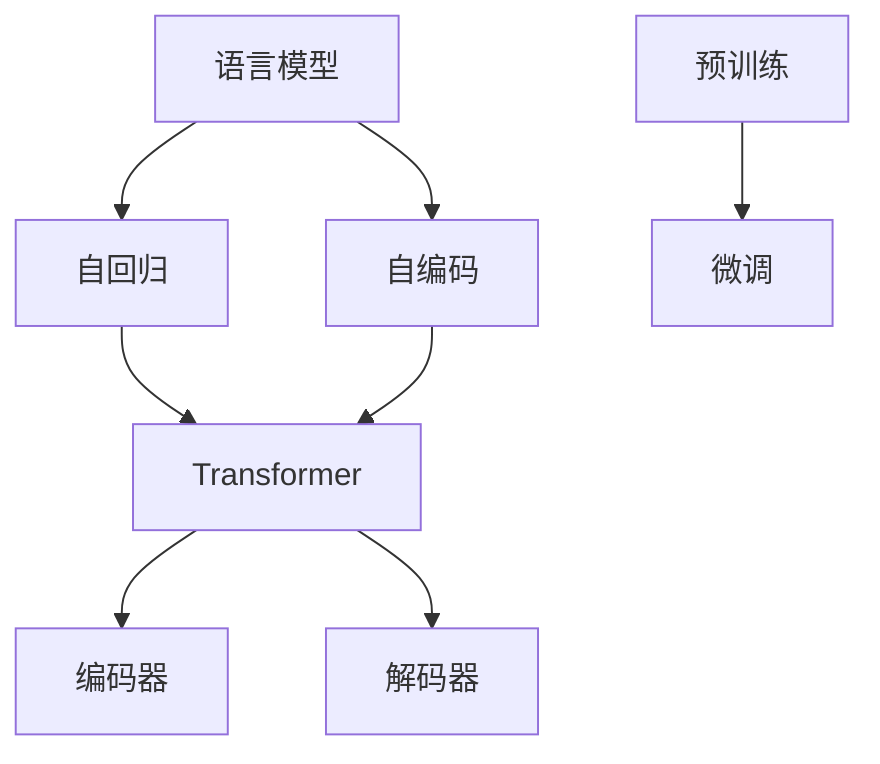

                 

# 语言模型对标：GPT 家族对比

在深度学习浪潮中，语言模型成为了人工智能领域的明星。从最早的神经网络模型，到近几年的自回归模型，语言模型的结构和能力不断演进，催生了一系列强大的预训练大模型。其中，GPT（Generative Pre-trained Transformer）家族系列模型以其出色的生成能力和语言理解力，在学术界和工业界引起了广泛关注。本文将深入探讨GPT家族各成员的模型架构、原理和应用，通过比较分析，帮助读者更清晰地理解这些模型，并发现其差异和优势。

## 1. 背景介绍

### 1.1 问题由来

随着深度学习在自然语言处理（NLP）领域的应用日益广泛，如何构建能够理解和生成人类语言的模型成为了一大挑战。传统的基于规则或统计的NLP方法已经难以应对复杂的语言现象，而基于神经网络的模型则带来了革命性的变化。其中，语言模型通过学习文本的统计规律，成为了一种强大的表示学习工具。

### 1.2 问题核心关键点

为更好地理解GPT家族，首先需要对语言模型的基本原理和框架有所了解。语言模型通常分为自回归模型（如GPT）和自编码模型（如BERT）两种类型，但自回归模型因其强大的生成能力，特别是长距离依赖的处理能力，成为主流。自回归模型利用当前词的预测结果对后续词进行条件概率计算，从而学习到语言的依赖关系和语义信息。

## 2. 核心概念与联系

### 2.1 核心概念概述

在讨论GPT家族时，我们需要明确几个关键概念：

- **自回归语言模型**：一种通过当前词预测后续词的概率模型，如GPT。
- **自编码语言模型**：一种通过输入和输出之间的映射学习语言的模型，如BERT。
- **Transformer**：一种基于注意力机制的神经网络结构，显著提升了自回归模型的生成和理解能力。
- **预训练**：在大规模无标签数据上训练语言模型，学习通用语言表示。
- **微调**：在大规模预训练模型的基础上，使用少量有标签数据进行细粒度任务优化。

### 2.2 核心概念原理和架构的 Mermaid 流程图



该图展示了语言模型从设计到应用的流程。语言模型从自回归或自编码模型开始，然后通过Transformer结构进行优化，接着进行预训练和微调，最终应用于各种NLP任务。

## 3. 核心算法原理 & 具体操作步骤

### 3.1 算法原理概述

GPT家族模型基于自回归语言模型和Transformer结构，利用大规模无标签数据进行预训练，然后通过微调针对特定任务进行优化。其核心思想是通过预测后续词来捕捉语言序列的依赖关系，从而学习到语言的统计规律和语义信息。

### 3.2 算法步骤详解

1. **数据准备**：收集大规模无标签文本数据进行预训练，例如维基百科、新闻文章、书籍等。
2. **模型构建**：使用Transformer结构搭建自回归模型，并设置合适的层数和维度。
3. **预训练**：在预训练数据上训练模型，目标是最小化预测下一个词的交叉熵损失。
4. **微调**：在特定任务的少量有标签数据上进行微调，使用损失函数优化模型参数，使其适应新的任务。
5. **应用**：将微调后的模型应用于各种NLP任务，如文本生成、机器翻译、问答系统等。

### 3.3 算法优缺点

GPT家族模型的优点包括：

- **生成能力强**：能够在给定文本的基础上生成新的、连贯的文本。
- **理解能力高**：能够处理长距离依赖关系，理解文本的上下文信息。
- **通用性好**：通过预训练和微调，适应各种NLP任务。

缺点包括：

- **训练成本高**：需要大量的计算资源和时间进行预训练。
- **数据需求大**：需要大规模无标签数据进行预训练。
- **可解释性差**：黑盒模型，难以解释其内部工作机制。

### 3.4 算法应用领域

GPT家族模型广泛应用于以下几个领域：

- **文本生成**：如文本摘要、对话系统、故事生成等。
- **机器翻译**：能够生成高质量的翻译结果。
- **问答系统**：如智能客服、虚拟助手等。
- **推荐系统**：通过理解用户偏好，推荐个性化的内容。
- **研究工具**：如GPT-3用于学术研究、编程助手等。

## 4. 数学模型和公式 & 详细讲解 & 举例说明

### 4.1 数学模型构建

GPT家族模型的数学模型基于自回归模型和Transformer结构。假设输入序列为$x_1, x_2, ..., x_n$，目标是为每个位置$x_i$预测下一个词$y_{i+1}$。模型的目标函数为：

$$
\min_{\theta} \sum_{i=1}^{n-1} \log P(y_{i+1} | x_1, ..., x_i; \theta)
$$

其中$P$表示模型的概率分布，$\theta$为模型参数。

### 4.2 公式推导过程

GPT-3模型的核心是Transformer结构。在Transformer中，注意力机制被广泛应用，用于捕捉输入序列中各位置之间的关系。假设输入序列长度为$n$，Transformer包含$N$个编码器层，每层包含$M$个自注意力头（head）。注意力机制的计算公式为：

$$
\text{Attention}(Q, K, V) = \text{softmax}(\frac{QK^T}{\sqrt{d_k}})V
$$

其中$Q, K, V$分别表示查询、键、值矩阵，$d_k$为键的维度。

### 4.3 案例分析与讲解

以GPT-3为例，其训练过程包括以下几个关键步骤：

1. **数据预处理**：将文本数据转化为模型所需的格式，如分词、编码等。
2. **模型初始化**：搭建Transformer模型，并设置超参数，如层数、维度、头数等。
3. **预训练**：在大规模无标签数据上进行预训练，优化模型参数。
4. **微调**：在特定任务的少量有标签数据上进行微调，更新模型参数。
5. **测试与部署**：在测试集上评估模型性能，并将模型部署到实际应用中。

## 5. 项目实践：代码实例和详细解释说明

### 5.1 开发环境搭建

为了实现GPT-3模型的训练和微调，我们需要准备相应的开发环境。

1. **安装PyTorch**：
```bash
pip install torch torchvision torchaudio
```

2. **安装Hugging Face Transformers库**：
```bash
pip install transformers
```

3. **安装GPT-3 API**：
```bash
pip install openai
```

### 5.2 源代码详细实现

以下是一个简单的示例代码，用于训练和使用GPT-3模型进行文本生成。

```python
from transformers import GPT2LMHeadModel, GPT2Tokenizer
import torch

# 初始化模型和tokenizer
model = GPT2LMHeadModel.from_pretrained('gpt2')
tokenizer = GPT2Tokenizer.from_pretrained('gpt2')

# 准备训练数据
input_text = "Once upon a time in a village"
inputs = tokenizer.encode(input_text, return_tensors='pt')

# 训练模型
model.train()
output = model.generate(inputs, max_length=50, num_return_sequences=1)

# 解码输出
decoded_output = tokenizer.decode(output[0], skip_special_tokens=True)

print(decoded_output)
```

### 5.3 代码解读与分析

该示例代码首先加载了GPT-2模型和其对应的tokenizer。然后，将输入文本转化为token序列，并使用模型进行生成。最终，将生成的文本解码并打印输出。

## 6. 实际应用场景

### 6.1 智能客服系统

GPT-3模型可以用于构建智能客服系统，通过理解用户输入，提供个性化回复。例如，在银行业务中，用户可以通过简单的语言描述问题，系统自动生成最合适的解决方案。

### 6.2 文本摘要

GPT-3模型可以用于生成文本摘要，自动总结长篇文章或新闻报道的要点，提高信息获取效率。例如，在新闻网站中，GPT-3模型可以自动为每篇新闻生成标题和摘要。

### 6.3 翻译系统

GPT-3模型可以用于机器翻译，将一种语言自动翻译成另一种语言。例如，在旅游应用中，GPT-3模型可以将用户输入的英文文本自动翻译成目标语言，提供实时翻译服务。

### 6.4 未来应用展望

未来，GPT家族模型将在更多领域得到应用，如医疗、教育、法律等。例如，在医疗领域，GPT-3模型可以用于疾病诊断、药物研发等，辅助医生进行诊疗。

## 7. 工具和资源推荐

### 7.1 学习资源推荐

为了深入理解GPT家族模型，以下资源值得推荐：

1. **《深度学习》**：Ian Goodfellow等人编写，涵盖了深度学习的基本原理和应用。
2. **《Neural Network and Deep Learning》**：Michael Nielsen的在线教程，介绍了深度学习的基础知识和应用。
3. **《自然语言处理综述》**：John Machlup等人编写的综述文章，涵盖了NLP领域的重要进展。
4. **Hugging Face官方文档**：提供了GPT系列模型的详细文档和样例代码。

### 7.2 开发工具推荐

以下是一些常用的工具，可以帮助开发者更好地实现GPT家族模型：

1. **PyTorch**：深度学习框架，支持GPU加速和分布式训练。
2. **TensorFlow**：另一个深度学习框架，支持多种硬件加速。
3. **Jupyter Notebook**：Python代码的交互式环境，方便调试和实验。
4. **Hugging Face Transformers库**：提供了GPT系列模型的预训练和微调接口。

### 7.3 相关论文推荐

为了深入了解GPT家族模型的研究进展，以下论文值得阅读：

1. **"Attention is All You Need"**：Vaswani等人提出的Transformer结构，奠定了自回归模型的基础。
2. **"Language Models are Unsupervised Multitask Learners"**：GPT-2的论文，展示了语言模型的强大自监督学习能力。
3. **"Exploring the Limits of Transfer Learning with a Unified Text-to-Text Transformer"**：GPT-3的论文，介绍了GPT-3模型及其预训练和微调方法。

## 8. 总结：未来发展趋势与挑战

### 8.1 研究成果总结

GPT家族模型通过预训练和微调，展现出了强大的语言理解和生成能力，推动了NLP领域的发展。

### 8.2 未来发展趋势

未来，GPT家族模型将朝着以下方向发展：

1. **模型规模更大**：随着计算资源的增加，预训练模型的规模将继续扩大，进一步提升模型的生成和理解能力。
2. **应用场景更广**：GPT-3模型已经在多个领域得到应用，未来将拓展到更多领域，如医疗、法律、教育等。
3. **微调方法更高效**：参数高效微调和自适应学习等方法将进一步提升模型的训练效率和性能。

### 8.3 面临的挑战

尽管GPT家族模型取得了显著进展，但仍面临以下挑战：

1. **数据需求大**：大规模预训练需要大量的无标签数据，数据获取和预处理成本较高。
2. **计算资源消耗高**：模型训练和推理需要大量的计算资源和时间，限制了模型的应用场景。
3. **可解释性差**：模型缺乏解释性，难以理解其内部工作机制和决策逻辑。

### 8.4 研究展望

未来的研究可以从以下几个方向进行：

1. **数据增强**：通过数据增强技术，提升模型的泛化能力和鲁棒性。
2. **模型压缩**：通过模型压缩技术，降低计算资源消耗，提升模型部署效率。
3. **多模态学习**：将视觉、听觉等模态的信息与文本信息结合，提升模型的理解和生成能力。
4. **知识图谱**：将知识图谱与语言模型结合，提升模型的常识推理能力。

## 9. 附录：常见问题与解答

**Q1：GPT-3模型与其他语言模型有何不同？**

A: GPT-3模型最大的特点是其大规模预训练和参数高效微调方法。GPT-3使用Transformer结构，通过预训练和微调，能够处理长距离依赖关系，生成高质量的文本。

**Q2：GPT-3模型在应用中需要注意哪些问题？**

A: 在应用GPT-3模型时，需要注意以下几点：
1. **数据质量**：确保输入数据的质量，避免引入噪声和错误。
2. **计算资源**：GPT-3模型训练和推理需要大量的计算资源，需要合理规划资源配置。
3. **模型解释性**：由于GPT-3模型缺乏解释性，需要结合其他方法，如逻辑推理、知识图谱等，提升模型的透明度和可信度。

**Q3：如何评估GPT-3模型的性能？**

A: 评估GPT-3模型的性能可以从以下几个方面入手：
1. **生成质量**：通过BLEU、ROUGE等指标，评估生成的文本与参考文本的相似度。
2. **理解能力**：通过问答系统、翻译系统等任务，评估模型的理解能力。
3. **训练效率**：通过训练时间和计算资源，评估模型的训练效率。

**Q4：如何优化GPT-3模型的性能？**

A: 优化GPT-3模型的性能可以从以下几个方面入手：
1. **数据增强**：通过数据增强技术，提升模型的泛化能力和鲁棒性。
2. **正则化**：通过L2正则、Dropout等方法，避免过拟合。
3. **参数高效微调**：通过参数高效微调方法，减少计算资源消耗，提升模型训练效率。
4. **多模态学习**：将视觉、听觉等模态的信息与文本信息结合，提升模型的理解和生成能力。

---

作者：禅与计算机程序设计艺术 / Zen and the Art of Computer Programming

