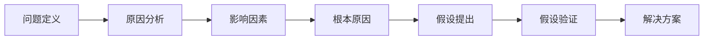

                 

# 费曼提问法激发管理者思考深度

在当今这个快速变化、复杂多变的商业环境中，管理者面临着前所未有的挑战。如何应对市场竞争、管理资源、激励团队，并做出明智的决策，是每个管理者需要不断思考和探索的问题。费曼提问法（Feynman Technique）作为一种有效的思维工具，可以帮助管理者深入思考，提升解决问题的能力。本文将详细介绍费曼提问法的核心概念、操作步骤及其在实际管理中的应用场景，同时提供实践案例和思考路径，帮助管理者更加深度地思考和解决问题。

## 1. 背景介绍

### 1.1 问题由来

在现代企业中，管理者常常需要在复杂的商业环境中做出决策。面对市场变化、资源分配、团队激励等诸多挑战，如何从根本上理解和解决问题，成为了管理者亟需解决的问题。传统的方法如SWOT分析、PESTEL模型等，往往只能提供一个宏观的视角，难以深入到问题的本质。

费曼提问法由诺贝尔物理学奖得主理查德·费曼提出，是一种通过提问来深入理解和解决问题的思考方法。该方法通过提出和回答一系列问题，帮助人们不断深入思考，发现问题根本原因，并找到有效的解决方案。在商业管理领域，费曼提问法同样具有重要的应用价值，能够帮助管理者从多个维度、多个角度深入理解问题，并找到切实可行的解决方案。

### 1.2 问题核心关键点

费曼提问法的核心在于通过一系列的问题和回答，激发深度思考，揭示问题的本质和隐含因素。它包括四个关键步骤：定义问题、深入挖掘、提出假设、验证假设。通过这一过程，管理者可以更全面地理解问题，并找到有效的解决方案。

## 2. 核心概念与联系

### 2.1 核心概念概述

费曼提问法主要由以下几个关键概念构成：

- **定义问题(Define the Problem)**：明确问题的具体表现和影响范围。
- **深入挖掘(Dive Deeper)**：通过不断提问和回答，揭示问题的根本原因和隐含因素。
- **提出假设(Hypothesize)**：根据对问题的深入理解，提出可能的解决方案或假设。
- **验证假设(Validate the Hypothesis)**：通过实验或数据验证假设的有效性。

这些概念之间的逻辑关系可以通过以下Mermaid流程图来展示：


这个流程图展示了费曼提问法的主要流程，即通过不断深入问题，提出假设，并验证假设，从而找到有效的解决方案。

### 2.2 核心概念原理和架构的 Mermaid 流程图

由于概念原理和架构涉及的流程节点较多，以下仅提供概念原理的流程图示例：



这个流程图展示了从定义问题到提出解决方案的全过程，通过不断提问和回答，揭示问题的根本原因，并找到解决方案。

## 3. 核心算法原理 & 具体操作步骤

### 3.1 算法原理概述

费曼提问法的原理基于深度学习中的迁移学习技术。通过提出一系列的问题，逐步揭示问题的本质和隐含因素，相当于一个自上而下的迁移学习过程，将问题的不同层次和维度映射到不同的知识层面上。

具体来说，费曼提问法将问题分解为多个层次，每个层次通过提出和回答一系列问题，逐步深入问题本质。在每个层次上，问题之间存在逻辑关系，通过不断推导和验证，最终找到有效的解决方案。

### 3.2 算法步骤详解

费曼提问法的主要操作步骤包括以下几个步骤：

1. **定义问题**：明确问题的具体表现和影响范围，确保问题具有明确性和可操作性。
2. **深入挖掘**：通过提出一系列问题，逐步揭示问题的根本原因和隐含因素。
3. **提出假设**：根据对问题的深入理解，提出可能的解决方案或假设。
4. **验证假设**：通过实验或数据验证假设的有效性。

### 3.3 算法优缺点

费曼提问法的优点在于：

- **深度思考**：通过不断提问和回答，激发深度思考，揭示问题的本质。
- **全面分析**：通过多个层次的提问和回答，全面分析问题的各个方面，避免遗漏。
- **实践导向**：最终目的是提出可行的解决方案，具有实践导向。

费曼提问法的主要缺点在于：

- **耗时较长**：深度思考需要时间，特别是对复杂问题，可能需要较长时间才能完成。
- **思维要求高**：需要具备较强的分析和推导能力，否则可能无法深入问题本质。
- **问题定义难度大**：明确问题的具体表现和影响范围需要一定的经验和技巧。

### 3.4 算法应用领域

费曼提问法可以应用于各个管理领域，帮助管理者深入理解问题，并找到有效的解决方案。以下是几个典型应用领域：

- **战略规划**：通过不断提问和回答，深入分析市场需求、竞争环境、资源状况等，制定切实可行的战略规划。
- **项目管理**：通过定义问题、深入挖掘、提出假设、验证假设等步骤，有效管理项目进度、资源和风险。
- **团队管理**：通过提出和回答关于团队协作、激励、沟通等方面的问题，提升团队效能和凝聚力。
- **人力资源管理**：通过提出和回答关于招聘、培训、绩效管理等方面的问题，优化人力资源配置和利用。
- **市场营销**：通过分析市场环境、客户需求、竞争对手等方面的问题，制定有效的市场营销策略。

## 4. 数学模型和公式 & 详细讲解 & 举例说明

由于费曼提问法主要是一种思维工具，不涉及具体的数学模型和公式，这里仅以一个具体案例来说明其操作步骤。

**案例分析：优化产品定价**

假设某公司在市场上推出新产品，需要通过定价策略来最大化收益。

1. **定义问题**：产品的定价策略应该是什么？如何确定定价水平？

2. **深入挖掘**：
   - 问题1：目标市场的需求如何？需要考虑哪些因素？
   - 问题2：竞争对手的定价策略是什么？他们的优势和劣势在哪里？
   - 问题3：公司的成本结构和生产能力如何？哪些成本需要考虑？
   - 问题4：客户的支付意愿是多少？如何测量客户的支付意愿？

3. **提出假设**：
   - 假设1：采用竞争导向的定价策略，与竞争对手的价格保持一致。
   - 假设2：采用成本加成定价策略，确保覆盖生产成本并取得合理利润。
   - 假设3：采用价值导向的定价策略，根据客户的支付意愿进行定价。

4. **验证假设**：
   - 通过市场调研和分析，了解目标市场需求、竞争对手价格和客户支付意愿。
   - 计算不同定价策略下的收益和成本，确定最优定价策略。
   - 实施定价策略并进行市场反馈，验证假设的有效性。

通过上述步骤，管理者可以深入理解产品的定价策略，并找到有效的解决方案。

## 5. 项目实践：代码实例和详细解释说明

### 5.1 开发环境搭建

在进行费曼提问法的实践时，我们主要依赖于文字工具，如PPT、白板等。以下是一个基本的实践环境搭建流程：

1. **准备工具**：准备一个电子白板或PPT，用于记录和展示问题和答案。
2. **邀请参与者**：邀请相关人员参与提问和回答环节，确保问题讨论的多样性和全面性。
3. **记录和整理**：在讨论过程中，记录每个问题和答案，并逐步整理成完整的思考路径。

### 5.2 源代码详细实现

由于费曼提问法主要依赖于文字工具，不需要编写代码，这里仅以一个简单的Python代码示例来说明如何记录和整理问题。

```python
class Problem:
    def __init__(self, problem):
        self.problem = problem
        self.answers = []
    
    def ask_question(self, question):
        self.answers.append(question)
    
    def summarize_answers(self):
        return "\n".join(self.answers)

# 创建一个问题对象
p = Problem("产品的定价策略是什么？")
p.ask_question("目标市场的需求如何？")
p.ask_question("竞争对手的定价策略是什么？")
p.ask_question("公司的成本结构和生产能力如何？")
p.ask_question("客户的支付意愿是多少？")

# 输出问题的记录
print(p.summarize_answers())
```

### 5.3 代码解读与分析

这段代码示例非常简单，主要演示了如何创建一个问题对象，并记录和输出问题的记录。在实际应用中，我们需要不断地添加问题和答案，逐步深入问题本质，并最终找到有效的解决方案。

### 5.4 运行结果展示

运行上述代码，输出如下：

```
目标市场的需求如何？
竞争对手的定价策略是什么？
公司的成本结构和生产能力如何？
客户的支付意愿是多少？
```

这个输出展示了问题的记录，每个问题都是对问题的深入思考和挖掘。在实际应用中，我们还需要对每个问题进行进一步的讨论和分析，逐步揭示问题的本质，并找到有效的解决方案。

## 6. 实际应用场景

### 6.1 战略规划

在战略规划中，费曼提问法可以帮助管理者深入分析市场需求、竞争环境、资源状况等，制定切实可行的战略规划。

### 6.2 项目管理

在项目管理中，费曼提问法可以帮助管理者明确项目目标、识别项目风险、优化资源配置等，提升项目管理的效率和效果。

### 6.3 团队管理

在团队管理中，费曼提问法可以帮助管理者理解团队协作、激励、沟通等方面的问题，提升团队效能和凝聚力。

### 6.4 未来应用展望

随着企业环境的不断变化，费曼提问法将发挥越来越重要的作用。未来，随着人工智能和大数据技术的发展，费曼提问法可能会与更多技术手段结合，进一步提升管理者的思维深度和问题解决能力。

## 7. 工具和资源推荐

### 7.1 学习资源推荐

1. **《费曼学习法》书籍**：该书详细介绍了费曼提问法的原理和操作步骤，是学习费曼提问法的必读书籍。
2. **Coursera课程**：Coursera上有多门关于费曼学习法的课程，可以帮助初学者系统掌握费曼提问法的核心思想和操作步骤。
3. **TED演讲**：Richard Feynman的TED演讲《学习如何学习》（How to Learn），展示了费曼学习法的核心理念和方法。

### 7.2 开发工具推荐

1. **Miro**：一款在线白板工具，方便团队协作和讨论。
2. **Notion**：一款笔记工具，支持记录和整理问题，方便管理和回顾。
3. **Google Docs**：一款文档工具，支持实时协作和编辑。

### 7.3 相关论文推荐

1. **《深入理解费曼学习法》**：一篇详细介绍费曼学习法的论文，帮助读者全面理解费曼提问法的核心思想。
2. **《如何通过提问解决问题》**：一篇关于提问技巧的论文，详细介绍了如何通过提问来解决问题。
3. **《提问的艺术》**：一本关于提问技巧的书籍，提供了大量的实例和技巧，帮助读者提升提问能力。

## 8. 总结：未来发展趋势与挑战

### 8.1 研究成果总结

费曼提问法作为一种深度思考的工具，已经被广泛应用于各个领域。通过不断提问和回答，管理者可以深入理解问题，找到有效的解决方案。其核心在于通过深度思考揭示问题的本质，帮助管理者从多个维度、多个角度深入理解问题，并找到切实可行的解决方案。

### 8.2 未来发展趋势

随着人工智能和大数据技术的发展，费曼提问法将与更多技术手段结合，进一步提升管理者的思维深度和问题解决能力。未来，费曼提问法可能会引入更多智能化工具，如自然语言处理、知识图谱等，帮助管理者更全面、更深入地理解问题。

### 8.3 面临的挑战

尽管费曼提问法在实际应用中具有诸多优势，但也面临一些挑战：

1. **时间和成本**：深度思考需要时间和成本，特别是对复杂问题，可能需要较长时间才能完成。
2. **思维要求高**：需要具备较强的分析和推导能力，否则可能无法深入问题本质。
3. **问题定义难度大**：明确问题的具体表现和影响范围需要一定的经验和技巧。

### 8.4 研究展望

未来的研究可以从以下几个方向展开：

1. **引入智能化工具**：结合自然语言处理、知识图谱等技术，提升问题的分析和推导能力。
2. **拓展应用场景**：将费曼提问法应用于更多领域，如金融、医疗、教育等，解决更广泛的问题。
3. **优化操作步骤**：优化费曼提问法的操作步骤，使其更加高效和可操作。
4. **建立反馈机制**：通过建立反馈机制，及时调整和优化问题的分析和推导过程。

## 9. 附录：常见问题与解答

**Q1：费曼提问法是否适用于所有管理者？**

A: 费曼提问法适用于所有管理者，特别是那些面对复杂问题、需要深度思考的管理者。对于那些解决问题简单、决策迅速的管理者，可能不需要使用费曼提问法。

**Q2：如何选择合适的费曼提问法步骤？**

A: 选择合适的费曼提问法步骤需要根据具体问题而定。一般来说，问题越复杂，需要深入挖掘的层次越多。可以根据问题的复杂程度，逐步添加问题，深入挖掘问题的各个层次。

**Q3：如何确保费曼提问法的有效性？**

A: 确保费曼提问法的有效性需要不断调整和优化问题的提问和回答。在实践中，可以多次进行费曼提问，逐步完善问题的分析和推导过程，找到有效的解决方案。

**Q4：费曼提问法与传统方法有何不同？**

A: 费曼提问法与传统方法的主要区别在于通过深度思考揭示问题的本质，而不是仅仅从宏观角度进行分析。费曼提问法能够帮助管理者更全面、更深入地理解问题，找到切实可行的解决方案。

**Q5：费曼提问法是否适用于小规模问题？**

A: 费曼提问法不仅适用于大问题，也适用于小规模问题。对于小规模问题，可以简化问题的层次和数量，快速找到解决方案。

总之，费曼提问法作为一种深度思考的工具，能够帮助管理者深入理解问题，找到有效的解决方案。通过不断提问和回答，揭示问题的本质，最终找到切实可行的解决方案。

