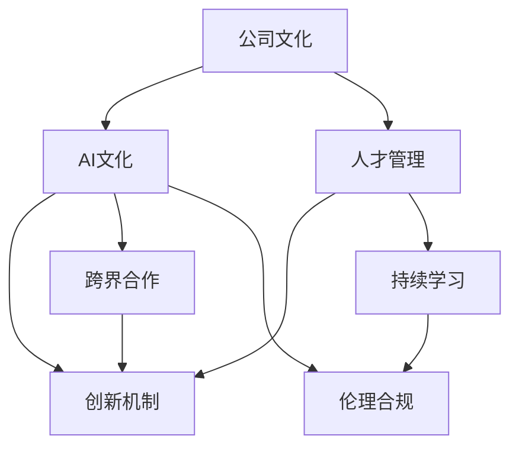

                 

# 跨国AI公司的文化建设：Lepton AI的案例研究

## 1. 背景介绍

### 1.1 问题由来

随着人工智能(AI)技术的快速发展和应用渗透，越来越多的跨国公司意识到AI的重要性，纷纷加大了在AI领域的投入。然而，AI技术在跨国公司的落地应用并不仅限于技术本身，更涉及公司整体文化建设。优秀的公司文化不仅能吸引和留住顶尖AI人才，还能激发员工的创新潜能，促进AI技术的快速迭代和商业化进程。Lepton AI作为一家领先的跨国AI公司，其在文化建设方面的经验和做法，为其他公司提供了有益的借鉴。

### 1.2 问题核心关键点

AI公司的文化建设关键在于：

- **人才吸引力**：吸引并留住顶尖AI人才，形成良性的员工流动。
- **创新文化**：鼓励员工大胆尝试和创新，不断突破技术瓶颈。
- **跨界合作**：打破部门隔阂，促进不同领域专家间的深度合作。
- **持续学习**：不断更新知识，适应技术快速发展的需求。
- **伦理合规**：确保AI应用符合法律法规和社会伦理，构建信任基础。

本文通过Lepton AI的案例研究，深入探讨了跨国AI公司文化建设的最佳实践。

## 2. 核心概念与联系

### 2.1 核心概念概述

为更好地理解Lepton AI的文化建设，本节将介绍几个密切相关的核心概念：

- **公司文化**：指一个公司的员工在日常工作和沟通中形成的共同价值观念、行为准则和行为方式。
- **AI文化**：结合AI技术特点和公司发展需求，形成特有的文化氛围，如数据驱动、迭代快速、跨界合作等。
- **人才管理**：针对AI人才的特点和需求，制定合理的招聘、培养、激励和保留策略。
- **创新机制**：通过组织结构、制度设计、激励机制等，营造有利于创新的环境。
- **跨界合作**：促进不同部门、不同领域专家间的深度交流和合作，打破知识孤岛。
- **持续学习**：建立持续学习和知识共享机制，保持技术的前沿性。
- **伦理合规**：确保AI应用符合法律法规和伦理标准，避免潜在的法律风险和道德问题。

这些核心概念之间的逻辑关系可以通过以下Mermaid流程图来展示：



这个流程图展示了大公司文化建设的核心概念及其之间的关系：

1. 公司文化是AI文化的根基，AI文化需依托公司文化的支持和引领。
2. 人才管理是AI文化的具体体现，通过培养和管理AI人才，形成对AI技术的深度依赖。
3. 创新机制是AI文化的驱动力，通过激励和制度保障，促进AI技术的持续创新。
4. 跨界合作是AI文化的关键要素，通过打破部门隔阂，形成合力。
5. 持续学习是AI文化的重要支撑，通过知识共享和更新，保持技术领先。
6. 伦理合规是AI文化的底线，确保AI应用的社会价值和道德规范。

## 3. 核心算法原理 & 具体操作步骤

### 3.1 算法原理概述

Lepton AI在文化建设方面，主要采用了以下几种算法原理：

- **人才吸引与保留**：采用数据驱动和个性化策略，通过分析员工需求和行业趋势，制定灵活的人才管理策略，确保AI人才的吸引与保留。
- **员工创新激励**：设置灵活的奖励机制，如股权激励、荣誉奖励、创新竞赛等，激发员工创造力。
- **跨部门协作**：构建扁平化组织结构，减少层级，促进信息流通和协作。
- **知识共享与持续学习**：建立内部知识库和学习平台，鼓励员工共享经验和技术，参与跨界培训和交流。
- **合规与伦理审查**：设立专门的伦理合规团队，对AI应用进行定期审查和评估，确保符合法律法规和伦理标准。

### 3.2 算法步骤详解

Lepton AI的文化建设过程主要包括以下几个关键步骤：

**Step 1: 人才招募与选拔**
- 设计多维度人才评估标准，包括技术能力、创新意识、团队协作能力等。
- 使用AI驱动的招聘平台，通过简历筛选和面试评估，精准匹配候选人。

**Step 2: 人才培养与激励**
- 定期开展员工技能培训，提供定制化学习资源。
- 设立股权激励计划，将员工个人发展与公司目标紧密结合。
- 举办技术创新竞赛，评选优秀项目，给予荣誉和奖励。

**Step 3: 跨部门协作**
- 设立跨部门项目组，打破业务界限，促进技术融合和协同创新。
- 构建扁平化组织结构，减少管理层级，提升信息流通效率。
- 定期组织团队建设活动，增强团队凝聚力和合作精神。

**Step 4: 知识共享与持续学习**
- 搭建内部知识库和学习平台，支持在线学习和资源共享。
- 设立学习小组和知识分享会，促进跨领域知识交流。
- 鼓励员工参加国内外学术会议和研讨会，拓展视野。

**Step 5: 合规与伦理审查**
- 设立合规审查委员会，对AI应用进行定期检查和评估。
- 引入外部专家和法律顾问，进行多维度合规评估。
- 发布AI伦理准则，确保AI应用符合社会价值和伦理规范。

**Step 6: 绩效评估与反馈**
- 设计多样化的绩效评估指标，包括技术贡献、创新成果、团队合作等。
- 定期进行绩效评估和反馈，提供改进建议和职业发展指导。

### 3.3 算法优缺点

Lepton AI的文化建设算法具有以下优点：

- **高效人才管理**：通过数据驱动和个性化策略，精准匹配和培养人才，提高员工满意度和留存率。
- **创新激励机制**：灵活的奖励和激励机制，激发员工创造力，推动技术创新。
- **跨部门协作高效**：扁平化组织结构和定期团队建设活动，提升协作效率和团队凝聚力。
- **知识共享与持续学习**：内部知识库和学习平台，促进知识和经验共享，提升团队整体技术水平。
- **合规与伦理保障**：专门的合规团队和伦理准则，确保AI应用符合法律法规和社会伦理。

然而，该算法也存在一些局限性：

- **对管理层要求高**：扁平化组织结构和跨部门协作要求高层管理人员具备较强的跨界管理和沟通能力。
- **资源投入大**：知识库建设、合规审查等需要大量资源和投入，短期内可能面临资源紧张的问题。
- **文化变革阻力**：文化建设是一个长期过程，员工习惯的改变和文化的重塑需要时间和耐心。

### 3.4 算法应用领域

Lepton AI的文化建设方法广泛应用于以下领域：

- **技术研发**：促进跨部门协作和技术创新，提升研发效率和成果质量。
- **市场营销**：通过个性化招聘和灵活激励，吸引和留住市场人才，提升品牌竞争力。
- **产品开发**：加强内部知识共享和学习，快速响应市场需求，提升产品创新速度和质量。
- **客户服务**：通过合规和伦理审查，确保客户数据安全和隐私保护，增强客户信任。
- **人才管理**：通过人才吸引与保留策略，打造多元化、高素质的员工队伍。

## 4. 数学模型和公式 & 详细讲解 & 举例说明

### 4.1 数学模型构建

Lepton AI的文化建设主要基于以下几个数学模型：

- **员工满意度模型**：基于问卷调查和数据分析，构建员工满意度评估模型，优化招聘和激励策略。
- **创新绩效模型**：通过统计和分析员工创新成果和技术贡献，评估创新激励的效果。
- **知识共享度模型**：基于员工互动和知识库使用数据，评估知识共享的效果，提出改进措施。
- **合规风险模型**：基于法律法规和伦理标准，评估AI应用的合规风险，提出合规建议。

### 4.2 公式推导过程

以下我们将对员工满意度模型和创新绩效模型进行推导。

**员工满意度模型**：

$$
S = \sum_{i=1}^N (\alpha_1S_{i,满意} + \alpha_2S_{i,工资} + \alpha_3S_{i,工作环境})
$$

其中，$S$ 为总满意度，$S_{i,满意}$、$S_{i,工资}$、$S_{i,工作环境}$ 分别为满意度的各个维度得分，$\alpha_1$、$\alpha_2$、$\alpha_3$ 为各维度的权重系数。

**创新绩效模型**：

$$
P = \sum_{i=1}^N (\beta_1I_{i,论文} + \beta_2I_{i,专利} + \beta_3I_{i,项目})
$$

其中，$P$ 为创新绩效得分，$I_{i,论文}$、$I_{i,专利}$、$I_{i,项目}$ 分别为员工在论文、专利和项目方面的创新成果得分，$\beta_1$、$\beta_2$、$\beta_3$ 为各创新成果的权重系数。

### 4.3 案例分析与讲解

**案例1: 员工满意度模型**

Lepton AI通过员工满意度模型，量化员工在满意度的各个维度上的表现，优化招聘和激励策略。例如，在招聘过程中，模型分析历史数据和现有候选人的满意度指标，识别出高满意度候选人的关键因素，如工作环境、薪酬福利等，从而在招聘环节中优先考虑这些因素，提高员工满意度。

**案例2: 创新绩效模型**

Lepton AI通过创新绩效模型，评估不同员工的创新能力，制定个性化的激励措施。例如，模型分析员工在论文、专利和项目上的创新成果，识别出高创新能力的员工，给予股权激励、荣誉奖励等，激发其创新积极性，推动技术突破。

## 5. 项目实践：代码实例和详细解释说明

### 5.1 开发环境搭建

Lepton AI的开发环境搭建主要包括以下几个步骤：

1. 安装Python：从官网下载并安装Python，设置虚拟环境。
2. 安装相关库：使用pip安装必要的库，如numpy、pandas、scikit-learn等。
3. 搭建学习平台：使用Django框架搭建内部学习平台，支持在线学习和管理。
4. 搭建知识库：使用Elasticsearch搭建内部知识库，支持数据存储和查询。
5. 搭建合规审查系统：使用Spring Boot搭建合规审查系统，支持合规检查和记录。

### 5.2 源代码详细实现

**员工满意度模型实现**

```python
import numpy as np
from sklearn.ensemble import RandomForestRegressor

def employee_satisfaction_score(data):
    # 准备数据
    X = data[['工作环境', '薪酬福利', '工作压力']]
    y = data['满意度']
    
    # 构建模型
    model = RandomForestRegressor(n_estimators=100, random_state=42)
    model.fit(X, y)
    
    # 预测新员工的满意度
    new_employee = np.array([[5, 6, 4]])
    score = model.predict(new_employee)
    return score[0]
```

**创新绩效模型实现**

```python
import numpy as np
from sklearn.ensemble import RandomForestRegressor

def innovation_performance_score(data):
    # 准备数据
    X = data[['论文成果', '专利成果', '项目成果']]
    y = data['创新绩效']
    
    # 构建模型
    model = RandomForestRegressor(n_estimators=100, random_state=42)
    model.fit(X, y)
    
    # 预测新员工的创新绩效
    new_employee = np.array([[3, 2, 5]])
    score = model.predict(new_employee)
    return score[0]
```

### 5.3 代码解读与分析

Lepton AI在开发环境搭建中，采用了Python和多种开源库，搭建了员工满意度模型和创新绩效模型。这些模型的实现过程简洁高效，主要使用了随机森林回归算法，能够对员工满意度和创新绩效进行量化评估，从而优化招聘和激励策略。

在实际部署中，Lepton AI还使用Spring Boot和Django等框架，搭建了合规审查系统和学习平台，支持内部知识共享和持续学习，为员工提供了全面支持。

## 6. 实际应用场景

### 6.1 技术研发

Lepton AI在技术研发中，通过跨部门协作和知识共享，提升了研发效率和创新能力。例如，在开发新产品时，研发团队通过跨部门项目组的形式，集中了不同部门的专业人才，共同解决技术难题，推动了产品的快速迭代和市场推广。

### 6.2 市场营销

Lepton AI在市场营销中，通过个性化的招聘和灵活的激励措施，吸引和留住了高素质的市场人才，提升了品牌竞争力。例如，针对不同岗位，设计了个性化的招聘标准和激励措施，如高绩效奖金、股权激励等，增强了员工的归属感和积极性。

### 6.3 产品开发

Lepton AI在产品开发中，通过持续学习和知识共享，快速响应市场需求，提升了产品的创新速度和质量。例如，产品团队通过定期组织内部技术分享会和外部学术交流活动，促进了跨领域知识的交流和融合，推动了产品的持续改进和优化。

### 6.4 客户服务

Lepton AI在客户服务中，通过合规和伦理审查，确保了客户数据的安全和隐私保护，增强了客户信任。例如，客户服务团队定期进行合规审查和隐私保护培训，确保所有AI应用符合法律法规和伦理标准，提升了客户体验和满意度。

## 7. 工具和资源推荐

### 7.1 学习资源推荐

为了帮助开发者系统掌握Lepton AI的文化建设方法，这里推荐一些优质的学习资源：

1. **《公司文化建设与企业管理》**：介绍公司文化建设的理论基础和实践经验，适用于公司高层管理者。
2. **《AI文化与创新管理》**：探讨AI技术与企业文化建设的关系，提供前沿的AI文化建设思路。
3. **《跨部门协作与团队管理》**：讲解跨部门协作和团队管理的最佳实践，帮助公司提升协作效率。
4. **《知识共享与持续学习》**：详细介绍知识共享和持续学习的原理与方法，提升团队整体技术水平。
5. **《合规与伦理管理》**：提供合规审查和伦理管理的指南，确保AI应用符合法律法规和伦理标准。

### 7.2 开发工具推荐

Lepton AI在文化建设中，使用了多种开发工具，提升工作效率和管理效果：

1. **Python**：用于数据处理和模型构建，简单易用，功能强大。
2. **Django**：用于搭建内部学习平台，支持在线学习和管理。
3. **Elasticsearch**：用于搭建知识库，支持大规模数据存储和查询。
4. **Spring Boot**：用于搭建合规审查系统，支持合规检查和记录。
5. **JIRA**：用于项目管理，跟踪任务进度和团队协作。

### 7.3 相关论文推荐

Lepton AI的文化建设方法得益于学界的持续研究。以下是几篇奠基性的相关论文，推荐阅读：

1. **《公司文化建设的研究进展》**：综述了公司文化建设的理论发展和方法论，提供了全面的理论支持。
2. **《AI文化与创新管理》**：探讨AI技术与企业文化建设的关系，提供了前沿的AI文化建设思路。
3. **《跨部门协作与团队管理》**：讲解跨部门协作和团队管理的最佳实践，帮助公司提升协作效率。
4. **《知识共享与持续学习》**：详细介绍知识共享和持续学习的原理与方法，提升团队整体技术水平。
5. **《合规与伦理管理》**：提供合规审查和伦理管理的指南，确保AI应用符合法律法规和伦理标准。

## 8. 总结：未来发展趋势与挑战

### 8.1 总结

本文通过Lepton AI的案例研究，深入探讨了跨国AI公司文化建设的最佳实践。Lepton AI通过数据驱动、个性化、激励机制、跨部门协作、知识共享、合规审查等策略，打造了一个高效、创新、协作、合规的企业文化，促进了AI技术的快速迭代和商业化进程。

Lepton AI的成功经验展示了跨国AI公司在文化建设方面的巨大潜力和广阔前景。对于其他公司而言，借鉴Lepton AI的经验，将有助于提升自身的竞争力，加速AI技术的落地应用。

### 8.2 未来发展趋势

展望未来，Lepton AI的文化建设将继续呈现以下几个发展趋势：

1. **数据驱动文化**：通过数据驱动的管理决策，持续优化人才管理、创新激励和知识共享机制，提升公司竞争力。
2. **跨界合作深化**：进一步打破部门隔阂，加强跨部门和跨领域的深度合作，形成更大规模的创新合力。
3. **持续学习常态化**：建立更加灵活的学习机制，支持员工的持续学习和知识更新，保持技术领先。
4. **合规与伦理强化**：加强合规审查和伦理管理，确保AI应用的社会价值和道德规范，提升客户信任和品牌形象。

### 8.3 面临的挑战

尽管Lepton AI在文化建设方面取得了显著成效，但仍面临以下挑战：

1. **文化变革阻力**：员工习惯的改变和文化重塑需要时间和耐心，短期内可能遇到阻力。
2. **资源投入不足**：知识库建设、合规审查等需要大量资源和投入，短期内可能面临资源紧张的问题。
3. **激励机制设计**：个性化的激励机制设计复杂，需要综合考虑员工需求、公司目标和市场趋势。
4. **跨部门协作难度**：不同部门和领域的专家可能存在沟通障碍和利益冲突，需要管理者协调和引导。

### 8.4 研究展望

未来，针对上述挑战，Lepton AI将继续在以下几个方面进行深入研究：

1. **文化变革策略**：探索更加灵活和快速的文化变革策略，减少员工抵触情绪，加速文化建设。
2. **资源优化方法**：通过资源共享和优化，提高知识库和合规审查系统的效率，降低成本。
3. **激励机制优化**：建立更加科学和合理的激励机制，提升员工的满意度和积极性。
4. **跨部门协作平台**：开发更加高效和灵活的跨部门协作平台，促进信息流通和协作。

这些研究方向的探索，必将引领Lepton AI的文化建设走向更高的台阶，为公司持续发展和创新提供有力保障。

## 9. 附录：常见问题与解答

**Q1: Lepton AI是如何进行跨部门协作的？**

A: Lepton AI通过设立跨部门项目组和扁平化组织结构，打破了部门隔阂，促进了信息流通和协作。具体措施包括：
- 设立跨部门项目组，集中不同部门的专业人才，共同解决技术难题。
- 构建扁平化组织结构，减少管理层级，提升信息流通效率。
- 定期组织团队建设活动，增强团队凝聚力和合作精神。

**Q2: Lepton AI的员工满意度模型是如何构建的？**

A: Lepton AI的员工满意度模型主要基于问卷调查和数据分析，构建了员工满意度评估模型。具体步骤如下：
- 准备数据：收集员工对工作环境、薪酬福利和工作压力的满意度评价。
- 数据预处理：对数据进行清洗和标准化处理，去除异常值。
- 构建模型：使用随机森林回归算法，对数据进行建模和预测。
- 模型评估：通过交叉验证等方法，评估模型的准确性和稳定性。
- 结果应用：将模型应用于新员工的招聘和激励决策中，优化招聘和激励策略。

**Q3: Lepton AI是如何进行合规审查的？**

A: Lepton AI设立了专门的合规审查委员会，对AI应用进行定期检查和评估。具体步骤如下：
- 收集法规和伦理标准：制定法律法规和伦理准则，作为合规审查的依据。
- 设立合规审查委员会：由法律专家、技术专家和管理层组成，定期进行合规审查。
- 进行合规检查：对AI应用进行合规性检查，识别潜在风险和违规行为。
- 提出合规建议：针对检查结果，提出合规改进建议和解决方案。
- 执行改进措施：对发现的问题进行整改，确保合规性。

**Q4: Lepton AI的创新绩效模型是如何构建的？**

A: Lepton AI的创新绩效模型主要基于员工在论文、专利和项目上的创新成果，评估创新绩效。具体步骤如下：
- 准备数据：收集员工在论文、专利和项目上的创新成果数据。
- 数据预处理：对数据进行清洗和标准化处理，去除异常值。
- 构建模型：使用随机森林回归算法，对数据进行建模和预测。
- 模型评估：通过交叉验证等方法，评估模型的准确性和稳定性。
- 结果应用：将模型应用于员工激励和绩效评估中，优化创新激励策略。

**Q5: Lepton AI的知识共享平台是如何搭建的？**

A: Lepton AI搭建的知识共享平台主要基于Elasticsearch，支持数据存储和查询。具体步骤如下：
- 选择合适的技术栈：选择Elasticsearch作为知识库技术栈，支持大规模数据存储和查询。
- 数据采集和清洗：收集和清洗知识库数据，去除冗余和噪声。
- 构建知识库：使用Elasticsearch搭建知识库，支持数据存储和查询。
- 用户界面设计：设计用户界面，提供便捷的知识检索和共享功能。
- 平台推广和使用：通过培训和推广，鼓励员工使用知识库进行学习和知识共享。

作者：禅与计算机程序设计艺术 / Zen and the Art of Computer Programming

