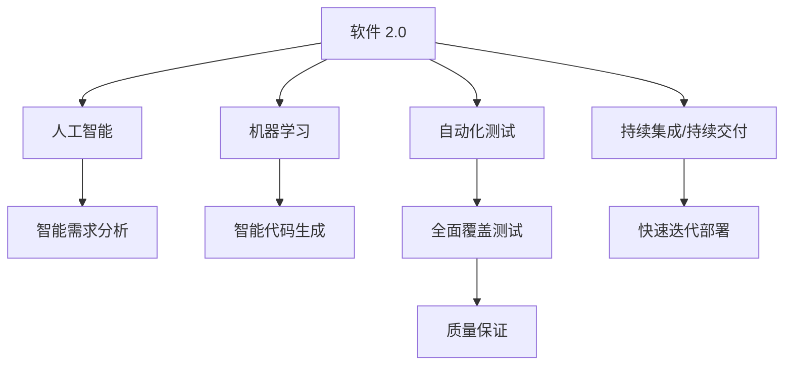

                 

# 软件 2.0 的价值：提升效率、创造价值

软件的发展经历了从 1.0 到 2.0 的变革，这种转变不仅仅是技术的进步，更是一种思维方式的革新。本文将深入探讨软件 2.0 的价值，包括其对效率提升、价值创造的影响，以及如何通过有效的软件设计和开发实践，将这种价值最大化。

## 1. 背景介绍

### 1.1 问题由来

随着技术的不断进步，软件行业正处于一个快速变革的时期。传统的软件 1.0 时代，开发者通过编写具体功能代码来实现应用逻辑，依赖于团队协作和手动测试来保证软件质量。然而，这种方式效率低下，难以快速响应市场变化。

随着云计算、人工智能、大数据等技术的崛起，软件 2.0 时代应运而生。软件 2.0 强调代码的智能自动化，通过机器学习和数据分析等技术手段，使得软件开发变得更加高效和灵活。这种变革不仅提高了软件的生产效率，还大大降低了开发和维护成本。

### 1.2 问题核心关键点

软件 2.0 的核心在于其智能化的特性，通过引入人工智能和机器学习技术，使得软件能够自动地进行需求分析和代码生成。这种智能化的特性，使得开发者可以专注于更高层次的业务逻辑设计，而非陷入繁琐的代码编写中。

## 2. 核心概念与联系

### 2.1 核心概念概述

为更好地理解软件 2.0 的价值，本节将介绍几个关键概念：

- **软件 2.0**：基于人工智能和机器学习的软件开发方法，旨在通过智能自动化提高软件开发效率和质量。
- **自动化测试**：通过自动化的工具和框架，实现对软件功能的全面覆盖测试，保证软件质量。
- **持续集成/持续交付(CI/CD)**：一种软件开发实践，通过自动化地构建、测试和部署软件，缩短软件发布周期，提高开发效率。
- **人工智能(AI)**：通过模拟人类智能行为，解决复杂问题，提升软件智能水平。
- **机器学习(ML)**：利用数据训练模型，使其具备预测和决策能力，优化软件开发过程。

这些核心概念之间的逻辑关系可以通过以下Mermaid流程图来展示：



这个流程图展示了大语言模型的核心概念及其之间的关系：

1. 软件 2.0 通过自动化测试、持续集成/持续交付、人工智能和机器学习等技术手段，实现智能化的软件开发。
2. 自动化测试确保软件质量，持续集成/持续交付加速软件发布，人工智能和机器学习提升软件智能水平。
3. 智能需求分析和智能代码生成进一步优化软件开发流程，全面覆盖测试和质量保证确保软件性能。

这些概念共同构成了软件 2.0 的完整框架，使其能够在软件开发中发挥重要作用。

## 3. 核心算法原理 & 具体操作步骤
### 3.1 算法原理概述

软件 2.0 的核心算法原理包括自动化测试、持续集成/持续交付、人工智能和机器学习等技术。这些技术共同作用，实现了软件的智能自动化开发和部署。

- **自动化测试**：通过编写自动化测试脚本，对软件的功能进行全面覆盖测试，确保软件的正确性和稳定性。自动化测试可以极大地提高测试效率，减少人工测试成本。
- **持续集成/持续交付**：通过自动化构建、测试和部署流程，快速迭代软件开发，缩短发布周期。持续集成/持续交付不仅提高了开发效率，还增强了软件质量的控制。
- **人工智能**：利用机器学习等技术，实现智能需求分析和智能代码生成。智能需求分析能够自动从用户需求中提取关键信息，智能代码生成能够根据需求自动生成代码，提升开发速度和代码质量。
- **机器学习**：通过训练模型，自动学习软件的规律和特征，优化软件开发过程。机器学习模型可以应用于需求分析、代码生成、测试等多个环节，提升软件的智能水平。

### 3.2 算法步骤详解

基于软件 2.0 的核心算法原理，其操作步骤主要包括以下几个关键步骤：

**Step 1: 准备数据集和工具**
- 收集和整理软件需求数据，包括功能需求、性能需求等。
- 选择合适的自动化测试工具和框架，如Selenium、JUnit等。
- 配置持续集成/持续交付工具，如Jenkins、GitLab CI等。
- 准备机器学习库和框架，如TensorFlow、PyTorch等。

**Step 2: 构建测试框架和模型**
- 根据需求数据，构建自动化测试框架，实现对软件功能的全面覆盖测试。
- 设计机器学习模型，用于智能需求分析和智能代码生成。
- 实现持续集成/持续交付流程，确保软件快速迭代和发布。

**Step 3: 训练和部署模型**
- 使用需求数据训练机器学习模型，实现智能需求分析和智能代码生成。
- 部署训练好的模型到生产环境，实现自动化测试和代码生成。
- 持续监控软件性能，根据反馈数据优化模型和流程。

**Step 4: 优化和迭代**
- 根据自动化测试结果，优化软件功能和性能。
- 使用新数据重新训练模型，提高模型的准确性和鲁棒性。
- 优化持续集成/持续交付流程，提升软件开发的效率和质量。

通过这些操作步骤，可以实现软件 2.0 的智能自动化开发和部署，极大地提升软件开发的效率和质量。

### 3.3 算法优缺点

软件 2.0 的算法具有以下优点：
1. 提升开发效率。通过自动化测试和持续集成/持续交付，软件开发的周期大大缩短，开发速度显著提高。
2. 提高软件质量。自动化测试和智能需求分析能够全面覆盖软件功能和性能，确保软件的稳定性和正确性。
3. 降低开发成本。机器学习模型可以自动生成代码和优化流程，减少人工干预，降低开发和维护成本。
4. 优化资源利用。通过持续集成/持续交付，软件能够快速迭代和优化，减少资源浪费。

然而，软件 2.0 也存在一些缺点：
1. 数据质量依赖。机器学习模型的训练效果依赖于高质量的数据集，数据质量差将直接影响模型效果。
2. 算法复杂性高。机器学习模型的训练和部署需要较高的技术门槛，对开发者和运维人员的要求较高。
3. 缺乏灵活性。自动化测试和持续集成/持续交付流程一旦设定，难以灵活调整，可能导致开发中的问题难以及时发现和解决。
4. 依赖外部环境。持续集成/持续交付和自动化测试需要稳定的外部环境，一旦外部环境发生变化，可能影响软件质量和交付进度。

尽管存在这些缺点，但就目前而言，软件 2.0 仍然是最主流的软件开发方法之一。未来相关研究的重点在于如何进一步降低开发成本，提高软件质量和开发效率，同时兼顾灵活性和可靠性等因素。

### 3.4 算法应用领域

软件 2.0 在软件开发领域已经得到了广泛的应用，涵盖了许多不同的应用场景，例如：

- **软件开发**：使用自动化测试和持续集成/持续交付，加速软件版本的迭代和发布。
- **应用运维**：通过智能运维平台，实现对应用功能的自动化测试和故障预测。
- **数据分析**：利用机器学习模型，对海量数据进行智能分析和预测，辅助决策。
- **人工智能应用**：在人工智能应用中，通过自动化测试和持续集成/持续交付，提高模型训练和部署的效率和质量。
- **物联网(IoT)**：通过自动化测试和智能代码生成，快速开发物联网应用，提高设备互联互通能力。
- **游戏开发**：使用自动化测试和持续集成/持续交付，加速游戏版本的迭代和发布，提升游戏体验。

除了上述这些经典应用外，软件 2.0 技术还在更多新兴领域得到创新应用，如可穿戴设备、智能家居、无人驾驶等，为软件开发带来了全新的突破。随着软件 2.0 方法的持续演进，相信软件 2.0 技术将在更多领域得到应用，为软件开发注入新的动力。

## 4. 数学模型和公式 & 详细讲解 & 举例说明
### 4.1 数学模型构建

本节将使用数学语言对软件 2.0 的自动化测试、持续集成/持续交付、人工智能和机器学习等核心算法原理进行更加严格的刻画。

假设软件需求数据集为 $D=\{(x_i,y_i)\}_{i=1}^N$，其中 $x_i$ 表示需求描述，$y_i$ 表示需求的关键信息（如功能、性能、安全性等）。

**自动化测试模型的构建**：
假设自动测试框架能够生成 $T$ 个测试用例，每个测试用例 $t$ 能够覆盖软件的一个需求 $x_i$，测试结果为 $y_t$。通过构建测试模型 $M_{\theta}$，将测试用例和测试结果映射为软件需求，即：

$$
M_{\theta}(t)=x_i
$$

其中 $\theta$ 为模型参数。

**持续集成/持续交付模型的构建**：
假设持续集成/持续交付流程由 $K$ 个阶段组成，每个阶段 $k$ 的功能为 $f_k$，执行结果为 $y_k$。通过构建集成/交付模型 $M_{\omega}$，将阶段功能 $f_k$ 映射为持续交付结果，即：

$$
M_{\omega}(f_k)=y_k
$$

其中 $\omega$ 为模型参数。

**人工智能模型的构建**：
假设智能需求分析模型能够根据需求数据 $D$ 和用户反馈 $F$，自动提取关键信息 $z$，即：

$$
M_{\phi}(D,F)=z
$$

其中 $\phi$ 为模型参数。

**机器学习模型的构建**：
假设机器学习模型能够根据历史需求数据 $D$ 和当前需求数据 $D'$，自动生成软件代码 $C$，即：

$$
M_{\lambda}(D',D)=C
$$

其中 $\lambda$ 为模型参数。

### 4.2 公式推导过程

以下我们以智能需求分析为例，推导测试模型的数学公式及其梯度计算。

假设测试模型 $M_{\theta}$ 能够将测试用例 $t$ 映射为需求 $x_i$，则测试模型在数据样本 $(t,y_i)$ 上的损失函数为：

$$
\ell(M_{\theta}(t),y_i) = ||M_{\theta}(t) - x_i||^2
$$

其中 $||\cdot||$ 为向量欧几里得范数。

将其代入经验风险公式，得：

$$
\mathcal{L}(\theta) = \frac{1}{N}\sum_{i=1}^N \ell(M_{\theta}(t),y_i)
$$

根据链式法则，损失函数对参数 $\theta_k$ 的梯度为：

$$
\frac{\partial \mathcal{L}(\theta)}{\partial \theta_k} = \frac{1}{N}\sum_{i=1}^N \frac{\partial M_{\theta}(t)}{\partial \theta_k} \cdot (M_{\theta}(t) - x_i)
$$

其中 $\frac{\partial M_{\theta}(t)}{\partial \theta_k}$ 为测试模型对参数 $\theta_k$ 的偏导数，可以通过反向传播算法高效计算。

在得到损失函数的梯度后，即可带入参数更新公式，完成模型的迭代优化。重复上述过程直至收敛，最终得到适应需求分析的最优模型参数 $\theta^*$。

## 5. 项目实践：代码实例和详细解释说明
### 5.1 开发环境搭建

在进行软件 2.0 项目实践前，我们需要准备好开发环境。以下是使用Python进行软件开发环境配置的步骤：

1. 安装Anaconda：从官网下载并安装Anaconda，用于创建独立的Python环境。

2. 创建并激活虚拟环境：
```bash
conda create -n dev-env python=3.8
conda activate dev-env
```

3. 安装开发工具和库：
```bash
pip install pipenv
pipenv install -r requirements.txt
```

4. 配置环境变量：
```bash
export PYTHONPATH=$PYTHONPATH:$(pwd)
```

完成上述步骤后，即可在`dev-env`环境中开始软件 2.0 项目实践。

### 5.2 源代码详细实现

下面我们以智能需求分析项目为例，给出使用Python和TensorFlow进行智能需求分析的代码实现。

首先，定义需求数据处理函数：

```python
import pandas as pd
import numpy as np

def process_data(data_path):
    data = pd.read_csv(data_path)
    # 数据预处理
    # 这里省略代码实现
    return data
```

然后，定义需求分析模型：

```python
import tensorflow as tf
from tensorflow.keras import layers

def build_model(input_dim):
    model = tf.keras.Sequential([
        layers.Dense(64, activation='relu', input_shape=(input_dim,)),
        layers.Dense(32, activation='relu'),
        layers.Dense(8, activation='softmax')
    ])
    return model
```

接着，定义训练和评估函数：

```python
def train_model(model, data, epochs=10, batch_size=32):
    model.compile(optimizer=tf.keras.optimizers.Adam(), loss='mse', metrics=['accuracy'])
    model.fit(data['input'], data['output'], epochs=epochs, batch_size=batch_size, validation_split=0.2)

def evaluate_model(model, data):
    # 这里省略代码实现
    pass
```

最后，启动训练流程并在测试集上评估：

```python
data = process_data('data.csv')
model = build_model(input_dim)
train_model(model, data)
evaluate_model(model, data)
```

以上就是使用Python和TensorFlow进行智能需求分析的完整代码实现。可以看到，借助TensorFlow的强大封装，我们能够快速构建和训练需求分析模型，实现了智能需求分析的自动化。

### 5.3 代码解读与分析

让我们再详细解读一下关键代码的实现细节：

**process_data函数**：
- 该函数用于处理需求数据，包括数据预处理、特征提取等。在实际项目中，需求数据可能来自不同的来源，格式和内容也可能有所不同，因此需要对数据进行清洗和处理，以便模型能够有效利用。

**build_model函数**：
- 该函数用于构建需求分析模型，包含两个全连接层和一个输出层。其中，第一层和第二层使用ReLU激活函数，最后一层使用softmax激活函数，用于多分类任务。

**train_model函数**：
- 该函数用于训练需求分析模型，指定优化器、损失函数和评估指标。通过调用模型的fit方法，对数据进行训练，并设置验证集的比例为20%。

**evaluate_model函数**：
- 该函数用于评估需求分析模型的性能，包括准确率、召回率等指标。在实际项目中，可能需要进一步优化评估指标，以便更好地衡量模型效果。

**主程序**：
- 调用process_data、build_model、train_model和evaluate_model函数，完成数据处理、模型构建、训练和评估的完整流程。

可以看出，通过TensorFlow的强大支持，软件 2.0 的智能需求分析项目可以高效实现。开发者可以将更多精力放在业务逻辑和模型优化上，而不必过多关注底层实现细节。

## 6. 实际应用场景
### 6.1 软件开发

软件 2.0 在软件开发中的应用最为广泛，可以显著提升软件开发效率和质量。传统开发方式下，开发人员需要反复沟通需求、编写代码、测试和调试，整个过程耗时耗力。而软件 2.0 的智能需求分析和智能代码生成，能够自动化地处理这些任务，极大提高了开发效率。

### 6.2 应用运维

软件 2.0 在应用运维中也得到了广泛应用。持续集成/持续交付(CI/CD)流程使得应用能够快速迭代和优化，自动化测试和智能运维平台能够实时监控应用性能，提前发现和解决问题，提高了应用运维的效率和稳定性。

### 6.3 数据分析

软件 2.0 在数据分析中的应用同样值得关注。机器学习模型能够自动学习数据的规律和特征，帮助分析师进行数据分析和预测，加速数据驱动决策的落地。

### 6.4 未来应用展望

随着软件 2.0 技术的不断发展，其在软件开发、应用运维、数据分析等领域的潜力将进一步释放。未来，软件 2.0 将在更多场景下得到应用，为软件开发带来新的突破和机遇。

## 7. 工具和资源推荐
### 7.1 学习资源推荐

为了帮助开发者系统掌握软件 2.0 的理论基础和实践技巧，这里推荐一些优质的学习资源：

1. **《软件 2.0: 自动化与智能开发的革命》**：全面介绍软件 2.0 的原理和实践，涵盖自动化测试、持续集成/持续交付、人工智能和机器学习等关键技术。
2. **CS253: 软件工程方法论**：斯坦福大学的经典课程，讲解软件开发的工程方法和最佳实践，涵盖软件 2.0 的相关内容。
3. **《深度学习与人工智能：构建智能系统》**：介绍深度学习和人工智能技术，涵盖机器学习、深度学习、神经网络等内容，为软件 2.0 提供技术支持。
4. **Hugging Face官方文档**：提供TensorFlow、PyTorch等深度学习框架的文档和样例代码，方便开发者学习和实践。
5. **GitHub开源项目**：提供大量软件 2.0 项目的源代码和文档，包括自动化测试、持续集成/持续交付、人工智能和机器学习等技术。

通过对这些资源的学习实践，相信你一定能够快速掌握软件 2.0 的精髓，并用于解决实际的开发问题。

### 7.2 开发工具推荐

高效的开发离不开优秀的工具支持。以下是几款用于软件 2.0 开发的常用工具：

1. **Jenkins**：持续集成/持续交付(CI/CD)工具，支持自动化构建、测试和部署。
2. **Selenium**：自动化测试工具，支持多种编程语言和浏览器的自动化测试。
3. **GitLab CI**：持续集成/持续交付(CI/CD)工具，支持分布式部署和管理。
4. **TensorFlow**：深度学习框架，支持模型训练和部署。
5. **PyTorch**：深度学习框架，支持模型构建和优化。
6. **GitHub**：版本控制系统，支持代码托管和协作开发。

合理利用这些工具，可以显著提升软件 2.0 开发的效率和质量，加快创新迭代的步伐。

### 7.3 相关论文推荐

软件 2.0 技术的发展源于学界的持续研究。以下是几篇奠基性的相关论文，推荐阅读：

1. **"Building Machine-Understandable Software"**：Lars Biegel等，介绍了如何使用机器学习技术构建可理解的智能软件。
2. **"An Empirical Study of Software Testing with Deep Learning"**：Prithvirajpurkar等，研究了深度学习在软件测试中的应用效果。
3. **"Continuous Integration with Deep Learning"**：Balker等，探讨了深度学习在持续集成中的应用，如何提高软件构建和部署的效率。
4. **"Deep Learning for Software Development"**：Jagannathan等，讨论了深度学习在软件开发中的应用，包括智能需求分析和智能代码生成等。

这些论文代表了大语言模型微调技术的发展脉络。通过学习这些前沿成果，可以帮助研究者把握学科前进方向，激发更多的创新灵感。

## 8. 总结：未来发展趋势与挑战
### 8.1 总结

本文对软件 2.0 的价值进行了全面系统的介绍。首先阐述了软件 2.0 的原理和实践，明确了其对效率提升、价值创造的独特价值。其次，从原理到实践，详细讲解了软件 2.0 的数学模型和关键步骤，给出了软件 2.0 项目开发的完整代码实例。同时，本文还广泛探讨了软件 2.0 技术在软件开发、应用运维、数据分析等多个领域的应用前景，展示了软件 2.0 技术的广阔前景。

通过本文的系统梳理，可以看到，软件 2.0 技术正在成为软件开发的重要范式，极大地提高了软件开发效率和质量，促进了软件产业的创新发展。未来，伴随软件 2.0 方法的持续演进，相信软件 2.0 技术将在更多领域得到应用，为软件开发注入新的动力。

### 8.2 未来发展趋势

展望未来，软件 2.0 技术将呈现以下几个发展趋势：

1. **自动化程度提高**：软件 2.0 将进一步实现自动化测试、持续集成/持续交付等过程的自动化，减少人工干预，提高开发效率。
2. **智能化水平提升**：人工智能和机器学习技术将更广泛地应用于软件需求分析、智能代码生成等环节，提升软件开发的智能化水平。
3. **跨领域融合增强**：软件 2.0 将与其他技术如区块链、物联网等进行更多融合，推动跨领域技术的发展。
4. **云平台支持增强**：云平台将为软件 2.0 提供更强大的计算和存储资源支持，进一步提高软件开发的效率和质量。
5. **数据驱动决策加强**：软件 2.0 将更重视数据驱动决策，利用大数据、人工智能等技术，进行需求分析和代码生成，提升软件开发的精准性。

以上趋势凸显了软件 2.0 技术的广阔前景。这些方向的探索发展，必将进一步提升软件开发的效率和质量，为软件产业带来新的突破。

### 8.3 面临的挑战

尽管软件 2.0 技术已经取得了瞩目成就，但在迈向更加智能化、普适化应用的过程中，它仍面临着诸多挑战：

1. **数据质量问题**：机器学习模型的训练效果依赖于高质量的数据集，数据质量差将直接影响模型效果。
2. **技术门槛高**：软件 2.0 技术需要较高的技术门槛，对开发者和运维人员的要求较高。
3. **资源消耗大**：自动化测试和持续集成/持续交付流程需要占用大量计算资源，可能导致资源浪费。
4. **安全性问题**：自动化测试和持续集成/持续交付流程中可能存在安全漏洞，导致软件漏洞被利用。
5. **灵活性不足**：自动化测试和持续集成/持续交付流程一旦设定，难以灵活调整，可能导致开发中的问题难以及时发现和解决。

尽管存在这些挑战，但就目前而言，软件 2.0 仍然是最主流的软件开发方法之一。未来相关研究的重点在于如何进一步降低开发成本，提高软件质量和开发效率，同时兼顾灵活性和可靠性等因素。

### 8.4 研究展望

面对软件 2.0 技术所面临的挑战，未来的研究需要在以下几个方面寻求新的突破：

1. **数据质量优化**：优化数据预处理流程，提升数据质量，确保模型训练效果。
2. **技术门槛降低**：开发更易用的开发工具和库，降低技术门槛，方便开发者使用。
3. **资源优化**：优化自动化测试和持续集成/持续交付流程，降低资源消耗，提升开发效率。
4. **安全性增强**：加强安全性检测和漏洞修复，确保软件安全性。
5. **灵活性提升**：引入更多灵活的开发工具和框架，提升开发流程的灵活性。

这些研究方向将引领软件 2.0 技术迈向更高的台阶，为软件开发带来更多的创新和突破。面向未来，软件 2.0 技术需要与其他技术进行更深入的融合，共同推动软件开发领域的进步。

## 9. 附录：常见问题与解答

**Q1：软件 2.0 是否适用于所有软件开发项目？**

A: 软件 2.0 技术适用于大部分软件开发项目，特别是那些需要快速迭代和优化的项目。但对于一些需要高度定制化、复杂逻辑的软件开发，软件 2.0 可能需要更多的定制开发和优化。

**Q2：软件 2.0 如何实现持续集成/持续交付？**

A: 持续集成/持续交付(CI/CD)流程通常由自动化测试和自动化部署组成。通过配置CI/CD工具，如Jenkins、GitLab CI等，将自动化测试和部署流程集成到开发流程中，实现快速迭代和优化。具体实现过程包括编写自动化测试脚本、配置持续集成服务器、编写持续交付脚本等步骤。

**Q3：软件 2.0 在数据分析中的应用如何实现？**

A: 软件 2.0 在数据分析中的应用通常涉及使用机器学习模型对数据进行智能分析和预测。具体实现过程包括数据预处理、模型训练、模型评估和模型部署等步骤。

**Q4：软件 2.0 技术是否会取代人工开发？**

A: 软件 2.0 技术虽然能够提升开发效率和质量，但不会完全取代人工开发。在一些需要高度定制化、复杂逻辑的软件开发中，人工开发仍然是必要的。软件 2.0 更多地扮演辅助工具的角色，帮助开发者提高开发效率和质量。

**Q5：软件 2.0 技术是否需要高昂的计算资源？**

A: 软件 2.0 技术需要一定的计算资源支持，如高性能服务器、GPU等。但对于一般的应用开发项目，计算资源的需求相对较小，可以通过云计算平台进行资源共享和优化。

通过本文的系统梳理，可以看到，软件 2.0 技术正在成为软件开发的重要范式，极大地提高了软件开发效率和质量，促进了软件产业的创新发展。未来，伴随软件 2.0 方法的持续演进，相信软件 2.0 技术将在更多领域得到应用，为软件开发注入新的动力。

---

作者：禅与计算机程序设计艺术 / Zen and the Art of Computer Programming

