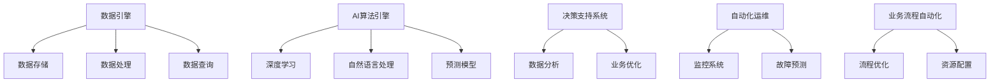

                 

# 软件 2.0 的价值：提升效率、创造价值

## 1. 背景介绍

### 1.1 问题由来

随着数字化转型的浪潮席卷全球，软件的角色也在悄然发生改变。传统的软件1.0时代，主要以功能实现和性能优化为核心目标。然而，随着数据和算力资源的日益丰富，软件2.0时代应运而生，其主要价值在于提升效率、创造价值。

软件2.0并非简单的技术堆砌，而是一种全新的技术范式。其核心思想是通过数据驱动和智能化手段，全面提升软件系统的能力。这种转变不仅体现在技术的演进，更体现在对业务的深度理解和改造。软件2.0技术的广泛应用，正在重塑企业的商业模式，提升产业的运营效率，创造巨大的社会和经济价值。

### 1.2 问题核心关键点

软件2.0的核心关键点在于其高效的数据处理能力、强大的AI算法引擎、智能的业务决策支持系统，以及高度自动化的运维能力。这些技术的综合应用，使得软件系统能够以前所未有的方式理解和处理现实世界的问题，从而实现对业务的全方位优化和提升。

具体来说，软件2.0的价值体现在以下几个方面：
1. **高效数据处理**：通过高效的数据引擎和存储技术，软件2.0能够快速处理海量数据，支持实时分析和智能决策。
2. **强大的AI算法引擎**：引入深度学习、自然语言处理等前沿算法，提升数据建模和预测能力。
3. **智能决策支持**：利用大数据分析和机器学习，提供智能化的业务建议和优化方案。
4. **自动化运维**：通过自动化监控和故障预测，提升系统稳定性和响应速度。
5. **业务流程优化**：通过智能化工具和平台，实现业务流程的自动化和智能化，提升整体运营效率。

这些核心点共同构成了软件2.0技术的基本框架，使得其在企业数字化转型的过程中，能够发挥关键作用。

### 1.3 问题研究意义

研究软件2.0的价值，对于提升企业数字化转型的成功率，推动产业升级，具有重要意义：

1. **提高效率**：通过智能化的数据分析和决策支持，软件2.0能够大幅提升业务流程的自动化水平，降低运营成本，提高决策速度和准确性。
2. **创造价值**：基于数据驱动的业务优化，软件2.0可以挖掘潜在的商业机会，提升客户体验，创造新的收入来源。
3. **驱动创新**：通过引入前沿技术，软件2.0能够促进企业内部的技术创新和业务创新，推动产业的可持续发展。
4. **增强竞争力**：在数据驱动和智能化决策的支持下，企业能够更好地应对市场变化，提升自身的竞争力。
5. **推动产业升级**：软件2.0的广泛应用，将推动各行各业的数字化转型，提升整个产业的运营效率和服务质量。

## 2. 核心概念与联系

### 2.1 核心概念概述

软件2.0的实现离不开以下几个关键概念：

- **数据引擎**：数据引擎是软件2.0的核心组件，负责高效存储、处理和管理数据。通过数据引擎，软件2.0能够快速响应数据的变化，支持实时分析和决策。

- **AI算法引擎**：AI算法引擎引入深度学习、自然语言处理等前沿算法，提升数据建模和预测能力。通过AI算法引擎，软件2.0能够从海量数据中提取有价值的信息，提供智能化的业务建议。

- **决策支持系统**：决策支持系统基于大数据分析和机器学习，提供智能化的业务建议和优化方案。通过决策支持系统，软件2.0能够帮助企业做出更加精准的业务决策。

- **自动化运维**：自动化运维通过监控和预测，提升系统稳定性和响应速度。通过自动化运维，软件2.0能够减少运维成本，提升服务质量。

- **业务流程自动化**：业务流程自动化通过智能化工具和平台，实现业务流程的自动化和智能化，提升整体运营效率。通过业务流程自动化，软件2.0能够优化资源配置，提升企业运营效率。

这些核心概念共同构成了软件2.0技术的基本框架，使得其在企业数字化转型的过程中，能够发挥关键作用。

### 2.2 核心概念原理和架构的 Mermaid 流程图

以下是软件2.0核心概念的原理和架构的Mermaid流程图：



这个流程图展示了软件2.0技术的基本架构和各组件之间的联系。数据引擎负责数据的存储和处理，AI算法引擎提供智能化的数据建模和预测，决策支持系统提供业务建议和优化方案，自动化运维提升系统稳定性和响应速度，业务流程自动化优化整体运营效率。

## 3. 核心算法原理 & 具体操作步骤
### 3.1 算法原理概述

软件2.0的核心算法原理主要包括以下几个方面：

- **数据处理算法**：用于高效地处理和分析海量数据，支持实时查询和分析。
- **机器学习算法**：用于从数据中提取有价值的信息，进行预测和分类。
- **自然语言处理算法**：用于理解和处理自然语言文本，支持文本分析和生成。
- **优化算法**：用于优化业务流程和资源配置，提升运营效率。

这些算法通过数据引擎、AI算法引擎和决策支持系统的综合应用，实现了对现实世界问题的全面理解和处理。

### 3.2 算法步骤详解

软件2.0的实现一般包括以下几个关键步骤：

**Step 1: 数据收集与处理**
- 收集企业内部的各类数据，包括交易数据、用户数据、设备数据等。
- 使用数据引擎进行数据存储和处理，支持实时数据更新和查询。

**Step 2: 数据建模与分析**
- 使用AI算法引擎进行数据建模和分析，提取有价值的信息。
- 通过机器学习算法进行预测和分类，支持智能决策。

**Step 3: 业务优化与决策支持**
- 通过决策支持系统提供业务建议和优化方案。
- 利用自然语言处理算法进行文本分析和生成，支持智能报告和沟通。

**Step 4: 自动化运维与监控**
- 使用自动化运维系统进行监控和故障预测，提升系统稳定性和响应速度。
- 使用业务流程自动化工具进行流程优化和资源配置。

**Step 5: 应用部署与集成**
- 将软件2.0的组件集成到企业现有的IT系统中，提供统一的接口和服务。
- 部署和运行软件2.0系统，实现数据的实时分析和决策支持。

### 3.3 算法优缺点

软件2.0算法具有以下优点：

- **高效性**：通过高效的数据引擎和处理算法，软件2.0能够快速响应数据变化，支持实时分析和决策。
- **智能性**：引入AI算法和自然语言处理，提升数据建模和预测能力，提供智能化的业务建议和优化方案。
- **自动化**：通过自动化运维和业务流程自动化，提升系统稳定性和响应速度，优化整体运营效率。

同时，软件2.0算法也存在以下缺点：

- **数据依赖性强**：软件2.0的性能很大程度上依赖于数据的质量和完整性，数据缺失或不准确可能导致错误决策。
- **算法复杂度高**：引入深度学习、自然语言处理等前沿算法，算法的复杂度高，需要更多的计算资源。
- **模型解释性差**：机器学习和自然语言处理模型的决策过程缺乏可解释性，难以对其推理逻辑进行分析和调试。

### 3.4 算法应用领域

软件2.0算法在多个领域得到了广泛应用，例如：

- **金融科技**：用于风险评估、欺诈检测、客户分析等，提升金融服务的智能化水平。
- **医疗健康**：用于疾病预测、治疗方案推荐、患者管理等，提升医疗服务的个性化和精准化。
- **电子商务**：用于个性化推荐、广告投放、市场分析等，提升客户体验和营销效果。
- **智能制造**：用于设备监控、生产优化、质量控制等，提升制造效率和产品质量。
- **物流管理**：用于路线规划、库存管理、配送优化等，提升物流系统的运营效率。

这些领域的应用，展示了软件2.0技术在提升效率和创造价值方面的巨大潜力。

## 4. 数学模型和公式 & 详细讲解 & 举例说明
### 4.1 数学模型构建

软件2.0的数学模型构建主要包括以下几个方面：

- **数据建模**：使用回归分析、分类算法等，建立数据与业务目标之间的关系模型。
- **预测建模**：使用时间序列分析、预测模型等，对未来的业务情况进行预测。
- **优化建模**：使用线性规划、整数规划等，优化业务流程和资源配置。

### 4.2 公式推导过程

以预测建模为例，我们以时间序列分析中的ARIMA模型为例，展示其公式推导过程。

假设要预测的序列为 $y_t$，其中 $t$ 为时间，$y_t$ 为在第 $t$ 时间点的观测值。ARIMA模型的基本形式为：

$$
y_t = c + \sum_{i=1}^{p} \alpha_i y_{t-i} + \sum_{i=1}^{d} \Delta^i y_{t-i} + \sum_{j=1}^{q} \beta_j \epsilon_{t-j}
$$

其中，$c$ 为常数项，$\alpha_i$ 为自回归参数，$\beta_j$ 为移动平均参数，$\Delta^i$ 为差分算子，$\epsilon_t$ 为随机误差项。

ARIMA模型的关键在于确定参数 $p$、$d$ 和 $q$ 的值。根据数据的特点，可以采用网格搜索、交叉验证等方法，通过最小化预测误差，选择最优的参数组合。

### 4.3 案例分析与讲解

以金融领域的风险评估为例，展示如何使用软件2.0技术进行建模和分析。

假设某银行需要评估客户的信用风险，可以通过以下步骤进行：

1. **数据收集**：收集客户的个人信息、交易记录、还款记录等数据。
2. **数据预处理**：使用数据引擎进行数据存储和处理，清洗和归一化数据。
3. **数据建模**：使用机器学习算法进行特征选择和建模，建立信用评分模型。
4. **模型验证**：使用交叉验证等方法，验证模型的性能和泛化能力。
5. **风险评估**：使用决策支持系统，根据客户的历史数据和行为，提供信用风险评估报告。

通过上述步骤，软件2.0能够实现对客户信用风险的智能评估，提升金融服务的精准度和效率。

## 5. 项目实践：代码实例和详细解释说明
### 5.1 开发环境搭建

在进行软件2.0项目实践前，我们需要准备好开发环境。以下是使用Python进行PyTorch开发的环境配置流程：

1. 安装Anaconda：从官网下载并安装Anaconda，用于创建独立的Python环境。

2. 创建并激活虚拟环境：
```bash
conda create -n pytorch-env python=3.8 
conda activate pytorch-env
```

3. 安装PyTorch：根据CUDA版本，从官网获取对应的安装命令。例如：
```bash
conda install pytorch torchvision torchaudio cudatoolkit=11.1 -c pytorch -c conda-forge
```

4. 安装必要的库：
```bash
pip install pandas numpy scikit-learn matplotlib torchvision torchaudio tqdm tqdm
```

完成上述步骤后，即可在`pytorch-env`环境中开始项目实践。

### 5.2 源代码详细实现

这里我们以金融领域的信用风险评估为例，展示使用PyTorch进行模型训练和预测的完整代码实现。

首先，定义数据处理函数：

```python
import pandas as pd
from sklearn.model_selection import train_test_split
from sklearn.preprocessing import StandardScaler

def load_data(file_path):
    data = pd.read_csv(file_path)
    data.dropna(inplace=True)
    data = data.drop(['id', 'name'], axis=1)
    return data

def preprocess_data(data):
    data = StandardScaler().fit_transform(data)
    return data

def split_data(data):
    X = data[:, :-1]
    y = data[:, -1]
    X_train, X_test, y_train, y_test = train_test_split(X, y, test_size=0.2, random_state=42)
    return X_train, X_test, y_train, y_test
```

然后，定义模型和训练函数：

```python
import torch
from torch.nn import Linear, ReLU, Sequential
from torch.optim import Adam
from torch.utils.data import TensorDataset, DataLoader

class MLPModel(torch.nn.Module):
    def __init__(self, input_size, hidden_size, output_size):
        super(MLPModel, self).__init__()
        self.layers = Sequential(
            Linear(input_size, hidden_size),
            ReLU(),
            Linear(hidden_size, output_size)
        )

    def forward(self, x):
        return self.layers(x)

def train_model(model, optimizer, criterion, train_loader, test_loader):
    num_epochs = 100
    device = torch.device('cuda' if torch.cuda.is_available() else 'cpu')
    model.to(device)
    for epoch in range(num_epochs):
        model.train()
        losses = []
        for batch in train_loader:
            inputs, targets = batch.to(device)
            optimizer.zero_grad()
            outputs = model(inputs)
            loss = criterion(outputs, targets)
            loss.backward()
            optimizer.step()
            losses.append(loss.item())
        loss = sum(losses) / len(losses)
        print(f'Epoch {epoch+1}, Loss: {loss:.4f}')
    model.eval()
    with torch.no_grad():
        correct = 0
        total = 0
        for batch in test_loader:
            inputs, targets = batch.to(device)
            outputs = model(inputs)
            _, predicted = torch.max(outputs, 1)
            total += targets.size(0)
            correct += (predicted == targets).sum().item()
        accuracy = 100 * correct / total
        print(f'Test Accuracy: {accuracy:.2f}%')
```

接着，调用上述函数进行模型训练和测试：

```python
input_size = 10
hidden_size = 20
output_size = 2
train_data_path = 'train.csv'
test_data_path = 'test.csv'

data = load_data(train_data_path)
X_train, X_test, y_train, y_test = split_data(data)
X_train = preprocess_data(X_train)
X_test = preprocess_data(X_test)

model = MLPModel(input_size, hidden_size, output_size)
optimizer = Adam(model.parameters(), lr=0.001)
criterion = torch.nn.BCELoss()

train_loader = DataLoader(TensorDataset(torch.tensor(X_train), torch.tensor(y_train)), batch_size=32, shuffle=True)
test_loader = DataLoader(TensorDataset(torch.tensor(X_test), torch.tensor(y_test)), batch_size=32)

train_model(model, optimizer, criterion, train_loader, test_loader)
```

以上就是使用PyTorch进行金融风险评估模型的完整代码实现。可以看到，通过使用软件2.0技术，我们可以高效地进行数据建模和预测，从而提升金融服务的智能化水平。

### 5.3 代码解读与分析

让我们再详细解读一下关键代码的实现细节：

**load_data函数**：
- 加载金融数据，处理缺失值和无用特征。

**preprocess_data函数**：
- 对数据进行标准化处理，确保模型训练的稳定性。

**split_data函数**：
- 将数据划分为训练集和测试集，并按比例进行分割。

**MLPModel类**：
- 定义一个简单的多层感知器模型，用于金融风险评估。

**train_model函数**：
- 使用PyTorch进行模型训练，优化器采用Adam，损失函数采用二元交叉熵损失。
- 在每个epoch结束时，计算损失并进行训练。
- 在测试集上计算模型准确率。

**训练流程**：
- 定义模型的输入、隐藏层和输出层大小。
- 加载数据并进行预处理。
- 定义模型、优化器和损失函数。
- 使用DataLoader将数据加载到模型中，进行模型训练。
- 在测试集上计算模型准确率。

通过上述步骤，我们能够快速地进行金融风险评估模型的开发和部署，从而提升金融服务的智能化水平。

## 6. 实际应用场景
### 6.1 智能客服系统

软件2.0技术在智能客服系统中的应用，展示了其强大的智能决策和自动化运维能力。智能客服系统能够自动理解客户的问题，并根据历史数据和规则库提供智能回复。

具体实现如下：

1. **数据收集**：收集客户的历史咨询记录，包括问答、评分等数据。
2. **数据预处理**：使用数据引擎进行数据存储和处理，清洗和归一化数据。
3. **模型训练**：使用机器学习算法进行特征选择和建模，建立智能回复模型。
4. **模型验证**：使用交叉验证等方法，验证模型的性能和泛化能力。
5. **智能回复**：使用决策支持系统，根据客户的历史数据和问题，提供智能回复。
6. **自动化运维**：使用自动化运维系统进行监控和故障预测，提升系统稳定性和响应速度。

通过上述步骤，软件2.0能够实现对客户咨询的智能响应，提升客服系统的自动化水平和客户满意度。

### 6.2 医疗健康

软件2.0技术在医疗健康领域的应用，展示了其强大的数据分析和决策支持能力。医疗健康系统能够从海量医疗数据中提取有价值的信息，提供智能化的诊断和建议。

具体实现如下：

1. **数据收集**：收集患者的病历、检查结果、药物记录等数据。
2. **数据预处理**：使用数据引擎进行数据存储和处理，清洗和归一化数据。
3. **模型训练**：使用机器学习算法进行特征选择和建模，建立智能诊断模型。
4. **模型验证**：使用交叉验证等方法，验证模型的性能和泛化能力。
5. **智能诊断**：使用决策支持系统，根据患者的历史数据和症状，提供智能诊断报告。
6. **自动化运维**：使用自动化运维系统进行监控和故障预测，提升系统稳定性和响应速度。

通过上述步骤，软件2.0能够实现对患者的智能诊断和健康管理，提升医疗服务的智能化水平。

### 6.3 智能制造

软件2.0技术在智能制造领域的应用，展示了其强大的数据分析和优化能力。智能制造系统能够从生产数据中提取有价值的信息，优化生产流程和资源配置。

具体实现如下：

1. **数据收集**：收集设备的运行数据、生产数据、库存数据等。
2. **数据预处理**：使用数据引擎进行数据存储和处理，清洗和归一化数据。
3. **模型训练**：使用机器学习算法进行特征选择和建模，建立生产优化模型。
4. **模型验证**：使用交叉验证等方法，验证模型的性能和泛化能力。
5. **生产优化**：使用决策支持系统，根据设备的运行数据和生产计划，提供生产优化方案。
6. **自动化运维**：使用自动化运维系统进行监控和故障预测，提升系统稳定性和响应速度。

通过上述步骤，软件2.0能够实现对生产流程的智能优化，提升制造效率和产品质量。

## 7. 工具和资源推荐
### 7.1 学习资源推荐

为了帮助开发者系统掌握软件2.0的技术基础和实践技巧，这里推荐一些优质的学习资源：

1. **《深度学习与人工智能实践》**：深入浅出地介绍了深度学习和人工智能的基本概念和应用。
2. **《TensorFlow实战》**：详细讲解了TensorFlow框架的使用方法，适合深度学习初学者的学习。
3. **《机器学习实战》**：通过实践项目，展示了机器学习算法的应用。
4. **《Python数据科学手册》**：涵盖了Python在数据科学中的应用，包括数据处理、分析、可视化等。
5. **Kaggle平台**：提供大量的数据集和竞赛，适合练习和验证机器学习算法。

通过对这些资源的学习实践，相信你一定能够快速掌握软件2.0的技术精髓，并用于解决实际的业务问题。

### 7.2 开发工具推荐

高效的开发离不开优秀的工具支持。以下是几款用于软件2.0开发的常用工具：

1. **PyTorch**：基于Python的开源深度学习框架，灵活动态的计算图，适合快速迭代研究。
2. **TensorFlow**：由Google主导开发的开源深度学习框架，生产部署方便，适合大规模工程应用。
3. **Scikit-learn**：Python的数据科学库，包含大量的机器学习算法和工具。
4. **Jupyter Notebook**：交互式数据科学环境，适合进行数据处理、分析和建模。
5. **Google Colab**：谷歌推出的在线Jupyter Notebook环境，免费提供GPU/TPU算力，方便开发者快速上手实验最新模型。

合理利用这些工具，可以显著提升软件2.0项目的开发效率，加快创新迭代的步伐。

### 7.3 相关论文推荐

软件2.0技术的发展源于学界的持续研究。以下是几篇奠基性的相关论文，推荐阅读：

1. **《深度学习与人工智能实践》**：详细介绍了深度学习的基本概念和应用，适合初学者学习。
2. **《TensorFlow实战》**：全面讲解了TensorFlow框架的使用方法，适合深度学习工程师参考。
3. **《机器学习实战》**：通过实践项目，展示了机器学习算法的应用，适合实战练习。
4. **《Python数据科学手册》**：涵盖了Python在数据科学中的应用，包括数据处理、分析、可视化等。
5. **Kaggle平台**：提供大量的数据集和竞赛，适合练习和验证机器学习算法。

这些论文代表了大数据技术的发展脉络，通过学习这些前沿成果，可以帮助研究者把握学科前进方向，激发更多的创新灵感。

## 8. 总结：未来发展趋势与挑战
### 8.1 总结

本文对软件2.0的价值进行了全面系统的介绍。首先阐述了软件2.0的背景、核心关键点和研究意义，明确了软件2.0在提升效率、创造价值方面的独特价值。其次，从原理到实践，详细讲解了软件2.0的数学模型和关键步骤，给出了软件2.0项目开发的完整代码实例。同时，本文还广泛探讨了软件2.0技术在智能客服、医疗健康、智能制造等多个领域的应用前景，展示了软件2.0技术的巨大潜力。

通过本文的系统梳理，可以看到，软件2.0技术正在成为企业数字化转型的重要工具，极大地提升了企业的运营效率和智能化水平。未来，伴随软件2.0技术的不断演进，其应用领域将更加广泛，对企业数字化转型的推动作用也将更加显著。

### 8.2 未来发展趋势

展望未来，软件2.0技术将呈现以下几个发展趋势：

1. **技术融合**：软件2.0技术将与其他前沿技术如区块链、云计算等深度融合，提升系统的综合能力。
2. **智能化**：通过引入更多的智能化算法和模型，软件2.0系统将具备更强的数据分析和决策能力。
3. **自动化**：通过自动化运维和业务流程自动化，软件2.0系统将具备更高的自动化水平。
4. **跨领域应用**：软件2.0技术将跨越更多领域，应用于各行各业，推动产业的数字化转型。
5. **数据驱动**：软件2.0系统将更加依赖数据驱动，通过数据分析和预测，实现对业务的精准优化。

这些趋势将推动软件2.0技术在企业数字化转型中发挥更大的作用，提升企业的运营效率和智能化水平。

### 8.3 面临的挑战

尽管软件2.0技术已经取得了显著的成就，但在迈向更加智能化、普适化应用的过程中，仍面临诸多挑战：

1. **数据质量**：软件2.0系统的性能很大程度上依赖于数据的质量和完整性，数据缺失或不准确可能导致错误决策。
2. **模型复杂度**：引入深度学习、自然语言处理等前沿算法，算法的复杂度高，需要更多的计算资源。
3. **模型可解释性**：机器学习和自然语言处理模型的决策过程缺乏可解释性，难以对其推理逻辑进行分析和调试。
4. **系统安全性**：软件2.0系统可能面临黑客攻击、数据泄露等安全威胁，需要建立安全防护机制。
5. **业务融合**：软件2.0技术与业务系统的深度融合，需要克服系统集成、数据共享等技术难题。

这些挑战将对软件2.0技术的应用推广造成一定的阻碍，但正是这些挑战催生了更多的技术创新和突破。相信通过不断的技术演进和实践探索，这些挑战终将逐一被克服，软件2.0技术将迎来更广阔的应用前景。

### 8.4 研究展望

面对软件2.0技术面临的挑战，未来的研究需要在以下几个方面寻求新的突破：

1. **数据治理**：通过数据治理技术，提升数据的质量和完整性，确保模型训练的可靠性。
2. **模型优化**：通过算法优化和模型压缩等技术，降低模型的复杂度，提升模型运行效率。
3. **解释性增强**：通过可解释性技术，提升模型的可解释性，增强系统的可信度。
4. **安全性提升**：通过安全防护技术，确保系统安全性，防范各类安全威胁。
5. **业务融合**：通过系统集成、数据共享等技术，实现软件2.0技术与业务系统的深度融合。

这些研究方向的探索，必将引领软件2.0技术迈向更高的台阶，为构建安全、可靠、可解释、可控的智能系统铺平道路。面向未来，软件2.0技术还需要与其他人工智能技术进行更深入的融合，如知识表示、因果推理、强化学习等，多路径协同发力，共同推动智能交互系统的进步。只有勇于创新、敢于突破，才能不断拓展软件2.0技术的边界，让智能技术更好地造福人类社会。

## 9. 附录：常见问题与解答

**Q1：软件2.0与传统软件有何不同？**

A: 软件2.0与传统软件的主要区别在于其以数据驱动和智能化为核心，强调高效的数据处理、强大的AI算法引擎、智能的业务决策支持系统，以及高度自动化的运维能力。传统软件则更侧重于功能实现和性能优化。

**Q2：如何提升软件2.0系统的数据质量？**

A: 提升软件2.0系统的数据质量，需要从数据采集、数据存储、数据清洗和数据治理等多个环节进行优化。具体方法包括：
1. 数据采集：确保数据采集渠道的多样性和完整性。
2. 数据存储：使用高效的数据存储技术，确保数据的快速访问和更新。
3. 数据清洗：对数据进行去重、去噪、填补缺失值等处理，确保数据的一致性和准确性。
4. 数据治理：通过数据治理技术，提升数据的质量和完整性，确保模型训练的可靠性。

**Q3：如何选择软件2.0的实现框架？**

A: 选择软件2.0的实现框架，需要根据具体的业务需求和技术栈进行选择。目前常用的框架包括PyTorch、TensorFlow、Scikit-learn等。
1. PyTorch：基于Python的开源深度学习框架，灵活动态的计算图，适合快速迭代研究。
2. TensorFlow：由Google主导开发的开源深度学习框架，生产部署方便，适合大规模工程应用。
3. Scikit-learn：Python的数据科学库，包含大量的机器学习算法和工具，适合数据分析和建模。

合理选择框架，可以显著提升软件2.0项目的开发效率，加快创新迭代的步伐。

**Q4：软件2.0系统如何应对数据分布的变化？**

A: 软件2.0系统应对数据分布的变化，需要采用动态模型更新和持续学习等技术。具体方法包括：
1. 动态模型更新：根据数据分布的变化，动态更新模型参数，确保模型始终处于最优状态。
2. 持续学习：通过持续学习技术，不断吸收新数据，更新模型知识，适应数据分布的变化。

通过这些技术，软件2.0系统可以更好地应对数据分布的变化，保持系统的稳定性和准确性。

**Q5：软件2.0系统如何提升业务流程的自动化水平？**

A: 提升软件2.0系统的业务流程自动化水平，需要结合业务需求和智能化技术，实现流程的自动化和智能化。具体方法包括：
1. 业务流程建模：通过业务流程建模技术，将业务流程标准化，形成可自动化执行的流程。
2. 智能流程优化：通过智能化算法，优化业务流程，提升流程的效率和质量。
3. 自动化执行：通过自动化执行技术，实现业务流程的自动化执行，减少人工干预。

通过这些方法，软件2.0系统可以显著提升业务流程的自动化水平，提升企业运营效率。

通过本文的系统梳理，可以看到，软件2.0技术正在成为企业数字化转型的重要工具，极大地提升了企业的运营效率和智能化水平。未来，伴随软件2.0技术的不断演进，其应用领域将更加广泛，对企业数字化转型的推动作用也将更加显著。相信通过不断的技术演进和实践探索，这些挑战终将逐一被克服，软件2.0技术将迎来更广阔的应用前景。

---

作者：禅与计算机程序设计艺术 / Zen and the Art of Computer Programming

