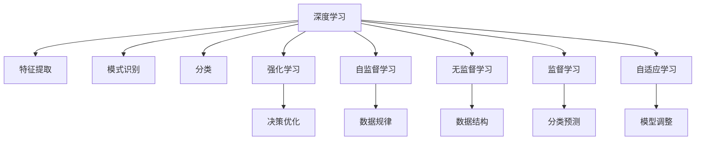

                 

# 软件 2.0 的发展趋势：深度学习、强化学习

> 关键词：深度学习, 强化学习, 自监督学习, 无监督学习, 监督学习, 自适应学习, 自优化学习

## 1. 背景介绍

随着计算机科学的发展，软件工程也经历了从软件 1.0 到软件 2.0 的转变。软件 1.0 时代，程序员通过编写代码来描述软件功能，软件开发高度依赖人工设计和编程。而软件 2.0 时代，机器学习和人工智能技术开始应用于软件开发，形成了自监督、无监督、监督和强化学习等多种新型的自适应学习范式，极大地提升了软件的智能性和自动化程度。

### 1.1 问题由来

在软件开发过程中，传统的人工编写和调试方式已经难以应对日益复杂的应用场景和快速变化的业务需求。机器学习和人工智能技术的兴起，为软件开发提供了全新的思路。通过深度学习、强化学习等技术，可以自动发现软件中的模式和规律，优化设计方案，提高系统性能，降低开发成本。

### 1.2 问题核心关键点

深度学习、强化学习等自适应学习技术，是软件 2.0 时代的重要推动力。它们的原理和应用包括以下几个核心关键点：

1. **深度学习**：通过多层神经网络自动提取特征，实现高效的模式识别和分类。
2. **强化学习**：通过奖励机制不断优化软件决策策略，实现智能化的自我改进。
3. **自监督学习**：利用数据自身特征进行无监督学习，发现潜在的规律和模式。
4. **无监督学习**：从数据中直接发现结构，无需标注数据。
5. **监督学习**：在有标注数据的情况下，通过学习模式进行分类和预测。

这些技术共同构成了软件 2.0 的核心方法论，推动了软件开发的智能化和自动化。

## 2. 核心概念与联系

### 2.1 核心概念概述

为更好地理解软件 2.0 的发展趋势，本节将介绍几个密切相关的核心概念：

- **深度学习**：一种通过多层神经网络进行特征提取和模式识别的技术。通过多层非线性变换，自动提取输入数据的高层次特征，实现高效的模式识别和分类。
- **强化学习**：一种通过奖励机制不断优化决策策略的学习方法。智能体在环境中通过不断试错，逐步学习最优策略。
- **自监督学习**：利用数据自身特征进行无监督学习，发现潜在的规律和模式。常见方法包括自编码、对比学习等。
- **无监督学习**：从数据中直接发现结构，无需标注数据。常见方法包括聚类、降维等。
- **监督学习**：在有标注数据的情况下，通过学习模式进行分类和预测。常见方法包括回归、分类、序列预测等。
- **自适应学习**：通过学习算法自动调整模型参数，适应数据分布的变化。常见方法包括自优化、自适应学习率等。

这些核心概念之间的逻辑关系可以通过以下Mermaid流程图来展示：



这个流程图展示了大语言模型微调的核心概念及其之间的关系：

1. 深度学习通过多层神经网络自动提取特征。
2. 模式识别和分类任务中常用深度学习。
3. 强化学习通过奖励机制不断优化决策策略。
4. 决策优化在推荐系统、智能控制等任务中应用广泛。
5. 自监督学习利用数据自身特征进行无监督学习。
6. 数据规律在自然语言处理、计算机视觉等领域广泛应用。
7. 无监督学习在数据预处理、异常检测等任务中具有优势。
8. 分类预测在回归分析、图像识别等领域中十分重要。
9. 自适应学习通过学习算法自动调整模型参数。

这些概念共同构成了软件 2.0 的核心方法论，推动了软件开发智能化和自动化的发展。

## 3. 核心算法原理 & 具体操作步骤
### 3.1 算法原理概述

深度学习、强化学习等自适应学习技术，本质上是基于数据的自我优化过程。其核心思想是通过算法自动调整模型参数，以适应数据分布的变化，从而提升模型性能。

### 3.2 算法步骤详解

以强化学习为例，其一般步骤包括：

1. **环境建模**：定义任务环境，包括状态空间、动作空间、奖励机制等。
2. **智能体设计**：选择或设计智能体的学习算法和策略，如Q-learning、策略梯度等。
3. **参数初始化**：初始化智能体的参数，如Q值、策略参数等。
4. **迭代学习**：通过在环境中不断交互，智能体根据奖励机制不断调整策略，优化决策。
5. **评估与优化**：评估智能体的性能，通过超参数调整等手段优化学习过程。

### 3.3 算法优缺点

自适应学习技术具有以下优点：

1. **自动化**：自动发现数据中的模式和规律，无需人工干预。
2. **高效性**：通过并行计算和大规模数据处理，提升学习效率。
3. **泛化性**：在不断优化过程中，智能体能够适应多种数据分布。

但这些技术也存在一定的局限性：

1. **数据依赖**：需要大量标注数据和高质量数据，否则难以保证学习效果。
2. **计算复杂**：大规模模型的训练和优化需要强大的计算资源。
3. **过拟合风险**：在数据量不足或模型复杂度高时，可能出现过拟合现象。
4. **可解释性差**：模型决策过程缺乏可解释性，难以理解其内部逻辑。

### 3.4 算法应用领域

自适应学习技术已经在多个领域得到广泛应用，例如：

- **自然语言处理**：通过语言模型、对话系统等应用，实现自动摘要、翻译、问答等任务。
- **计算机视觉**：通过图像识别、物体检测等应用，实现智能监控、医学影像分析等任务。
- **机器人与自动化**：通过强化学习、路径规划等技术，实现智能机器人、自动驾驶等任务。
- **推荐系统**：通过协同过滤、序列预测等技术，实现个性化推荐、广告投放等任务。
- **金融与经济学**：通过市场模拟、预测模型等技术，实现风险评估、投资决策等任务。
- **游戏与模拟**：通过强化学习、博弈论等技术，实现智能游戏、虚拟现实等任务。

## 4. 数学模型和公式 & 详细讲解 & 举例说明

### 4.1 数学模型构建

以强化学习为例，其数学模型主要包括以下几个部分：

- **状态空间**：表示任务环境中的所有可能状态，记为 $S$。
- **动作空间**：表示智能体可以采取的所有动作，记为 $A$。
- **奖励机制**：根据智能体的动作和环境状态，计算奖励值，记为 $r(s,a)$。
- **策略**：智能体采取动作的策略，记为 $\pi(a|s)$。
- **价值函数**：表示在状态 $s$ 下采取动作 $a$ 的长期奖励，记为 $Q(s,a)$。

### 4.2 公式推导过程

以Q-learning为例，其核心公式为：

$$
Q(s,a) \leftarrow Q(s,a) + \alpha [r(s,a) + \gamma \max_{a'}Q(s',a') - Q(s,a)]
$$

其中 $\alpha$ 为学习率，$\gamma$ 为折扣因子。该公式表示智能体在状态 $s$ 下采取动作 $a$ 的Q值，更新为当前Q值加上学习率与奖励值和后续最优Q值的差值的乘积。

### 4.3 案例分析与讲解

以AlphaGo为例，AlphaGo通过强化学习优化决策策略，实现了在围棋中战胜人类顶尖选手的壮举。具体实现过程包括：

- **状态空间**：棋盘上的所有可能状态。
- **动作空间**：所有合法的落子位置。
- **奖励机制**：基于落子位置和当前棋局状态的奖励值，鼓励智能体选择有利于胜利的动作。
- **策略**：AlphaGo通过深度学习模型计算每个位置的胜率，选择最优动作。
- **价值函数**：通过蒙特卡洛树搜索（MCTS）计算当前位置的胜率。

AlphaGo通过不断迭代学习，优化其决策策略，最终在围棋中取得了超人类水平的表现。

## 5. 项目实践：代码实例和详细解释说明
### 5.1 开发环境搭建

在进行强化学习项目实践前，我们需要准备好开发环境。以下是使用Python进行OpenAI Gym开发的强化学习环境配置流程：

1. 安装Anaconda：从官网下载并安装Anaconda，用于创建独立的Python环境。

2. 创建并激活虚拟环境：
```bash
conda create -n reinforcement-env python=3.8 
conda activate reinforcement-env
```

3. 安装必要的依赖包：
```bash
pip install gym[atari]
pip install numpy scipy matplotlib
```

4. 安装OpenAI Gym环境：
```bash
pip install gym
```

5. 安装TensorFlow或PyTorch，用于构建深度学习模型。
```bash
pip install tensorflow==2.4
# 或
pip install torch
```

6. 安装RLlib：
```bash
pip install ray[RLlib]
```

完成上述步骤后，即可在`reinforcement-env`环境中开始强化学习实践。

### 5.2 源代码详细实现

以下是一个使用RLlib进行Q-learning的Python代码示例：

```python
from gym import spaces
from gym.wrappers import Monitor
from ray.rllib.agents.ppo import PPOTrainer
from ray.rllib.examples.env.atari_env import AtariEnv
import numpy as np

# 创建Atari环境
env = AtariEnv(env='Pong-v0')

# 设置随机种子
np.random.seed(42)

# 创建PPOTrainer
trainer = PPOTrainer(config={'env': env, 'num_workers': 2})

# 开始训练
env = Monitor(env, "./ videos", force=True)
t = trainer.fit(env, max_episodes=200)
print(t)
```

### 5.3 代码解读与分析

让我们再详细解读一下关键代码的实现细节：

**Gym环境创建**：
- `env = AtariEnv(env='Pong-v0')`：创建Pong游戏的Gym环境。
- `env = Monitor(env, "./ videos", force=True)`：监控训练过程，将视频保存至当前目录下的`videos`文件夹。

**PPOTrainer训练**：
- `trainer = PPOTrainer(config={'env': env, 'num_workers': 2})`：创建PPOTrainer，配置环境为Pong环境，设置2个CPU进行训练。

**训练过程**：
- `t = trainer.fit(env, max_episodes=200)`：在Pong环境中训练200个回合，返回训练统计信息。

可以看到，使用Gym和RLlib进行强化学习训练，代码实现简洁高效。开发者可以将更多精力放在模型设计和优化上，而不必过多关注底层实现细节。

当然，工业级的系统实现还需考虑更多因素，如模型的保存和部署、超参数的自动搜索、更灵活的环境接口等。但核心的强化学习范式基本与此类似。

## 6. 实际应用场景
### 6.1 自动驾驶

自动驾驶技术是强化学习的重要应用领域之一。通过智能体在虚拟环境中不断试错，自动学习最优的驾驶策略，可以提升车辆的驾驶安全性和智能化水平。

在实际应用中，可以通过模拟器构建复杂的驾驶场景，智能体通过强化学习不断优化其控制策略，逐步学会在复杂交通环境中安全行驶。此外，智能体还可以通过模仿学习，利用已有的驾驶数据进行学习，加速优化过程。

### 6.2 游戏AI

在游戏AI领域，强化学习已经成为一种标准的智能决策方法。通过智能体在游戏环境中的不断学习，可以构建出具备高智能水平的AI玩家。

例如，AlphaGo通过强化学习优化围棋决策策略，实现了在围棋中战胜人类顶尖选手的壮举。类似地，DeepMind开发的AlphaStar通过强化学习优化星际争霸游戏的决策策略，取得了超过人类选手的水平。

### 6.3 推荐系统

推荐系统是强化学习在商业领域的重要应用之一。通过智能体在用户行为数据中的不断学习，可以优化推荐策略，提高推荐效果。

在实际应用中，智能体可以学习用户的历史行为数据，预测其兴趣偏好，通过调整推荐策略，实现个性化的推荐服务。例如，Amazon的推荐系统通过强化学习优化推荐策略，提升了用户体验和销售额。

### 6.4 金融交易

金融交易是强化学习在金融领域的重要应用之一。通过智能体在市场数据中的不断学习，可以优化交易策略，提升投资收益。

在实际应用中，智能体可以学习历史交易数据，预测市场走势，通过调整交易策略，实现自动化的高频交易。例如，J.P. Morgan的AlgoTrader通过强化学习优化交易策略，实现了高收益的投资效果。

## 7. 工具和资源推荐
### 7.1 学习资源推荐

为了帮助开发者系统掌握深度学习、强化学习等技术，这里推荐一些优质的学习资源：

1. **《深度学习》课程**：由斯坦福大学开设的深度学习课程，提供了大量的视频和代码，帮助初学者入门深度学习。
2. **《强化学习》课程**：由加州大学伯克利分校开设的强化学习课程，提供了深入的理论和实践讲解，适合进阶学习。
3. **《Python深度学习》书籍**：由François Chollet所著的深度学习入门书籍，涵盖深度学习的基本原理和实战技巧。
4. **《Deep Reinforcement Learning》书籍**：由Ian Goodfellow所著的强化学习入门书籍，深入浅出地介绍了强化学习的基本原理和实现方法。
5. **Kaggle竞赛**：Kaggle平台提供了丰富的深度学习和强化学习竞赛，帮助开发者通过实战提升技能。
6. **Coursera课程**：Coursera平台提供了大量的深度学习和强化学习课程，涵盖理论、算法、实践等多个方面。

通过对这些资源的学习实践，相信你一定能够快速掌握深度学习、强化学习等技术的精髓，并用于解决实际的开发问题。

### 7.2 开发工具推荐

高效的开发离不开优秀的工具支持。以下是几款用于深度学习和强化学习开发的常用工具：

1. **PyTorch**：基于Python的开源深度学习框架，灵活动态的计算图，适合快速迭代研究。
2. **TensorFlow**：由Google主导开发的开源深度学习框架，生产部署方便，适合大规模工程应用。
3. **RLlib**：由OpenAI开发的强化学习库，支持多种强化学习算法和环境。
4. **Jupyter Notebook**：交互式的开发环境，支持代码编写、执行和可视化。
5. **TensorBoard**：TensorFlow配套的可视化工具，可实时监测模型训练状态，提供丰富的图表呈现方式。
6. **PyCharm**：专业的Python IDE，支持代码自动补全、调试等功能。

合理利用这些工具，可以显著提升深度学习和强化学习任务的开发效率，加快创新迭代的步伐。

### 7.3 相关论文推荐

深度学习、强化学习等技术的快速发展，得益于学界和工业界的持续研究。以下是几篇奠基性的相关论文，推荐阅读：

1. **《ImageNet Classification with Deep Convolutional Neural Networks》**：AlexNet模型，通过多层次卷积神经网络实现图像分类，开创了深度学习在计算机视觉领域的应用。
2. **《Playing Atari with Deep Reinforcement Learning》**：AlphaGo模型，通过强化学习优化围棋决策策略，实现了在围棋中战胜人类顶尖选手的壮举。
3. **《Human-level Control Through Deep Reinforcement Learning》**：OpenAI的DQN模型，通过强化学习优化复杂的动作控制任务。
4. **《Policy Gradients for General Game Playing with a Recurrent Neural Network Agent》**：AlphaStar模型，通过强化学习优化星际争霸游戏的决策策略，取得了超过人类选手的水平。
5. **《Attention is All You Need》**：Transformer模型，通过多层自注意力机制实现高效的自然语言处理，推动了深度学习在NLP领域的应用。

这些论文代表了大语言模型微调技术的发展脉络。通过学习这些前沿成果，可以帮助研究者把握学科前进方向，激发更多的创新灵感。

## 8. 总结：未来发展趋势与挑战
### 8.1 总结

本文对深度学习、强化学习等自适应学习技术的背景和应用进行了全面系统的介绍。首先阐述了自适应学习在软件开发中的重要性，明确了深度学习、强化学习等技术在提升软件智能化和自动化方面的独特价值。其次，从原理到实践，详细讲解了深度学习和强化学习的数学模型和关键步骤，给出了具体的应用案例。同时，本文还广泛探讨了深度学习和强化学习在自动驾驶、游戏AI、推荐系统、金融交易等多个领域的应用前景，展示了自适应学习技术的广阔前景。

通过本文的系统梳理，可以看到，深度学习、强化学习等自适应学习技术正在成为软件开发的重要推动力，极大地提升了软件的智能性和自动化程度。未来，伴随技术的不断演进，这些技术将在更多领域得到应用，为人类社会带来深远的影响。

### 8.2 未来发展趋势

展望未来，深度学习和强化学习技术将呈现以下几个发展趋势：

1. **模型规模不断增大**：随着算力成本的下降和数据规模的扩张，深度学习模型的参数量还将持续增长。超大规模模型蕴含的丰富知识，有望支撑更加复杂多变的任务。
2. **算法不断优化**：新的深度学习算法和强化学习算法不断涌现，如GPT-3、AlphaStar等，进一步提升了模型的性能和效率。
3. **跨领域融合**：深度学习和强化学习技术将与其他人工智能技术进行更深层次的融合，如知识表示、因果推理、强化学习等，共同推动智能系统的进步。
4. **多模态应用**：深度学习和强化学习技术将扩展到更多模态数据，如视觉、语音、自然语言等，实现多模态信息融合，提升系统智能水平。
5. **自动化部署**：自动化部署和优化技术不断发展，使得深度学习、强化学习模型的应用更加便捷高效。
6. **边缘计算**：深度学习和强化学习技术将向边缘计算方向发展，实现实时计算和本地决策。

以上趋势凸显了深度学习和强化学习技术的广阔前景。这些方向的探索发展，必将进一步提升人工智能系统的性能和应用范围，为人类社会的数字化转型提供新的动力。

### 8.3 面临的挑战

尽管深度学习和强化学习技术已经取得了瞩目成就，但在迈向更加智能化、普适化应用的过程中，它们仍面临着诸多挑战：

1. **数据依赖**：需要大量标注数据和高质量数据，否则难以保证学习效果。
2. **计算复杂**：大规模模型的训练和优化需要强大的计算资源。
3. **过拟合风险**：在数据量不足或模型复杂度高时，可能出现过拟合现象。
4. **可解释性差**：模型决策过程缺乏可解释性，难以理解其内部逻辑。
5. **鲁棒性不足**：模型面对异常输入或噪声数据时，容易产生错误决策。
6. **安全性问题**：模型可能学习到有害信息，导致误导性或歧视性的输出。

正视深度学习和强化学习面临的这些挑战，积极应对并寻求突破，将是大语言模型微调走向成熟的必由之路。相信随着学界和产业界的共同努力，这些挑战终将一一被克服，深度学习和强化学习技术必将在构建人机协同的智能时代中扮演越来越重要的角色。

### 8.4 研究展望

面对深度学习和强化学习所面临的挑战，未来的研究需要在以下几个方面寻求新的突破：

1. **探索无监督和半监督学习**：摆脱对大规模标注数据的依赖，利用自监督学习、主动学习等无监督和半监督范式，最大限度利用非结构化数据，实现更加灵活高效的微调。
2. **研究参数高效和计算高效的微调范式**：开发更加参数高效的微调方法，在固定大部分预训练参数的同时，只更新极少量的任务相关参数。同时优化微调模型的计算图，减少前向传播和反向传播的资源消耗，实现更加轻量级、实时性的部署。
3. **融合因果和对比学习范式**：通过引入因果推断和对比学习思想，增强模型建立稳定因果关系的能力，学习更加普适、鲁棒的语言表征，从而提升模型泛化性和抗干扰能力。
4. **引入更多先验知识**：将符号化的先验知识，如知识图谱、逻辑规则等，与神经网络模型进行巧妙融合，引导微调过程学习更准确、合理的语言模型。同时加强不同模态数据的整合，实现视觉、语音等多模态信息与文本信息的协同建模。
5. **结合因果分析和博弈论工具**：将因果分析方法引入微调模型，识别出模型决策的关键特征，增强输出解释的因果性和逻辑性。借助博弈论工具刻画人机交互过程，主动探索并规避模型的脆弱点，提高系统稳定性。
6. **纳入伦理道德约束**：在模型训练目标中引入伦理导向的评估指标，过滤和惩罚有偏见、有害的输出倾向。同时加强人工干预和审核，建立模型行为的监管机制，确保输出符合人类价值观和伦理道德。

这些研究方向的探索，必将引领深度学习和强化学习技术迈向更高的台阶，为构建安全、可靠、可解释、可控的智能系统铺平道路。面向未来，深度学习和强化学习技术还需要与其他人工智能技术进行更深入的融合，如知识表示、因果推理、强化学习等，多路径协同发力，共同推动智能系统的进步。只有勇于创新、敢于突破，才能不断拓展深度学习和强化学习技术的边界，让智能技术更好地造福人类社会。

## 9. 附录：常见问题与解答

**Q1：深度学习和强化学习是否适用于所有NLP任务？**

A: 深度学习和强化学习在大多数NLP任务上都能取得不错的效果，特别是对于数据量较大的任务。但对于一些特定领域的任务，如医学、法律等，仅仅依靠通用语料预训练的模型可能难以很好地适应。此时需要在特定领域语料上进一步预训练，再进行微调，才能获得理想效果。此外，对于一些需要时效性、个性化很强的任务，如对话、推荐等，微调方法也需要针对性的改进优化。

**Q2：深度学习模型的过拟合问题如何解决？**

A: 深度学习模型的过拟合问题可以通过以下方法解决：
1. 数据增强：通过回译、近义替换等方式扩充训练集。
2. 正则化：使用L2正则、Dropout等技术防止过拟合。
3. 提前停止：监控验证集误差，当误差不再下降时提前停止训练。
4. 批归一化：在网络中间层进行归一化，避免参数移动，防止过拟合。
5. 学习率衰减：在训练后期降低学习率，防止模型震荡。
6. 数据集划分：将数据集分为训练集、验证集和测试集，严格控制模型在训练集上的拟合程度。

**Q3：深度学习模型的可解释性问题如何解决？**

A: 深度学习模型的可解释性问题可以通过以下方法解决：
1. 特征可视化：使用t-SNE等技术将高维特征降维可视化。
2. 模型简化：通过简化模型结构，减少复杂度，提高可解释性。
3. 局部可解释性：通过局部解释方法，如LIME、SHAP等，解释模型对单个样本的决策过程。
4. 可解释模型：使用可解释的模型结构，如决策树、规则模型等，提高模型的可解释性。
5. 可解释数据：使用可解释的数据表示，如词向量、符号表示等，提高模型的可解释性。

**Q4：深度学习模型的鲁棒性问题如何解决？**

A: 深度学习模型的鲁棒性问题可以通过以下方法解决：
1. 数据清洗：通过清洗噪声数据，减少模型对异常输入的敏感度。
2. 对抗训练：通过对抗样本训练，提高模型对输入扰动的鲁棒性。
3. 模型融合：通过模型融合技术，提高模型的稳定性和鲁棒性。
4. 鲁棒正则化：通过引入鲁棒正则化技术，增强模型的鲁棒性。
5. 分布式训练：通过分布式训练，提高模型的泛化能力。

**Q5：深度学习模型在实际部署中需要注意哪些问题？**

A: 深度学习模型在实际部署中需要注意以下问题：
1. 模型裁剪：去除不必要的层和参数，减小模型尺寸，加快推理速度。
2. 量化加速：将浮点模型转为定点模型，压缩存储空间，提高计算效率。
3. 服务化封装：将模型封装为标准化服务接口，便于集成调用。
4. 弹性伸缩：根据请求流量动态调整资源配置，平衡服务质量和成本。
5. 监控告警：实时采集系统指标，设置异常告警阈值，确保服务稳定性。
6. 安全防护：采用访问鉴权、数据脱敏等措施，保障数据和模型安全。

深度学习和强化学习技术在实际部署中还需要考虑更多因素，如模型压缩、模型优化、服务监控等。但核心的深度学习范式基本与此类似。

**Q6：强化学习模型在实际应用中需要注意哪些问题？**

A: 强化学习模型在实际应用中需要注意以下问题：
1. 环境建模：定义任务环境，包括状态空间、动作空间、奖励机制等。
2. 智能体设计：选择或设计智能体的学习算法和策略，如Q-learning、策略梯度等。
3. 参数初始化：初始化智能体的参数，如Q值、策略参数等。
4. 迭代学习：通过在环境中不断交互，智能体根据奖励机制不断调整策略，优化决策。
5. 评估与优化：评估智能体的性能，通过超参数调整等手段优化学习过程。

在实际应用中，还需要考虑模型训练的时间、空间复杂度，以及模型的可解释性、鲁棒性等问题。

---

作者：禅与计算机程序设计艺术 / Zen and the Art of Computer Programming

