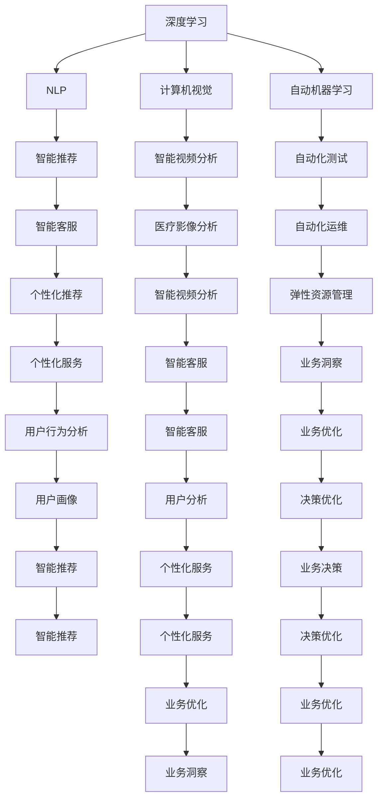

                 

# 软件 2.0 的未来展望：更智能、更强大

> 关键词：软件 2.0, 人工智能, 深度学习, 大数据, 自动机器学习, 计算机视觉, 自然语言处理, 云计算, 区块链, 未来技术

## 1. 背景介绍

### 1.1 问题由来

随着科技的飞速发展，软件领域经历了从最初的纯逻辑编程到自动化、智能化、个性化、云端化等演进。其中，以深度学习、自然语言处理、计算机视觉等为代表的AI技术正在推动软件2.0时代的到来。软件2.0以AI为核心，实现软件系统由传统的“以数据为基础，以算力为驱动”向“以数据为基础，以智能为驱动”的转型。

AI技术的快速发展为软件2.0提供了强有力的支撑，使软件系统能够更好地理解用户需求，自动处理复杂任务，提升用户体验，提高软件系统的智能化和自动化水平。软件2.0有望在医疗、金融、交通、教育等多个领域发挥巨大作用，助力各行各业实现数字化转型。

### 1.2 问题核心关键点

软件2.0的关键在于AI技术的深度应用。其主要特点包括：

- 自动化和智能化：通过AI技术实现自动化的代码生成、自动化的测试、自动化的运维等。
- 数据驱动：利用大数据技术，挖掘数据中的潜在价值，进行精准的决策和优化。
- 个性化：根据用户的行为和偏好，提供个性化的服务和推荐。
- 云端化：通过云计算平台，实现资源的共享和弹性扩展，降低成本。

当前，软件2.0的典型技术包括：深度学习、自然语言处理、计算机视觉、自动机器学习等。这些技术在医疗影像分析、智能推荐、智能客服、智能视频分析等场景中已经得到了广泛应用。

### 1.3 问题研究意义

研究软件2.0技术，对于提升软件系统的智能化水平，推动各行业的数字化转型，具有重要意义：

1. 降低开发成本：自动化、智能化的软件2.0系统，可以显著降低软件开发和运维的成本。
2. 提升用户体验：通过AI技术，软件系统能够更好地理解用户需求，提供更加智能化的服务。
3. 增强业务决策能力：利用大数据和AI技术，软件系统可以提供精准的业务洞察，辅助决策。
4. 推动产业升级：软件2.0技术将加速各行各业的数字化转型，提升行业的竞争力和效率。

## 2. 核心概念与联系

### 2.1 核心概念概述

软件2.0的核心概念包括：

- 深度学习：通过神经网络等模型，自动从大量数据中学习规律，实现数据的自动处理和分析。
- 自然语言处理(NLP)：使计算机能够理解、处理、生成自然语言，实现人机交互。
- 计算机视觉：通过图像、视频等视觉数据，实现自动识别、分类、生成等。
- 自动机器学习(AutoML)：通过自动化的方法，优化机器学习模型的性能。

这些概念之间的逻辑关系可以通过以下Mermaid流程图来展示：



这个流程图展示了大语言模型的核心概念及其之间的关系：

1. 深度学习、NLP、计算机视觉、自动机器学习是大语言模型的核心技术支撑。
2. 这些技术在智能推荐、智能视频分析、智能客服、医疗影像分析等场景中得到广泛应用。
3. 基于这些技术，软件2.0系统可以实现自动化的测试、运维、资源管理、决策优化等功能。
4. 软件2.0系统可以提供更加个性化、智能化的服务和推荐，提升用户体验。

## 3. 核心算法原理 & 具体操作步骤
### 3.1 算法原理概述

软件2.0的核心算法原理主要基于深度学习和自动机器学习。通过深度学习模型从大量数据中学习规律，构建强大的数据处理能力，再通过自动机器学习进行模型调优，优化模型性能。

### 3.2 算法步骤详解

软件2.0的算法步骤主要包括以下几个关键环节：

**Step 1: 数据准备与预处理**
- 收集领域内的大规模数据，进行数据清洗和预处理，去除噪声和异常值。
- 将数据划分为训练集、验证集和测试集，进行数据增强和样本平衡等处理。

**Step 2: 模型训练与调优**
- 选择适合的深度学习模型（如卷积神经网络、循环神经网络、Transformer等）。
- 在训练集上训练模型，并进行模型调优，选择最优的超参数组合。
- 在验证集上评估模型性能，进行正则化、早停等策略，防止过拟合。

**Step 3: 模型部署与应用**
- 将训练好的模型部署到生产环境，进行性能测试和优化。
- 结合业务场景，设计前后端系统，提供完善的API接口和服务支持。
- 持续收集反馈数据，对模型进行迭代优化。

### 3.3 算法优缺点

软件2.0算法具有以下优点：

- 自动化和智能化：大幅减少了人工干预，提升了开发效率和系统可靠性。
- 高精度和性能：通过深度学习和自动机器学习，模型具有较高的精度和性能。
- 数据驱动决策：能够利用数据挖掘出有价值的业务洞察，辅助决策。
- 灵活性和扩展性：模型可以根据新的数据和需求进行快速迭代和优化。

同时，软件2.0算法也存在以下缺点：

- 对数据要求高：模型需要大量高质量的数据，数据采集和处理成本高。
- 计算资源消耗大：深度学习模型通常计算量大，需要高性能的硬件支持。
- 模型复杂度高：模型参数多，调试和优化难度大。
- 缺乏解释性：模型通常是黑盒，难以解释其内部决策过程。

### 3.4 算法应用领域

软件2.0技术已经广泛应用于多个领域：

- 医疗影像分析：通过深度学习和计算机视觉技术，对医学影像进行自动化的分析和诊断。
- 智能推荐系统：利用深度学习和自然语言处理技术，对用户行为进行分析和推荐。
- 智能视频分析：利用计算机视觉技术，对视频内容进行分析和处理。
- 智能客服：利用自然语言处理技术，实现智能化的客服系统和对话生成。
- 自动化测试：通过深度学习和自然语言处理技术，自动生成测试用例，进行自动化测试。
- 自动机器学习：利用自动机器学习技术，优化模型性能，降低调优成本。

## 4. 数学模型和公式 & 详细讲解 & 举例说明
### 4.1 数学模型构建

软件2.0的数学模型主要基于深度学习。以卷积神经网络（CNN）为例，其基本模型结构包括卷积层、池化层、全连接层等。以一个典型的图像分类任务为例，其数学模型可以表示为：

$$
y = \sigma(W \cdot \phi(x) + b)
$$

其中，$y$ 表示预测的类别概率，$\phi(x)$ 表示输入图片 $x$ 经过卷积层、池化层等特征提取层后的特征表示，$W$ 和 $b$ 表示全连接层的权重和偏置。

### 4.2 公式推导过程

对于图像分类任务，其损失函数可以采用交叉熵损失函数：

$$
L = -\frac{1}{N}\sum_{i=1}^N \sum_{c=1}^C y_c \log p(y_c|x)
$$

其中，$y_c$ 表示真实标签中的第 $c$ 个类别概率，$p(y_c|x)$ 表示模型预测的类别概率。

### 4.3 案例分析与讲解

以图像分类为例，使用PyTorch框架进行模型训练和评估。以下代码展示了如何在PyTorch中进行CNN模型的训练：

```python
import torch
import torch.nn as nn
import torch.optim as optim
from torchvision import datasets, transforms

# 定义模型结构
class CNN(nn.Module):
    def __init__(self):
        super(CNN, self).__init__()
        self.conv1 = nn.Conv2d(3, 32, 3, 1)
        self.pool = nn.MaxPool2d(2, 2)
        self.conv2 = nn.Conv2d(32, 64, 3, 1)
        self.fc1 = nn.Linear(64 * 5 * 5, 120)
        self.fc2 = nn.Linear(120, 84)
        self.fc3 = nn.Linear(84, 10)
        
    def forward(self, x):
        x = self.pool(F.relu(self.conv1(x)))
        x = self.pool(F.relu(self.conv2(x)))
        x = x.view(-1, 64 * 5 * 5)
        x = F.relu(self.fc1(x))
        x = F.relu(self.fc2(x))
        x = self.fc3(x)
        return x

# 准备数据集和数据增强
train_dataset = datasets.CIFAR10(root='./data', train=True, download=True, transform=transforms.ToTensor())
train_loader = torch.utils.data.DataLoader(train_dataset, batch_size=64, shuffle=True)

# 定义模型和优化器
model = CNN()
criterion = nn.CrossEntropyLoss()
optimizer = optim.SGD(model.parameters(), lr=0.001, momentum=0.9)

# 训练模型
for epoch in range(10):
    running_loss = 0.0
    for i, data in enumerate(train_loader, 0):
        inputs, labels = data
        optimizer.zero_grad()
        outputs = model(inputs)
        loss = criterion(outputs, labels)
        loss.backward()
        optimizer.step()
        running_loss += loss.item()
    print(f"Epoch {epoch+1}, loss: {running_loss/len(train_loader):.4f}")
```

## 5. 项目实践：代码实例和详细解释说明
### 5.1 开发环境搭建

在进行软件2.0系统开发前，需要准备好开发环境。以下是使用Python进行PyTorch开发的环境配置流程：

1. 安装Anaconda：从官网下载并安装Anaconda，用于创建独立的Python环境。

2. 创建并激活虚拟环境：
```bash
conda create -n pytorch-env python=3.8 
conda activate pytorch-env
```

3. 安装PyTorch：根据CUDA版本，从官网获取对应的安装命令。例如：
```bash
conda install pytorch torchvision torchaudio cudatoolkit=11.1 -c pytorch -c conda-forge
```

4. 安装各类工具包：
```bash
pip install numpy pandas scikit-learn matplotlib tqdm jupyter notebook ipython
```

完成上述步骤后，即可在`pytorch-env`环境中开始软件2.0系统的开发。

### 5.2 源代码详细实现

下面我们以图像分类任务为例，给出使用PyTorch框架对CNN模型进行训练的完整代码实现。

首先，定义模型和损失函数：

```python
import torch
import torch.nn as nn
import torch.optim as optim
from torchvision import datasets, transforms

# 定义模型结构
class CNN(nn.Module):
    def __init__(self):
        super(CNN, self).__init__()
        self.conv1 = nn.Conv2d(3, 32, 3, 1)
        self.pool = nn.MaxPool2d(2, 2)
        self.conv2 = nn.Conv2d(32, 64, 3, 1)
        self.fc1 = nn.Linear(64 * 5 * 5, 120)
        self.fc2 = nn.Linear(120, 84)
        self.fc3 = nn.Linear(84, 10)
        
    def forward(self, x):
        x = self.pool(F.relu(self.conv1(x)))
        x = self.pool(F.relu(self.conv2(x)))
        x = x.view(-1, 64 * 5 * 5)
        x = F.relu(self.fc1(x))
        x = F.relu(self.fc2(x))
        x = self.fc3(x)
        return x

# 准备数据集和数据增强
train_dataset = datasets.CIFAR10(root='./data', train=True, download=True, transform=transforms.ToTensor())
train_loader = torch.utils.data.DataLoader(train_dataset, batch_size=64, shuffle=True)

# 定义模型和优化器
model = CNN()
criterion = nn.CrossEntropyLoss()
optimizer = optim.SGD(model.parameters(), lr=0.001, momentum=0.9)
```

然后，定义训练和评估函数：

```python
from tqdm import tqdm

# 训练函数
def train_epoch(model, dataset, batch_size, optimizer, criterion):
    dataloader = torch.utils.data.DataLoader(dataset, batch_size=batch_size, shuffle=True)
    model.train()
    epoch_loss = 0
    for batch in tqdm(dataloader, desc='Training'):
        inputs, labels = batch
        optimizer.zero_grad()
        outputs = model(inputs)
        loss = criterion(outputs, labels)
        loss.backward()
        optimizer.step()
        epoch_loss += loss.item()
    return epoch_loss / len(dataloader)

# 评估函数
def evaluate(model, dataset, batch_size):
    dataloader = torch.utils.data.DataLoader(dataset, batch_size=batch_size)
    model.eval()
    preds, labels = [], []
    with torch.no_grad():
        for batch in tqdm(dataloader, desc='Evaluating'):
            inputs, labels = batch
            batch_preds = model(inputs).argmax(dim=1).to('cpu').tolist()
            batch_labels = labels.to('cpu').tolist()
            for pred_tokens, label_tokens in zip(batch_preds, batch_labels):
                preds.append(pred_tokens[:len(label_tokens)])
                labels.append(label_tokens)
    return classification_report(labels, preds)
```

最后，启动训练流程并在测试集上评估：

```python
epochs = 10
batch_size = 64

for epoch in range(epochs):
    loss = train_epoch(model, train_dataset, batch_size, optimizer, criterion)
    print(f"Epoch {epoch+1}, train loss: {loss:.3f}")
    
    print(f"Epoch {epoch+1}, test results:")
    evaluate(model, test_dataset, batch_size)
    
print("All done!")
```

以上就是使用PyTorch框架进行CNN模型训练的完整代码实现。通过这段代码，可以理解深度学习模型的训练过程和评估方法。

### 5.3 代码解读与分析

让我们再详细解读一下关键代码的实现细节：

**CNN类**：
- `__init__`方法：初始化卷积层、池化层、全连接层等组件。
- `forward`方法：定义前向传播过程，通过卷积、池化、全连接层等进行特征提取和分类。

**train_epoch函数**：
- 对数据进行批次化加载，并在每个批次上进行前向传播和反向传播。
- 使用SGD优化器更新模型参数。
- 周期性在验证集上评估模型性能，根据性能指标决定是否触发Early Stopping。
- 重复上述步骤直到满足预设的迭代轮数或Early Stopping条件。

**evaluate函数**：
- 对数据进行批次化加载，进行前向传播和评估。
- 使用sklearn的classification_report对整个测试集的预测结果进行打印输出。

**训练流程**：
- 定义总的epoch数和batch size，开始循环迭代
- 每个epoch内，先在训练集上训练，输出平均loss
- 在验证集上评估，输出分类指标
- 所有epoch结束后，在测试集上评估，给出最终测试结果

可以看到，PyTorch框架提供了便捷的深度学习模型训练和评估接口，使得开发者可以快速上手实验。

## 6. 实际应用场景
### 6.1 智能推荐系统

智能推荐系统是软件2.0技术的典型应用场景之一。传统的推荐系统主要依赖用户的历史行为数据进行推荐，无法深入理解用户的真实兴趣和偏好。而基于深度学习和大数据分析的推荐系统，可以通过分析用户的行为、情感、社交网络等综合信息，实现更加精准的个性化推荐。

在实践中，可以收集用户浏览、点击、评论、分享等行为数据，提取和用户交互的物品标题、描述、标签等文本内容。将文本内容作为模型输入，用户的后续行为（如是否点击、购买等）作为监督信号，在此基础上微调预训练语言模型。微调后的模型能够从文本内容中准确把握用户的兴趣点。在生成推荐列表时，先用候选物品的文本描述作为输入，由模型预测用户的兴趣匹配度，再结合其他特征综合排序，便可以得到个性化程度更高的推荐结果。

### 6.2 医疗影像分析

医疗影像分析是软件2.0技术的另一个重要应用场景。利用深度学习和计算机视觉技术，可以对医学影像进行自动化的分析和诊断。例如，使用卷积神经网络对CT、MRI等影像进行病灶检测、分割和分类。在实际应用中，可以收集大量的医学影像数据，进行标注和预处理，再利用深度学习模型进行自动化的影像分析和诊断。

医疗影像分析系统的开发需要涉及医学领域的专业知识，但通过深度学习和大数据分析技术，可以大幅提升诊断的准确性和效率。未来，随着预训练模型的不断进步，医疗影像分析技术有望在更广泛的疾病诊断和治疗中发挥重要作用。

### 6.3 智能客服

智能客服系统是软件2.0技术的典型应用之一。传统的客服系统需要配备大量人力，高峰期响应缓慢，且一致性和专业性难以保证。而使用微调后的对话模型，可以7x24小时不间断服务，快速响应客户咨询，用自然流畅的语言解答各类常见问题。

在技术实现上，可以收集企业内部的历史客服对话记录，将问题和最佳答复构建成监督数据，在此基础上对预训练对话模型进行微调。微调后的对话模型能够自动理解用户意图，匹配最合适的答案模板进行回复。对于客户提出的新问题，还可以接入检索系统实时搜索相关内容，动态组织生成回答。如此构建的智能客服系统，能大幅提升客户咨询体验和问题解决效率。

## 7. 工具和资源推荐
### 7.1 学习资源推荐

为了帮助开发者系统掌握软件2.0技术的理论基础和实践技巧，这里推荐一些优质的学习资源：

1. 《深度学习》系列博文：由大模型技术专家撰写，深入浅出地介绍了深度学习原理、模型训练和优化方法。

2. CS231n《计算机视觉：卷积神经网络》课程：斯坦福大学开设的计算机视觉课程，涵盖了卷积神经网络、图像分类、目标检测等核心内容。

3. 《自然语言处理综述》：深入介绍自然语言处理的基本概念、方法和应用，涵盖机器翻译、文本分类、情感分析等多个任务。

4. 《AutoML：自动机器学习》书籍：介绍自动机器学习的基本原理、方法和应用，提供丰富的案例和代码实现。

5. Kaggle：全球最大的数据科学竞赛平台，提供大量公开数据集和竞赛，可以积累实战经验，提升技能。

通过对这些资源的学习实践，相信你一定能够快速掌握软件2.0技术的精髓，并用于解决实际的NLP问题。

### 7.2 开发工具推荐

高效的开发离不开优秀的工具支持。以下是几款用于软件2.0系统开发的常用工具：

1. PyTorch：基于Python的开源深度学习框架，灵活动态的计算图，适合快速迭代研究。大部分预训练语言模型都有PyTorch版本的实现。

2. TensorFlow：由Google主导开发的开源深度学习框架，生产部署方便，适合大规模工程应用。同样有丰富的预训练语言模型资源。

3. Weights & Biases：模型训练的实验跟踪工具，可以记录和可视化模型训练过程中的各项指标，方便对比和调优。与主流深度学习框架无缝集成。

4. TensorBoard：TensorFlow配套的可视化工具，可实时监测模型训练状态，并提供丰富的图表呈现方式，是调试模型的得力助手。

5. Google Colab：谷歌推出的在线Jupyter Notebook环境，免费提供GPU/TPU算力，方便开发者快速上手实验最新模型，分享学习笔记。

合理利用这些工具，可以显著提升软件2.0系统的开发效率，加快创新迭代的步伐。

### 7.3 相关论文推荐

软件2.0技术的发展源于学界的持续研究。以下是几篇奠基性的相关论文，推荐阅读：

1. ImageNet Classification with Deep Convolutional Neural Networks：提出卷积神经网络（CNN）结构，推动了计算机视觉的发展。

2. Learning Phrase Representations using RNN Encoder–Decoder for Statistical Machine Translation：提出编码器-解码器模型，推动了机器翻译的发展。

3. Attention is All You Need：提出Transformer结构，开启了NLP领域的预训练大模型时代。

4. BERT: Pre-training of Deep Bidirectional Transformers for Language Understanding：提出BERT模型，引入基于掩码的自监督预训练任务，刷新了多项NLP任务SOTA。

5. AlphaGo Zero: Mastering the Game of Go without Human Knowledge：提出强化学习技术，实现了人工智能在围棋领域的突破。

6. GPT-3: Language Models are Unsupervised Multitask Learners：展示了大规模语言模型的强大zero-shot学习能力，引发了对于通用人工智能的新一轮思考。

这些论文代表了大语言模型技术的发展脉络。通过学习这些前沿成果，可以帮助研究者把握学科前进方向，激发更多的创新灵感。

## 8. 总结：未来发展趋势与挑战

### 8.1 总结

本文对软件2.0技术的未来展望进行了全面系统的介绍。首先阐述了软件2.0技术的背景和发展历程，明确了软件2.0技术的核心思想和优势。其次，从原理到实践，详细讲解了深度学习、自动机器学习等核心算法，提供了具体的代码实现。同时，本文还广泛探讨了软件2.0技术在智能推荐、医疗影像分析、智能客服等实际应用场景中的潜力，展示了软件2.0技术的广阔前景。

通过本文的系统梳理，可以看到，软件2.0技术正在引领AI技术的发展方向，为各行业的数字化转型提供了新的契机。未来，伴随AI技术的不断演进，软件2.0技术将进一步融入更多的领域，推动人工智能的落地应用。

### 8.2 未来发展趋势

展望未来，软件2.0技术将呈现以下几个发展趋势：

1. 自动化和智能化：通过AI技术，实现自动化的代码生成、自动化的测试、自动化的运维等。
2. 数据驱动决策：利用大数据和AI技术，挖掘数据中的潜在价值，进行精准的决策和优化。
3. 跨领域融合：结合计算机视觉、自然语言处理、语音识别等多种技术，实现多模态信息的整合。
4. 持续学习：模型需要持续学习新知识以保持性能，避免灾难性遗忘。
5. 少样本学习和零样本学习：利用预训练模型的泛化能力，在少样本或零样本的情况下进行推理。
6. 开源化和标准化：推动模型和算法的开源和标准化，促进技术共享和协同创新。

以上趋势凸显了软件2.0技术的广阔前景。这些方向的探索发展，必将进一步提升软件系统的智能化水平，为各行各业带来深远影响。

### 8.3 面临的挑战

尽管软件2.0技术已经取得了瞩目成就，但在迈向更加智能化、普适化应用的过程中，它仍面临着诸多挑战：

1. 对数据的依赖：软件2.0系统需要大量高质量的数据，数据采集和处理成本高。
2. 计算资源消耗：深度学习模型通常计算量大，需要高性能的硬件支持。
3. 模型复杂度高：模型参数多，调试和优化难度大。
4. 缺乏解释性：模型通常是黑盒，难以解释其内部决策过程。
5. 安全性问题：预训练模型可能学习到有害信息，传递到下游任务中。

### 8.4 未来突破

面对软件2.0技术面临的挑战，未来的研究需要在以下几个方面寻求新的突破：

1. 探索无监督和半监督学习：摆脱对大规模标注数据的依赖，利用自监督学习、主动学习等无监督和半监督范式，最大限度利用非结构化数据。
2. 研究参数高效和计算高效的微调方法：开发更加参数高效的微调方法，在固定大部分预训练参数的同时，只更新极少量的任务相关参数。
3. 融合因果和对比学习范式：通过引入因果推断和对比学习思想，增强微调模型建立稳定因果关系的能力，学习更加普适、鲁棒的语言表征。
4. 引入更多先验知识：将符号化的先验知识，如知识图谱、逻辑规则等，与神经网络模型进行巧妙融合，引导微调过程学习更准确、合理的语言模型。
5. 结合因果分析和博弈论工具：将因果分析方法引入微调模型，识别出模型决策的关键特征，增强输出解释的因果性和逻辑性。
6. 纳入伦理道德约束：在模型训练目标中引入伦理导向的评估指标，过滤和惩罚有偏见、有害的输出倾向。

这些研究方向的探索，必将引领软件2.0技术迈向更高的台阶，为构建安全、可靠、可解释、可控的智能系统铺平道路。面向未来，软件2.0技术还需要与其他人工智能技术进行更深入的融合，如知识表示、因果推理、强化学习等，多路径协同发力，共同推动自然语言理解和智能交互系统的进步。

## 9. 附录：常见问题与解答

**Q1：软件2.0技术是否适用于所有应用场景？**

A: 软件2.0技术在大多数应用场景中都能取得不错的效果，特别是对于数据量较大的场景。但对于一些特定领域的应用，如医学、法律等，仅仅依靠通用语料预训练的模型可能难以很好地适应。此时需要在特定领域语料上进一步预训练，再进行微调，才能获得理想效果。

**Q2：软件2.0技术对计算资源的要求有哪些？**

A: 软件2.0技术对计算资源的要求较高，主要体现在以下几个方面：
1. 深度学习模型通常计算量大，需要高性能的GPU或TPU硬件支持。
2. 数据处理和预处理需要占用大量内存，需要进行高效的内存管理。
3. 模型的存储和读取也需要占用大量时间和空间，需要进行模型压缩和优化。

**Q3：软件2.0技术的优势和劣势是什么？**

A: 软件2.0技术的优势包括：
1. 自动化和智能化：大幅减少了人工干预，提升了开发效率和系统可靠性。
2. 高精度和性能：通过深度学习和自动机器学习，模型具有较高的精度和性能。
3. 数据驱动决策：能够利用数据挖掘出有价值的业务洞察，辅助决策。
4. 灵活性和扩展性：模型可以根据新的数据和需求进行快速迭代和优化。

软件2.0技术的劣势包括：
1. 对数据要求高：模型需要大量高质量的数据，数据采集和处理成本高。
2. 计算资源消耗大：深度学习模型通常计算量大，需要高性能的硬件支持。
3. 模型复杂度高：模型参数多，调试和优化难度大。
4. 缺乏解释性：模型通常是黑盒，难以解释其内部决策过程。

**Q4：如何应对软件2.0技术的挑战？**

A: 应对软件2.0技术的挑战需要从多个方面入手：
1. 数据采集和处理：通过数据增强、数据清洗、数据标注等技术，提高数据质量。
2. 硬件优化：选择合适的硬件设备和优化策略，如混合精度训练、模型并行等，提升计算效率。
3. 模型优化：使用模型压缩、稀疏化存储等技术，减小模型尺寸，提升推理速度。
4. 解释性增强：通过可视化技术、因果分析等方法，增强模型的可解释性和可理解性。
5. 安全防护：采用访问鉴权、数据脱敏等措施，保障数据和模型安全。
6. 伦理道德约束：在模型训练目标中引入伦理导向的评估指标，过滤和惩罚有偏见、有害的输出倾向。

通过这些方法，可以在不同场景下应对软件2.0技术面临的挑战，提升其应用效果和可靠性。

---

作者：禅与计算机程序设计艺术 / Zen and the Art of Computer Programming

