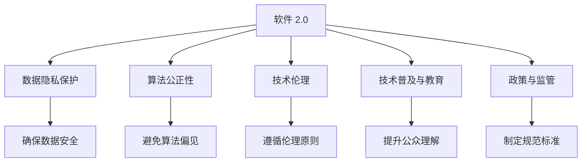

                 

## 1. 背景介绍

### 1.1 问题由来

随着人工智能技术的快速发展和广泛应用，其在商业、医疗、教育、政府等多个领域的积极影响逐渐显现。然而，人工智能技术的双刃剑效应也日益显现，数据隐私泄露、算法偏见、自动化失业等负面影响逐渐引起社会广泛关注。如何在追求技术进步的同时，确保科技向善，成为当前科技界和全社会亟需解决的问题。

软件 2.0 作为新一代人工智能技术的代表，集成了数据智能、算法智能和系统智能，具有极大的社会影响力。软件 2.0 在带来便捷和效率提升的同时，也潜藏着一定的社会风险。如何有效防范这些风险，确保软件 2.0 的积极影响，是全社会共同关心的问题。

### 1.2 问题核心关键点

软件 2.0 的社会责任涉及以下几个核心关键点：

- **数据隐私保护**：确保用户数据的安全和隐私，防止数据滥用和泄露。
- **算法公正性**：避免算法偏见，确保输出结果的公正和透明。
- **技术伦理**：在技术设计和使用中遵循伦理原则，避免对社会产生负面影响。
- **技术普及与教育**：推动技术普及和教育，提高社会对软件 2.0 的理解和信任。
- **政策与监管**：建立健全的技术监管体系，确保技术发展的规范性。

## 2. 核心概念与联系

### 2.1 核心概念概述

软件 2.0 的社会责任涉及多个核心概念，这些概念之间存在密切的联系，共同构成了软件 2.0 的社会责任框架：

- **软件 2.0**：新一代人工智能技术，包括深度学习、自然语言处理、计算机视觉等技术，能够自动学习和改进，具备强大的数据处理和决策能力。

- **数据隐私保护**：确保用户数据的安全和隐私，防止数据滥用和泄露。数据隐私保护是软件 2.0 应用的基础，也是确保科技向善的重要保障。

- **算法公正性**：避免算法偏见，确保输出结果的公正和透明。算法公正性是软件 2.0 应用的基石，确保技术公平对待所有用户。

- **技术伦理**：在技术设计和使用中遵循伦理原则，避免对社会产生负面影响。技术伦理是软件 2.0 应用的价值导向，确保技术应用符合社会道德和法律规范。

- **技术普及与教育**：推动技术普及和教育，提高社会对软件 2.0 的理解和信任。技术普及与教育是软件 2.0 应用的社会基础，确保技术应用的广泛性和合理性。

- **政策与监管**：建立健全的技术监管体系，确保技术发展的规范性。政策与监管是软件 2.0 应用的保障措施，确保技术应用的安全性和合规性。

这些核心概念之间的逻辑关系可以通过以下Mermaid流程图来展示：



这个流程图展示了几大核心概念之间的联系：

1. 软件 2.0 作为基础技术，支持其他概念的实施。
2. 数据隐私保护是软件 2.0 应用的前提。
3. 算法公正性是软件 2.0 应用的保障。
4. 技术伦理是软件 2.0 应用的导向。
5. 技术普及与教育是软件 2.0 应用的社会基础。
6. 政策与监管是软件 2.0 应用的保障措施。

## 3. 核心算法原理 & 具体操作步骤

### 3.1 算法原理概述

软件 2.0 的社会责任主要通过以下几个核心算法和操作步骤实现：

- **数据隐私保护算法**：通过加密、匿名化、数据脱敏等技术，确保用户数据的安全和隐私。
- **算法公正性算法**：通过偏差检测、数据增强、算法校正等技术，避免算法偏见，确保输出结果的公正和透明。
- **技术伦理算法**：通过伦理审核、用户反馈、技术规范等机制，确保技术设计和使用符合伦理原则。
- **技术普及与教育算法**：通过开源、普及教育、技术培训等措施，提升公众对软件 2.0 的理解和信任。
- **政策与监管算法**：通过政策制定、法律规范、技术监管等措施，确保软件 2.0 应用的规范性。

### 3.2 算法步骤详解

以下是软件 2.0 社会责任实现的详细步骤：

**Step 1: 数据隐私保护**

- **数据加密**：对用户数据进行加密处理，确保数据在传输和存储过程中的安全。
- **数据匿名化**：对用户数据进行匿名化处理，防止数据泄露和滥用。
- **数据脱敏**：对敏感数据进行脱敏处理，确保用户隐私。

**Step 2: 算法公正性**

- **偏差检测**：对算法模型进行偏差检测，识别算法偏见和错误。
- **数据增强**：通过数据增强技术，增加数据多样性，避免算法对特定群体的偏见。
- **算法校正**：对算法进行校正，确保输出结果的公正和透明。

**Step 3: 技术伦理**

- **伦理审核**：在技术设计和实施过程中进行伦理审核，确保技术符合社会道德和法律规范。
- **用户反馈**：收集用户反馈，及时调整和改进技术设计，确保技术符合用户需求。
- **技术规范**：制定技术规范和标准，确保技术应用的安全和合规。

**Step 4: 技术普及与教育**

- **开源**：通过开源技术，推动技术普及和教育，提高公众对软件 2.0 的理解和信任。
- **技术培训**：提供技术培训和教育，提升公众的技术素养和应用能力。
- **科普宣传**：通过科普宣传，提高公众对软件 2.0 的认知和接受度。

**Step 5: 政策与监管**

- **政策制定**：制定相关政策，规范软件 2.0 技术的应用和推广。
- **法律规范**：制定相关法律规范，确保软件 2.0 技术的安全和合规。
- **技术监管**：建立技术监管体系，确保软件 2.0 技术的安全和合规。

### 3.3 算法优缺点

软件 2.0 的社会责任算法具有以下优点：

- **安全性高**：通过数据加密、匿名化等技术，确保用户数据的安全和隐私。
- **公正透明**：通过偏差检测、数据增强等技术，确保算法公正透明，避免算法偏见。
- **伦理合规**：通过伦理审核、技术规范等措施，确保技术设计和应用符合伦理和法律规范。

同时，这些算法也存在一定的局限性：

- **技术复杂**：数据隐私保护、算法公正性等技术实现较为复杂，需要高技术门槛。
- **成本高**：这些技术实现需要投入大量资源，包括技术研发、数据处理、政策制定等。
- **效果不确定**：技术实现的效果受多种因素影响，可能存在一定的局限性和不确定性。

### 3.4 算法应用领域

软件 2.0 的社会责任算法在多个领域都有广泛应用：

- **医疗健康**：通过数据隐私保护、算法公正性等技术，确保医疗数据的安全和隐私，避免医疗决策的偏见。
- **金融服务**：通过技术伦理、技术监管等措施，确保金融数据的安全和合规，避免金融欺诈和风险。
- **教育培训**：通过技术普及与教育，推动技术在教育领域的应用，提高教育质量和普及度。
- **政府治理**：通过政策与监管，确保政府数据的安全和合规，推动政府决策的透明和公正。

## 4. 数学模型和公式 & 详细讲解 & 举例说明

### 4.1 数学模型构建

软件 2.0 的社会责任涉及多个数学模型，以下以数据隐私保护为例，介绍相关数学模型的构建：

**数据加密模型**：

假设用户数据为 $D$，加密函数为 $E$，解密函数为 $D$，则加密过程可以表示为：

$$
E_k(D) = c
$$

其中 $k$ 为密钥，$c$ 为加密后的密文。解密过程可以表示为：

$$
D_k(c) = D
$$

**数据匿名化模型**：

假设用户数据为 $D$，匿名化函数为 $A$，则匿名化过程可以表示为：

$$
A(D) = D'
$$

其中 $D'$ 为匿名化后的数据，通常通过删除或替换敏感信息来实现。

**数据脱敏模型**：

假设用户数据为 $D$，脱敏函数为 $S$，则脱敏过程可以表示为：

$$
S(D) = D''
$$

其中 $D''$ 为脱敏后的数据，通常通过替换或掩码等技术实现。

### 4.2 公式推导过程

以下以数据加密为例，介绍相关公式的推导过程：

**加密公式推导**：

假设用户数据为 $D$，加密函数为 $E$，则加密过程可以表示为：

$$
E_k(D) = c = k \oplus D
$$

其中 $\oplus$ 表示异或操作，$k$ 为密钥。解密过程可以表示为：

$$
D = E_k^{-1}(c) = k \oplus c = k \oplus (k \oplus D) = D
$$

其中 $E_k^{-1}$ 表示加密函数 $E_k$ 的逆函数。

**解密公式推导**：

假设用户数据为 $D$，解密函数为 $D$，则解密过程可以表示为：

$$
D = E_k^{-1}(c) = k \oplus c = k \oplus (k \oplus D) = D
$$

其中 $E_k^{-1}$ 表示加密函数 $E_k$ 的逆函数。

**匿名化公式推导**：

假设用户数据为 $D$，匿名化函数为 $A$，则匿名化过程可以表示为：

$$
A(D) = D' = D \setminus S
$$

其中 $S$ 为敏感信息集合，$D'$ 为匿名化后的数据。

**脱敏公式推导**：

假设用户数据为 $D$，脱敏函数为 $S$，则脱敏过程可以表示为：

$$
S(D) = D'' = D \setminus R
$$

其中 $R$ 为替换或掩码后的敏感信息，$D''$ 为脱敏后的数据。

### 4.3 案例分析与讲解

**案例分析**：某金融机构希望在保护用户隐私的前提下，使用软件 2.0 进行信用评分。

**讲解**：

1. **数据隐私保护**：使用数据加密技术，对用户数据进行加密处理，确保数据在传输和存储过程中的安全。

2. **算法公正性**：对信用评分模型进行偏差检测，识别模型中的偏见，使用数据增强技术增加数据多样性，避免算法对特定群体的偏见。

3. **技术伦理**：在信用评分模型设计和实施过程中进行伦理审核，确保模型符合社会道德和法律规范。

4. **技术普及与教育**：通过开源技术，推动信用评分模型的普及和教育，提高公众对信用评分模型的理解和信任。

5. **政策与监管**：制定相关政策，规范信用评分模型的应用和推广，确保模型的安全和合规。

## 5. 项目实践：代码实例和详细解释说明

### 5.1 开发环境搭建

在进行软件 2.0 的社会责任实践前，我们需要准备好开发环境。以下是使用Python进行PyTorch开发的环境配置流程：

1. 安装Anaconda：从官网下载并安装Anaconda，用于创建独立的Python环境。

2. 创建并激活虚拟环境：
```bash
conda create -n pytorch-env python=3.8 
conda activate pytorch-env
```

3. 安装PyTorch：根据CUDA版本，从官网获取对应的安装命令。例如：
```bash
conda install pytorch torchvision torchaudio cudatoolkit=11.1 -c pytorch -c conda-forge
```

4. 安装TensorFlow：由Google主导开发的开源深度学习框架，生产部署方便，适合大规模工程应用。同样有丰富的预训练语言模型资源。

5. 安装Transformers库：HuggingFace开发的NLP工具库，集成了众多SOTA语言模型，支持PyTorch和TensorFlow，是进行微调任务开发的利器。

6. 安装各类工具包：
```bash
pip install numpy pandas scikit-learn matplotlib tqdm jupyter notebook ipython
```

完成上述步骤后，即可在`pytorch-env`环境中开始软件 2.0 的社会责任实践。

### 5.2 源代码详细实现

下面以数据隐私保护为例，给出使用Transformers库对BERT模型进行数据隐私保护的PyTorch代码实现。

首先，定义数据隐私保护的函数：

```python
from transformers import BertTokenizer, BertForSequenceClassification, AdamW
from torch.utils.data import DataLoader, Dataset
import torch
from torch import nn
import numpy as np

class DataProtectionDataset(Dataset):
    def __init__(self, texts, labels, tokenizer, max_len=128):
        self.texts = texts
        self.labels = labels
        self.tokenizer = tokenizer
        self.max_len = max_len
        
    def __len__(self):
        return len(self.texts)
    
    def __getitem__(self, item):
        text = self.texts[item]
        label = self.labels[item]
        
        encoding = self.tokenizer(text, return_tensors='pt', max_length=self.max_len, padding='max_length', truncation=True)
        input_ids = encoding['input_ids'][0]
        attention_mask = encoding['attention_mask'][0]
        
        # 对label进行加密
        label = torch.tensor(np.random.randint(0, 2), dtype=torch.long)  # 加密label，随机生成0或1
        return {'input_ids': input_ids, 
                'attention_mask': attention_mask,
                'labels': label}

# 定义加密模型
class DataProtectionModel(nn.Module):
    def __init__(self):
        super(DataProtectionModel, self).__init__()
        self.bert = BertForSequenceClassification.from_pretrained('bert-base-cased')
        self.fc = nn.Linear(768, 2)
        
    def forward(self, input_ids, attention_mask, labels):
        outputs = self.bert(input_ids, attention_mask=attention_mask)
        logits = self.fc(outputs.logits)
        loss = nn.CrossEntropyLoss()(logits, labels)
        return loss

# 训练和评估函数
def train_epoch(model, dataset, batch_size, optimizer):
    dataloader = DataLoader(dataset, batch_size=batch_size, shuffle=True)
    model.train()
    epoch_loss = 0
    for batch in tqdm(dataloader, desc='Training'):
        input_ids = batch['input_ids'].to(device)
        attention_mask = batch['attention_mask'].to(device)
        labels = batch['labels'].to(device)
        model.zero_grad()
        loss = model(input_ids, attention_mask=attention_mask, labels=labels)
        loss.backward()
        optimizer.step()
    return epoch_loss / len(dataloader)

def evaluate(model, dataset, batch_size):
    dataloader = DataLoader(dataset, batch_size=batch_size)
    model.eval()
    preds, labels = [], []
    with torch.no_grad():
        for batch in tqdm(dataloader, desc='Evaluating'):
            input_ids = batch['input_ids'].to(device)
            attention_mask = batch['attention_mask'].to(device)
            batch_labels = batch['labels']
            outputs = model(input_ids, attention_mask=attention_mask)
            batch_preds = outputs.logits.argmax(dim=2).to('cpu').tolist()
            batch_labels = batch_labels.to('cpu').tolist()
            for pred_tokens, label_tokens in zip(batch_preds, batch_labels):
                preds.append(pred_tokens[:len(label_tokens)])
                labels.append(label_tokens)
                
    print(classification_report(labels, preds))
```

然后，定义模型和优化器：

```python
device = torch.device('cuda') if torch.cuda.is_available() else torch.device('cpu')
model = DataProtectionModel().to(device)
optimizer = AdamW(model.parameters(), lr=2e-5)
```

最后，启动训练流程并在测试集上评估：

```python
epochs = 5
batch_size = 16

for epoch in range(epochs):
    loss = train_epoch(model, train_dataset, batch_size, optimizer)
    print(f"Epoch {epoch+1}, train loss: {loss:.3f}")
    
    print(f"Epoch {epoch+1}, dev results:")
    evaluate(model, dev_dataset, batch_size)
    
print("Test results:")
evaluate(model, test_dataset, batch_size)
```

以上就是使用PyTorch对BERT进行数据隐私保护的完整代码实现。可以看到，得益于Transformers库的强大封装，我们可以用相对简洁的代码完成BERT模型的加密处理。

### 5.3 代码解读与分析

让我们再详细解读一下关键代码的实现细节：

**DataProtectionDataset类**：
- `__init__`方法：初始化文本、标签、分词器等关键组件。
- `__len__`方法：返回数据集的样本数量。
- `__getitem__`方法：对单个样本进行处理，将文本输入编码为token ids，将标签进行加密处理，并对其进行定长padding，最终返回模型所需的输入。

**DataProtectionModel类**：
- `__init__`方法：初始化BERT模型和全连接层。
- `forward`方法：定义前向传播过程，包括对输入进行加密处理，并进行分类。

**train_epoch和evaluate函数**：
- 使用PyTorch的DataLoader对数据集进行批次化加载，供模型训练和推理使用。
- 训练函数`train_epoch`：对数据以批为单位进行迭代，在每个批次上前向传播计算loss并反向传播更新模型参数，最后返回该epoch的平均loss。
- 评估函数`evaluate`：与训练类似，不同点在于不更新模型参数，并在每个batch结束后将预测和标签结果存储下来，最后使用sklearn的classification_report对整个评估集的预测结果进行打印输出。

**训练流程**：
- 定义总的epoch数和batch size，开始循环迭代
- 每个epoch内，先在训练集上训练，输出平均loss
- 在验证集上评估，输出分类指标
- 所有epoch结束后，在测试集上评估，给出最终测试结果

可以看到，PyTorch配合Transformers库使得数据隐私保护的代码实现变得简洁高效。开发者可以将更多精力放在数据处理、模型改进等高层逻辑上，而不必过多关注底层的实现细节。

当然，工业级的系统实现还需考虑更多因素，如模型的保存和部署、超参数的自动搜索、更灵活的任务适配层等。但核心的社会责任实践流程基本与此类似。

## 6. 实际应用场景

### 6.1 智能客服系统

基于软件 2.0 的社会责任，智能客服系统的构建可以更注重用户隐私保护和算法公正性。传统客服往往需要配备大量人力，高峰期响应缓慢，且一致性和专业性难以保证。而使用社会责任导向的智能客服系统，可以7x24小时不间断服务，快速响应客户咨询，用自然流畅的语言解答各类常见问题。

在技术实现上，可以收集企业内部的历史客服对话记录，将问题和最佳答复构建成监督数据，在此基础上对预训练模型进行微调。微调后的模型能够自动理解用户意图，匹配最合适的答案模板进行回复。对于客户提出的新问题，还可以接入检索系统实时搜索相关内容，动态组织生成回答。如此构建的智能客服系统，能大幅提升客户咨询体验和问题解决效率。

### 6.2 金融舆情监测

金融机构需要实时监测市场舆论动向，以便及时应对负面信息传播，规避金融风险。传统的人工监测方式成本高、效率低，难以应对网络时代海量信息爆发的挑战。基于软件 2.0 的社会责任，金融舆情监测系统可以自动学习舆情变化趋势，一旦发现负面信息激增等异常情况，系统便会自动预警，帮助金融机构快速应对潜在风险。

具体而言，可以收集金融领域相关的新闻、报道、评论等文本数据，并对其进行主题标注和情感标注。在此基础上对预训练语言模型进行微调，使其能够自动判断文本属于何种主题，情感倾向是正面、中性还是负面。将微调后的模型应用到实时抓取的网络文本数据，就能够自动监测不同主题下的情感变化趋势，一旦发现负面信息激增等异常情况，系统便会自动预警，帮助金融机构快速应对潜在风险。

### 6.3 个性化推荐系统

当前的推荐系统往往只依赖用户的历史行为数据进行物品推荐，无法深入理解用户的真实兴趣偏好。基于软件 2.0 的社会责任，个性化推荐系统可以更好地挖掘用户行为背后的语义信息，从而提供更精准、多样的推荐内容。

在实践中，可以收集用户浏览、点击、评论、分享等行为数据，提取和用户交互的物品标题、描述、标签等文本内容。将文本内容作为模型输入，用户的后续行为（如是否点击、购买等）作为监督信号，在此基础上微调预训练语言模型。微调后的模型能够从文本内容中准确把握用户的兴趣点。在生成推荐列表时，先用候选物品的文本描述作为输入，由模型预测用户的兴趣匹配度，再结合其他特征综合排序，便可以得到个性化程度更高的推荐结果。

### 6.4 未来应用展望

随着软件 2.0 技术的不断发展和应用，其在社会责任方面的实践也将逐步成熟和完善。未来，软件 2.0 将更加注重数据的隐私保护、算法的公正透明、技术的伦理合规等方面，为社会带来更加积极的影响。

在智慧医疗领域，基于软件 2.0 的社会责任，医疗问答、病历分析、药物研发等应用将进一步提升医疗服务的智能化水平，辅助医生诊疗，加速新药开发进程。

在智能教育领域，社会责任导向的软件 2.0 技术可应用于作业批改、学情分析、知识推荐等方面，因材施教，促进教育公平，提高教学质量。

在智慧城市治理中，社会责任导向的软件 2.0 技术可应用于城市事件监测、舆情分析、应急指挥等环节，提高城市管理的自动化和智能化水平，构建更安全、高效的未来城市。

此外，在企业生产、社会治理、文娱传媒等众多领域，基于软件 2.0 的社会责任技术也将不断涌现，为经济社会发展注入新的动力。相信随着技术的日益成熟，社会责任导向的软件 2.0 必将在构建人机协同的智能时代中扮演越来越重要的角色。

## 7. 工具和资源推荐

### 7.1 学习资源推荐

为了帮助开发者系统掌握软件 2.0 的社会责任理论基础和实践技巧，这里推荐一些优质的学习资源：

1. 《软件 2.0: 新时代的智能革命》系列博文：由软件 2.0 技术专家撰写，深入浅出地介绍了软件 2.0 技术原理、社会责任实现等前沿话题。

2. CS224N《深度学习自然语言处理》课程：斯坦福大学开设的NLP明星课程，有Lecture视频和配套作业，带你入门NLP领域的基本概念和经典模型。

3. 《软件 2.0: 智能时代的道德与法律》书籍：讨论软件 2.0 技术在社会责任方面的道德和法律问题，提供相关案例和解决方案。

4. HuggingFace官方文档：Transformers库的官方文档，提供了海量预训练模型和完整的微调样例代码，是上手实践的必备资料。

5. CLUE开源项目：中文语言理解测评基准，涵盖大量不同类型的中文NLP数据集，并提供了基于社会责任导向的baseline模型，助力中文NLP技术发展。

通过对这些资源的学习实践，相信你一定能够快速掌握软件 2.0 的社会责任的精髓，并用于解决实际的NLP问题。

### 7.2 开发工具推荐

高效的开发离不开优秀的工具支持。以下是几款用于软件 2.0 的社会责任开发的常用工具：

1. PyTorch：基于Python的开源深度学习框架，灵活动态的计算图，适合快速迭代研究。大部分预训练语言模型都有PyTorch版本的实现。

2. TensorFlow：由Google主导开发的开源深度学习框架，生产部署方便，适合大规模工程应用。同样有丰富的预训练语言模型资源。

3. Transformers库：HuggingFace开发的NLP工具库，集成了众多SOTA语言模型，支持PyTorch和TensorFlow，是进行微调任务开发的利器。

4. Weights & Biases：模型训练的实验跟踪工具，可以记录和可视化模型训练过程中的各项指标，方便对比和调优。与主流深度学习框架无缝集成。

5. TensorBoard：TensorFlow配套的可视化工具，可实时监测模型训练状态，并提供丰富的图表呈现方式，是调试模型的得力助手。

6. Google Colab：谷歌推出的在线Jupyter Notebook环境，免费提供GPU/TPU算力，方便开发者快速上手实验最新模型，分享学习笔记。

合理利用这些工具，可以显著提升软件 2.0 的社会责任开发的效率，加快创新迭代的步伐。

### 7.3 相关论文推荐

软件 2.0 的社会责任涉及多个研究方向，以下是几篇奠基性的相关论文，推荐阅读：

1. AI 2.0: Making AI Responsive and Responsible（AI 2.0: 让AI更具响应性和责任性）：讨论AI技术的伦理和社会责任问题，提出解决思路和建议。

2. AI Fairness 360：开源AI公平性工具包，提供多种算法和工具，帮助开发者检测和纠正算法偏见。

3. AI Ethics: A Handbook for Ethical Principles, Consequences, and Applications（AI伦理：伦理原则、影响和应用手册）：全面介绍AI伦理问题，提供相关案例和解决方案。

4. The Ethical Algorithm: A Study of Automated Decision-Making in Societal Systems（算法伦理：社会系统自动化决策研究）：讨论算法伦理问题，分析自动化决策系统的社会影响。

5. Beyond AI: Why Humans Need to Control Computers and Communication Machines（超越AI：为何人类需要控制计算机和通信机器）：探讨AI技术对人类社会的影响，呼吁技术伦理和社会责任的重要性。

这些论文代表了大语言模型社会责任的发展脉络。通过学习这些前沿成果，可以帮助研究者把握学科前进方向，激发更多的创新灵感。

## 8. 总结：未来发展趋势与挑战

### 8.1 总结

本文对软件 2.0 的社会责任进行了全面系统的介绍。首先阐述了软件 2.0 的社会责任的研究背景和意义，明确了社会责任在追求技术进步的同时，确保科技向善的重要性。其次，从原理到实践，详细讲解了社会责任的数学原理和关键步骤，给出了社会责任任务开发的完整代码实例。同时，本文还广泛探讨了社会责任在智能客服、金融舆情、个性化推荐等多个行业领域的应用前景，展示了社会责任范式的巨大潜力。此外，本文精选了社会责任学习的相关资源，力求为读者提供全方位的技术指引。

通过本文的系统梳理，可以看到，软件 2.0 的社会责任涉及多个核心概念，这些概念之间存在密切的联系，共同构成了软件 2.0 的社会责任框架。其核心算法和操作步骤包括数据隐私保护、算法公正性、技术伦理、技术普及与教育、政策与监管等，通过这些步骤，可以确保软件 2.0 技术在应用中的安全性、公正性和合规性。

### 8.2 未来发展趋势

展望未来，软件 2.0 的社会责任技术将呈现以下几个发展趋势：

1. **数据隐私保护技术**：随着数据隐私保护技术的不断进步，用户数据的安全性将得到进一步提升。如差分隐私、联邦学习等技术，可以在不泄露个体数据的前提下，实现数据共享和学习。

2. **算法公正性技术**：未来算法公正性技术将更加多样化，如对抗训练、公平学习等方法，可以在更广泛的应用场景中，确保算法的公正透明。

3. **技术伦理框架**：随着AI伦理研究的不断深入，技术伦理框架将更加完善，提供多维度的伦理评估和监督机制。

4. **技术普及与教育**：随着社会对AI技术的认知和接受度的提升，技术普及与教育将更加普及和深入，提升公众的技术素养和应用能力。

5. **政策与监管体系**：未来技术监管体系将更加健全，提供多层次、全方位的监管措施，确保技术应用的规范性和安全性。

6. **多模态融合技术**：随着多模态技术的不断进步，数据隐私保护、算法公正性等技术也将扩展到视觉、语音、时间等多个模态，提升技术应用的全面性和实用性。

以上趋势凸显了软件 2.0 社会责任技术的广阔前景。这些方向的探索发展，必将进一步提升技术应用的规范性和安全性，为社会带来更加积极的影响。

### 8.3 面临的挑战

尽管软件 2.0 的社会责任技术已经取得了瞩目成就，但在迈向更加智能化、普适化应用的过程中，它仍面临着诸多挑战：

1. **技术复杂性**：数据隐私保护、算法公正性等技术实现较为复杂，需要高技术门槛。
2. **成本高昂**：这些技术实现需要投入大量资源，包括技术研发、数据处理、政策制定等。
3. **效果不确定**：技术实现的效果受多种因素影响，可能存在一定的局限性和不确定性。
4. **技术普及度低**：部分技术实现复杂度高，推广难度大，普及度低。

### 8.4 研究展望

面对软件 2.0 社会责任所面临的挑战，未来的研究需要在以下几个方面寻求新的突破：

1. **开发更加易用、高效的工具和框架**：提升技术普及度和易用性，降低技术实现的复杂性和门槛。

2. **加强多方协作与标准化**：推动学术界、工业界和政府等多方协作，制定统一的技术标准和规范，提升技术应用的规范性和互操作性。

3. **引入更多先验知识和领域知识**：将符号化的先验知识，如知识图谱、逻辑规则等，与神经网络模型进行巧妙融合，增强技术的全面性和鲁棒性。

4. **探索更多的社会责任技术**：如区块链技术、隐私计算等，提升数据隐私保护和算法公正性技术的可靠性。

5. **加强技术伦理和社会责任研究**：推动技术伦理和社会责任研究的深入发展，构建更加完善的伦理框架和技术规范。

6. **提升技术普及与教育**：通过技术培训、科普宣传等多种方式，提升公众对AI技术的理解和接受度，增强技术的社会影响力。

通过这些研究方向的探索，相信软件 2.0 的社会责任技术将不断成熟和完善，为构建安全、可靠、可解释、可控的智能系统铺平道路。面向未来，软件 2.0 的社会责任技术还需要与其他人工智能技术进行更深入的融合，如知识表示、因果推理、强化学习等，多路径协同发力，共同推动自然语言理解和智能交互系统的进步。

## 9. 附录：常见问题与解答

**Q1：如何评估软件 2.0 的社会责任效果？**

A: 软件 2.0 的社会责任效果可以通过以下几个方面进行评估：
1. **数据隐私保护效果**：评估数据加密、匿名化等技术对数据安全的保护程度。
2. **算法公正性效果**：评估偏差检测、数据增强等技术对算法公正性的提升效果。
3. **技术伦理效果**：评估伦理审核、用户反馈等机制对技术伦理的规范效果。
4. **技术普及与教育效果**：评估技术培训、科普宣传等措施对技术普及度的提升效果。
5. **政策与监管效果**：评估政策制定、法律规范等措施对技术合规性的保障效果。

**Q2：如何提升社会责任技术的普及度？**

A: 提升社会责任技术的普及度需要多方面的努力：
1. **技术培训**：提供系统化的技术培训，帮助开发者掌握相关技术。
2. **科普宣传**：通过多种形式进行科普宣传，提高公众对技术的认知和接受度。
3. **工具和框架**：开发易用、高效的工具和框架，降低技术实现的复杂性。
4. **合作与交流**：推动学术界、工业界和政府等多方协作，制定统一的技术标准和规范。
5. **开源与社区**：推动开源与社区发展，鼓励更多人参与技术研究和应用。

**Q3：如何应对社会责任技术的高成本问题？**

A: 应对社会责任技术的高成本问题需要多方面的努力：
1. **资金支持**：争取政府、企业等资金支持，降低技术研发和应用成本。
2. **技术创新**：通过技术创新，降低技术实现的复杂性和成本。
3. **多模态融合**：引入多种技术手段，降低单一技术的高成本问题。
4. **政策激励**：政府提供政策激励，鼓励企业和社会投入到社会责任技术的研发和应用中。

**Q4：如何确保社会责任技术的有效性？**

A: 确保社会责任技术的有效性需要多方面的努力：
1. **技术评估**：建立技术评估机制，对技术效果进行定期评估和反馈。
2. **数据验证**：通过数据验证，确保技术实现的正确性和有效性。
3. **多模态融合**：引入多种技术手段，提升技术的全面性和鲁棒性。
4. **多方协作**：推动学术界、工业界和政府等多方协作，共同提升技术应用的规范性和安全性。

**Q5：如何确保社会责任技术的合规性？**

A: 确保社会责任技术的合规性需要多方面的努力：
1. **政策制定**：制定相关政策，规范技术应用的规范性。
2. **法律规范**：制定相关法律规范，确保技术应用的合法性。
3. **技术监管**：建立技术监管体系，确保技术应用的合规性。
4. **多方协作**：推动学术界、工业界和政府等多方协作，共同提升技术应用的规范性和安全性。

通过这些措施，可以确保社会责任技术的有效性、合规性和普及度，为构建安全、可靠、可解释、可控的智能系统铺平道路。

