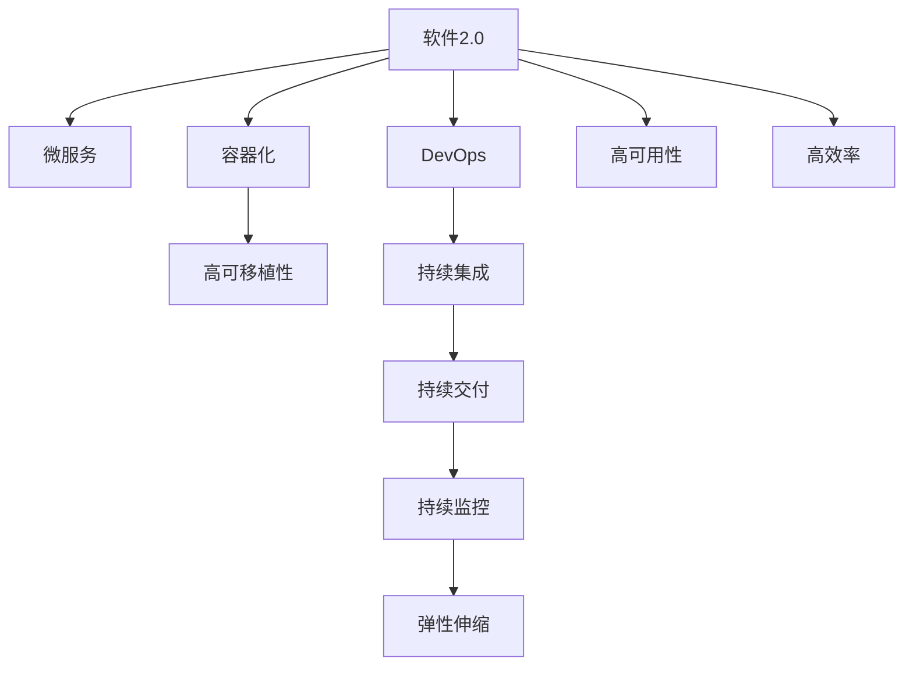

                 

# 软件2.0的高可移植性

在数字化转型加速的时代，软件的可移植性成为了企业、开发者、用户关注的焦点。尤其是软件2.0时代，基于云的、分布式和微服务架构的应用程序和业务流程越来越多，对软件的可移植性提出了更高的要求。本文将从背景介绍、核心概念、算法原理、操作步骤、数学模型、项目实践、应用场景、工具资源推荐、总结与展望、附录等多个维度，全面阐述软件2.0的高可移植性原理与应用实践。

## 1. 背景介绍

### 1.1 问题由来

随着云计算、微服务和分布式架构的兴起，软件的部署和运行环境变得日益复杂。如何在多样化的硬件、操作系统、网络环境中保证软件的稳定运行和高效性能，成为了软件开发中的一大挑战。此外，全球化的业务需求要求软件能够在不同地域和时区中灵活部署，同时保持一致的用户体验。这就对软件的高可移植性提出了更高的要求。

软件2.0的到来，进一步推动了软件可移植性的发展。软件2.0以云计算和微服务为基础，结合人工智能、区块链、物联网等前沿技术，实现了更强的自动化、更高效的运维和更灵活的部署。但随之而来的是更多的系统复杂性、更细粒度的管理需求。如何有效地管理和优化软件的高可移植性，成为了软件开发中迫切需要解决的问题。

### 1.2 问题核心关键点

- **分布式架构**：软件2.0时代，软件往往采用微服务架构，分布在多个节点上运行。如何保证各个服务之间的协同工作，保持整个系统的稳定性和高效性。
- **跨平台兼容性**：软件需要在不同的操作系统、硬件和网络环境中正常运行。如何设计软件架构和编码方式，以适应不同平台的需求。
- **弹性伸缩**：软件需要根据负载动态调整资源分配，以应对不同流量需求。如何设计自适应机制，实现弹性伸缩。
- **故障容忍与恢复**：软件需要在发生故障时快速恢复，保持服务的连续性。如何构建容错机制，提高系统的可靠性。
- **性能优化**：软件需要在多样化的运行环境中保持高性能。如何优化代码和架构，提升系统效率。

## 2. 核心概念与联系

### 2.1 核心概念概述

为了更好地理解软件2.0的高可移植性原理与应用实践，本节将介绍几个密切相关的核心概念：

- **软件2.0**：以云计算、微服务、DevOps、容器化为代表的现代化软件开发范式，强调自动化、弹性、自适应和高效。
- **高可移植性**：软件能够在不同平台、环境和设备上无障碍运行的能力。
- **容器化**：将软件打包到可移植的容器中，实现跨平台和跨环境的部署。
- **微服务架构**：将大型应用拆分为一系列小型、独立的服务，通过网络进行通信和数据共享。
- **DevOps**：开发与运维的紧密结合，强调持续集成、持续交付和持续监控。

这些核心概念之间的逻辑关系可以通过以下Mermaid流程图来展示：



这个流程图展示了大规模软件开发中的几个关键概念及其相互关系：

1. 软件2.0以微服务架构为基础，通过容器化实现跨平台部署。
2. DevOps通过持续集成、持续交付和持续监控，保证软件的高效率和稳定性。
3. 高可移植性、弹性伸缩和高可用性确保软件在不同环境中的稳定运行。

## 3. 核心算法原理 & 具体操作步骤

### 3.1 算法原理概述

软件2.0的高可移植性原理基于以下几个关键算法和技术：

- **容器化技术**：将软件打包到容器镜像中，通过容器引擎（如Docker）实现跨平台部署。
- **服务发现与负载均衡**：通过服务发现机制（如Consul、Kubernetes）和负载均衡器（如Nginx），实现服务的自动注册和流量分配。
- **微服务架构**：将大型应用拆分为多个小型、独立的服务，通过API网关进行调用和管理。
- **DevOps实践**：通过持续集成、持续交付和持续监控，自动化软件开发生命周期，提高生产效率和系统可靠性。
- **弹性伸缩与自适应管理**：通过容器编排工具（如Kubernetes）和自动扩缩容机制，实现基于负载的动态资源调整。

### 3.2 算法步骤详解

基于上述核心算法，软件2.0的高可移植性主要分为以下几个步骤：

**Step 1: 系统设计**

1. **架构设计**：根据业务需求设计微服务架构，明确各个服务的职责和接口。
2. **容器化设计**：确定使用哪些容器镜像，如何进行依赖管理和版本控制。
3. **负载均衡设计**：选择合适的负载均衡器和服务发现机制，实现服务的动态注册和发现。
4. **弹性伸缩设计**：定义自动扩缩容策略，确保系统能根据负载动态调整资源。

**Step 2: 代码实现**

1. **服务拆分**：将应用拆分为多个小型服务，独立部署和管理。
2. **容器打包**：将服务打包成容器镜像，并上传到容器仓库。
3. **接口定义**：明确服务间的通信接口和协议，设计API网关。
4. **负载均衡和注册**：使用服务发现和负载均衡工具，实现服务的自动注册和负载均衡。
5. **弹性伸缩配置**：配置自动扩缩容策略，实现基于负载的资源动态调整。

**Step 3: 部署与运维**

1. **环境准备**：搭建容器引擎和容器编排平台，准备基础运行环境。
2. **服务部署**：使用容器引擎部署服务，启动容器实例。
3. **监控与调优**：使用持续监控工具，实时监控系统性能，根据监控结果进行调优。
4. **故障处理**：建立故障检测和恢复机制，确保系统在故障发生时能够快速恢复。

### 3.3 算法优缺点

软件2.0的高可移植性具有以下优点：

1. **跨平台部署**：容器化技术确保了软件在不同平台上的跨平台部署，降低了环境配置的复杂性。
2. **高扩展性**：微服务架构和容器编排工具支持弹性伸缩，能够灵活应对不同规模的流量需求。
3. **自动化管理**：DevOps实践通过持续集成、持续交付和持续监控，自动化软件开发生命周期，提高了生产效率和系统可靠性。
4. **自适应性**：容器编排工具支持自动扩缩容，能够根据负载动态调整资源，实现系统自适应。

同时，也存在一些缺点：

1. **资源消耗**：容器化和微服务架构带来了额外的资源消耗，需要额外考虑性能和成本。
2. **复杂性增加**：微服务拆分增加了系统复杂性，维护和管理难度增加。
3. **网络通信开销**：微服务架构中服务间的通信增加了网络开销，需要合理设计API网关和负载均衡器。
4. **学习曲线陡峭**：新技术和工具的学习曲线较陡峭，需要一定的学习和适应时间。

### 3.4 算法应用领域

软件2.0的高可移植性已经在多个领域得到了广泛应用，例如：

- **金融科技**：银行和金融机构采用微服务架构，实现了快速开发、部署和故障恢复。
- **电商零售**：电商平台通过容器化和微服务实现了高可用和高扩展性，满足了海量用户的访问需求。
- **物联网**：IoT设备通过容器化技术实现了跨平台部署，提升了设备管理和维护的效率。
- **智能制造**：工业互联网通过微服务架构实现了生产设备的远程监控和控制，提升了生产效率和可靠性。
- **云服务**：云服务提供商通过容器化和微服务，实现了高可用和高扩展性，满足了不同类型的业务需求。

除了上述这些领域外，软件2.0的高可移植性还将继续拓展到更多场景中，如医疗健康、教育培训、城市治理等，为各行各业提供新的技术支撑。

## 4. 数学模型和公式 & 详细讲解 & 举例说明

### 4.1 数学模型构建

为了更好地理解软件2.0的高可移植性原理，本节将使用数学语言对相关概念进行详细阐述。

假设有一个分布式系统，包含多个微服务节点 $S_1, S_2, ..., S_n$。每个服务节点 $S_i$ 的负载为 $L_i$，处理请求的时间为 $T_i$，请求到达的速度为 $R_i$。系统的总负载为 $L$，总处理时间为 $T$，总请求速度为 $R$。

定义系统的**负载均衡系数**为 $\alpha$，即：

$$
\alpha = \frac{L}{\sum_{i=1}^n L_i}
$$

系统的**处理时间效率**为 $\beta$，即：

$$
\beta = \frac{T}{\sum_{i=1}^n T_i}
$$

系统的**请求速度效率**为 $\gamma$，即：

$$
\gamma = \frac{R}{\sum_{i=1}^n R_i}
$$

**高可移植性**可以表示为上述三个效率的乘积：

$$
H = \alpha \beta \gamma
$$

通过优化上述三个参数，可以显著提升系统的**高可移植性**。

### 4.2 公式推导过程

以 **服务发现** 和 **负载均衡** 为例，进行详细公式推导：

1. **服务发现**：假设系统中有 $N$ 个服务，每个服务的服务发现信息为 $\{(s_i, a_i)\}$，其中 $s_i$ 为服务地址，$a_i$ 为服务权重。服务发现的目标是找到最优的服务集合，使得请求能被正确分配。

   最优解可以通过以下公式求解：

   $$
   \begin{aligned}
   & \text{Minimize: } \sum_{i=1}^N w_i \times c_i \\
   & \text{Subject to: } \sum_{i=1}^N w_i \times a_i = 1 \\
   & \quad w_i \geq 0 \\
   & \quad c_i \geq 0
   \end{aligned}
   $$

   其中 $w_i$ 为服务权重，$c_i$ 为请求代价。

   通过拉格朗日乘子法求解上述优化问题，可以得到最优解。

2. **负载均衡**：假设系统中有 $N$ 个负载均衡器节点，每个节点的负载为 $L_i$，处理请求的速度为 $R_i$。负载均衡的目标是最大化系统的吞吐量。

   最优解可以通过以下公式求解：

   $$
   \begin{aligned}
   & \text{Maximize: } \sum_{i=1}^N L_i \times R_i \\
   & \text{Subject to: } \sum_{i=1}^N L_i \leq L \\
   & \quad R_i \geq 0
   \end{aligned}
   $$

   通过线性规划求解上述优化问题，可以得到最优解。

### 4.3 案例分析与讲解

以 **持续集成与持续交付(CI/CD)** 为例，进行详细案例分析：

**案例背景**：某电商平台采用DevOps实践，通过CI/CD自动化开发生命周期，提高软件发布的速度和质量。

**目标**：在每次代码提交后，自动进行代码构建、测试和部署，确保软件的稳定性和一致性。

**步骤**：

1. **代码提交**：开发人员通过版本控制工具（如Git）提交代码。
2. **代码构建**：CI/CD系统自动拉取最新代码，进行构建和依赖安装。
3. **测试**：CI/CD系统自动运行测试套件，验证代码的正确性。
4. **部署**：CI/CD系统根据测试结果，自动部署代码到生产环境。
5. **监控与反馈**：CI/CD系统实时监控软件运行状态，收集反馈信息，进行持续优化。

**优化**：通过持续集成和持续交付，确保每次代码提交都能快速地进行构建、测试和部署，缩短软件开发周期，提高系统可靠性。

## 5. 项目实践：代码实例和详细解释说明

### 5.1 开发环境搭建

在进行软件2.0的高可移植性实践前，我们需要准备好开发环境。以下是使用Kubernetes进行容器编排的环境配置流程：

1. 安装Kubernetes集群：选择适合的Kubernetes集群架构（如Minikube、Rancher、Amazon EKS等），并搭建集群。
2. 安装Docker：安装Docker容器引擎，准备基础运行环境。
3. 配置网络插件：配置Kubernetes集群的CNI插件，确保容器通信正常。
4. 部署API网关：选择适合的API网关（如Nginx、Istio、Linkerd等），实现服务的负载均衡和路由。
5. 配置监控和日志：部署Prometheus和Grafana进行系统监控，部署ELK Stack进行日志收集和分析。

完成上述步骤后，即可在Kubernetes环境中开始高可移植性实践。

### 5.2 源代码详细实现

下面我们以一个简单的微服务系统为例，给出使用Kubernetes和Docker进行高可移植性实践的代码实现。

**Dockerfile**：

```Dockerfile
FROM python:3.7-alpine
WORKDIR /app
COPY . .
RUN pip install -r requirements.txt
CMD ["python", "app.py"]
```

**Kubernetes配置文件**：

```yaml
apiVersion: v1
kind: Deployment
metadata:
  name: app
spec:
  replicas: 3
  selector:
    matchLabels:
      app: app
  template:
    metadata:
      labels:
        app: app
    spec:
      containers:
      - name: app
        image: app:latest
        ports:
        - containerPort: 8080
        env:
        - name: SOME_SECRET
          value: "some_value"
```

**部署与运维**：

1. **创建Docker镜像**：使用Docker构建镜像，并推送到Docker Hub。
2. **创建Kubernetes集群**：搭建Kubernetes集群，安装必要的组件和插件。
3. **部署微服务**：使用kubectl命令部署微服务，并指定资源需求和启动命令。
4. **监控与调优**：使用Kubernetes集群的监控工具和日志工具，实时监控系统状态，根据监控结果进行调优。
5. **故障处理**：建立故障检测和恢复机制，确保系统在故障发生时能够快速恢复。

### 5.3 代码解读与分析

让我们再详细解读一下关键代码的实现细节：

**Dockerfile**：

- `FROM`指令指定基础镜像。
- `WORKDIR`指令设置工作目录。
- `COPY`指令将项目文件复制到容器中。
- `RUN`指令在容器中执行命令，如安装依赖。
- `CMD`指令指定容器启动命令。

**Kubernetes配置文件**：

- `kind`字段指定资源类型。
- `metadata`字段包含资源名称和标签。
- `spec`字段定义资源的配置参数。
- `replicas`字段指定服务实例的数量。
- `selector`字段指定选择器的规则。
- `template`字段定义每个实例的配置。
- `containers`字段指定容器的配置信息。
- `env`字段定义环境变量。

通过以上代码，可以看到Kubernetes和Docker结合实现的微服务系统的高可移植性。

### 5.4 运行结果展示

在上述配置下，成功启动微服务系统后，可以使用kubectl命令进行以下操作：

- **查看服务状态**：

  ```bash
  kubectl get pods
  kubectl get deployments
  ```

- **查看服务日志**：

  ```bash
  kubectl logs <pod_name>
  ```

- **扩展服务实例**：

  ```bash
  kubectl scale deployment <deployment_name> --replicas=6
  ```

- **查看系统监控**：

  ```bash
  kubectl get pods
  kubectl describe pods <pod_name>
  ```

以上操作展示了Kubernetes和Docker结合实现的微服务系统的高可移植性，通过配置文件和命令行操作，可以灵活管理和扩展服务实例。

## 6. 实际应用场景

### 6.1 金融科技

金融科技领域对高可移植性需求强烈，尤其是对交易系统、支付系统等核心业务系统。通过容器化和微服务架构，金融科技公司可以实现快速开发、快速部署和快速恢复，满足复杂业务需求。

**案例背景**：某银行采用微服务架构，实现了交易系统的分布式部署和弹性伸缩。

**目标**：在每次交易发生时，快速处理交易请求，确保系统的稳定性和高可用性。

**步骤**：

1. **架构设计**：将交易系统拆分为多个服务，如账户服务、交易服务、支付服务等。
2. **容器化设计**：使用Docker将每个服务打包成容器镜像，并上传到容器仓库。
3. **负载均衡设计**：使用Nginx和Consul实现服务的自动注册和负载均衡。
4. **弹性伸缩设计**：配置Kubernetes集群的自动扩缩容策略，确保系统能根据负载动态调整资源。
5. **监控与调优**：使用Prometheus和Grafana进行系统监控，根据监控结果进行调优。

**优化**：通过容器化和微服务架构，实现了交易系统的快速开发、快速部署和快速恢复，提高了系统的稳定性和可靠性。

### 6.2 电商零售

电商零售领域对高可移植性需求也很高，尤其是对用户订单系统、商品管理系统等关键系统。通过容器化和微服务架构，电商公司可以实现高可用和高扩展性，满足海量用户的访问需求。

**案例背景**：某电商公司采用微服务架构，实现了订单系统的分布式部署和弹性伸缩。

**目标**：在每次用户下单时，快速处理订单请求，确保系统的稳定性和高可用性。

**步骤**：

1. **架构设计**：将订单系统拆分为多个服务，如订单服务、库存服务、物流服务等。
2. **容器化设计**：使用Docker将每个服务打包成容器镜像，并上传到容器仓库。
3. **负载均衡设计**：使用Istio和Consul实现服务的自动注册和负载均衡。
4. **弹性伸缩设计**：配置Kubernetes集群的自动扩缩容策略，确保系统能根据负载动态调整资源。
5. **监控与调优**：使用Prometheus和Grafana进行系统监控，根据监控结果进行调优。

**优化**：通过容器化和微服务架构，实现了订单系统的快速开发、快速部署和快速恢复，提高了系统的稳定性和可靠性。

### 6.3 物联网

物联网领域对高可移植性需求也很高，尤其是对边缘计算设备和云平台。通过容器化和微服务架构，物联网公司可以实现设备的跨平台部署和灵活管理。

**案例背景**：某物联网公司采用微服务架构，实现了设备的远程监控和控制。

**目标**：在每次设备连接时，快速处理监控请求，确保系统的稳定性和高可用性。

**步骤**：

1. **架构设计**：将监控系统拆分为多个服务，如设备服务、数据服务、告警服务等。
2. **容器化设计**：使用Docker将每个服务打包成容器镜像，并上传到容器仓库。
3. **负载均衡设计**：使用Nginx和Consul实现服务的自动注册和负载均衡。
4. **弹性伸缩设计**：配置Kubernetes集群的自动扩缩容策略，确保系统能根据负载动态调整资源。
5. **监控与调优**：使用Prometheus和Grafana进行系统监控，根据监控结果进行调优。

**优化**：通过容器化和微服务架构，实现了设备的跨平台部署和灵活管理，提高了系统的稳定性和可靠性。

## 7. 工具和资源推荐

### 7.1 学习资源推荐

为了帮助开发者系统掌握软件2.0的高可移植性理论基础和实践技巧，这里推荐一些优质的学习资源：

1. **《Kubernetes实战》**：系统讲解Kubernetes的配置和管理，提供了丰富的示例和案例。
2. **《DevOps最佳实践》**：介绍DevOps实践的各个环节，如持续集成、持续交付和持续监控。
3. **《Docker实战》**：深入讲解Docker容器化的原理和实践，提供了丰富的示例和案例。
4. **《微服务架构设计》**：系统讲解微服务架构的设计原则和实践，提供了丰富的示例和案例。
5. **《云计算基础》**：介绍云计算基础概念和架构，如云平台、容器编排、API网关等。

通过对这些资源的学习实践，相信你一定能够快速掌握软件2.0的高可移植性原理，并用于解决实际的NLP问题。

### 7.2 开发工具推荐

高效的开发离不开优秀的工具支持。以下是几款用于软件2.0高可移植性开发的常用工具：

1. **Kubernetes**：谷歌开源的容器编排平台，支持弹性伸缩和自适应管理。
2. **Docker**：开源容器引擎，支持跨平台部署和容器化管理。
3. **Nginx**：高性能的HTTP和反向代理服务器，支持负载均衡和服务发现。
4. **Istio**：开源的服务网格平台，支持微服务架构和服务管理。
5. **Prometheus**：开源的监控和告警系统，支持实时监控和告警。
6. **Grafana**：开源的数据可视化工具，支持多维度数据分析和可视化。

合理利用这些工具，可以显著提升软件2.0的高可移植性开发效率，加快创新迭代的步伐。

### 7.3 相关论文推荐

软件2.0的高可移植性研究源于学界的持续研究。以下是几篇奠基性的相关论文，推荐阅读：

1. **《Kubernetes: Large-scale Distributed Control Plane for Cluster Management》**：谷歌Kubernetes团队发布，介绍了Kubernetes的架构和设计理念。
2. **《Service Mesh: A Data Center-Scale Specification for Microservices to API Connectivity》**：Istio团队发布，介绍了微服务网格的架构和设计理念。
3. **《Fabric8: Building a Global Platform for Container Applications》**：红帽发布，介绍了DevOps平台和容器编排。
4. **《Docker: The Ultimate Container Platform》**：Docker团队发布，介绍了Docker的架构和设计理念。
5. **《Microservices: A Playbook for Building Flexible Systems》**：马丁·福勒(Martin Fowler)撰写，介绍了微服务架构的设计原则和实践。

这些论文代表了大规模软件开发中的高可移植性技术的发展脉络。通过学习这些前沿成果，可以帮助研究者把握学科前进方向，激发更多的创新灵感。

## 8. 总结：未来发展趋势与挑战

### 8.1 总结

本文对软件2.0的高可移植性原理与应用实践进行了全面系统的介绍。首先阐述了软件2.0的概念和背景，明确了高可移植性在软件开发生命周期中的重要性。其次，从原理到实践，详细讲解了高可移植性的算法原理和操作步骤，给出了高可移植性实践的完整代码实例。同时，本文还广泛探讨了高可移植性方法在多个行业领域的应用前景，展示了高可移植性范式的巨大潜力。

通过本文的系统梳理，可以看到，软件2.0的高可移植性原理与应用实践已经取得了显著进展，成为了软件开发生命周期中的重要组成部分。得益于容器化、微服务架构和DevOps实践的推动，软件在多样化的运行环境中实现了跨平台、高扩展性和高可用性，提升了系统的稳定性和可靠性。未来，高可移植性将继续引领软件开发方向，为各行各业提供更加灵活、高效的软件解决方案。

### 8.2 未来发展趋势

展望未来，软件2.0的高可移植性将呈现以下几个发展趋势：

1. **云原生技术的进一步发展**：云原生技术的成熟将进一步推动软件的高可移植性，如Kubernetes、Istio等容器编排和微服务网格工具的普及。
2. **边缘计算的普及**：边缘计算技术的广泛应用，将推动软件在本地和云端的高可移植性。
3. **区块链技术的应用**：区块链技术的去中心化特性，将为软件的高可移植性提供新的解决方案。
4. **人工智能的融合**：人工智能技术的高可移植性方法将与软件开发结合，实现更加智能化、自动化和高效率的开发过程。
5. **DevSecOps的融合**：DevSecOps实践的普及，将进一步提升软件的高可移植性和安全性。

以上趋势凸显了软件2.0高可移植性的广阔前景。这些方向的探索发展，必将进一步提升软件的灵活性和可靠性，为各行各业带来更加高效、安全、智能的软件解决方案。

### 8.3 面临的挑战

尽管软件2.0的高可移植性技术已经取得了显著进展，但在迈向更加智能化、普适化应用的过程中，仍面临诸多挑战：

1. **复杂度增加**：微服务架构和容器化带来的复杂度增加，维护和管理难度增大。
2. **性能瓶颈**：容器化和微服务架构的引入，带来了额外的性能开销，需要进一步优化。
3. **资源管理**：自动扩缩容和弹性伸缩的实现，需要高效的资源管理和调度策略。
4. **网络通信开销**：微服务架构中服务间的通信开销增加，需要合理设计API网关和负载均衡器。
5. **安全性问题**：容器化和微服务架构引入了新的安全风险，需要建立完善的安全机制。

### 8.4 研究展望

面对高可移植性面临的挑战，未来的研究需要在以下几个方面寻求新的突破：

1. **简化架构设计**：通过合理的架构设计，降低微服务架构和容器化带来的复杂度，提升系统维护和管理效率。
2. **优化性能和资源管理**：通过优化算法和工具，提升容器化和微服务架构的性能和资源利用率。
3. **建立高效的网络通信机制**：通过优化API网关和负载均衡器，降低微服务架构中服务间的通信开销。
4. **增强安全性和可靠性**：通过完善的安全机制和故障容忍机制，确保系统的安全性和可靠性。
5. **融合更多前沿技术**：将云计算、区块链、人工智能等前沿技术与高可移植性方法结合，推动软件技术的持续创新和进步。

这些研究方向将推动软件2.0高可移植性技术的发展，提升软件的灵活性、可靠性和智能化水平，为各行各业提供更加高效、安全、智能的软件解决方案。

## 9. 附录：常见问题与解答

**Q1: 高可移植性是否只适用于微服务架构？**

A: 高可移植性不仅仅适用于微服务架构，在单体应用和分布式系统中也具备一定的适用性。容器化和Docker技术可以提升应用在不同环境下的稳定性和一致性，有助于实现高可移植性。

**Q2: 如何避免微服务架构中的服务间通信开销？**

A: 通过合理的API设计和使用高效的数据传输协议，如gRPC、HTTP/2等，可以显著降低微服务架构中的服务间通信开销。同时，使用负载均衡器和缓存机制，优化数据传输和处理效率。

**Q3: 高可移植性是否会增加开发成本？**

A: 高可移植性在初期可能增加开发成本，但通过标准化的开发流程和自动化工具，可以有效降低后期运维和维护的成本。长期来看，高可移植性将带来更高的开发效率和系统可靠性。

**Q4: 高可移植性如何实现弹性伸缩？**

A: 通过容器编排工具（如Kubernetes）和自动扩缩容机制，可以实现基于负载的动态资源调整。同时，通过合理的资源规划和调度策略，提升系统的弹性伸缩能力。

**Q5: 如何保证微服务架构的安全性？**

A: 通过安全审计、身份认证、访问控制等机制，建立完善的安全机制。同时，使用容器编排工具（如Kubernetes）和DevSecOps实践，实现安全策略的自动化管理。

通过以上问答，可以看到高可移植性在软件开发中的重要性和实践中的关键问题。高可移植性技术的发展，将继续推动软件开发向着更加灵活、高效、安全的方向演进，为各行各业提供更加先进、可靠的软件解决方案。

