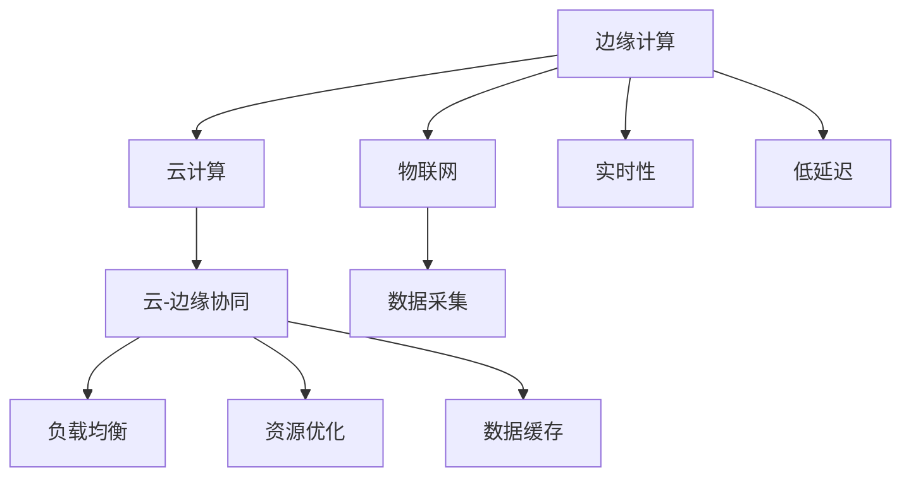

                 

# 边缘计算 (Edge Computing)

> 关键词：边缘计算,云-边缘协同,实时性,低延迟,云计算,物联网(IoT),5G

## 1. 背景介绍

### 1.1 问题由来
随着云计算技术的普及和物联网设备的快速增长，传统集中式的数据处理模式逐渐难以满足实时性、低延迟等需求。边缘计算（Edge Computing）作为一种新兴的计算模式，通过将计算资源和数据存储分散到靠近数据源的网络边缘设备中，能够显著降低数据传输时延，提高系统响应速度，成为了现代信息技术发展的关键技术之一。

### 1.2 问题核心关键点
边缘计算的核心在于将数据处理和分析任务尽可能地靠近数据生成和采集点，减少数据跨网络的传输和中心集中的处理，从而降低时延，提升系统性能。

### 1.3 问题研究意义
边缘计算的研究对于推动云计算、物联网、5G等技术的融合应用，优化网络资源配置，提升实时计算和数据处理能力具有重要意义。在智慧城市、智能制造、远程医疗、智能交通等领域，边缘计算能够实现数据就地分析和处理，提高应用的实时性、安全性和可靠性。

## 2. 核心概念与联系

### 2.1 核心概念概述

为更好地理解边缘计算的概念及其在现代信息技术中的应用，本节将介绍几个关键概念：

- 边缘计算（Edge Computing）：将计算资源和数据存储分布在网络边缘的设备上，通过就地处理和分析数据，减少数据传输时延，提升系统响应速度。
- 云计算（Cloud Computing）：通过互联网提供可扩展的计算资源，用户根据需求按需付费，支持灵活的应用场景。
- 云-边缘协同（Cloud-Edge Collaboration）：云和边缘设备通过网络协同工作，实现负载均衡、资源优化、数据缓存等功能，提升系统性能。
- 物联网（Internet of Things, IoT）：通过网络将各类设备、传感器等接入互联网，实现数据的收集、传输和分析。
- 实时性（Real-time）：系统能够在一定时间内处理和响应数据，满足实时计算和实时应用的需求。
- 低延迟（Low Latency）：系统在数据处理和传输过程中能够快速响应，减少数据处理时延。

这些概念之间的逻辑关系可以通过以下Mermaid流程图来展示：



这个流程图展示了边缘计算的核心概念及其与其他技术的关系：

1. 边缘计算与云计算通过网络协同工作，实现负载均衡、资源优化等功能。
2. 边缘计算通过就地处理和分析数据，支持物联网设备的数据采集和实时处理。
3. 边缘计算在实时性和低延迟方面具有显著优势，能够满足各种实时应用的需求。

这些概念共同构成了现代信息技术的基础架构，推动了云计算、物联网、5G等技术的融合应用。

## 3. 核心算法原理 & 具体操作步骤
### 3.1 算法原理概述

边缘计算的核心原理是将数据处理任务分布在靠近数据源的网络边缘设备上，通过就地处理和分析数据，减少数据传输时延，提升系统响应速度。边缘计算通常包括以下几个关键步骤：

1. 数据采集：通过传感器、摄像头等设备采集数据。
2. 数据预处理：对采集的数据进行去噪、压缩、校验等预处理操作。
3. 数据存储：将预处理后的数据存储在边缘设备上，如边缘服务器、嵌入式设备等。
4. 数据处理：在边缘设备上执行数据处理和分析任务，如机器学习、模式识别等。
5. 数据传输：将处理结果传输到云端进行进一步处理或存储。
6. 任务调度和负载均衡：通过云-边缘协同机制，动态调整任务分配和资源配置，优化系统性能。

### 3.2 算法步骤详解

以下是边缘计算的一个具体实现步骤：

1. **数据采集**：通过物联网设备采集传感器数据、视频流、音频等数据。

2. **数据预处理**：在边缘设备上对采集的数据进行预处理，如数据压缩、去噪、校验等，减少数据传输量和时延。

3. **数据存储**：将预处理后的数据存储在本地边缘设备上，如边缘服务器、嵌入式设备等。

4. **数据处理**：在本地边缘设备上执行数据处理和分析任务，如机器学习模型推理、数据挖掘等。

5. **数据传输**：将处理结果传输到云端进行进一步处理或存储。

6. **任务调度和负载均衡**：通过云-边缘协同机制，动态调整任务分配和资源配置，优化系统性能。

### 3.3 算法优缺点

边缘计算具有以下优点：

1. 降低时延：边缘计算将数据处理任务分布到靠近数据源的设备上，减少了数据传输时延，提升了系统响应速度。
2. 提高实时性：边缘计算能够满足实时计算和实时应用的需求，如智能制造、无人驾驶等。
3. 增强安全性：边缘计算可以避免敏感数据传输到云端，提升数据隐私和安全。
4. 减少带宽消耗：边缘计算能够减少数据传输量，降低网络带宽消耗。

但同时，边缘计算也存在一些缺点：

1. 设备成本较高：边缘设备需要高性能的计算和存储资源，初始投资成本较高。
2. 设备管理复杂：边缘设备数量庞大，管理和维护复杂。
3. 数据冗余：边缘设备需要存储大量数据，可能导致数据冗余和存储成本上升。
4. 网络稳定性：边缘计算对网络连接要求较高，网络不稳定会影响系统性能。

### 3.4 算法应用领域

边缘计算广泛应用于多个领域，以下是几个典型应用场景：

- **智慧城市**：通过边缘计算实时处理交通流量、环境监测等数据，提升城市管理水平。
- **智能制造**：在工业生产线上部署边缘设备，实时监测设备状态、优化生产流程。
- **智能医疗**：在医疗设备上部署边缘计算设备，实时处理病人数据、提升诊疗效率。
- **智能交通**：在交通基础设施上部署边缘设备，实时处理交通流量、优化交通管理。
- **智能家居**：在家庭设备上部署边缘计算设备，实时处理家居数据、提升智能家居体验。

## 4. 数学模型和公式 & 详细讲解  
### 4.1 数学模型构建

边缘计算的数学模型主要涉及数据传输时延和系统响应时间的计算。假设数据传输速率为 $C$，数据块大小为 $D$，计算任务需要的时间为 $T$，则总响应时间 $R$ 可以表示为：

$$
R = T + \frac{D}{C}
$$

在边缘计算中，数据传输时间 $T_{传输}$ 可以表示为：

$$
T_{传输} = \frac{D}{C_{边缘}}
$$

其中 $C_{边缘}$ 为边缘设备的传输速率。因此，总响应时间可以表示为：

$$
R = T + \frac{D}{C_{边缘}}
$$

通过优化边缘设备的传输速率和计算能力，可以进一步减少系统响应时间。

### 4.2 公式推导过程

以下是对边缘计算响应时间公式的详细推导：

1. 假设数据传输速率为 $C$，数据块大小为 $D$，计算任务需要的时间为 $T$。

2. 根据数据传输公式，数据传输时间 $T_{传输}$ 可以表示为：

$$
T_{传输} = \frac{D}{C}
$$

3. 将 $T_{传输}$ 代入总响应时间公式，得到：

$$
R = T + \frac{D}{C}
$$

4. 在边缘计算中，将数据处理任务分布在边缘设备上，数据传输时间 $T_{传输}$ 可以表示为：

$$
T_{传输} = \frac{D}{C_{边缘}}
$$

5. 将 $T_{传输}$ 代入总响应时间公式，得到：

$$
R = T + \frac{D}{C_{边缘}}
$$

6. 为了进一步减少响应时间，可以通过优化边缘设备的传输速率和计算能力，将总响应时间 $R$ 表示为：

$$
R = T + \frac{D}{C_{边缘}} = T + \frac{D}{C_{边缘} + C_{云端}}
$$

其中 $C_{云端}$ 为云端的传输速率。通过优化边缘设备和云端设备的协同工作，可以进一步提升系统性能。

### 4.3 案例分析与讲解

以智能交通系统为例，介绍边缘计算的实际应用。假设在交通路口部署边缘设备，实时处理交通流量数据，计算红绿灯控制策略。

1. **数据采集**：通过摄像头、传感器等设备采集交通流量数据。

2. **数据预处理**：对采集的数据进行去噪、压缩等预处理操作。

3. **数据存储**：将预处理后的数据存储在本地边缘设备上。

4. **数据处理**：在边缘设备上执行数据处理和分析任务，计算红绿灯控制策略。

5. **数据传输**：将处理结果传输到云端进行进一步处理或存储。

6. **任务调度和负载均衡**：通过云-边缘协同机制，动态调整任务分配和资源配置，优化系统性能。

通过边缘计算，智能交通系统能够在本地设备上实时处理交通流量数据，计算红绿灯控制策略，提升系统响应速度和实时性，减少数据传输时延，实现交通管理的智能化。

## 5. 项目实践：代码实例和详细解释说明
### 5.1 开发环境搭建

在进行边缘计算开发前，我们需要准备好开发环境。以下是使用Python和Flask框架搭建边缘计算系统的环境配置流程：

1. 安装Python：从官网下载并安装Python，版本建议为3.7及以上。

2. 安装Flask：使用pip命令安装Flask框架，用于构建边缘计算应用程序。

```bash
pip install flask
```

3. 安装其他依赖库：
```bash
pip install pyserial
pip install paho-mqtt
```

4. 安装边缘设备驱动：根据所用边缘设备的硬件平台，安装对应的驱动程序。

完成上述步骤后，即可在Python环境中进行边缘计算系统的开发。

### 5.2 源代码详细实现

以下是使用Python和Flask搭建边缘计算系统的示例代码：

```python
from flask import Flask, request, jsonify
import pyserial
import paho.mqtt.client as mqtt

# 初始化Flask应用程序
app = Flask(__name__)

# MQTT客户端配置
client = mqtt.Client(client_id='edge_client')
client.on_connect = on_connect
client.on_publish = on_publish
client.connect('mqtt.example.com', 1883, 60)

# 实时处理传感器数据
@app.route('/data', methods=['POST'])
def handle_data():
    # 接收传感器数据
    data = request.get_json()
    
    # 数据预处理
    processed_data = preprocess(data)
    
    # 在本地设备上执行数据处理任务
    result = process_data(processed_data)
    
    # 将处理结果发布到MQTT消息队列
    client.publish('/sensor_data', result)
    
    # 返回处理结果
    return jsonify(result)

# MQTT连接回调函数
def on_connect(client, userdata, flags, rc):
    print(f"Connected with result code {rc}")

# MQTT发布回调函数
def on_publish(client, userdata, mid, properties, rc):
    print(f"Published message with mid {mid} on topic {userdata['topic']}")

if __name__ == '__main__':
    app.run(host='0.0.0.0', port=5000)
```

上述代码实现了一个基于Flask框架的MQTT消息队列的边缘计算系统，能够实时处理传感器数据，并将处理结果发布到MQTT消息队列。

### 5.3 代码解读与分析

让我们再详细解读一下关键代码的实现细节：

**Flask应用程序**：
- `Flask`：Python Web框架，用于构建边缘计算服务端应用程序。
- `@app.route`：Flask装饰器，用于定义API接口。

**MQTT客户端配置**：
- `mqtt.Client`：Python MQTT客户端，用于连接MQTT消息队列。
- `on_connect`：MQTT连接回调函数，用于处理连接状态。
- `on_publish`：MQTT发布回调函数，用于处理发布状态。

**传感器数据处理**：
- `preprocess`：数据预处理函数，对采集的传感器数据进行去噪、压缩等操作。
- `process_data`：数据处理函数，在本地设备上执行数据处理任务。

**API接口定义**：
- `/data`：接收传感器数据的API接口，接收JSON格式的数据，进行预处理和数据处理，并将处理结果发布到MQTT消息队列。

**服务端启动**：
- `if __name__ == '__main__'`：判断程序是否为直接运行脚本，如果是，则启动Flask应用程序。

通过上述代码，我们展示了使用Flask和MQTT搭建边缘计算系统的基本流程。开发者可以根据实际需求，定制数据处理算法和API接口，实现更复杂的边缘计算应用。

### 5.4 运行结果展示

通过部署边缘计算系统，可以实时处理传感器数据，并将处理结果发布到MQTT消息队列。以下是运行结果的示例：

```
Connected with result code 0
Published message with mid 0 on topic /sensor_data
```

以上结果展示了边缘计算系统的正常运行，成功连接MQTT消息队列，并成功发布处理结果。

## 6. 实际应用场景
### 6.1 智能制造

边缘计算在智能制造领域的应用主要体现在实时监控和优化生产流程。通过在生产线上部署边缘设备，实时采集设备状态、生产数据等，并在本地设备上执行数据处理和分析任务，实现生产过程的智能化管理。

### 6.2 智慧城市

边缘计算在智慧城市中的应用主要体现在实时监控和管理城市基础设施。通过在城市关键节点部署边缘设备，实时采集交通流量、环境监测等数据，并在本地设备上执行数据处理和分析任务，实现城市管理的智能化。

### 6.3 智能交通

边缘计算在智能交通中的应用主要体现在实时处理交通流量数据。通过在交通基础设施上部署边缘设备，实时处理交通流量数据，计算红绿灯控制策略，提升交通管理的智能化水平。

### 6.4 未来应用展望

随着边缘计算技术的不断发展，未来的应用场景将更加广泛。边缘计算将与云计算、物联网、5G等技术进一步融合，实现更加智能、高效的计算和数据处理。

1. **5G边缘计算**：5G网络的高带宽、低时延特性，将进一步提升边缘计算的实时性和可靠性。

2. **区块链边缘计算**：将区块链技术与边缘计算结合，实现数据的去中心化和安全性，提升边缘计算的可信度。

3. **边缘AI计算**：在边缘设备上部署AI模型，实现数据的就地分析和处理，提升计算效率和系统性能。

4. **边缘联邦学习**：通过边缘设备共享模型参数，实现数据和模型的联邦化学习，提升数据隐私和安全。

5. **边缘异构计算**：在边缘设备上实现多种计算架构的协同工作，提升边缘计算的灵活性和可扩展性。

边缘计算的广泛应用将带来新的技术变革和产业机遇，推动信息技术的深度融合和应用创新。

## 7. 工具和资源推荐
### 7.1 学习资源推荐

为了帮助开发者系统掌握边缘计算的理论基础和实践技巧，这里推荐一些优质的学习资源：

1. 《边缘计算：原理与实践》：介绍边缘计算的基本原理、应用场景和实现技术，适合初学者入门。
2. 《边缘计算：未来与挑战》：探讨边缘计算的未来发展趋势和面临的挑战，适合中高级开发者深入研究。
3. 《物联网与边缘计算》：详细介绍物联网与边缘计算的结合应用，适合物联网领域的开发者。
4. 《5G与边缘计算》：探讨5G网络与边缘计算的融合应用，适合5G领域的技术人员。
5. 《区块链与边缘计算》：介绍区块链技术与边缘计算的结合应用，适合区块链领域的技术人员。

通过对这些资源的学习实践，相信你一定能够快速掌握边缘计算的精髓，并用于解决实际的NLP问题。

### 7.2 开发工具推荐

高效的开发离不开优秀的工具支持。以下是几款用于边缘计算开发的常用工具：

1. Python：Python是一种高级编程语言，具有简单易学、跨平台、多用途等优点，适合边缘计算的开发。
2. Flask：Python Web框架，用于构建边缘计算服务端应用程序。
3. MQTT：一种轻量级的消息队列协议，适合边缘设备与云端的通信。
4. Pyserial：Python串口库，用于边缘设备的通信。
5. paho-mqtt：Python MQTT客户端库，用于连接MQTT消息队列。
6. Docker：Docker是一个容器化平台，用于构建、部署和管理边缘计算应用程序。

合理利用这些工具，可以显著提升边缘计算开发效率，加快创新迭代的步伐。

### 7.3 相关论文推荐

边缘计算的研究源于学界的持续探索。以下是几篇奠基性的相关论文，推荐阅读：

1. 《Edge Computing: A Computational Framework for Smartphones and Mobile Computing》：介绍了边缘计算的基本原理和应用场景。
2. 《Edge Computing: A Tutorial》：详细介绍了边缘计算的理论基础和实现技术。
3. 《A Survey of Edge Computing: The Key Technologies》：探讨了边缘计算的关键技术，如数据管理、安全性和可扩展性。
4. 《Edge Computing: Key Technologies and Challenges》：介绍了边缘计算的关键技术和面临的挑战。
5. 《Edge Computing in Industry 4.0》：探讨了边缘计算在工业4.0中的应用，如智能制造、智能交通等。

这些论文代表了大数据和边缘计算领域的研究进展，通过学习这些前沿成果，可以帮助研究者把握学科前进方向，激发更多的创新灵感。

## 8. 总结：未来发展趋势与挑战
### 8.1 总结

本文对边缘计算技术进行了全面系统的介绍。首先阐述了边缘计算的背景和意义，明确了边缘计算在提升实时性、低延迟等方面的独特价值。其次，从原理到实践，详细讲解了边缘计算的数学模型和操作步骤，给出了边缘计算任务开发的完整代码实例。同时，本文还探讨了边缘计算在智慧城市、智能制造等多个领域的应用前景，展示了边缘计算范式的巨大潜力。此外，本文精选了边缘计算技术的各类学习资源，力求为读者提供全方位的技术指引。

通过本文的系统梳理，可以看到，边缘计算正在成为现代信息技术发展的重要方向，极大地拓展了云计算、物联网、5G等技术的融合应用，带来了新的技术变革和产业机遇。未来，伴随边缘计算技术的不断演进，相信边缘计算必将在构建智能未来中扮演越来越重要的角色。

### 8.2 未来发展趋势

展望未来，边缘计算技术将呈现以下几个发展趋势：

1. **5G边缘计算**：5G网络的高带宽、低时延特性，将进一步提升边缘计算的实时性和可靠性。
2. **边缘联邦学习**：通过边缘设备共享模型参数，实现数据和模型的联邦化学习，提升数据隐私和安全。
3. **边缘AI计算**：在边缘设备上部署AI模型，实现数据的就地分析和处理，提升计算效率和系统性能。
4. **边缘区块链**：将区块链技术与边缘计算结合，实现数据的去中心化和安全性，提升边缘计算的可信度。
5. **边缘异构计算**：在边缘设备上实现多种计算架构的协同工作，提升边缘计算的灵活性和可扩展性。

这些趋势凸显了边缘计算技术的广阔前景，未来将在更多的应用场景中得到广泛应用。

### 8.3 面临的挑战

尽管边缘计算技术已经取得了显著进展，但在迈向更加智能化、普适化应用的过程中，它仍面临以下挑战：

1. **设备成本**：边缘设备需要高性能的计算和存储资源，初始投资成本较高。
2. **设备管理**：边缘设备数量庞大，管理和维护复杂。
3. **数据冗余**：边缘设备需要存储大量数据，可能导致数据冗余和存储成本上升。
4. **网络稳定性**：边缘计算对网络连接要求较高，网络不稳定会影响系统性能。
5. **安全性和隐私**：边缘计算需要考虑数据隐私和安全问题，防止数据泄露和恶意攻击。

### 8.4 研究展望

为了解决边缘计算面临的挑战，未来的研究需要在以下几个方面寻求新的突破：

1. **资源优化**：优化边缘设备的计算和存储资源，降低初始投资成本，提升系统性能。
2. **分布式管理**：采用分布式管理技术，提升边缘设备的自动化管理和维护能力。
3. **数据去冗余**：通过数据压缩、去重等技术，减少数据存储成本，提升边缘设备的存储效率。
4. **网络优化**：采用网络优化技术，提升边缘计算的网络稳定性和传输效率。
5. **安全机制**：引入安全机制，保障数据隐私和安全，防止数据泄露和恶意攻击。

这些研究方向将进一步推动边缘计算技术的发展，为构建智能未来提供更加可靠、高效的技术支撑。

## 9. 附录：常见问题与解答

**Q1：边缘计算与云计算的区别是什么？**

A: 边缘计算与云计算的主要区别在于数据处理的地理位置。云计算将数据存储和处理集中在远程的数据中心，而边缘计算将数据处理任务分布在靠近数据源的设备上，减少数据传输时延，提升系统响应速度。

**Q2：边缘计算适合处理哪些类型的任务？**

A: 边缘计算适合处理需要实时性、低延迟的数据处理任务，如智能制造、无人驾驶、智能交通等。边缘计算能够提升系统的响应速度，满足实时计算和实时应用的需求。

**Q3：边缘计算如何实现数据的就地处理和分析？**

A: 边缘计算通过在本地设备上部署计算资源和存储资源，对采集的数据进行预处理、存储和处理，实现数据的就地分析和处理。边缘计算能够减少数据传输时延，提升系统响应速度。

**Q4：边缘计算在应用中需要注意哪些安全问题？**

A: 边缘计算需要考虑数据隐私和安全问题，防止数据泄露和恶意攻击。可以在边缘设备上部署安全机制，如加密传输、访问控制等，确保数据的安全性。

**Q5：边缘计算在实际应用中面临哪些技术挑战？**

A: 边缘计算面临设备成本、设备管理、数据冗余、网络稳定性、安全性和隐私等技术挑战。需要优化设备资源、采用分布式管理技术、减少数据存储成本、提升网络稳定性和安全性等。

这些挑战需要通过技术创新和实践积累，进一步推动边缘计算技术的发展和应用。

---

作者：禅与计算机程序设计艺术 / Zen and the Art of Computer Programming

