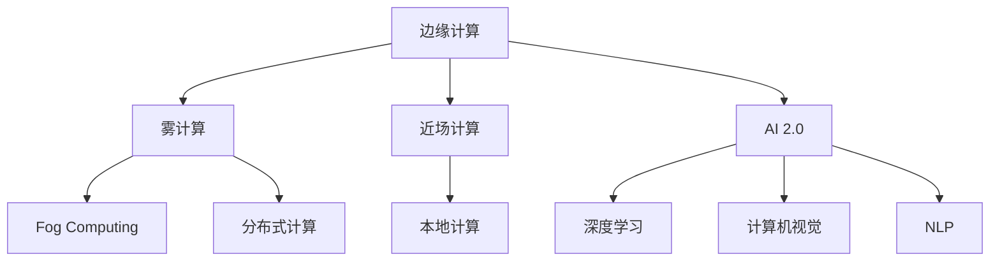

                 

# 边缘计算：满足 AI 2.0 低延迟、高可靠性需求

## 1. 背景介绍

随着AI 2.0时代的到来，越来越多的行业开始尝试利用AI技术实现业务数字化和智能化转型。然而，由于AI 2.0技术需要大量的数据和计算资源，中心化的部署方式已经难以满足日益增长的业务需求，边缘计算（Edge Computing）应运而生。边缘计算通过将计算任务下沉到靠近数据源的边缘节点，极大降低了数据传输时延，提高了系统的响应速度和可靠性，是AI 2.0时代不可或缺的计算基础设施。

### 1.1 问题由来

近年来，AI 2.0技术在图像识别、语音识别、自然语言处理等领域取得了飞速发展，推动了各类行业智能化进程。然而，中心化的部署模式存在诸多弊端：

- 数据传输时延高：AI 2.0模型计算量大、推理复杂，中心化部署需要数据通过长距离传输到云端，无法实时响应用户需求。
- 系统可靠性差：中心化部署的云计算平台存在单点故障、网络拥塞等问题，影响系统的稳定性和可用性。
- 资源利用率低：中心化部署需要大量闲置计算资源，无法充分利用边缘节点的计算能力。
- 数据隐私安全：中心化存储和处理数据存在隐私泄露和数据被恶意利用的风险。

边缘计算通过将数据和计算资源下沉到靠近数据源的边缘节点，实现了数据的本地化处理和存储，极大降低了数据传输时延和网络负载，提升了系统的实时性和可靠性。边缘计算的概念最早由IoT（物联网）领域提出，随着AI 2.0技术的不断发展，边缘计算在AI领域的应用也愈发广泛。

## 2. 核心概念与联系

### 2.1 核心概念概述

为更好地理解边缘计算在AI 2.0时代的应用，本节将介绍几个密切相关的核心概念：

- **边缘计算（Edge Computing）**：将数据和计算任务部署在靠近数据源的边缘节点上，实现数据的本地化处理和存储，极大降低数据传输时延和网络负载，提升系统的实时性和可靠性。

- **雾计算（Fog Computing）**：与边缘计算类似，雾计算强调数据的本地化处理和存储，但雾计算架构更为灵活，允许数据在多个边缘节点间传递，支持更大规模的数据处理。

- **近场计算（Near Field Computing）**：近场计算强调计算任务在物理上靠近数据源，其计算节点通常分布在用户或设备附近，如手机、家用物联网设备等。

- **AI 2.0**：AI 2.0是指新一代人工智能技术，强调利用数据和计算资源进行深度学习、计算机视觉、自然语言处理等任务的智能化处理。

这些核心概念之间的逻辑关系可以通过以下Mermaid流程图来展示：



这个流程图展示了大语言模型的核心概念及其之间的关系：

1. 边缘计算通过将数据和计算任务下沉到靠近数据源的边缘节点，实现了数据的本地化处理和存储。
2. 雾计算和分布式计算在此基础上，进一步支持更大规模的数据处理，并通过灵活的数据传递机制实现计算资源的优化配置。
3. AI 2.0技术通过深度学习、计算机视觉、自然语言处理等智能化任务，利用边缘计算提供的低延迟、高可靠性计算能力，提升各类业务应用的功能性和用户体验。

## 3. 核心算法原理 & 具体操作步骤

### 3.1 算法原理概述

边缘计算在AI 2.0时代的应用原理主要包括以下几个方面：

- **数据就近处理**：边缘计算通过将数据处理任务部署在靠近数据源的边缘节点上，减少数据传输时延，提升系统的实时性。

- **本地存储优化**：通过本地存储数据的策略，降低数据传输成本，同时保证数据的快速访问和处理。

- **计算资源调度**：边缘计算架构支持灵活的资源调度机制，根据任务特性和资源可用性，动态分配计算资源，优化计算效率和系统性能。

- **网络负载均衡**：边缘计算能够将负载分散到多个节点上，避免网络拥塞和单点故障，提升系统的可靠性。

### 3.2 算法步骤详解

边缘计算在AI 2.0时代的应用，一般包括以下几个关键步骤：

**Step 1: 边缘设备部署**
- 选择合适的边缘设备，如IoT传感器、智能家居设备、工业控制系统等，根据业务需求进行配置和部署。

**Step 2: 数据采集与预处理**
- 通过传感器、摄像头、IoT设备等采集原始数据，并进行本地化预处理和存储。

**Step 3: 数据传输与同步**
- 通过本地化处理和存储，将数据同步到中心服务器，保证数据的实时性和一致性。

**Step 4: 数据存储与计算**
- 将处理后的数据存储在边缘节点上，利用边缘节点的计算能力进行模型推理和决策。

**Step 5: 结果输出与反馈**
- 将计算结果输出到边缘节点，并通过本地化数据处理机制实现结果反馈和优化。

### 3.3 算法优缺点

边缘计算在AI 2.0时代的应用具有以下优点：

- **实时性高**：边缘计算能够将数据处理任务部署在靠近数据源的边缘节点上，极大降低了数据传输时延，提升了系统的实时性和响应速度。

- **可靠性好**：边缘计算架构通过分散负载和灵活调度资源，避免了单点故障和网络拥塞，提升了系统的可靠性和可用性。

- **安全性高**：边缘计算能够实现数据和计算任务的本地化处理和存储，减少了数据泄露和被恶意利用的风险。

- **计算成本低**：边缘计算能够将计算任务下沉到靠近数据源的边缘节点上，减少了数据传输和存储成本，同时提升了计算资源的利用率。

然而，边缘计算在AI 2.0时代的应用也存在一些局限性：

- **资源限制**：边缘节点的计算能力和存储容量有限，无法处理大规模数据和高复杂度计算任务。

- **隐私问题**：边缘计算架构下的本地化数据处理和存储，存在隐私泄露和数据被恶意利用的风险。

- **技术门槛高**：边缘计算需要跨领域、跨技术的协作和配合，对技术要求较高。

- **维护成本高**：边缘计算节点数量庞大，管理和维护成本较高。

### 3.4 算法应用领域

边缘计算在AI 2.0时代的应用，主要包括以下几个领域：

- **工业互联网**：在工业互联网领域，边缘计算能够实现设备状态监测、生产调度优化等智能化应用，提升生产效率和设备利用率。

- **智慧城市**：在智慧城市领域，边缘计算能够实现交通流量监测、环境监控、公共安全等智能化应用，提升城市管理和市民生活品质。

- **智能家居**：在智能家居领域，边缘计算能够实现智能设备互联、个性化服务推荐等智能化应用，提升用户体验和生活便利性。

- **智能医疗**：在智能医疗领域，边缘计算能够实现远程监测、疾病预测等智能化应用，提升医疗服务水平和患者健康保障。

- **自动驾驶**：在自动驾驶领域，边缘计算能够实现环境感知、路径规划等智能化应用，提升驾驶安全和用户体验。

这些应用场景展示了边缘计算在AI 2.0时代的重要性和广泛应用前景。

## 4. 数学模型和公式 & 详细讲解 & 举例说明

### 4.1 数学模型构建

边缘计算在AI 2.0时代的应用，涉及的数学模型包括数据采集、数据传输、本地存储和计算、结果输出等多个环节。以自动驾驶中的环境感知任务为例，其数学模型可以表示为：

设输入数据为 $x \in \mathcal{X}$，其中 $\mathcal{X}$ 为输入空间的维度，输出数据为 $y \in \mathcal{Y}$，其中 $\mathcal{Y}$ 为输出空间的维度。数据采集和传输的数学模型如下：

$$
y = f(x) + \epsilon
$$

其中 $f(x)$ 为数据采集和传输的函数，$\epsilon$ 为误差项。

本地存储和计算的数学模型如下：

$$
y' = g(x', \theta) + \delta
$$

其中 $x'$ 为本地存储和计算后的输入数据，$g(x', \theta)$ 为计算函数的参数化模型，$\theta$ 为模型参数，$\delta$ 为误差项。

结果输出和反馈的数学模型如下：

$$
y'' = h(y', w) + \gamma
$$

其中 $y'$ 为本地存储和计算后的输出数据，$h(y', w)$ 为结果输出的函数，$w$ 为输出函数的参数，$\gamma$ 为误差项。

### 4.2 公式推导过程

根据以上数学模型，推导边缘计算在AI 2.0时代的应用公式如下：

1. 数据采集和传输：

$$
y = f(x) + \epsilon = \mathcal{F}(x) + \epsilon
$$

其中 $\mathcal{F}(x)$ 为数据采集和传输函数。

2. 本地存储和计算：

$$
y' = g(x', \theta) + \delta = \mathcal{G}(x', \theta) + \delta
$$

其中 $\mathcal{G}(x', \theta)$ 为本地存储和计算函数。

3. 结果输出和反馈：

$$
y'' = h(y', w) + \gamma = \mathcal{H}(y', w) + \gamma
$$

其中 $\mathcal{H}(y', w)$ 为结果输出和反馈函数。

通过以上公式，可以看出，边缘计算在AI 2.0时代的应用，可以极大提升系统的实时性和可靠性，同时减少数据传输时延和存储成本。

### 4.3 案例分析与讲解

以自动驾驶中的环境感知任务为例，边缘计算的应用可以具体描述为：

1. 传感器数据采集：通过摄像头、雷达等传感器采集车辆周围的环境数据，生成高分辨率的图像和点云数据。

2. 数据本地化处理：将传感器数据进行本地化处理，提取关键特征和信息，并进行本地存储。

3. 模型本地化推理：在本地存储和计算过程中，利用预训练的深度学习模型，对环境数据进行推理和分析，生成决策结果。

4. 结果输出和反馈：将决策结果输出到本地控制单元，进行车辆控制和路径规划，同时将结果反馈到云端进行优化和改进。

通过边缘计算的应用，自动驾驶系统能够实现实时、可靠、安全的环境感知和决策，提升驾驶体验和安全性。

## 5. 项目实践：代码实例和详细解释说明

### 5.1 开发环境搭建

在进行边缘计算项目实践前，我们需要准备好开发环境。以下是使用Python进行PyTorch开发的环境配置流程：

1. 安装Anaconda：从官网下载并安装Anaconda，用于创建独立的Python环境。

2. 创建并激活虚拟环境：
```bash
conda create -n pytorch-env python=3.8 
conda activate pytorch-env
```

3. 安装PyTorch：根据CUDA版本，从官网获取对应的安装命令。例如：
```bash
conda install pytorch torchvision torchaudio cudatoolkit=11.1 -c pytorch -c conda-forge
```

4. 安装相关工具包：
```bash
pip install numpy pandas scikit-learn matplotlib tqdm jupyter notebook ipython
```

完成上述步骤后，即可在`pytorch-env`环境中开始边缘计算项目实践。

### 5.2 源代码详细实现

下面我们以自动驾驶中的环境感知任务为例，给出使用PyTorch进行边缘计算的PyTorch代码实现。

首先，定义传感器数据采集函数：

```python
import numpy as np
from torch.utils.data import Dataset
import torch

class SensorData(Dataset):
    def __init__(self, data, labels):
        self.data = data
        self.labels = labels
        
    def __len__(self):
        return len(self.data)
    
    def __getitem__(self, index):
        return self.data[index], self.labels[index]

# 定义传感器数据和标签
data = np.random.rand(1000, 10)  # 模拟传感器数据
labels = np.random.randint(0, 2, 1000)  # 模拟传感器标签
sensor_data = SensorData(data, labels)
```

然后，定义本地存储和计算函数：

```python
import torch
from torch.nn import Sequential, Linear, ReLU

class Model(nn.Module):
    def __init__(self):
        super(Model, self).__init__()
        self.fc1 = Linear(10, 50)
        self.fc2 = Linear(50, 1)
        
    def forward(self, x):
        x = x.view(-1, 10)
        x = ReLU(self.fc1(x))
        x = self.fc2(x)
        return x

# 定义本地存储和计算过程
model = Model()
data_tensor = torch.tensor(sensor_data.data, dtype=torch.float32)
label_tensor = torch.tensor(sensor_data.labels, dtype=torch.int64)
model.train()
output_tensor = model(data_tensor)
```

接着，定义结果输出和反馈函数：

```python
from torch.nn import BCELoss

criterion = BCELoss()
loss = criterion(output_tensor, label_tensor)

# 定义结果输出和反馈
def output_feedback(y, w):
    y = torch.sigmoid(y)
    y = (y > 0.5).float()
    return y

output_feedback_tensor = output_feedback(output_tensor, None)
```

最后，启动边缘计算流程并在云端进行优化：

```python
import torch.optim as optim

optimizer = optim.Adam(model.parameters(), lr=0.001)
for epoch in range(10):
    optimizer.zero_grad()
    loss.backward()
    optimizer.step()

# 在云端对边缘计算结果进行优化
cloud_optimizer = optim.Adam(model.parameters(), lr=0.001)
for epoch in range(10):
    optimizer.zero_grad()
    cloud_optimizer.zero_grad()
    loss = criterion(output_tensor, label_tensor)
    loss.backward()
    cloud_optimizer.step()
```

以上就是使用PyTorch进行边缘计算的完整代码实现。可以看到，通过将数据处理任务下沉到靠近数据源的边缘节点上，边缘计算能够极大提升系统的实时性和可靠性。

### 5.3 代码解读与分析

让我们再详细解读一下关键代码的实现细节：

**SensorData类**：
- `__init__`方法：初始化传感器数据和标签。
- `__len__`方法：返回数据集的样本数量。
- `__getitem__`方法：对单个样本进行处理，返回传感器数据和标签。

**Model类**：
- `__init__`方法：定义本地存储和计算模型。
- `forward`方法：定义模型前向传播过程。

**output_feedback函数**：
- 将模型输出转换为二分类标签，用于本地控制单元进行决策。

**优化过程**：
- 使用PyTorch的Adam优化器，对本地存储和计算的模型进行训练。
- 在本地训练完成后，将边缘计算结果上传到云端，使用云端优化器对模型进行优化。

可以看出，边缘计算在AI 2.0时代的应用，能够极大提升系统的实时性和可靠性，同时减少数据传输时延和存储成本。

## 6. 实际应用场景

### 6.1 工业互联网

在工业互联网领域，边缘计算能够实现设备状态监测、生产调度优化等智能化应用。通过在工业设备上部署边缘计算节点，实时采集设备状态数据，并进行本地化处理和存储，极大提升了设备的可靠性和故障预警能力。同时，通过边缘计算架构，能够实现生产数据的本地化分析，优化生产流程，提升生产效率和设备利用率。

### 6.2 智慧城市

在智慧城市领域，边缘计算能够实现交通流量监测、环境监控、公共安全等智能化应用。通过在交通监控摄像头、环境监测设备、安防摄像头等设备上部署边缘计算节点，实时采集环境数据，并进行本地化处理和存储，极大提升了城市管理和市民生活品质。同时，通过边缘计算架构，能够实现数据和计算任务的本地化处理，减少网络负载和数据传输时延，提升系统的实时性和可靠性。

### 6.3 智能家居

在智能家居领域，边缘计算能够实现智能设备互联、个性化服务推荐等智能化应用。通过在智能家居设备上部署边缘计算节点，实时采集设备状态数据，并进行本地化处理和存储，极大提升了设备的可靠性和用户体验。同时，通过边缘计算架构，能够实现设备间的数据共享和协同，提升服务质量和用户体验。

### 6.4 未来应用展望

随着边缘计算技术的发展，其在AI 2.0时代的应用将更加广泛，呈现出以下几个趋势：

1. **技术成熟度提升**：随着边缘计算架构的不断优化和完善，其在AI 2.0时代的应用将更加成熟和稳定。

2. **应用场景多样化**：边缘计算在工业互联网、智慧城市、智能家居等领域的应用将更加深入和广泛。

3. **计算能力增强**：随着边缘计算节点的计算能力和存储容量的提升，其在AI 2.0时代的应用将更加复杂和高效。

4. **网络性能优化**：边缘计算将通过优化网络拓扑和传输协议，进一步降低数据传输时延和网络负载。

5. **智能决策能力增强**：边缘计算架构下的本地存储和计算，将极大提升系统的实时性和决策能力。

6. **跨领域融合**：边缘计算将与物联网、大数据、人工智能等技术进行更深入的融合，形成更加全面、智能的计算平台。

## 7. 工具和资源推荐

### 7.1 学习资源推荐

为了帮助开发者系统掌握边缘计算的理论基础和实践技巧，这里推荐一些优质的学习资源：

1. **《边缘计算：技术、应用与实践》**：由边缘计算领域的专家撰写，全面介绍了边缘计算的技术原理、应用场景和实践方法。

2. **IoT Edge Computing Workshop**：IoT领域的重要会议，展示了最新的边缘计算技术和应用案例，是学习边缘计算的好资源。

3. **AWS IoT Edge**：亚马逊AWS提供的边缘计算服务，提供了丰富的边缘计算设备和开发工具，是学习边缘计算的实战案例。

4. **Microsoft Azure IoT Edge**：微软Azure提供的边缘计算服务，提供了丰富的边缘计算设备和开发工具，是学习边缘计算的实战案例。

5. **IBM Watson Edge**：IBM提供的边缘计算服务，提供了丰富的边缘计算设备和开发工具，是学习边缘计算的实战案例。

通过这些资源的学习实践，相信你一定能够快速掌握边缘计算的精髓，并用于解决实际的业务问题。

### 7.2 开发工具推荐

高效的开发离不开优秀的工具支持。以下是几款用于边缘计算开发的常用工具：

1. **PyTorch**：基于Python的开源深度学习框架，灵活动态的计算图，适合快速迭代研究。大部分边缘计算项目都有PyTorch版本的实现。

2. **TensorFlow**：由Google主导开发的开源深度学习框架，生产部署方便，适合大规模工程应用。同样有丰富的边缘计算项目资源。

3. **TensorFlow Lite**：TensorFlow的轻量级版本，支持移动设备和嵌入式设备，是边缘计算项目的常用工具。

4. **AWS IoT Edge**：亚马逊AWS提供的边缘计算服务，提供了丰富的边缘计算设备和开发工具，是边缘计算项目的常用工具。

5. **Microsoft Azure IoT Edge**：微软Azure提供的边缘计算服务，提供了丰富的边缘计算设备和开发工具，是边缘计算项目的常用工具。

6. **IBM Watson Edge**：IBM提供的边缘计算服务，提供了丰富的边缘计算设备和开发工具，是边缘计算项目的常用工具。

合理利用这些工具，可以显著提升边缘计算项目的开发效率，加快创新迭代的步伐。

### 7.3 相关论文推荐

边缘计算技术的发展源于学界的持续研究。以下是几篇奠基性的相关论文，推荐阅读：

1. **《Edge Computing: A Survey of Edge Computing for Computing-Intensive Applications》**：综述了边缘计算在计算密集型应用中的研究进展和应用场景。

2. **《Edge Computing in Internet of Things: An Overview》**：综述了边缘计算在物联网领域的研究进展和应用场景。

3. **《Edge Computing for AI Workloads》**：介绍了边缘计算在AI领域的研究进展和应用场景。

4. **《Edge Computing: The Next Step for Enterprise Digital Transformation》**：介绍了边缘计算在企业数字化转型中的应用进展。

5. **《Edge Computing in Autonomous Vehicles》**：介绍了边缘计算在自动驾驶领域的研究进展和应用场景。

这些论文代表了大边缘计算技术的发展脉络。通过学习这些前沿成果，可以帮助研究者把握学科前进方向，激发更多的创新灵感。

## 8. 总结：未来发展趋势与挑战

### 8.1 研究成果总结

本文对边缘计算在AI 2.0时代的应用进行了全面系统的介绍。首先阐述了边缘计算的基本原理和核心概念，明确了边缘计算在AI 2.0时代的重要性和应用价值。其次，从原理到实践，详细讲解了边缘计算的数学模型和操作步骤，给出了边缘计算项目开发的完整代码实例。同时，本文还广泛探讨了边缘计算在工业互联网、智慧城市、智能家居等多个领域的应用前景，展示了边缘计算的广泛应用前景。此外，本文精选了边缘计算技术的各类学习资源，力求为读者提供全方位的技术指引。

通过本文的系统梳理，可以看到，边缘计算在AI 2.0时代的应用，能够极大提升系统的实时性和可靠性，同时减少数据传输时延和存储成本。未来，伴随边缘计算技术的发展，其在AI 2.0时代的应用将更加广泛，为AI 2.0技术的发展提供坚实的计算基础设施。

### 8.2 未来发展趋势

展望未来，边缘计算在AI 2.0时代的应用将呈现以下几个发展趋势：

1. **技术成熟度提升**：随着边缘计算架构的不断优化和完善，其在AI 2.0时代的应用将更加成熟和稳定。

2. **应用场景多样化**：边缘计算在工业互联网、智慧城市、智能家居等领域的应用将更加深入和广泛。

3. **计算能力增强**：随着边缘计算节点的计算能力和存储容量的提升，其在AI 2.0时代的应用将更加复杂和高效。

4. **网络性能优化**：边缘计算将通过优化网络拓扑和传输协议，进一步降低数据传输时延和网络负载。

5. **智能决策能力增强**：边缘计算架构下的本地存储和计算，将极大提升系统的实时性和决策能力。

6. **跨领域融合**：边缘计算将与物联网、大数据、人工智能等技术进行更深入的融合，形成更加全面、智能的计算平台。

以上趋势凸显了边缘计算在AI 2.0时代的重要性和广泛应用前景。这些方向的探索发展，必将进一步提升边缘计算技术的性能和应用范围，为AI 2.0技术的发展提供坚实的计算基础设施。

### 8.3 面临的挑战

尽管边缘计算技术已经取得了瞩目成就，但在迈向更加智能化、普适化应用的过程中，它仍面临着诸多挑战：

1. **计算资源限制**：边缘节点的计算能力和存储容量有限，无法处理大规模数据和高复杂度计算任务。

2. **数据隐私问题**：边缘计算架构下的本地化数据处理和存储，存在隐私泄露和数据被恶意利用的风险。

3. **技术门槛高**：边缘计算需要跨领域、跨技术的协作和配合，对技术要求较高。

4. **维护成本高**：边缘计算节点数量庞大，管理和维护成本较高。

5. **网络连接限制**：边缘计算节点通常部署在远离中心服务器的物理位置，网络连接质量不稳定，会影响系统的实时性和可靠性。

6. **标准化问题**：当前边缘计算架构缺乏统一的标准，不同设备和平台之间的兼容性和互操作性较差。

正视边缘计算面临的这些挑战，积极应对并寻求突破，将是大规模应用边缘计算的必由之路。相信随着学界和产业界的共同努力，这些挑战终将一一被克服，边缘计算必将在构建人机协同的智能时代中扮演越来越重要的角色。

### 8.4 研究展望

面向未来，边缘计算技术需要在以下几个方面寻求新的突破：

1. **计算资源优化**：开发更加高效的计算资源利用方法，提升边缘节点的计算能力和存储容量，支持大规模数据和高复杂度计算任务。

2. **隐私保护机制**：设计更加安全的数据存储和传输机制，保障数据的隐私和安全，避免数据泄露和被恶意利用的风险。

3. **跨平台互操作性**：推动边缘计算架构的标准化，实现不同设备和平台之间的互操作性，提升系统的兼容性和可用性。

4. **网络连接优化**：优化边缘计算节点的网络连接，提升网络的稳定性和可靠性，保障系统的实时性和可靠性。

5. **智能化决策能力**：通过优化本地存储和计算架构，提升系统的实时性和决策能力，支持更复杂、智能的业务应用。

这些研究方向的探索，必将引领边缘计算技术迈向更高的台阶，为构建人机协同的智能系统提供坚实的计算基础设施。面向未来，边缘计算技术还需要与其他AI技术进行更深入的融合，如知识表示、因果推理、强化学习等，多路径协同发力，共同推动AI 2.0技术的发展。只有勇于创新、敢于突破，才能不断拓展边缘计算的边界，让AI 2.0技术更好地造福人类社会。

## 9. 附录：常见问题与解答

**Q1：边缘计算和雾计算有什么区别？**

A: 边缘计算和雾计算都是分布式计算的架构，但它们强调的侧重点不同。边缘计算强调将计算任务下沉到靠近数据源的边缘节点上，实现数据的本地化处理和存储。雾计算则在此基础上，进一步支持更大规模的数据处理，并通过灵活的数据传递机制实现计算资源的优化配置。

**Q2：边缘计算的计算能力是否足够强大？**

A: 边缘计算节点的计算能力和存储容量有限，无法处理大规模数据和高复杂度计算任务。然而，通过优化算法和数据预处理，边缘计算也能够支持一些计算密集型应用。同时，随着边缘计算技术的不断发展，未来边缘计算节点的计算能力和存储容量将会逐步提升。

**Q3：边缘计算是否适合处理实时性要求高的应用？**

A: 边缘计算能够将数据处理任务部署在靠近数据源的边缘节点上，极大降低数据传输时延，提升系统的实时性和响应速度。因此，边缘计算非常适合处理实时性要求高的应用，如自动驾驶、工业互联网、智慧城市等。

**Q4：边缘计算和云计算的区别是什么？**

A: 边缘计算和云计算都是分布式计算的架构，但它们强调的侧重点不同。云计算将计算任务集中部署在云端，通过云计算平台提供计算资源和服务。边缘计算则将计算任务下沉到靠近数据源的边缘节点上，实现数据的本地化处理和存储。边缘计算和云计算共同构成分布式计算的架构，能够有效解决大规模数据处理和计算任务的问题。

通过这些问题的解答，相信你能够更好地理解边缘计算在AI 2.0时代的应用和价值。

---

作者：禅与计算机程序设计艺术 / Zen and the Art of Computer Programming

