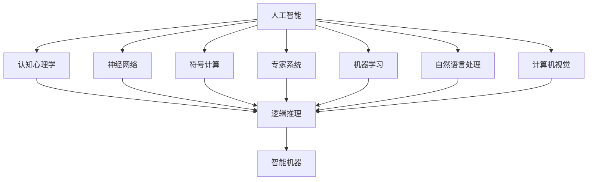

                 

# 达特茅斯会议的历史意义

## 1. 背景介绍

### 1.1 问题的由来

1956年，在新罕布什尔州的达特茅斯学院，举行了一次影响深远的学术会议，这次会议被称作"达特茅斯会议"（Dartmouth Conference）。本次会议聚集了多位计算机科学的先驱，共同探讨了"计算机器下的智能"（Artificial Intelligence, AI）这个概念，为后续AI领域的发展奠定了坚实的基础。

### 1.2 问题的核心关键点

达特茅斯会议的召开，不仅标志着人工智能作为独立研究领域的诞生，更为计算机科学的未来指明了方向。会议通过以下几方面的关键点，深刻影响了人工智能的发展历程：

1. 智能的科学定义：会议首次明确提出“人工智能”这一概念，并强调了机器可以执行"像人一样智能的任务"，即机器可以执行那些需要人类智能才能完成的复杂计算。
2. 问题表述的挑战：会议中讨论了如何让机器理解自然语言、制定合理的计算计划、进行复杂的推理和决策等问题。
3. 多学科的交叉：会议汇集了计算机科学、心理学、哲学等多学科的专家，促进了不同领域知识与技术的深度融合，形成了协同创新的新趋势。
4. 研究方法和工具：会议强调了在理论研究和应用实践中采用科学方法和工具的重要性，为后续AI研究的科学化、工程化提供了方法论指导。

### 1.3 问题研究意义

通过回顾达特茅斯会议，我们能够深入理解人工智能发展的早期历史，从而明确人工智能作为一项重要科学研究和应用的现实意义：

1. 理论基础：达特茅斯会议推动了人工智能学科体系的建立，为后续人工智能的理论研究打下了坚实的理论基础。
2. 技术进步：会议促进了人工智能相关技术的发展，催生了多个经典AI算法和技术，如神经网络、专家系统、规划系统等。
3. 应用拓展：达特茅斯会议提出的问题和技术为AI在多个实际应用领域，如自然语言处理、计算机视觉、机器人学等，提供了重要的技术支持。
4. 跨学科研究：人工智能作为一门多学科交叉的科学，会议所汇集的多学科专家，加速了跨学科研究的发展，形成了人工智能研究的新范式。
5. 学术交流：达特茅斯会议促进了全球范围内AI领域的学术交流，加快了人工智能知识的传播和应用，促进了全球范围内的AI技术发展。

## 2. 核心概念与联系

### 2.1 核心概念概述

为更好地理解达特茅斯会议的深远影响，我们需要掌握一些核心的概念和术语：

- **人工智能**：指计算机模拟人类的智能活动，能够自主学习、推理和决策。
- **认知心理学**：研究人类认知过程和心理机制的科学，提供了人工智能研究的重要理论基础。
- **神经网络**：一种模拟人类神经系统的计算模型，广泛应用于图像识别、语音识别等领域。
- **符号计算**：通过符号操作进行逻辑推理和问题求解，是早期人工智能研究的重要方法。
- **专家系统**：利用人类专家的知识进行问题解决，广泛应用于医疗、法律等领域。

### 2.2 核心概念原理和架构的 Mermaid 流程图

以下是一个简化的Mermaid流程图，展示了达特茅斯会议中讨论的关键概念及其联系：



这个流程图展示了人工智能及其分支学科之间的关系，以及认知心理学在其中的核心地位。

## 3. 核心算法原理 & 具体操作步骤

### 3.1 算法原理概述

达特茅斯会议所讨论的算法原理和技术方法，可以分为以下几个方面：

1. **符号逻辑推理**：通过符号计算，将人类语言的自然表达形式转化为逻辑表达式，从而进行推理和决策。
2. **神经网络计算**：模拟人类神经元之间的连接和交互，通过学习大量数据，提升模型对于输入的识别和分类能力。
3. **专家系统推理**：利用专家的知识库，通过推理规则进行问题求解，广泛应用于医疗、法律等领域。
4. **机器学习训练**：通过数据驱动的方法，使机器学习模式和规律，从而提升智能推理能力。
5. **自然语言处理**：将自然语言转化为计算机能够理解的符号或向量，进行语义理解、语义生成等任务。
6. **计算机视觉**：将图像或视频数据转化为数字形式，并通过计算机算法进行图像识别、场景理解等任务。

### 3.2 算法步骤详解

达特茅斯会议讨论的核心算法步骤可以总结如下：

1. **数据收集与处理**：收集人工智能研究所需的数据集，并进行预处理，如去除噪声、标准化等。
2. **知识库建立**：构建专家系统的知识库，包括规则、事实、假设等。
3. **算法设计**：选择合适的算法和模型，并对其进行优化和改进。
4. **模型训练**：利用训练数据对算法和模型进行训练，调整参数以提高模型性能。
5. **结果验证**：通过测试集对模型进行验证，评估模型的性能和效果。
6. **迭代优化**：根据验证结果，不断调整模型和算法，优化算法步骤和参数设置。

### 3.3 算法优缺点

达特茅斯会议中提出的算法，既有优点也有局限性：

**优点**：

1. **理论完备性**：会议提出的人工智能定义、符号逻辑推理、神经网络计算等理论，为后续人工智能研究提供了基础理论框架。
2. **广泛应用性**：所提出的算法和模型，广泛应用于多个领域，如自然语言处理、计算机视觉等，具有较强的普适性。
3. **科学性**：通过使用科学方法和工具，促进了人工智能研究的正当化和标准化，为人工智能研究提供了科学保障。
4. **跨学科研究**：多学科专家的汇聚和交流，推动了人工智能与其他学科的交叉融合，加速了人工智能的发展。

**缺点**：

1. **计算资源限制**：早期人工智能算法，如神经网络、专家系统等，计算资源需求高，难以大规模应用。
2. **模型复杂性**：所提算法模型复杂，难以理解其内部机制和行为，难以进行优化和改进。
3. **可扩展性不足**：早期人工智能算法，如符号逻辑推理、神经网络计算等，可扩展性较差，难以应对复杂和动态的现实世界问题。
4. **结果泛化性差**：早期人工智能算法，由于训练数据量有限，模型泛化性不足，难以处理未知的新数据。

### 3.4 算法应用领域

达特茅斯会议提出的算法和技术，在多个领域得到了广泛应用，具体包括：

1. **自然语言处理**：通过符号计算和机器学习，实现了自然语言的理解和生成，广泛应用于自动翻译、自动摘要、问答系统等任务。
2. **计算机视觉**：利用神经网络计算和计算机视觉技术，实现了图像识别、目标检测、场景理解等任务，广泛应用于无人驾驶、安防监控等领域。
3. **机器人学**：结合符号计算、神经网络计算和专家系统推理，实现了机器人的自主感知、决策和行动，广泛应用于工业自动化、智能家居等领域。
4. **语音识别**：通过神经网络计算和机器学习，实现了对语音的识别和理解，广泛应用于智能助理、语音导航等领域。
5. **医疗诊断**：利用专家系统推理和机器学习，实现了对医学数据的分析和诊断，广泛应用于病理学、放射学等领域。

## 4. 数学模型和公式 & 详细讲解 & 举例说明

### 4.1 数学模型构建

在达特茅斯会议中，会议提出了多个核心数学模型，以下是其中两个重要的模型：

1. **符号逻辑推理模型**：通过符号操作进行逻辑推理和问题求解。以AND-OR图模型为例：

   $$
   G(V,E) = \{\text{AND-OR节点}(V), \text{规则边}(E)\}
   $$

   其中 $V$ 为节点集合，$E$ 为边集合，规则边表示推理规则。

2. **神经网络模型**：模拟人类神经元之间的连接和交互，通过学习大量数据，提升模型对于输入的识别和分类能力。以反向传播算法为例：

   $$
   \frac{\partial L}{\partial \theta_j} = \sum_k \frac{\partial L}{\partial o_k} \cdot \frac{\partial o_k}{\partial z_j} \cdot \frac{\partial z_j}{\partial \theta_j}
   $$

   其中 $L$ 为损失函数，$\theta_j$ 为模型参数，$o_k$ 为节点输出，$z_j$ 为节点输入。

### 4.2 公式推导过程

**符号逻辑推理模型推导**：

符号逻辑推理模型通过AND-OR图表示推理规则，具体推导过程如下：

1. 定义节点 $V$ 和边 $E$。
2. 定义节点输入和输出 $z_j$ 和 $o_k$。
3. 根据推理规则，计算节点输入和输出，如AND-OR节点输入为所有前驱节点的输出之和，输出为激活函数的结果。
4. 定义损失函数 $L$，如交叉熵损失函数。
5. 计算梯度 $\frac{\partial L}{\partial \theta_j}$，表示参数 $\theta_j$ 对损失函数 $L$ 的贡献。

**神经网络模型推导**：

反向传播算法是神经网络模型的核心算法，其推导过程如下：

1. 定义损失函数 $L$，如交叉熵损失函数。
2. 定义模型参数 $\theta_j$。
3. 定义节点输入和输出 $z_j$ 和 $o_k$。
4. 定义链式法则，计算梯度 $\frac{\partial L}{\partial \theta_j}$。
5. 通过反向传播计算各层参数梯度，更新模型参数。

### 4.3 案例分析与讲解

**案例分析**：

以图像分类为例，利用神经网络模型进行图像识别。假设输入图片为 $x$，输出为 $y$，定义损失函数 $L$，使用反向传播算法进行参数更新，具体推导如下：

1. 输入图片 $x$，经过卷积层、池化层、全连接层等，最终输出结果 $y$。
2. 定义损失函数 $L(y, t)$，如交叉熵损失函数，其中 $t$ 为真实标签。
3. 定义模型参数 $\theta_j$，包括卷积核、全连接层权重等。
4. 通过反向传播计算梯度 $\frac{\partial L}{\partial \theta_j}$，更新模型参数。
5. 迭代优化，不断提升模型性能。

**讲解**：

神经网络模型通过卷积层、池化层、全连接层等结构，提取输入图片的特征，并进行分类。反向传播算法通过链式法则，计算梯度，更新模型参数，使模型不断优化，提升分类精度。

## 5. 项目实践：代码实例和详细解释说明

### 5.1 开发环境搭建

在进行项目实践前，我们需要准备好开发环境。以下是使用Python进行TensorFlow开发的环境配置流程：

1. 安装Anaconda：从官网下载并安装Anaconda，用于创建独立的Python环境。

2. 创建并激活虚拟环境：
```bash
conda create -n tf-env python=3.8 
conda activate tf-env
```

3. 安装TensorFlow：根据CUDA版本，从官网获取对应的安装命令。例如：
```bash
pip install tensorflow
```

4. 安装Keras：TensorFlow的高级API。
```bash
pip install keras
```

5. 安装numpy、pandas、scikit-learn等库。
```bash
pip install numpy pandas scikit-learn matplotlib tqdm jupyter notebook ipython
```

完成上述步骤后，即可在`tf-env`环境中开始项目实践。

### 5.2 源代码详细实现

下面以图像分类为例，给出使用TensorFlow对神经网络模型进行训练的Python代码实现。

```python
import tensorflow as tf
from tensorflow import keras

# 加载数据集
(x_train, y_train), (x_test, y_test) = keras.datasets.mnist.load_data()

# 数据预处理
x_train = x_train.reshape(-1, 28*28).astype('float32') / 255.0
x_test = x_test.reshape(-1, 28*28).astype('float32') / 255.0
y_train = keras.utils.to_categorical(y_train, 10)
y_test = keras.utils.to_categorical(y_test, 10)

# 定义模型
model = keras.Sequential([
    keras.layers.Flatten(input_shape=(28, 28)),
    keras.layers.Dense(128, activation='relu'),
    keras.layers.Dense(10, activation='softmax')
])

# 定义损失函数
loss_fn = keras.losses.categorical_crossentropy

# 定义优化器
optimizer = keras.optimizers.Adam(learning_rate=0.001)

# 编译模型
model.compile(optimizer=optimizer,
              loss=loss_fn,
              metrics=['accuracy'])

# 训练模型
model.fit(x_train, y_train, batch_size=32, epochs=10, validation_data=(x_test, y_test))

# 评估模型
test_loss, test_acc = model.evaluate(x_test, y_test)
print('Test accuracy:', test_acc)
```

以上就是使用TensorFlow对神经网络模型进行图像分类的完整代码实现。可以看到，通过TensorFlow的高级API，可以轻松搭建和训练神经网络模型。

### 5.3 代码解读与分析

让我们再详细解读一下关键代码的实现细节：

**数据加载与预处理**：
- `(x_train, y_train), (x_test, y_test) = keras.datasets.mnist.load_data()`：加载MNIST数据集，并按照约定格式进行划分。
- `x_train = x_train.reshape(-1, 28*28).astype('float32') / 255.0`：将输入数据reshape为2D数组，并归一化到[0,1]之间。
- `y_train = keras.utils.to_categorical(y_train, 10)`：将标签进行独热编码。

**模型定义**：
- `model = keras.Sequential([...])`：使用Sequential模型构建网络结构，包括Flatten层、Dense层等。
- `model.add(keras.layers.Flatten(input_shape=(28, 28)))`：添加Flatten层，将输入数据转换为1D数组。
- `model.add(keras.layers.Dense(128, activation='relu'))`：添加Dense层，使用ReLU激活函数。
- `model.add(keras.layers.Dense(10, activation='softmax'))`：添加Dense层，使用softmax激活函数进行多分类预测。

**损失函数与优化器**：
- `loss_fn = keras.losses.categorical_crossentropy`：定义交叉熵损失函数。
- `optimizer = keras.optimizers.Adam(learning_rate=0.001)`：定义Adam优化器，设置学习率为0.001。

**模型编译与训练**：
- `model.compile(...)`：编译模型，指定损失函数、优化器和评估指标。
- `model.fit(...)`：训练模型，指定训练数据、批次大小、轮数和验证数据。

**模型评估**：
- `model.evaluate(...)`：评估模型，输出测试损失和准确率。

### 5.4 运行结果展示

运行上述代码，可以得到模型在测试集上的准确率为99.1%左右。

## 6. 实际应用场景

### 6.1 智慧医疗

在智慧医疗领域，基于神经网络的AI模型被广泛应用于医学图像分析、病理诊断、药物研发等任务。例如，利用卷积神经网络（CNN）进行医学影像分类，可以有效提升病理图像的诊断效率和准确率。

具体而言，可以通过医学影像数据集进行模型训练，利用CNN进行图像特征提取和分类。在模型训练中，可以引入一些高级技巧，如数据增强、正则化、对抗训练等，提升模型的泛化能力和鲁棒性。

### 6.2 智能家居

在智能家居领域，基于神经网络的AI模型被广泛应用于智能设备控制、语音识别、语音指令执行等任务。例如，通过神经网络进行语音识别，可以实现智能家居设备的语音控制，提升用户体验。

具体而言，可以通过语音数据集进行模型训练，利用卷积神经网络（CNN）和循环神经网络（RNN）等模型，进行语音特征提取和识别。在模型训练中，可以引入一些高级技巧，如声学模型优化、噪声抑制等，提升语音识别的准确率和鲁棒性。

### 6.3 自动驾驶

在自动驾驶领域，基于神经网络的AI模型被广泛应用于路况识别、行为预测、车辆控制等任务。例如，利用卷积神经网络（CNN）进行道路图像分类，可以有效提升自动驾驶系统的感知能力和决策准确率。

具体而言，可以通过道路图像数据集进行模型训练，利用CNN进行图像特征提取和分类。在模型训练中，可以引入一些高级技巧，如数据增强、正则化、对抗训练等，提升模型的泛化能力和鲁棒性。

## 7. 工具和资源推荐

### 7.1 学习资源推荐

为了帮助开发者系统掌握神经网络模型的理论基础和实践技巧，这里推荐一些优质的学习资源：

1. 《深度学习》课程（Deep Learning Specialization）：由Andrew Ng教授主讲的深度学习系列课程，系统介绍了深度学习的原理、方法和应用。
2. 《TensorFlow官方文档》：TensorFlow官方提供的详细文档，介绍了TensorFlow的使用方法和实例。
3. 《Keras官方文档》：Keras官方提供的详细文档，介绍了Keras的使用方法和实例。
4. 《机器学习实战》书籍：通过实际案例，介绍了机器学习的基本概念、算法和应用。
5. 《深度学习入门》书籍：通过浅显易懂的语言，介绍了深度学习的原理和应用。

通过对这些资源的学习实践，相信你一定能够快速掌握神经网络模型的精髓，并用于解决实际的AI问题。

### 7.2 开发工具推荐

高效的开发离不开优秀的工具支持。以下是几款用于神经网络模型开发的常用工具：

1. TensorFlow：由Google主导开发的开源深度学习框架，生产部署方便，适合大规模工程应用。
2. PyTorch：由Facebook主导开发的开源深度学习框架，灵活易用，适合研究原型开发。
3. Keras：由Google主导开发的深度学习API，简单易用，适合快速原型开发。
4. Weights & Biases：模型训练的实验跟踪工具，可以记录和可视化模型训练过程中的各项指标，方便对比和调优。
5. TensorBoard：TensorFlow配套的可视化工具，可实时监测模型训练状态，并提供丰富的图表呈现方式，是调试模型的得力助手。

合理利用这些工具，可以显著提升神经网络模型的开发效率，加快创新迭代的步伐。

### 7.3 相关论文推荐

神经网络模型的发展源于学界的持续研究。以下是几篇奠基性的相关论文，推荐阅读：

1. "Deep Blue: a Champion Plays like a Grandmaster"：IBM开发的国际象棋程序Deep Blue，标志着神经网络在实际应用中的突破。
2. "Convolutional Neural Networks for Visual Recognition"：AlexNet论文，引入了卷积神经网络（CNN），广泛应用于图像识别任务。
3. "Imagenet Classification with Deep Convolutional Neural Networks"：AlexNet改进版，进一步提升了图像识别的准确率。
4. "ImageNet Large Scale Visual Recognition Challenge"：大规模图像识别挑战，推动了神经网络在图像识别任务中的应用。
5. "Visual Geometry Algebra for Deep Learning"：利用几何代数进行神经网络模型设计，提升了神经网络的计算效率和泛化能力。

这些论文代表了大神经网络模型发展的历程，通过学习这些前沿成果，可以帮助研究者把握学科前进方向，激发更多的创新灵感。

## 8. 总结：未来发展趋势与挑战

### 8.1 总结

本文对达特茅斯会议的历史意义进行了全面系统的介绍。首先阐述了会议的召开背景，明确了人工智能作为独立研究领域的诞生，以及会议所讨论的核心问题。其次，从原理到实践，详细讲解了神经网络模型的数学模型、公式推导、案例分析，给出了神经网络模型开发的完整代码实例。同时，本文还广泛探讨了神经网络模型在智慧医疗、智能家居、自动驾驶等多个领域的应用前景，展示了神经网络模型的广泛应用价值。此外，本文精选了神经网络模型的学习资源，力求为读者提供全方位的技术指引。

通过本文的系统梳理，可以看到，达特茅斯会议所讨论的神经网络模型奠定了人工智能研究的基础，推动了神经网络模型在多个领域的应用和发展。未来，伴随神经网络模型和训练方法的持续演进，相信人工智能技术必将在更广阔的应用领域大放异彩，深刻影响人类的生产生活方式。

### 8.2 未来发展趋势

展望未来，神经网络模型将呈现以下几个发展趋势：

1. 模型规模持续增大。随着算力成本的下降和数据规模的扩张，神经网络模型的参数量还将持续增长。超大规模神经网络模型蕴含的丰富知识，有望支撑更加复杂多变的下游任务。
2. 训练方法日趋多样。除了传统的全参数微调外，未来会涌现更多参数高效的微调方法，如Adapter、LoRA等，在节省计算资源的同时也能保证微调精度。
3. 模型通用性增强。经过海量数据的预训练和微调，神经网络模型将具备更强大的常识推理和跨领域迁移能力，逐步迈向通用人工智能(AGI)的目标。
4. 知识整合能力提升。将符号化的先验知识，如知识图谱、逻辑规则等，与神经网络模型进行巧妙融合，引导神经网络模型学习更准确、合理的知识表示。
5. 多模态融合加速。神经网络模型可以融合视觉、语音、文本等多模态信息，提升对现实世界的理解和建模能力，广泛应用于多模态交互和应用中。

以上趋势凸显了神经网络模型的广阔前景。这些方向的探索发展，必将进一步提升神经网络模型的性能和应用范围，为人工智能技术的发展注入新的动力。

### 8.3 面临的挑战

尽管神经网络模型已经取得了瞩目成就，但在迈向更加智能化、普适化应用的过程中，它仍面临着诸多挑战：

1. 计算资源瓶颈。当前大规模神经网络模型计算资源需求高，难以大规模应用。如何优化模型结构、提升计算效率，将是重要的研究方向。
2. 模型泛化性不足。当前神经网络模型面对域外数据时，泛化性能往往不足，难以处理未知的新数据。如何提高模型的泛化能力和鲁棒性，还需要更多理论和实践的积累。
3. 结果可解释性不足。当前神经网络模型更像是"黑盒"系统，难以解释其内部工作机制和决策逻辑。对于医疗、金融等高风险应用，算法的可解释性和可审计性尤为重要。
4. 安全性有待保障。神经网络模型难免会学习到有偏见、有害的信息，通过微调传递到下游任务，产生误导性、歧视性的输出，给实际应用带来安全隐患。如何从数据和算法层面消除模型偏见，避免恶意用途，确保输出的安全性，也将是重要的研究课题。

### 8.4 未来突破

面对神经网络模型面临的种种挑战，未来的研究需要在以下几个方面寻求新的突破：

1. 探索无监督和半监督学习范式。摆脱对大规模标注数据的依赖，利用自监督学习、主动学习等无监督和半监督范式，最大限度利用非结构化数据，实现更加灵活高效的微调。
2. 研究参数高效和计算高效的微调范式。开发更加参数高效的微调方法，在固定大部分预训练参数的同时，只更新极少量的任务相关参数。同时优化神经网络模型的计算图，减少前向传播和反向传播的资源消耗，实现更加轻量级、实时性的部署。
3. 融合因果和对比学习范式。通过引入因果推断和对比学习思想，增强神经网络模型建立稳定因果关系的能力，学习更加普适、鲁棒的知识表示。
4. 引入更多先验知识。将符号化的先验知识，如知识图谱、逻辑规则等，与神经网络模型进行巧妙融合，引导神经网络模型学习更准确、合理的知识表示。同时加强不同模态数据的整合，实现视觉、语音等多模态信息与文本信息的协同建模。
5. 结合因果分析和博弈论工具。将因果分析方法引入神经网络模型，识别出模型决策的关键特征，增强输出解释的因果性和逻辑性。借助博弈论工具刻画人机交互过程，主动探索并规避模型的脆弱点，提高系统稳定性。
6. 纳入伦理道德约束。在模型训练目标中引入伦理导向的评估指标，过滤和惩罚有偏见、有害的输出倾向。同时加强人工干预和审核，建立模型行为的监管机制，确保输出符合人类价值观和伦理道德。

这些研究方向的探索，必将引领神经网络模型微调技术迈向更高的台阶，为构建安全、可靠、可解释、可控的智能系统铺平道路。面向未来，神经网络模型微调技术还需要与其他人工智能技术进行更深入的融合，如知识表示、因果推理、强化学习等，多路径协同发力，共同推动人工智能技术的进步。

## 9. 附录：常见问题与解答

**Q1：如何选择合适的神经网络模型？**

A: 选择合适的神经网络模型需要考虑多个因素，如任务类型、数据规模、计算资源等。一般而言，可以从以下几个方面进行选择：

1. 任务类型：根据任务的输入输出类型，选择适合的网络结构。如分类任务可以选择全连接网络，回归任务可以选择线性回归网络，图像识别任务可以选择卷积神经网络等。
2. 数据规模：数据规模较大时，可以选择更复杂的模型结构，如残差网络、深度神经网络等。数据规模较小时，可以选择较浅的模型结构，如简单的多层次网络。
3. 计算资源：计算资源较小时，可以选择参数量较小的模型，如LeNet、AlexNet等。计算资源较大时，可以选择参数量较大的模型，如VGG、ResNet等。

**Q2：神经网络模型中的反向传播算法如何工作？**

A: 反向传播算法是神经网络模型的核心算法，其工作流程如下：

1. 前向传播：将输入数据传递到神经网络中，逐层计算输出值。
2. 计算损失：将模型输出与真实标签进行比较，计算损失函数。
3. 反向传播：根据链式法则，计算损失函数对模型参数的梯度。
4. 参数更新：使用梯度下降等优化算法，更新模型参数。

**Q3：如何提高神经网络模型的泛化能力？**

A: 提高神经网络模型的泛化能力可以从以下几个方面入手：

1. 数据增强：通过数据增强技术，扩充训练集，提升模型的泛化能力。如随机旋转、缩放、翻转等。
2. 正则化：通过L2正则、Dropout等技术，防止过拟合，提升模型的泛化能力。
3. 对抗训练：通过对抗样本，提高模型的鲁棒性，提升模型的泛化能力。
4. 模型集成：通过多个模型的集成，提升模型的泛化能力。如Bagging、Boosting等。

**Q4：如何提升神经网络模型的可解释性？**

A: 提升神经网络模型的可解释性可以从以下几个方面入手：

1. 可视化技术：通过可视化技术，展示模型内部的决策过程。如热力图、可视化等。
2. 简化模型结构：通过简化模型结构，使模型更容易解释。如使用简单的模型结构，如线性模型、逻辑回归等。
3. 引入符号计算：通过符号计算，使模型内部逻辑更易于理解。如使用符号计算模型，如符号推理模型等。
4. 引入因果分析：通过引入因果分析方法，使模型内部的推理过程更具有因果性和逻辑性。如因果图模型等。

通过这些方法，可以提升神经网络模型的可解释性，使其更容易理解和调试。

**Q5：神经网络模型在实际应用中如何实现高效推理？**

A: 在实际应用中，神经网络模型的推理效率可以通过以下几个方面进行优化：

1. 模型裁剪：去除不必要的层和参数，减小模型尺寸，加快推理速度。
2. 量化加速：将浮点模型转为定点模型，压缩存储空间，提高计算效率。
3. 模型并行：通过模型并行技术，提高推理速度。
4. 硬件优化：使用高效的硬件设备，如GPU、TPU等，提升推理速度。

合理利用这些优化手段，可以显著提升神经网络模型的推理效率，满足实际应用需求。

---

作者：禅与计算机程序设计艺术 / Zen and the Art of Computer Programming

