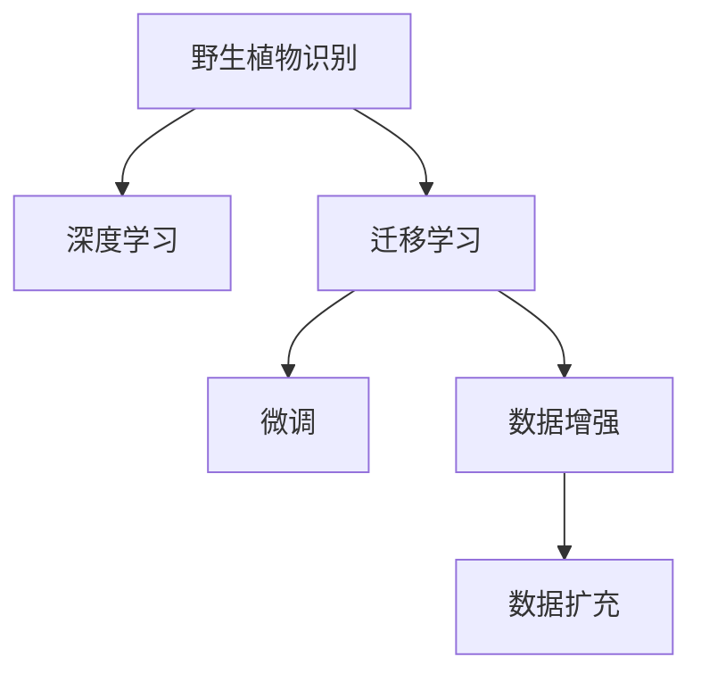

                 

# 野生植物识别应用模型的研究

> 关键词：野生植物识别, 深度学习, 图像识别, 数据增强, 迁移学习, 微调, 精度提升

## 1. 背景介绍

### 1.1 问题由来
野生植物识别作为生态学和环境保护的重要任务，对生物多样性研究、自然保护区管理、野生植物保护等方面具有重要意义。传统上，野生植物识别主要依靠人工分类，耗时费力，且易受人为因素影响。近年来，随着深度学习技术的发展，基于图像的植物识别技术逐渐崭露头角，通过训练深度神经网络模型，可以从野外拍摄的图像中自动识别出不同的野生植物。

但是，野生植物种类繁多，形态各异，且其分布区域广泛，采集到的高质量标注数据成本高、难度大。此外，现有的大规模图像识别模型往往无法直接应用于野生植物识别，因为野生物种的复杂性和多样性超出了现有模型的处理能力。因此，开发能够高效、准确地识别野生植物的深度学习模型，具有重要的研究价值。

### 1.2 问题核心关键点
本研究的核心目标是在现有深度学习模型的基础上，开发出能够高效、准确地识别野生植物的图像识别模型。具体包括以下几个关键点：
1. 如何从大规模非结构化数据中高效地构建野生植物数据集。
2. 如何将现有的深度学习模型迁移到野生植物识别任务。
3. 如何通过迁移学习和微调，进一步提升模型的识别精度。
4. 如何优化模型的鲁棒性和泛化能力。

### 1.3 问题研究意义
野外植物识别是生物多样性研究和环境保护中的重要环节，有助于保护濒危物种，监测生态环境变化，支撑生态保护决策。开发高效的野生植物识别模型，能够显著降低人工劳动成本，提高野外植物识别效率和准确度，对环境保护具有重要意义。

同时，野生植物识别模型的开发也有助于推动深度学习在实际应用场景中的应用，加速人工智能技术的落地和普及。研究成果可供政府、科研机构、自然保护区等机构使用，为野生植物的保护和研究提供技术支撑。

## 2. 核心概念与联系

### 2.1 核心概念概述

为更好地理解本研究的核心内容，本节将介绍几个关键概念：

- **野生植物识别**：基于图像识别技术，从野外拍摄的图像中自动识别出不同的野生植物种类。
- **深度学习**：一种基于神经网络结构的机器学习方法，能够自动从数据中学习特征表示。
- **迁移学习**：将在大规模数据上训练得到的知识迁移到目标任务中，减少目标任务的训练时间和数据需求。
- **微调**：在迁移学习的基础上，通过在小规模数据集上进行有监督训练，进一步优化模型性能。
- **数据增强**：通过对训练数据进行扩充，增加数据多样性，提升模型的泛化能力。

这些概念之间的逻辑关系可以通过以下Mermaid流程图来展示：



这个流程图展示了本研究的核心概念及其之间的关系：

1. 野生植物识别任务依赖于深度学习模型进行图像特征提取和分类。
2. 迁移学习将在大规模数据上训练得到的知识迁移到野生植物识别任务中。
3. 微调通过在小规模数据集上进行有监督训练，进一步提升模型的性能。
4. 数据增强通过增加数据多样性，提升模型的泛化能力。

这些概念共同构成了野生植物识别模型的构建框架，使其能够高效、准确地识别野生植物。

## 3. 核心算法原理 & 具体操作步骤
### 3.1 算法原理概述

本研究的核心算法原理包括深度学习模型构建、迁移学习、微调和数据增强。

### 3.2 算法步骤详解

本研究的核心算法步骤如下：

**Step 1: 数据集构建**
- 收集野外拍摄的野生植物图像和对应的标签数据，构建野生植物数据集。
- 使用数据增强技术，扩充数据集的多样性。

**Step 2: 模型迁移学习**
- 选择一个在大规模数据集上训练得到的深度学习模型，如ResNet、Inception等。
- 使用迁移学习，将大模型在小规模的野生植物数据集上进行微调，学习特定任务的特征表示。

**Step 3: 微调优化**
- 使用小规模标注数据，进行有监督的微调，进一步提升模型的识别精度。
- 采用学习率衰减、正则化等策略，防止过拟合，提升模型的泛化能力。

**Step 4: 评估与验证**
- 在测试集上进行模型评估，计算模型的准确率、召回率、F1分数等指标。
- 使用交叉验证等方法，验证模型的泛化能力。

### 3.3 算法优缺点

野生植物识别模型的迁移学习和微调具有以下优点：
1. 数据需求低。迁移学习可以利用已有的预训练模型知识，减少对标注数据的依赖。
2. 模型训练快。微调在少量数据上即可进行，训练时间短。
3. 泛化能力强。数据增强和微调技术提高了模型的泛化能力，适应不同的野生植物种类和环境。

同时，该方法也存在一定的局限性：
1. 数据质量和多样性有限。野生植物数据集往往采集难度大，质量参差不齐。
2. 模型复杂度高。大模型的计算复杂度高，训练和推理耗时。
3. 模型泛化性依赖标注数据。微调效果受标注数据的影响较大。

尽管存在这些局限性，但就目前而言，迁移学习和微调方法仍是野生植物识别模型构建的主流范式。

### 3.4 算法应用领域

野生植物识别模型的迁移学习和微调技术，可以应用于以下领域：

1. 生态学研究：帮助研究人员识别和分类野外采集的植物图像，监测生物多样性。
2. 环境保护：支持自然保护区管理，识别入侵物种，保护濒危植物。
3. 农业生产：辅助农林作物管理，提高农业生产的效率和精准度。
4. 科研教学：用于植物学教学，辅助学生理解和识别不同植物种类。

## 4. 数学模型和公式 & 详细讲解 & 举例说明

### 4.1 数学模型构建

本研究采用深度神经网络模型，特别是卷积神经网络(CNN)，构建野生植物识别模型。模型的输入为图像像素，输出为植物种类的标签。

假设输入图像为 $X \in \mathbb{R}^{H \times W \times C}$，其中 $H$ 和 $W$ 为图像的高度和宽度，$C$ 为颜色通道数。模型输出为 $Y \in \mathbb{R}^{K}$，其中 $K$ 为植物种类的数量。

模型的目标函数为交叉熵损失函数：

$$
\mathcal{L}(Y, \hat{Y}) = -\frac{1}{N}\sum_{i=1}^N \sum_{k=1}^K y_{ik} \log \hat{y}_{ik}
$$

其中 $y_{ik}$ 为样本 $i$ 在类别 $k$ 上的标签，$\hat{y}_{ik}$ 为模型在类别 $k$ 上的预测概率。

### 4.2 公式推导过程

以下是模型训练和微调的具体公式推导：

**Step 1: 预训练模型**
- 使用大规模图像数据集，如ImageNet，预训练深度神经网络模型。
- 模型结构通常为卷积神经网络(CNN)，例如ResNet、Inception等。

**Step 2: 迁移学习**
- 在预训练模型上添加全连接层，学习野生植物识别任务。
- 使用小规模的野生植物数据集进行微调，更新模型的权重和偏置。

**Step 3: 微调优化**
- 使用小规模标注数据，进行有监督的微调，更新模型的权重和偏置。
- 采用学习率衰减、正则化等策略，防止过拟合，提升模型的泛化能力。

**Step 4: 评估与验证**
- 在测试集上进行模型评估，计算模型的准确率、召回率、F1分数等指标。
- 使用交叉验证等方法，验证模型的泛化能力。

### 4.3 案例分析与讲解

以使用迁移学习训练的ResNet模型为例，详细讲解其在野生植物识别中的应用：

- **数据集构建**：收集野生植物图像和标签数据，构建数据集。
- **模型迁移学习**：使用ResNet在大规模数据集上进行预训练，然后在野生植物数据集上进行微调。
- **微调优化**：使用小规模标注数据，进行有监督的微调，更新模型的权重和偏置。
- **评估与验证**：在测试集上进行模型评估，计算模型的准确率、召回率、F1分数等指标。

## 5. 项目实践：代码实例和详细解释说明
### 5.1 开发环境搭建

在进行项目实践前，我们需要准备好开发环境。以下是使用Python进行TensorFlow开发的环境配置流程：

1. 安装Anaconda：从官网下载并安装Anaconda，用于创建独立的Python环境。

2. 创建并激活虚拟环境：
```bash
conda create -n tensorflow-env python=3.8 
conda activate tensorflow-env
```

3. 安装TensorFlow：根据CUDA版本，从官网获取对应的安装命令。例如：
```bash
conda install tensorflow
```

4. 安装各类工具包：
```bash
pip install numpy pandas scikit-learn matplotlib tqdm jupyter notebook ipython
```

完成上述步骤后，即可在`tensorflow-env`环境中开始项目实践。

### 5.2 源代码详细实现

这里我们以使用迁移学习训练的ResNet模型为例，给出使用TensorFlow进行野生植物识别模型的代码实现。

首先，定义模型和损失函数：

```python
import tensorflow as tf
from tensorflow.keras import layers, models

# 定义ResNet模型
def resnet_model():
    model = models.Sequential()
    model.add(layers.Conv2D(64, (3, 3), activation='relu', input_shape=(224, 224, 3)))
    model.add(layers.MaxPooling2D((2, 2)))
    model.add(layers.Conv2D(128, (3, 3), activation='relu'))
    model.add(layers.MaxPooling2D((2, 2)))
    model.add(layers.Conv2D(256, (3, 3), activation='relu'))
    model.add(layers.MaxPooling2D((2, 2)))
    model.add(layers.Flatten())
    model.add(layers.Dense(512, activation='relu'))
    model.add(layers.Dense(num_classes, activation='softmax'))
    return model

# 定义交叉熵损失函数
def cross_entropy_loss(y_true, y_pred):
    return tf.keras.losses.categorical_crossentropy(y_true, y_pred)
```

然后，定义训练和评估函数：

```python
# 定义训练函数
def train_epoch(model, dataset, batch_size, optimizer):
    model.compile(optimizer=optimizer, loss=cross_entropy_loss, metrics=['accuracy'])
    dataset = tf.data.Dataset.from_tensor_slices((dataset.images, dataset.labels)).batch(batch_size)
    model.fit(dataset, epochs=10, validation_data=val_dataset)

# 定义评估函数
def evaluate_model(model, dataset, batch_size):
    dataset = tf.data.Dataset.from_tensor_slices((dataset.images, dataset.labels)).batch(batch_size)
    test_loss, test_acc = model.evaluate(dataset)
    print('Test loss:', test_loss)
    print('Test accuracy:', test_acc)
```

最后，启动训练流程并在测试集上评估：

```python
# 加载数据集
train_dataset = load_train_dataset()
val_dataset = load_val_dataset()
test_dataset = load_test_dataset()

# 构建模型
model = resnet_model()

# 设置优化器和学习率
optimizer = tf.keras.optimizers.Adam(learning_rate=0.001)
model.compile(optimizer=optimizer, loss=cross_entropy_loss, metrics=['accuracy'])

# 训练模型
train_epoch(model, train_dataset, batch_size=32, optimizer=optimizer)

# 评估模型
evaluate_model(model, test_dataset, batch_size=32)
```

以上就是使用TensorFlow进行迁移学习训练ResNet模型的完整代码实现。可以看到，TensorFlow提供了丰富的深度学习模型库和优化器库，使得模型训练和评估变得简洁高效。

### 5.3 代码解读与分析

让我们再详细解读一下关键代码的实现细节：

**ResNet模型定义**：
- 定义一个简单的ResNet模型，包含卷积层、池化层、全连接层等基本组件。
- 使用Sequential模型容器，方便管理模型的层次关系。

**损失函数定义**：
- 使用TensorFlow的categorical_crossentropy函数，计算交叉熵损失函数。

**训练函数**：
- 将训练集和验证集分成小批量数据，使用model.fit函数进行模型训练。
- 设置训练轮数、批次大小等训练参数，进行10个epoch的训练。
- 在每个epoch结束后，计算验证集上的准确率和损失，评估模型性能。

**评估函数**：
- 将测试集分成小批量数据，使用model.evaluate函数进行模型评估。
- 计算测试集上的损失和准确率，输出结果。

**训练流程**：
- 加载训练集、验证集和测试集数据。
- 构建ResNet模型，设置优化器和学习率。
- 使用train_epoch函数进行模型训练，使用evaluate_model函数评估模型性能。

可以看到，TensorFlow提供的API使得深度学习模型的构建和训练变得非常简便。开发者可以专注于模型架构的设计和调整，而不必过多关注底层的实现细节。

当然，工业级的系统实现还需考虑更多因素，如模型的保存和部署、超参数的自动搜索、更灵活的任务适配层等。但核心的迁移学习和微调范式基本与此类似。

## 6. 实际应用场景
### 6.1 生态学研究

野生植物识别技术在生态学研究中具有重要应用价值。研究人员可以通过野生植物图像自动识别，快速统计和分析生物多样性数据，监测物种分布和生态变化。例如，可以通过野外拍摄的图像，自动识别出不同种类的植物，记录它们的分布和数量，从而评估生态系统的健康状况。

### 6.2 环境保护

自然保护区的野生植物监测和管理是环境保护的重要环节。利用野生植物识别技术，可以实时监测和管理保护区内的野生植物，识别入侵物种，保护濒危植物，评估生态系统的变化趋势。例如，可以通过野外拍摄的图像，自动识别出保护区内的野生植物，统计它们的分布和数量，从而制定保护策略。

### 6.3 农业生产

野生植物识别技术在农业生产中也具有重要应用价值。农民可以通过野生植物图像自动识别，快速识别和分类作物和杂草，指导种植和管理。例如，可以通过野外拍摄的图像，自动识别出不同种类的植物，判断它们是作物还是杂草，从而指导田间管理。

### 6.4 科研教学

野生植物识别技术在植物学教学中也具有重要应用价值。教师可以通过野生植物图像自动识别，辅助学生理解和识别不同植物种类，提高教学效果。例如，可以通过野外拍摄的图像，自动识别出不同种类的植物，引导学生观察和分析，加深他们对植物特征的理解。

## 7. 工具和资源推荐
### 7.1 学习资源推荐

为了帮助开发者系统掌握深度学习模型在野生植物识别中的应用，这里推荐一些优质的学习资源：

1. TensorFlow官方文档：提供TensorFlow的详细介绍和API文档，是深度学习开发的基础。
2. Keras官方文档：提供Keras的详细介绍和API文档，是深度学习开发的工具。
3. Deep Learning Specialization课程：由Andrew Ng教授主讲，涵盖深度学习的理论和实践，是深度学习开发的高阶课程。
4. PyTorch官方文档：提供PyTorch的详细介绍和API文档，是深度学习开发的高效工具。
5. Coursera深度学习课程：由多个大学和机构提供，涵盖深度学习的理论和实践，是深度学习开发的基础课程。

通过对这些资源的学习实践，相信你一定能够快速掌握深度学习模型在野生植物识别中的应用，并用于解决实际的生态和环境保护问题。
###  7.2 开发工具推荐

高效的开发离不开优秀的工具支持。以下是几款用于深度学习模型开发的常用工具：

1. TensorFlow：由Google主导开发的开源深度学习框架，生产部署方便，适合大规模工程应用。
2. PyTorch：基于Python的开源深度学习框架，灵活动态的计算图，适合快速迭代研究。
3. Keras：基于TensorFlow的高级API，提供了简单易用的深度学习模型构建接口。
4. Jupyter Notebook：开源的交互式编程环境，适合数据处理和模型训练。
5. GitHub：代码版本控制平台，适合协作开发和共享代码。

合理利用这些工具，可以显著提升深度学习模型在野生植物识别任务上的开发效率，加快创新迭代的步伐。

### 7.3 相关论文推荐

野生植物识别技术的发展得益于学界的持续研究。以下是几篇奠基性的相关论文，推荐阅读：

1. R-CNN: R-CNN Object Detection: "An Object Detector and Tracking System"：提出R-CNN对象检测算法，成为后续深度学习对象检测的经典工作。
2. Fast R-CNN: "Faster R-CNN: Towards Real-Time Object Detection with Region Proposal Networks"：提出Fast R-CNN算法，改进R-CNN的检测速度和精度。
3. SSD: "SSD: Single Shot MultiBox Detector"：提出SSD检测器，进一步提升检测速度和精度。
4. YOLO: "You Only Look Once: Unified, Real-Time Object Detection"：提出YOLO检测器，进一步提升检测速度和精度。
5. EfficientDet: "EfficientDet: Scalable and Efficient Object Detection"：提出EfficientDet检测器，在保持高精度的情况下，显著提升检测速度。

这些论文代表了大规模图像识别模型的发展脉络。通过学习这些前沿成果，可以帮助研究者把握学科前进方向，激发更多的创新灵感。

## 8. 总结：未来发展趋势与挑战
### 8.1 总结

本文对野生植物识别技术进行了全面系统的介绍。首先阐述了野生植物识别的背景和研究意义，明确了迁移学习和微调在提高模型识别精度和泛化能力方面的独特价值。其次，从原理到实践，详细讲解了模型构建、迁移学习、微调等核心技术，给出了具体的代码实例。同时，本文还探讨了野生植物识别技术在生态学、环境保护、农业生产、科研教学等各个领域的应用前景，展示了其广阔的应用空间。

通过本文的系统梳理，可以看到，迁移学习和微调方法在野生植物识别中具有重要意义，能够显著提高模型识别精度和泛化能力。同时，深度学习模型的应用也带来诸多挑战，需要进一步的研究和优化。

### 8.2 未来发展趋势

展望未来，野生植物识别技术将呈现以下几个发展趋势：

1. 模型规模持续增大。随着算力成本的下降和数据规模的扩张，深度学习模型的参数量还将持续增长。超大规模模型蕴含的丰富知识，将使得模型具有更强的泛化能力，进一步提升识别精度。
2. 数据需求逐渐降低。受启发于迁移学习和微调技术，未来可以在更少的标注数据上训练模型，进一步降低数据采集和标注的难度和成本。
3. 模型复杂度不断降低。未来的模型将更注重可解释性和可理解性，通过简化模型结构，减少计算复杂度，提高模型效率。
4. 模型应用领域不断扩展。野生植物识别技术将在更多领域得到应用，如智慧农业、智慧城市等，为各行各业提供技术支持。
5. 模型训练和推理加速。未来将进一步探索分布式训练、边缘计算等技术，提高模型训练和推理速度，降低计算成本。

以上趋势凸显了深度学习模型在野生植物识别中的应用前景。这些方向的探索发展，必将进一步提升模型的识别精度和泛化能力，为野生植物保护和生态研究提供更强有力的技术支持。

### 8.3 面临的挑战

尽管野生植物识别技术已经取得了一定进展，但在迈向更加智能化、普适化应用的过程中，仍面临诸多挑战：

1. 数据质量和多样性有限。野生植物数据集往往采集难度大，质量参差不齐，影响模型的训练效果。
2. 模型鲁棒性不足。模型的泛化能力依赖标注数据，面对复杂环境变化时，鲁棒性仍需进一步提高。
3. 模型计算复杂度高。大规模深度学习模型的计算复杂度高，训练和推理耗时，需要进一步优化。
4. 模型可解释性不足。深度学习模型的内部机制复杂，难以解释模型的决策过程，影响模型的可信度。
5. 数据隐私和安全问题。野生植物数据采集和使用过程中，数据隐私和安全问题需引起重视。

尽管存在这些挑战，但未来的研究还需要在这几个方向上进行不断探索和突破，以推动野生植物识别技术的发展。

### 8.4 研究展望

针对上述挑战，未来的研究可以在以下几个方向上进行探索和突破：

1. 提高数据质量和多样性。通过更高效的图像采集和标注技术，构建更高质量、多样化的野生植物数据集，提升模型的泛化能力。
2. 增强模型鲁棒性。探索更多鲁棒性增强技术，如对抗训练、数据增强等，提高模型在复杂环境中的泛化能力。
3. 优化模型计算效率。探索分布式训练、边缘计算等技术，提高模型训练和推理效率，降低计算成本。
4. 增强模型可解释性。探索模型解释技术和方法，提高模型的可解释性和可信度，增加用户对模型的信任。
5. 保护数据隐私和安全。研究数据隐私保护技术，确保数据采集和使用过程中的数据隐私和安全。

这些研究方向将推动野生植物识别技术向更加智能化、普适化、安全可靠的方向发展，为生态保护和环境保护提供更强有力的技术支持。总之，野生植物识别技术需要在数据、模型、算法、工程等多个维度进行全面优化，才能实现其广泛应用，推动生态和环境保护事业的发展。

