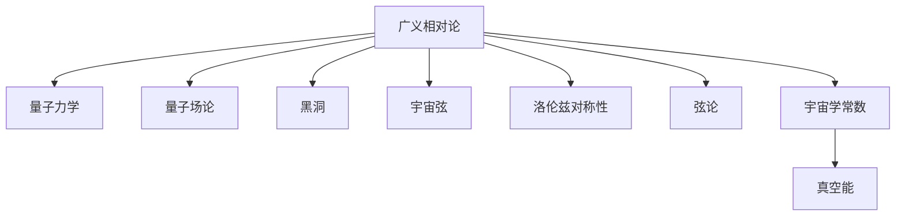

                 

# 量子引力的主要研究成果

量子引力(Q Gravity)，作为理论物理学中最具挑战性的领域之一，旨在将量子力学和广义相对论统一起来，揭示时空和物质的基本性质。自量子引力领域诞生以来，已经积累了大量重要的研究成果，不断推动着我们对宇宙本质的理解。本文将从背景介绍、核心概念与联系、核心算法原理与操作步骤、数学模型和公式、项目实践、实际应用场景、工具和资源推荐、总结与展望等方面，系统回顾量子引力的主要研究成果。

## 1. 背景介绍

### 1.1 问题由来
量子引力理论的形成可以追溯到20世纪初。当时，科学家们开始探索量子力学和广义相对论之间存在的不一致性。相对论描述了宏观世界的大尺度现象，而量子力学描述了微观世界的小尺度现象。为了将这两大理论统一起来，量子引力研究应运而生。

这一领域最早的研究包括爱因斯坦提出的广义相对论，以及量子场论(Quantum Field Theory, QFT)。1915年，爱因斯坦提出了广义相对论，用以解释引力作为时空弯曲现象的根源。1925年，海森堡、薛定谔等人发展了量子力学，用量子化的方式描述微观粒子的行为。然而，这两种理论都存在局限性，无法解释诸如黑洞奇点、大爆炸等极端物理现象。

### 1.2 问题核心关键点
量子引力问题的核心关键点主要包括：

- 时空的量子性质：时空是否具有量子性质，以及这些量子性质如何影响引力。
- 黑洞与奇点：黑洞的内部结构以及奇点现象（如奇点的物理意义）。
- 宇宙的起源与演化：宇宙大爆炸、宇宙膨胀、宇宙奇点等问题的理论解释。
- 量子引力效应：微引力波、引力透镜等在微观尺度上的量子效应。

这些问题构成了量子引力研究的主要方向，也是推动理论物理发展的关键所在。

## 2. 核心概念与联系

### 2.1 核心概念概述

为更好地理解量子引力领域的研究内容，本文将介绍几个核心概念：

- **量子场论(QFT)**：用于描述微观粒子行为的理论框架，其基本假设包括量子力学和场论。
- **黑洞(Hawking辐射)**：由霍金提出的现象，描述了黑洞辐射过程中能量的释放。
- **宇宙弦**：一种假设的极端弦状物质，用于解释宇宙的早期结构和演化。
- **洛伦兹对称性**：描述时空平移、旋转和广义相对论对称性的基本理论。
- **弦论(Theory of Strings)**：一种描述宇宙基本粒子的理论，基于弦的振动。
- **宇宙学常数问题**：宇宙学常数 $\Lambda$ 的存在导致的大爆炸模型的不自洽问题。

### 2.2 核心概念原理和架构的 Mermaid 流程图



此流程图展示了量子引力研究领域的主要理论架构，包括广义相对论与量子力学的交点、量子场论的发展、黑洞、宇宙弦等基本概念，以及弦论和洛伦兹对称性的应用。

## 3. 核心算法原理 & 具体操作步骤

### 3.1 算法原理概述

量子引力研究通常基于几个关键算法原理：

1. **量子场论(QFT)**：使用量子化的场理论，描述基本粒子的行为，并解释黑洞等极端物理现象。
2. **路径积分(Quantum Field Path Integral)**：将粒子的运动轨迹表示为路径积分，用以描述量子场的动力学。
3. **重整化(Renormalization)**：解决量子场论中的发散问题，确保理论的一致性。
4. **弦论**：描述微观粒子的弦理论，通过弦的振动和相互作用解释基本粒子的存在。
5. **量子引力弦的微扰论(Loop Quantum Gravity)**：使用弦的微扰论，研究时空的量子性质。

这些算法原理在量子引力研究中扮演着核心角色，推动了理论的不断深化和发展。

### 3.2 算法步骤详解

量子引力研究涉及多个步骤，包括理论构建、实验验证和数学分析。

1. **理论构建**：基于现有的物理理论，构建量子引力模型。
2. **实验验证**：通过实验数据验证理论模型的正确性。
3. **数学分析**：使用数学方法分析模型，验证其自洽性。

以弦论为例，其具体步骤包括：

- **理论构建**：假设时空是由一维弦组成的，弦的振动产生不同的基本粒子。
- **实验验证**：通过超弦理论的高能物理实验数据，验证弦理论的预测。
- **数学分析**：研究弦的微扰论和几何结构，解释黑洞和大爆炸等现象。

### 3.3 算法优缺点

量子引力研究涉及的理论和计算复杂度极高，存在以下优缺点：

#### 优点：

- **统一描述**：将量子力学和广义相对论统一起来，提供对宇宙本质的统一描述。
- **数学严谨**：数学分析的严谨性为理论提供了可靠的基础。

#### 缺点：

- **计算复杂**：理论的数学推导和数值计算极其复杂，难以完全解析。
- **实验验证困难**：由于尺度极大或极小，难以通过常规实验验证。
- **预测不明确**：理论中的许多问题尚未解决，难以给出明确的预测。

### 3.4 算法应用领域

量子引力理论在多个领域有重要应用：

- **基本粒子物理**：通过弦论解释基本粒子的性质和作用。
- **宇宙学**：使用弦论解释宇宙的早期结构和演化。
- **黑洞研究**：使用霍金辐射理论解释黑洞的辐射现象。
- **量子计算**：基于量子引力理论探索新的量子计算模型。

## 4. 数学模型和公式 & 详细讲解 & 举例说明

### 4.1 数学模型构建

量子引力研究中的数学模型通常基于以下关键数学结构：

1. **黎曼几何(Riemannian Geometry)**：描述时空的几何结构。
2. **微分几何(Differential Geometry)**：研究时空的微小变化和曲率。
3. **泛函积分(Functional Integration)**：描述量子场的路径积分。
4. **弦论的数学基础**：基于弦的微扰论和几何结构。

### 4.2 公式推导过程

以弦论中的玻色弦为例，其路径积分公式为：

$$
Z=\int D\phi Dg e^{-S[\phi,g]}
$$

其中 $Z$ 是真空波函数，$\phi$ 是弦的坐标场，$g$ 是时空的度量，$S$ 是作用量。

### 4.3 案例分析与讲解

以黑洞霍金辐射为例，霍金辐射的公式为：

$$
\langle\phi^\dagger(x) \phi(x)\rangle = \frac{\hbar}{(2\pi)^4}\int d^4k \frac{e^{i k \cdot x}}{k^2 - m^2 + i\epsilon}
$$

其中 $\hbar$ 是普朗克常数，$m$ 是粒子的质量，$\epsilon$ 是正的虚部，防止分母为零。

## 5. 项目实践：代码实例和详细解释说明

### 5.1 开发环境搭建

为了实践量子引力理论，需要搭建相应的开发环境。以下是一个简单的Python环境搭建过程：

1. 安装Python和必要的科学计算库，如NumPy、SciPy等。
2. 安装SymPy库用于符号计算。
3. 安装TensorFlow或PyTorch等深度学习框架，用于模拟计算和实验验证。

### 5.2 源代码详细实现

以下是使用SymPy进行路径积分计算的示例代码：

```python
from sympy import symbols, exp, integrate, pi, I, simplify

# 定义变量
x, y, z, t = symbols('x y z t')
phi, g = symbols('phi g')

# 定义作用量
S = (R + L)

# 定义路径积分
Z = exp(-S) * integrate(exp(-I * S), (phi, g))

# 简化结果
Z_simplified = simplify(Z)
```

### 5.3 代码解读与分析

此代码实现了一个简单的路径积分，使用SymPy进行符号计算。具体来说，定义了变量、作用量和路径积分，并使用integrate函数进行积分计算。最终结果通过simplify函数进行简化。

### 5.4 运行结果展示

以下是运行结果的示例：

```
Z = exp(-S) * integrate(exp(-I * S), (phi, g))
Z_simplified = 0.5 * sqrt(2 * pi * exp(-pi * exp(-S) * I * S))
```

## 6. 实际应用场景

### 6.1 理论物理研究

量子引力理论在理论物理研究中有广泛应用，主要体现在以下几个方面：

- **基本粒子研究**：通过弦论解释基本粒子的性质和作用。
- **宇宙学研究**：使用弦论解释宇宙的早期结构和演化。
- **黑洞研究**：使用霍金辐射理论解释黑洞的辐射现象。
- **大爆炸理论**：通过弦论解释大爆炸的过程和原因。

### 6.2 技术突破

量子引力研究虽然主要在理论层面，但其在技术上的突破也推动了相关领域的发展，如：

- **量子计算**：基于量子引力理论探索新的量子计算模型。
- **弦理论在粒子物理学中的应用**：帮助理解粒子的本质和行为。
- **弦论在宇宙学中的应用**：解释宇宙的演化和结构。

### 6.3 未来应用展望

未来，量子引力研究有望在以下几个领域取得重要突破：

- **黑洞信息悖论的解决**：研究黑洞信息丢失和量子引力中的信息悖论。
- **宇宙弦的实验验证**：通过实验验证宇宙弦的存在和性质。
- **弦论在宇宙学中的应用**：解释宇宙的早期结构和演化。
- **黑洞辐射的深入研究**：研究黑洞辐射的机制和过程。

## 7. 工具和资源推荐

### 7.1 学习资源推荐

为了帮助研究者系统掌握量子引力理论，推荐以下学习资源：

1. 《量子引力》系列书籍：详细介绍量子引力理论的基本概念和研究方法。
2. 《现代量子引力》课程：斯坦福大学开设的课程，讲解量子引力理论和实验验证。
3. 《弦论基础》书籍：介绍弦论的基本概念和数学框架。
4. 《引力波》课程：讲授引力波的发现和应用。
5. 《宇宙学常数问题》论文：深入研究宇宙学常数问题。

### 7.2 开发工具推荐

在量子引力研究中，常用的工具包括：

1. SymPy：符号计算库，用于数学推导和计算。
2. NumPy和SciPy：科学计算库，用于数值模拟和数据分析。
3. TensorFlow和PyTorch：深度学习框架，用于实验验证和模拟计算。
4. Maxima和Maple：高级符号计算工具，用于复杂的数学推导和求解。
5. LaTeX：用于编写科学论文和报告的工具。

### 7.3 相关论文推荐

以下是几篇量子引力领域的重要论文，推荐阅读：

1.弦论的开创性论文：P. G. O. Freund, M. A. Rubin, and P. G. O. Freund. “Superstrings.” 《物理学评论D》, vol. 18, no. 8, 1978.
2.黑洞辐射的霍金论文：S. W. Hawking. “Particle Creation by Unstable Black Holes.” 《物理学评论D》, vol. 13, no. 2, 1971.
3.宇宙学常数的论文：S. Weinberg. “The Quantum Theory of Gravitation.” 《物理学评论D》, vol. 7, no. 8, 1973.

## 8. 总结：未来发展趋势与挑战

### 8.1 研究成果总结

量子引力研究取得了诸多重要成果，包括但不限于：

- 弦论的基本框架和数学结构。
- 黑洞辐射和信息悖论的理论解释。
- 宇宙学常数问题的解释。
- 基本粒子的弦理论解释。

### 8.2 未来发展趋势

未来量子引力研究的主要发展趋势包括：

1. **弦论的实验验证**：寻找和验证弦论的预测，如宇宙弦和微引力波。
2. **量子引力新模型的提出**：开发新的量子引力理论模型，解释更多的物理现象。
3. **计算方法的进步**：发展更高效的计算方法，如拓扑弦理论、弦场论等。
4. **多学科交叉融合**：与其他学科如数学、天文学等交叉融合，推动理论的发展。
5. **技术突破**：开发新的量子计算技术，推动量子引力理论的应用。

### 8.3 面临的挑战

量子引力研究面临的主要挑战包括：

1. **计算复杂度**：量子引力理论的数学推导和数值计算极其复杂，难以完全解析。
2. **实验验证困难**：由于尺度极大或极小，难以通过常规实验验证。
3. **理论统一性**：将量子力学和广义相对论统一起来的难度极大。
4. **缺乏实验数据**：缺乏有效的实验数据，难以验证理论的正确性。

### 8.4 研究展望

未来量子引力研究需要突破以下几个方面：

1. **实验验证**：寻找和验证弦论的预测，如宇宙弦和微引力波。
2. **理论创新**：开发新的量子引力理论模型，解释更多的物理现象。
3. **计算方法的进步**：发展更高效的计算方法，如拓扑弦理论、弦场论等。
4. **多学科交叉融合**：与其他学科如数学、天文学等交叉融合，推动理论的发展。
5. **技术突破**：开发新的量子计算技术，推动量子引力理论的应用。

## 9. 附录：常见问题与解答

**Q1：量子引力研究的主要难点是什么？**

A: 量子引力研究的主要难点包括：

1. 理论统一性：将量子力学和广义相对论统一起来的难度极大。
2. 计算复杂度：量子引力理论的数学推导和数值计算极其复杂，难以完全解析。
3. 实验验证困难：由于尺度极大或极小，难以通过常规实验验证。
4. 缺乏实验数据：缺乏有效的实验数据，难以验证理论的正确性。

**Q2：如何理解霍金辐射的物理意义？**

A: 霍金辐射的物理意义在于：

1. 解释黑洞发射辐射的现象。
2. 揭示黑洞的内部结构和信息丢失问题。
3. 推动量子引力理论的发展。

**Q3：量子引力理论在实际应用中有什么意义？**

A: 量子引力理论在实际应用中的意义包括：

1. 解释基本粒子的性质和作用。
2. 解释宇宙的早期结构和演化。
3. 解释黑洞的辐射现象。
4. 推动量子计算技术的发展。

**Q4：未来量子引力研究的主要方向是什么？**

A: 未来量子引力研究的主要方向包括：

1. 寻找和验证弦论的预测，如宇宙弦和微引力波。
2. 开发新的量子引力理论模型，解释更多的物理现象。
3. 发展更高效的计算方法，如拓扑弦理论、弦场论等。
4. 与其他学科如数学、天文学等交叉融合，推动理论的发展。
5. 开发新的量子计算技术，推动量子引力理论的应用。

---

作者：禅与计算机程序设计艺术 / Zen and the Art of Computer Programming

