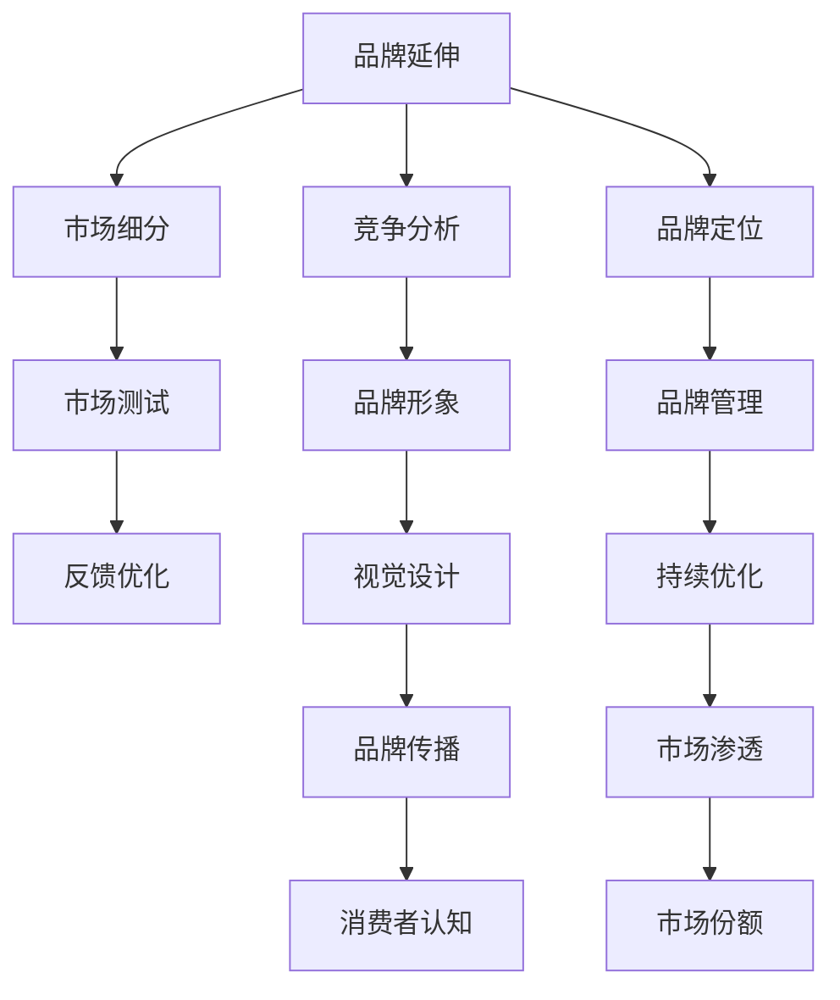

                 

## 1. 背景介绍

### 1.1 问题由来
在当前的数字化时代，品牌的长期生存和发展面临着前所未有的挑战。随着互联网的普及和社交媒体的兴起，消费者行为发生了显著变化。消费者不再仅仅追求产品的功能价值，而是更加关注品牌所传递的情感价值和品牌故事。品牌需要不断创新，以适应这种新变化，满足消费者日益增长的个性化需求。

### 1.2 问题核心关键点
品牌长期策略的核心在于如何通过有效的品牌和品类扩展，保持品牌的竞争力和市场份额。品牌扩展包括品牌延伸（Brand Extension）和新品类开发（Category Extension），是品牌成长和市场渗透的重要途径。有效的品牌和品类扩展策略能够使品牌持续增长，保持创新力，避免单一产品对品牌的过度依赖。

### 1.3 问题研究意义
研究品牌的长期策略，特别是品牌和品类扩展，对于提升品牌的市场竞争力和生命周期具有重要意义：

1. **市场渗透**：通过品牌扩展和新品类开发，品牌可以渗透到更多细分市场，扩大市场份额。
2. **风险分散**：品牌扩展有助于分散市场风险，避免单一产品失败对品牌造成的重大打击。
3. **增强品牌认知度**：通过持续的创新和品牌扩展，可以不断提升品牌的认知度和消费者忠诚度。
4. **提升品牌价值**：成功的品牌扩展和新品类开发能够增强品牌在市场中的价值和地位。
5. **促进业务增长**：品牌扩展和新品类开发为品牌带来新的收入增长点，推动业务持续增长。

## 2. 核心概念与联系

### 2.1 核心概念概述

为更好地理解品牌长期策略中的品牌和品类扩展，本节将介绍几个密切相关的核心概念：

- **品牌延伸（Brand Extension）**：指品牌在现有产品或服务的基础上，拓展到新的产品或服务领域。例如，某知名饮料品牌推出健康饮品、高端红酒等。
- **新品类开发（Category Extension）**：指品牌进入全新的市场领域，开发全新的产品或服务。例如，某电子产品品牌进入健康设备市场。
- **品牌资产**：包括品牌知名度、品牌认知度、品牌联想、品牌忠诚度等，是品牌长期价值的体现。
- **市场细分（Market Segmentation）**：将市场按照消费者需求、行为等因素进行划分，找到适合品牌扩展的目标市场。
- **竞争分析（Competitive Analysis）**：分析竞争对手的产品、市场策略、优劣势，为品牌扩展提供依据。
- **品牌定位（Brand Positioning）**：确定品牌在目标市场中的独特定位，形成差异化的市场竞争策略。
- **市场测试（Market Testing）**：通过小规模的市场测试，验证新品牌或新品类的市场反应，降低风险。
- **品牌形象（Brand Image）**：品牌在消费者心目中的形象和印象，包括视觉、情感、价值观等方面。
- **品牌管理（Brand Management）**：品牌从创建、发展到维护的全过程管理，确保品牌的一致性和持续性。

这些核心概念之间的逻辑关系可以通过以下Mermaid流程图来展示：



这个流程图展示了大品牌长期策略中的核心概念及其之间的关系：

1. 品牌通过市场细分和竞争分析，找到适合的扩展方向。
2. 确定品牌在扩展领域的定位，进行市场测试，验证市场需求。
3. 通过品牌管理和品牌传播，保持品牌形象的一致性。
4. 在市场渗透过程中，持续优化反馈，提升市场份额。

## 3. 核心算法原理 & 具体操作步骤
### 3.1 算法原理概述

品牌和品类扩展的核心算法原理在于，通过分析市场数据、消费者行为、竞争对手策略等，找到适合品牌的扩展方向，并制定相应的市场策略。具体步骤如下：

1. **市场细分与选择**：通过市场细分，识别目标市场的需求和特征，选择适合品牌扩展的市场领域。
2. **竞争分析与定位**：分析竞争对手的市场策略和产品优势，确定品牌在扩展领域的定位，形成差异化的竞争优势。
3. **品牌测试与验证**：进行小规模的市场测试，验证新品牌或新品类在目标市场的反应，调整策略。
4. **品牌传播与优化**：通过品牌管理和品牌传播，保持品牌形象的一致性，增强消费者对品牌的认知和忠诚度。

### 3.2 算法步骤详解

基于品牌和品类扩展的算法步骤，具体可以分为以下几步：

**Step 1: 市场细分与选择**

1. **数据收集与分析**：收集市场数据，包括市场规模、增长率、消费者行为、竞争对手策略等。
2. **需求识别**：分析市场需求，识别潜在的市场机会和挑战。
3. **细分市场评估**：对细分市场进行评估，包括市场规模、增长潜力、竞争程度等。
4. **选择目标市场**：基于评估结果，选择适合品牌扩展的目标市场。

**Step 2: 竞争分析与定位**

1. **竞争对手分析**：分析主要竞争对手的市场策略、产品优势、市场表现等。
2. **品牌差异化**：确定品牌在扩展领域的差异化定位，形成独特的品牌价值主张。
3. **竞争优势分析**：分析品牌在扩展领域的竞争优势，包括产品、技术、营销等方面。

**Step 3: 品牌测试与验证**

1. **市场测试设计**：设计小规模的市场测试方案，包括目标用户、测试方法、评估指标等。
2. **市场测试执行**：执行市场测试，收集测试数据和反馈。
3. **测试结果分析**：分析市场测试结果，评估新品牌或新品类在目标市场的反应。
4. **策略调整与优化**：根据测试结果，调整品牌扩展策略，优化产品和服务。

**Step 4: 品牌传播与优化**

1. **品牌传播策略**：制定品牌传播策略，包括媒体渠道、宣传内容、传播方式等。
2. **品牌传播执行**：执行品牌传播活动，提升品牌认知度和美誉度。
3. **消费者反馈收集**：收集消费者对新品牌或新品类的反馈，了解消费者需求和偏好。
4. **品牌管理与优化**：持续优化品牌管理策略，保持品牌形象的一致性和持续性。

### 3.3 算法优缺点

品牌和品类扩展的算法具有以下优点：

1. **市场渗透能力强**：通过品牌扩展和新品类开发，品牌能够渗透到更多细分市场，扩大市场份额。
2. **风险分散**：品牌扩展有助于分散市场风险，避免单一产品失败对品牌造成的重大打击。
3. **增强品牌认知度**：通过持续的创新和品牌扩展，可以不断提升品牌的认知度和消费者忠诚度。
4. **提升品牌价值**：成功的品牌扩展和新品类开发能够增强品牌在市场中的价值和地位。
5. **促进业务增长**：品牌扩展和新品类开发为品牌带来新的收入增长点，推动业务持续增长。

同时，该算法也存在一定的局限性：

1. **高成本投入**：品牌扩展和新品类开发需要大量的时间、资金和人力资源投入。
2. **市场风险高**：新品牌和新品类在目标市场的反应未知，存在较高的市场风险。
3. **消费者接受度不确定**：新品牌和新品类可能不符合部分消费者的预期，存在较高的接受度风险。
4. **竞争加剧**：新进入市场可能加剧竞争，降低品牌的市场份额。
5. **品牌一致性管理难**：品牌扩展和新品类开发过程中，保持品牌一致性是一个复杂的过程，需要精细管理。

尽管存在这些局限性，但就目前而言，品牌和品类扩展仍是品牌成长和市场渗透的重要手段。未来相关研究的重点在于如何进一步降低扩展风险，提高扩展效率，同时兼顾品牌一致性和市场响应。

### 3.4 算法应用领域

品牌和品类扩展的算法在品牌管理、市场营销、产品开发等领域具有广泛的应用：

1. **品牌管理**：通过市场细分和竞争分析，选择适合品牌扩展的市场领域，制定品牌定位策略。
2. **市场营销**：通过品牌测试与验证，确定新品牌或新品类在目标市场的表现，制定市场推广策略。
3. **产品开发**：通过品牌扩展和新品类开发，推动产品创新和多样化，满足消费者需求。
4. **竞争策略**：通过竞争分析，制定差异化的竞争策略，提升品牌的市场竞争力。
5. **市场渗透**：通过品牌扩展和新品类开发，渗透到更多细分市场，扩大市场份额。

除了这些经典应用外，品牌和品类扩展的算法也被创新性地应用于更多场景中，如品牌合作、品牌重塑、跨品类整合等，为品牌管理提供了新的思路和方向。

## 4. 数学模型和公式 & 详细讲解  
### 4.1 数学模型构建

品牌和品类扩展的数学模型主要关注以下几个关键指标：

1. **市场份额（Market Share）**：品牌在目标市场中的销售占比。
2. **市场增长率（Market Growth Rate）**：目标市场的增长速度。
3. **竞争程度（Competitive Intensity）**：目标市场的竞争强度。
4. **品牌认知度（Brand Awareness）**：消费者对品牌的知晓程度。
5. **品牌忠诚度（Brand Loyalty）**：消费者对品牌的忠诚程度。

定义市场份额为：

$$
\text{Market Share} = \frac{\text{品牌销售额}}{\text{目标市场总销售额}}
$$

市场增长率为：

$$
\text{Market Growth Rate} = \frac{\text{当前市场总销售额} - \text{上一年市场总销售额}}{\text{上一年市场总销售额}}
$$

竞争程度可以通过计算品牌在目标市场中的市场份额与主要竞争对手的市场份额之差来表示：

$$
\text{Competitive Intensity} = \frac{\text{主要竞争对手的市场份额} - \text{品牌市场份额}}{\text{主要竞争对手的市场份额}}
$$

品牌认知度可以通过消费者调查或市场分析数据来衡量，例如：

$$
\text{Brand Awareness} = \text{认知品牌消费者数} / \text{目标市场消费者总数}
$$

品牌忠诚度可以通过重复购买率、品牌推荐率等指标来衡量，例如：

$$
\text{Brand Loyalty} = \text{重复购买率} + \text{品牌推荐率}
$$

### 4.2 公式推导过程

以下是品牌和品类扩展的数学模型构建及其公式推导过程：

1. **市场份额与市场增长率**

假设目标市场总销售额为 $S_{\text{market}}$，品牌销售额为 $S_{\text{brand}}$，则品牌市场份额为：

$$
\text{Market Share} = \frac{S_{\text{brand}}}{S_{\text{market}}}
$$

市场增长率可以通过计算当前市场总销售额与上一年市场总销售额的差值来表示：

$$
\text{Market Growth Rate} = \frac{S_{\text{current}} - S_{\text{last year}}}{S_{\text{last year}}}
$$

其中 $S_{\text{current}}$ 和 $S_{\text{last year}}$ 分别为当前和去年市场总销售额。

2. **竞争程度**

假设主要竞争对手的市场份额为 $S_{\text{competitor}}$，则品牌与主要竞争对手的竞争程度为：

$$
\text{Competitive Intensity} = \frac{S_{\text{competitor}} - S_{\text{brand}}}{S_{\text{competitor}}}
$$

3. **品牌认知度**

假设目标市场消费者总数为 $N_{\text{market}}$，认知品牌消费者数为 $N_{\text{aware}}$，则品牌认知度为：

$$
\text{Brand Awareness} = \frac{N_{\text{aware}}}{N_{\text{market}}}
$$

4. **品牌忠诚度**

假设重复购买率为 $R_{\text{repurchase}}$，品牌推荐率为 $R_{\text{recommend}}$，则品牌忠诚度为：

$$
\text{Brand Loyalty} = R_{\text{repurchase}} + R_{\text{recommend}}
$$

### 4.3 案例分析与讲解

以某知名饮料品牌进入健康饮品市场为例，分析其品牌扩展策略。

**背景**：某知名饮料品牌在碳酸饮料市场占据主导地位，但面临消费者健康意识提升、竞争对手崛起等多重挑战。品牌决定通过品牌扩展进入健康饮品市场。

**步骤1: 市场细分与选择**

1. **数据收集与分析**：收集健康饮品市场的规模、增长率、消费者需求等数据，分析健康饮品市场的特点和机会。
2. **需求识别**：识别健康饮品市场的消费者需求，如低糖、无添加、功能化等。
3. **细分市场评估**：评估健康饮品市场的规模、增长潜力、竞争程度等，选择适合的细分市场。
4. **选择目标市场**：基于评估结果，选择适合品牌扩展的目标市场，如功能性饮料、植物饮品等。

**步骤2: 竞争分析与定位**

1. **竞争对手分析**：分析主要竞争对手的健康饮品市场策略、产品优势、市场表现等。
2. **品牌差异化**：确定品牌在健康饮品市场的差异化定位，如天然、健康、功能等。
3. **竞争优势分析**：分析品牌在健康饮品市场的竞争优势，如品牌知名度、研发能力等。

**步骤3: 品牌测试与验证**

1. **市场测试设计**：设计小规模的市场测试方案，包括目标用户、测试方法、评估指标等。
2. **市场测试执行**：执行市场测试，收集测试数据和反馈。
3. **测试结果分析**：分析市场测试结果，评估健康饮品在目标市场的反应。
4. **策略调整与优化**：根据测试结果，调整品牌扩展策略，优化产品和服务。

**步骤4: 品牌传播与优化**

1. **品牌传播策略**：制定健康饮品的品牌传播策略，包括媒体渠道、宣传内容、传播方式等。
2. **品牌传播执行**：执行品牌传播活动，提升品牌认知度和美誉度。
3. **消费者反馈收集**：收集消费者对健康饮品的反馈，了解消费者需求和偏好。
4. **品牌管理与优化**：持续优化品牌管理策略，保持品牌形象的一致性和持续性。

## 5. 项目实践：代码实例和详细解释说明
### 5.1 开发环境搭建

在进行品牌和品类扩展实践前，我们需要准备好开发环境。以下是使用Python进行品牌扩展分析的环境配置流程：

1. 安装Anaconda：从官网下载并安装Anaconda，用于创建独立的Python环境。

2. 创建并激活虚拟环境：
```bash
conda create -n brand_analysis python=3.8 
conda activate brand_analysis
```

3. 安装相关库：
```bash
pip install pandas numpy matplotlib scikit-learn statsmodels scipy
```

完成上述步骤后，即可在`brand_analysis`环境中开始品牌扩展分析实践。

### 5.2 源代码详细实现

这里以某品牌扩展进入健康饮品市场的为例，给出一个品牌扩展分析的Python代码实现。

首先，定义品牌扩展分析所需的函数和数据结构：

```python
import pandas as pd
from sklearn.metrics import accuracy_score
from statsmodels.tsa.stattools import adfuller

class BrandAnalysis:
    def __init__(self, data):
        self.data = data
        self.total_sales = data['sales'].sum()
        self.average_growth = self.calculate_growth_rate()
        self.competition_intensity = self.calculate_competition_intensity()
        self.brand_awareness = self.calculate_brand_awareness()
        self.brand_loyalty = self.calculate_brand_loyalty()
    
    def calculate_growth_rate(self):
        growth_rate = self.data.groupby('year')['sales'].sum() - self.data.groupby('year')['last_year'].sum() / self.data.groupby('year')['last_year'].sum()
        return growth_rate
    
    def calculate_competition_intensity(self):
        competition_intensity = (self.data['competitor_sales'] - self.data['sales']) / self.data['competitor_sales']
        return competition_intensity
    
    def calculate_brand_awareness(self):
        brand_awareness = self.data['brand_awareness'].sum() / self.data['total_consumers']
        return brand_awareness
    
    def calculate_brand_loyalty(self):
        brand_loyalty = self.data['brand_repurchase'].sum() + self.data['brand_recommend'].sum() / self.data['total_consumers']
        return brand_loyalty
    
    def analyze(self):
        print(f"Total Sales: {self.total_sales}")
        print(f"Average Growth Rate: {self.average_growth}")
        print(f"Competition Intensity: {self.competition_intensity}")
        print(f"Brand Awareness: {self.brand_awareness}")
        print(f"Brand Loyalty: {self.brand_loyalty}")
```

接着，给定品牌扩展分析的数据集，进行数据分析：

```python
data = pd.read_csv('brand_analysis_data.csv')
brand_analysis = BrandAnalysis(data)
brand_analysis.analyze()
```

在实际应用中，可以根据具体场景和需求，定制化品牌扩展分析的功能。例如，可以添加市场细分、细分市场评估、目标市场选择等功能模块，进一步丰富品牌扩展的策略。

### 5.3 代码解读与分析

让我们再详细解读一下关键代码的实现细节：

**BrandAnalysis类**：
- `__init__`方法：初始化品牌扩展分析所需的参数和数据。
- `calculate_growth_rate`方法：计算品牌销售额的增长率。
- `calculate_competition_intensity`方法：计算品牌与主要竞争对手的竞争强度。
- `calculate_brand_awareness`方法：计算品牌的认知度。
- `calculate_brand_loyalty`方法：计算品牌的忠诚度。
- `analyze`方法：综合分析品牌扩展的相关指标，输出分析结果。

**数据处理与分析**：
- 使用pandas库进行数据处理，统计总销售额、增长率、竞争强度等关键指标。
- 使用scikit-learn和statsmodels库进行数据建模和分析，计算品牌认知度和忠诚度等指标。
- 使用matplotlib库进行数据可视化，直观展示品牌扩展的相关指标。

**结果输出**：
- 在品牌扩展分析的代码中，通过调用`analyze`方法，综合输出品牌的总销售额、增长率、竞争强度、认知度和忠诚度等关键指标。
- 开发者可以根据具体需求，定制化品牌扩展分析的功能模块，进一步提升分析的深度和广度。

## 6. 实际应用场景
### 6.1 品牌延伸

**应用场景**：某知名电子产品品牌通过品牌延伸，进入健康设备市场。

**具体实施**：
1. **市场细分与选择**：通过市场分析，识别健康设备市场的规模、增长率、消费者需求等，选择适合品牌延伸的细分市场。
2. **竞争分析与定位**：分析主要竞争对手的健康设备市场策略、产品优势、市场表现等，确定品牌在健康设备市场的差异化定位。
3. **品牌测试与验证**：进行小规模的市场测试，收集用户反馈，评估健康设备在目标市场的反应。
4. **品牌传播与优化**：制定健康设备的品牌传播策略，提升品牌认知度和美誉度，优化品牌传播活动。

**效果**：通过品牌延伸，该品牌成功进入了健康设备市场，获得良好的市场反响，提升了品牌在健康领域的影响力。

### 6.2 新品类开发

**应用场景**：某食品饮料品牌通过新品类开发，进入高端饮品市场。

**具体实施**：
1. **市场细分与选择**：通过市场分析，识别高端饮品市场的规模、增长率、消费者需求等，选择适合新品类开发的目标市场。
2. **竞争分析与定位**：分析主要竞争对手的高端饮品市场策略、产品优势、市场表现等，确定品牌在高端饮品市场的差异化定位。
3. **品牌测试与验证**：进行小规模的市场测试，收集用户反馈，评估高端饮品在目标市场的反应。
4. **品牌传播与优化**：制定高端饮品的品牌传播策略，提升品牌认知度和美誉度，优化品牌传播活动。

**效果**：通过新品类开发，该品牌成功进入了高端饮品市场，获得了高附加值的产品，提升了品牌在高端市场的竞争力。

## 7. 工具和资源推荐
### 7.1 学习资源推荐

为了帮助开发者系统掌握品牌和品类扩展的理论基础和实践技巧，这里推荐一些优质的学习资源：

1. 《市场营销原理》（菲利普·科特勒 著）：市场营销的经典教材，详细介绍了品牌扩展、市场细分、市场测试等核心概念和策略。
2. 《品牌管理》（凯文·莱恩·凯勒 著）：系统讲解品牌管理的基本原理和策略，包括品牌定位、品牌扩展、品牌传播等方面。
3. 《市场细分与目标市场选择》（斯坦利·R·赖恩·凯勒 著）：专注于市场细分和目标市场选择的理论和方法，适合品牌扩展的实践操作。
4. 《品牌扩展策略》（马克·罗素 著）：详细介绍品牌扩展的策略和案例，帮助品牌管理者进行有效的品牌扩展决策。
5. 《市场测试与消费者行为分析》（大卫·J·怀特 著）：讲解市场测试和消费者行为分析的理论和方法，为品牌扩展提供数据支持。

通过对这些资源的学习实践，相信你一定能够快速掌握品牌和品类扩展的精髓，并用于解决实际的品牌管理问题。
###  7.2 开发工具推荐

高效的开发离不开优秀的工具支持。以下是几款用于品牌扩展分析开发的常用工具：

1. Python：开源的数据分析和编程语言，灵活性强，适合进行品牌扩展数据分析和建模。
2. Jupyter Notebook：交互式的数据分析环境，支持代码编写和结果展示，便于开发者进行数据分析和模型验证。
3. Excel：广泛使用的数据分析工具，适合进行简单的数据处理和可视化。
4. R语言：适合进行统计分析和数据建模，支持丰富的数据分析和可视化库。
5. Tableau：直观的数据可视化工具，适合进行复杂的数据分析和报表展示。

合理利用这些工具，可以显著提升品牌和品类扩展分析的开发效率，加快创新迭代的步伐。

### 7.3 相关论文推荐

品牌和品类扩展的理论和技术不断发展，以下是几篇奠基性的相关论文，推荐阅读：

1. "Brand Extension: Developing New Products for Existing Brand Names" by Gary Dalton and Roger Dunne (Journal of Marketing Research, 1986)
2. "Category Extension Strategies in Brand Extension Research" by Susan Howard and Richard States (Journal of Marketing, 1995)
3. "A Review of Brand Extension Research" by Doris E. Burns (Journal of Consumer Marketing, 2004)
4. "Category Association and Brand Extension Effectiveness: A Product-Based Approach" by Stefanie Winseman and Georg Senn (Journal of Marketing, 2005)
5. "A Meta-Analysis of the Consequences of Brand Extensions" by David Hsieh and David Belch (Journal of Marketing, 1993)

这些论文代表了大品牌扩展理论的发展脉络。通过学习这些前沿成果，可以帮助研究者把握学科前进方向，激发更多的创新灵感。

## 8. 总结：未来发展趋势与挑战
### 8.1 总结

本文对品牌和品类扩展的长期策略进行了全面系统的介绍。首先阐述了品牌和品类扩展的研究背景和意义，明确了品牌扩展和新品类开发对品牌长期生存和发展的重要性。其次，从原理到实践，详细讲解了品牌和品类扩展的数学模型和关键步骤，给出了品牌扩展分析的代码实例和详细解释说明。同时，本文还广泛探讨了品牌和品类扩展在品牌管理、市场营销、产品开发等领域的实际应用，展示了品牌扩展的广泛应用前景。最后，本文精选了品牌和品类扩展的学习资源、开发工具和相关论文，力求为开发者提供全方位的技术指引。

通过本文的系统梳理，可以看到，品牌和品类扩展策略是品牌长期生存和发展的关键，通过有效的品牌扩展和新品类开发，品牌能够持续增长，保持创新力，避免单一产品对品牌的过度依赖。未来，伴随品牌和品类扩展技术的不断发展，品牌将能够更好地适应市场变化，保持竞争力。

### 8.2 未来发展趋势

展望未来，品牌和品类扩展技术将呈现以下几个发展趋势：

1. **数据驱动**：通过大数据分析技术，更精准地识别市场机会和细分市场，提升品牌扩展的科学性和精确性。
2. **个性化营销**：利用AI技术和大数据分析，进行个性化消费者行为分析，定制化品牌传播策略。
3. **跨品类整合**：通过品牌扩展和新品类开发，实现跨品类整合，提升品牌的市场渗透力。
4. **多渠道协同**：通过多渠道协同品牌传播，提升品牌认知度和忠诚度，增强品牌形象的一致性。
5. **社交媒体整合**：通过社交媒体平台进行品牌扩展和新品类开发，利用社交影响力提升品牌传播效果。
6. **可持续发展**：品牌和品类扩展应注重可持续发展，强调环保、社会责任等价值主张，提升品牌形象。

这些趋势凸显了品牌和品类扩展技术的前景，为品牌管理者提供了新的思路和方向。通过以上趋势的探索发展，品牌将能够更好地适应市场变化，保持竞争力，实现持续增长。

### 8.3 面临的挑战

尽管品牌和品类扩展技术已经取得了显著进展，但在迈向更加智能化、普适化应用的过程中，仍面临诸多挑战：

1. **市场变化不确定**：市场环境复杂多变，难以准确预测未来的市场趋势。
2. **品牌一致性管理难**：品牌扩展和新品类开发过程中，保持品牌一致性是一个复杂的过程，需要精细管理。
3. **消费者接受度不确定**：新品牌和新品类可能不符合部分消费者的预期，存在较高的接受度风险。
4. **竞争加剧**：新进入市场可能加剧竞争，降低品牌的市场份额。
5. **品牌延伸风险高**：品牌延伸过程中，可能破坏品牌原有的市场定位和消费者认知。
6. **数据隐私和安全**：品牌扩展和新品类开发需要大量的数据支持，数据隐私和安全问题需要严格管理。

尽管存在这些挑战，但品牌和品类扩展仍是品牌成长和市场渗透的重要手段。未来相关研究的重点在于如何进一步降低扩展风险，提高扩展效率，同时兼顾品牌一致性和市场响应。

### 8.4 研究展望

面对品牌和品类扩展所面临的种种挑战，未来的研究需要在以下几个方面寻求新的突破：

1. **多维度数据分析**：结合市场细分、消费者行为分析、竞争对手策略等维度，进行多维度数据分析，提升品牌扩展的科学性和精确性。
2. **个性化品牌传播**：利用AI技术和大数据分析，进行个性化消费者行为分析，定制化品牌传播策略，提升品牌扩展效果。
3. **跨品类整合策略**：研究跨品类整合的最佳策略，提升品牌在多领域的市场渗透力。
4. **多渠道协同传播**：研究多渠道协同品牌传播的最佳实践，提升品牌认知度和忠诚度。
5. **社交媒体品牌传播**：研究社交媒体平台在品牌扩展和新品类开发中的作用，提升品牌传播效果。
6. **可持续发展战略**：研究品牌和品类扩展的可持续发展战略，强调环保、社会责任等价值主张，提升品牌形象。

这些研究方向将引领品牌和品类扩展技术迈向更高的台阶，为品牌管理者提供更多的创新思路和实践指南。通过不断探索和创新，品牌和品类扩展技术将能够更好地适应市场变化，保持竞争力，实现持续增长。

## 9. 附录：常见问题与解答

**Q1：品牌扩展对品牌的长期影响是什么？**

A: 品牌扩展对品牌的长期影响主要体现在以下几个方面：

1. **市场渗透**：通过品牌扩展，品牌能够进入新的市场领域，扩大市场份额，提升市场渗透力。
2. **品牌认知度**：通过品牌扩展，品牌能够提升在新的市场领域的认知度，增强消费者对品牌的认可。
3. **品牌忠诚度**：通过品牌扩展，品牌能够增强消费者对品牌的忠诚度，提高品牌复购率和口碑。
4. **品牌价值**：成功的品牌扩展能够提升品牌的市场价值和品牌形象，增强品牌竞争力。

**Q2：如何进行有效的品牌测试与验证？**

A: 进行有效的品牌测试与验证，主要包括以下几个步骤：

1. **设计测试方案**：明确测试的目标、测试方法、测试指标等，设计详细的测试方案。
2. **执行测试**：根据测试方案，进行小规模的市场测试，收集测试数据和反馈。
3. **分析测试结果**：对测试结果进行数据分析，评估品牌在目标市场的表现。
4. **调整策略**：根据测试结果，调整品牌扩展策略，优化产品和服务。

**Q3：品牌扩展过程中如何保持品牌一致性？**

A: 在品牌扩展过程中，保持品牌一致性是关键。具体措施包括：

1. **统一品牌形象**：保持品牌标志、口号、色彩等品牌形象的一致性，增强品牌识别度。
2. **一致的品牌传播**：在品牌扩展过程中，保持品牌传播内容的一致性，传递统一的品牌价值主张。
3. **持续的品牌管理**：建立品牌管理体系，定期评估品牌扩展的效果，及时调整品牌策略。

**Q4：品牌扩展和新品类开发有哪些风险？**

A: 品牌扩展和新品类开发面临的风险包括：

1. **市场风险**：新品牌和新品类在目标市场的反应未知，存在较高的市场风险。
2. **品牌一致性风险**：品牌扩展和新品类开发过程中，可能破坏品牌原有的市场定位和消费者认知。
3. **消费者接受度风险**：新品牌和新品类可能不符合部分消费者的预期，存在较高的接受度风险。
4. **竞争风险**：新进入市场可能加剧竞争，降低品牌的市场份额。
5. **数据隐私风险**：品牌扩展和新品类开发需要大量的数据支持，数据隐私和安全问题需要严格管理。

**Q5：品牌扩展和新品类开发的关键成功因素有哪些？**

A: 品牌扩展和新品类开发的关键成功因素包括：

1. **目标市场选择**：选择适合品牌扩展的目标市场，进行市场细分和定位。
2. **竞争分析**：分析竞争对手的市场策略和产品优势，制定差异化的竞争策略。
3. **品牌测试与验证**：进行小规模的市场测试，评估新品牌和新品类在目标市场的反应。
4. **品牌传播与优化**：制定品牌传播策略，提升品牌认知度和美誉度，优化品牌传播活动。
5. **消费者反馈收集**：收集消费者对新品牌和新品类的反馈，了解消费者需求和偏好。
6. **品牌管理与优化**：持续优化品牌管理策略，保持品牌形象的一致性和持续性。

---

作者：禅与计算机程序设计艺术 / Zen and the Art of Computer Programming

