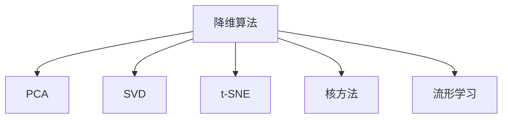

                 

# 降维算法 原理与代码实例讲解

> 关键词：降维算法,主成分分析(PCA),奇异值分解(SVD),t-SNE,核方法,流形学习

## 1. 背景介绍

### 1.1 问题由来
在数据科学和机器学习领域，面对高维数据常常会碰到所谓的“维数灾难”问题，即随着特征维度的增加，数据变得难以处理和分析，且模型性能可能会下降。为了降低数据维度，同时尽可能保留原始数据的有用信息，降维技术显得尤为重要。

### 1.2 问题核心关键点
降维技术的目标是减少数据的维度，同时尽可能地保留数据的重要信息。常见的降维算法包括主成分分析(PCA)、奇异值分解(SVD)、t-SNE、核方法等。这些方法通过不同原理实现数据降维，应用于多种数据集和分析场景中。

### 1.3 问题研究意义
降维算法在数据预处理、特征工程、模式识别、数据可视化等多个领域有着广泛的应用。通过对数据进行降维，不仅可以减少计算量和存储空间，还能提高模型的训练速度和泛化能力。同时，降维算法还可以揭示数据的内在结构，提供更有洞察力的数据分析视角。

## 2. 核心概念与联系

### 2.1 核心概念概述

为更好地理解降维算法，本节将介绍几个密切相关的核心概念：

- **降维算法**：通过减少数据特征数量，将高维数据映射到低维空间的技术。降维不仅可以降低计算复杂度，还可以提高数据分析的效率和模型的可解释性。
- **主成分分析(PCA)**：一种常用的线性降维技术，通过计算数据的主成分，将高维数据投影到低维空间。
- **奇异值分解(SVD)**：一种矩阵分解技术，常用于降维、特征提取、推荐系统等领域。
- **t-分布随机邻域嵌入(t-SNE)**：一种非线性降维技术，通过将高维数据映射到低维空间，使得降维后的数据在高维空间中的分布结构得以保留。
- **核方法**：通过核技巧，将数据映射到高维空间中，使得数据在高维空间中更容易线性可分，从而降低数据维度。
- **流形学习**：基于数据的局部几何特性进行降维，以保留数据的内在结构。

这些核心概念之间的逻辑关系可以通过以下Mermaid流程图来展示：



这个流程图展示了降维算法与其他相关概念之间的联系。

## 3. 核心算法原理 & 具体操作步骤
### 3.1 算法原理概述

降维算法的基本原理是通过某种线性或非线性变换将高维数据映射到低维空间。这一过程通常包括两个步骤：

1. **特征提取**：从原始高维数据中提取主要特征，通常通过计算数据的主成分、奇异值、核函数等实现。
2. **数据映射**：将提取的特征映射到低维空间，通过某种线性变换或非线性变换，使得数据在高维空间中的分布结构得以保留。

降维算法的目标是找到一种映射方式，使得在低维空间中，数据保持最大可能的散布度，同时不同类别的数据在低维空间中尽可能分开。

### 3.2 算法步骤详解

以主成分分析(PCA)算法为例，详细讲解其操作步骤：

**Step 1: 数据预处理**
- 对原始数据进行中心化处理，即减去均值，使得数据均值为零。
- 对数据进行协方差矩阵的计算，确保数据的方差为单位方差。

**Step 2: 特征值分解**
- 计算协方差矩阵的特征值和特征向量，选择前k个最大特征值对应的特征向量，构成特征矩阵。

**Step 3: 数据投影**
- 使用特征矩阵将原始数据投影到低维空间，得到降维后的数据。

**Step 4: 数据可视化和分析**
- 使用降维后的数据进行可视化，分析数据在不同维度下的分布特性。

### 3.3 算法优缺点

降维算法具有以下优点：
1. 减少计算量和存储空间。降维后的数据维数大大降低，计算和存储效率更高。
2. 提高模型训练速度和泛化能力。降维后的数据更容易训练，且泛化能力更强。
3. 揭示数据的内在结构。通过降维，可以发现数据的内在关系和模式。

同时，降维算法也存在以下缺点：
1. 信息损失。降维过程中可能会丢失部分信息，导致数据的高阶关系和复杂结构难以保留。
2. 维度灾难。降维后数据仍可能在高维空间中存在类间重叠问题，导致分类困难。
3. 超参数选择。降维算法通常需要选择合适的维度k，以及不同的特征提取方法，可能导致过度拟合或欠拟合。

### 3.4 算法应用领域

降维算法广泛应用于数据预处理、特征工程、模式识别、数据可视化等多个领域：

- **数据预处理**：通过降维减少数据计算量和存储需求，加速模型训练。
- **特征工程**：通过降维提取主要特征，简化模型结构，提高模型泛化能力。
- **模式识别**：通过降维揭示数据的内在结构，提高模式识别效果。
- **数据可视化**：通过降维使数据在高维空间中更容易可视化，发现数据分布特性。

此外，降维算法还广泛应用于推荐系统、图像识别、信号处理、基因组学等诸多领域，为数据科学和机器学习提供了重要的工具和方法。

## 4. 数学模型和公式 & 详细讲解 & 举例说明
### 4.1 数学模型构建

以主成分分析(PCA)为例，其数学模型可以描述为：

设原始数据为 $X \in \mathbb{R}^{n \times d}$，其中 $n$ 为样本数量，$d$ 为特征维度。$X$ 的协方差矩阵为 $\Sigma$。假设要将其映射到低维空间中的 $k$ 维（$k < d$），则有：

$$
X_{\text{reduced}} = W_{k \times d} X
$$

其中 $W$ 为特征矩阵，使得 $X_{\text{reduced}}$ 的协方差矩阵为单位矩阵 $I_k$。

### 4.2 公式推导过程

PCA的推导过程如下：

1. 计算协方差矩阵 $\Sigma = \frac{1}{n} X^T X$。
2. 计算 $\Sigma$ 的特征值 $\lambda$ 和特征向量 $V$。
3. 选择前 $k$ 个最大特征值对应的特征向量，构成特征矩阵 $W$。
4. 通过 $X_{\text{reduced}} = W^T X$ 进行数据投影。

以一个简单的二维数据集为例：

假设原始数据集为 $X = \begin{bmatrix} 1 & 2 & 3 & 4 \\ 5 & 6 & 7 & 8 \end{bmatrix}$。计算协方差矩阵 $\Sigma = \begin{bmatrix} 6.5 & 6.5 \\ 6.5 & 6.5 \end{bmatrix}$。计算 $\Sigma$ 的特征值 $\lambda_1 = 13$, $\lambda_2 = 0.5$ 和特征向量 $V_1 = \begin{bmatrix} 0.7071 \\ 0.7071 \end{bmatrix}$, $V_2 = \begin{bmatrix} -0.7071 \\ 0.7071 \end{bmatrix}$。选择 $\lambda_1$ 对应的特征向量 $W = \begin{bmatrix} 0.7071 & -0.7071 \end{bmatrix}$。

通过 $X_{\text{reduced}} = W^T X = \begin{bmatrix} 6 & 2 \\ 2 & 6 \end{bmatrix}$，得到降维后的数据。

### 4.3 案例分析与讲解

以Iris数据集为例，分析PCA的降维效果。

Iris数据集包含150个样本，每个样本有4个特征（sepal length, sepal width, petal length, petal width）和3个类别（setosa, versicolor, virginica）。通过PCA将其降维到二维空间，得到降维后的数据集。

使用Python的scikit-learn库进行PCA降维，并可视化结果：

```python
from sklearn.decomposition import PCA
import matplotlib.pyplot as plt

# 加载Iris数据集
from sklearn.datasets import load_iris
iris = load_iris()
X = iris.data
y = iris.target

# 进行PCA降维
pca = PCA(n_components=2)
X_reduced = pca.fit_transform(X)

# 可视化降维后的数据
plt.scatter(X_reduced[:, 0], X_reduced[:, 1], c=y)
plt.xlabel('PC1')
plt.ylabel('PC2')
plt.show()
```

可以看到，通过PCA降维后，Iris数据集在二维空间中的类别分布依然清晰，且特征信息得以保留。

## 5. 项目实践：代码实例和详细解释说明
### 5.1 开发环境搭建

在进行降维算法实践前，我们需要准备好开发环境。以下是使用Python进行scikit-learn库开发的配置流程：

1. 安装Anaconda：从官网下载并安装Anaconda，用于创建独立的Python环境。

2. 创建并激活虚拟环境：
```bash
conda create -n sklearn-env python=3.8 
conda activate sklearn-env
```

3. 安装scikit-learn：
```bash
conda install scikit-learn
```

4. 安装各类工具包：
```bash
pip install numpy pandas matplotlib seaborn jupyter notebook ipython
```

完成上述步骤后，即可在`sklearn-env`环境中开始降维算法实践。

### 5.2 源代码详细实现

这里以主成分分析(PCA)算法为例，给出使用scikit-learn库对Iris数据集进行PCA降维的Python代码实现。

```python
from sklearn.decomposition import PCA
from sklearn.datasets import load_iris
from sklearn.preprocessing import StandardScaler

# 加载Iris数据集
iris = load_iris()
X = iris.data
y = iris.target

# 对数据进行标准化处理
scaler = StandardScaler()
X_scaled = scaler.fit_transform(X)

# 进行PCA降维
pca = PCA(n_components=2)
X_reduced = pca.fit_transform(X_scaled)

# 可视化降维后的数据
import matplotlib.pyplot as plt
plt.scatter(X_reduced[:, 0], X_reduced[:, 1], c=y)
plt.xlabel('PC1')
plt.ylabel('PC2')
plt.show()
```

### 5.3 代码解读与分析

让我们再详细解读一下关键代码的实现细节：

**PCA类**：
- `PCA`类的`fit_transform`方法：对数据进行PCA降维，同时返回降维后的数据。
- `StandardScaler`类的`fit_transform`方法：对数据进行标准化处理，确保数据均值为零，方差为单位方差。

**降维过程**：
- 加载Iris数据集，获取特征矩阵X和标签y。
- 对X进行标准化处理，以避免PCA过程中因特征量级不同导致的偏差。
- 创建PCA对象，指定降维维度为2。
- 使用PCA对象对标准化后的数据进行降维，得到降维后的数据X_reduced。
- 可视化降维后的数据，使用scatter方法绘制散点图，不同类别的点以不同颜色标记。

可以看到，通过简单的代码实现，scikit-learn库使得PCA算法的应用变得非常便捷高效。开发者可以轻松应对各种降维需求。

当然，scikit-learn库还提供了其他降维算法，如奇异值分解(SVD)、t-SNE等，开发者可以根据具体需求选择合适的算法进行应用。

## 6. 实际应用场景
### 6.1 数据可视化

数据可视化是降维算法的典型应用场景。通过降维算法将高维数据映射到低维空间，可以直观地展示数据分布特性，发现数据中的模式和关系。

在数据分析、科学计算、金融分析等领域，数据可视化已成为不可或缺的工具。通过降维算法，可以降低数据维度，使复杂的数据集更容易理解，从而辅助决策制定。

### 6.2 特征工程

在机器学习中，特征工程是提升模型性能的重要环节。通过降维算法，可以提取出数据中的主要特征，简化模型结构，提高模型泛化能力。

在图像识别、自然语言处理、推荐系统等领域，降维算法已被广泛应用于特征工程中。通过降维，可以提高算法的计算效率和模型精度，使得模型在实际应用中表现更佳。

### 6.3 异常检测

异常检测是数据科学中的一个重要应用领域。通过降维算法，可以将高维数据映射到低维空间，使数据在高维空间中的分布特性得以保留，从而更容易发现异常点。

在网络安全、金融风险、健康监测等领域，异常检测已成为重要的安全保障手段。通过降维算法，可以实时监控数据变化，及时发现异常行为，保护数据安全。

### 6.4 未来应用展望

随着降维算法的不断发展，其在数据科学和机器学习中的应用将更加广泛。未来，降维算法将在以下几个方面展现更多潜力：

1. 多模态数据融合。降维算法可以应用于图像、声音、文本等多模态数据融合，揭示不同模态数据之间的内在关系，提高综合分析能力。
2. 数据增强。通过降维算法，可以生成新的合成数据，用于数据增强，提升模型的泛化能力和鲁棒性。
3. 自适应降维。根据数据分布的变化，自动调整降维维度，确保降维后的数据始终保持高质量。
4. 非线性降维。通过非线性降维算法，如t-SNE、Isomap等，更好地处理非线性数据，揭示数据的内在结构。
5. 鲁棒降维。研究鲁棒降维算法，增强算法对噪声和异常数据的抵抗能力，提高算法的稳定性和可靠性。

## 7. 工具和资源推荐
### 7.1 学习资源推荐

为了帮助开发者系统掌握降维算法的理论基础和实践技巧，这里推荐一些优质的学习资源：

1. 《机器学习实战》系列博文：由机器学习专家撰写，深入浅出地介绍了PCA、SVD、t-SNE等降维算法的基本原理和实现方法。

2. CS229《机器学习》课程：斯坦福大学开设的机器学习课程，涵盖降维算法、特征工程、异常检测等多个主题，是入门机器学习的必备资料。

3. 《降维技术》书籍：详细介绍了PCA、SVD、t-SNE等降维算法的原理、应用和实现，是研究降维算法的重要参考书。

4. scikit-learn官方文档：scikit-learn库的官方文档，提供了丰富的降维算法样例和教程，是快速上手降维算法的好工具。

5. Kaggle竞赛平台：提供各类数据集和竞赛任务，是练习降维算法的重要平台。通过参与竞赛，可以提高算法应用能力和数据分析能力。

通过对这些资源的学习实践，相信你一定能够快速掌握降维算法的精髓，并用于解决实际的机器学习问题。

### 7.2 开发工具推荐

高效的开发离不开优秀的工具支持。以下是几款用于降维算法开发的常用工具：

1. Python：作为机器学习领域的主流编程语言，Python语言简单易学，拥有丰富的第三方库和工具，适合快速迭代研究。

2. scikit-learn：基于Python的机器学习库，提供了丰富的降维算法实现和优化，是降维算法开发的基础工具。

3. TensorFlow：由Google主导开发的开源深度学习框架，生产部署方便，适合大规模工程应用。

4. Weights & Biases：模型训练的实验跟踪工具，可以记录和可视化模型训练过程中的各项指标，方便对比和调优。

5. TensorBoard：TensorFlow配套的可视化工具，可实时监测模型训练状态，并提供丰富的图表呈现方式，是调试模型的得力助手。

合理利用这些工具，可以显著提升降维算法的开发效率，加快创新迭代的步伐。

### 7.3 相关论文推荐

降维算法的发展得益于学界的持续研究。以下是几篇奠基性的相关论文，推荐阅读：

1. "On the Estimation of Principal Components and Related Quantities"：Hotelling提出的PCA算法，奠定了线性降维的理论基础。

2. "A Fast Minimum-norm Solution of Linear Inequalities by the Decomposition Method"：Golub和Reinsch提出的奇异值分解(SVD)算法，拓展了矩阵分解的应用范围。

3. "Visualizing High-Dimensional Data Using t-SNE"：Lancichinetti等人提出的t-SNE算法，通过优化KL散度损失函数，实现了高维数据的非线性降维。

4. "Nonlinear Dimensionality Reduction by Locally Linear Embedding"：Roweis和Saul提出的LLE算法，通过局部线性映射，实现了非线性数据的降维。

5. "A Tutorial on Principal Component Analysis"：Crisp和Nati提出的PCA算法综述，详细介绍了PCA算法的基本原理和实际应用。

这些论文代表了大规模降维技术的发展脉络。通过学习这些前沿成果，可以帮助研究者把握学科前进方向，激发更多的创新灵感。

## 8. 总结：未来发展趋势与挑战
### 8.1 总结

本文对降维算法的理论基础和实践应用进行了全面系统的介绍。首先阐述了降维算法的背景和意义，明确了降维在数据处理和模型训练中的重要作用。其次，从原理到实践，详细讲解了PCA算法的数学模型和操作步骤，给出了降维任务开发的完整代码实例。同时，本文还广泛探讨了降维算法在数据可视化、特征工程、异常检测等多个领域的应用前景，展示了降维算法的广泛潜力。最后，本文精选了降维算法的各类学习资源，力求为读者提供全方位的技术指引。

通过本文的系统梳理，可以看到，降维算法在数据科学和机器学习中具有重要的地位，广泛应用于数据预处理、特征工程、模式识别等多个环节。未来，伴随降维算法的不断进步，数据科学和机器学习将迎来更加高效、精准、可解释的分析范式。

### 8.2 未来发展趋势

展望未来，降维算法将呈现以下几个发展趋势：

1. 非线性降维的普及。随着t-SNE、LLE等非线性降维算法的发展，降维算法将更适用于复杂数据的分析和处理。

2. 多模态数据融合。通过降维算法，可以实现图像、声音、文本等多模态数据的融合，提高综合分析能力。

3. 自适应降维。根据数据分布的变化，自动调整降维维度，确保降维后的数据始终保持高质量。

4. 鲁棒降维。研究鲁棒降维算法，增强算法对噪声和异常数据的抵抗能力，提高算法的稳定性和可靠性。

5. 流形学习。基于数据的局部几何特性进行降维，以保留数据的内在结构，成为未来降维算法的重要方向。

以上趋势凸显了降维算法在数据科学和机器学习中的重要地位。这些方向的探索发展，必将进一步提升数据处理和模型训练的效率和效果，为科学研究和技术应用带来新的突破。

### 8.3 面临的挑战

尽管降维算法已经取得了显著成就，但在迈向更加智能化、普适化应用的过程中，它仍面临着诸多挑战：

1. 信息损失。降维过程中可能会丢失部分信息，导致数据的高阶关系和复杂结构难以保留。

2. 维度灾难。降维后数据仍可能在高维空间中存在类间重叠问题，导致分类困难。

3. 超参数选择。降维算法通常需要选择合适的维度k，以及不同的特征提取方法，可能导致过度拟合或欠拟合。

4. 计算复杂度。降维算法的计算复杂度较高，对于大规模数据集，需要高效算法和硬件支持。

5. 可解释性。降维算法通常缺乏可解释性，难以解释其内部工作机制和决策逻辑。

6. 鲁棒性。降维算法可能对噪声和异常数据敏感，导致降维效果不稳定。

这些挑战需要未来研究者不断攻克，以使降维算法更好地服务于数据科学和机器学习。

### 8.4 研究展望

面对降维算法所面临的挑战，未来的研究需要在以下几个方面寻求新的突破：

1. 探索无监督和半监督降维方法。摆脱对大规模标注数据的依赖，利用自监督学习、主动学习等无监督和半监督范式，最大限度利用非结构化数据，实现更加灵活高效的降维。

2. 研究参数高效和计算高效的降维范式。开发更加参数高效的降维方法，在固定大部分预训练参数的情况下，只更新极少量的任务相关参数。同时优化降维模型的计算图，减少前向传播和反向传播的资源消耗，实现更加轻量级、实时性的部署。

3. 融合因果和对比学习范式。通过引入因果推断和对比学习思想，增强降维模型建立稳定因果关系的能力，学习更加普适、鲁棒的语言表征，从而提升模型泛化性和抗干扰能力。

4. 引入更多先验知识。将符号化的先验知识，如知识图谱、逻辑规则等，与神经网络模型进行巧妙融合，引导降维过程学习更准确、合理的语言模型。同时加强不同模态数据的整合，实现视觉、语音等多模态信息与文本信息的协同建模。

5. 结合因果分析和博弈论工具。将因果分析方法引入降维模型，识别出模型决策的关键特征，增强输出解释的因果性和逻辑性。借助博弈论工具刻画人机交互过程，主动探索并规避模型的脆弱点，提高系统稳定性。

这些研究方向的探索，必将引领降维算法技术迈向更高的台阶，为数据科学和机器学习带来新的突破。面向未来，降维算法需要与其他人工智能技术进行更深入的融合，如知识表示、因果推理、强化学习等，多路径协同发力，共同推动数据处理和模型训练的进步。只有勇于创新、敢于突破，才能不断拓展降维算法的边界，让数据科学和机器学习技术更好地服务于社会和经济。

## 9. 附录：常见问题与解答
**Q1: 降维算法能否应用于图像数据？**

A: 降维算法不仅可以应用于图像数据，而且非常适用于图像降维。常见的图像降维方法包括PCA、SVD、t-SNE等。通过对图像数据进行降维，可以去除冗余信息，提升图像处理和分析的效率。

**Q2: 降维算法是否适用于所有类型的数据？**

A: 降维算法通常适用于具有线性或非线性结构的数据，但对于复杂的数据类型，可能需要结合其他技术进行预处理和特征工程。例如，对于文本数据，需要先进行文本向量化，再应用降维算法。

**Q3: 降维算法的计算复杂度如何？**

A: 降维算法的计算复杂度通常较高，特别是在高维数据和复杂数据类型上。例如，PCA的计算复杂度为 $O(d^3)$，SVD的计算复杂度为 $O(d^3)$，t-SNE的计算复杂度为 $O(d^3)$。因此，在大规模数据集上应用降维算法，需要高效的算法和硬件支持。

**Q4: 降维算法是否能够保留数据的全局结构？**

A: 降维算法通常只能保留数据的部分局部结构，而无法完全保留全局结构。这是由降维算法的性质决定的。然而，通过选择适当的降维算法和参数，可以在一定程度上保留数据的全局结构。

**Q5: 降维算法的应用场景有哪些？**

A: 降维算法广泛应用于数据预处理、特征工程、模式识别、数据可视化等多个领域。例如，在图像处理中，降维算法可以用于图像压缩、特征提取、异常检测等。在自然语言处理中，降维算法可以用于文本分类、情感分析、命名实体识别等。

通过对这些问题的解答，可以更全面地理解降维算法的应用范围和限制，为实际应用中的问题解决提供参考。

---

作者：禅与计算机程序设计艺术 / Zen and the Art of Computer Programming

