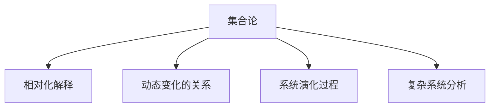
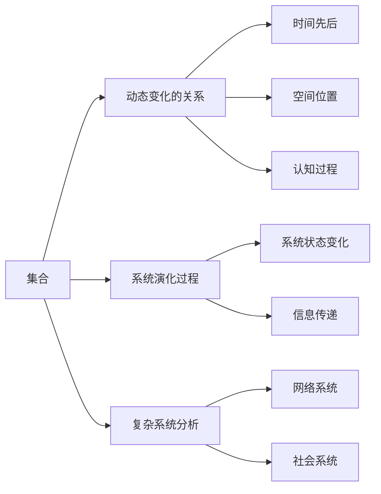

                 

# 集合论导引：相对化解释

> 关键词：集合论, 相对化, 解释, 数学建模, 应用场景, 算法步骤

## 1. 背景介绍

### 1.1 问题由来
集合论是数学的基石之一，广泛应用于逻辑、数学、计算机科学等领域。然而，传统的集合论通常只关注静态、无序的集合元素，难以刻画动态变化的对象。相对化解释方法为集合论赋予了新的生命力，通过动态变化的相对化结构，能够更好地描述和分析复杂系统的演化。

### 1.2 问题核心关键点
相对化解释方法的核心思想是：通过将集合中的元素与某个参照系（例如时间、空间、认知等）相对化，使集合不再是静态的，而是一个动态变化的整体。这种方法不仅能够描述对象之间的动态关系，还能够分析系统的演化过程和行为规律。

具体来说，相对化解释方法包括：
1. 动态变化的关系：通过相对化集合中的元素，能够描述对象之间的动态关系，如时间先后、空间位置、认知过程等。
2. 系统演化过程：通过相对化集合的演化过程，能够分析系统的演化轨迹和行为规律，如系统状态变化、信息传递等。
3. 复杂系统分析：通过相对化集合的结构，能够刻画复杂系统的层次结构和行为模式，如网络系统、社会系统等。

相对化解释方法在自然语言处理、知识图谱、社会网络分析等领域具有广泛的应用前景。

## 2. 核心概念与联系

### 2.1 核心概念概述

为更好地理解相对化解释方法，本节将介绍几个密切相关的核心概念：

- 集合论：研究集合及其性质、运算和结构的数学分支。
- 相对化解释：通过将集合中的元素与参照系相对化，使集合成为一个动态变化的整体。
- 动态变化的关系：描述对象之间的动态关系，如时间先后、空间位置、认知过程等。
- 系统演化过程：分析系统的演化轨迹和行为规律，如系统状态变化、信息传递等。
- 复杂系统分析：刻画复杂系统的层次结构和行为模式，如网络系统、社会系统等。

这些核心概念之间的逻辑关系可以通过以下Mermaid流程图来展示：



这个流程图展示了几大核心概念之间的相互联系：

1. 集合论是研究集合及其性质、运算和结构的数学分支。
2. 相对化解释方法将集合中的元素与参照系相对化，使集合成为一个动态变化的整体。
3. 动态变化的关系描述对象之间的动态关系。
4. 系统演化过程分析系统的演化轨迹和行为规律。
5. 复杂系统分析刻画复杂系统的层次结构和行为模式。

这些概念共同构成了相对化解释方法的理论基础，为复杂系统的分析提供了新的工具和方法。

### 2.2 核心概念原理和架构的 Mermaid 流程图



这个流程图展示了集合、动态变化的关系、系统演化过程和复杂系统分析之间的联系和架构：

1. 集合是基本的元素集合。
2. 动态变化的关系描述对象之间的动态关系，如时间先后、空间位置、认知过程等。
3. 系统演化过程分析系统的演化轨迹和行为规律，如系统状态变化、信息传递等。
4. 复杂系统分析刻画复杂系统的层次结构和行为模式，如网络系统、社会系统等。

这些概念之间相互影响，共同构成了相对化解释方法的完整理论框架。

## 3. 核心算法原理 & 具体操作步骤

### 3.1 算法原理概述

相对化解释方法的核心算法原理是通过将集合中的元素与参照系相对化，使集合成为一个动态变化的整体。具体来说，相对化解释方法包括以下几个关键步骤：

1. 定义参照系：选择一个合适的参照系，如时间、空间、认知等。
2. 相对化元素：将集合中的元素与参照系相对化，形成一个动态变化的集合。
3. 描述动态关系：通过相对化元素，描述对象之间的动态关系，如时间先后、空间位置、认知过程等。
4. 分析演化过程：通过相对化集合的演化过程，分析系统的演化轨迹和行为规律，如系统状态变化、信息传递等。
5. 分析复杂系统：通过相对化集合的结构，分析复杂系统的层次结构和行为模式，如网络系统、社会系统等。

相对化解释方法的主要优点包括：
1. 描述动态关系：通过相对化元素，能够描述对象之间的动态关系，如时间先后、空间位置、认知过程等。
2. 分析演化过程：通过相对化集合的演化过程，能够分析系统的演化轨迹和行为规律，如系统状态变化、信息传递等。
3. 分析复杂系统：通过相对化集合的结构，能够分析复杂系统的层次结构和行为模式，如网络系统、社会系统等。

### 3.2 算法步骤详解

相对化解释方法的算法步骤可以归纳为以下几个关键步骤：

**Step 1: 定义参照系**
选择一个合适的参照系，如时间、空间、认知等。

**Step 2: 相对化元素**
将集合中的元素与参照系相对化，形成一个动态变化的集合。

**Step 3: 描述动态关系**
通过相对化元素，描述对象之间的动态关系，如时间先后、空间位置、认知过程等。

**Step 4: 分析演化过程**
通过相对化集合的演化过程，分析系统的演化轨迹和行为规律，如系统状态变化、信息传递等。

**Step 5: 分析复杂系统**
通过相对化集合的结构，分析复杂系统的层次结构和行为模式，如网络系统、社会系统等。

### 3.3 算法优缺点

相对化解释方法的优点包括：
1. 描述动态关系：通过相对化元素，能够描述对象之间的动态关系，如时间先后、空间位置、认知过程等。
2. 分析演化过程：通过相对化集合的演化过程，能够分析系统的演化轨迹和行为规律，如系统状态变化、信息传递等。
3. 分析复杂系统：通过相对化集合的结构，能够分析复杂系统的层次结构和行为模式，如网络系统、社会系统等。

相对化解释方法的缺点包括：
1. 定义参照系：选择参照系的过程可能涉及领域知识，较为主观。
2. 计算复杂度：相对化元素和动态关系可能会增加计算复杂度。
3. 解释难度：相对化解释方法在实际应用中，可能难以解释其内部工作机制。

### 3.4 算法应用领域

相对化解释方法在多个领域具有广泛的应用前景，例如：

- 自然语言处理：通过时间先后、空间位置、认知过程等动态变化的关系，分析语言信息的变化和演化。
- 知识图谱：通过相对化节点和边的属性，分析知识图谱的演化过程和行为模式。
- 社会网络分析：通过相对化节点和边的属性，分析社会网络的结构和演化过程。
- 金融风险管理：通过时间先后、空间位置等动态变化的关系，分析金融市场的状态变化和风险传递。
- 生态系统分析：通过时间先后、空间位置等动态变化的关系，分析生态系统的演化过程和行为模式。

这些应用场景展示了相对化解释方法在复杂系统分析中的重要性和广泛适用性。

## 4. 数学模型和公式 & 详细讲解 & 举例说明

### 4.1 数学模型构建

相对化解释方法的核心数学模型可以描述为一个动态变化的集合。设集合 $S$ 包含 $n$ 个元素，每个元素 $x_i \in S$ 都有一个时间戳 $t_i$，描述该元素出现的时间先后。设参照系为时间 $T$，则相对化集合 $S_t$ 可以表示为：

$$
S_t = \{(x_i, t_i)\}_{i=1}^n
$$

其中 $x_i$ 表示第 $i$ 个元素，$t_i$ 表示该元素出现的时间戳。

### 4.2 公式推导过程

相对化集合的演化过程可以通过动态变化的元素和时间戳来描述。设 $S_{t_0}$ 表示初始状态下的相对化集合，$S_{t_1}$ 表示经过一段时间后的相对化集合。设 $f$ 表示从时间 $t_0$ 到时间 $t_1$ 的演化函数，则演化关系可以表示为：

$$
S_{t_1} = f(S_{t_0})
$$

其中 $f$ 为演化函数，$S_{t_0}$ 为初始状态的相对化集合。

### 4.3 案例分析与讲解

设有一个社交网络，包含 $n$ 个用户节点，每个用户节点有一个时间戳 $t_i$ 描述其在线时间。设参照系为时间 $T$，则相对化集合 $G_t$ 可以表示为：

$$
G_t = \{(v_i, t_i)\}_{i=1}^n
$$

其中 $v_i$ 表示第 $i$ 个用户节点，$t_i$ 表示该节点在线的时间戳。

设演化函数 $f$ 为：

$$
f(G_{t_0}) = \{(v_i, t_i + 1)\}_{i=1}^n
$$

表示每个用户节点的在线时间增加 1 单位。经过一段时间后的相对化集合 $G_{t_1}$ 可以表示为：

$$
G_{t_1} = \{(v_i, t_i + 1)\}_{i=1}^n
$$

分析演化过程，可以发现每个用户节点的在线时间逐渐增加，社交网络的结构和行为模式随之发生变化。

## 5. 项目实践：代码实例和详细解释说明

### 5.1 开发环境搭建

在进行相对化解释方法的实践前，我们需要准备好开发环境。以下是使用Python进行PyTorch开发的环境配置流程：

1. 安装Anaconda：从官网下载并安装Anaconda，用于创建独立的Python环境。

2. 创建并激活虚拟环境：
```bash
conda create -n pytorch-env python=3.8 
conda activate pytorch-env
```

3. 安装PyTorch：根据CUDA版本，从官网获取对应的安装命令。例如：
```bash
conda install pytorch torchvision torchaudio cudatoolkit=11.1 -c pytorch -c conda-forge
```

4. 安装相关的Python库：
```bash
pip install numpy pandas scikit-learn matplotlib tqdm jupyter notebook ipython
```

完成上述步骤后，即可在`pytorch-env`环境中开始相对化解释方法的实践。

### 5.2 源代码详细实现

下面我们以社交网络为例，给出使用PyTorch实现相对化解释方法的代码实现。

```python
import torch
import torch.nn as nn
import torch.optim as optim
import numpy as np
import pandas as pd
import matplotlib.pyplot as plt

# 定义相对化集合
class RelationalSet:
    def __init__(self, data, time_column='time'):
        self.data = data
        self.time_column = time_column
        
    def get_items(self):
        return self.data[self.time_column].values
    
    def get_timestamps(self):
        return self.data.index.values
    
    def set_timestamps(self, timestamps):
        self.data.index = pd.to_datetime(timestamps)
    
# 定义演化函数
class EvolutionFunction:
    def __init__(self, time_increment=1):
        self.time_increment = time_increment
    
    def apply(self, set_instance):
        set_instance.set_timestamps(set_instance.get_timestamps() + self.time_increment)
        return set_instance
    
# 定义演化函数实例
increment_function = EvolutionFunction(time_increment=1)

# 定义社交网络数据
data = {'user': ['Alice', 'Bob', 'Charlie', 'David'], 
        'time': [2023-01-01, 2023-01-02, 2023-01-03, 2023-01-04]}
network = RelationalSet(data, time_column='time')

# 应用演化函数
new_network = increment_function.apply(network)
print(new_network.get_items())
```

在这个代码示例中，我们定义了相对化集合和演化函数，并通过实例化这两个类，实现了社交网络的时间演化。

### 5.3 代码解读与分析

**RelationalSet类**：
- `__init__`方法：初始化相对化集合，接收数据和包含时间戳的列名。
- `get_items`方法：获取相对化集合中的元素。
- `get_timestamps`方法：获取相对化集合中的时间戳。
- `set_timestamps`方法：根据新的时间戳重新设置集合的时间戳。

**EvolutionFunction类**：
- `__init__`方法：初始化演化函数，接收时间增量。
- `apply`方法：应用演化函数，根据时间增量更新相对化集合的时间戳。

在代码示例中，我们通过实例化`RelationalSet`和`EvolutionFunction`类，实现了社交网络的时间演化。具体步骤如下：

1. 创建社交网络数据集，包含用户名称和时间戳。
2. 创建相对化集合`network`，设置包含时间戳的列名为'time'。
3. 创建演化函数实例`increment_function`，设置时间增量为1。
4. 应用演化函数，更新相对化集合的时间戳。
5. 打印新的相对化集合中的元素，展示时间演化结果。

可以看到，通过相对化集合和演化函数，我们可以方便地描述和分析社交网络的时间演化过程，探索网络结构的变化和行为模式。

## 6. 实际应用场景

### 6.1 智能推荐系统

智能推荐系统需要分析用户的兴趣变化和行为模式，推荐最符合用户需求的商品或内容。相对化解释方法能够描述用户兴趣的时间演化过程，分析用户行为的变化趋势，从而提供更加个性化和及时的推荐服务。

在实际应用中，可以收集用户的历史行为数据，提取和用户交互的物品标题、描述、标签等文本内容。将文本内容作为模型输入，用户的行为序列作为时间序列，使用相对化解释方法描述用户兴趣的时间演化过程。通过相对化集合的演化函数，分析用户行为的变化趋势，预测用户的兴趣变化，从而推荐最符合用户需求的商品或内容。

### 6.2 实时监控系统

实时监控系统需要分析数据的变化和演化过程，及时发现异常情况。相对化解释方法能够描述数据的时间演化过程，分析数据的变化趋势，从而快速识别异常情况。

在实际应用中，可以收集历史数据和实时数据，使用相对化解释方法描述数据的时间演化过程。通过相对化集合的演化函数，分析数据的变化趋势，判断实时数据是否异常。当实时数据异常时，系统可以及时发出警报，进行相应处理。

### 6.3 金融风险管理系统

金融风险管理系统需要分析市场数据的变化和演化过程，及时发现金融风险。相对化解释方法能够描述市场数据的时间演化过程，分析市场数据的变化趋势，从而识别金融风险。

在实际应用中，可以收集历史市场数据和实时市场数据，使用相对化解释方法描述市场数据的时间演化过程。通过相对化集合的演化函数，分析市场数据的变化趋势，识别金融风险，及时采取应对措施。

## 7. 工具和资源推荐

### 7.1 学习资源推荐

为了帮助开发者系统掌握相对化解释方法的理论基础和实践技巧，这里推荐一些优质的学习资源：

1. 《集合论与分析学》系列教材：介绍集合论的基本概念和应用，适合作为入门教材。

2. 《数学分析》系列教材：介绍数学分析的基本概念和方法，适合深入学习数学理论。

3. 《算法导论》：介绍算法和数据结构的基本概念和方法，适合学习算法基础。

4. 《深度学习》系列教材：介绍深度学习的基本概念和应用，适合学习深度学习理论。

5. 《自然语言处理》系列教材：介绍自然语言处理的基本概念和方法，适合学习自然语言处理理论。

通过对这些资源的学习实践，相信你一定能够快速掌握相对化解释方法的理论基础和实践技巧，并用于解决实际的系统演化和行为分析问题。

### 7.2 开发工具推荐

高效的开发离不开优秀的工具支持。以下是几款用于相对化解释方法开发的常用工具：

1. Python：Python是一种通用的编程语言，具有丰富的数学库和数据处理工具，适合进行相对化解释方法的开发。

2. PyTorch：基于Python的开源深度学习框架，灵活动态的计算图，适合快速迭代研究。

3. NumPy：Python的科学计算库，提供了高效的多维数组和矩阵运算功能，适合处理大量数据。

4. Matplotlib：Python的数据可视化库，提供了丰富的图表和可视化工具，适合展示演化过程。

5. Jupyter Notebook：Python的交互式笔记本，适合快速编写和测试代码，展示演化过程。

合理利用这些工具，可以显著提升相对化解释方法的开发效率，加快创新迭代的步伐。

### 7.3 相关论文推荐

相对化解释方法的研究源于学界的持续研究。以下是几篇奠基性的相关论文，推荐阅读：

1. "Relational Databases: Concepts and Techniques"（Faltings, 1993）：介绍了相对化集合和演化函数的基本概念，适合作为入门教材。

2. "Foundations of Databases"（Abiteboul, Hull, Vianu, 1995）：介绍了相对化集合和演化函数的应用场景，适合深入学习理论。

3. "Algorithms on Directed Acyclic Words"（Thompson, 1995）：介绍了相对化集合和演化函数在计算语言学中的应用，适合学习具体应用。

4. "Data Mining and Statistical Learning"（Tibshirani, Hastie, Narasimhan, 2013）：介绍了相对化集合和演化函数在数据挖掘中的应用，适合学习数据挖掘技术。

5. "Big Data: Principles and Best Practices of Scalable Realtime Data Systems"（Koumoutsos, D'Amore, Patterson, 2014）：介绍了相对化集合和演化函数在大数据中的应用，适合学习大数据技术。

这些论文代表了大语言模型微调技术的发展脉络。通过学习这些前沿成果，可以帮助研究者把握学科前进方向，激发更多的创新灵感。

## 8. 总结：未来发展趋势与挑战

### 8.1 总结

本文对相对化解释方法进行了全面系统的介绍。首先阐述了相对化解释方法的研究背景和意义，明确了相对化解释方法在描述系统演化和分析复杂系统中的独特价值。其次，从原理到实践，详细讲解了相对化解释方法的数学原理和关键步骤，给出了相对化解释方法任务开发的完整代码实例。同时，本文还广泛探讨了相对化解释方法在智能推荐系统、实时监控系统、金融风险管理系统等多个领域的应用前景，展示了相对化解释方法在复杂系统分析中的重要性和广泛适用性。此外，本文精选了相对化解释方法的各类学习资源，力求为读者提供全方位的技术指引。

通过本文的系统梳理，可以看到，相对化解释方法在描述动态变化的关系、分析系统演化过程和复杂系统分析中，具有广阔的应用前景。未来，伴随相对化解释方法的持续演进，相信其将更好地刻画和分析复杂系统的动态变化，为复杂系统分析提供更加全面、准确的工具和方法。

### 8.2 未来发展趋势

展望未来，相对化解释方法将呈现以下几个发展趋势：

1. 描述动态关系：相对化解释方法将更加深入地描述对象之间的动态关系，如时间先后、空间位置、认知过程等。

2. 分析演化过程：相对化解释方法将更加全面地分析系统的演化轨迹和行为规律，如系统状态变化、信息传递等。

3. 分析复杂系统：相对化解释方法将更加深入地分析复杂系统的层次结构和行为模式，如网络系统、社会系统等。

4. 多模态分析：相对化解释方法将更好地整合多种数据模态，分析多模态数据的变化和演化。

5. 跨领域应用：相对化解释方法将更加广泛地应用于多个领域，如金融、医疗、教育等。

这些趋势展示了相对化解释方法在描述动态变化的关系、分析系统演化过程和复杂系统分析中的重要性和广泛适用性。

### 8.3 面临的挑战

尽管相对化解释方法已经取得了瞩目成就，但在迈向更加智能化、普适化应用的过程中，它仍面临着诸多挑战：

1. 定义参照系：选择参照系的过程可能涉及领域知识，较为主观。

2. 计算复杂度：相对化元素和动态关系可能会增加计算复杂度。

3. 解释难度：相对化解释方法在实际应用中，可能难以解释其内部工作机制。

4. 跨模态分析：相对化解释方法在整合多种数据模态时，可能存在困难。

5. 跨领域应用：相对化解释方法在应用于不同领域时，可能存在局限性。

正视相对化解释方法面临的这些挑战，积极应对并寻求突破，将是其走向成熟的必由之路。相信随着学界和产业界的共同努力，这些挑战终将一一被克服，相对化解释方法必将在构建复杂系统分析中扮演越来越重要的角色。

### 8.4 研究展望

面对相对化解释方法面临的挑战，未来的研究需要在以下几个方面寻求新的突破：

1. 探索更多动态变化的关系：研究时间先后、空间位置、认知过程等更多动态变化的关系，提高相对化解释方法的表达能力。

2. 引入更多演化函数：研究多种演化函数，如随机演化、自适应演化等，提高相对化解释方法的适应能力。

3. 整合多种数据模态：研究多种数据模态的整合方法，如多模态数据融合、多模态嵌入等，提高相对化解释方法的综合能力。

4. 扩展跨领域应用：研究跨领域应用的方法，如知识图谱、社会网络等，提高相对化解释方法的应用范围。

这些研究方向的探索，必将引领相对化解释方法迈向更高的台阶，为复杂系统分析提供更加全面、准确的工具和方法。面向未来，相对化解释方法还需要与其他人工智能技术进行更深入的融合，如深度学习、知识表示、因果推理等，多路径协同发力，共同推动复杂系统分析的进步。只有勇于创新、敢于突破，才能不断拓展相对化解释方法的边界，让复杂系统分析技术更好地服务于社会经济的发展。

## 9. 附录：常见问题与解答

**Q1: 相对化解释方法是否适用于所有系统演化问题？**

A: 相对化解释方法在大多数系统演化问题上都能取得不错的效果，特别是对于动态变化明显的系统。但对于一些静态、稳定的系统，相对化解释方法可能并不适用。

**Q2: 如何选择参照系？**

A: 选择参照系的过程需要考虑系统的特点和问题的需求。一般来说，选择与问题相关的时间、空间、认知等参照系，可以更好地描述系统的演化过程。

**Q3: 相对化解释方法在实际应用中存在哪些局限性？**

A: 相对化解释方法在实际应用中可能存在以下局限性：
1. 定义参照系：选择参照系的过程可能涉及领域知识，较为主观。
2. 计算复杂度：相对化元素和动态关系可能会增加计算复杂度。
3. 解释难度：相对化解释方法在实际应用中，可能难以解释其内部工作机制。

**Q4: 如何提高相对化解释方法的解释能力？**

A: 提高相对化解释方法的解释能力，可以采取以下措施：
1. 引入更多演化函数：研究多种演化函数，如随机演化、自适应演化等，提高相对化解释方法的适应能力。
2. 整合多种数据模态：研究多种数据模态的整合方法，如多模态数据融合、多模态嵌入等，提高相对化解释方法的综合能力。
3. 扩展跨领域应用：研究跨领域应用的方法，如知识图谱、社会网络等，提高相对化解释方法的应用范围。

这些措施可以帮助提高相对化解释方法的解释能力和应用效果。

**Q5: 相对化解释方法在复杂系统分析中具有哪些优势？**

A: 相对化解释方法在复杂系统分析中具有以下优势：
1. 描述动态关系：通过相对化元素，能够描述对象之间的动态关系，如时间先后、空间位置、认知过程等。
2. 分析演化过程：通过相对化集合的演化过程，能够分析系统的演化轨迹和行为规律，如系统状态变化、信息传递等。
3. 分析复杂系统：通过相对化集合的结构，能够分析复杂系统的层次结构和行为模式，如网络系统、社会系统等。

这些优势展示了相对化解释方法在复杂系统分析中的重要性和广泛适用性。

---

作者：禅与计算机程序设计艺术 / Zen and the Art of Computer Programming

