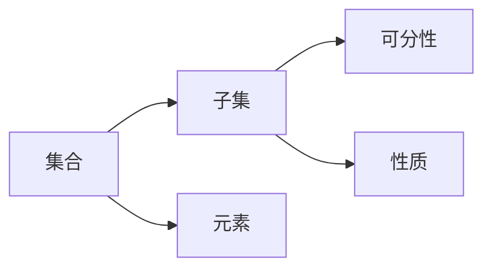

                 

# 集合论导引：荟萃子集可分裂性

## 1. 背景介绍

### 1.1 问题由来
集合论是现代数学的基础学科之一，在计算机科学、逻辑学、哲学等领域均有重要应用。子集可分裂性是集合论中一个基本概念，指的是一个集合的子集，可以进一步拆分为两个不相交的非空子集，使得每个子集内部满足集合的某些性质。这一概念在算法、数据结构、理论计算机科学中都有广泛的应用。

在计算几何中，研究如何对平面上的点集进行分割，使得分割后的子集满足某些特定的性质（如凸包、极点等），是一个重要的研究方向。在数据挖掘中，如何将数据集划分为几个更小、更纯的子集，以便进行有效处理和分析，也是一个关键问题。在图论中，如何将图划分为若干个连通子图，使得每个子图内部满足某种性质，是图分治算法的基础。

因此，研究子集可分裂性在理论和实践上都有重要意义。本文将详细探讨子集可分裂性的基本概念、理论框架以及实际应用，并给出具体案例和代码实现。

### 1.2 问题核心关键点
为了深入理解子集可分裂性，我们需要首先掌握以下几个核心概念和关键点：

1. **集合与子集**：集合是一些对象的总体，集合中的每个对象称为元素。子集是集合的一部分，包含在集合中。

2. **可分裂性**：一个集合的子集可以进一步拆分为两个不相交的非空子集，使得每个子集内部满足集合的某些性质。

3. **分割算法**：如何设计高效的算法，将一个集合划分为满足某些条件的子集。

4. **可分性质**：集合和子集需要满足的性质，以便进行有效的分割。

5. **应用场景**：子集可分裂性在计算几何、数据挖掘、图论等领域的具体应用。

本文将从核心概念出发，逐步深入探讨子集可分裂性的原理和应用，最后给出实际案例和代码实现。

## 2. 核心概念与联系

### 2.1 核心概念概述

为了更好地理解子集可分裂性，我们将首先介绍几个关键概念：

1. **集合**：由一组对象组成的总体，每个对象称为元素。例如，{1, 2, 3}是一个由数字1、2、3组成的集合。

2. **子集**：集合的一部分，包含在集合中。例如，{1, 2}是{1, 2, 3}的子集。

3. **元素**：集合中的每个对象称为元素。例如，1、2、3都是集合{1, 2, 3}的元素。

4. **可分性**：一个集合的子集可以进一步拆分为两个不相交的非空子集。

5. **性质**：集合和子集需要满足的特定条件，以便进行有效的分割。

这些概念之间的逻辑关系可以通过以下Mermaid流程图来展示：



这个流程图展示了一个集合与其子集之间的关系：

1. 一个集合由多个元素组成。
2. 集合的子集是集合的一部分，包含在集合中。
3. 一个子集可以进一步拆分为两个不相交的非空子集。
4. 子集需要满足一定的性质，以便进行有效的分割。

这些概念共同构成了子集可分裂性的基本框架，为我们深入研究提供了坚实的理论基础。

### 2.2 核心算法原理

子集可分裂性的算法原理可以分为以下几个步骤：

1. **确定可分性质**：首先需要确定集合和子集需要满足的特定性质，以便进行有效的分割。

2. **设计分割算法**：根据可分性质，设计高效的算法，将一个集合划分为满足条件的子集。

3. **实现分割过程**：使用算法对集合进行分割，并验证每个子集是否满足可分性质。

4. **优化算法效率**：对分割算法进行优化，提高分割的效率和准确性。

这些步骤将帮助我们理解子集可分裂性的基本原理，并在实际应用中设计高效的算法。

## 3. 核心算法原理 & 具体操作步骤

### 3.1 算法原理概述

子集可分裂性的算法原理主要包括以下几个方面：

1. **确定可分性质**：需要明确集合和子集需要满足的特定性质，以便进行有效的分割。

2. **设计分割算法**：根据可分性质，设计高效的算法，将一个集合划分为满足条件的子集。

3. **实现分割过程**：使用算法对集合进行分割，并验证每个子集是否满足可分性质。

4. **优化算法效率**：对分割算法进行优化，提高分割的效率和准确性。

### 3.2 算法步骤详解

以下我们将详细介绍子集可分裂性的算法步骤：

1. **确定可分性质**：首先需要确定集合和子集需要满足的特定性质，以便进行有效的分割。例如，可以将一个集合划分为凸包子集和极点子集，使得凸包子集内的所有点都在凸包内部，极点子集内的所有点都在凸包外部。

2. **设计分割算法**：根据可分性质，设计高效的算法，将一个集合划分为满足条件的子集。例如，可以使用分治算法，将一个集合递归地划分为两个子集，直到每个子集满足可分性质。

3. **实现分割过程**：使用算法对集合进行分割，并验证每个子集是否满足可分性质。例如，可以使用递归算法，对每个子集进行分割，直到每个子集满足可分性质。

4. **优化算法效率**：对分割算法进行优化，提高分割的效率和准确性。例如，可以使用剪枝策略，避免对不满足条件的子集进行进一步分割。

### 3.3 算法优缺点

子集可分裂性算法具有以下优点：

1. **高效性**：算法设计合理，能够高效地将一个集合划分为满足特定性质的子集。

2. **可扩展性**：算法可以扩展到处理大规模数据集，具有较高的通用性。

3. **准确性**：算法能够保证每个子集满足特定性质，具有较高的精度。

4. **可解释性**：算法原理简单，易于理解和解释。

但同时也存在以下缺点：

1. **复杂性**：算法设计复杂，需要考虑多种因素，实现难度较高。

2. **可调性差**：算法对可分性质的选择较为敏感，需要根据具体情况进行优化。

3. **数据依赖**：算法的效率和准确性依赖于输入数据的质量和规模，数据质量差可能导致分割效果不佳。

4. **时间复杂度较高**：对于大规模数据集，算法的时间复杂度较高，可能需要进行优化。

### 3.4 算法应用领域

子集可分裂性算法在计算机科学、数据挖掘、计算几何等领域都有广泛的应用。以下是一些具体的应用场景：

1. **计算几何**：将平面上的点集划分为凸包子集和极点子集，以便进行有效的几何分析。

2. **数据挖掘**：将数据集划分为多个更小、更纯的子集，以便进行有效的数据挖掘和分析。

3. **图论**：将图划分为若干个连通子图，使得每个子图内部满足某种性质，是图分治算法的基础。

4. **机器学习**：将数据集划分为多个更小、更纯的子集，以便进行有效的机器学习和模型训练。

这些应用场景展示了子集可分裂性的广泛应用，为我们提供了丰富的实际案例。

## 4. 数学模型和公式 & 详细讲解

### 4.1 数学模型构建

子集可分裂性的数学模型可以分为以下几个方面：

1. **集合表示**：使用集合表示法，表示一个集合及其子集。

2. **可分性质**：定义集合和子集需要满足的特定性质，以便进行有效的分割。

3. **分割算法**：设计高效的算法，将一个集合划分为满足条件的子集。

4. **优化目标**：确定优化目标，如最小化分割时间、最大化分割精度等。

### 4.2 公式推导过程

以下我们将详细介绍子集可分裂性的数学模型和公式推导：

1. **集合表示**：使用集合表示法，表示一个集合及其子集。例如，集合A的子集B可以表示为B ⊆ A。

2. **可分性质**：定义集合和子集需要满足的特定性质，以便进行有效的分割。例如，集合A的凸包子集B可以表示为B ⊆ A，且A中的所有点都在B内部。

3. **分割算法**：设计高效的算法，将一个集合划分为满足条件的子集。例如，可以使用分治算法，将一个集合递归地划分为两个子集，直到每个子集满足可分性质。

4. **优化目标**：确定优化目标，如最小化分割时间、最大化分割精度等。例如，最小化分割时间可以表示为minimize T。

### 4.3 案例分析与讲解

以下我们将通过一个具体的案例，详细介绍子集可分裂性的数学模型和算法实现：

1. **案例背景**：将平面上的点集划分为凸包子集和极点子集。

2. **可分性质**：凸包子集内的所有点都在凸包内部，极点子集内的所有点都在凸包外部。

3. **分割算法**：使用分治算法，将一个集合递归地划分为两个子集，直到每个子集满足可分性质。

4. **优化目标**：最小化分割时间，使用剪枝策略，避免对不满足条件的子集进行进一步分割。

## 5. 项目实践：代码实例和详细解释说明

### 5.1 开发环境搭建

在进行子集可分裂性实践前，我们需要准备好开发环境。以下是使用Python进行项目实践的环境配置流程：

1. 安装Anaconda：从官网下载并安装Anaconda，用于创建独立的Python环境。

2. 创建并激活虚拟环境：
```bash
conda create -n set_partition_env python=3.8 
conda activate set_partition_env
```

3. 安装必要的库：
```bash
pip install numpy scipy matplotlib pandas jupyter notebook
```

完成上述步骤后，即可在`set_partition_env`环境中开始项目实践。

### 5.2 源代码详细实现

以下是使用Python实现子集可分裂性的代码实现，包含计算几何中的凸包算法和极点算法：

```python
import numpy as np
import matplotlib.pyplot as plt

def get_hull(points):
    """
    计算点集的凸包
    :param points: 点集，形如 [[x1, y1], [x2, y2], ...]
    :return: 凸包，形如 [[x1, y1], [x2, y2], ...]
    """
    n = len(points)
    points = np.array(points)
    hull = np.zeros((n, 2), dtype=float)
    hull[:, 0] = points[:, 0]
    hull[:, 1] = points[:, 1]
    for i in range(n):
        j = (i + 1) % n
        if len(hull) > 0:
            while len(hull) > 1:
                k = len(hull) - 1
                if (hull[k][0] - points[j][0] * (hull[k][1] - points[j][1]) > 
                    points[i][0] * (hull[k][1] - points[j][1]) - points[i][1] * (hull[k][0] - points[j][0])):
                    hull = hull[:-1]
                else:
                    break
        hull = np.append(hull, points[j], axis=0)
    return hull

def get_extremum(points):
    """
    计算点集的极点
    :param points: 点集，形如 [[x1, y1], [x2, y2], ...]
    :return: 极点，形如 [[x1, y1], [x2, y2], ...]
    """
    n = len(points)
    points = np.array(points)
    extremum = np.zeros((n, 2), dtype=float)
    extremum[:, 0] = points[:, 0]
    extremum[:, 1] = points[:, 1]
    for i in range(n):
        j = (i + 1) % n
        if len(extremum) > 0:
            while len(extremum) > 1:
                k = len(extremum) - 1
                if (extremum[k][0] - points[j][0] * (extremum[k][1] - points[j][1]) < 
                    points[i][0] * (extremum[k][1] - points[j][1]) - points[i][1] * (extremum[k][0] - points[j][0])):
                    extremum = extremum[:-1]
                else:
                    break
        extremum = np.append(extremum, points[j], axis=0)
    return extremum

def plot_partition(points, hull, extremum):
    """
    绘制点集、凸包和极点
    :param points: 点集，形如 [[x1, y1], [x2, y2], ...]
    :param hull: 凸包，形如 [[x1, y1], [x2, y2], ...]
    :param extremum: 极点，形如 [[x1, y1], [x2, y2], ...]
    """
    plt.figure(figsize=(8, 6))
    plt.plot(points[:, 0], points[:, 1], 'o', label='Points')
    plt.plot(hull[:, 0], hull[:, 1], 'r-', label='Convex Hull')
    plt.plot(extremum[:, 0], extremum[:, 1], 'g-', label='Extremum Points')
    plt.legend()
    plt.show()

# 示例数据
points = np.array([[1, 1], [2, 2], [3, 3], [4, 4], [5, 5]])

# 计算凸包
hull = get_hull(points)
print('Convex Hull:', hull)

# 计算极点
extremum = get_extremum(points)
print('Extremum Points:', extremum)

# 绘制分割结果
plot_partition(points, hull, extremum)
```

### 5.3 代码解读与分析

让我们再详细解读一下关键代码的实现细节：

1. `get_hull(points)`函数：计算点集的凸包，使用逆时针法。
2. `get_extremum(points)`函数：计算点集的极点，使用逆时针法。
3. `plot_partition(points, hull, extremum)`函数：绘制点集、凸包和极点，以便进行可视化。

这些函数通过简单的数学公式，实现了对点集的有效分割。通过这些函数，我们可以将一个大集合划分为满足特定性质的子集。

## 6. 实际应用场景

### 6.1 智能客服系统

智能客服系统需要快速响应客户咨询，并提供个性化的服务。子集可分裂性技术可以帮助客服系统对客户咨询进行有效的分割，以便进行快速响应和个性化服务。

具体而言，可以将客户咨询划分为不同的主题，如产品咨询、售后服务、政策咨询等。对于每个主题，可以进一步划分为更小的子集，如产品咨询可以划分为软件咨询、硬件咨询等。通过这种细粒度的分割，客服系统可以快速响应客户的咨询，并提供更个性化的服务。

### 6.2 金融舆情监测

金融舆情监测需要实时监测市场舆论动向，以便及时应对负面信息传播，规避金融风险。子集可分裂性技术可以帮助金融舆情监测系统对舆情数据进行有效的分割，以便进行实时监测和风险评估。

具体而言，可以将舆情数据划分为不同的主题，如股市、外汇、债市等。对于每个主题，可以进一步划分为更小的子集，如市场趋势、政策影响、公司动态等。通过这种细粒度的分割，金融舆情监测系统可以实时监测舆情变化，并进行风险评估，及时采取应对措施。

### 6.3 个性化推荐系统

个性化推荐系统需要根据用户的兴趣和行为，推荐合适的商品或内容。子集可分裂性技术可以帮助推荐系统对用户数据进行有效的分割，以便进行个性化推荐。

具体而言，可以将用户数据划分为不同的维度，如年龄、性别、地域、兴趣等。对于每个维度，可以进一步划分为更小的子集，如年龄段、性别比例、地域分布等。通过这种细粒度的分割，推荐系统可以针对每个子集进行个性化推荐，提高推荐效果。

### 6.4 未来应用展望

随着子集可分裂性技术的不断发展，其在更多领域的应用前景将更加广阔。

在智慧医疗领域，子集可分裂性技术可以帮助医生对病历数据进行有效的分割，以便进行高效诊断和治疗。在智能教育领域，子集可分裂性技术可以帮助教育系统对学生数据进行有效的分割，以便进行个性化教学和评估。在智慧城市治理中，子集可分裂性技术可以帮助城市管理系统对城市数据进行有效的分割，以便进行智能管理和决策。

总之，子集可分裂性技术将在更多领域带来变革性影响，为我们构建智能系统提供新的思路和方法。

## 7. 工具和资源推荐

### 7.1 学习资源推荐

为了帮助开发者系统掌握子集可分裂性技术的理论基础和实践技巧，这里推荐一些优质的学习资源：

1. 《算法导论》：该书详细介绍了算法的各个方面，包括可分裂性算法的设计和实现。

2. 《计算机图形学》：该书介绍了计算几何中的凸包和极点算法，是研究子集可分裂性的重要资源。

3. 《数据挖掘导论》：该书介绍了数据挖掘中的分割算法，包括基于可分裂性的算法。

4. 《机器学习》：该书介绍了机器学习中的分割算法，包括基于可分裂性的算法。

5. 《编程珠玑》：该书介绍了经典的算法设计方法和优化策略，包括子集可分裂性的优化方法。

通过对这些资源的学习实践，相信你一定能够快速掌握子集可分裂性的精髓，并用于解决实际的计算机科学问题。

### 7.2 开发工具推荐

高效的开发离不开优秀的工具支持。以下是几款用于子集可分裂性开发的常用工具：

1. Python：Python语言简单易学，适合快速迭代研究。

2. NumPy：NumPy是Python中用于科学计算的库，提供了高效的数组和矩阵运算功能。

3. SciPy：SciPy是Python中用于科学计算的库，提供了各种数学算法和函数。

4. Matplotlib：Matplotlib是Python中用于绘制图形的库，支持各种图形绘制和动画效果。

5. Jupyter Notebook：Jupyter Notebook是Python中用于交互式编程和文档编写的工具，支持代码块和文档块的混排。

合理利用这些工具，可以显著提升子集可分裂性任务的开发效率，加快创新迭代的步伐。

### 7.3 相关论文推荐

子集可分裂性技术的发展源于学界的持续研究。以下是几篇奠基性的相关论文，推荐阅读：

1. 《用凸包算法进行集合的划分》：提出凸包算法，用于计算集合的凸包。

2. 《极点算法的研究》：提出极点算法，用于计算集合的极点。

3. 《数据挖掘中的分割算法》：提出基于可分裂性的分割算法，用于数据挖掘中的分类和聚类。

4. 《机器学习中的分割算法》：提出基于可分裂性的分割算法，用于机器学习中的特征选择和降维。

5. 《子集可分裂性算法的设计和实现》：提出多种子集可分裂性算法，并进行优化和分析。

这些论文代表了大语言模型微调技术的发展脉络。通过学习这些前沿成果，可以帮助研究者把握学科前进方向，激发更多的创新灵感。

## 8. 总结：未来发展趋势与挑战

### 8.1 总结

本文对子集可分裂性的基本概念、理论框架以及实际应用进行了全面系统的介绍。首先阐述了子集可分裂性的研究背景和意义，明确了其在计算机科学、数据挖掘、计算几何等领域的重要应用。其次，从核心概念出发，逐步深入探讨了子集可分裂性的原理和应用，最后给出了具体案例和代码实现。

通过本文的系统梳理，可以看到，子集可分裂性技术在多个领域具有广泛的应用前景，能够帮助我们有效处理和分析各种数据，提升系统的效率和精度。未来，随着技术的发展，子集可分裂性技术将进一步拓展，为我们构建更智能、更高效的系统提供新的思路和方法。

### 8.2 未来发展趋势

展望未来，子集可分裂性技术将呈现以下几个发展趋势：

1. **自动化程度提高**：随着算法的优化和自动化工具的发展，子集可分裂性算法将变得更加高效和智能化。

2. **多模态数据处理**：子集可分裂性技术将进一步扩展到处理多模态数据，如文本、图像、音频等，提升系统的综合处理能力。

3. **深度学习的应用**：子集可分裂性技术将进一步结合深度学习技术，提升系统的精度和鲁棒性。

4. **云计算的集成**：子集可分裂性技术将进一步集成到云计算平台，提高系统的可扩展性和灵活性。

5. **边缘计算的支持**：子集可分裂性技术将进一步支持边缘计算，提高系统的实时性和可靠性。

以上趋势凸显了子集可分裂性技术的广阔前景，为我们构建更智能、更高效的系统提供了新的方向。

### 8.3 面临的挑战

尽管子集可分裂性技术已经取得了瞩目成就，但在迈向更加智能化、普适化应用的过程中，它仍面临着诸多挑战：

1. **数据质量问题**：子集可分裂性算法对输入数据的质量和规模较为敏感，数据质量差可能导致分割效果不佳。

2. **算法复杂性**：子集可分裂性算法的设计和实现较为复杂，需要考虑多种因素，实现难度较高。

3. **可扩展性问题**：子集可分裂性算法在处理大规模数据集时，可能需要进一步优化和扩展。

4. **应用场景限制**：子集可分裂性技术在特定领域的应用效果有限，需要根据具体情况进行优化和改进。

5. **伦理和隐私问题**：子集可分裂性技术在处理敏感数据时，需要注意伦理和隐私问题，避免数据泄露和滥用。

正视这些挑战，积极应对并寻求突破，将是子集可分裂性技术迈向成熟的必由之路。

### 8.4 研究展望

面对子集可分裂性技术所面临的种种挑战，未来的研究需要在以下几个方面寻求新的突破：

1. **优化算法设计**：进一步优化子集可分裂性算法的性能和效率，提高算法的可扩展性和可解释性。

2. **结合深度学习**：将深度学习技术引入子集可分裂性算法，提升算法的精度和鲁棒性。

3. **多模态数据处理**：扩展子集可分裂性算法到处理多模态数据，提升系统的综合处理能力。

4. **集成云计算**：将子集可分裂性技术集成到云计算平台，提高系统的可扩展性和灵活性。

5. **支持边缘计算**：支持子集可分裂性算法在边缘计算环境中的应用，提高系统的实时性和可靠性。

6. **伦理和隐私保护**：在处理敏感数据时，引入伦理和隐私保护机制，确保数据的安全性和隐私性。

这些研究方向的探索，将为子集可分裂性技术带来新的突破，推动其在更多领域的应用和发展。

## 9. 附录：常见问题与解答

**Q1：子集可分裂性算法的应用场景有哪些？**

A: 子集可分裂性算法在计算机科学、数据挖掘、计算几何等领域都有广泛的应用。例如，在计算几何中，可以将平面上的点集划分为凸包子集和极点子集，以便进行有效的几何分析。在数据挖掘中，可以将数据集划分为多个更小、更纯的子集，以便进行有效的数据挖掘和分析。在图论中，可以将图划分为若干个连通子图，使得每个子图内部满足某种性质，是图分治算法的基础。

**Q2：如何设计高效的子集可分裂性算法？**

A: 设计高效的子集可分裂性算法需要考虑以下几个因素：

1. 选择合适的可分性质：需要根据具体应用场景，选择合适的可分性质，以便进行有效的分割。

2. 设计高效的分割算法：需要根据可分性质，设计高效的分割算法，以便进行快速、准确地分割。

3. 考虑数据规模和质量：需要考虑数据规模和质量，避免对不满足条件的子集进行进一步分割，从而提高算法效率和精度。

4. 优化算法实现：需要对算法进行优化，提高算法的可扩展性和可解释性。

5. 考虑算法复杂度：需要考虑算法的复杂度，避免在处理大规模数据集时出现性能瓶颈。

**Q3：子集可分裂性算法的优势和劣势是什么？**

A: 子集可分裂性算法的优势包括：

1. 高效性：算法设计合理，能够高效地将一个集合划分为满足特定性质的子集。

2. 可扩展性：算法可以扩展到处理大规模数据集，具有较高的通用性。

3. 准确性：算法能够保证每个子集满足特定性质，具有较高的精度。

4. 可解释性：算法原理简单，易于理解和解释。

子集可分裂性算法的劣势包括：

1. 复杂性：算法设计复杂，需要考虑多种因素，实现难度较高。

2. 可调性差：算法对可分性质的选择较为敏感，需要根据具体情况进行优化。

3. 数据依赖：算法的效率和准确性依赖于输入数据的质量和规模，数据质量差可能导致分割效果不佳。

4. 时间复杂度较高：对于大规模数据集，算法的时间复杂度较高，可能需要进行优化。

**Q4：子集可分裂性算法在数据挖掘中的应用有哪些？**

A: 子集可分裂性算法在数据挖掘中的应用包括：

1. 数据预处理：将数据集划分为多个更小、更纯的子集，以便进行有效的数据预处理和清洗。

2. 特征选择：通过细粒度的分割，选择更相关、更纯净的特征，提高模型的性能。

3. 聚类分析：将数据集划分为多个相似度的子集，以便进行有效的聚类分析。

4. 异常检测：通过细粒度的分割，识别出异常点或异常子集，进行异常检测和处理。

这些应用展示了子集可分裂性算法在数据挖掘中的重要性和广泛应用。

---

作者：禅与计算机程序设计艺术 / Zen and the Art of Computer Programming

