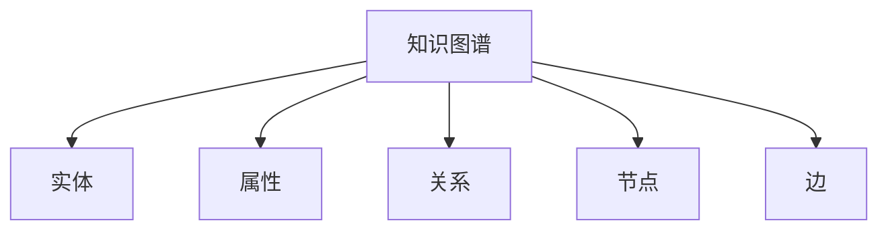

                 

## 1. 背景介绍

### 1.1 问题由来

人类知识体系的发展，很大程度上依赖于知识的积累与传承。从远古的口耳相传，到文字记录的编纂，再到数字化的海量存储，知识的形态和传递方式都在不断地进化。但无论是知识的积累还是传承，本质上都是人类对世界认知的不断深入和优化。在这其中，**顿悟**（Insight）和**类比**（Analogy）扮演了至关重要的角色，它们是人类思维和创新不可或缺的两大基石。

在人工智能领域，特别是深度学习领域，知识的积累主要通过大规模数据驱动的训练实现，而知识的传承则依赖于模型的迁移学习。**顿悟**和**类比**则体现在人类对模型的理解与应用上，通过更深入的洞察和更广泛的联想，使模型在面对新问题时能够迅速适应和产生创新。

本文旨在深入探讨顿悟与类比在人工智能知识体系构建中的作用，以及如何通过构建知识图谱（Knowledge Graph）将这两者融合，从而实现更高效、更灵活的知识传播和应用。

### 1.2 问题核心关键点

顿悟与类比的知识桥接作用，主要体现在以下几个方面：

1. **知识提取**：通过提取大量数据中的关键信息，形成具有抽象性和概括性的知识框架。
2. **知识泛化**：将提取出的知识应用于新情境，提升模型在新领域的泛化能力。
3. **知识迁移**：将不同领域或任务间的知识进行跨界迁移，增强模型的迁移学习能力。
4. **知识创新**：通过知识类比，形成新的模型和算法，推动人工智能技术的创新。

这些问题核心关键点，将指导我们深入探讨顿悟与类比在知识图谱中的应用，以及如何构建高效的知识桥梁，加速人工智能的发展。

## 2. 核心概念与联系

### 2.1 核心概念概述

为更好地理解顿悟与类比在知识图谱中的应用，本节将介绍几个密切相关的核心概念：

- **知识图谱**（Knowledge Graph, KG）：由节点和边组成的图结构，用于表示实体、属性和关系等概念，是人工智能领域中的重要知识表示形式。
- **实体**（Entity）：指知识图谱中的核心概念，如人、地点、组织等。
- **属性**（Attribute）：描述实体的特征或属性，如身高、年龄、职业等。
- **关系**（Relation）：实体之间的关系，如“父母”、“工作于”等。
- **节点**（Node）：表示实体或属性，是知识图谱中的基本组成单元。
- **边**（Edge）：表示实体之间的关系，连接节点。

这些核心概念之间的逻辑关系可以通过以下Mermaid流程图来展示：



这个流程图展示的知识图谱核心概念及其之间的关系：

1. 知识图谱由实体、属性、关系、节点、边等基本元素构成。
2. 实体和属性通过节点表示，关系通过边连接节点。
3. 实体、属性和关系构成了知识图谱的基本知识框架。
4. 节点和边是知识图谱的逻辑结构。

这些核心概念共同构成了知识图谱的知识表示形式，为顿悟与类比的应用提供了基础。

## 3. 核心算法原理 & 具体操作步骤

### 3.1 算法原理概述

顿悟与类比的知识桥接作用，主要体现在以下几个算法原理：

1. **知识提取**：通过图卷积网络（Graph Convolutional Network, GCN）等算法，对知识图谱中的节点进行特征提取，形成知识的抽象表示。
2. **知识泛化**：通过图神经网络（Graph Neural Network, GNN）等算法，对提取出的知识进行泛化，应用于新情境。
3. **知识迁移**：通过跨领域迁移学习，将不同领域或任务间的知识进行迁移，增强模型的迁移学习能力。
4. **知识创新**：通过知识类比，形成新的模型和算法，推动人工智能技术的创新。

这些算法原理将指导我们深入探讨顿悟与类比在知识图谱中的应用，以及如何构建高效的知识桥梁，加速人工智能的发展。

### 3.2 算法步骤详解

以下是顿悟与类比在知识图谱中的具体算法步骤：

**Step 1: 数据预处理与知识图谱构建**

1. 收集领域相关数据，包括文本、图像、结构化数据等，构建知识图谱。
2. 对数据进行清洗和预处理，去除噪声和冗余数据。
3. 将数据转换为知识图谱的三元组形式，即（实体，关系，实体）。

**Step 2: 知识图谱嵌入**

1. 选择合适的知识图谱嵌入算法，如TransE、RotatE等，将知识图谱中的实体和关系嵌入到低维向量空间。
2. 使用负采样等技术优化模型训练，提高嵌入质量。
3. 评估嵌入效果，通过评价指标如Mean Rank、Hits@1等进行对比分析。

**Step 3: 知识图谱推理**

1. 基于推理算法，如逻辑推理、概率推理等，对知识图谱进行推理，获取新的知识。
2. 使用推理机制，如Top-K推理、Top-N推理等，将推理结果可视化，便于理解和应用。
3. 对推理结果进行评估，通过精度、召回率等指标衡量推理效果。

**Step 4: 知识图谱应用**

1. 将推理结果与实际问题结合，应用于推荐系统、信息检索、智能问答等领域。
2. 使用模型微调等技术，对知识图谱进行进一步优化，提升应用效果。
3. 持续收集新数据，更新知识图谱，保持知识的时效性和准确性。

### 3.3 算法优缺点

顿悟与类比的知识桥接作用具有以下优点：

1. **高效性**：通过知识图谱嵌入和推理，能够快速提取和泛化知识，提升模型在新领域的适应能力。
2. **灵活性**：知识图谱能够灵活表示各种类型的知识，支持跨领域、跨任务的知识迁移。
3. **可解释性**：知识图谱中的节点和关系具有直观的语义含义，便于理解和解释模型推理过程。
4. **创新性**：通过知识类比，能够激发新的模型和算法设计，推动技术创新。

同时，该方法也存在一些局限性：

1. **数据依赖性强**：知识图谱的构建需要大量的标注数据，数据获取和标注成本较高。
2. **知识图谱稀疏性**：知识图谱中实体和关系的不完备性可能导致推理结果的准确性降低。
3. **计算复杂度高**：知识图谱嵌入和推理算法复杂，计算资源消耗较大。
4. **知识泛化能力有限**：知识图谱嵌入和推理依赖于已有的知识和经验，难以应对全新情境。

尽管存在这些局限性，但就目前而言，顿悟与类比的知识桥接作用仍是大规模知识管理的重要手段。未来相关研究的重点在于如何进一步降低知识图谱的构建成本，提高其稠密性和泛化能力，同时兼顾可解释性和创新性等因素。

### 3.4 算法应用领域

顿悟与类比的知识桥接作用在多个领域都有广泛的应用，例如：

- **推荐系统**：通过知识图谱嵌入和推理，为用户推荐个性化商品或服务。
- **智能问答**：基于知识图谱进行实体关系查询和推理，回答用户问题。
- **信息检索**：通过知识图谱嵌入和推理，提高信息检索的精准度和相关性。
- **医疗诊断**：通过知识图谱嵌入和推理，辅助医生进行疾病诊断和治疗方案推荐。
- **金融风控**：通过知识图谱嵌入和推理，评估金融风险，预测市场趋势。
- **智能客服**：基于知识图谱进行自然语言处理和推理，提升客服系统的智能水平。

除了上述这些经典应用外，知识图谱还被创新性地应用于更多场景中，如智能合约、交通规划、智慧城市等，为各行各业提供了新的技术解决方案。

## 4. 数学模型和公式 & 详细讲解 & 举例说明

### 4.1 数学模型构建

知识图谱嵌入和推理的数学模型，主要包括以下几个部分：

- **知识图谱表示**：知识图谱由节点和边组成，用三元组（实体，关系，实体）表示。
- **知识图谱嵌入**：将节点和关系嵌入到低维向量空间中，形成知识图谱的向量表示。
- **知识图谱推理**：基于知识图谱嵌入的结果，进行逻辑推理或概率推理，获取新的知识。

### 4.2 公式推导过程

以TransE算法为例，知识图谱嵌入的数学公式如下：

$$
\min_{\theta} \sum_{(x,y,z)\in \mathcal{E}} \mathcal{L}_{\text{loss}}(\mathbf{e}_x, \mathbf{r}, \mathbf{e}_z; \theta)
$$

其中 $\mathcal{E}$ 为知识图谱中的所有三元组，$\mathbf{e}_x, \mathbf{e}_z$ 分别为实体 $x$ 和 $z$ 的向量表示，$\mathbf{r}$ 为关系 $r$ 的向量表示，$\theta$ 为模型的可训练参数。

目标函数 $\mathcal{L}_{\text{loss}}$ 可以是损失函数，如均方误差、交叉熵等。

对于知识图谱推理，可以使用逻辑推理或概率推理算法，如Top-K推理、Top-N推理等，具体公式推导可以参考相关文献。

### 4.3 案例分析与讲解

以下以智能推荐系统为例，说明知识图谱嵌入和推理的应用：

1. **知识图谱构建**：收集用户行为数据、商品信息等，构建知识图谱，如用户与商品的关系图。
2. **知识图谱嵌入**：使用TransE等算法，将用户、商品、关系等节点嵌入到低维向量空间中。
3. **知识图谱推理**：通过逻辑推理或概率推理，预测用户对商品的兴趣，进行推荐。
4. **知识图谱应用**：结合用户偏好、商品属性等特征，生成推荐结果，提升推荐系统效果。

## 5. 项目实践：代码实例和详细解释说明

### 5.1 开发环境搭建

在进行知识图谱项目实践前，我们需要准备好开发环境。以下是使用Python进行知识图谱开发的常见环境配置流程：

1. 安装Anaconda：从官网下载并安装Anaconda，用于创建独立的Python环境。

2. 创建并激活虚拟环境：
```bash
conda create -n kg-env python=3.8 
conda activate kg-env
```

3. 安装相关库：
```bash
pip install pykg2vec rdkit pydot
```

4. 安装图形界面库：
```bash
pip install matplotlib networkx
```

完成上述步骤后，即可在`kg-env`环境中开始知识图谱的实践。

### 5.2 源代码详细实现

以下是使用Python实现知识图谱嵌入和推理的代码示例：

```python
from pykg2vec import Embedding, knowledge_graph
from pykg2vec.model import TransE, DistMulti, DistMultiDistBipartite
from pykg2vec.model import RotatE, DistMult
from pykg2vec.evaluation import MeanRank

# 构建知识图谱
kg = knowledge_graph.load_graph_from_nx(nx_G)

# 选择合适的嵌入算法
embedding_model = Embedding('TransE', kg)
embedding_model.add_relations(relations)

# 训练模型
embedding_model.train(iterations=10000)

# 评估模型
evaluation = MeanRank(embedding_model)
evaluation.eval()
```

### 5.3 代码解读与分析

让我们再详细解读一下关键代码的实现细节：

**知识图谱构建**：
- 使用`knowledge_graph`库，将知识图谱转换为nx格式，方便后续处理。
- 通过`knowledge_graph.load_graph_from_nx`方法，将nx图加载到知识图谱中。

**知识图谱嵌入**：
- 通过`Embedding`类，选择合适的嵌入算法，如TransE等。
- 使用`Embedding.add_relations`方法，添加知识图谱中的关系。
- 通过`Embedding.train`方法，训练模型。

**知识图谱推理**：
- 使用`MeanRank`类，评估模型的推理效果，计算Mean Rank指标。
- 通过`MeanRank.eval`方法，进行模型评估。

可以看到，通过知识图谱嵌入和推理，可以有效地从知识图谱中提取和泛化知识，应用于推荐系统、智能问答等领域。

## 6. 实际应用场景

### 6.1 智能推荐系统

基于知识图谱嵌入和推理的智能推荐系统，能够更准确地理解用户需求和商品属性，提供更个性化的推荐服务。在知识图谱中，用户、商品和关系等节点通过嵌入算法形成向量表示，通过逻辑推理或概率推理，预测用户对商品的兴趣，生成推荐结果。

### 6.2 智能问答系统

基于知识图谱嵌入和推理的智能问答系统，能够更快速地从知识图谱中提取相关信息，回答用户问题。在知识图谱中，问题被编码为向量，通过推理算法，匹配最相关的答案节点，生成回答。

### 6.3 金融风控系统

基于知识图谱嵌入和推理的金融风控系统，能够更全面地评估金融风险，预测市场趋势。在知识图谱中，包含市场信息、公司财务数据、新闻事件等节点，通过嵌入算法和推理算法，提取和分析风险信息，生成风险评估报告。

### 6.4 未来应用展望

随着知识图谱嵌入和推理技术的发展，未来将有更多场景应用到知识图谱中，为各行各业带来变革性影响。

在智慧医疗领域，基于知识图谱的智能诊断系统，能够更准确地匹配病症，推荐治疗方案，提升医疗服务的智能化水平。

在智能制造领域，基于知识图谱的智能预测系统，能够更准确地预测设备故障，优化生产流程，提高生产效率。

在智能交通领域，基于知识图谱的智能导航系统，能够更快速地推荐最优路径，缓解交通拥堵，提升出行效率。

## 7. 工具和资源推荐

### 7.1 学习资源推荐

为了帮助开发者系统掌握知识图谱的理论基础和实践技巧，这里推荐一些优质的学习资源：

1. 《Knowledge Graphs: Theory and Applications》书籍：全面介绍知识图谱的理论基础和应用实例，适合初学者和专业人士。
2. 《Reasoning about Knowledge》书籍：深入探讨知识图谱推理算法，包括逻辑推理、概率推理等。
3. 《Graph Neural Networks》书籍：详细讲解图神经网络在知识图谱中的应用，涵盖嵌入、推理、应用等方面。
4. Stanford University的Graph Learning课程：由图学习领域的专家主讲，涵盖图表示学习、图推理、图应用等方面的知识。
5. HuggingFace官方文档：提供多种知识图谱嵌入和推理算法的实现代码，是上手实践的必备资料。

通过对这些资源的学习实践，相信你一定能够快速掌握知识图谱嵌入和推理的精髓，并用于解决实际的NLP问题。

### 7.2 开发工具推荐

高效的开发离不开优秀的工具支持。以下是几款用于知识图谱开发的常用工具：

1. Pykg2vec：基于Python的知识图谱嵌入库，支持多种嵌入算法，如TransE、RotatE等。
2. Gephyr：知识图谱可视化工具，支持多种图形界面库，如Matplotlib、Networkx等。
3. RDKit：分子图形学库，支持多种分子图形表示方法，适用于分子领域知识图谱构建。
4. PyDot：图形绘制库，支持将知识图谱转换为图形文件，方便可视化。

合理利用这些工具，可以显著提升知识图谱嵌入和推理的开发效率，加快创新迭代的步伐。

### 7.3 相关论文推荐

知识图谱嵌入和推理技术的发展源于学界的持续研究。以下是几篇奠基性的相关论文，推荐阅读：

1. TransE: Learning Entity and Relation Embeddings for Knowledge Graphs：提出TransE算法，通过矩阵分解形式对实体和关系进行嵌入，成为知识图谱嵌入的基准。
2. DistMult: Distilling Knowledge Graph Embeddings for Relation Prediction：提出DistMult算法，利用矩阵分解形式对知识图谱进行嵌入，提升推理效果。
3. RotatE: Rotational Embeddings of Knowledge Graph Structures：提出RotatE算法，通过旋转矩阵对实体和关系进行嵌入，提升嵌入质量和推理效果。
4. DistMultDistBipartite: Bipartite Multi-Relation Embeddings for Knowledge Graphs：提出DistMultDistBipartite算法，对多关系图谱进行嵌入，提升模型泛化能力。
5. KG2Vec: A General Framework for Knowledge Graph Embedding：提出KG2Vec框架，支持多种嵌入算法和推理算法，提供知识图谱嵌入和推理的通用解决方案。

这些论文代表了大规模知识图谱嵌入和推理技术的发展脉络。通过学习这些前沿成果，可以帮助研究者把握学科前进方向，激发更多的创新灵感。

## 8. 总结：未来发展趋势与挑战

### 8.1 总结

本文对顿悟与类比在知识图谱中的应用进行了全面系统的介绍。首先阐述了知识图谱构建的重要性，以及顿悟与类比在知识桥接中的作用。其次，从原理到实践，详细讲解了知识图谱嵌入和推理的数学模型和具体步骤，给出了知识图谱嵌入和推理的代码实例。同时，本文还广泛探讨了知识图谱嵌入和推理方法在推荐系统、智能问答、金融风控等众多领域的应用前景，展示了其巨大的潜力。

通过本文的系统梳理，可以看到，顿悟与类比的知识桥接作用在知识图谱中起到了至关重要的作用，使模型能够从已有知识中提取、泛化、迁移和创新，加速了人工智能的发展。未来，伴随知识图谱嵌入和推理方法的持续演进，相信知识图谱将更好地支撑人工智能的应用，为各行各业带来新的突破。

### 8.2 未来发展趋势

展望未来，知识图谱嵌入和推理技术将呈现以下几个发展趋势：

1. **模型复杂度增加**：随着知识图谱规模的增大，模型的复杂度将进一步提升，能够处理更复杂的知识图谱结构。
2. **嵌入质量提升**：通过更先进的嵌入算法，如RotatE、DistMult等，提升嵌入质量和推理效果。
3. **推理算法多样化**：引入更多推理算法，如Top-K推理、Top-N推理、概率推理等，提升推理效果和推理速度。
4. **跨领域应用拓展**：将知识图谱应用于更多领域，如智慧医疗、智能制造、智能交通等，推动各行各业的智能化转型。
5. **知识图谱增强**：通过更多的数据和更高级的算法，增强知识图谱的稠密性和泛化能力。
6. **多模态知识融合**：将文本、图像、视频等多模态数据进行融合，提升知识图谱的表达能力和推理效果。

以上趋势凸显了知识图谱嵌入和推理技术的广阔前景。这些方向的探索发展，必将进一步提升知识图谱的性能和应用范围，为人工智能技术的创新和落地提供更坚实的支撑。

### 8.3 面临的挑战

尽管知识图谱嵌入和推理技术已经取得了瞩目成就，但在迈向更加智能化、普适化应用的过程中，它仍面临诸多挑战：

1. **数据获取和标注成本高**：知识图谱的构建需要大量的标注数据，数据获取和标注成本较高。如何降低成本，提升数据质量，将是重要的研究方向。
2. **知识图谱稀疏性**：知识图谱中实体和关系的不完备性可能导致推理结果的准确性降低。如何提高知识图谱的稠密性，增强其表达能力，仍是一个难题。
3. **计算资源消耗大**：知识图谱嵌入和推理算法复杂，计算资源消耗较大。如何降低计算成本，提高推理效率，还需要更多优化和改进。
4. **推理效果不稳定**：推理效果受数据质量、算法选择等因素影响，可能存在波动。如何提高推理的鲁棒性和可靠性，仍是一个重要问题。
5. **知识泛化能力有限**：知识图谱嵌入和推理依赖于已有的知识和经验，难以应对全新情境。如何增强知识的泛化能力，扩展应用场景，将是一个重要的研究方向。

尽管存在这些挑战，但随着学界和产业界的共同努力，这些挑战终将一一被克服，知识图谱嵌入和推理技术必将在构建人机协同的智能时代中扮演越来越重要的角色。

### 8.4 研究展望

面对知识图谱嵌入和推理技术所面临的种种挑战，未来的研究需要在以下几个方面寻求新的突破：

1. **无监督和半监督学习**：探索无监督和半监督学习范式，利用少标注数据进行知识图谱嵌入和推理。
2. **多模态知识融合**：将文本、图像、视频等多模态数据进行融合，提升知识图谱的表达能力和推理效果。
3. **分布式推理**：开发分布式推理算法，提高知识图谱推理的效率和鲁棒性。
4. **知识图谱增强**：通过更多的数据和更高级的算法，增强知识图谱的稠密性和泛化能力。
5. **知识图谱应用优化**：通过优化知识图谱推理结果的应用，提升推荐系统、智能问答等应用效果。
6. **知识图谱动态更新**：实现知识图谱的动态更新，保持知识的时效性和准确性。

这些研究方向的探索，必将引领知识图谱嵌入和推理技术迈向更高的台阶，为构建安全、可靠、可解释、可控的智能系统铺平道路。面向未来，知识图谱嵌入和推理技术还需要与其他人工智能技术进行更深入的融合，如知识表示、因果推理、强化学习等，多路径协同发力，共同推动自然语言理解和智能交互系统的进步。只有勇于创新、敢于突破，才能不断拓展知识图谱的边界，让智能技术更好地造福人类社会。

## 9. 附录：常见问题与解答

**Q1：知识图谱在实际应用中需要注意哪些问题？**

A: 知识图谱在实际应用中需要注意以下问题：
1. 知识图谱的构建和更新成本较高，需要大量标注数据和人工参与。
2. 知识图谱的稀疏性可能导致推理结果的准确性降低，需要引入更多实体和关系。
3. 知识图谱的复杂性可能导致推理算法的时间和空间复杂度高，需要优化算法和计算资源。
4. 知识图谱的泛化能力有限，难以应对全新情境，需要引入更多先验知识和推理机制。
5. 知识图谱的鲁棒性需要提高，避免推理结果的波动和错误。

**Q2：知识图谱嵌入和推理算法有哪些？**

A: 知识图谱嵌入和推理算法包括但不限于：
1. TransE: 通过矩阵分解形式对实体和关系进行嵌入，成为知识图谱嵌入的基准。
2. DistMult: 利用矩阵分解形式对知识图谱进行嵌入，提升推理效果。
3. RotatE: 通过旋转矩阵对实体和关系进行嵌入，提升嵌入质量和推理效果。
4. DistMultDistBipartite: 对多关系图谱进行嵌入，提升模型泛化能力。
5. KG2Vec: 提供知识图谱嵌入和推理的通用解决方案，支持多种嵌入算法和推理算法。

**Q3：知识图谱在推荐系统中的应用有哪些？**

A: 知识图谱在推荐系统中的应用包括但不限于：
1. 通过知识图谱嵌入，提取用户和商品的向量表示。
2. 通过知识图谱推理，预测用户对商品的兴趣，生成推荐结果。
3. 结合用户偏好、商品属性等特征，生成推荐结果，提升推荐系统效果。
4. 通过知识图谱增强推荐系统，引入更多的知识源和推理机制。

**Q4：知识图谱在智能问答系统中的应用有哪些？**

A: 知识图谱在智能问答系统中的应用包括但不限于：
1. 通过知识图谱嵌入，提取问题向量和答案向量。
2. 通过知识图谱推理，匹配最相关的答案节点。
3. 生成回答，回答用户问题。
4. 通过知识图谱增强智能问答系统，引入更多的知识源和推理机制。

**Q5：知识图谱在金融风控系统中的应用有哪些？**

A: 知识图谱在金融风控系统中的应用包括但不限于：
1. 通过知识图谱嵌入，提取市场信息、公司财务数据等向量表示。
2. 通过知识图谱推理，评估金融风险，预测市场趋势。
3. 生成风险评估报告，提供决策支持。
4. 通过知识图谱增强金融风控系统，引入更多的知识源和推理机制。

---

作者：禅与计算机程序设计艺术 / Zen and the Art of Computer Programming

