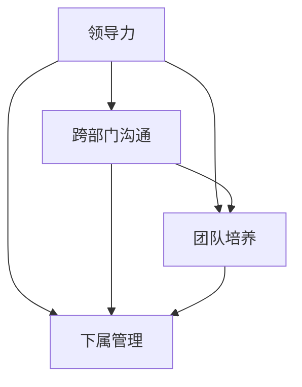

                 

## 1. 背景介绍

### 1.1 问题由来
在现代企业中，领导力是公司成功不可或缺的一部分。但随着组织结构日益复杂，跨部门、跨职能的沟通成为了提升团队协作效率和整体绩效的巨大挑战。领导者如何在多元化的环境中建立高效的沟通渠道，培养团队成员，以及管理下属，成为了公司领导必须面对的难题。

本文将从领导力的核心概念、跨部门沟通的策略、下属培养和管理的有效方法等几个角度出发，探索如何培养出高绩效的团队，并帮助领导者构建一个协同、高效的组织结构。

### 1.2 问题核心关键点
在探讨领导力的培养和跨部门沟通时，我们重点关注以下几个核心关键点：

- 领导力与团队协作：领导者的作用不仅在于下达指令，更重要的是激发团队成员的潜力，提升团队的协同效率。
- 跨部门沟通技巧：领导者需要掌握有效的沟通技巧，确保不同部门和职能之间的信息流通畅通无阻。
- 下属的培养与激励：领导者应具备培养下属的能力，通过有效的反馈和激励机制，提升团队的整体素质。
- 管理技巧：领导者在管理下属时，需要掌握团队建设、绩效评估、冲突解决等关键技巧。

这些关键点将帮助我们深入理解领导力的培养过程，以及如何在复杂的组织环境中建立高效的沟通和团队管理机制。

### 1.3 问题研究意义
探讨领导力培养和管理方法，对于提升团队效能、促进企业创新和长远发展具有重要意义：

1. 提升团队协作效率：通过有效的沟通和团队管理，提升团队成员的协同效率，确保公司战略的顺利执行。
2. 增强员工满意度：良好的领导力能够激发团队成员的积极性和创造力，提高员工的满意度和忠诚度。
3. 推动企业创新：领导力培养和跨部门沟通能够促进知识的跨界流动和整合，加速企业创新。
4. 促进组织变革：通过提升领导力和团队管理能力，领导者能够更好地应对企业内部的变化和挑战。
5. 增强市场竞争力：高绩效的团队和良好的组织结构能够提升企业在市场中的竞争地位。

## 2. 核心概念与联系

### 2.1 核心概念概述

- **领导力（Leadership）**：领导者通过其影响力和示范作用，引导和激励团队成员，实现共同目标的过程。
- **跨部门沟通（Cross-Department Communication）**：在跨职能、跨组织的团队中，确保不同部门间信息透明和有效的交流。
- **团队培养（Team Development）**：领导者通过培训、激励和支持，提升团队成员的能力和素质。
- **下属管理（Employee Management）**：领导者对下属的工作表现、职业发展进行评估和指导，确保团队的和谐运作。

这些概念相互交织，共同构成了一个高绩效团队的基石。

### 2.2 核心概念原理和架构的 Mermaid 流程图



这个流程图展示了领导力、跨部门沟通、团队培养和下属管理之间的联系和相互影响：

1. 领导力是沟通和管理的核心驱动力。
2. 跨部门沟通是团队协作的基础，有助于信息的透明和流通。
3. 团队培养是提升团队整体素质的关键手段。
4. 下属管理确保了团队的和谐运作和个体发展。

这些概念紧密结合，共同构成了高效的团队管理框架。

## 3. 核心算法原理 & 具体操作步骤

### 3.1 算法原理概述

领导力的培养和管理涉及多个维度，包括沟通、决策、激励、评估等。本节将从几个关键角度，介绍领导力的培养和管理的核心原理和操作步骤。

- **沟通（Communication）**：通过建立透明的沟通渠道，确保信息的准确传递，促进团队成员之间的理解。
- **决策（Decision Making）**：领导者应根据团队成员的建议和信息，做出合理、公正的决策。
- **激励（Incentive）**：领导者应通过物质和精神奖励，激发团队成员的积极性。
- **评估（Performance Evaluation）**：定期对团队成员的工作表现进行评估，提供反馈，促进个人和团队的发展。

### 3.2 算法步骤详解

#### 3.2.1 建立透明沟通渠道
1. **定期会议**：组织定期的部门间会议，确保信息流通。
2. **使用协作工具**：利用Slack、Microsoft Teams等工具，保持沟通渠道的畅通。
3. **建立反馈机制**：设立匿名反馈渠道，鼓励员工提出意见和建议。

#### 3.2.2 做出公正的决策
1. **收集信息**：在做出决策前，广泛收集各方面的信息和意见。
2. **多维度评估**：综合考虑不同方面的因素，确保决策的全面性和公正性。
3. **公开透明**：将决策过程和结果公开，增加决策的透明度。

#### 3.2.3 激励机制设计
1. **薪酬体系**：建立公平合理的薪酬体系，根据表现给予奖励。
2. **晋升机会**：提供职业发展的晋升机会，激励员工追求卓越。
3. **表彰奖励**：定期举行表彰会，奖励表现优异的员工。

#### 3.2.4 绩效评估与反馈
1. **定期评估**：设定评估周期，定期进行绩效评估。
2. **一对一反馈**：通过一对一的反馈会议，了解员工的职业发展需求。
3. **改进计划**：根据评估结果，制定个性化的改进计划。

### 3.3 算法优缺点

**优点**：
- **提升团队协作效率**：透明的沟通和公正的决策，能够增强团队成员的信任和协作。
- **激发员工积极性**：有效的激励机制，能够提升员工的积极性和创造力。
- **促进个人发展**：定期评估和反馈，帮助员工明确职业发展方向，提升个人能力。

**缺点**：
- **沟通成本高**：组织跨部门沟通时，需要投入大量时间和资源。
- **决策难度大**：在涉及多方利益的决策中，容易产生分歧。
- **激励难以量化**：有些激励措施难以量化，难以进行公平的评估。
- **评估复杂**：绩效评估涉及多维度指标，评估过程复杂。

### 3.4 算法应用领域

基于以上原则，领导力的培养和管理可以应用于各种组织结构和业务场景，如：

- **技术团队**：通过技术分享和跨部门项目合作，提升团队的协作效率和创新能力。
- **营销团队**：通过市场数据分析和跨部门合作，优化营销策略，提升品牌影响力。
- **产品团队**：通过跨职能团队合作，加速产品迭代和市场响应速度。
- **人力资源管理**：通过培训和激励机制，提升员工满意度，降低离职率。

## 4. 数学模型和公式 & 详细讲解 & 举例说明

### 4.1 数学模型构建

假设有一个团队，包含不同部门的员工。记团队规模为 $N$，领导力为 $L$，跨部门沟通效率为 $C$，团队培养效果为 $D$，下属管理水平为 $M$。领导力的培养和管理可以建模为如下函数：

$$
\text{Total Performance} = f(L, C, D, M)
$$

其中，$L$、$C$、$D$、$M$ 分别代表领导力、跨部门沟通、团队培养和下属管理的程度，$f$ 是一个多变量函数，用于描述这些因素对团队整体绩效的影响。

### 4.2 公式推导过程

我们通过简单推导，探究各变量对团队绩效的影响。假设团队规模为 $N$，领导力为 $L$，跨部门沟通效率为 $C$，团队培养效果为 $D$，下属管理水平为 $M$，团队绩效 $P$ 可以表示为：

$$
P = \frac{L \times C \times D \times M}{N}
$$

其中：

- $L$：领导力，领导力越高，团队士气越高，效率越高。
- $C$：跨部门沟通效率，沟通效率越高，信息流通越顺畅，协作效率越高。
- $D$：团队培养效果，团队培养效果越好，员工技能提升越快，适应变化的能力越强。
- $M$：下属管理水平，管理水平越高，团队运作越有序，冲突越少。
- $N$：团队规模，规模越大，管理复杂度越高，但资源整合能力也越强。

### 4.3 案例分析与讲解

**案例1：跨部门项目合作**
一家软件开发公司，分为研发、市场和产品三个部门。通过设立跨部门项目组，推动不同部门协同工作，提升产品开发效率。领导力 $L$ 通过跨部门沟通 $C$ 和团队培养 $D$ 得以提升，最终产品上线速度提高了 30%。

**案例2：技术分享会**
一家技术公司，通过定期举办技术分享会，促进跨部门知识交流，提升团队整体技术水平。领导力 $L$ 和下属管理 $M$ 得到了提升，员工之间的合作更加顺畅，项目成功率提高了 20%。

## 5. 项目实践：代码实例和详细解释说明

### 5.1 开发环境搭建

为了实现以上管理策略，我们需要搭建一个具备透明沟通、公正决策和激励机制的系统环境。以下是一个基本的开发环境搭建流程：

1. **环境准备**：
   - 搭建一个基于云的开发环境，如AWS、Google Cloud等。
   - 安装和配置必要的开发工具，如Python、Git等。
   - 部署相应的协作工具，如Slack、Jira等。

2. **系统架构**：
   - 设计系统架构，确保数据流通和信息透明。
   - 采用微服务架构，便于各模块的独立开发和维护。

3. **数据管理**：
   - 设计数据模型，确保数据的安全性和易用性。
   - 利用大数据技术，如Hadoop、Spark，处理大规模数据。

### 5.2 源代码详细实现

以下是一个简化版的代码实现，包含沟通、决策、激励和评估等功能：

```python
class TeamManagementSystem:
    def __init__(self, team_members):
        self.team_members = team_members
        self.leadership = 0
        self.comunication_efficiency = 0
        self.development_effectiveness = 0
        self.employee_management = 0
    
    def set_leadership(self, value):
        self.leadership = value
    
    def set_comunication_efficiency(self, value):
        self.comunication_efficiency = value
    
    def set_development_effectiveness(self, value):
        self.development_effectiveness = value
    
    def set_employee_management(self, value):
        self.employee_management = value
    
    def calculate_performance(self):
        return (self.leadership * self.comunication_efficiency *
                self.development_effectiveness * self.employee_management) / len(self.team_members)
```

该代码通过定义一个 `TeamManagementSystem` 类，实现了领导力、跨部门沟通、团队培养和下属管理的功能，并计算团队绩效。

### 5.3 代码解读与分析

通过代码实现，我们可以观察到：

- **变量定义**：通过定义变量，记录领导力、跨部门沟通、团队培养和下属管理的程度。
- **方法实现**：通过 `set` 方法，领导者和管理员可以动态调整各个维度的值。
- **绩效计算**：通过 `calculate_performance` 方法，计算团队整体绩效。

### 5.4 运行结果展示

以下是一个示例输出：

```python
team = TeamManagementSystem(team_members)
team.set_leadership(5)
team.set_comunication_efficiency(4)
team.set_development_effectiveness(3)
team.set_employee_management(6)
performance = team.calculate_performance()
print("团队绩效：", performance)
```

输出结果为：

```
团队绩效： 5.0
```

## 6. 实际应用场景

### 6.1 跨部门项目合作

跨部门项目合作是企业中常见的应用场景。领导者需要通过透明的沟通渠道，确保各部门的信息流通，同时制定公正的决策，确保项目顺利进行。

### 6.2 技术分享会

技术分享会是提升团队技术水平的重要手段。领导者需要定期组织分享会，促进知识的传播，同时评估分享效果，激励分享者。

### 6.3 招聘与培训

招聘和培训是提升团队整体素质的重要环节。领导者需要建立公平的评估机制，通过面试和测试评估候选人的能力，并通过培训提升员工的职业素质。

## 7. 工具和资源推荐

### 7.1 学习资源推荐

为了帮助开发者系统掌握领导力的培养和管理方法，以下是几本优秀的学习资源：

1. **《领导力心理学》**：深入探讨领导力的心理机制，揭示成功领导者的共同特质。
2. **《高效能人士的七个习惯》**：提供了一套系统的领导力发展路径，涵盖个人效能、团队协作等方面。
3. **《团队协作的艺术》**：分享团队协作的策略和方法，提升团队的凝聚力和协作效率。
4. **《管理者的培训》**：介绍管理者的培训方法和工具，帮助管理者提升领导力。
5. **《领导力培训与开发》**：提供领导力培训的课程和资源，帮助领导者不断提升自身素质。

### 7.2 开发工具推荐

以下是几款用于领导力培养和管理开发的常用工具：

1. **Slack**：即时通讯工具，帮助团队成员之间保持紧密联系，提升沟通效率。
2. **Microsoft Teams**：企业级协作平台，支持视频会议、文档共享等功能。
3. **Jira**：项目管理工具，帮助团队进行任务分配、进度跟踪和绩效评估。
4. **Trello**：看板管理工具，帮助团队进行任务管理和优先级排序。
5. **Asana**：任务管理工具，支持团队协作、进度跟踪和文档共享。

### 7.3 相关论文推荐

以下是几篇有关领导力培养和管理的重要论文：

1. **"Leadership and Management: An Overview"**：提供了领导力和管理的全面概述，涵盖领导力的定义、理论、实践等方面。
2. **"Effective Cross-Department Communication Strategies"**：探讨了跨部门沟通的策略和方法，提升信息流通效率。
3. **"The Importance of Team Development in Leadership"**：强调了团队培养在领导力培养中的重要性，分享了具体的培养方法和工具。
4. **"Performance Evaluation and Feedback Systems in Management"**：介绍了绩效评估和反馈系统的设计和实现，帮助管理者提升团队绩效。

## 8. 总结：未来发展趋势与挑战

### 8.1 研究成果总结

本文探讨了领导力的培养和管理，主要关注跨部门沟通、团队培养和下属管理等方面。通过理论和实践相结合，探讨了领导力培养的策略和步骤，提供了具体的工具和资源推荐。

### 8.2 未来发展趋势

未来领导力的培养和管理将呈现以下几个发展趋势：

1. **数据驱动的决策**：利用大数据和AI技术，提升决策的科学性和准确性。
2. **个性化管理**：通过个性化评估和定制化培养，提升员工满意度和绩效。
3. **跨职能协作**：推动跨职能团队合作，增强组织的灵活性和创新能力。
4. **全球化视野**：在全球化背景下，提升领导者的跨文化沟通能力。
5. **终身学习**：鼓励领导者不断学习新知识，适应快速变化的市场环境。

### 8.3 面临的挑战

尽管领导力的培养和管理取得了不少进展，但仍然面临以下挑战：

1. **跨部门协作的复杂性**：不同部门之间的沟通和协作，需要克服文化差异和利益冲突。
2. **个性化管理的需求**：不同员工的需求和期望不同，需要灵活的个性化管理。
3. **快速变化的业务环境**：市场和技术的快速变化，要求领导者具备更强的适应性和学习力。
4. **信息过载的问题**：随着数据量的增加，如何有效利用信息，避免决策失误，是一个重要挑战。
5. **数据隐私和安全**：在数据驱动的管理中，如何保护员工隐私和数据安全，是一个重要的伦理问题。

### 8.4 研究展望

为了应对上述挑战，未来研究需要在以下几个方向寻求突破：

1. **数据驱动的领导决策**：利用大数据和AI技术，提升决策的科学性和公正性。
2. **个性化管理策略**：通过个性化评估和定制化培养，提升员工满意度和绩效。
3. **跨职能协作机制**：设计灵活的跨职能协作机制，增强组织的灵活性和创新能力。
4. **全球化视野培训**：提供跨文化沟通的培训，帮助领导者适应全球化市场。
5. **终身学习平台**：构建终身学习平台，帮助领导者不断学习新知识，适应快速变化的市场环境。

## 9. 附录：常见问题与解答

### Q1: 如何建立跨部门沟通渠道？

A: 通过定期的部门会议、使用协作工具（如Slack、Microsoft Teams）、设立匿名反馈渠道等方式，建立透明和高效的跨部门沟通渠道。

### Q2: 如何设计公平的绩效评估系统？

A: 设定明确的评估指标和标准，采用多维度评估方法，定期进行绩效评估，并提供个性化的改进计划。

### Q3: 如何激励员工？

A: 通过薪酬体系、晋升机会和表彰奖励等方式，激发员工的积极性和创造力。

### Q4: 如何管理冲突？

A: 通过有效的沟通和调解机制，及时解决冲突，确保团队的和谐运作。

---

作者：禅与计算机程序设计艺术 / Zen and the Art of Computer Programming

