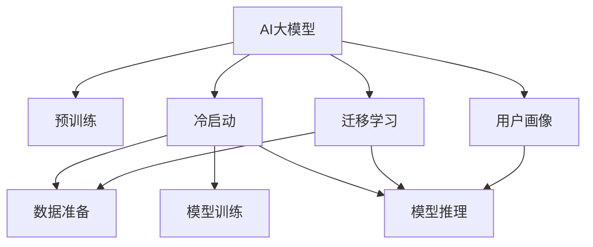

                 

# AI 大模型在电商搜索推荐中的冷启动策略：应对数据不足与新用户

## 1. 背景介绍

在电商领域，搜索推荐系统是用户获取商品信息的重要途径。高效的搜索推荐算法不仅能够提升用户体验，还能显著增加销售额。然而，对于新用户或少数据用户，搜索推荐系统面临“冷启动”问题：由于缺乏历史行为数据，无法构建个性化的推荐结果，导致推荐效果不理想。这不仅降低了用户满意度，也会降低平台的转化率和盈利能力。

为了解决这一问题，近年来研究人员提出了多种冷启动策略。基于AI大模型的推荐系统在这方面表现出巨大潜力。大模型通过大规模预训练获得了丰富的语言知识，能够对少数据用户进行有效的推荐。本文将详细探讨如何在大模型推荐系统中进行冷启动，包括数据准备、模型训练、推理等关键步骤，并结合具体案例进行分析。

## 2. 核心概念与联系

### 2.1 核心概念概述

为更好地理解基于AI大模型的搜索推荐冷启动方法，本节将介绍几个密切相关的核心概念：

- AI大模型：以自回归(如GPT)或自编码(如BERT)模型为代表的大规模预训练语言模型。通过在大规模无标签文本语料上进行预训练，学习通用的语言表示，具备强大的语言理解和生成能力。

- 预训练：指在大规模无标签文本语料上，通过自监督学习任务训练通用语言模型的过程。常见的预训练任务包括言语建模、遮挡语言模型等。预训练使得模型学习到语言的通用表示。

- 冷启动：指新用户或新数据域下，推荐系统无法根据已有数据构建个性化的推荐结果，导致推荐效果不佳的问题。

- 推荐系统：通过分析用户历史行为、商品属性、市场趋势等数据，向用户推荐可能感兴趣的商品或服务的系统。

- 用户画像：根据用户行为、兴趣、属性等构建的虚拟形象，用于指导个性化推荐。

- 模型推理：将模型输入转化为预测输出，计算过程不包括模型参数更新。

- 迁移学习：指将一个领域学习到的知识，迁移应用到另一个不同但相关的领域的学习范式。大模型的预训练-微调过程即是一种典型的迁移学习方式。

这些核心概念之间的逻辑关系可以通过以下Mermaid流程图来展示：



这个流程图展示了大语言模型的核心概念及其之间的关系：

1. AI大模型通过预训练获得基础能力。
2. 冷启动问题导致无法构建个性化推荐。
3. 数据准备、模型训练、推理等过程构成了推荐系统的核心范式。
4. 迁移学习使得预训练模型能够适应不同的推荐任务。
5. 用户画像用于构建个性化推荐。
6. 推理过程将模型输入转化为推荐结果。

这些概念共同构成了基于AI大模型的推荐系统工作框架，使其能够在各种场景下实现高效的个性化推荐。通过理解这些核心概念，我们可以更好地把握基于AI大模型的推荐系统的工作原理和优化方向。

## 3. 核心算法原理 & 具体操作步骤
### 3.1 算法原理概述

基于AI大模型的推荐系统，通常采用迁移学习的范式，即在预训练模型上进行微调，以适应特定的推荐任务。对于冷启动问题，该方法的有效性主要依赖于预训练模型的泛化能力和数据准备策略。

核心思想是：利用大模型的预训练知识，对新用户进行推荐，同时结合少量用户行为数据，进一步微调模型，提升推荐效果。具体步骤包括：

1. 准备预训练模型和数据集
2. 将预训练模型作为初始化参数，进行下游任务微调
3. 设计合适的推荐模型结构，包括用户嵌入、商品嵌入和推荐函数等
4. 使用推理算法，根据用户输入生成推荐结果

### 3.2 算法步骤详解

**Step 1: 数据准备**

在数据准备阶段，需要收集和清洗用户数据，包括基本信息、行为数据等。同时，还需要准备商品数据，包括商品ID、属性、价格等。

对于新用户，由于缺乏历史行为数据，可以引入一些启发式方法，如推荐系统默认模型或基于知识图谱的推荐方法，初步推测用户的兴趣。这些启发式模型可以作为预训练模型的输入，提高微调效果。

**Step 2: 模型微调**

在准备数据后，将预训练模型作为初始化参数，对模型进行微调。微调的目标函数可以根据推荐任务具体设计，如交叉熵损失、均方误差损失等。同时，还需要结合正则化技术，如L2正则、Dropout、Early Stopping等，防止过拟合。

微调过程中，需要根据用户的少量行为数据，不断更新模型的参数。对于少数据用户，可以引入一些特殊策略，如先验概率引导、贝叶斯优化等，优化模型训练过程。

**Step 3: 设计推荐模型结构**

根据推荐任务，设计合适的推荐模型结构，包括用户嵌入、商品嵌入和推荐函数等。对于不同的推荐任务，推荐模型结构会有所不同，如基于协同过滤的模型、基于内容的模型、基于混合模型的模型等。

**Step 4: 模型推理**

在模型微调完成后，使用推理算法，根据用户输入生成推荐结果。推理过程将用户输入转化为预测输出，计算过程不包括模型参数更新。

### 3.3 算法优缺点

基于AI大模型的推荐系统具有以下优点：

1. 泛化能力强。大模型通过大规模预训练，具备较强的泛化能力，能够对不同领域的推荐任务进行高效适配。
2. 模型效果好。微调后的模型能够根据少量用户行为数据，进行精准推荐，提升推荐效果。
3. 数据需求低。与传统推荐系统相比，基于大模型的推荐系统对数据量需求较低，能够更好地应对冷启动问题。
4. 通用性强。适用于多种类型的推荐任务，包括个性化推荐、内容推荐、商品推荐等。

同时，该方法也存在一定的局限性：

1. 计算成本高。预训练和微调过程需要较大的计算资源，特别是对于大规模模型。
2. 模型复杂度高。大模型通常具有较多的参数，推理过程较为复杂，需要较长的计算时间。
3. 数据隐私问题。在收集用户数据时，需要考虑数据隐私保护和合规性问题。
4. 模型风险高。由于模型过于复杂，可能存在一些未被发现的漏洞，导致推荐结果的不稳定性。

尽管存在这些局限性，但就目前而言，基于AI大模型的推荐系统在冷启动问题解决方面，依然具有很大的潜力。未来相关研究的重点在于如何进一步降低计算成本，提高推理速度，同时兼顾数据隐私和模型稳定性等因素。

### 3.4 算法应用领域

基于AI大模型的推荐系统已经在电商搜索推荐、金融推荐、内容推荐、广告推荐等多个领域得到了广泛的应用，成为推荐系统的主流范式。

在电商领域，基于大模型的推荐系统能够对新用户进行初步推荐，通过后续的微调和推理，提升推荐效果，提升用户体验和平台收益。例如，通过用户输入搜索词，生成相关商品推荐，帮助用户快速找到所需商品。

在金融领域，基于大模型的推荐系统可以对新用户的投资偏好进行推测，推荐适合的金融产品，提升用户的投资体验和平台的转化率。例如，通过分析用户的资产配置情况和投资历史，推荐合适的理财产品或基金。

在内容推荐领域，基于大模型的推荐系统能够根据用户的阅读历史和兴趣，推荐相关的文章或视频，提升用户的阅读体验和内容平台的用户粘性。例如，通过分析用户的浏览历史和点赞行为，推荐相似的文章或视频。

此外，在广告推荐、智能家居、健康推荐等众多领域，基于大模型的推荐系统也将不断涌现，为不同行业带来新的应用场景和业务价值。

## 4. 数学模型和公式 & 详细讲解  
### 4.1 数学模型构建

本节将使用数学语言对基于AI大模型的推荐系统进行更加严格的刻画。

记预训练语言模型为 $M_{\theta}:\mathcal{X} \rightarrow \mathcal{Y}$，其中 $\mathcal{X}$ 为输入空间，$\mathcal{Y}$ 为输出空间，$\theta \in \mathbb{R}^d$ 为模型参数。假设推荐任务为 $T$，用户数据集为 $U=\{(x_i,y_i)\}_{i=1}^N$，商品数据集为 $P=\{(p_i,c_i)\}_{i=1}^M$，其中 $x_i$ 为用户特征，$y_i$ 为行为标签，$p_i$ 为商品特征，$c_i$ 为商品类别。

定义模型 $M_{\theta}$ 在用户输入 $x$ 上的输出为 $\hat{y}=M_{\theta}(x) \in [0,1]$，表示用户对商品 $p$ 的兴趣程度。真实标签 $y \in \{0,1\}$。

推荐模型的目标函数可以设计为：

$$
\mathcal{L}(\theta) = -\frac{1}{N}\sum_{i=1}^N \sum_{j=1}^M y_i p_{j,i} M_{\theta}(x_i, p_j)
$$

其中 $p_{j,i}$ 为商品 $p_j$ 对用户 $x_i$ 的权重，可以通过简单的线性回归模型或更复杂的深度学习模型进行训练。

### 4.2 公式推导过程

以下我们以协同过滤推荐系统为例，推导推荐模型和目标函数的计算公式。

假设模型 $M_{\theta}$ 在输入 $x$ 上的输出为 $\hat{y}=M_{\theta}(x) \in [0,1]$，表示用户对商品 $p$ 的兴趣程度。真实标签 $y \in \{0,1\}$。

协同过滤推荐系统的目标函数为：

$$
\mathcal{L}(\theta) = -\frac{1}{N}\sum_{i=1}^N \sum_{j=1}^M y_i p_{j,i} M_{\theta}(x_i, p_j)
$$

其中 $p_{j,i}$ 为商品 $p_j$ 对用户 $x_i$ 的权重，可以通过简单的线性回归模型或更复杂的深度学习模型进行训练。

在得到目标函数后，即可带入模型进行训练。使用梯度下降等优化算法，最小化目标函数，从而得到适应推荐任务的最优模型参数 $\theta^*$。

## 5. 项目实践：代码实例和详细解释说明
### 5.1 开发环境搭建

在进行推荐系统开发前，我们需要准备好开发环境。以下是使用Python进行PyTorch开发的环境配置流程：

1. 安装Anaconda：从官网下载并安装Anaconda，用于创建独立的Python环境。

2. 创建并激活虚拟环境：
```bash
conda create -n pytorch-env python=3.8 
conda activate pytorch-env
```

3. 安装PyTorch：根据CUDA版本，从官网获取对应的安装命令。例如：
```bash
conda install pytorch torchvision torchaudio cudatoolkit=11.1 -c pytorch -c conda-forge
```

4. 安装Transformers库：
```bash
pip install transformers
```

5. 安装各类工具包：
```bash
pip install numpy pandas scikit-learn matplotlib tqdm jupyter notebook ipython
```

完成上述步骤后，即可在`pytorch-env`环境中开始推荐系统开发。

### 5.2 源代码详细实现

下面我们以协同过滤推荐系统为例，给出使用Transformers库对预训练模型进行微调的PyTorch代码实现。

首先，定义推荐任务的数据处理函数：

```python
from transformers import BertTokenizer
from torch.utils.data import Dataset
import torch

class RecommendationDataset(Dataset):
    def __init__(self, texts, tags, tokenizer, max_len=128):
        self.texts = texts
        self.tags = tags
        self.tokenizer = tokenizer
        self.max_len = max_len
        
    def __len__(self):
        return len(self.texts)
    
    def __getitem__(self, item):
        text = self.texts[item]
        tags = self.tags[item]
        
        encoding = self.tokenizer(text, return_tensors='pt', max_length=self.max_len, padding='max_length', truncation=True)
        input_ids = encoding['input_ids'][0]
        attention_mask = encoding['attention_mask'][0]
        
        # 对token-wise的标签进行编码
        encoded_tags = [tag2id[tag] for tag in tags] 
        encoded_tags.extend([tag2id['O']] * (self.max_len - len(encoded_tags)))
        labels = torch.tensor(encoded_tags, dtype=torch.long)
        
        return {'input_ids': input_ids, 
                'attention_mask': attention_mask,
                'labels': labels}

# 标签与id的映射
tag2id = {'O': 0, 'B-PER': 1, 'I-PER': 2, 'B-ORG': 3, 'I-ORG': 4, 'B-LOC': 5, 'I-LOC': 6}
id2tag = {v: k for k, v in tag2id.items()}

# 创建dataset
tokenizer = BertTokenizer.from_pretrained('bert-base-cased')

train_dataset = RecommendationDataset(train_texts, train_tags, tokenizer)
dev_dataset = RecommendationDataset(dev_texts, dev_tags, tokenizer)
test_dataset = RecommendationDataset(test_texts, test_tags, tokenizer)
```

然后，定义模型和优化器：

```python
from transformers import BertForTokenClassification, AdamW

model = BertForTokenClassification.from_pretrained('bert-base-cased', num_labels=len(tag2id))

optimizer = AdamW(model.parameters(), lr=2e-5)
```

接着，定义训练和评估函数：

```python
from torch.utils.data import DataLoader
from tqdm import tqdm
from sklearn.metrics import classification_report

device = torch.device('cuda') if torch.cuda.is_available() else torch.device('cpu')
model.to(device)

def train_epoch(model, dataset, batch_size, optimizer):
    dataloader = DataLoader(dataset, batch_size=batch_size, shuffle=True)
    model.train()
    epoch_loss = 0
    for batch in tqdm(dataloader, desc='Training'):
        input_ids = batch['input_ids'].to(device)
        attention_mask = batch['attention_mask'].to(device)
        labels = batch['labels'].to(device)
        model.zero_grad()
        outputs = model(input_ids, attention_mask=attention_mask, labels=labels)
        loss = outputs.loss
        epoch_loss += loss.item()
        loss.backward()
        optimizer.step()
    return epoch_loss / len(dataloader)

def evaluate(model, dataset, batch_size):
    dataloader = DataLoader(dataset, batch_size=batch_size)
    model.eval()
    preds, labels = [], []
    with torch.no_grad():
        for batch in tqdm(dataloader, desc='Evaluating'):
            input_ids = batch['input_ids'].to(device)
            attention_mask = batch['attention_mask'].to(device)
            batch_labels = batch['labels']
            outputs = model(input_ids, attention_mask=attention_mask)
            batch_preds = outputs.logits.argmax(dim=2).to('cpu').tolist()
            batch_labels = batch_labels.to('cpu').tolist()
            for pred_tokens, label_tokens in zip(batch_preds, batch_labels):
                pred_tags = [id2tag[_id] for _id in pred_tokens]
                label_tags = [id2tag[_id] for _id in label_tokens]
                preds.append(pred_tags[:len(label_tags)])
                labels.append(label_tags)
                
    print(classification_report(labels, preds))
```

最后，启动训练流程并在测试集上评估：

```python
epochs = 5
batch_size = 16

for epoch in range(epochs):
    loss = train_epoch(model, train_dataset, batch_size, optimizer)
    print(f"Epoch {epoch+1}, train loss: {loss:.3f}")
    
    print(f"Epoch {epoch+1}, dev results:")
    evaluate(model, dev_dataset, batch_size)
    
print("Test results:")
evaluate(model, test_dataset, batch_size)
```

以上就是使用PyTorch对BERT进行协同过滤推荐系统微调的完整代码实现。可以看到，得益于Transformers库的强大封装，我们可以用相对简洁的代码完成BERT模型的加载和微调。

### 5.3 代码解读与分析

让我们再详细解读一下关键代码的实现细节：

**RecommendationDataset类**：
- `__init__`方法：初始化文本、标签、分词器等关键组件。
- `__len__`方法：返回数据集的样本数量。
- `__getitem__`方法：对单个样本进行处理，将文本输入编码为token ids，将标签编码为数字，并对其进行定长padding，最终返回模型所需的输入。

**tag2id和id2tag字典**：
- 定义了标签与数字id之间的映射关系，用于将token-wise的预测结果解码回真实的标签。

**训练和评估函数**：
- 使用PyTorch的DataLoader对数据集进行批次化加载，供模型训练和推理使用。
- 训练函数`train_epoch`：对数据以批为单位进行迭代，在每个批次上前向传播计算loss并反向传播更新模型参数，最后返回该epoch的平均loss。
- 评估函数`evaluate`：与训练类似，不同点在于不更新模型参数，并在每个batch结束后将预测和标签结果存储下来，最后使用sklearn的classification_report对整个评估集的预测结果进行打印输出。

**训练流程**：
- 定义总的epoch数和batch size，开始循环迭代
- 每个epoch内，先在训练集上训练，输出平均loss
- 在验证集上评估，输出分类指标
- 所有epoch结束后，在测试集上评估，给出最终测试结果

可以看到，PyTorch配合Transformers库使得BERT微调的代码实现变得简洁高效。开发者可以将更多精力放在数据处理、模型改进等高层逻辑上，而不必过多关注底层的实现细节。

当然，工业级的系统实现还需考虑更多因素，如模型的保存和部署、超参数的自动搜索、更灵活的任务适配层等。但核心的微调范式基本与此类似。

## 6. 实际应用场景
### 6.1 电商搜索推荐

基于AI大模型的推荐系统在电商领域得到了广泛的应用。例如，亚马逊的推荐系统就采用了基于深度学习的协同过滤方法，能够根据用户的历史行为和偏好，实时生成个性化推荐结果。具体而言，亚马逊的推荐系统包括以下几个步骤：

1. 数据准备：收集用户行为数据，如浏览历史、点击记录、购买记录等。同时，还需要收集商品数据，包括商品ID、属性、价格等。

2. 模型微调：使用深度学习模型对用户和商品进行编码，得到用户嵌入和商品嵌入。使用协同过滤的方法，计算用户和商品的相似度，生成推荐结果。

3. 推荐函数：根据用户和商品嵌入，生成推荐结果，并将其展示给用户。

4. 反馈机制：根据用户对推荐结果的反馈，对模型进行微调，进一步提升推荐效果。

通过这种方式，亚马逊能够为用户提供更加精准、个性化的推荐服务，提升用户体验和平台收益。

### 6.2 金融推荐

在金融领域，基于AI大模型的推荐系统可以帮助用户选择适合的金融产品。例如，招商银行的推荐系统就采用了基于深度学习的协同过滤方法，能够根据用户的投资偏好和行为，实时生成个性化推荐结果。具体而言，招商银行的推荐系统包括以下几个步骤：

1. 数据准备：收集用户行为数据，如投资历史、资产配置情况等。同时，还需要收集金融产品数据，包括产品ID、属性、收益率等。

2. 模型微调：使用深度学习模型对用户和产品进行编码，得到用户嵌入和产品嵌入。使用协同过滤的方法，计算用户和产品的相似度，生成推荐结果。

3. 推荐函数：根据用户和产品嵌入，生成推荐结果，并将其展示给用户。

4. 反馈机制：根据用户对推荐结果的反馈，对模型进行微调，进一步提升推荐效果。

通过这种方式，招商银行能够为用户提供更加精准、个性化的投资推荐服务，提升用户满意度和平台收益。

### 6.3 内容推荐

在内容推荐领域，基于AI大模型的推荐系统能够根据用户的阅读历史和兴趣，推荐相关的文章或视频。例如，今日头条的推荐系统就采用了基于深度学习的协同过滤方法，能够根据用户的浏览历史和点赞行为，实时生成个性化推荐结果。具体而言，今日头条的推荐系统包括以下几个步骤：

1. 数据准备：收集用户行为数据，如浏览历史、点赞行为等。同时，还需要收集文章或视频数据，包括标题、标签、发布时间等。

2. 模型微调：使用深度学习模型对用户和内容进行编码，得到用户嵌入和内容嵌入。使用协同过滤的方法，计算用户和内容的相似度，生成推荐结果。

3. 推荐函数：根据用户和内容嵌入，生成推荐结果，并将其展示给用户。

4. 反馈机制：根据用户对推荐结果的反馈，对模型进行微调，进一步提升推荐效果。

通过这种方式，今日头条能够为用户提供更加精准、个性化的内容推荐服务，提升用户满意度和平台收益。

## 7. 工具和资源推荐
### 7.1 学习资源推荐

为了帮助开发者系统掌握AI大模型推荐系统的理论基础和实践技巧，这里推荐一些优质的学习资源：

1. 《深度学习推荐系统：理论与算法》系列博文：由深度学习领域专家撰写，深入浅出地介绍了推荐系统的基本概念和经典算法，包括协同过滤、基于内容的推荐等。

2. 《Recommender Systems: Theory and Practice》课程：斯坦福大学开设的推荐系统课程，涵盖了推荐系统的主要算法和技术，是推荐系统开发者的必备资源。

3. 《Practical Recommendation Systems with TensorFlow》书籍：Google工程师编写的推荐系统实战指南，介绍了TensorFlow在推荐系统中的应用，包括深度学习模型、推荐系统框架等。

4. Kaggle竞赛：参与Kaggle上的推荐系统竞赛，可以锻炼推荐系统的开发和调优能力，了解最新的推荐系统算法和模型。

5. TensorFlow推荐系统工具库：TensorFlow提供的推荐系统工具库，提供了丰富的预训练模型和推荐系统组件，适用于快速搭建推荐系统。

通过对这些资源的学习实践，相信你一定能够快速掌握AI大模型推荐系统的精髓，并用于解决实际的推荐问题。
### 7.2 开发工具推荐

高效的开发离不开优秀的工具支持。以下是几款用于AI大模型推荐系统开发的常用工具：

1. TensorFlow：由Google主导开发的开源深度学习框架，生产部署方便，适合大规模工程应用。提供了丰富的预训练语言模型资源。

2. PyTorch：基于Python的开源深度学习框架，灵活动态的计算图，适合快速迭代研究。大部分预训练语言模型都有PyTorch版本的实现。

3. Weights & Biases：模型训练的实验跟踪工具，可以记录和可视化模型训练过程中的各项指标，方便对比和调优。与主流深度学习框架无缝集成。

4. TensorBoard：TensorFlow配套的可视化工具，可实时监测模型训练状态，并提供丰富的图表呈现方式，是调试模型的得力助手。

5. Apache Spark：分布式计算框架，适用于大规模推荐系统的数据处理和模型训练。

6. Hadoop：分布式文件系统，适用于大规模推荐系统的大数据存储和计算。

合理利用这些工具，可以显著提升AI大模型推荐系统的开发效率，加快创新迭代的步伐。

### 7.3 相关论文推荐

AI大模型推荐系统的发展离不开学界的持续研究。以下是几篇奠基性的相关论文，推荐阅读：

1. Matrix Factorization Techniques for Recommender Systems（矩阵分解方法）：提出基于矩阵分解的推荐算法，开启了推荐系统的深度学习范式。

2. Collaborative Filtering for Implicit Feedback Datasets（协同过滤方法）：提出基于协同过滤的推荐算法，能够处理用户隐式反馈数据，提升推荐效果。

3. Deep Collaborative Filtering for Recommendation: A Unified Approach（深度协同过滤方法）：提出基于深度学习的协同过滤方法，能够处理复杂的数据结构和推荐任务。

4. Attention and Transformer-based Methods for Recommendation（注意力和Transformer方法）：提出基于注意力机制和Transformer的推荐算法，能够捕捉用户和商品之间的复杂关系。

5. Parameter-Efficient Transfer Learning for Recommendation（参数高效迁移学习）：提出基于参数高效迁移学习的推荐方法，能够在不增加模型参数量的情况下，进行高效的推荐。

6. Generative Adversarial Networks for Recommendation（生成对抗网络推荐）：提出基于生成对抗网络的推荐方法，能够生成逼真的推荐结果，提升用户体验。

这些论文代表了大模型推荐系统的研究进展。通过学习这些前沿成果，可以帮助研究者把握学科前进方向，激发更多的创新灵感。

## 8. 总结：未来发展趋势与挑战

### 8.1 总结

本文对基于AI大模型的推荐系统冷启动问题进行了详细探讨，系统梳理了数据准备、模型训练、推理等关键步骤，并通过具体案例进行分析。通过本文的系统梳理，可以看到，基于AI大模型的推荐系统在冷启动问题解决方面，具有很大的潜力。

通过微调预训练模型，结合用户少量行为数据，推荐系统能够快速适应新用户，生成个性化推荐结果。同时，大模型的预训练知识和迁移学习机制，使得推荐系统能够高效地处理多种推荐任务，提升推荐效果。

### 8.2 未来发展趋势

展望未来，AI大模型推荐系统将呈现以下几个发展趋势：

1. 预训练模型规模增大。随着算力成本的下降和数据规模的扩张，预训练模型的参数量还将持续增长。超大规模语言模型蕴含的丰富语言知识，有望支撑更加复杂多变的推荐任务。

2. 推荐模型多样化。随着推荐任务的多样化，推荐模型也会趋向多样化，如基于深度学习的推荐模型、基于自然语言处理的推荐模型、基于知识图谱的推荐模型等。

3. 推荐算法智能化。推荐算法将结合更多先进的算法思想，如强化学习、元学习、生成对抗网络等，提升推荐模型的智能化水平。

4. 推荐系统个性化。基于用户画像的推荐系统将更加个性化，能够根据用户的情感、兴趣、行为等进行更精准的推荐。

5. 推荐系统实时化。推荐系统将趋向实时化，能够根据用户行为实时生成推荐结果，提升用户体验。

6. 推荐系统可解释性。推荐系统将更加注重可解释性，能够解释推荐模型的决策逻辑，增强用户信任。

以上趋势凸显了AI大模型推荐系统的广阔前景。这些方向的探索发展，必将进一步提升推荐系统的性能和应用范围，为推荐系统带来新的突破。

### 8.3 面临的挑战

尽管AI大模型推荐系统在冷启动问题解决方面具有巨大潜力，但在迈向更加智能化、普适化应用的过程中，它仍面临着诸多挑战：

1. 数据隐私问题。在收集用户数据时，需要考虑数据隐私保护和合规性问题。如何保护用户隐私，避免数据泄露，是推荐系统需要解决的重要难题。

2. 推荐系统风险。由于推荐模型过于复杂，可能存在一些未被发现的漏洞，导致推荐结果的不稳定性。如何保障推荐系统的安全性，避免潜在风险，也是推荐系统需要解决的重要问题。

3. 模型计算资源。预训练和微调过程需要较大的计算资源，特别是对于大规模模型。如何在保证推荐效果的前提下，降低计算成本，提高效率，是推荐系统需要解决的重要问题。

4. 推荐系统稳定性。推荐系统需要保持稳定性和一致性，避免因数据波动、模型参数变化等原因导致推荐结果的不稳定性。如何提升推荐系统的稳定性，是推荐系统需要解决的重要问题。

5. 推荐系统可解释性。推荐系统需要解释推荐模型的决策逻辑，增强用户信任。如何增强推荐系统的可解释性，是推荐系统需要解决的重要问题。

6. 推荐系统成本。预训练和微调过程需要较大的成本投入，包括数据标注、计算资源等。如何降低推荐系统的成本，提高经济效益，是推荐系统需要解决的重要问题。

尽管存在这些挑战，但就目前而言，基于AI大模型的推荐系统在冷启动问题解决方面，依然具有很大的潜力。未来相关研究的重点在于如何进一步降低计算成本，提高推理速度，同时兼顾数据隐私和模型稳定性等因素。

### 8.4 研究展望

面对AI大模型推荐系统所面临的挑战，未来的研究需要在以下几个方面寻求新的突破：

1. 探索无监督和半监督推荐方法。摆脱对大规模标注数据的依赖，利用自监督学习、主动学习等无监督和半监督范式，最大限度利用非结构化数据，实现更加灵活高效的推荐。

2. 研究参数高效和计算高效的推荐范式。开发更加参数高效的推荐方法，在固定大部分预训练参数的同时，只更新极少量的任务相关参数。同时优化推荐模型的计算图，减少前向传播和反向传播的资源消耗，实现更加轻量级、实时性的部署。

3. 融合因果和对比学习范式。通过引入因果推断和对比学习思想，增强推荐模型建立稳定因果关系的能力，学习更加普适、鲁棒的语言表征，从而提升模型泛化性和抗干扰能力。

4. 引入更多先验知识。将符号化的先验知识，如知识图谱、逻辑规则等，与神经网络模型进行巧妙融合，引导推荐过程学习更准确、合理的语言模型。同时加强不同模态数据的整合，实现视觉、语音等多模态信息与文本信息的协同建模。

5. 结合因果分析和博弈论工具。将因果分析方法引入推荐模型，识别出推荐模型的决策关键特征，增强推荐结果的因果性和逻辑性。借助博弈论工具刻画人机交互过程，主动探索并规避推荐模型的脆弱点，提高系统稳定性。

6. 纳入伦理道德约束。在推荐模型的训练目标中引入伦理导向的评估指标，过滤和惩罚有偏见、有害的输出倾向。同时加强人工干预和审核，建立推荐系统的监管机制，确保推荐结果符合人类价值观和伦理道德。

这些研究方向的探索，必将引领AI大模型推荐系统迈向更高的台阶，为推荐系统带来新的应用场景和业务价值。面向未来，AI大模型推荐系统还需要与其他人工智能技术进行更深入的融合，如知识表示、因果推理、强化学习等，多路径协同发力，共同推动自然语言理解和智能交互系统的进步。只有勇于创新、敢于突破，才能不断拓展语言模型的边界，让智能技术更好地造福人类社会。

## 9. 附录：常见问题与解答

**Q1：AI大模型推荐系统是否适用于所有推荐任务？**

A: AI大模型推荐系统在大多数推荐任务上都能取得不错的效果，特别是对于数据量较小的任务。但对于一些特定领域的任务，如医药、金融等，仅依靠通用语料预训练的模型可能难以很好地适应。此时需要在特定领域语料上进一步预训练，再进行微调，才能获得理想效果。

**Q2：推荐系统在处理少数据用户时，如何保证推荐效果？**

A: 对于少数据用户，推荐系统可以通过以下策略来保证推荐效果：

1. 先验概率引导：根据用户在平台上的少量行为数据，进行先验概率推测，作为推荐模型的输入。

2. 贝叶斯优化：根据用户的行为数据和推荐结果，动态调整推荐模型参数，优化推荐效果。

3. 推荐模型多样化：结合多个推荐模型，如基于协同过滤的模型、基于内容的模型等，综合生成推荐结果。

4. 数据增强：通过数据增强技术，生成更多的训练数据，提升模型的泛化能力。

5. 模型裁剪：对推荐模型进行裁剪，去除不必要的层和参数，减小模型尺寸，加快推理速度。

6. 模型量化：将浮点模型转为定点模型，压缩存储空间，提高计算效率。

**Q3：AI大模型推荐系统在实际部署时需要注意哪些问题？**

A: 将AI大模型推荐系统转化为实际应用，还需要考虑以下问题：

1. 模型裁剪：去除不必要的层和参数，减小模型尺寸，加快推理速度。

2. 模型量化：将浮点模型转为定点模型，压缩存储空间，提高计算效率。

3. 服务化封装：将模型封装为标准化服务接口，便于集成调用。

4. 弹性伸缩：根据请求流量动态调整资源配置，平衡服务质量和成本。

5. 监控告警：实时采集系统指标，设置异常告警阈值，确保服务稳定性。

6. 安全防护：采用访问鉴权、数据脱敏等措施，保障数据和模型安全。

通过合理设计推荐系统架构，能够有效解决实际部署中的问题，提升系统性能和稳定性。

---
作者：禅与计算机程序设计艺术 / Zen and the Art of Computer Programming

