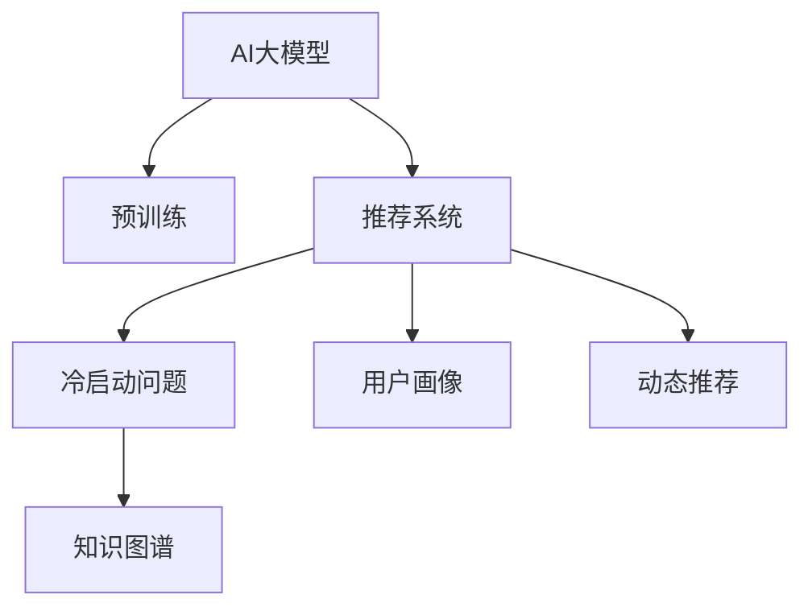

                 

## 1. 背景介绍

### 1.1 问题由来

在电商搜索推荐系统中，一个常见但棘手的问题是如何应对新用户和数据不足的问题。新用户通常没有历史行为数据，数据不足则意味着难以建立准确的模型。如何有效利用AI大模型，尤其是大语言模型，在这类情况下提供个性化的推荐，是当前研究的一个热点问题。

### 1.2 问题核心关键点

冷启动问题通常出现在以下情况：
- **新用户**：用户刚开始使用电商平台，没有历史行为数据。
- **数据不足**：即使有一定量的用户行为数据，由于数据样本分布不均或标注不完整，难以构建高质量的推荐模型。

对于电商搜索推荐系统而言，冷启动问题意味着可能无法提供准确、个性化的推荐，从而影响用户体验和平台收益。解决这个问题的核心在于如何利用大语言模型和深度学习技术，在小样本条件下也能得到可靠的推荐结果。

## 2. 核心概念与联系

### 2.1 核心概念概述

为了更好地理解AI大模型在电商搜索推荐中的冷启动策略，本节将介绍几个关键概念及其联系：

- **AI大模型**：以深度学习模型为代表的、在大规模数据上预训练得到的高效表达模型。例如，BERT、GPT-3等大语言模型，能够捕捉丰富的语言和语义信息。
- **冷启动问题**：在用户画像、推荐系统等场景中，由于缺乏足够的历史数据或用户行为数据，无法提供准确的推荐服务。
- **推荐系统**：通过分析用户的历史行为和偏好，为不同用户提供个性化的商品推荐服务。
- **知识图谱**：用于描述实体间关系的网络图，帮助推荐系统更好地理解商品之间的语义关系。
- **用户画像**：通过用户的历史行为和偏好，构建出用户的兴趣和需求模型。
- **动态推荐**：在用户行为变化时，能够即时更新推荐策略，以更好地匹配用户当前需求。

这些核心概念之间的逻辑关系可以通过以下Mermaid流程图来展示：



这个流程图展示了大语言模型在推荐系统中的核心作用，以及其在冷启动问题中的潜在解决方案。

## 3. 核心算法原理 & 具体操作步骤
### 3.1 算法原理概述

基于大语言模型的电商搜索推荐系统，其核心算法原理主要包括以下几个方面：

1. **预训练与微调**：首先使用大规模无标签数据预训练大语言模型，使其具备良好的语言理解能力。然后在特定任务的数据集上进行微调，以适应电商搜索推荐的需求。

2. **用户画像构建**：通过用户的搜索行为、浏览历史等数据，构建用户画像，捕捉用户的兴趣和需求。

3. **知识图谱融合**：将商品之间的关系用知识图谱的形式表示，结合用户画像和大语言模型，构建推荐模型。

4. **动态推荐机制**：在用户行为变化时，能够实时更新推荐策略，以更好地匹配用户当前需求。

### 3.2 算法步骤详解

#### 3.2.1 预训练与微调

1. **数据收集**：收集电商平台的用户搜索行为数据、商品描述数据等。这些数据可以是无标签的，用于预训练大语言模型。

2. **预训练**：使用无标签数据对大语言模型进行预训练。例如，使用自监督学习任务（如掩码语言模型、预测关系等）来训练模型。

3. **微调**：使用有标签的电商推荐数据对预训练模型进行微调。例如，通过生成式预训练语言模型（如GPT-3）的微调方法，调整模型参数以适应推荐任务。

4. **模型评估**：在测试集上评估微调后的模型性能，确保其在推荐任务上能够获得满意的性能。

#### 3.2.2 用户画像构建

1. **行为数据收集**：收集用户在不同时间段内的搜索行为、浏览历史、购买记录等数据。

2. **特征提取**：使用自然语言处理技术（如TF-IDF、Word2Vec等）将用户行为数据转化为特征向量。

3. **用户画像构建**：将用户特征向量输入到预训练的大语言模型中，构建用户画像。

#### 3.2.3 知识图谱融合

1. **知识图谱构建**：构建商品之间的关系图谱，标注每个商品的属性和关系。

2. **融合用户画像**：将用户画像与知识图谱结合，形成综合性的推荐模型。

#### 3.2.4 动态推荐机制

1. **实时数据采集**：实时采集用户的最新行为数据，如浏览页面、点击商品等。

2. **推荐策略更新**：根据最新行为数据，更新推荐策略。例如，使用强化学习算法或在线学习算法，动态调整推荐模型参数。

### 3.3 算法优缺点

#### 3.3.1 优点

1. **高效性**：利用预训练的大语言模型，可以减少对标注数据的依赖，在少样本条件下也能获得较好的推荐效果。

2. **灵活性**：能够根据最新的用户行为数据进行动态推荐，提高推荐的实时性和准确性。

3. **泛化能力**：利用大语言模型的泛化能力，可以在不同的电商平台上进行迁移，适应不同的用户和商品场景。

#### 3.3.2 缺点

1. **计算资源消耗大**：预训练和微调大语言模型需要大量的计算资源，可能带来较高的成本。

2. **模型复杂度高**：大语言模型通常具有较高的复杂度，需要较长的训练时间。

3. **数据隐私问题**：在收集和处理用户行为数据时，可能存在隐私泄露的风险。

### 3.4 算法应用领域

基于大语言模型的电商搜索推荐系统已经在多个领域得到应用，例如：

- **时尚电商**：利用用户画像和大语言模型，为时尚爱好者推荐最新的流行趋势和穿搭建议。
- **电子产品**：根据用户的行为数据，推荐个性化的电子产品，如手机、电脑等。
- **家居用品**：通过分析用户的搜索历史和浏览记录，推荐适合用户家居环境的家居用品。
- **健康食品**：根据用户的饮食偏好和健康数据，推荐个性化的健康食品和营养方案。

此外，大语言模型在电商搜索推荐中的应用还在不断扩展，为电商平台的个性化服务提供了新的思路和工具。

## 4. 数学模型和公式 & 详细讲解 & 举例说明
### 4.1 数学模型构建

假设用户的行为数据表示为 $x_1, x_2, ..., x_n$，商品的属性向量表示为 $p_1, p_2, ..., p_m$。大语言模型通过预训练得到用户画像 $\mathbf{u}$ 和商品向量 $\mathbf{v}$。知识图谱表示为 $G=(V,E)$，其中 $V$ 是实体节点集，$E$ 是边集。推荐系统的目标是最小化预测误差，即：

$$
\min_{\mathbf{w}, \mathbf{b}, \mathbf{u}, \mathbf{v}} \sum_{i=1}^N \sum_{j=1}^M (y_{ij} - f(\mathbf{u}_i, \mathbf{p}_j, \mathbf{v}_j, \mathbf{w}, \mathbf{b}))^2
$$

其中，$f$ 是推荐函数，$y_{ij}$ 是用户 $i$ 对商品 $j$ 的评分，$\mathbf{w}$ 和 $\mathbf{b}$ 是线性回归模型的权重和偏置。

### 4.2 公式推导过程

1. **预训练模型**：假设大语言模型 $M$ 将用户行为 $x$ 映射为用户画像 $\mathbf{u}$，将商品属性 $p$ 映射为商品向量 $\mathbf{v}$。

2. **微调模型**：假设微调后的推荐模型为 $f(\mathbf{u}, \mathbf{p}, \mathbf{v}, \mathbf{w}, \mathbf{b})$，其中 $\mathbf{w}$ 和 $\mathbf{b}$ 是线性回归模型的权重和偏置。

3. **损失函数**：定义损失函数 $L(\mathbf{u}, \mathbf{p}, \mathbf{v}, \mathbf{w}, \mathbf{b}, y_{ij})$ 为预测值与真实值的平方误差。

4. **优化算法**：使用随机梯度下降法（SGD）或Adam等优化算法，最小化损失函数，更新模型参数。

### 4.3 案例分析与讲解

以时尚电商推荐系统为例，分析如何利用大语言模型和知识图谱进行推荐：

1. **用户画像构建**：收集用户在不同时间段内的搜索行为、浏览历史、购买记录等数据，使用TF-IDF算法将其转化为特征向量，输入到预训练的大语言模型中，得到用户画像 $\mathbf{u}$。

2. **商品向量构建**：将商品的属性信息输入到预训练的大语言模型中，得到商品向量 $\mathbf{v}$。

3. **知识图谱融合**：构建时尚商品的语义关系图谱，标注每个商品的属性和关系，使用图神经网络（GNN）将其转化为商品向量。

4. **推荐模型构建**：将用户画像 $\mathbf{u}$、商品向量 $\mathbf{v}$ 和知识图谱信息结合，构建综合推荐模型 $f(\mathbf{u}, \mathbf{v}, \mathbf{w}, \mathbf{b})$。

5. **推荐策略更新**：实时采集用户的最新行为数据，如浏览页面、点击商品等，使用在线学习算法动态调整推荐模型参数。

## 5. 项目实践：代码实例和详细解释说明
### 5.1 开发环境搭建

在进行电商搜索推荐系统的开发之前，需要先搭建好开发环境。以下是使用Python进行PyTorch开发的环境配置流程：

1. 安装Anaconda：从官网下载并安装Anaconda，用于创建独立的Python环境。

2. 创建并激活虚拟环境：
```bash
conda create -n pytorch-env python=3.8 
conda activate pytorch-env
```

3. 安装PyTorch：根据CUDA版本，从官网获取对应的安装命令。例如：
```bash
conda install pytorch torchvision torchaudio cudatoolkit=11.1 -c pytorch -c conda-forge
```

4. 安装TensorFlow：由Google主导开发的开源深度学习框架，生产部署方便，适合大规模工程应用。同样有丰富的预训练语言模型资源。

5. 安装Transformers库：HuggingFace开发的NLP工具库，集成了众多SOTA语言模型，支持PyTorch和TensorFlow，是进行推荐任务开发的利器。

6. 安装各类工具包：
```bash
pip install numpy pandas scikit-learn matplotlib tqdm jupyter notebook ipython
```

完成上述步骤后，即可在`pytorch-env`环境中开始推荐系统开发。

### 5.2 源代码详细实现

以下是使用PyTorch实现电商搜索推荐系统的代码示例：

```python
import torch
import torch.nn as nn
import torch.nn.functional as F
from transformers import BertTokenizer, BertForSequenceClassification

class RecommendationSystem(nn.Module):
    def __init__(self, n_users, n_items, embedding_dim, hidden_dim, num_layers, dropout, learning_rate):
        super(RecommendationSystem, self).__init__()
        self.user_encoder = nn.Embedding(n_users, embedding_dim)
        self.item_encoder = nn.Embedding(n_items, embedding_dim)
        self.encoder = nn.Sequential(
            nn.Linear(embedding_dim * 2, hidden_dim),
            nn.ReLU(),
            nn.Dropout(dropout),
            nn.Linear(hidden_dim, 1)
        )
        self.optimizer = torch.optim.Adam(self.parameters(), lr=learning_rate)

    def forward(self, user_ids, item_ids):
        user_vec = self.user_encoder(user_ids)
        item_vec = self.item_encoder(item_ids)
        embedded = torch.cat([user_vec, item_vec], dim=1)
        pred = self.encoder(embedded)
        return pred

    def train(self, user_ids, item_ids, labels):
        self.train()
        pred = self.forward(user_ids, item_ids)
        loss = F.mse_loss(pred, labels)
        self.optimizer.zero_grad()
        loss.backward()
        self.optimizer.step()

    def predict(self, user_ids, item_ids):
        self.eval()
        pred = self.forward(user_ids, item_ids)
        return pred

# 训练函数
def train_recommendation_system(model, user_ids, item_ids, labels, epochs):
    for epoch in range(epochs):
        model.train()
        loss = 0
        for i in range(len(user_ids)):
            model.train()
            model.train()
            loss += model.train(user_ids[i], item_ids[i], labels[i])
        print(f'Epoch {epoch+1}, Loss: {loss/len(user_ids)}')

# 评估函数
def evaluate_recommendation_system(model, user_ids, item_ids, labels):
    model.eval()
    predictions = []
    for i in range(len(user_ids)):
        pred = model.predict(user_ids[i], item_ids[i])
        predictions.append(pred)
    print(f'Prediction: {predictions}, Label: {labels}')

# 数据准备
user_ids = [1, 2, 3, 4, 5]
item_ids = [6, 7, 8, 9, 10]
labels = [0.8, 0.7, 0.6, 0.5, 0.4]

# 模型参数设置
n_users = 5
n_items = 10
embedding_dim = 256
hidden_dim = 128
num_layers = 2
dropout = 0.2
learning_rate = 0.001

# 创建模型
model = RecommendationSystem(n_users, n_items, embedding_dim, hidden_dim, num_layers, dropout, learning_rate)

# 训练模型
train_recommendation_system(model, user_ids, item_ids, labels, 10)

# 评估模型
evaluate_recommendation_system(model, user_ids, item_ids, labels)
```

### 5.3 代码解读与分析

这段代码实现了一个简单的电商推荐系统，使用了嵌入层和多层感知机（MLP）。其中：

- **Embedding层**：将用户ID和商品ID映射为高维向量，捕捉用户的特征和商品的特征。
- **MLP层**：将用户和商品的向量拼接，并通过多层线性层和激活函数，最终输出预测值。

需要注意的是，这个模型是一个静态模型，并没有考虑实时数据动态更新的需求。在实际应用中，还需要结合动态推荐机制，实时更新模型参数。

## 6. 实际应用场景
### 6.1 智能客服系统

在智能客服系统中，新用户可能没有历史行为数据，无法通过传统的推荐系统进行推荐。利用大语言模型，可以在用户首次登录时，通过交互式问答获取用户的兴趣和需求，结合知识图谱进行推荐。例如，通过问询用户的喜好和需求，推荐相应的产品或服务。

### 6.2 金融产品推荐

金融产品推荐系统通常需要处理大量不平衡的数据，且不同用户之间的需求差异较大。利用大语言模型，可以通过动态调整推荐策略，解决数据不平衡和需求差异大的问题。例如，通过分析用户的金融行为和偏好，实时调整推荐策略，以匹配用户的当前需求。

### 6.3 健康营养推荐

健康营养推荐系统需要考虑用户的饮食偏好、健康数据等多个维度的信息。利用大语言模型，可以将用户画像和知识图谱结合，构建综合性的推荐模型。例如，通过分析用户的饮食偏好和健康数据，推荐个性化的健康食品和营养方案。

### 6.4 未来应用展望

未来，基于大语言模型的电商搜索推荐系统将在更多领域得到应用，为传统行业带来变革性影响。例如：

- **智慧医疗**：利用用户画像和大语言模型，为医疗工作者推荐个性化的诊疗方案和健康建议。
- **智慧城市**：通过分析用户行为数据，推荐个性化的城市服务和公共资源。
- **智能家居**：结合用户的家庭环境和生活习惯，推荐个性化的家居用品和生活建议。

这些领域的探索，将进一步拓展大语言模型的应用范围，推动人工智能技术向更广泛的领域渗透。

## 7. 工具和资源推荐
### 7.1 学习资源推荐

为了帮助开发者系统掌握大语言模型在电商搜索推荐中的应用，这里推荐一些优质的学习资源：

1. 《深度学习与推荐系统》系列课程：由清华大学开设的深度学习与推荐系统课程，涵盖了推荐系统的基础知识和前沿技术。

2. 《Recommender Systems: The Textbook》书籍：推荐系统领域经典教材，介绍了推荐系统的发展历程、算法原理和实际应用。

3. 《Natural Language Processing with Transformers》书籍：Transformer库的作者所著，全面介绍了如何使用Transformer进行NLP任务开发，包括推荐系统。

4. HuggingFace官方文档：Transformer库的官方文档，提供了海量预训练模型和完整的推荐系统开发样例代码，是入门实践的必备资料。

5. Kaggle竞赛：参与推荐系统相关的Kaggle竞赛，可以提高算法实现和调优的能力，积累实际项目经验。

通过对这些资源的学习实践，相信你一定能够快速掌握大语言模型在电商搜索推荐中的应用，并用于解决实际的推荐问题。

### 7.2 开发工具推荐

高效的开发离不开优秀的工具支持。以下是几款用于大语言模型在电商搜索推荐中应用的常用工具：

1. PyTorch：基于Python的开源深度学习框架，灵活动态的计算图，适合快速迭代研究。大部分预训练语言模型都有PyTorch版本的实现。

2. TensorFlow：由Google主导开发的开源深度学习框架，生产部署方便，适合大规模工程应用。同样有丰富的预训练语言模型资源。

3. Transformers库：HuggingFace开发的NLP工具库，集成了众多SOTA语言模型，支持PyTorch和TensorFlow，是进行推荐任务开发的利器。

4. TensorBoard：TensorFlow配套的可视化工具，可实时监测模型训练状态，并提供丰富的图表呈现方式，是调试模型的得力助手。

5. Weights & Biases：模型训练的实验跟踪工具，可以记录和可视化模型训练过程中的各项指标，方便对比和调优。与主流深度学习框架无缝集成。

6. Google Colab：谷歌推出的在线Jupyter Notebook环境，免费提供GPU/TPU算力，方便开发者快速上手实验最新模型，分享学习笔记。

合理利用这些工具，可以显著提升电商搜索推荐系统的开发效率，加快创新迭代的步伐。

### 7.3 相关论文推荐

大语言模型在电商搜索推荐领域的应用，得益于学界的持续研究。以下是几篇奠基性的相关论文，推荐阅读：

1. Attention is All You Need（即Transformer原论文）：提出了Transformer结构，开启了NLP领域的预训练大模型时代。

2. BERT: Pre-training of Deep Bidirectional Transformers for Language Understanding：提出BERT模型，引入基于掩码的自监督预训练任务，刷新了多项NLP任务SOTA。

3. Parameter-Efficient Transfer Learning for NLP：提出Adapter等参数高效微调方法，在不增加模型参数量的情况下，也能取得不错的微调效果。

4. Mixture of Experts for Parameter-Efficient Learning：提出Mixture of Experts方法，进一步提高参数高效微调的效率和效果。

5. Transformer-XL: Attentive Language Models Beyond a Fixed-Length Context：提出Transformer-XL模型，解决了长序列训练问题，适用于电商搜索推荐中的长文本数据。

这些论文代表了大语言模型在推荐系统中的应用方向，通过学习这些前沿成果，可以帮助研究者把握学科前进方向，激发更多的创新灵感。

## 8. 总结：未来发展趋势与挑战
### 8.1 研究成果总结

本文对基于大语言模型的电商搜索推荐系统的冷启动策略进行了全面系统的介绍。首先阐述了大语言模型和冷启动问题在电商推荐中的应用背景和重要性，明确了其在大规模数据条件下，尤其是在数据不足的情况下，能够提供可靠推荐的能力。其次，从原理到实践，详细讲解了大语言模型在电商推荐中的应用流程，包括预训练与微调、用户画像构建、知识图谱融合、动态推荐机制等核心步骤。最后，讨论了大语言模型在电商推荐中的实际应用场景和未来发展趋势，以及可能面临的挑战和研究展望。

通过本文的系统梳理，可以看到，基于大语言模型的电商搜索推荐系统不仅能够有效解决冷启动问题，还可以提升推荐系统的实时性和准确性。然而，在实际应用中，仍需解决计算资源消耗大、模型复杂度高、数据隐私问题等挑战，需要通过多路径协同发力，共同推动技术进步。

### 8.2 未来发展趋势

展望未来，基于大语言模型的电商搜索推荐系统将呈现以下几个发展趋势：

1. **参数高效微调**：开发更加参数高效的微调方法，如Adapter、Mixture of Experts等，减少对计算资源的依赖，提高推荐效率。

2. **多模态融合**：将文本、图像、音频等多模态信息结合，提升推荐系统的表现力和鲁棒性。

3. **实时推荐机制**：结合在线学习和强化学习算法，实现实时动态推荐，进一步提升推荐系统的准确性和时效性。

4. **隐私保护**：加强用户隐私保护，采用差分隐私等技术，确保用户数据的安全性和匿名性。

5. **跨领域迁移**：将推荐系统应用于更多领域，如医疗、教育、交通等，提供个性化服务，提升用户满意度。

这些趋势凸显了大语言模型在电商搜索推荐系统中的广阔前景，未来将进一步推动推荐系统向智能化、个性化、安全化的方向发展。

### 8.3 面临的挑战

尽管基于大语言模型的电商搜索推荐系统已经取得了瞩目成就，但在迈向更加智能化、普适化应用的过程中，它仍面临着诸多挑战：

1. **计算资源消耗大**：预训练和微调大语言模型需要大量的计算资源，可能带来较高的成本。

2. **模型复杂度高**：大语言模型通常具有较高的复杂度，需要较长的训练时间。

3. **数据隐私问题**：在收集和处理用户行为数据时，可能存在隐私泄露的风险。

4. **实时性要求高**：电商搜索推荐系统需要实时响应用户请求，对系统性能要求较高。

5. **多领域适应性**：不同领域的数据和用户需求差异较大，需要针对性地调整推荐策略。

6. **可解释性不足**：推荐系统的决策过程通常缺乏可解释性，难以对其推理逻辑进行分析和调试。

7. **偏见和公平性**：在推荐过程中，可能存在算法偏见，需要加以识别和校正。

这些挑战需要在未来进一步研究和解决，以确保大语言模型在电商搜索推荐系统中的可靠性和安全性。

### 8.4 研究展望

面对大语言模型在电商搜索推荐系统中的挑战，未来的研究需要在以下几个方面寻求新的突破：

1. **多任务学习**：结合推荐系统和其他任务（如情感分析、问答系统等），进行多任务学习，提高推荐系统的性能。

2. **因果推断**：引入因果推断方法，分析推荐过程中的因果关系，提升推荐模型的可信度。

3. **知识图谱优化**：优化知识图谱的构建和融合方式，提升推荐系统的表现力和泛化能力。

4. **隐私保护技术**：采用差分隐私、联邦学习等技术，保护用户隐私，确保推荐系统的安全性。

5. **跨领域知识迁移**：将推荐系统应用于更多领域，如医疗、教育、交通等，提供个性化服务，提升用户满意度。

6. **实时推荐算法**：开发实时推荐算法，结合在线学习和强化学习，实现实时动态推荐，进一步提升推荐系统的准确性和时效性。

7. **推荐系统的公平性**：研究推荐系统的公平性问题，确保不同用户能够获得公平的推荐服务。

这些研究方向的探索，必将引领大语言模型在电商搜索推荐系统中的技术进步，为构建安全、可靠、可解释、可控的智能系统铺平道路。

## 9. 附录：常见问题与解答

**Q1：为什么大语言模型在电商推荐中能够应对冷启动问题？**

A: 大语言模型通过预训练，学习到丰富的语言和语义信息，能够从少量数据中捕捉用户的兴趣和需求。在推荐过程中，可以通过动态更新模型参数，实现实时推荐，进一步提升推荐系统的表现力。

**Q2：在电商推荐系统中，如何构建用户画像？**

A: 用户画像可以通过用户的搜索行为、浏览历史、购买记录等数据构建。可以使用自然语言处理技术（如TF-IDF、Word2Vec等）将数据转化为特征向量，输入到预训练的大语言模型中，得到用户画像。

**Q3：在电商推荐系统中，如何动态更新推荐策略？**

A: 动态更新推荐策略可以通过在线学习算法或强化学习算法实现。实时采集用户的最新行为数据，如浏览页面、点击商品等，使用在线学习算法动态调整推荐模型参数，实现实时推荐。

**Q4：大语言模型在电商推荐中如何保护用户隐私？**

A: 保护用户隐私可以通过差分隐私、联邦学习等技术实现。在数据收集和处理过程中，采用差分隐私技术，确保用户数据的安全性和匿名性。在模型训练过程中，采用联邦学习技术，在不共享用户数据的前提下，进行模型训练和更新。

**Q5：大语言模型在电商推荐中面临的计算资源消耗大问题如何解决？**

A: 可以通过参数高效微调、多任务学习等技术，减少对计算资源的依赖。例如，使用Adapter等参数高效微调方法，在不增加模型参数量的情况下，也能取得不错的微调效果。同时，结合多任务学习，将推荐系统与其他任务（如情感分析、问答系统等）结合，提升推荐系统的性能。

这些问题的解答，可以帮助开发者更好地理解大语言模型在电商推荐系统中的应用，从而在实际项目中更好地实现推荐系统的优化和改进。

