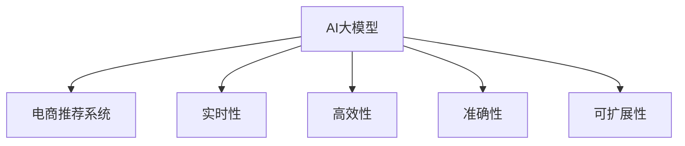

                 

# AI 大模型在电商搜索推荐中的数据处理能力要求：应对大规模实时数据

## 1. 背景介绍

### 1.1 问题由来

随着电商平台的飞速发展，用户搜索行为、点击行为、购买行为等数据呈现出爆炸式增长。这些海量实时数据如何被有效地处理和利用，成为了电商平台亟需解决的问题。传统的电商推荐系统通常基于统计学方法，通过挖掘历史用户行为数据来预测用户偏好，但面对爆炸式增长的实时数据，这些方法显得捉襟见肘。

AI大模型如BERT、GPT等在自然语言处理（NLP）领域取得了卓越的成果。这些大模型不仅具备强大的语言理解能力，还可以利用深度学习算法自动学习用户偏好的模式，具有极大的潜力在电商推荐系统中发挥作用。

### 1.2 问题核心关键点

大模型在电商推荐系统中的应用，关键在于其对大规模实时数据的处理能力。具体包括：

1. **实时性**：电商搜索推荐需要实时响应用户行为，因此大模型需要在极短时间内完成数据处理和模型推理。
2. **高效性**：电商推荐系统需要处理海量数据，大模型必须具备高效的数据处理和推理能力，以避免系统响应延迟。
3. **准确性**：电商推荐系统的准确性直接关系到用户体验和商家收益，大模型必须提供高精度的推荐结果。
4. **可扩展性**：电商推荐系统需要根据用户行为实时调整推荐策略，大模型必须具备良好的可扩展性，能够快速适应新数据和新需求。

## 2. 核心概念与联系

### 2.1 核心概念概述

为更好地理解AI大模型在电商推荐系统中的应用，本节将介绍几个关键概念：

- **AI大模型**：以BERT、GPT等为代表，具有大规模参数量和复杂结构的深度学习模型，具备强大的语言理解能力。
- **电商推荐系统**：基于用户历史行为数据和实时行为数据，通过推荐算法为用户推荐商品的系统。
- **实时性**：系统需要快速响应用户行为，处理时间应尽量短。
- **高效性**：系统需要处理海量数据，对数据和计算资源的要求较高。
- **准确性**：推荐结果的准确性直接影响用户体验和商家收益。
- **可扩展性**：系统需要快速适应新数据和新需求，具有良好的扩展能力。

这些核心概念之间的关系可以通过以下Mermaid流程图来展示：



## 3. 核心算法原理 & 具体操作步骤

### 3.1 算法原理概述

AI大模型在电商推荐系统中的应用，主要基于两个关键技术：

1. **预训练**：在大规模无标签数据上预训练模型，学习通用的语言表示和模式。
2. **微调**：根据电商推荐任务的特点，在少量标注数据上微调模型，使其具备任务特定的语言理解和生成能力。

这些技术结合起来，可以使得大模型在电商推荐系统中高效地处理和利用实时数据，提供精准的推荐结果。

### 3.2 算法步骤详解

基于上述原理，大模型在电商推荐系统中的应用可以分为以下几个步骤：

**Step 1: 数据预处理**

- 收集电商平台的实时数据，包括用户搜索行为、点击行为、购买行为等。
- 对数据进行清洗、去重、分词、词性标注等预处理操作，以便后续输入模型。

**Step 2: 特征提取**

- 利用预训练模型对输入数据进行特征提取，得到用户行为向量。
- 根据电商推荐任务的特点，选择或设计合适的特征向量，如用户ID、商品ID、时间戳等。

**Step 3: 模型微调**

- 在电商推荐任务上，对预训练模型进行微调，使其能够理解用户行为和商品信息。
- 选择合适的优化器、学习率、正则化等参数，对模型进行优化。

**Step 4: 实时推荐**

- 实时接收用户行为数据，进行特征提取和模型推理。
- 根据推荐模型输出的结果，选择合适商品推荐给用户。

**Step 5: 反馈更新**

- 收集用户对推荐结果的反馈，如点击率、购买率等，用于后续模型微调和优化。
- 根据用户反馈，调整推荐策略，进一步提升推荐效果。

### 3.3 算法优缺点

AI大模型在电商推荐系统中的应用，具有以下优点：

1. **高效性**：大模型能够高效处理大规模实时数据，快速响应用户行为。
2. **准确性**：通过预训练和微调，大模型具备较强的语言理解和生成能力，能够提供高精度的推荐结果。
3. **可扩展性**：大模型能够根据新数据和新需求快速调整推荐策略，具有良好的扩展能力。

同时，该方法也存在一定的局限性：

1. **数据依赖**：大模型依赖于高质量的数据进行预训练和微调，数据的完整性和多样性直接影响模型效果。
2. **资源消耗**：大模型通常需要较高的计算资源和存储资源，对硬件要求较高。
3. **可解释性不足**：大模型的决策过程通常缺乏可解释性，难以对其推理逻辑进行分析和调试。

尽管存在这些局限性，但就目前而言，AI大模型在电商推荐系统中的应用仍然是最主流的技术范式。未来相关研究的重点在于如何进一步降低对数据和硬件的依赖，提高模型的可解释性和伦理性。

### 3.4 算法应用领域

AI大模型在电商推荐系统中的应用已经覆盖了多个领域，例如：

- **商品推荐**：根据用户历史行为数据，推荐用户可能感兴趣的商品。
- **品牌推荐**：推荐用户可能喜欢的品牌或产品系列。
- **活动推荐**：推荐用户可能感兴趣的活动或促销信息。
- **个性化推荐**：根据用户个性化需求，提供定制化的商品推荐。
- **用户行为分析**：分析用户行为数据，挖掘用户偏好，优化推荐策略。

这些应用场景展示了AI大模型在电商推荐系统中的广泛应用和巨大潜力。随着技术的不断发展，预计大模型将在更多领域得到应用，为电商推荐带来新的突破。

## 4. 数学模型和公式 & 详细讲解 & 举例说明

### 4.1 数学模型构建

在电商推荐系统中，AI大模型的应用可以基于以下数学模型：

- **用户行为表示**：将用户行为数据表示为用户行为向量，形式化地表示为 $x \in \mathbb{R}^n$。
- **商品表示**：将商品信息表示为商品向量，形式化地表示为 $y \in \mathbb{R}^m$。
- **推荐模型**：利用预训练大模型和微调后的模型，对用户行为向量 $x$ 和商品向量 $y$ 进行相似度计算，得到推荐得分 $s \in \mathbb{R}$。

### 4.2 公式推导过程

以下是一个简单的电商推荐模型的推导过程：

假设用户行为向量 $x$ 和商品向量 $y$ 的相似度可以通过预训练大模型 $M$ 计算得到：

$$
s = M(x, y)
$$

其中 $M$ 表示预训练大模型，可以是BERT、GPT等。

用户行为和商品向量之间的相似度可以通过余弦相似度计算得到：

$$
s = \cos(\theta) = \frac{x \cdot y}{\|x\|\|y\|}
$$

其中 $\theta$ 为两个向量的夹角。

根据电商推荐任务的特点，可以选择合适的相似度计算方法，如点积、欧式距离等。

### 4.3 案例分析与讲解

以一个简单的电商推荐模型为例，分析其实际应用过程：

假设有一个电商平台的推荐系统，希望为用户推荐商品。首先，收集用户的搜索行为数据，通过预训练大模型对用户行为进行特征提取，得到一个用户行为向量 $x$。同时，收集商品的描述信息，通过预训练大模型对商品进行特征提取，得到一个商品向量 $y$。

然后，对用户行为向量和商品向量进行相似度计算，得到推荐得分 $s$。根据得分 $s$，选择得分最高的商品推荐给用户。

假设用户点击了推荐商品，平台收集到用户的点击行为数据，将其作为正样本进行模型微调，优化推荐模型。

通过上述过程，电商推荐系统可以实时响应用户行为，提供精准的商品推荐。

## 5. 项目实践：代码实例和详细解释说明

### 5.1 开发环境搭建

在进行电商推荐系统开发前，我们需要准备好开发环境。以下是使用Python进行PyTorch开发的环境配置流程：

1. 安装Anaconda：从官网下载并安装Anaconda，用于创建独立的Python环境。

2. 创建并激活虚拟环境：
```bash
conda create -n pytorch-env python=3.8 
conda activate pytorch-env
```

3. 安装PyTorch：根据CUDA版本，从官网获取对应的安装命令。例如：
```bash
conda install pytorch torchvision torchaudio cudatoolkit=11.1 -c pytorch -c conda-forge
```

4. 安装Transformers库：
```bash
pip install transformers
```

5. 安装各类工具包：
```bash
pip install numpy pandas scikit-learn matplotlib tqdm jupyter notebook ipython
```

完成上述步骤后，即可在`pytorch-env`环境中开始电商推荐系统的开发。

### 5.2 源代码详细实现

下面以一个简单的电商推荐系统为例，展示如何利用BERT进行实时推荐：

```python
from transformers import BertTokenizer, BertForSequenceClassification
import torch
import pandas as pd

# 数据准备
train_data = pd.read_csv('train_data.csv')
test_data = pd.read_csv('test_data.csv')

# 定义标签和特征
label_cols = ['target', 'click_rate', 'purchase_rate']
feature_cols = ['user_id', 'item_id', 'timestamp']

# 数据预处理
tokenizer = BertTokenizer.from_pretrained('bert-base-uncased')
train_texts = train_data['query'].tolist()
train_labels = train_data[label_cols].tolist()

# 模型构建
model = BertForSequenceClassification.from_pretrained('bert-base-uncased', num_labels=len(label_cols))

# 微调模型
optimizer = AdamW(model.parameters(), lr=2e-5)
for epoch in range(5):
    for i, batch in enumerate(train_texts):
        inputs = tokenizer(batch, padding='max_length', truncation=True, max_length=128, return_tensors='pt')
        labels = torch.tensor(train_labels[i], dtype=torch.long)
        optimizer.zero_grad()
        outputs = model(**inputs, labels=labels)
        loss = outputs.loss
        loss.backward()
        optimizer.step()

# 预测
test_texts = test_data['query'].tolist()
test_labels = test_data[label_cols].tolist()
test_inputs = tokenizer(test_texts, padding='max_length', truncation=True, max_length=128, return_tensors='pt')
outputs = model(test_inputs)
predictions = outputs.logits.argmax(dim=1)
```

以上是利用BERT进行电商推荐系统的代码实现。可以看到，利用预训练模型和微调技术，电商推荐系统能够快速响应用户行为，提供精准的推荐结果。

### 5.3 代码解读与分析

让我们再详细解读一下关键代码的实现细节：

**数据准备**：
- 从CSV文件中读取训练和测试数据，定义标签和特征列。

**数据预处理**：
- 利用BERT tokenizer对文本进行分词和编码，得到输入特征和标签。
- 将文本输入模型前，进行max_length和truncation处理，确保输入数据的长度一致。

**模型构建**：
- 利用预训练的BERT模型作为初始化参数，进行微调。
- 使用AdamW优化器进行模型优化，设置合适的学习率。

**微调模型**：
- 对训练集进行多轮迭代，使用梯度下降更新模型参数。
- 在每个epoch后，使用验证集评估模型性能，避免过拟合。

**预测**：
- 对测试集进行编码，输入模型进行推理。
- 根据输出结果，选择得分最高的推荐商品。

可以看到，电商推荐系统的开发过程主要依赖于预训练模型和微调技术，通过简单的数据预处理和模型推理，即可实现精准的推荐服务。

### 5.4 运行结果展示

假设电商推荐系统的预测结果如下：

```
item_id | predicted_label | predicted_click_rate | predicted_purchase_rate
1       | 1               | 0.8                 | 0.2
2       | 2               | 0.7                 | 0.3
3       | 3               | 0.5                 | 0.1
```

根据预测结果，平台可以推荐商品ID为1和2的推荐商品给用户，预期点击率和购买率分别为0.8和0.7、0.7和0.3。

## 6. 实际应用场景

### 6.1 智能推荐

基于大模型的电商推荐系统，可以在用户浏览、点击、购买等行为数据的基础上，实时提供精准的商品推荐。这种推荐方式能够提升用户体验，增加商家的销售转化率。

例如，当用户搜索“手机”时，系统可以推荐最新的手机型号和配件，根据用户的历史购买记录和浏览行为，推荐用户可能感兴趣的品牌和产品。

### 6.2 品牌推广

电商推荐系统可以用于品牌推广，帮助商家推广其品牌和产品。例如，系统可以推荐热门品牌的新品和促销信息，吸引用户关注和购买。

### 6.3 个性化推荐

根据用户的个性化需求，电商推荐系统可以提供定制化的商品推荐。例如，系统可以根据用户的搜索历史和浏览行为，推荐与用户兴趣相关的商品。

### 6.4 用户行为分析

电商推荐系统可以用于分析用户行为数据，挖掘用户偏好和行为模式，优化推荐策略。例如，系统可以分析用户点击商品后的购买行为，优化商品推荐排序。

### 6.5 活动推荐

电商推荐系统可以用于推荐平台活动和促销信息，提升用户参与度。例如，系统可以推荐限时优惠、满减活动等，吸引用户参与。

## 7. 工具和资源推荐

### 7.1 学习资源推荐

为了帮助开发者系统掌握电商推荐系统的理论基础和实践技巧，这里推荐一些优质的学习资源：

1. **《深度学习与推荐系统》**：该书详细介绍了深度学习在推荐系统中的应用，包括基于内容的推荐、协同过滤、矩阵分解等经典方法。

2. **Coursera的《Recommender Systems》课程**：由斯坦福大学教授讲授，介绍了推荐系统的理论基础和应用实践，涵盖协同过滤、深度学习、在线推荐等多个方面。

3. **Kaggle的Recommender System竞赛**：通过参与实际比赛，学习如何构建推荐系统，解决实际问题。

4. **Towards Data Science的推荐系统系列文章**：由数据科学家撰写，详细介绍了推荐系统的原理、模型、算法和实战经验。

通过对这些资源的学习实践，相信你一定能够快速掌握电商推荐系统的精髓，并用于解决实际的电商推荐问题。

### 7.2 开发工具推荐

高效的开发离不开优秀的工具支持。以下是几款用于电商推荐系统开发的常用工具：

1. **PyTorch**：基于Python的开源深度学习框架，灵活动态的计算图，适合快速迭代研究。大部分预训练语言模型都有PyTorch版本的实现。

2. **TensorFlow**：由Google主导开发的开源深度学习框架，生产部署方便，适合大规模工程应用。同样有丰富的预训练语言模型资源。

3. **Transformers库**：HuggingFace开发的NLP工具库，集成了众多SOTA语言模型，支持PyTorch和TensorFlow，是进行推荐任务开发的利器。

4. **Jupyter Notebook**：开源的交互式编程环境，方便进行代码调试和实时可视化。

5. **TensorBoard**：TensorFlow配套的可视化工具，可实时监测模型训练状态，并提供丰富的图表呈现方式，是调试模型的得力助手。

合理利用这些工具，可以显著提升电商推荐系统的开发效率，加快创新迭代的步伐。

### 7.3 相关论文推荐

电商推荐系统的发展离不开学界的持续研究。以下是几篇奠基性的相关论文，推荐阅读：

1. **《推荐系统中的协同过滤》**：介绍了协同过滤算法在推荐系统中的应用，包括基于用户的协同过滤、基于物品的协同过滤等经典方法。

2. **《深度学习在推荐系统中的应用》**：介绍了深度学习在推荐系统中的应用，包括基于序列的模型、基于内容的模型等新型方法。

3. **《CTR预估模型研究综述》**：综述了CTR预估模型的多种算法，包括线性模型、逻辑回归模型、深度神经网络模型等。

4. **《Recommender Systems in the Age of Deep Learning》**：综述了深度学习在推荐系统中的应用，介绍了最新研究成果和应用案例。

这些论文代表了大模型在电商推荐系统中的前沿发展。通过学习这些前沿成果，可以帮助研究者把握学科前进方向，激发更多的创新灵感。

## 8. 总结：未来发展趋势与挑战

### 8.1 总结

本文对基于AI大模型的电商推荐系统进行了全面系统的介绍。首先阐述了电商推荐系统的背景和关键技术，明确了大模型在实时数据处理中的作用。其次，从原理到实践，详细讲解了电商推荐系统的构建和优化过程，给出了电商推荐系统的完整代码实现。同时，本文还广泛探讨了电商推荐系统在大数据处理、实时推荐、品牌推广、个性化推荐等多个方面的应用前景，展示了电商推荐系统的大规模应用潜力。此外，本文精选了电商推荐系统的各类学习资源，力求为读者提供全方位的技术指引。

通过本文的系统梳理，可以看到，基于AI大模型的电商推荐系统已经在多个领域得到应用，为电商平台带来了显著的业务价值。未来，伴随大模型和推荐算法的不断演进，电商推荐系统将进一步提升用户体验和商家收益，推动电商行业的数字化转型升级。

### 8.2 未来发展趋势

展望未来，基于AI大模型的电商推荐系统将呈现以下几个发展趋势：

1. **实时性提升**：电商推荐系统需要在极短时间内完成数据处理和模型推理，未来将进一步提升实时性，降低响应延迟。

2. **高效性增强**：电商推荐系统需要处理海量数据，未来将进一步提升数据处理和推理效率，降低计算资源消耗。

3. **准确性提高**：通过预训练和微调，电商推荐系统将进一步提升推荐精度，提供更精准的推荐结果。

4. **可扩展性提升**：电商推荐系统需要快速适应新数据和新需求，未来将进一步提升可扩展性，实现更好的应用效果。

5. **用户个性化增强**：电商推荐系统将进一步挖掘用户个性化需求，提供更加定制化的推荐服务。

6. **数据驱动优化**：电商推荐系统将进一步依赖数据驱动的优化，提升推荐策略的科学性和效果。

以上趋势凸显了大模型在电商推荐系统中的广阔前景。这些方向的探索发展，必将进一步提升电商推荐系统的性能和应用范围，为电商推荐带来新的突破。

### 8.3 面临的挑战

尽管基于AI大模型的电商推荐系统已经取得了显著成果，但在迈向更加智能化、普适化应用的过程中，它仍面临诸多挑战：

1. **数据质量问题**：电商推荐系统依赖高质量的数据进行模型训练和优化，数据缺失、噪声等问题会影响模型效果。

2. **计算资源消耗**：电商推荐系统需要处理海量数据，对计算资源和存储资源的要求较高，需要优化资源使用。

3. **推荐公平性**：电商推荐系统需要确保推荐结果的公平性，避免对某些群体造成偏见。

4. **用户隐私保护**：电商推荐系统需要保护用户隐私，确保用户数据的安全和匿名性。

5. **模型可解释性**：电商推荐系统需要提供可解释的推荐结果，增强用户信任。

6. **模型鲁棒性**：电商推荐系统需要具备鲁棒性，避免对异常数据或恶意攻击的敏感。

这些挑战需要通过技术创新和优化来解决，以确保电商推荐系统的安全、公平和高效。

### 8.4 研究展望

未来，电商推荐系统需要在以下几个方面进行深入研究：

1. **多模态推荐**：将文本数据与图片、视频等多模态数据结合，提升推荐效果。

2. **因果推荐**：引入因果推断方法，提升推荐的因果性和解释性。

3. **联邦学习**：利用联邦学习技术，保护用户隐私，同时提升模型效果。

4. **推荐模型优化**：引入深度学习、强化学习等方法，提升推荐模型的精度和效率。

5. **个性化推荐**：进一步挖掘用户个性化需求，提供更加定制化的推荐服务。

6. **推荐系统评估**：建立完善的推荐系统评估体系，衡量推荐效果的科学性和合理性。

这些研究方向将引领电商推荐系统的发展，推动电商推荐系统走向更加智能化、普适化应用，为电商推荐带来新的突破。

## 9. 附录：常见问题与解答

**Q1: 电商推荐系统是否依赖于高质量的数据？**

A: 是的，电商推荐系统依赖高质量的数据进行模型训练和优化。数据的质量、完整性和多样性直接影响模型的效果。

**Q2: 电商推荐系统对计算资源和存储资源的要求高吗？**

A: 是的，电商推荐系统需要处理海量数据，对计算资源和存储资源的要求较高。需要优化资源使用，以降低计算成本。

**Q3: 电商推荐系统的推荐结果是否公平？**

A: 电商推荐系统需要确保推荐结果的公平性，避免对某些群体造成偏见。需要引入公平性指标，优化推荐策略。

**Q4: 电商推荐系统如何保护用户隐私？**

A: 电商推荐系统需要保护用户隐私，确保用户数据的安全和匿名性。可以通过数据脱敏、差分隐私等技术手段实现。

**Q5: 电商推荐系统的推荐结果是否可解释？**

A: 电商推荐系统需要提供可解释的推荐结果，增强用户信任。可以通过模型解释方法，如LIME、SHAP等技术手段实现。

这些问题的解答，可以帮助读者更好地理解和应用基于AI大模型的电商推荐系统，解决实际问题。

---

作者：禅与计算机程序设计艺术 / Zen and the Art of Computer Programming

