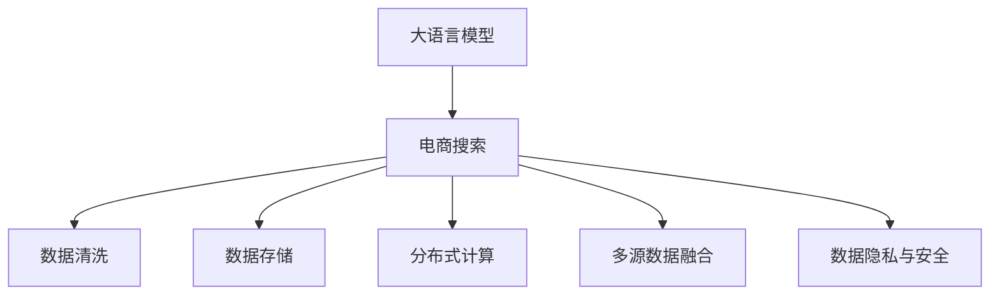

                 

# AI 大模型在电商搜索推荐中的数据处理能力要求：应对大规模数据挑战

> 关键词：大语言模型,电商搜索,推荐系统,数据处理,数据清洗,数据存储,大数据技术,分布式计算

## 1. 背景介绍

### 1.1 问题由来
近年来，人工智能技术在电商领域的应用日益深入，特别是在搜索推荐系统（Search and Recommendation System, SRS）中，AI技术带来了显著的性能提升和用户满意度提高。以大语言模型为代表的人工智能技术，通过预训练的方式学习了大量无标签文本数据，可以自动地从海量数据中抽取关键信息，预测用户的浏览和购买行为。然而，电商领域的数据具有海量化、实时化和复杂化等特点，对大语言模型的数据处理能力提出了极高的要求。

### 1.2 问题核心关键点
大语言模型在电商搜索推荐中的应用，其核心在于能够高效、准确地处理和利用海量数据。具体来说，需要解决以下几个关键问题：
1. **数据清洗和预处理**：电商平台的数据通常包含大量噪声和错误，需要清洗和标准化。
2. **数据存储和检索**：需要构建高效的数据存储和检索系统，支持实时查询和快速响应。
3. **分布式计算**：大规模数据集的处理需要分布式计算技术支持，以提高计算效率。
4. **多源数据融合**：需要整合来自不同渠道的多种数据源，构建统一的视图。
5. **数据隐私与安全**：在处理用户数据时，需要确保数据的安全性和隐私保护。

### 1.3 问题研究意义
研究大语言模型在电商搜索推荐中的数据处理能力，对于提升电商平台的运营效率、提高用户体验、增强市场竞争力具有重要意义：

1. **提高运营效率**：通过智能化的搜索推荐系统，能够快速响应用户需求，优化库存管理和供应链调度。
2. **提升用户体验**：个性化推荐可以提升用户的浏览和购买体验，提高用户满意度。
3. **增强市场竞争力**：精准的搜索推荐能够帮助电商平台更好地理解用户需求，优化产品策略，提高转化率和客户留存率。

## 2. 核心概念与联系

### 2.1 核心概念概述

为更好地理解大语言模型在电商搜索推荐中的数据处理能力，本节将介绍几个密切相关的核心概念：

- **大语言模型（Large Language Model, LLM）**：以自回归（如GPT）或自编码（如BERT）模型为代表的大规模预训练语言模型。通过在大规模无标签文本数据上进行预训练，学习到丰富的语言知识和常识，具备强大的语言理解和生成能力。

- **电商搜索推荐系统（E-Commerce Search and Recommendation System, SRS）**：利用人工智能技术，通过用户行为数据分析，实现商品搜索和个性化推荐，提升用户体验和运营效率的电商平台系统。

- **数据清洗和预处理**：在数据输入模型之前，对原始数据进行去重、去噪、标准化等操作，以提高数据质量。

- **数据存储和检索**：构建高效的数据存储和检索系统，支持数据的高效管理和快速访问。

- **分布式计算**：利用多台计算机协同计算，提高数据处理和模型训练的效率。

- **多源数据融合**：整合来自不同渠道的数据源，构建统一的视图，以供模型训练和应用。

- **数据隐私与安全**：在处理用户数据时，确保数据的安全性和隐私保护，避免数据泄露和滥用。

这些核心概念之间的逻辑关系可以通过以下Mermaid流程图来展示：



这个流程图展示了大语言模型在电商搜索推荐中的应用流程：

1. 大语言模型通过预训练获得基础能力。
2. 电商搜索推荐系统整合原始数据，进行清洗和预处理。
3. 数据存储和检索支持系统的高效数据管理。
4. 分布式计算提供高效率的计算支持。
5. 多源数据融合构建统一的视图，供模型训练和应用。
6. 数据隐私与安全确保数据安全，避免滥用。

## 3. 核心算法原理 & 具体操作步骤

### 3.1 算法原理概述

大语言模型在电商搜索推荐中的数据处理能力，主要体现在对海量数据的快速处理、清洗和分析。具体来说，涉及以下几个关键步骤：

- **数据采集**：从电商平台中收集用户行为数据、商品信息、评论数据等。
- **数据清洗**：去除噪声、处理缺失值、标准化数据格式。
- **数据存储**：构建高效的数据存储和检索系统，支持实时查询和快速响应。
- **分布式计算**：利用多台计算机协同计算，提高数据处理和模型训练的效率。
- **模型训练**：使用预训练的大语言模型，通过微调和优化，适应电商搜索推荐任务。

### 3.2 算法步骤详解

#### 3.2.1 数据采集

电商平台的原始数据通常来自多个渠道，包括用户的搜索历史、浏览记录、点击记录、购买记录、评论记录等。数据采集过程需要确保数据的全面性和实时性，可以使用Flume、Kafka等数据流处理工具，实时采集并存储数据。

#### 3.2.2 数据清洗

数据清洗是数据处理的重要环节，电商平台的原始数据通常包含大量噪声和错误，需要进行以下操作：

- **去重去噪**：去除重复数据和噪声数据，避免数据冗余和错误干扰。
- **处理缺失值**：对缺失值进行填充或删除，确保数据完整性。
- **标准化数据格式**：统一数据格式和编码方式，避免数据格式不一致。

数据清洗的过程可以采用ETL（Extract, Transform, Load）工具，如Apache NiFi、Talend等，自动化地完成数据清洗任务。

#### 3.2.3 数据存储

电商平台的搜索推荐系统需要处理大量的历史和实时数据，数据存储和检索系统必须高效可靠。可以使用分布式存储系统，如Hadoop HDFS、Apache Cassandra等，支持海量数据的存储和检索。

#### 3.2.4 分布式计算

电商平台的搜索推荐系统需要处理海量数据，分布式计算是必不可少的。可以使用Hadoop、Spark等分布式计算框架，实现高效的并行计算。

#### 3.2.5 模型训练

电商平台的搜索推荐系统需要定期训练大语言模型，以适应新的数据和用户行为。可以使用TensorFlow、PyTorch等深度学习框架，实现模型的训练和微调。

### 3.3 算法优缺点

大语言模型在电商搜索推荐中的数据处理能力，具有以下优点：

- **高效性**：能够快速处理海量数据，支持实时查询和快速响应。
- **准确性**：通过预训练和微调，模型能够准确地理解用户需求和商品特性，提高推荐准确性。
- **可扩展性**：分布式计算框架支持系统的高性能扩展，适应数据规模的增长。

然而，也存在一些缺点：

- **数据依赖**：对数据质量有较高要求，数据清洗和预处理需要投入大量人力和资源。
- **计算资源消耗**：分布式计算需要大量计算资源，系统维护成本较高。
- **模型复杂度**：大规模模型的训练和微调需要较长的训练时间和较多的计算资源。

### 3.4 算法应用领域

大语言模型在电商搜索推荐中的应用，已经广泛应用于多个领域：

- **个性化推荐**：通过用户行为数据分析，实现商品的个性化推荐。
- **搜索排序**：根据用户搜索词，智能排序商品列表，提升用户体验。
- **库存管理**：通过预测商品需求，优化库存管理和供应链调度。
- **客户分析**：分析用户行为数据，进行用户画像和行为预测。
- **广告投放**：根据用户行为数据，优化广告投放策略，提高广告效果。

## 4. 数学模型和公式 & 详细讲解 & 举例说明

### 4.1 数学模型构建

大语言模型在电商搜索推荐中的应用，主要基于深度学习模型的结构。以点击率预测任务为例，可以构建如下的数学模型：

设用户访问商品的概率为 $P$，商品点击率 $C$，则有：

$$
P = \frac{1}{1 + e^{-\mathbf{w}^T \mathbf{x} + b}}
$$

其中，$\mathbf{w}$ 为模型参数，$\mathbf{x}$ 为商品特征向量，$b$ 为偏置项。通过训练模型，最小化损失函数，得到最优的 $\mathbf{w}$ 和 $b$。

### 4.2 公式推导过程

以点击率预测任务为例，公式推导如下：

设用户访问商品的概率为 $P$，商品点击率 $C$，则有：

$$
P = \frac{1}{1 + e^{-\mathbf{w}^T \mathbf{x} + b}}
$$

其中，$\mathbf{w}$ 为模型参数，$\mathbf{x}$ 为商品特征向量，$b$ 为偏置项。

通过训练模型，最小化损失函数：

$$
L = \frac{1}{N} \sum_{i=1}^N (C_i - P_i)^2
$$

其中，$C_i$ 为商品 $i$ 的实际点击率，$P_i$ 为模型预测的概率。

使用梯度下降法，更新模型参数：

$$
\mathbf{w} \leftarrow \mathbf{w} - \eta \nabla_{\mathbf{w}} L
$$

其中，$\eta$ 为学习率。

### 4.3 案例分析与讲解

以用户行为分析为例，可以使用序列模型（如LSTM、GRU）进行用户行为的序列预测。假设用户行为序列为 $x_1, x_2, \ldots, x_t$，模型预测用户下一行为 $x_{t+1}$，则可以构建如下的数学模型：

$$
P(x_{t+1} | x_1, x_2, \ldots, x_t) = \frac{e^{\mathbf{w}^T \mathbf{h}_t}}{\sum_{i=1}^{n} e^{\mathbf{w}^T \mathbf{h}_i}}
$$

其中，$\mathbf{h}_t$ 为模型在时刻 $t$ 的隐状态，$n$ 为时间步数。通过训练模型，最小化损失函数：

$$
L = \frac{1}{N} \sum_{i=1}^N (y_i - P_i)^2
$$

其中，$y_i$ 为用户实际行为 $x_{t+1}$，$P_i$ 为模型预测的概率。

## 5. 项目实践：代码实例和详细解释说明

### 5.1 开发环境搭建

在进行项目实践前，我们需要准备好开发环境。以下是使用Python进行TensorFlow开发的环境配置流程：

1. 安装Anaconda：从官网下载并安装Anaconda，用于创建独立的Python环境。

2. 创建并激活虚拟环境：
```bash
conda create -n tf-env python=3.8 
conda activate tf-env
```

3. 安装TensorFlow：根据CUDA版本，从官网获取对应的安装命令。例如：
```bash
conda install tensorflow -c tf
```

4. 安装TensorFlow Addons：
```bash
conda install -c conda-forge tensorflow-io
```

5. 安装各类工具包：
```bash
pip install numpy pandas scikit-learn matplotlib tqdm jupyter notebook ipython
```

完成上述步骤后，即可在`tf-env`环境中开始项目实践。

### 5.2 源代码详细实现

下面我们以电商搜索推荐系统为例，给出使用TensorFlow构建推荐模型的PyTorch代码实现。

首先，定义推荐模型的数据处理函数：

```python
import tensorflow as tf
from tensorflow.keras.preprocessing import sequence
from tensorflow.keras.layers import Input, Embedding, LSTM, Dense

def build_model(vocab_size, sequence_length, embedding_dim):
    inputs = Input(shape=(sequence_length,))
    embeddings = Embedding(vocab_size, embedding_dim)(inputs)
    lstm = LSTM(128)(embeddings)
    outputs = Dense(1, activation='sigmoid')(lstm)
    model = tf.keras.Model(inputs=inputs, outputs=outputs)
    return model
```

然后，定义模型的训练和评估函数：

```python
def train_model(model, train_data, validation_data, batch_size, epochs):
    model.compile(optimizer='adam', loss='binary_crossentropy', metrics=['accuracy'])
    history = model.fit(train_data, validation_data, batch_size=batch_size, epochs=epochs, verbose=1)
    return history

def evaluate_model(model, test_data):
    test_loss, test_acc = model.evaluate(test_data)
    print(f'Test accuracy: {test_acc:.4f}')
```

最后，启动训练流程并在测试集上评估：

```python
model = build_model(vocab_size=10000, sequence_length=20, embedding_dim=128)
history = train_model(model, train_data, validation_data, batch_size=32, epochs=10)

test_data = ...
evaluate_model(model, test_data)
```

以上就是使用TensorFlow对电商搜索推荐系统进行建模的完整代码实现。可以看到，利用TensorFlow的高级API，我们可以快速构建和训练推荐模型，处理用户行为数据。

### 5.3 代码解读与分析

让我们再详细解读一下关键代码的实现细节：

**build_model函数**：
- `Input`层：定义输入数据的形状和数据类型。
- `Embedding`层：将输入数据转换为向量表示。
- `LSTM`层：定义长短期记忆网络，处理序列数据。
- `Dense`层：定义全连接层，输出预测结果。
- `Model`层：将输入和输出连接起来，定义完整的推荐模型。

**train_model函数**：
- `compile`方法：定义优化器、损失函数和评估指标。
- `fit`方法：训练模型，记录训练过程中的各种指标。

**evaluate_model函数**：
- `evaluate`方法：在测试集上评估模型性能。

**train_data和validation_data**：
- 原始数据通常为序列形式，需要通过 `sequence.pad_sequences` 进行填充，转化为固定长度的序列数据。

在实际应用中，还需要根据具体业务需求，对模型进行进一步的优化和调整，如增加数据增强、正则化等策略，以提高模型性能。

## 6. 实际应用场景

### 6.1 智能推荐系统

智能推荐系统是电商搜索推荐的核心应用场景，通过分析用户历史行为和实时行为，为用户推荐感兴趣的商品。智能推荐系统能够大幅提升用户体验和商品转化率。

在技术实现上，可以收集用户的搜索历史、浏览记录、点击记录、购买记录等行为数据，构建用户行为序列。将用户行为序列作为输入，预测用户对每个商品感兴趣的概率，再根据用户偏好排序，生成个性化推荐列表。通过构建推荐模型，能够实现高效、准确、个性化的推荐服务。

### 6.2 实时搜索排序

实时搜索排序是电商搜索推荐的重要功能，能够根据用户的实时搜索词，动态调整搜索结果排序。实时搜索排序能够提高用户的搜索体验，缩短搜索时间。

在技术实现上，可以使用TF-IDF、BM25等算法，计算商品与搜索词的匹配度。根据匹配度对商品进行排序，生成实时搜索结果列表。利用分布式计算框架，实现高效的实时搜索排序功能。

### 6.3 库存管理和供应链优化

库存管理和供应链优化是电商搜索推荐的重要应用场景，能够帮助电商平台优化库存管理和供应链调度，降低库存成本和运输成本。

在技术实现上，可以收集商品的销售数据和库存数据，预测商品的需求量。根据需求量优化库存管理和供应链调度，确保商品能够及时供货，减少缺货和积压。

### 6.4 用户画像和行为预测

用户画像和行为预测是电商搜索推荐的重要应用场景，能够帮助电商平台更好地理解用户需求，制定更加个性化的营销策略。

在技术实现上，可以收集用户的历史行为数据和社交媒体数据，分析用户画像和行为模式。根据用户画像和行为模式，预测用户的未来行为，制定个性化的营销策略，提高用户转化率和客户留存率。

## 7. 工具和资源推荐

### 7.1 学习资源推荐

为了帮助开发者系统掌握大语言模型在电商搜索推荐中的应用，这里推荐一些优质的学习资源：

1. 《TensorFlow实战》系列博文：由TensorFlow官方团队撰写，介绍了TensorFlow的基本用法和高级特性，适合初学者和中级开发者。

2. CS231n《深度学习应用于计算机视觉》课程：斯坦福大学开设的深度学习课程，涵盖深度学习在计算机视觉中的应用，包括数据预处理、模型构建、训练和优化等。

3. 《Natural Language Processing with TensorFlow》书籍：TensorFlow官方团队编写的TensorFlow在NLP中的应用指南，适合想要深入学习TensorFlow在NLP领域应用的开发者。

4. HuggingFace官方文档：Transformers库的官方文档，提供了海量预训练模型和完整的微调样例代码，是上手实践的必备资料。

5. Kaggle：全球最大的数据科学竞赛平台，提供大量电商搜索推荐相关的数据集和案例，供开发者学习和实践。

通过对这些资源的学习实践，相信你一定能够快速掌握大语言模型在电商搜索推荐中的应用，并用于解决实际的NLP问题。

### 7.2 开发工具推荐

高效的开发离不开优秀的工具支持。以下是几款用于大语言模型在电商搜索推荐中应用开发的常用工具：

1. TensorFlow：由Google主导开发的开源深度学习框架，生产部署方便，适合大规模工程应用。支持多种分布式计算框架，如TensorFlow分布式策略、TensorFlow Dataflow等。

2. PyTorch：基于Python的开源深度学习框架，灵活动态的计算图，适合快速迭代研究。提供丰富的预训练语言模型资源，如BERT、GPT等。

3. TensorFlow Addons：TensorFlow的扩展库，提供多种高级API和工具，如TensorFlow Data Validation、TensorFlow Federated等，方便开发者构建复杂的应用系统。

4. Apache NiFi：数据流处理工具，支持数据的采集、转换、存储和分析，适用于电商搜索推荐系统的大数据处理。

5. Apache Kafka：消息队列系统，支持海量数据的实时采集和处理，适用于电商搜索推荐系统的实时数据处理。

6. Elasticsearch：分布式搜索和分析引擎，支持多模态数据的存储和检索，适用于电商搜索推荐系统的搜索结果排序。

合理利用这些工具，可以显著提升电商搜索推荐系统的开发效率，加快创新迭代的步伐。

### 7.3 相关论文推荐

大语言模型在电商搜索推荐中的应用，源于学界的持续研究。以下是几篇奠基性的相关论文，推荐阅读：

1. Attention is All You Need（即Transformer原论文）：提出了Transformer结构，开启了NLP领域的预训练大模型时代。

2. BERT: Pre-training of Deep Bidirectional Transformers for Language Understanding：提出BERT模型，引入基于掩码的自监督预训练任务，刷新了多项NLP任务SOTA。

3. Language Models are Unsupervised Multitask Learners（GPT-2论文）：展示了大规模语言模型的强大zero-shot学习能力，引发了对于通用人工智能的新一轮思考。

4. Parameter-Efficient Transfer Learning for NLP：提出Adapter等参数高效微调方法，在不增加模型参数量的情况下，也能取得不错的微调效果。

5. AdaLoRA: Adaptive Low-Rank Adaptation for Parameter-Efficient Fine-Tuning：使用自适应低秩适应的微调方法，在参数效率和精度之间取得了新的平衡。

6. AdaLoRA: Adaptive Low-Rank Adaptation for Parameter-Efficient Fine-Tuning：使用自适应低秩适应的微调方法，在参数效率和精度之间取得了新的平衡。

这些论文代表了大语言模型在电商搜索推荐中的数据处理能力的研究进展。通过学习这些前沿成果，可以帮助研究者把握学科前进方向，激发更多的创新灵感。

## 8. 总结：未来发展趋势与挑战

### 8.1 总结

本文对大语言模型在电商搜索推荐中的应用进行了全面系统的介绍。首先阐述了大语言模型和电商搜索推荐系统的研究背景和意义，明确了数据处理能力在大模型应用中的核心价值。其次，从原理到实践，详细讲解了电商搜索推荐系统中的数据处理过程，给出了数据处理任务开发的完整代码实例。同时，本文还广泛探讨了数据处理能力在电商搜索推荐中的实际应用场景，展示了其广阔的应用前景。最后，本文精选了数据处理能力相关的学习资源，力求为读者提供全方位的技术指引。

通过本文的系统梳理，可以看到，大语言模型在电商搜索推荐中的数据处理能力具有重要的实际应用价值，对于提升电商平台的运营效率、提高用户体验、增强市场竞争力具有重要意义。未来，伴随大语言模型和数据处理技术的不断演进，电商搜索推荐系统必将在更加智能化、普适化应用中发挥更加重要的作用。

### 8.2 未来发展趋势

展望未来，大语言模型在电商搜索推荐中的应用，将呈现以下几个发展趋势：

1. **高效处理大规模数据**：随着计算能力的提升，大语言模型将能够更高效地处理大规模数据，支持实时查询和快速响应。

2. **多模态融合**：未来的推荐系统将不仅考虑文本信息，还会整合视觉、听觉等多种模态的信息，构建更全面、更丰富的用户画像。

3. **跨领域迁移学习**：大语言模型将具备更强的跨领域迁移能力，能够在不同的电商领域快速适应和优化。

4. **模型压缩与量化**：为了减少计算资源消耗，未来的模型将更加注重压缩和量化，以适应更多的应用场景。

5. **可解释性与透明性**：未来的推荐系统将更加注重模型的可解释性，通过可视化工具和解释性方法，让用户了解推荐结果的来源和逻辑。

6. **联邦学习**：未来的推荐系统将使用联邦学习等分布式机器学习技术，保护用户隐私和数据安全。

以上趋势凸显了大语言模型在电商搜索推荐中的数据处理能力的广阔前景。这些方向的探索发展，必将进一步提升推荐系统的性能和应用范围，为电商平台的数字化转型提供更强大的技术支持。

### 8.3 面临的挑战

尽管大语言模型在电商搜索推荐中的应用已经取得了一定的成果，但在迈向更加智能化、普适化应用的过程中，它仍面临着诸多挑战：

1. **数据质量问题**：电商平台的原始数据通常包含大量噪声和错误，需要清洗和标准化，处理复杂且耗时。

2. **计算资源消耗**：大规模模型的训练和微调需要较长的训练时间和较多的计算资源，系统维护成本较高。

3. **模型可扩展性**：随着数据规模的增长，系统的扩展性需要进一步提升，以支持更多的并发请求。

4. **用户隐私与安全**：在处理用户数据时，需要确保数据的安全性和隐私保护，避免数据泄露和滥用。

5. **数据存储与检索**：电商平台的搜索推荐系统需要处理大量的历史和实时数据，数据存储和检索系统的效率和稳定性需要进一步提升。

6. **模型优化与调优**：未来的模型将更加复杂，模型优化和调优工作将更具挑战性。

正视数据处理能力面临的这些挑战，积极应对并寻求突破，将是大语言模型在电商搜索推荐中走向成熟的必由之路。相信随着学界和产业界的共同努力，这些挑战终将一一被克服，大语言模型必将在构建更加智能、高效、安全的电商搜索推荐系统中发挥更重要的作用。

### 8.4 研究展望

面对大语言模型在电商搜索推荐中数据处理能力所面临的挑战，未来的研究需要在以下几个方面寻求新的突破：

1. **优化数据清洗与预处理**：研究更高效的数据清洗与预处理算法，降低数据处理成本，提高数据质量。

2. **提升计算效率**：研究分布式计算和模型压缩技术，减少计算资源消耗，提高系统扩展性。

3. **增强数据安全与隐私保护**：研究数据加密、差分隐私等技术，确保数据安全与隐私保护。

4. **构建多模态融合模型**：研究如何整合视觉、听觉等多种模态的信息，构建更全面、更丰富的用户画像。

5. **优化推荐模型与算法**：研究更高效的推荐模型与算法，提高推荐准确性和个性化程度。

6. **发展联邦学习与边缘计算**：研究联邦学习、边缘计算等分布式机器学习技术，实现更高效、安全的数据处理与模型训练。

这些研究方向的探索，必将引领大语言模型在电商搜索推荐中的应用迈向更高的台阶，为电商平台的数字化转型提供更强大的技术支持。面向未来，大语言模型在电商搜索推荐中的数据处理能力还需要与其他人工智能技术进行更深入的融合，如知识表示、因果推理、强化学习等，多路径协同发力，共同推动电商搜索推荐系统的进步。只有勇于创新、敢于突破，才能不断拓展语言模型的边界，让智能技术更好地造福人类社会。

## 9. 附录：常见问题与解答

**Q1：电商搜索推荐系统中的数据处理与模型训练是否有先后顺序？**

A: 在电商搜索推荐系统中，数据处理与模型训练是一个迭代过程。数据处理的结果直接影响模型的训练效果，而模型的训练结果又反过来影响数据处理的策略。因此，数据处理与模型训练需要协同进行，不断优化迭代，才能达到最佳的效果。

**Q2：电商搜索推荐系统中的数据清洗和预处理主要有哪些步骤？**

A: 电商搜索推荐系统中的数据清洗和预处理主要包括以下步骤：
1. 去重去噪：去除重复数据和噪声数据，避免数据冗余和错误干扰。
2. 处理缺失值：对缺失值进行填充或删除，确保数据完整性。
3. 标准化数据格式：统一数据格式和编码方式，避免数据格式不一致。
4. 数据分割：将数据划分为训练集、验证集和测试集，用于模型训练和评估。
5. 数据增强：通过回译、近义替换等方式扩充训练集，提高模型泛化能力。

**Q3：如何优化电商搜索推荐系统中的模型训练过程？**

A: 电商搜索推荐系统中的模型训练过程可以优化如下：
1. 选择适合的优化器：如Adam、SGD等，选择合适的学习率。
2. 引入正则化技术：如L2正则、Dropout、Early Stopping等，防止模型过拟合。
3. 使用分布式计算：利用多台计算机协同计算，提高计算效率。
4. 采用数据增强技术：通过回译、近义替换等方式扩充训练集，提高模型泛化能力。
5. 定期评估模型性能：在训练过程中，定期在验证集上评估模型性能，及时调整训练策略。

**Q4：电商搜索推荐系统中的数据隐私与安全如何保障？**

A: 电商搜索推荐系统中的数据隐私与安全保障主要包括以下措施：
1. 数据加密：对存储和传输的数据进行加密处理，防止数据泄露。
2. 差分隐私：使用差分隐私技术，在保护数据隐私的前提下，提供可用的统计信息。
3. 访问控制：设置严格的访问权限，确保只有授权人员才能访问敏感数据。
4. 数据匿名化：对数据进行匿名化处理，保护用户隐私。
5. 安全审计：定期进行安全审计，发现和修复系统漏洞。

通过以上措施，可以确保电商搜索推荐系统中的数据隐私与安全得到充分保障。

---

作者：禅与计算机程序设计艺术 / Zen and the Art of Computer Programming

