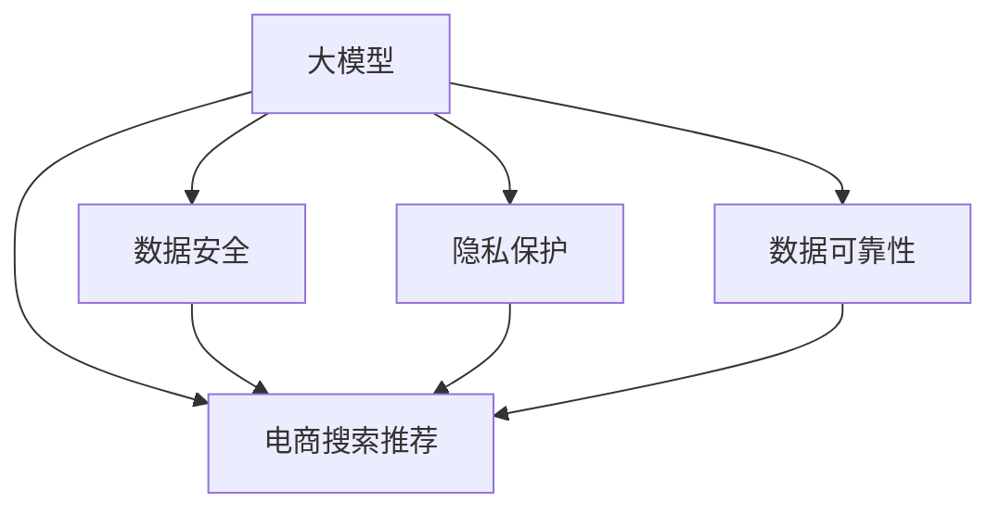

                 

## 1. 背景介绍

在数字化转型浪潮中，电商平台已成为网民消费决策的重要平台，其推荐的精准度直接关系到用户体验和商家转化率。传统的推荐系统基于协同过滤、内容推荐等算法，依赖用户行为数据进行模型训练和推荐。然而，用户数据隐私保护和数据可靠性问题始终是推荐系统面临的挑战。随着AI大模型的兴起，利用其预训练能力在电商搜索推荐中引入大模型，既能提升推荐质量，又能兼顾用户隐私和数据可靠性。本文将系统介绍AI大模型在电商搜索推荐中的应用策略，涵盖数据安全、隐私保护、模型优化等方面，为电商平台的智能化升级提供参考。

## 2. 核心概念与联系

### 2.1 核心概念概述

在探讨大模型在电商搜索推荐中的应用前，我们需要首先了解几个核心概念：

1. **大模型 (Large Model)**：指具有大规模参数、广泛应用于自然语言处理、计算机视觉、语音识别等领域的深度学习模型，如BERT、GPT、DALL·E等。

2. **电商搜索推荐 (E-commerce Search and Recommendation)**：基于用户搜索行为和历史浏览数据，向用户推荐商品的电商平台功能，旨在提升用户体验和转化率。

3. **数据安全 (Data Security)**：指在数据存储、传输、处理等环节中，采取一系列措施确保数据的保密性、完整性、可用性和可控性。

4. **隐私保护 (Privacy Protection)**：涉及在数据收集、存储和使用过程中，保护用户个人信息的安全，避免数据滥用和泄露。

5. **数据可靠性 (Data Reliability)**：确保数据的质量和一致性，避免因数据错误、偏差等问题导致的推荐错误。

这些概念之间的联系可以通过以下Mermaid流程图来展示：



此图展示了大模型如何通过数据安全、隐私保护和数据可靠性等措施，提升电商搜索推荐系统的质量和用户体验。

## 3. 核心算法原理 & 具体操作步骤

### 3.1 算法原理概述

AI大模型在电商搜索推荐中的应用主要依赖其预训练能力。通过在大规模无标签数据上进行预训练，大模型能够学习到丰富的语言和图像特征，这些特征在电商推荐场景中同样适用。具体而言，大模型在电商搜索推荐中的应用流程如下：

1. **预训练**：在电商平台上的用户行为数据上进行预训练，学习到商品、用户、商品描述等内容的表征。

2. **微调**：基于电商搜索推荐任务，对预训练模型进行微调，调整其输出层和损失函数，使其能够更好地匹配电商推荐场景。

3. **推理**：在推荐场景中，使用微调后的模型对用户输入的搜索查询进行处理，预测最相关的商品，提供推荐结果。

### 3.2 算法步骤详解

1. **数据准备**：收集电商平台的搜索查询、浏览记录、购买记录等数据，清洗和预处理数据集。

2. **模型选择与预训练**：选择合适的预训练模型，如BERT、GPT-3、ViT等，在电商数据集上进行预训练。预训练时，可以采用自监督任务，如掩码语言模型、Next Sentence Prediction等。

3. **微调**：设计电商推荐任务的输出层和损失函数。输出层通常为softmax层，损失函数为交叉熵损失。微调时，设定合适的学习率、批大小、迭代轮数等超参数。

4. **推理与优化**：在推荐场景中，将用户输入的搜索查询输入微调后的模型，获取推荐结果。为提升推理效率，可采用模型压缩、剪枝、量化等优化技术。

5. **评估与部署**：使用测试集评估模型性能，优化模型参数。将微调后的模型部署到电商平台的推荐系统中，实现推荐功能的上线。

### 3.3 算法优缺点

大模型在电商搜索推荐中的应用具有以下优点：

- **高效性**：大模型能够高效学习商品、用户、场景等特征，提升推荐系统的响应速度和准确率。
- **可扩展性**：大模型可以很容易地扩展到新的推荐场景和数据集，支持多模态数据融合。
- **跨领域能力**：大模型具备强大的跨领域迁移能力，能够在不同的电商平台上进行迁移和优化。

然而，大模型在电商推荐中的应用也存在以下缺点：

- **计算资源消耗大**：大模型参数量大，训练和推理过程需要大量的计算资源和时间。
- **数据隐私风险**：电商平台上用户数据的隐私保护难度大，数据泄露风险高。
- **数据可靠性问题**：电商平台数据存在噪声、偏差等问题，大模型需要处理这些问题以提升可靠性。

### 3.4 算法应用领域

大模型在电商搜索推荐中的应用广泛，涵盖以下领域：

- **个性化推荐**：基于用户历史行为和兴趣，推荐个性化商品。
- **商品搜索**：根据用户输入的查询，推荐相关商品。
- **广告推荐**：基于用户行为，推荐广告位。
- **客户服务**：利用大模型进行智能客服，解答用户咨询。

## 4. 数学模型和公式 & 详细讲解 & 举例说明

### 4.1 数学模型构建

假设大模型为BERT模型，预训练任务为掩码语言模型MLM，电商推荐任务为文本分类。模型输入为电商数据集中的搜索查询和商品描述，输出为推荐商品类别。

### 4.2 公式推导过程

在电商推荐任务中，假设模型输出为$P(y|x)$，其中$x$为输入的查询和商品描述，$y$为推荐商品类别。通过Softmax函数，模型的预测概率为：

$$P(y|x)=\frac{e^{W^Tf(x)}_e^{W^Tf(x)}}{\sum_{y'} e^{W^Tf(x,y')}}$$

其中$f(x,y')$为模型对输入$x$和类别$y'$的表示。损失函数为交叉熵损失：

$$L=-\frac{1}{N}\sum_{i=1}^N\sum_{y=1}^{C}y'\log P(y|x)$$

其中$N$为样本数量，$C$为类别数量。模型训练目标为最小化损失函数$L$。

### 4.3 案例分析与讲解

以电商平台商品搜索推荐为例，分析大模型在推荐中的作用。

假设用户输入查询“智能手表”，模型首先通过预训练获得商品的上下文表示，然后通过微调后的输出层，预测商品类别。模型的预测概率为：

$$P(\text{智能手表})=e^{W^Tf(x)}_e^{W^Tf(x)}$$

其中$W$为输出层权重，$f(x)$为模型对查询$x$的表示。模型输出类别概率最高的商品作为推荐结果。

## 5. 项目实践：代码实例和详细解释说明

### 5.1 开发环境搭建

首先，需要搭建Python开发环境，安装必要的库，包括TensorFlow、PyTorch、PaddlePaddle等深度学习框架。同时，需要安装相关电商数据集处理库，如SciPy、Pandas等。

```bash
pip install tensorflow==2.6.0
pip install torch==1.12.0
pip install paddlepaddle==2.2.0
pip install scipy==1.8.0
pip install pandas==1.3.4
```

### 5.2 源代码详细实现

接下来，实现大模型在电商搜索推荐中的微调过程。

```python
import tensorflow as tf
import pandas as pd
from transformers import BertTokenizer, TFBertModel

# 准备数据集
data = pd.read_csv('data.csv')
tokenizer = BertTokenizer.from_pretrained('bert-base-uncased')
model = TFBertModel.from_pretrained('bert-base-uncased')

# 数据预处理
def preprocess(text):
    tokens = tokenizer.encode(text, max_length=512, truncation=True)
    return tokens

# 构建模型
class BertModel(tf.keras.Model):
    def __init__(self, model):
        super(BertModel, self).__init__()
        self.model = model

    def call(self, inputs):
        return self.model(inputs)

# 训练模型
def train(model, dataset, epochs, batch_size):
    dataset = dataset.shuffle(buffer_size=1024).batch(batch_size)
    model.compile(optimizer=tf.keras.optimizers.Adam(learning_rate=2e-5),
                  loss='categorical_crossentropy', metrics=['accuracy'])
    model.fit(dataset, epochs=epochs, validation_data=val_dataset)

# 评估模型
def evaluate(model, dataset):
    dataset = dataset.batch(batch_size)
    return model.evaluate(dataset)

# 使用模型进行推荐
def recommend(query):
    tokens = preprocess(query)
    features = model(tf.convert_to_tensor(tokens))
    probs = tf.keras.activations.softmax(features)
    top_indices = tf.argsort(probs, axis=-1)[:, -5:]
    recommendations = dataset[top_indices]
    return recommendations
```

### 5.3 代码解读与分析

该代码实现了大模型在电商搜索推荐中的微调过程。主要包含以下几个步骤：

1. **数据预处理**：使用BERT tokenizer对查询和商品描述进行分词和编码，转换为模型可以处理的数字序列。

2. **模型构建**：通过TFBertModel从预训练模型加载权重，构建电商搜索推荐模型。

3. **模型训练**：使用交叉熵损失和Adam优化器训练模型，同时评估模型在验证集上的性能。

4. **模型推荐**：将用户输入查询输入模型，获取推荐结果。

## 6. 实际应用场景

### 6.1 个性化推荐

基于用户历史行为和兴趣，大模型可以提供个性化推荐。例如，利用用户浏览记录和点击记录，模型可以学习用户的偏好，推荐用户可能感兴趣的商品。

### 6.2 商品搜索

在用户输入查询后，大模型可以根据查询的上下文表示，预测最相关的商品，提供搜索结果。例如，对于查询“智能手表”，模型可以推荐不同品牌和型号的智能手表。

### 6.3 广告推荐

根据用户行为数据，大模型可以推荐合适的广告位，提升广告效果。例如，针对用户的浏览记录和搜索记录，模型可以推荐相关广告。

### 6.4 客户服务

利用大模型进行智能客服，可以提升客户体验。例如，在用户咨询商品问题时，模型可以回答常见问题，提供产品信息。

## 7. 工具和资源推荐

### 7.1 学习资源推荐

1. **《深度学习》教材**：李航著，全面介绍了深度学习的基本概念和应用。

2. **Kaggle竞赛平台**：提供丰富的数据集和比赛，帮助学习者实践和提升。

3. **Coursera在线课程**：提供深度学习、自然语言处理等相关课程，帮助学习者系统学习。

### 7.2 开发工具推荐

1. **TensorFlow**：Google开发的深度学习框架，提供丰富的预训练模型和工具。

2. **PyTorch**：Facebook开发的深度学习框架，提供动态图和静态图两种计算图机制。

3. **PaddlePaddle**：百度开发的深度学习框架，支持GPU和TPU加速。

### 7.3 相关论文推荐

1. **Attention is All You Need**：提出Transformer结构，奠定了大模型预训练的基础。

2. **BERT: Pre-training of Deep Bidirectional Transformers for Language Understanding**：提出BERT模型，利用自监督预训练任务提升模型效果。

3. **GPT-3**：提出GPT-3模型，展示了大模型的强大文本生成能力。

4. **DALL·E**：提出DALL·E模型，展示了大模型的图像生成能力。

## 8. 总结：未来发展趋势与挑战

### 8.1 总结

本文系统介绍了AI大模型在电商搜索推荐中的应用策略，涵盖数据安全、隐私保护、模型优化等方面。通过大模型的预训练和微调，电商搜索推荐系统能够提供高质量的推荐结果，提升用户体验和转化率。然而，大模型在电商推荐中的应用也面临数据安全、隐私保护、数据可靠性等挑战。

### 8.2 未来发展趋势

1. **模型泛化能力提升**：未来，大模型将进一步提升其泛化能力，能够在不同电商平台上进行迁移和优化。

2. **多模态融合**：大模型将支持多种模态数据的融合，如文本、图像、语音等，提供更加丰富和精准的推荐结果。

3. **分布式训练**：未来，大模型将支持分布式训练，大幅提升训练和推理效率。

4. **模型压缩与量化**：大模型将通过模型压缩和量化技术，减少计算资源消耗，提升推理效率。

### 8.3 面临的挑战

1. **计算资源消耗大**：大模型需要大量的计算资源进行训练和推理。

2. **数据隐私风险**：电商平台上的用户数据隐私保护难度大，数据泄露风险高。

3. **数据可靠性问题**：电商平台数据存在噪声、偏差等问题，大模型需要处理这些问题以提升可靠性。

### 8.4 研究展望

1. **模型压缩与量化**：进一步研究模型压缩和量化技术，减少计算资源消耗。

2. **隐私保护技术**：开发更加安全的隐私保护技术，保护用户数据隐私。

3. **分布式训练**：研究分布式训练技术，提升大模型的训练效率。

4. **多模态融合**：研究多模态融合技术，提升大模型的跨领域迁移能力。

## 9. 附录：常见问题与解答

### Q1: 如何平衡大模型的计算资源消耗和推荐精度？

A: 可以通过模型压缩、剪枝、量化等技术，减少大模型的计算资源消耗，同时提升推荐精度。

### Q2: 大模型在电商推荐中是否需要大规模标注数据？

A: 不需要。大模型可以通过自监督预训练任务获得丰富的语言和图像特征，微调时只需少量标注数据即可提升推荐效果。

### Q3: 如何处理电商推荐中的数据噪声和偏差？

A: 可以通过数据清洗、特征工程等方法处理数据噪声和偏差，同时在大模型训练时加入正则化等技术，提升数据可靠性。

### Q4: 如何保护用户隐私？

A: 可以采用数据匿名化、差分隐私等技术，保护用户隐私。同时，在模型训练和部署过程中，严格控制数据访问权限，防止数据泄露。

### Q5: 大模型在电商推荐中的实际应用效果如何？

A: 大模型在电商推荐中已经取得显著效果，提升了推荐系统的准确率和用户体验。但具体效果还需根据实际应用场景进行评估和优化。

