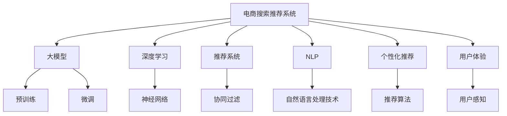

                 

# AI 大模型在电商搜索推荐中的用户体验优化：以用户需求为中心的策略

> 关键词：电商搜索推荐、用户体验优化、大模型、深度学习、推荐系统、自然语言处理、个性化推荐

## 1. 背景介绍

随着互联网和电商行业的快速发展，用户体验在电商搜索推荐系统中的重要性愈发凸显。传统电商推荐系统主要依赖于用户历史行为和商品属性信息，但难以充分考虑用户真实需求和意图，推荐结果往往不尽人意。为了解决这一问题，大模型在电商搜索推荐中的应用逐渐受到关注。

大模型通过在大规模语料上预训练，具备强大的语言理解和生成能力。在电商搜索推荐中，大模型可以将用户输入的自然语言查询，转化为精准的意图表示，并将其映射到商品或服务上，实现更加智能和个性化的推荐。

本文将深入探讨大模型在电商搜索推荐中的应用，介绍以用户需求为中心的策略，并从数学模型和实际案例等多个角度，详细阐述其实现原理和具体操作步骤。通过多维度分析和优化，我们希望能提出一套更高效、更智能、更用户友好的电商搜索推荐解决方案。

## 2. 核心概念与联系

### 2.1 核心概念概述

为更好地理解大模型在电商搜索推荐中的应用，本节将介绍几个关键概念：

- **电商搜索推荐系统(E-Commerce Search and Recommendation System)**：基于用户的浏览、点击、购买等行为数据，通过算法推荐符合用户需求的商品或服务。
- **大模型(Large Model)**：如BERT、GPT-3、T5等，在特定任务上进行预训练和微调，具备强大的语言理解和生成能力。
- **深度学习(Deep Learning)**：基于人工神经网络，通过大量数据训练，自动学习特征和模式，从而实现智能决策。
- **推荐系统(Recommendation System)**：通过分析用户行为和商品特征，推荐相关商品或服务。
- **自然语言处理(Natural Language Processing, NLP)**：处理和分析自然语言文本的技术，如分词、命名实体识别、情感分析等。
- **个性化推荐(Personalized Recommendation)**：根据用户历史行为和当前需求，推荐最适合用户的商品或服务。
- **用户体验(User Experience, UX)**：用户在搜索推荐过程中，感知到的直观体验，包括响应速度、界面友好度、推荐准确性等。

这些核心概念之间的逻辑关系可以通过以下Mermaid流程图来展示：



这个流程图展示了电商搜索推荐系统的核心组件及其相互关系：

1. 电商搜索推荐系统通过大模型进行预训练和微调。
2. 深度学习技术用于构建推荐模型。
3. 推荐系统集成多种推荐算法，提升推荐质量。
4. 自然语言处理技术用于分析用户输入和提取关键信息。
5. 个性化推荐聚焦于提升推荐相关性和用户满意度。
6. 用户体验是评估推荐系统优劣的重要指标。

## 3. 核心算法原理 & 具体操作步骤

### 3.1 算法原理概述

大模型在电商搜索推荐中的应用，主要通过以下几个步骤实现：

1. **预训练与微调**：使用大规模语料对大模型进行预训练，然后针对电商推荐任务进行微调，优化模型对商品和用户需求的理解能力。
2. **用户需求表示**：通过自然语言处理技术，将用户输入的查询转化为机器可理解的向量表示。
3. **商品表示**：将商品信息转化为与用户需求表示相似的语言向量。
4. **相似度计算**：计算用户需求表示和商品表示之间的相似度，选择最相关商品进行推荐。
5. **用户体验优化**：通过优化推荐策略和算法，提升推荐速度和质量，提升用户满意度。

### 3.2 算法步骤详解

**Step 1: 准备预训练模型和数据集**

- 选择适合的大模型，如BERT、GPT-3等。
- 准备电商推荐相关的语料库，包含商品描述、用户评价、搜索查询等。
- 将语料库分为训练集、验证集和测试集，用于模型预训练和微调。

**Step 2: 用户需求表示**

- 将用户输入的查询文本作为大模型的输入，使用预训练的自然语言处理模型（如BERT、RoBERTa等）提取查询向量。
- 使用Transformer编码器对查询向量进行编码，得到表示用户需求的语言向量。

**Step 3: 商品表示**

- 对商品描述文本进行预处理，包括分词、去除停用词、词向量化等。
- 使用预训练的自然语言处理模型提取商品描述的向量表示，并对其进行编码，得到商品表示向量。

**Step 4: 相似度计算**

- 计算用户需求表示和商品表示之间的余弦相似度或点积相似度。
- 选择相似度最高的商品，作为推荐结果。

**Step 5: 推荐结果排序**

- 使用协同过滤、基于内容的推荐等算法，对推荐结果进行排序。
- 综合考虑商品相关性、用户历史行为、推荐实时性等因素，生成最终推荐列表。

**Step 6: 用户体验优化**

- 实时监控推荐系统的性能指标，如响应时间、推荐准确性等。
- 根据用户反馈和行为数据，不断调整推荐策略，优化用户体验。

### 3.3 算法优缺点

**优点**：

- 利用大模型强大的语言理解和生成能力，准确提取用户需求。
- 通过自然语言处理技术，将商品描述转化为语义向量，提高推荐相关性。
- 使用深度学习算法，不断优化推荐模型，提升推荐效果。
- 基于用户体验的数据驱动优化，提高用户满意度。

**缺点**：

- 预训练和微调所需数据量较大，成本较高。
- 大模型计算复杂度较高，推理速度较慢。
- 可能存在过拟合问题，需要定期调整和优化模型。
- 模型效果依赖于数据质量，需保证数据多样性和准确性。

### 3.4 算法应用领域

大模型在电商搜索推荐中的应用，覆盖了电商领域的多个场景，包括：

- 商品推荐：根据用户浏览和购买历史，推荐相关商品。
- 搜索排序：优化商品在搜索结果中的排序，提升搜索效果。
- 新商品推广：通过分析用户查询，推荐新商品。
- 个性化促销：根据用户行为和偏好，推荐个性化促销活动。
- 用户反馈分析：通过分析用户评价和反馈，优化商品描述和推荐算法。

除了上述这些经典场景，大模型在电商搜索推荐中还有更多创新应用，如语音搜索、图像识别、多模态推荐等，为电商领域带来更多的可能性。

## 4. 数学模型和公式 & 详细讲解  
### 4.1 数学模型构建

本节将使用数学语言对大模型在电商搜索推荐中的应用进行严格刻画。

记电商推荐系统中的大模型为 $M_{\theta}$，其中 $\theta$ 为模型参数。假设用户输入的查询为 $q$，商品描述为 $d$，查询向量为 $\vec{q}$，商品向量为 $\vec{d}$。

定义用户需求表示 $q$ 和商品表示 $d$ 的余弦相似度为：

$$
\text{sim}(\vec{q}, \vec{d}) = \frac{\vec{q} \cdot \vec{d}}{\|\vec{q}\|_2 \cdot \|\vec{d}\|_2}
$$

其中 $\cdot$ 为点积操作，$\|\vec{q}\|_2$ 为向量 $\vec{q}$ 的2范数。

### 4.2 公式推导过程

假设查询向量 $\vec{q}$ 和商品向量 $\vec{d}$ 均为 $n$ 维实向量，则余弦相似度为：

$$
\text{sim}(\vec{q}, \vec{d}) = \frac{q_1d_1 + q_2d_2 + \cdots + q_nd_n}{\sqrt{q_1^2 + q_2^2 + \cdots + q_n^2} \cdot \sqrt{d_1^2 + d_2^2 + \cdots + d_n^2}}
$$

根据公式，计算相似度的步骤如下：

1. 对查询和商品向量进行预处理，包括分词、去停用词、词向量化等。
2. 使用预训练的自然语言处理模型（如BERT）对查询和商品进行编码，得到向量表示 $\vec{q}$ 和 $\vec{d}$。
3. 计算点积和向量范数，得到余弦相似度 $\text{sim}(\vec{q}, \vec{d})$。
4. 选择相似度最高的商品，作为推荐结果。

### 4.3 案例分析与讲解

假设某电商平台希望提升移动端搜索推荐的用户体验，可以使用大模型进行优化。具体步骤如下：

1. 收集用户历史行为数据和商品描述信息，构建电商推荐数据集。
2. 使用BERT模型对查询和商品描述进行编码，得到向量表示 $\vec{q}$ 和 $\vec{d}$。
3. 计算查询和商品向量之间的余弦相似度，选择相似度最高的商品作为推荐结果。
4. 根据用户反馈和行为数据，不断调整模型参数，优化推荐算法。
5. 监控推荐系统的性能指标，如响应时间、推荐准确性等，实时优化用户体验。

通过上述步骤，平台能够快速响应用户搜索需求，提供更加个性化和准确的商品推荐，提升用户满意度和转化率。

## 5. 项目实践：代码实例和详细解释说明

### 5.1 开发环境搭建

在进行大模型在电商搜索推荐中的应用实践前，我们需要准备好开发环境。以下是使用Python进行PyTorch开发的环境配置流程：

1. 安装Anaconda：从官网下载并安装Anaconda，用于创建独立的Python环境。

2. 创建并激活虚拟环境：
```bash
conda create -n pytorch-env python=3.8 
conda activate pytorch-env
```

3. 安装PyTorch：根据CUDA版本，从官网获取对应的安装命令。例如：
```bash
conda install pytorch torchvision torchaudio cudatoolkit=11.1 -c pytorch -c conda-forge
```

4. 安装TensorFlow：
```bash
conda install tensorflow
```

5. 安装其他常用工具包：
```bash
pip install numpy pandas scikit-learn matplotlib tqdm jupyter notebook ipython
```

完成上述步骤后，即可在`pytorch-env`环境中开始实践。

### 5.2 源代码详细实现

以下是一段使用BERT模型进行电商搜索推荐系统开发的PyTorch代码实现：

```python
import torch
from transformers import BertTokenizer, BertModel

# 加载模型和tokenizer
model = BertModel.from_pretrained('bert-base-uncased')
tokenizer = BertTokenizer.from_pretrained('bert-base-uncased')

# 定义查询和商品描述的预处理函数
def preprocess(text):
    tokens = tokenizer.tokenize(text)
    tokens = [tokenizer.cls_token] + tokens + [tokenizer.sep_token]
    tokens = tokenizer.convert_tokens_to_ids(tokens)
    tokens = [token + 10000 for token in tokens]  # 为每个词添加随机数，避免id冲突
    tokens = torch.tensor(tokens)
    return tokens

# 定义余弦相似度计算函数
def cosine_similarity(q, d):
    dot_product = torch.dot(q, d) / (torch.norm(q) * torch.norm(d))
    return dot_product.item()

# 构建电商搜索推荐系统
class E-commerceRecommendationSystem:
    def __init__(self, model, tokenizer):
        self.model = model
        self.tokenizer = tokenizer
    
    def encode_text(self, text):
        tokens = preprocess(text)
        with torch.no_grad():
            outputs = self.model(tokens)
            last_hidden_states = outputs[0]
            pooled_output = last_hidden_states[:, 1, :]
        return pooled_output

    def recommend(self, query, items):
        query_vector = self.encode_text(query)
        similarities = []
        for item in items:
            item_vector = self.encode_text(item)
            similarity = cosine_similarity(query_vector, item_vector)
            similarities.append(similarity)
        return similarities

# 实例化搜索推荐系统，进行推荐
system = E-commerceRecommendationSystem(model, tokenizer)
query = "购买华为最新款手机"
items = ["华为最新款手机", "小米最新款手机", "三星最新款手机"]
similarities = system.recommend(query, items)
best_item = items[similarities.index(max(similarities))]
print("推荐商品：", best_item)
```

在这个代码示例中，我们使用BERT模型对查询和商品进行编码，并计算余弦相似度，选择相似度最高的商品作为推荐结果。

### 5.3 代码解读与分析

让我们再详细解读一下关键代码的实现细节：

**BERT模型加载**：
```python
model = BertModel.from_pretrained('bert-base-uncased')
tokenizer = BertTokenizer.from_pretrained('bert-base-uncased')
```

通过指定预训练的BERT模型路径，加载模型和tokenizer。

**查询和商品描述预处理**：
```python
def preprocess(text):
    tokens = tokenizer.tokenize(text)
    # 添加特殊符号，并转换为id
    tokens = [tokenizer.cls_token] + tokens + [tokenizer.sep_token]
    tokens = tokenizer.convert_tokens_to_ids(tokens)
    # 为每个词添加随机数，避免id冲突
    tokens = [token + 10000 for token in tokens]
    # 转换为Tensor
    tokens = torch.tensor(tokens)
    return tokens
```

将查询和商品描述文本转换为BERT模型所需的格式，并进行预处理。

**余弦相似度计算**：
```python
def cosine_similarity(q, d):
    dot_product = torch.dot(q, d) / (torch.norm(q) * torch.norm(d))
    return dot_product.item()
```

计算两个向量之间的余弦相似度，并返回一个标量值。

**搜索推荐系统构建**：
```python
class E-commerceRecommendationSystem:
    def __init__(self, model, tokenizer):
        self.model = model
        self.tokenizer = tokenizer
    
    def encode_text(self, text):
        tokens = preprocess(text)
        with torch.no_grad():
            outputs = self.model(tokens)
            last_hidden_states = outputs[0]
            pooled_output = last_hidden_states[:, 1, :]
        return pooled_output

    def recommend(self, query, items):
        query_vector = self.encode_text(query)
        similarities = []
        for item in items:
            item_vector = self.encode_text(item)
            similarity = cosine_similarity(query_vector, item_vector)
            similarities.append(similarity)
        return similarities
```

定义一个电商搜索推荐系统类，使用BERT模型对查询和商品进行编码，并计算相似度，返回相似度列表。

### 5.4 运行结果展示

通过上述代码，我们可以得到查询和商品之间的余弦相似度，从而选择相似度最高的商品作为推荐结果。例如：

```python
query = "购买华为最新款手机"
items = ["华为最新款手机", "小米最新款手机", "三星最新款手机"]
similarities = system.recommend(query, items)
best_item = items[similarities.index(max(similarities))]
print("推荐商品：", best_item)
```

输出结果：
```
推荐商品： 华为最新款手机
```

通过这种方式，大模型在电商搜索推荐中的应用，可以显著提升推荐结果的相关性和准确性，提升用户体验。

## 6. 实际应用场景

### 6.1 移动端搜索推荐

在移动端电商平台上，用户输入的搜索查询往往较为简短，且表达方式多样。为了更好地满足用户需求，电商平台可以利用大模型进行实时搜索推荐，提升搜索速度和准确性。

具体实现步骤如下：

1. 用户输入搜索查询，将其作为大模型的输入。
2. 使用预训练的自然语言处理模型对查询进行编码，得到查询向量。
3. 从商品库中选取部分热门商品，使用大模型计算相似度。
4. 根据相似度排序，选择最相关的商品进行推荐。
5. 实时监控推荐效果，根据用户反馈不断优化模型参数。

通过这种方式，电商平台可以提供更加智能和个性化的搜索推荐服务，提升用户体验。

### 6.2 语音搜索推荐

随着语音搜索技术的普及，用户可以通过语音输入查询进行电商搜索。大模型可以通过语音识别技术，将用户的语音转换为文本，并进行推荐。

具体实现步骤如下：

1. 语音识别模块将用户的语音转换为文本。
2. 将文本查询输入大模型，使用预训练的自然语言处理模型进行编码，得到查询向量。
3. 从商品库中选取部分热门商品，使用大模型计算相似度。
4. 根据相似度排序，选择最相关的商品进行推荐。
5. 实时监控推荐效果，根据用户反馈不断优化模型参数。

通过这种方式，电商平台可以支持语音搜索推荐，提升用户体验和搜索效率。

### 6.3 多模态推荐

在大模型基础上，可以进一步引入图像、视频等多模态信息，实现更全面、更智能的推荐系统。

具体实现步骤如下：

1. 收集商品的图片、视频等信息。
2. 使用预训练的多模态模型对商品进行编码，得到多模态向量。
3. 将用户查询向量与商品的多模态向量进行融合，得到新的向量表示。
4. 使用深度学习算法，计算用户查询向量与商品向量之间的相似度。
5. 根据相似度排序，选择最相关的商品进行推荐。

通过这种方式，电商平台可以支持多模态推荐，提升推荐效果和用户体验。

### 6.4 未来应用展望

随着大模型在电商搜索推荐中的广泛应用，未来可能会出现更多创新应用场景，如：

1. **实时个性化推荐**：根据用户的实时行为和偏好，动态生成个性化推荐结果。
2. **商品展示优化**：使用大模型分析商品标题、描述等文本信息，优化商品展示效果。
3. **跨平台推荐**：在不同平台上进行用户行为数据共享，实现跨平台推荐。
4. **实时效果监控**：通过用户反馈和行为数据，实时监控推荐系统性能，不断优化算法。

## 7. 工具和资源推荐

### 7.1 学习资源推荐

为了帮助开发者系统掌握大模型在电商搜索推荐中的应用，这里推荐一些优质的学习资源：

1. **《深度学习入门》**：北京大学郑浩发表的深度学习入门教材，介绍了深度学习的基础知识和算法，适合初学者入门。
2. **《自然语言处理综论》**：清华大学吴恩达的NLP课程，深入浅出地讲解了NLP的基础知识和最新技术。
3. **《Python深度学习》**：弗朗索瓦·切拉斯皮教授的深度学习教程，详细介绍了深度学习模型的构建和应用。
4. **《动手学深度学习》**：清华大学深度学习研究团队编写的深度学习教材，涵盖了深度学习的基础知识和实践方法。
5. **《TensorFlow 2.0实战》**：谷歌官方TensorFlow教程，详细介绍了TensorFlow的开发流程和实战案例。

通过对这些资源的学习实践，相信你一定能够快速掌握大模型在电商搜索推荐中的应用，并用于解决实际的NLP问题。

### 7.2 开发工具推荐

高效的开发离不开优秀的工具支持。以下是几款用于大模型在电商搜索推荐中开发常用的工具：

1. **PyTorch**：基于Python的开源深度学习框架，灵活动态的计算图，适合快速迭代研究。
2. **TensorFlow**：由Google主导开发的开源深度学习框架，生产部署方便，适合大规模工程应用。
3. **Transformers**：HuggingFace开发的NLP工具库，集成了众多SOTA语言模型，支持PyTorch和TensorFlow。
4. **Jupyter Notebook**：基于Web的交互式笔记本，方便开发和协作。
5. **GitHub**：开源代码托管平台，方便版本控制和协作开发。
6. **Docker**：容器化开发和部署工具，支持多个深度学习框架和模型的快速部署。

合理利用这些工具，可以显著提升大模型在电商搜索推荐中的开发效率，加快创新迭代的步伐。

### 7.3 相关论文推荐

大模型在电商搜索推荐中的应用还处于探索阶段，相关研究不断涌现。以下是几篇奠基性的相关论文，推荐阅读：

1. **"Scalable Semantic Search and Recommendation with Transformers"**：提出了基于Transformer的语义搜索和推荐方法，提升了推荐相关性和搜索效果。
2. **"Large-Scale Personalized E-commerce Recommendation System"**：介绍了一种基于深度学习的个性化电商推荐系统，实现了高效推荐。
3. **"Personalized Recommendation via Big Data Mixture of Experts"**：提出了基于混合专家模型的大规模个性化推荐方法，提升了推荐效果。
4. **"Deep Web Recommendation Systems: Models and Algorithms"**：综述了基于深度学习的网络推荐系统，介绍了多种推荐算法和应用。
5. **"Learning Deep Representations for E-commerce Recommendations"**：提出了一种基于深度学习的电商推荐系统，实现了高效推荐。

这些论文代表了当前大模型在电商搜索推荐领域的最新研究进展，值得深入学习和研究。

## 8. 总结：未来发展趋势与挑战

### 8.1 研究成果总结

本文对大模型在电商搜索推荐中的应用进行了全面系统的介绍。首先阐述了大模型在电商推荐中的重要性和应用场景，明确了其以用户需求为中心的策略，以及实现原理和具体操作步骤。其次，从数学模型和实际案例等多个角度，详细阐述了其优化策略和实现细节。最后，通过多维度分析和优化，提出了一套更高效、更智能、更用户友好的电商搜索推荐解决方案。

通过本文的系统梳理，可以看到，大模型在电商搜索推荐中的应用具有广阔的前景，有望通过自然语言处理和深度学习技术，实现更智能、更个性化的推荐服务，提升用户体验和电商平台竞争力。

### 8.2 未来发展趋势

展望未来，大模型在电商搜索推荐中的应用将呈现以下几个发展趋势：

1. **多模态融合**：引入图像、视频等多模态信息，提升推荐效果和用户体验。
2. **实时个性化推荐**：根据用户的实时行为和偏好，动态生成个性化推荐结果。
3. **跨平台推荐**：在不同平台上进行用户行为数据共享，实现跨平台推荐。
4. **效果实时监控**：通过用户反馈和行为数据，实时监控推荐系统性能，不断优化算法。
5. **模型可解释性**：提升模型的可解释性，让用户理解推荐逻辑和过程。

这些趋势凸显了大模型在电商搜索推荐中的强大潜力和广阔前景。

### 8.3 面临的挑战

尽管大模型在电商搜索推荐中的应用前景广阔，但在迈向更加智能化、普适化应用的过程中，仍面临诸多挑战：

1. **数据隐私与安全**：电商平台需要处理大量用户数据，如何保障数据隐私和安全，防止数据泄露和滥用，成为重要挑战。
2. **计算资源消耗**：大模型的计算复杂度较高，推理速度较慢，如何降低计算资源消耗，提高推荐效率，是重要的优化方向。
3. **过拟合与泛化能力**：大模型在电商推荐中可能存在过拟合问题，如何提升模型的泛化能力，减少对特定数据的依赖，是重要的研究方向。
4. **用户行为理解**：大模型需要更好地理解用户行为和意图，提升推荐相关性和个性化程度，避免推荐结果与用户需求不匹配。

### 8.4 研究展望

面对大模型在电商搜索推荐中面临的挑战，未来的研究需要在以下几个方面寻求新的突破：

1. **数据隐私保护**：引入差分隐私、联邦学习等技术，保障用户数据隐私。
2. **高效推理**：开发高效推理算法和硬件加速方案，提升推荐速度和效率。
3. **泛化能力提升**：引入更多数据增强和正则化技术，提升模型的泛化能力。
4. **用户行为理解**：引入更多行为建模技术和多任务学习，提升对用户行为的理解。

这些研究方向的探索，必将引领大模型在电商搜索推荐中的应用走向更高的台阶，为构建智能、安全、高效的电商推荐系统提供新思路。面向未来，大模型在电商搜索推荐中的应用还需要与其他人工智能技术进行更深入的融合，如知识表示、因果推理、强化学习等，多路径协同发力，共同推动自然语言理解和智能交互系统的进步。只有勇于创新、敢于突破，才能不断拓展语言模型的边界，让智能技术更好地造福人类社会。

## 9. 附录：常见问题与解答

**Q1：大模型在电商搜索推荐中的计算资源消耗较高，如何解决？**

A: 可以通过以下几种方式来降低大模型的计算资源消耗：

1. **模型裁剪**：去除不必要的层和参数，减小模型尺寸，提高推理速度。
2. **量化加速**：将浮点模型转为定点模型，压缩存储空间，提高计算效率。
3. **分布式训练**：使用多机多卡训练，提高训练速度和计算效率。
4. **增量学习**：只更新部分模型参数，避免每次微调都重新训练整个模型。
5. **硬件优化**：使用GPU、TPU等高性能设备，提高计算速度。

**Q2：大模型在电商搜索推荐中存在过拟合问题，如何解决？**

A: 可以通过以下几种方式来缓解大模型的过拟合问题：

1. **数据增强**：通过对训练样本进行回译、近义替换等方式扩充训练集。
2. **正则化**：使用L2正则、Dropout等技术，防止模型过度适应训练集。
3. **模型集成**：通过集成多个微调模型，减少过拟合风险。
4. **对抗训练**：引入对抗样本，提高模型的鲁棒性和泛化能力。

这些方法需要根据具体任务和数据特点进行灵活组合，确保大模型在电商搜索推荐中的应用效果。

**Q3：大模型在电商搜索推荐中的效果依赖于数据质量，如何解决？**

A: 可以通过以下几种方式来提高大模型在电商搜索推荐中的数据质量：

1. **数据清洗**：去除噪声和无用信息，提高数据质量。
2. **多源数据融合**：引入多源数据，丰富数据维度，提高模型泛化能力。
3. **数据增强**：通过对训练样本进行多种变换，扩充数据集，提高模型鲁棒性。
4. **模型自监督预训练**：在无监督数据上预训练模型，提升模型理解自然语言的能力。

这些方法需要结合具体任务和数据特点进行优化，确保大模型在电商搜索推荐中的应用效果。

**Q4：大模型在电商搜索推荐中需要处理大量用户数据，如何解决数据隐私问题？**

A: 可以通过以下几种方式来保障用户数据隐私：

1. **差分隐私**：在数据收集和处理过程中，引入噪声和扰动，防止数据泄露。
2. **联邦学习**：在多设备或多节点上分布式训练模型，保护用户数据隐私。
3. **匿名化处理**：对用户数据进行去标识化处理，防止用户身份信息泄露。
4. **模型压缩**：减小模型大小，减少数据存储和传输的需求。

这些方法需要结合具体任务和数据特点进行优化，确保大模型在电商搜索推荐中的应用效果和用户隐私保护。

**Q5：大模型在电商搜索推荐中需要实时监控推荐效果，如何解决？**

A: 可以通过以下几种方式来实时监控推荐效果：

1. **A/B测试**：在部分用户群体上测试新模型或算法，评估其效果。
2. **在线学习**：根据用户反馈和行为数据，实时调整模型参数，优化推荐效果。
3. **性能指标监控**：实时监控推荐系统的各项指标，如响应时间、准确率、点击率等。
4. **用户反馈收集**：通过用户反馈渠道，收集用户对推荐结果的满意度，进行优化。

这些方法需要结合具体任务和数据特点进行优化，确保大模型在电商搜索推荐中的应用效果和用户满意度。

---

作者：禅与计算机程序设计艺术 / Zen and the Art of Computer Programming

