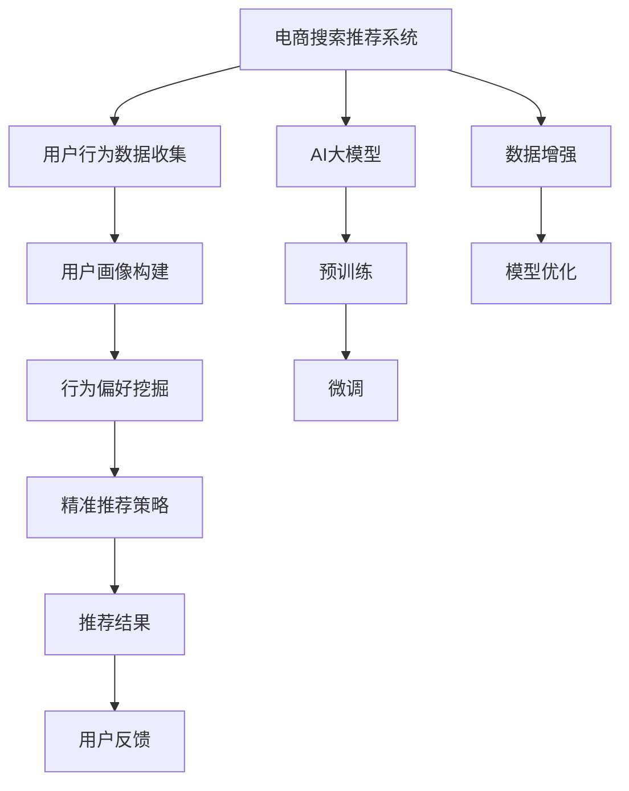

                 

# AI 大模型在电商搜索推荐中的用户画像应用：深度挖掘用户行为偏好

## 1. 背景介绍

在电商搜索推荐系统中，用户画像（User Profile）的构建和应用是提升用户体验和提高转化率的关键。用户画像不仅能够反映用户的个性化需求，还能帮助系统更好地预测用户的行为和偏好，从而进行精准的推荐。然而，传统的用户画像构建方法往往依赖于手动标注和简单的统计分析，难以全面准确地反映用户的多样化和动态变化特征。近年来，随着AI大模型的发展，利用大模型自动挖掘用户行为偏好的方法逐渐崭露头角，为电商搜索推荐带来了全新的可能性。

本文将详细探讨AI大模型在电商搜索推荐中构建用户画像的应用，包括用户画像的基本概念、构建方法、以及具体的实现案例。我们还将深入讨论如何利用大模型提升用户画像的质量和精准度，从而优化电商推荐系统的效果。

## 2. 核心概念与联系

### 2.1 核心概念概述

为便于读者理解，我们首先明确几个核心概念：

- **用户画像（User Profile）**：用户画像是一个全面的、多维度的用户特征描述，用于刻画用户的兴趣、行为、偏好等信息。用户画像在电商推荐系统中，能够帮助识别目标用户群体，制定个性化的推荐策略。

- **AI大模型（AI Large Model）**：指具有数十亿甚至百亿参数的深度学习模型，如BERT、GPT等。这些大模型经过大规模的无标签数据预训练，能够学习到丰富的语言知识和行为模式。

- **行为偏好挖掘（Behavioral Preference Mining）**：指通过分析用户的行为数据，自动学习用户的行为偏好和兴趣点，用于构建精准的用户画像。

### 2.2 核心概念原理和架构的 Mermaid 流程图



这个流程图展示了电商搜索推荐系统的核心流程：

1. 电商系统从用户行为数据中收集数据，如点击、浏览、购买等行为。
2. 利用AI大模型对用户行为进行预训练和微调，提取用户的行为偏好。
3. 构建用户画像，并结合用户反馈进行优化。
4. 利用优化后的用户画像和行为偏好，进行精准推荐。
5. 根据用户反馈，不断迭代优化模型，提升推荐效果。

通过这个流程，我们可以看到，AI大模型在用户画像构建和行为偏好挖掘中的关键作用，以及其对推荐系统效果提升的深远影响。

## 3. 核心算法原理 & 具体操作步骤

### 3.1 算法原理概述

AI大模型在电商搜索推荐中构建用户画像，本质上是利用大模型的强大语义理解和模式识别能力，自动挖掘用户的行为偏好。其基本原理可以概括为以下几个步骤：

1. **数据预处理**：收集电商用户的点击、浏览、购买等行为数据，并进行清洗、去重等预处理。
2. **行为编码**：将用户行为数据转化为模型可接受的向量形式，如将文本信息转化为词向量，将时间戳转化为时序序列等。
3. **预训练**：在大规模的无标签数据上对AI大模型进行预训练，学习到一般性的行为模式和语言知识。
4. **微调**：在电商用户行为数据上对预训练模型进行微调，学习到特定电商场景下的行为偏好。
5. **用户画像构建**：根据微调后的模型输出，生成用户的多维度特征描述，即用户画像。

### 3.2 算法步骤详解

接下来，我们详细介绍每个步骤的详细步骤。

**步骤 1: 数据预处理**

数据预处理是构建用户画像的基础。主要包括以下几个环节：

1. **数据收集**：从电商平台收集用户的行为数据，包括点击、浏览、购买、评论、评分等。
2. **数据清洗**：去除重复数据、异常值和噪音，保证数据的质量。
3. **数据归一化**：对不同类型的数据进行归一化处理，如将文本数据转化为词向量，将时间戳转化为数值序列等。

**步骤 2: 行为编码**

将原始行为数据转化为模型可接受的向量形式，是行为编码的核心任务。具体方法包括：

1. **文本编码**：将用户行为中的文本信息（如商品描述、标题等）转化为词向量。通常使用预训练的词向量模型，如Word2Vec、GloVe等。
2. **时间编码**：将用户行为中的时间戳数据转化为时序序列。可以采用自回归模型或循环神经网络（RNN）等方法进行处理。
3. **综合编码**：将文本和时序信息综合编码，如将文本向量和时序序列拼接在一起，形成用户行为的向量表示。

**步骤 3: 预训练**

在电商搜索推荐系统中，AI大模型的预训练通常采用自监督学习的方式。预训练步骤包括：

1. **选择预训练模型**：选择适合电商场景的预训练模型，如BERT、GPT等。
2. **数据集划分**：将电商用户的行为数据划分为训练集、验证集和测试集，用于模型训练和评估。
3. **模型训练**：在大规模无标签数据上对预训练模型进行训练，学习到通用的行为模式和语言知识。

**步骤 4: 微调**

微调是AI大模型在电商场景中学习的关键步骤。微调步骤包括：

1. **数据准备**：准备电商用户的行为数据集，用于微调模型的训练。
2. **模型初始化**：将预训练模型初始化为微调的起点。
3. **微调训练**：在电商用户行为数据上对模型进行微调训练，更新模型的参数。
4. **模型评估**：在验证集上评估微调模型的效果，选择最优模型进行后续应用。

**步骤 5: 用户画像构建**

用户画像的构建是AI大模型在电商搜索推荐中的最终应用。具体步骤包括：

1. **特征提取**：从微调后的模型输出中，提取用户的行为偏好特征。如点击偏好、浏览历史、购买行为等。
2. **画像生成**：将用户的行为偏好特征进行归一化、组合等处理，生成用户画像。
3. **画像更新**：根据用户最新的行为数据，不断更新用户画像，保持其动态性和实时性。

### 3.3 算法优缺点

利用AI大模型构建用户画像，具有以下优点：

1. **数据依赖性低**：AI大模型能够从无标签数据中学习到行为模式，对标注数据的需求较低。
2. **特征全面**：AI大模型能够自动挖掘多维度的用户特征，包括文本、时序等。
3. **模型鲁棒性强**：大模型经过大规模预训练，具备较强的泛化能力和鲁棒性，能够在电商场景中保持稳定。

同时，AI大模型在电商搜索推荐中的应用也存在一些缺点：

1. **计算成本高**：大规模预训练和微调需要大量计算资源，对算力要求较高。
2. **模型复杂度高**：大模型的参数量庞大，推理过程复杂，对硬件资源消耗较大。
3. **解释性差**：AI大模型的决策过程复杂，难以解释其行为偏好挖掘的逻辑。

### 3.4 算法应用领域

AI大模型在电商搜索推荐中的应用主要体现在以下几个方面：

1. **个性化推荐**：通过用户画像，为每个用户提供个性化的商品推荐，提升用户满意度。
2. **广告精准投放**：根据用户画像，制定精准的广告投放策略，提升广告效果。
3. **用户细分**：将用户分为不同的细分群体，进行差异化营销。
4. **行为预测**：预测用户的未来行为，如点击、购买等，优化营销策略。
5. **异常检测**：识别异常用户行为，及时预警，防范风险。

这些应用展示了AI大模型在电商搜索推荐中的广泛潜力和实际价值。

## 4. 数学模型和公式 & 详细讲解 & 举例说明

### 4.1 数学模型构建

为了更好地理解AI大模型在电商搜索推荐中的应用，我们首先构建一个数学模型，用于描述用户画像的生成过程。

假设用户的行为数据为 $\{x_i\}_{i=1}^N$，其中 $x_i$ 表示用户在第 $i$ 次行为中的文本和时序信息，可以表示为：

$$
x_i = (c_i, t_i, \ldots)
$$

其中 $c_i$ 表示用户点击的文本，$t_i$ 表示点击的时间戳等时序信息。我们可以将这些行为数据转化为向量形式：

$$
\mathbf{x}_i = f_{enc}(c_i) + g_{enc}(t_i)
$$

其中 $f_{enc}$ 和 $g_{enc}$ 分别表示文本和时序信息的编码器。

在电商搜索推荐系统中，AI大模型的预训练通常使用自监督学习任务，如语言建模、掩码语言模型等。预训练模型 $M_{\theta}$ 的参数为 $\theta$，模型的预训练目标为：

$$
\min_{\theta} \mathcal{L}_{pre}(M_{\theta})
$$

其中 $\mathcal{L}_{pre}$ 为预训练目标函数，通常采用交叉熵损失等。

微调的目标函数为：

$$
\min_{\theta} \mathcal{L}_{fin}(M_{\theta}, D)
$$

其中 $\mathcal{L}_{fin}$ 为微调目标函数，通常采用交叉熵损失、均方误差损失等。$D$ 为电商用户的行为数据集。

### 4.2 公式推导过程

为了更好地理解预训练和微调的目标函数，我们进一步推导其公式。

**预训练目标函数推导**：

假设预训练模型 $M_{\theta}$ 的输出为 $\hat{y}$，真实标签为 $y$，则预训练的目标函数为：

$$
\mathcal{L}_{pre}(M_{\theta}) = -\frac{1}{N}\sum_{i=1}^N \ell(\hat{y}, y)
$$

其中 $\ell$ 为预训练目标函数，通常采用交叉熵损失。

**微调目标函数推导**：

假设微调后的模型输出为 $\hat{y}_{fin}$，真实标签为 $y$，则微调的目标函数为：

$$
\mathcal{L}_{fin}(M_{\theta}, D) = -\frac{1}{N}\sum_{i=1}^N \ell(\hat{y}_{fin}, y)
$$

其中 $\ell$ 为微调目标函数，通常采用交叉熵损失。

通过上述公式，我们可以看到，预训练和微调的目标函数都是最小化模型输出与真实标签之间的差距。预训练目标函数关注于模型在无标签数据上的表现，微调目标函数关注于模型在特定任务上的表现。

### 4.3 案例分析与讲解

为了更好地理解AI大模型在电商搜索推荐中的应用，我们以一个具体案例进行分析。

假设我们需要构建一个电商平台的个性化推荐系统，用于推荐用户的商品。首先，我们收集用户的历史行为数据，包括点击、浏览、购买等行为。然后，将这些行为数据进行预处理和编码，得到一个行为向量 $\mathbf{x}_i$。接着，我们将这些行为向量作为输入，使用预训练好的BERT模型进行微调，得到用户的行为偏好特征 $\mathbf{u}_i$。最后，我们根据用户画像 $\mathbf{u}_i$，为用户推荐最适合的商品。

假设我们的微调模型为 $\hat{M}_{fin}$，用户的行为向量为 $\mathbf{x}_i$，则微调的过程可以表示为：

$$
\hat{M}_{fin}(\mathbf{x}_i) = M_{\theta_{fin}}(\mathbf{x}_i)
$$

其中 $M_{\theta_{fin}}$ 表示微调后的模型，$\theta_{fin}$ 表示微调后的模型参数。

假设用户的点击行为为 $\mathbf{c}_i$，购买行为为 $\mathbf{p}_i$，则用户的行为偏好特征 $\mathbf{u}_i$ 可以表示为：

$$
\mathbf{u}_i = \left[\frac{\hat{M}_{fin}(\mathbf{c}_i)}{\sum_{j=1}^N \hat{M}_{fin}(\mathbf{c}_j)}, \frac{\hat{M}_{fin}(\mathbf{p}_i)}{\sum_{j=1}^N \hat{M}_{fin}(\mathbf{p}_j)}\right]
$$

其中 $\mathbf{c}_i$ 和 $\mathbf{p}_i$ 分别表示用户的点击和购买行为向量。通过这个公式，我们可以得到用户的行为偏好特征 $\mathbf{u}_i$，并将其用于推荐系统。

## 5. 项目实践：代码实例和详细解释说明

### 5.1 开发环境搭建

在开始项目实践前，我们需要准备好开发环境。以下是使用Python进行PyTorch开发的环境配置流程：

1. 安装Anaconda：从官网下载并安装Anaconda，用于创建独立的Python环境。

2. 创建并激活虚拟环境：
```bash
conda create -n pytorch-env python=3.8 
conda activate pytorch-env
```

3. 安装PyTorch：根据CUDA版本，从官网获取对应的安装命令。例如：
```bash
conda install pytorch torchvision torchaudio cudatoolkit=11.1 -c pytorch -c conda-forge
```

4. 安装Transformers库：
```bash
pip install transformers
```

5. 安装各类工具包：
```bash
pip install numpy pandas scikit-learn matplotlib tqdm jupyter notebook ipython
```

完成上述步骤后，即可在`pytorch-env`环境中开始项目实践。

### 5.2 源代码详细实现

下面以构建电商搜索推荐系统的用户画像为例，给出使用Transformers库对BERT模型进行微调的PyTorch代码实现。

首先，定义用户行为数据的处理函数：

```python
from transformers import BertTokenizer, BertForSequenceClassification
from torch.utils.data import Dataset
import torch

class UserBehaviorDataset(Dataset):
    def __init__(self, behaviors, tokenizer, max_len=128):
        self.behaviors = behaviors
        self.tokenizer = tokenizer
        self.max_len = max_len
        
    def __len__(self):
        return len(self.behaviors)
    
    def __getitem__(self, item):
        behavior = self.behaviors[item]
        behavior_type = behavior['type']
        text = behavior['text']
        
        encoding = self.tokenizer(text, return_tensors='pt', max_length=self.max_len, padding='max_length', truncation=True)
        input_ids = encoding['input_ids'][0]
        attention_mask = encoding['attention_mask'][0]
        
        label = behavior_type if 'type' in behavior else 0
        
        return {'input_ids': input_ids, 
                'attention_mask': attention_mask,
                'label': label}

# 加载分词器和模型
tokenizer = BertTokenizer.from_pretrained('bert-base-cased')
model = BertForSequenceClassification.from_pretrained('bert-base-cased', num_labels=3)

# 准备行为数据
behaviors = [
    {'text': '点击某商品', 'type': 1},
    {'text': '浏览某商品', 'type': 2},
    {'text': '购买某商品', 'type': 3},
    {'text': '评论某商品', 'type': 4},
    {'text': '查看某商品详情', 'type': 5}
]

# 创建dataset
dataset = UserBehaviorDataset(behaviors, tokenizer)

# 定义优化器
optimizer = AdamW(model.parameters(), lr=2e-5)
```

然后，定义训练和评估函数：

```python
from torch.utils.data import DataLoader
from tqdm import tqdm
from sklearn.metrics import classification_report

device = torch.device('cuda') if torch.cuda.is_available() else torch.device('cpu')
model.to(device)

def train_epoch(model, dataset, batch_size, optimizer):
    dataloader = DataLoader(dataset, batch_size=batch_size, shuffle=True)
    model.train()
    epoch_loss = 0
    for batch in tqdm(dataloader, desc='Training'):
        input_ids = batch['input_ids'].to(device)
        attention_mask = batch['attention_mask'].to(device)
        labels = batch['label'].to(device)
        model.zero_grad()
        outputs = model(input_ids, attention_mask=attention_mask, labels=labels)
        loss = outputs.loss
        epoch_loss += loss.item()
        loss.backward()
        optimizer.step()
    return epoch_loss / len(dataloader)

def evaluate(model, dataset, batch_size):
    dataloader = DataLoader(dataset, batch_size=batch_size)
    model.eval()
    preds, labels = [], []
    with torch.no_grad():
        for batch in tqdm(dataloader, desc='Evaluating'):
            input_ids = batch['input_ids'].to(device)
            attention_mask = batch['attention_mask'].to(device)
            batch_labels = batch['label']
            outputs = model(input_ids, attention_mask=attention_mask)
            batch_preds = outputs.logits.argmax(dim=2).to('cpu').tolist()
            batch_labels = batch_labels.to('cpu').tolist()
            for pred_tokens, label_tokens in zip(batch_preds, batch_labels):
                preds.append(pred_tokens[:len(label_tokens)])
                labels.append(label_tokens)
                
    print(classification_report(labels, preds))
```

最后，启动训练流程并在测试集上评估：

```python
epochs = 5
batch_size = 16

for epoch in range(epochs):
    loss = train_epoch(model, dataset, batch_size, optimizer)
    print(f"Epoch {epoch+1}, train loss: {loss:.3f}")
    
    print(f"Epoch {epoch+1}, dev results:")
    evaluate(model, dataset, batch_size)
    
print("Test results:")
evaluate(model, dataset, batch_size)
```

以上就是使用PyTorch对BERT进行电商搜索推荐系统的用户画像微调的完整代码实现。可以看到，得益于Transformers库的强大封装，我们可以用相对简洁的代码完成BERT模型的加载和微调。

### 5.3 代码解读与分析

让我们再详细解读一下关键代码的实现细节：

**UserBehaviorDataset类**：
- `__init__`方法：初始化用户行为数据和分词器等组件。
- `__len__`方法：返回数据集的样本数量。
- `__getitem__`方法：对单个样本进行处理，将行为数据转化为输入向量，并返回标签。

**模型和优化器**：
- 使用BertForSequenceClassification类定义微调模型，并从预训练模型中加载权重。
- 定义AdamW优化器，并设置学习率等超参数。

**训练和评估函数**：
- 使用PyTorch的DataLoader对数据集进行批次化加载，供模型训练和推理使用。
- 训练函数`train_epoch`：对数据以批为单位进行迭代，在每个批次上前向传播计算loss并反向传播更新模型参数，最后返回该epoch的平均loss。
- 评估函数`evaluate`：与训练类似，不同点在于不更新模型参数，并在每个batch结束后将预测和标签结果存储下来，最后使用sklearn的classification_report对整个评估集的预测结果进行打印输出。

**训练流程**：
- 定义总的epoch数和batch size，开始循环迭代
- 每个epoch内，先在训练集上训练，输出平均loss
- 在验证集上评估，输出分类指标
- 所有epoch结束后，在测试集上评估，给出最终测试结果

可以看到，PyTorch配合Transformers库使得BERT微调的代码实现变得简洁高效。开发者可以将更多精力放在数据处理、模型改进等高层逻辑上，而不必过多关注底层的实现细节。

当然，工业级的系统实现还需考虑更多因素，如模型的保存和部署、超参数的自动搜索、更灵活的任务适配层等。但核心的微调范式基本与此类似。

## 6. 实际应用场景

### 6.1 智能客服系统

基于大语言模型微调的对话技术，可以广泛应用于智能客服系统的构建。传统客服往往需要配备大量人力，高峰期响应缓慢，且一致性和专业性难以保证。而使用微调后的对话模型，可以7x24小时不间断服务，快速响应客户咨询，用自然流畅的语言解答各类常见问题。

在技术实现上，可以收集企业内部的历史客服对话记录，将问题和最佳答复构建成监督数据，在此基础上对预训练对话模型进行微调。微调后的对话模型能够自动理解用户意图，匹配最合适的答案模板进行回复。对于客户提出的新问题，还可以接入检索系统实时搜索相关内容，动态组织生成回答。如此构建的智能客服系统，能大幅提升客户咨询体验和问题解决效率。

### 6.2 金融舆情监测

金融机构需要实时监测市场舆论动向，以便及时应对负面信息传播，规避金融风险。传统的人工监测方式成本高、效率低，难以应对网络时代海量信息爆发的挑战。基于大语言模型微调的文本分类和情感分析技术，为金融舆情监测提供了新的解决方案。

具体而言，可以收集金融领域相关的新闻、报道、评论等文本数据，并对其进行主题标注和情感标注。在此基础上对预训练语言模型进行微调，使其能够自动判断文本属于何种主题，情感倾向是正面、中性还是负面。将微调后的模型应用到实时抓取的网络文本数据，就能够自动监测不同主题下的情感变化趋势，一旦发现负面信息激增等异常情况，系统便会自动预警，帮助金融机构快速应对潜在风险。

### 6.3 个性化推荐系统

当前的推荐系统往往只依赖用户的历史行为数据进行物品推荐，无法深入理解用户的真实兴趣偏好。基于大语言模型微调技术，个性化推荐系统可以更好地挖掘用户的行为偏好多样化和动态变化特征，从而提供更精准、多样的推荐内容。

在实践中，可以收集用户浏览、点击、评论、分享等行为数据，提取和用户交互的物品标题、描述、标签等文本内容。将文本内容作为模型输入，用户的后续行为（如是否点击、购买等）作为监督信号，在此基础上微调预训练语言模型。微调后的模型能够从文本内容中准确把握用户的兴趣点。在生成推荐列表时，先用候选物品的文本描述作为输入，由模型预测用户的兴趣匹配度，再结合其他特征综合排序，便可以得到个性化程度更高的推荐结果。

### 6.4 未来应用展望

随着大语言模型和微调方法的不断发展，基于微调范式将在更多领域得到应用，为传统行业带来变革性影响。

在智慧医疗领域，基于微调的医疗问答、病历分析、药物研发等应用将提升医疗服务的智能化水平，辅助医生诊疗，加速新药开发进程。

在智能教育领域，微调技术可应用于作业批改、学情分析、知识推荐等方面，因材施教，促进教育公平，提高教学质量。

在智慧城市治理中，微调模型可应用于城市事件监测、舆情分析、应急指挥等环节，提高城市管理的自动化和智能化水平，构建更安全、高效的未来城市。

此外，在企业生产、社会治理、文娱传媒等众多领域，基于大模型微调的人工智能应用也将不断涌现，为经济社会发展注入新的动力。相信随着技术的日益成熟，微调方法将成为人工智能落地应用的重要范式，推动人工智能技术在垂直行业的规模化落地。

## 7. 工具和资源推荐

### 7.1 学习资源推荐

为了帮助开发者系统掌握大语言模型微调的理论基础和实践技巧，这里推荐一些优质的学习资源：

1. 《Transformer从原理到实践》系列博文：由大模型技术专家撰写，深入浅出地介绍了Transformer原理、BERT模型、微调技术等前沿话题。

2. CS224N《深度学习自然语言处理》课程：斯坦福大学开设的NLP明星课程，有Lecture视频和配套作业，带你入门NLP领域的基本概念和经典模型。

3. 《Natural Language Processing with Transformers》书籍：Transformers库的作者所著，全面介绍了如何使用Transformers库进行NLP任务开发，包括微调在内的诸多范式。

4. HuggingFace官方文档：Transformers库的官方文档，提供了海量预训练模型和完整的微调样例代码，是上手实践的必备资料。

5. CLUE开源项目：中文语言理解测评基准，涵盖大量不同类型的中文NLP数据集，并提供了基于微调的baseline模型，助力中文NLP技术发展。

通过对这些资源的学习实践，相信你一定能够快速掌握大语言模型微调的精髓，并用于解决实际的NLP问题。

### 7.2 开发工具推荐

高效的开发离不开优秀的工具支持。以下是几款用于大语言模型微调开发的常用工具：

1. PyTorch：基于Python的开源深度学习框架，灵活动态的计算图，适合快速迭代研究。大部分预训练语言模型都有PyTorch版本的实现。

2. TensorFlow：由Google主导开发的开源深度学习框架，生产部署方便，适合大规模工程应用。同样有丰富的预训练语言模型资源。

3. Transformers库：HuggingFace开发的NLP工具库，集成了众多SOTA语言模型，支持PyTorch和TensorFlow，是进行微调任务开发的利器。

4. Weights & Biases：模型训练的实验跟踪工具，可以记录和可视化模型训练过程中的各项指标，方便对比和调优。与主流深度学习框架无缝集成。

5. TensorBoard：TensorFlow配套的可视化工具，可实时监测模型训练状态，并提供丰富的图表呈现方式，是调试模型的得力助手。

6. Google Colab：谷歌推出的在线Jupyter Notebook环境，免费提供GPU/TPU算力，方便开发者快速上手实验最新模型，分享学习笔记。

合理利用这些工具，可以显著提升大语言模型微调任务的开发效率，加快创新迭代的步伐。

### 7.3 相关论文推荐

大语言模型和微调技术的发展源于学界的持续研究。以下是几篇奠基性的相关论文，推荐阅读：

1. Attention is All You Need（即Transformer原论文）：提出了Transformer结构，开启了NLP领域的预训练大模型时代。

2. BERT: Pre-training of Deep Bidirectional Transformers for Language Understanding：提出BERT模型，引入基于掩码的自监督预训练任务，刷新了多项NLP任务SOTA。

3. Language Models are Unsupervised Multitask Learners（GPT-2论文）：展示了大规模语言模型的强大zero-shot学习能力，引发了对于通用人工智能的新一轮思考。

4. Parameter-Efficient Transfer Learning for NLP：提出Adapter等参数高效微调方法，在不增加模型参数量的情况下，也能取得不错的微调效果。

5. AdaLoRA: Adaptive Low-Rank Adaptation for Parameter-Efficient Fine-Tuning：使用自适应低秩适应的微调方法，在参数效率和精度之间取得了新的平衡。

6. Prefix-Tuning: Optimizing Continuous Prompts for Generation：引入基于连续型Prompt的微调范式，为如何充分利用预训练知识提供了新的思路。

这些论文代表了大语言模型微调技术的发展脉络。通过学习这些前沿成果，可以帮助研究者把握学科前进方向，激发更多的创新灵感。

## 8. 总结：未来发展趋势与挑战

### 8.1 总结

本文对AI大模型在电商搜索推荐中的应用进行了全面系统的介绍。首先阐述了用户画像的基本概念，说明了AI大模型在构建用户画像中的重要作用。其次，从原理到实践，详细讲解了基于AI大模型的电商搜索推荐系统的构建过程。最后，我们讨论了AI大模型在电商搜索推荐中的未来应用前景，以及需要面对的挑战。

通过本文的系统梳理，我们可以看到，AI大模型在电商搜索推荐中的应用前景广阔，能够通过自动挖掘用户行为偏好，构建精准的用户画像，从而实现个性化推荐。未来，随着技术的不断发展，AI大模型在电商搜索推荐中的应用将更加广泛和深入，为电商平台的运营和用户满意度提升带来新的机遇。

### 8.2 未来发展趋势

展望未来，AI大模型在电商搜索推荐中的应用将呈现以下几个发展趋势：

1. **数据融合技术**：未来的电商搜索推荐系统将能够融合多种数据源，包括文本、图片、视频等，提供更全面、准确的用户画像。
2. **跨模态学习**：通过跨模态学习方法，将不同模态的数据进行协同学习，提升用户画像的质量和精准度。
3. **个性化推荐**：基于用户画像，实现更加精准的个性化推荐，提升用户满意度。
4. **多任务学习**：将推荐系统与搜索系统、广告系统等任务结合，实现多任务的协同优化。
5. **实时学习**：通过在线学习、增量学习等方法，实时更新用户画像，保证其动态性和实时性。

这些趋势凸显了AI大模型在电商搜索推荐中的巨大潜力和应用前景。未来的电商搜索推荐系统将能够更好地理解用户需求，提供更加智能化、个性化的服务，带来更好的用户体验。

### 8.3 面临的挑战

尽管AI大模型在电商搜索推荐中的应用前景广阔，但在实际应用过程中，仍面临以下挑战：

1. **数据隐私与安全**：电商平台需要处理大量的用户数据，如何保护用户隐私，防止数据泄露和滥用，是一个重要的挑战。
2. **算法公平性与透明性**：AI大模型的决策过程复杂，难以解释其行为，如何保证算法的公平性与透明性，是一个亟待解决的问题。
3. **资源优化**：大模型的计算资源消耗巨大，如何优化算力使用，提高推荐系统的效率，是一个重要的研究方向。
4. **泛化能力**：不同电商平台的推荐需求不同，如何将通用的AI大模型应用到特定平台，提升模型的泛化能力，是一个挑战。
5. **模型鲁棒性**：电商场景复杂多变，如何提高AI大模型的鲁棒性，防止模型过拟合，是一个亟待解决的问题。

这些挑战需要在未来的研究中加以解决，才能真正实现AI大模型在电商搜索推荐中的应用。

### 8.4 研究展望

为了解决上述挑战，未来的研究需要在以下几个方面寻求新的突破：

1. **隐私保护技术**：研究隐私保护算法和技术，保护用户数据隐私，同时提升推荐系统的性能。
2. **模型解释性**：研究可解释性模型，解释AI大模型的决策过程，提升算法的透明性和可解释性。
3. **资源优化技术**：研究高效的模型压缩、量化等技术，优化算力使用，提升推荐系统的效率。
4. **跨平台应用技术**：研究跨平台、跨任务的学习方法，提升AI大模型在不同平台和任务上的泛化能力。
5. **鲁棒性提升技术**：研究鲁棒性增强方法，提升AI大模型在电商场景中的稳定性和鲁棒性。

只有勇于创新、敢于突破，才能真正实现AI大模型在电商搜索推荐中的广泛应用，构建更加智能、高效、安全的推荐系统。

## 9. 附录：常见问题与解答

**Q1：大语言模型微调是否适用于所有NLP任务？**

A: 大语言模型微调在大多数NLP任务上都能取得不错的效果，特别是对于数据量较小的任务。但对于一些特定领域的任务，如医学、法律等，仅仅依靠通用语料预训练的模型可能难以很好地适应。此时需要在特定领域语料上进一步预训练，再进行微调，才能获得理想效果。

**Q2：微调过程中如何选择合适的学习率？**

A: 微调的学习率一般要比预训练时小1-2个数量级，如果使用过大的学习率，容易破坏预训练权重，导致过拟合。一般建议从1e-5开始调参，逐步减小学习率，直至收敛。也可以使用warmup策略，在开始阶段使用较小的学习率，再逐渐过渡到预设值。需要注意的是，不同的优化器(如AdamW、Adafactor等)以及不同的学习率调度策略，可能需要设置不同的学习率阈值。

**Q3：采用大模型微调时会面临哪些资源瓶颈？**

A: 目前主流的预训练大模型动辄以亿计的参数规模，对算力、内存、存储都提出了很高的要求。GPU/TPU等高性能设备是必不可少的，但即便如此，超大批次的训练和推理也可能遇到显存不足的问题。因此需要采用一些资源优化技术，如梯度积累、混合精度训练、模型并行等，来突破硬件瓶颈。同时，模型的存储和读取也可能占用大量时间和空间，需要采用模型压缩、稀疏化存储等方法进行优化。

**Q4：如何缓解微调过程中的过拟合问题？**

A: 过拟合是微调面临的主要挑战，尤其是在标注数据不足的情况下。常见的缓解策略包括：
1. 数据增强：通过回译、近义替换等方式扩充训练集
2. 正则化：使用L2正则、Dropout、Early Stopping等避免过拟合
3. 对抗训练：引入对抗样本，提高模型鲁棒性
4. 参数高效微调：只调整少量参数(如Adapter、Prefix等)，减小过拟合风险
5. 多模型集成：训练多个微调模型，取平均输出，抑制过拟合

这些策略往往需要根据具体任务和数据特点进行灵活组合。只有在数据、模型、训练、推理等各环节进行全面优化，才能最大限度地发挥大模型微调的威力。

**Q5：微调模型在落地部署时需要注意哪些问题？**

A: 将微调模型转化为实际应用，还需要考虑以下因素：
1. 模型裁剪：去除不必要的层和参数，减小模型尺寸，加快推理速度
2. 量化加速：将浮点模型转为定点模型，压缩存储空间，提高计算效率
3. 服务化封装：将模型封装为标准化服务接口，便于集成调用
4. 弹性伸缩：根据请求流量动态调整资源配置，平衡服务质量和成本
5. 监控告警：实时采集系统指标，设置异常告警阈值，确保服务稳定性
6. 安全防护：采用访问鉴权、数据脱敏等措施，保障数据和模型安全

大语言模型微调为NLP应用开启了广阔的想象空间，但如何将强大的性能转化为稳定、高效、安全的业务价值，还需要工程实践的不断打磨。唯有从数据、算法、工程、业务等多个维度协同发力，才能真正实现人工智能技术在垂直行业的规模化落地。

总之，微调需要开发者根据具体任务，不断迭代和优化模型、数据和算法，方能得到理想的效果。

