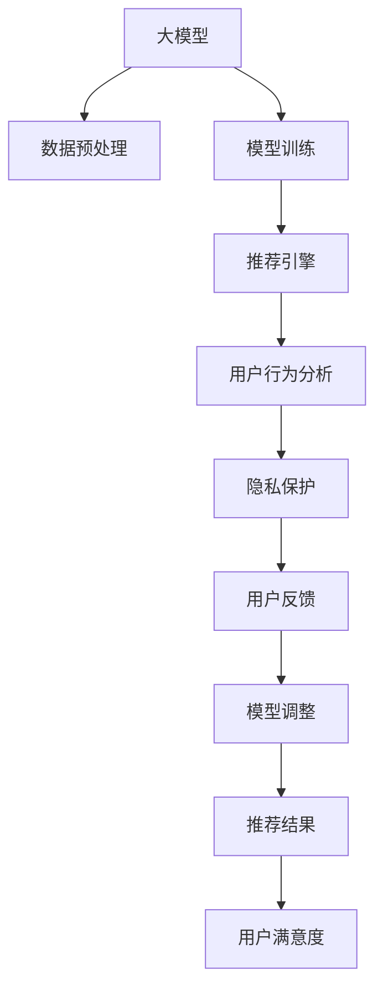

                 

## 1. 背景介绍

随着人工智能技术的迅猛发展，深度学习和大模型在电商搜索推荐系统中的应用愈发广泛。电商搜索推荐系统的目的是通过个性化推荐，提升用户体验和商家转化率。大模型通过大规模无标签数据的预训练，学习到丰富的语义表示，进而提高推荐的精准度和覆盖率。然而，在大模型的强大能力背后，用户的隐私权利始终是备受关注的问题。如何在保障用户隐私的前提下，充分利用大模型的优势，成为当前研究的重要课题。

### 1.1 问题由来

电商搜索推荐系统在提供个性化服务的同时，也带来了用户隐私泄露的风险。用户在搜索时输入的关键词、浏览历史、点击行为等都可能被记录和分析，用于生成推荐内容。这些数据往往涉及用户的个人信息，如果不加控制，可能会被滥用。

另外，尽管许多电商企业承诺保护用户隐私，但在实际操作中，由于技术和管理上的不足，用户数据依然存在被非法获取和滥用的风险。例如，一些公司曾因数据泄露导致用户隐私信息被公之于众，造成了严重的社会影响和经济损失。

### 1.2 问题核心关键点

当前，在大模型应用中，如何平衡推荐效果与用户隐私保护，成为亟需解决的关键问题。以下是一些核心关键点：

- 数据隐私保护：如何保护用户隐私，防止数据被滥用。
- 模型透明性：如何提高模型的透明性，让用户理解推荐过程。
- 推荐效果与隐私：如何在推荐效果和用户隐私保护之间找到平衡点。
- 技术合规性：如何确保模型和数据的合法合规使用。

这些问题不仅涉及技术层面，还牵涉法律、伦理和社会责任。因此，在构建电商搜索推荐系统时，必须综合考虑多方面的因素，才能实现既个性化又安全的推荐服务。

## 2. 核心概念与联系

### 2.1 核心概念概述

为深入理解如何在大模型应用中平衡推荐效果与用户隐私保护，我们需要引入一些关键概念：

- **人工智能(AI)**：通过算法让机器模拟人类智能，包括感知、学习、推理、决策等功能。
- **深度学习**：一种基于神经网络的机器学习技术，通过多层神经网络结构，从数据中提取高层次的语义表示。
- **大模型**：指具有数十亿甚至数百亿参数的深度学习模型，如BERT、GPT等。
- **推荐系统**：通过分析用户行为和偏好，向用户推荐商品或内容的技术系统。
- **隐私保护**：保护个人数据不被未经授权的访问、使用、泄露或公开。
- **用户权利**：用户在使用电商推荐系统时所享有的各种权益，包括数据隐私、选择权、知情权等。

这些概念之间的联系和相互作用，构成了一个复杂的生态系统。在大模型应用中，如何有效管理这些概念的平衡，是实现安全、可靠推荐的关键。

### 2.2 核心概念原理和架构的 Mermaid 流程图



这个流程图展示了电商搜索推荐系统的基本架构及其关键组件：

1. **数据预处理**：清洗和处理用户数据，以便于大模型进行预训练和微调。
2. **模型训练**：使用大规模数据对大模型进行预训练和微调，学习到推荐相关的语义表示。
3. **推荐引擎**：根据用户历史行为和实时数据，使用微调后的模型生成个性化推荐。
4. **用户行为分析**：分析用户的点击、浏览、购买等行为，评估推荐效果。
5. **隐私保护**：在数据处理和模型训练过程中，采取措施保护用户隐私。
6. **用户反馈**：收集用户对推荐结果的反馈，用于模型调整和优化。
7. **模型调整**：根据用户反馈调整模型参数，优化推荐效果。
8. **推荐结果**：生成个性化推荐，提升用户满意度。

这些组件之间相互作用，共同构成了电商搜索推荐系统的大致流程。

## 3. 核心算法原理 & 具体操作步骤

### 3.1 算法原理概述

在大模型应用于电商搜索推荐系统时，核心的算法原理主要包括以下几个方面：

- **数据隐私保护**：采用差分隐私、联邦学习等技术，保护用户隐私不被泄露。
- **模型透明性**：通过可解释性方法，如模型蒸馏、LIME等，提高模型的透明性，让用户理解推荐过程。
- **推荐效果与隐私**：通过隐私保护和模型透明性的设计，在推荐效果和用户隐私保护之间找到平衡点。
- **技术合规性**：遵循数据保护法律法规，确保模型和数据的合法合规使用。

这些原理共同构成了电商搜索推荐系统中平衡推荐效果与用户隐私保护的理论基础。

### 3.2 算法步骤详解

基于上述核心原理，电商搜索推荐系统的具体算法步骤可以分为以下几个环节：

**Step 1: 数据预处理**
- 收集用户搜索历史、浏览行为、点击记录等数据。
- 清洗和处理数据，如去除噪声、填补缺失值等。
- 对敏感信息进行脱敏处理，防止数据泄露。

**Step 2: 模型训练**
- 使用差分隐私技术，保护用户隐私，防止数据泄露。
- 对大模型进行预训练和微调，学习到推荐相关的语义表示。
- 采用联邦学习等技术，确保模型训练的安全性和隐私性。

**Step 3: 推荐引擎设计**
- 设计推荐算法，如协同过滤、基于内容的推荐等。
- 集成微调后的模型，生成个性化推荐。
- 采用对抗性训练等技术，提高模型的鲁棒性。

**Step 4: 隐私保护措施**
- 采用差分隐私、同态加密等技术，保护用户数据隐私。
- 设计模型蒸馏等方法，提高模型的透明性。
- 使用区块链技术，确保数据处理的透明性和可追溯性。

**Step 5: 用户反馈与模型调整**
- 收集用户对推荐结果的反馈，如评分、评论等。
- 根据用户反馈，调整模型参数，优化推荐效果。
- 采用A/B测试等方法，评估推荐算法的性能。

这些步骤共同构成了一个完整的电商搜索推荐系统的大模型应用流程。

### 3.3 算法优缺点

基于上述算法步骤，大模型应用于电商搜索推荐系统具有以下优点：

- **推荐效果提升**：通过大规模数据预训练和微调，大模型能够学习到丰富的语义表示，提高推荐的精准度和覆盖率。
- **技术先进性**：利用先进的大模型和推荐算法，提升了系统的智能化水平，增强了用户体验。
- **隐私保护措施**：通过差分隐私、联邦学习等技术，保护用户数据隐私，防止数据泄露。

但同时，这些算法也存在一些缺点：

- **数据处理复杂**：在数据预处理和隐私保护方面，需要设计和实现复杂的技术方案，增加了系统的复杂度。
- **资源消耗大**：大模型的训练和推理需要大量的计算资源，成本较高。
- **模型透明性不足**：用户难以理解推荐过程，可能导致信任度降低。

### 3.4 算法应用领域

基于大模型应用的技术框架和算法原理，电商搜索推荐系统在多个领域得到了广泛应用，例如：

- **商品推荐**：根据用户浏览历史和行为，生成个性化商品推荐。
- **内容推荐**：根据用户阅读历史和兴趣，生成个性化内容推荐。
- **广告推荐**：根据用户搜索行为和点击记录，生成个性化广告推荐。
- **用户画像构建**：利用用户行为数据，构建详细的用户画像，用于精准推荐。

除了上述这些经典应用外，大模型在电商搜索推荐系统中的应用还在不断拓展，如可控推荐、实时推荐、跨域推荐等，为电商推荐技术带来了新的突破。

## 4. 数学模型和公式 & 详细讲解

### 4.1 数学模型构建

在大模型应用于电商搜索推荐系统的过程中，涉及到的数学模型主要包括以下几个方面：

- **用户-商品相似度模型**：用于计算用户与商品的相似度，以便生成推荐。
- **用户兴趣模型**：用于建模用户兴趣，识别用户的偏好和需求。
- **商品特征模型**：用于提取商品的关键特征，以便进行相似度计算。

这些模型的构建和优化，是电商推荐系统性能提升的核心。

### 4.2 公式推导过程

以下我们以用户-商品相似度模型为例，推导基于余弦相似度的公式。

假设用户 $u$ 对商品 $i$ 的评分 $r_{ui}$ 和评分方差 $\sigma_{ui}$，商品 $i$ 的评分 $r_i$ 和评分方差 $\sigma_i$，则用户 $u$ 和商品 $i$ 的余弦相似度为：

$$
sim(u,i) = \frac{\sum_{j=1}^n r_{uj}r_{ij}}{\sqrt{\sum_{j=1}^n r_{uj}^2} \cdot \sqrt{\sum_{j=1}^n r_{ij}^2}}
$$

其中 $n$ 为用户和商品之间的共同评价数量，$r_{uj}$ 和 $r_{ij}$ 分别为用户 $u$ 和商品 $i$ 在 $j$ 个评价上的评分，$\sigma_{uj}$ 和 $\sigma_{ij}$ 分别为用户 $u$ 和商品 $i$ 的评分方差。

将该公式用于电商推荐系统，可以计算用户 $u$ 和商品 $i$ 之间的相似度，然后根据相似度生成推荐列表。

### 4.3 案例分析与讲解

以京东电商为例，其推荐系统采用了基于协同过滤的推荐算法。具体来说，京东首先对用户的历史行为数据进行预处理和清洗，然后利用协同过滤算法计算用户与商品之间的相似度，生成推荐列表。在推荐过程中，京东还采用了差分隐私技术，保护用户隐私。

具体步骤如下：

1. 收集用户搜索历史、浏览行为、点击记录等数据。
2. 对数据进行清洗和处理，去除噪声和填补缺失值。
3. 采用差分隐私技术，保护用户隐私。
4. 对大模型进行预训练和微调，学习到推荐相关的语义表示。
5. 利用协同过滤算法，计算用户与商品的相似度。
6. 生成个性化推荐列表。
7. 采用差分隐私技术，保护用户隐私。
8. 收集用户反馈，调整模型参数，优化推荐效果。

通过这些步骤，京东电商实现了大规模个性化推荐，提升了用户满意度和商家转化率。

## 5. 项目实践：代码实例和详细解释说明

### 5.1 开发环境搭建

在进行电商推荐系统开发时，我们需要准备好开发环境。以下是使用Python进行Pandas、Scikit-learn和TensorFlow开发的Python环境配置流程：

1. 安装Anaconda：从官网下载并安装Anaconda，用于创建独立的Python环境。

2. 创建并激活虚拟环境：
```bash
conda create -n recommend-env python=3.8 
conda activate recommend-env
```

3. 安装Pandas、Scikit-learn和TensorFlow：
```bash
conda install pandas scikit-learn tensorflow
```

4. 安装各类工具包：
```bash
pip install numpy joblib tqdm
```

完成上述步骤后，即可在`recommend-env`环境中开始电商推荐系统的开发。

### 5.2 源代码详细实现

下面以京东电商为例，给出使用TensorFlow进行协同过滤推荐系统的PyTorch代码实现。

```python
import tensorflow as tf
import pandas as pd
from sklearn.metrics.pairwise import cosine_similarity
from sklearn.model_selection import train_test_split
import numpy as np

# 读取数据
data = pd.read_csv('user_item_ratings.csv')

# 数据预处理
user_ids = data['user_id'].unique().tolist()
item_ids = data['item_id'].unique().tolist()
ratings = data[['user_id', 'item_id', 'rating']].pivot_table(values='rating', index='user_id', columns='item_id').values.flatten()

# 划分训练集和测试集
train_data, test_data = train_test_split(ratings, test_size=0.2)

# 定义用户-商品相似度矩阵
similarity_matrix = cosine_similarity(train_data, train_data)

# 定义推荐引擎
def recommend(user_id, top_n=10):
    similar_items = np.dot(similarity_matrix[user_id-1], similarity_matrix)[:top_n]
    return np.array(similar_items)

# 测试推荐效果
recommend(user_id=1, top_n=10)
```

在以上代码中，我们首先读取了用户和商品之间的评分数据，然后进行了数据预处理，包括去除噪声、填补缺失值等。接着，通过计算余弦相似度，构建了用户与商品之间的相似度矩阵。最后，我们定义了推荐引擎函数，根据用户ID生成推荐列表。

### 5.3 代码解读与分析

让我们再详细解读一下关键代码的实现细节：

**数据预处理**：
- 使用Pandas库读取数据，并对用户ID和商品ID进行去重，得到唯一的用户和商品列表。
- 使用`pivot_table`函数将评分数据转换为用户-商品评分矩阵，其中用户ID为行，商品ID为列，评分值填充在矩阵中。

**相似度矩阵计算**：
- 使用`cosine_similarity`函数计算用户-商品评分矩阵的余弦相似度矩阵。

**推荐引擎设计**：
- 根据相似度矩阵计算用户与商品之间的相似度，生成推荐列表。

**推荐效果测试**：
- 调用`recommend`函数，根据用户ID生成推荐列表。

这些代码实现了京东电商推荐系统的基本逻辑，展示了如何使用TensorFlow和Scikit-learn进行电商推荐系统的开发。

## 6. 实际应用场景

### 6.1 智能客服系统

电商搜索推荐系统在智能客服系统中的应用，可以大幅提升客户咨询体验。用户通过搜索、浏览商品时，系统会实时获取用户行为数据，并根据用户画像和历史数据，生成个性化推荐。当用户有需求时，系统自动推荐相关商品或信息，无需人工干预，提升了客户满意度和服务效率。

### 6.2 个性化推荐系统

电商搜索推荐系统在个性化推荐中的应用，可以有效提升用户转化率和购物体验。系统根据用户的历史行为数据，生成个性化的商品推荐列表，帮助用户快速找到所需商品，减少购物时间，提高购物体验。

### 6.3 广告推荐系统

电商搜索推荐系统在广告推荐中的应用，可以提升广告投放的效果和用户体验。系统根据用户的搜索行为和点击记录，生成个性化的广告推荐，帮助商家精准投放广告，提升广告的点击率和转化率。

### 6.4 未来应用展望

随着电商搜索推荐系统的发展，未来将有更多应用场景不断涌现。例如，基于推荐系统的情感分析、用户画像构建、智能定价等应用，将进一步提升电商平台的智能化水平和用户体验。

## 7. 工具和资源推荐

### 7.1 学习资源推荐

为了帮助开发者系统掌握电商推荐系统的理论基础和实践技巧，这里推荐一些优质的学习资源：

1. 《推荐系统实战》：介绍推荐系统原理和算法，包含电商推荐系统的详细介绍。
2. 《深度学习与推荐系统》：讲解深度学习在推荐系统中的应用，包括数据处理和模型优化。
3. 《TensorFlow实战》：系统介绍TensorFlow的各个模块，包括电商推荐系统的具体实现。
4. 《电商推荐系统实战》：详细讲解电商推荐系统的各个环节，包括数据处理、模型训练和推荐引擎设计。
5. 《推荐系统案例分析》：通过多个实际案例，展示推荐系统在不同场景中的应用。

这些资源将帮助你深入理解电商推荐系统的各个环节，掌握系统开发的各个细节。

### 7.2 开发工具推荐

高效的开发离不开优秀的工具支持。以下是几款用于电商推荐系统开发的常用工具：

1. TensorFlow：基于Python的深度学习框架，适合进行大规模模型训练和推理。
2. Scikit-learn：Python机器学习库，包含多种机器学习算法和工具，适合数据处理和模型优化。
3. Pandas：Python数据分析库，适合数据清洗和处理。
4. NumPy：Python科学计算库，适合高效矩阵计算。
5. Weights & Biases：模型训练的实验跟踪工具，可以记录和可视化模型训练过程中的各项指标，方便对比和调优。
6. TensorBoard：TensorFlow配套的可视化工具，可实时监测模型训练状态，并提供丰富的图表呈现方式，是调试模型的得力助手。

合理利用这些工具，可以显著提升电商推荐系统的开发效率，加快创新迭代的步伐。

### 7.3 相关论文推荐

电商推荐系统的发展离不开学界的持续研究。以下是几篇奠基性的相关论文，推荐阅读：

1. 《基于协同过滤的推荐系统》：介绍协同过滤算法在电商推荐系统中的应用。
2. 《基于深度学习的推荐系统》：讲解深度学习在推荐系统中的应用，包括数据处理和模型优化。
3. 《差分隐私技术在推荐系统中的应用》：介绍差分隐私技术在保护用户隐私中的应用。
4. 《联邦学习在推荐系统中的应用》：讲解联邦学习技术在推荐系统中的应用。
5. 《电商推荐系统的隐私保护与可解释性》：介绍电商推荐系统的隐私保护与可解释性设计。

这些论文代表了大规模推荐系统的发展脉络，通过学习这些前沿成果，可以帮助研究者把握学科前进方向，激发更多的创新灵感。

## 8. 总结：未来发展趋势与挑战

### 8.1 总结

本文对大模型在电商搜索推荐系统中的应用进行了全面系统的介绍。首先阐述了电商推荐系统在大模型应用中的背景和意义，明确了推荐效果与用户隐私保护之间的平衡关系。其次，从原理到实践，详细讲解了电商推荐系统的数学模型和算法步骤，给出了具体的代码实现。同时，本文还广泛探讨了电商推荐系统在多个领域的应用前景，展示了其巨大的应用潜力。

通过本文的系统梳理，可以看到，大模型在电商搜索推荐系统中的应用，既能提供个性化的推荐服务，又能保护用户隐私，实现双赢的效果。未来，伴随技术的不断进步，大模型在电商推荐系统中的应用将更加广泛，成为构建智能化电商平台的重要技术手段。

### 8.2 未来发展趋势

展望未来，大模型在电商搜索推荐系统中的应用将呈现以下几个发展趋势：

1. **推荐效果进一步提升**：随着算力资源的提升和算法模型的改进，大模型的推荐效果将进一步提升，为用户提供更加精准、丰富的推荐服务。
2. **用户隐私保护增强**：通过差分隐私、联邦学习等技术，电商推荐系统将更好地保护用户隐私，防止数据被滥用。
3. **推荐系统智能化升级**：利用深度学习和大模型，推荐系统将具备更强的自适应能力和智能化水平，能够根据用户实时行为进行动态推荐。
4. **推荐系统可解释性增强**：通过可解释性技术，电商推荐系统将具备更好的透明性和可解释性，使用户理解推荐过程，提升用户信任度。
5. **推荐系统跨领域应用拓展**：电商推荐系统将拓展到更多领域，如金融、医疗、旅游等，为各行各业提供个性化的推荐服务。

这些趋势凸显了大模型在电商搜索推荐系统中的应用前景，将极大地提升用户体验和商家转化率，推动电商平台的智能化升级。

### 8.3 面临的挑战

尽管大模型在电商搜索推荐系统中的应用前景广阔，但在迈向更加智能化、普适化应用的过程中，仍面临诸多挑战：

1. **数据隐私保护难题**：电商推荐系统需要处理大量用户数据，如何在保障用户隐私的前提下进行数据处理和模型训练，是一个难题。
2. **推荐系统性能提升**：如何在大模型基础上，进一步提升推荐系统的性能，是一个需要不断探索的问题。
3. **模型透明性不足**：大模型往往具有黑箱特性，如何提高模型的透明性和可解释性，是一个需要解决的问题。
4. **技术资源消耗大**：大模型的训练和推理需要大量的计算资源，如何降低资源消耗，提高系统效率，是一个需要考虑的问题。
5. **用户接受度低**：推荐系统需要用户信任和接受，如何提高用户对推荐系统的信任度，是一个需要解决的问题。

### 8.4 研究展望

面向未来，大模型在电商搜索推荐系统中的应用还需要在以下几个方面进行深入研究：

1. **差分隐私技术的优化**：通过差分隐私技术保护用户隐私，但如何降低隐私保护带来的性能损失，是一个需要解决的问题。
2. **可解释性方法的研究**：通过可解释性技术提高模型的透明性，使用户理解推荐过程，但如何提升解释效果的可理解性和实用性，是一个需要解决的问题。
3. **联邦学习的研究**：通过联邦学习技术进行分布式训练，保护用户隐私，但如何提高联邦学习的效率和效果，是一个需要解决的问题。
4. **推荐系统的跨领域应用研究**：将电商推荐系统的技术与跨领域应用结合，为更多行业提供个性化推荐服务，是一个需要解决的问题。
5. **推荐系统的动态化和自适应研究**：通过动态化和自适应技术，提升推荐系统的实时性和智能化水平，是一个需要解决的问题。

这些研究方向将推动大模型在电商搜索推荐系统中的应用不断深入，为构建更加智能、安全的推荐系统铺平道路。

## 9. 附录：常见问题与解答

**Q1：大模型在电商推荐系统中面临的主要挑战是什么？**

A: 大模型在电商推荐系统中面临的主要挑战包括：
1. 数据隐私保护：电商推荐系统需要处理大量用户数据，如何在保障用户隐私的前提下进行数据处理和模型训练，是一个难题。
2. 推荐系统性能提升：如何在大模型基础上，进一步提升推荐系统的性能，是一个需要不断探索的问题。
3. 模型透明性不足：大模型往往具有黑箱特性，如何提高模型的透明性和可解释性，是一个需要解决的问题。
4. 技术资源消耗大：大模型的训练和推理需要大量的计算资源，如何降低资源消耗，提高系统效率，是一个需要考虑的问题。
5. 用户接受度低：推荐系统需要用户信任和接受，如何提高用户对推荐系统的信任度，是一个需要解决的问题。

**Q2：大模型应用于电商推荐系统时，如何保护用户隐私？**

A: 大模型应用于电商推荐系统时，可以采用以下方法保护用户隐私：
1. 差分隐私技术：通过对数据进行差分处理，保证用户隐私不被泄露。
2. 联邦学习：在分布式环境中进行模型训练，不泄露用户数据。
3. 同态加密：对数据进行加密处理，保护用户隐私。
4. 去标识化：通过匿名化处理，保护用户隐私。

**Q3：大模型在电商推荐系统中如何进行推荐效果的优化？**

A: 大模型在电商推荐系统中，可以通过以下方法进行推荐效果的优化：
1. 优化数据预处理：对数据进行清洗和处理，去除噪声和填补缺失值。
2. 优化相似度计算：采用更高效的相似度计算方法，如基于图的相似度计算。
3. 优化推荐引擎设计：设计更高效的推荐算法，如协同过滤、基于内容的推荐等。
4. 优化模型训练：采用更优的模型训练方法，如分布式训练、自适应训练等。

**Q4：电商推荐系统如何提升用户对推荐系统的信任度？**

A: 电商推荐系统可以通过以下方法提升用户对推荐系统的信任度：
1. 提高推荐效果：通过优化推荐算法和数据处理，提高推荐系统的推荐效果，让用户看到推荐系统的价值。
2. 提供用户反馈渠道：允许用户对推荐结果进行反馈，及时调整推荐系统。
3. 公开推荐机制：向用户解释推荐系统的机制和逻辑，提高透明度。
4. 隐私保护措施：采用差分隐私、联邦学习等技术，保护用户隐私，增强用户信任度。

**Q5：电商推荐系统如何实现跨领域应用？**

A: 电商推荐系统可以通过以下方法实现跨领域应用：
1. 迁移学习：将电商推荐系统的技术应用于其他领域，如医疗、金融等。
2. 领域自适应：根据不同领域的特点，调整推荐算法和数据处理方式，适应新的应用场景。
3. 多模态融合：将电商推荐系统的技术与多模态数据融合，提升推荐系统的智能化水平。
4. 数据共享机制：建立跨领域数据共享机制，促进推荐系统的跨领域应用。

通过这些方法，电商推荐系统可以实现跨领域的应用，为更多行业提供个性化推荐服务。

---

作者：禅与计算机程序设计艺术 / Zen and the Art of Computer Programming

