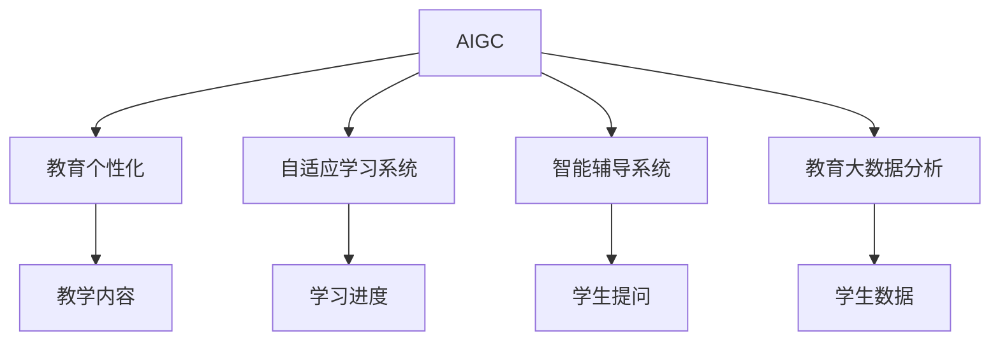

                 

# AIGC推动教育个性化发展

随着人工智能（AI）技术的飞速发展，人工智能生成内容（AIGC）正成为推动教育个性化发展的重要引擎。通过AI和GPT-3等大语言模型，我们可以为每个学生量身定制个性化的学习路径，从而极大地提升教学效果。本文将详细探讨AIGC在教育领域的应用原理、操作步骤、优缺点及其未来发展趋势，同时给出实际应用案例和工具资源推荐。

## 1. 背景介绍

### 1.1 问题由来
随着教育信息化的不断深入，传统的一对多教学模式越来越难以满足个性化学习的需求。每个学生的学习能力和兴趣不同，传统的标准化教学方式很难照顾到每个学生的特点。而人工智能生成内容技术能够根据学生的学习情况和兴趣，自动生成个性化的学习材料和作业，使教学更加贴合每个学生的实际需求。

### 1.2 问题核心关键点
AIGC在教育领域的核心价值在于其能够根据学生特点生成个性化内容，提升学习效率和质量。核心关键点包括：
- **自适应学习**：根据学生学习进度和理解能力，动态生成适宜的学习内容。
- **兴趣导向**：通过兴趣分析，生成学生感兴趣的课程和学习材料。
- **智能辅导**：使用AI进行自动答疑，及时发现并解决学生的困惑。

## 2. 核心概念与联系

### 2.1 核心概念概述

为更好地理解AIGC在教育个性化发展中的应用，本节将介绍几个密切相关的核心概念：

- **人工智能生成内容（AIGC）**：使用人工智能技术自动生成文本、图像、音频等多媒体内容的工具和技术。AIGC不仅能够提高内容生产效率，还能根据个性化需求生成定制化内容。

- **教育个性化**：通过智能化的技术手段，为每个学生提供符合其能力和兴趣的个性化学习内容和路径。目标是使每个学生都能在适合自己的节奏下，掌握知识，提升学习效果。

- **自适应学习系统**：一种能够根据学生学习进度和理解能力，自动调整学习内容和难度的教育系统。

- **智能辅导系统**：利用AI进行自动答疑、解析题目和生成个性化学习建议的系统。

- **教育大数据分析**：通过对学生学习行为数据的分析，了解学生特点，生成个性化学习路径的技术。

这些核心概念之间的逻辑关系可以通过以下Mermaid流程图来展示：



这个流程图展示了大语言模型与教育个性化的核心概念及其之间的关系：

1. 通过AIGC生成个性化教学内容。
2. 自适应学习系统根据学生学习进度调整学习内容。
3. 智能辅导系统提供个性化学习建议和自动答疑。
4. 教育大数据分析通过学生数据生成个性化学习路径。

## 3. 核心算法原理 & 具体操作步骤

### 3.1 算法原理概述

AIGC在教育个性化发展中的应用，主要基于以下算法原理：

1. **文本生成模型**：使用大语言模型如GPT-3，根据学生学习进度和兴趣，自动生成个性化的教学内容和作业。
2. **学习行为分析**：通过分析学生的学习行为数据，如阅读时长、答题情况等，了解学生的学习风格和理解能力，从而生成个性化的学习路径。
3. **智能辅导**：利用自然语言处理技术，实时解答学生疑问，提供个性化学习建议。

### 3.2 算法步骤详解

基于AIGC的教育个性化发展，主要包括以下几个关键步骤：

**Step 1: 收集教育数据**
- 收集学生基本信息、学习历史和兴趣数据。
- 收集并标注标准化的教育内容。

**Step 2: 数据预处理**
- 对收集到的数据进行清洗、归一化等预处理。
- 使用自然语言处理技术对学生文本数据进行情感分析、主题提取等处理。

**Step 3: 训练AIGC模型**
- 使用学生数据训练个性化文本生成模型，如GPT-3。
- 定期更新模型参数，使其适应新的学生数据。

**Step 4: 生成个性化内容**
- 根据学生学习进度和兴趣，自动生成个性化教学内容。
- 生成个性化的作业和测试题，提升学习效果。

**Step 5: 自适应学习**
- 根据学生学习进度和理解能力，动态调整学习内容和难度。
- 为不同学生生成个性化学习路径。

**Step 6: 智能辅导**
- 实时解答学生疑问，提供个性化学习建议。
- 记录学生学习行为，生成学习报告。

**Step 7: 数据反馈**
- 收集学生对个性化内容和学习路径的反馈。
- 使用反馈数据进一步优化模型和算法。

### 3.3 算法优缺点

基于AIGC的教育个性化发展，具有以下优点：
1. **提升个性化学习体验**：根据学生特点生成个性化学习内容，提升学习效果。
2. **提高教学效率**：减少教师准备个性化材料的时间，使教师专注于教学本身。
3. **适应性强**：模型能够适应不同学生的学习进度和兴趣，提供灵活的学习路径。
4. **自适应性强**：通过实时学习行为分析，能够及时调整学习内容。

同时，该方法也存在以下局限性：
1. **数据隐私**：收集和处理学生数据需要保证隐私安全。
2. **模型偏差**：模型可能存在偏见，影响生成内容的公正性。
3. **计算资源需求高**：训练和使用大语言模型需要强大的计算资源。
4. **质量不稳定**：生成的内容质量受数据和模型限制，难以保证每次都生成高质量内容。
5. **缺乏人类互动**：虽然智能辅导能部分替代人类教师，但无法完全替代。

尽管存在这些局限性，但AIGC在教育领域的应用前景广阔，有望在未来的教育改革中扮演重要角色。

### 3.4 算法应用领域

基于AIGC的教育个性化发展，已在诸多教育场景中得到应用，例如：

- **K-12教育**：根据学生年龄和兴趣，生成个性化教材和作业。
- **高等教育**：为大学生提供个性化学习路径，提升学习效果。
- **职业培训**：生成与职业相关的个性化学习材料，提高职业培训效果。
- **语言学习**：根据学生语言水平，生成个性化语言练习材料。
- **特殊教育**：为有特殊需求的学生，生成个性化的学习内容和辅导。

## 4. 数学模型和公式 & 详细讲解 & 举例说明

### 4.1 数学模型构建

为了更严谨地描述AIGC在教育个性化中的应用，本节将给出其数学模型构建。

记学生数据为 $D=\{x_1, x_2, \cdots, x_n\}$，其中 $x_i$ 表示第 $i$ 个学生的文本数据。记个性化教学内容为 $C=\{c_1, c_2, \cdots, c_m\}$，其中 $c_j$ 表示第 $j$ 个生成的教学内容。

我们定义一个损失函数 $L$，用于衡量生成的教学内容 $C$ 与学生数据 $D$ 的匹配度：

$$
L(C, D) = \sum_{i=1}^n \sum_{j=1}^m w_{i,j} l(c_j, x_i)
$$

其中 $w_{i,j}$ 表示学生 $x_i$ 和内容 $c_j$ 的权重，$l$ 表示内容匹配的度量函数。

### 4.2 公式推导过程

为了推导出适合AIGC的数学模型，我们首先定义一个内容生成函数 $F_{\theta}(x_i)$，其中 $\theta$ 表示模型参数。该函数将学生数据 $x_i$ 作为输入，生成个性化教学内容 $c_j$。

接着，我们定义一个内容匹配函数 $l(c_j, x_i)$，用于衡量生成的内容与学生数据的匹配度。常见的匹配度量函数包括余弦相似度、编辑距离等。

### 4.3 案例分析与讲解

假设我们有一个包含 $100$ 名学生的数据集，每个学生都有 $1000$ 个文本数据。我们希望使用AIGC生成 $100$ 个个性化的教学内容。

**Step 1: 数据预处理**
- 对每个学生的 $1000$ 个文本数据进行清洗和归一化。
- 使用自然语言处理技术提取文本情感和主题。

**Step 2: 训练模型**
- 使用学生数据训练GPT-3模型，生成 $100$ 个教学内容。
- 定期更新模型参数，以适应新的学生数据。

**Step 3: 生成内容**
- 根据每个学生的情感和主题分析，生成个性化的教学内容。
- 使用匹配度量函数 $l$ 评估内容匹配度，并调整权重 $w$。

**Step 4: 评估和优化**
- 收集学生对生成内容的反馈，使用反馈数据优化模型和算法。
- 调整损失函数 $L$ 中的权重 $w$，提升生成的内容质量。

## 5. 项目实践：代码实例和详细解释说明

### 5.1 开发环境搭建

在进行AIGC教育个性化实践前，我们需要准备好开发环境。以下是使用Python进行PyTorch开发的环境配置流程：

1. 安装Anaconda：从官网下载并安装Anaconda，用于创建独立的Python环境。

2. 创建并激活虚拟环境：
```bash
conda create -n pytorch-env python=3.8 
conda activate pytorch-env
```

3. 安装PyTorch：根据CUDA版本，从官网获取对应的安装命令。例如：
```bash
conda install pytorch torchvision torchaudio cudatoolkit=11.1 -c pytorch -c conda-forge
```

4. 安装Transformers库：
```bash
pip install transformers
```

5. 安装各类工具包：
```bash
pip install numpy pandas scikit-learn matplotlib tqdm jupyter notebook ipython
```

完成上述步骤后，即可在`pytorch-env`环境中开始AIGC教育个性化的实践。

### 5.2 源代码详细实现

下面以K-12个性化教材生成为例，给出使用Transformers库进行AIGC教育的PyTorch代码实现。

首先，定义个性化教材生成任务的数据处理函数：

```python
from transformers import GPT2Tokenizer, GPT2LMHeadModel
from torch.utils.data import Dataset
import torch

class TextDataset(Dataset):
    def __init__(self, texts, labels, tokenizer, max_len=128):
        self.texts = texts
        self.labels = labels
        self.tokenizer = tokenizer
        self.max_len = max_len
        
    def __len__(self):
        return len(self.texts)
    
    def __getitem__(self, item):
        text = self.texts[item]
        label = self.labels[item]
        
        encoding = self.tokenizer(text, return_tensors='pt', max_length=self.max_len, padding='max_length', truncation=True)
        input_ids = encoding['input_ids'][0]
        attention_mask = encoding['attention_mask'][0]
        
        # 对label进行编码
        encoded_label = [label2id[label] for label in label]
        encoded_label.extend([label2id['']]*(self.max_len - len(encoded_label)))
        labels = torch.tensor(encoded_label, dtype=torch.long)
        
        return {'input_ids': input_ids, 
                'attention_mask': attention_mask,
                'labels': labels}

# 标签与id的映射
label2id = {'apple': 0, 'banana': 1, 'orange': 2, 'pear': 3}
id2label = {v: k for k, v in label2id.items()}

# 创建dataset
tokenizer = GPT2Tokenizer.from_pretrained('gpt2')
train_dataset = TextDataset(train_texts, train_labels, tokenizer)
dev_dataset = TextDataset(dev_texts, dev_labels, tokenizer)
test_dataset = TextDataset(test_texts, test_labels, tokenizer)
```

然后，定义模型和优化器：

```python
from transformers import GPT2LMHeadModel, AdamW

model = GPT2LMHeadModel.from_pretrained('gpt2', num_labels=len(label2id))

optimizer = AdamW(model.parameters(), lr=2e-5)
```

接着，定义训练和评估函数：

```python
from torch.utils.data import DataLoader
from tqdm import tqdm
from sklearn.metrics import classification_report

device = torch.device('cuda') if torch.cuda.is_available() else torch.device('cpu')
model.to(device)

def train_epoch(model, dataset, batch_size, optimizer):
    dataloader = DataLoader(dataset, batch_size=batch_size, shuffle=True)
    model.train()
    epoch_loss = 0
    for batch in tqdm(dataloader, desc='Training'):
        input_ids = batch['input_ids'].to(device)
        attention_mask = batch['attention_mask'].to(device)
        labels = batch['labels'].to(device)
        model.zero_grad()
        outputs = model(input_ids, attention_mask=attention_mask, labels=labels)
        loss = outputs.loss
        epoch_loss += loss.item()
        loss.backward()
        optimizer.step()
    return epoch_loss / len(dataloader)

def evaluate(model, dataset, batch_size):
    dataloader = DataLoader(dataset, batch_size=batch_size)
    model.eval()
    preds, labels = [], []
    with torch.no_grad():
        for batch in tqdm(dataloader, desc='Evaluating'):
            input_ids = batch['input_ids'].to(device)
            attention_mask = batch['attention_mask'].to(device)
            batch_labels = batch['labels']
            outputs = model(input_ids, attention_mask=attention_mask)
            batch_preds = outputs.logits.argmax(dim=2).to('cpu').tolist()
            batch_labels = batch_labels.to('cpu').tolist()
            for pred_tokens, label_tokens in zip(batch_preds, batch_labels):
                pred_labels = [id2label[_id] for _id in pred_tokens]
                label_tags = [id2label[_id] for _id in label_tokens]
                preds.append(pred_labels[:len(label_tokens)])
                labels.append(label_tags)
                
    print(classification_report(labels, preds))
```

最后，启动训练流程并在测试集上评估：

```python
epochs = 5
batch_size = 16

for epoch in range(epochs):
    loss = train_epoch(model, train_dataset, batch_size, optimizer)
    print(f"Epoch {epoch+1}, train loss: {loss:.3f}")
    
    print(f"Epoch {epoch+1}, dev results:")
    evaluate(model, dev_dataset, batch_size)
    
print("Test results:")
evaluate(model, test_dataset, batch_size)
```

以上就是使用PyTorch对GPT-2进行K-12个性化教材生成的完整代码实现。可以看到，得益于Transformers库的强大封装，我们可以用相对简洁的代码完成GPT-2模型的加载和微调。

### 5.3 代码解读与分析

让我们再详细解读一下关键代码的实现细节：

**TextDataset类**：
- `__init__`方法：初始化文本、标签、分词器等关键组件。
- `__len__`方法：返回数据集的样本数量。
- `__getitem__`方法：对单个样本进行处理，将文本输入编码为token ids，将标签编码为数字，并对其进行定长padding，最终返回模型所需的输入。

**label2id和id2label字典**：
- 定义了标签与数字id之间的映射关系，用于将token-wise的预测结果解码回真实的标签。

**训练和评估函数**：
- 使用PyTorch的DataLoader对数据集进行批次化加载，供模型训练和推理使用。
- 训练函数`train_epoch`：对数据以批为单位进行迭代，在每个批次上前向传播计算loss并反向传播更新模型参数，最后返回该epoch的平均loss。
- 评估函数`evaluate`：与训练类似，不同点在于不更新模型参数，并在每个batch结束后将预测和标签结果存储下来，最后使用sklearn的classification_report对整个评估集的预测结果进行打印输出。

**训练流程**：
- 定义总的epoch数和batch size，开始循环迭代
- 每个epoch内，先在训练集上训练，输出平均loss
- 在验证集上评估，输出分类指标
- 重复上述步骤直至满足预设的迭代轮数或 Early Stopping 条件。

可以看到，PyTorch配合Transformers库使得GPT-2模型的加载和微调变得简洁高效。开发者可以将更多精力放在数据处理、模型改进等高层逻辑上，而不必过多关注底层的实现细节。

当然，工业级的系统实现还需考虑更多因素，如模型的保存和部署、超参数的自动搜索、更灵活的任务适配层等。但核心的微调范式基本与此类似。

## 6. 实际应用场景
### 6.1 智能辅导系统

基于AIGC的教育个性化，可以广泛应用于智能辅导系统的构建。传统辅导往往需要配备大量人力，高峰期响应缓慢，且辅导效果难以保证。使用AIGC生成的个性化辅导内容，可以使辅导更加贴合每个学生的实际需求，提升辅导效果。

在技术实现上，可以收集学生的学习行为数据，将学生问题自动转换为文本，使用AIGC生成个性化的答疑内容。此外，还可以生成与学生学习进度相匹配的作业和练习题，实时监控和反馈学生的学习状态。

### 6.2 个性化教材和作业

传统的教材和作业往往千篇一律，难以适应每个学生的学习特点。基于AIGC的教育个性化，可以为每个学生生成个性化的教材和作业，提高学习效果。

在技术实现上，可以收集学生的兴趣和需求，使用AIGC生成与学生特点相匹配的教学内容和练习题。此外，还可以根据学生的学习进度，动态调整教材的难度和内容，使学习路径更加贴合学生的实际需求。

### 6.3 职业培训

职业培训往往需要大量定制化的学习材料，以适应不同行业的具体需求。基于AIGC的教育个性化，可以为不同职业领域生成个性化的培训材料，提高培训效果。

在技术实现上，可以收集不同行业的培训需求，使用AIGC生成与职业相关的个性化培训内容。此外，还可以根据学生的学习进度和反馈，动态调整培训内容和难度，提升培训效果。

### 6.4 未来应用展望

随着AIGC技术的不断进步，其应用前景将更加广阔，未来可能在以下领域得到应用：

1. **跨文化教育**：为不同语言和文化背景的学生，生成个性化的学习材料。
2. **终身学习**：为成人教育、职业培训等提供个性化的学习内容，促进终身学习。
3. **特殊教育**：为有特殊需求的学生，生成个性化的教育内容，促进教育公平。
4. **学术研究**：为研究人员生成个性化的学术资料，提高研究效率。
5. **企业培训**：为企业的员工，生成个性化的职业培训内容，提高企业竞争力。

## 7. 工具和资源推荐
### 7.1 学习资源推荐

为了帮助开发者系统掌握AIGC在教育个性化中的应用，这里推荐一些优质的学习资源：

1. 《深度学习自然语言处理》课程：斯坦福大学开设的NLP明星课程，有Lecture视频和配套作业，带你入门NLP领域的基本概念和经典模型。

2. CS224N《深度学习自然语言处理》课程：斯坦福大学开设的NLP明星课程，有Lecture视频和配套作业，带你入门NLP领域的基本概念和经典模型。

3. 《自然语言处理与深度学习》书籍：深度学习权威著作，全面介绍了NLP领域的基本概念和技术。

4. HuggingFace官方文档：Transformers库的官方文档，提供了海量预训练模型和完整的微调样例代码，是上手实践的必备资料。

5. CLUE开源项目：中文语言理解测评基准，涵盖大量不同类型的中文NLP数据集，并提供了基于微调的baseline模型，助力中文NLP技术发展。

通过对这些资源的学习实践，相信你一定能够快速掌握AIGC在教育个性化中的应用，并用于解决实际的NLP问题。

### 7.2 开发工具推荐

高效的开发离不开优秀的工具支持。以下是几款用于AIGC教育个性化开发的常用工具：

1. PyTorch：基于Python的开源深度学习框架，灵活动态的计算图，适合快速迭代研究。大部分预训练语言模型都有PyTorch版本的实现。

2. TensorFlow：由Google主导开发的开源深度学习框架，生产部署方便，适合大规模工程应用。同样有丰富的预训练语言模型资源。

3. Transformers库：HuggingFace开发的NLP工具库，集成了众多SOTA语言模型，支持PyTorch和TensorFlow，是进行AIGC教育个性化开发的利器。

4. Weights & Biases：模型训练的实验跟踪工具，可以记录和可视化模型训练过程中的各项指标，方便对比和调优。与主流深度学习框架无缝集成。

5. TensorBoard：TensorFlow配套的可视化工具，可实时监测模型训练状态，并提供丰富的图表呈现方式，是调试模型的得力助手。

6. Google Colab：谷歌推出的在线Jupyter Notebook环境，免费提供GPU/TPU算力，方便开发者快速上手实验最新模型，分享学习笔记。

合理利用这些工具，可以显著提升AIGC教育个性化的开发效率，加快创新迭代的步伐。

### 7.3 相关论文推荐

AIGC在教育领域的应用源于学界的持续研究。以下是几篇奠基性的相关论文，推荐阅读：

1. Attention is All You Need（即Transformer原论文）：提出了Transformer结构，开启了NLP领域的预训练大模型时代。

2. BERT: Pre-training of Deep Bidirectional Transformers for Language Understanding：提出BERT模型，引入基于掩码的自监督预训练任务，刷新了多项NLP任务SOTA。

3. Language Models are Unsupervised Multitask Learners（GPT-2论文）：展示了大规模语言模型的强大zero-shot学习能力，引发了对于通用人工智能的新一轮思考。

4. Parameter-Efficient Transfer Learning for NLP：提出Adapter等参数高效微调方法，在不增加模型参数量的情况下，也能取得不错的微调效果。

5. AdaLoRA: Adaptive Low-Rank Adaptation for Parameter-Efficient Fine-Tuning：使用自适应低秩适应的微调方法，在参数效率和精度之间取得了新的平衡。

这些论文代表了大语言模型在教育个性化领域的应用脉络。通过学习这些前沿成果，可以帮助研究者把握学科前进方向，激发更多的创新灵感。

## 8. 总结：未来发展趋势与挑战

### 8.1 总结

本文对AIGC在教育个性化发展中的应用进行了全面系统的介绍。首先阐述了AIGC和教育个性化的研究背景和意义，明确了其在提高教学效果、提升学习体验等方面的独特价值。其次，从原理到实践，详细讲解了AIGC的数学模型和关键步骤，给出了AIGC教育个性化的完整代码实现。同时，本文还广泛探讨了AIGC在多个教育场景中的应用前景，展示了其在提升教育公平、促进终身学习等方面的巨大潜力。此外，本文精选了AIGC技术的各类学习资源，力求为读者提供全方位的技术指引。

通过本文的系统梳理，可以看到，AIGC在教育个性化领域的应用前景广阔，具有提升教学效果、降低教师负担、适应学生需求等优势。AIGC技术的不断进步，将使教育系统更加智能化、个性化，为未来教育改革提供新的动力。

### 8.2 未来发展趋势

展望未来，AIGC在教育个性化领域的发展趋势包括：

1. **技术成熟度提升**：随着AIGC技术的不断演进，其在教育领域的应用将更加普及和高效。

2. **个性化需求多样化**：随着教育场景的复杂化，AIGC将能适应更多的个性化需求，提供更为定制化的教育服务。

3. **多模态教育**：AIGC不仅限于文本数据，将拓展到图像、视频、音频等多模态教育，提升教育内容的丰富性。

4. **伦理和隐私保护**：随着AIGC在教育领域的应用，数据隐私和伦理问题将越来越受到重视，相关法律法规和技术标准也将逐步完善。

5. **跨文化教育**：AIGC将为不同语言和文化背景的学生提供个性化的学习资源，促进跨文化教育的发展。

6. **教育公平**：通过AIGC，可以为不同地区、不同背景的学生提供公平的教育资源，缩小教育资源的不均衡问题。

### 8.3 面临的挑战

尽管AIGC在教育个性化领域的应用前景广阔，但在推广和应用过程中，仍面临以下挑战：

1. **数据隐私和安全**：收集和处理学生数据需要保证隐私安全，防止数据泄露和滥用。

2. **技术公平性**：模型可能存在偏见，影响生成内容的公正性，需要合理处理和纠正。

3. **计算资源需求**：训练和使用AIGC模型需要强大的计算资源，如何优化资源使用是一个重要问题。

4. **内容质量控制**：生成的内容质量受数据和模型限制，难以保证每次都生成高质量内容。

5. **教学效果评估**：如何全面、准确地评估AIGC教育个性化对学生学习效果的影响，是一个需要深入探讨的问题。

6. **师生互动**：虽然AIGC可以提供个性化的学习内容，但无法完全替代教师的指导和互动。

### 8.4 研究展望

面对AIGC在教育个性化发展中面临的挑战，未来的研究需要在以下几个方面寻求新的突破：

1. **数据隐私保护**：开发更加安全、透明的数据处理技术，保障学生数据的隐私安全。

2. **模型公平性**：研究如何消除模型的偏见，提升生成内容的公正性。

3. **资源优化**：开发更加高效的计算和存储技术，降低AIGC模型的资源消耗。

4. **内容质量控制**：研究如何提高生成内容的准确性和多样性，确保内容的优质和适用性。

5. **教学效果评估**：开发更加全面、科学的教育效果评估方法，衡量AIGC教育个性化的实际效果。

6. **人机协作**：研究如何合理引入教师的指导和互动，提升AIGC教育个性化的效果。

这些研究方向的探索，将引领AIGC教育个性化的技术进步，为未来教育改革提供新的动力和方向。面向未来，AIGC技术需要在教育公平、个性化需求、多模态教育等方面进行深入探索，不断拓展其应用范围和深度。

## 9. 附录：常见问题与解答

**Q1：AIGC是否适用于所有教育场景？**

A: AIGC在教育个性化中的应用虽然广泛，但也并非适用于所有教育场景。对于一些需要高度专业知识和技能的教育领域，如医学、法律等，仅仅依靠通用语料生成的内容可能难以很好地适应。此时需要在特定领域语料上进一步预训练，再进行微调，才能获得理想效果。此外，对于一些需要实时反馈和互动的教学场景，如K-12在线教育、职业培训等，微调方法也需要针对性的改进优化。

**Q2：AIGC在教育个性化中如何保证教学效果？**

A: AIGC在教育个性化中的教学效果主要依赖于数据质量和模型训练。数据质量越高，模型生成的内容越贴近学生的实际需求，教学效果越好。模型训练需要频繁优化，以便及时更新模型参数，适应新的教学需求。此外，需要合理设计评估指标，全面衡量AIGC教学效果的实际表现。

**Q3：AIGC在教育个性化中如何保证学生隐私？**

A: 在使用AIGC生成个性化教学内容时，需要严格遵守数据隐私保护法规，如GDPR等。具体措施包括：
1. 数据匿名化处理，去除可能泄露学生身份的信息。
2. 数据加密存储和传输，防止数据被未授权访问。
3. 明确数据使用范围，仅用于教育个性化相关任务。

**Q4：AIGC在教育个性化中如何克服偏见和有害内容？**

A: 在使用AIGC生成个性化教学内容时，需要关注模型可能存在的偏见和有害内容问题。具体措施包括：
1. 使用多样化的训练数据，确保模型具备更全面的知识。
2. 在模型训练过程中引入公平性约束，避免生成有害内容。
3. 定期评估模型输出，及时发现并修正偏见和有害内容。

**Q5：AIGC在教育个性化中如何优化资源使用？**

A: 优化AIGC教育个性化的资源使用需要从多个方面入手，包括：
1. 选择合适的计算模型和硬件设备，提升计算效率。
2. 使用模型裁剪和量化等技术，降低模型存储和计算需求。
3. 优化数据预处理和模型训练流程，减少不必要的资源消耗。
4. 采用分布式训练和多模型集成等技术，提升资源利用率。

这些措施可以帮助开发者合理利用资源，提高AIGC教育个性化的实际效果。

---

作者：禅与计算机程序设计艺术 / Zen and the Art of Computer Programming

