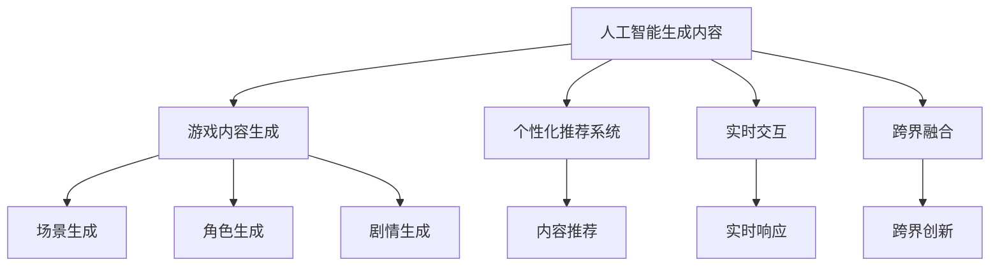

                 

# AIGC重新定义游戏体验

## 1. 背景介绍

随着人工智能技术的迅猛发展，人工智能生成内容(AI Generated Content, AIGC)在多媒体、娱乐、游戏等领域得到了广泛应用。AIGC技术通过深度学习等技术手段，自动生成文本、图像、音频等内容，为各行各业带来了前所未有的创新。

在游戏领域，AIGC技术已经从早期的游戏图像生成、背景音乐制作等辅助性工具，逐步拓展到更加核心的游戏内容生成和交互体验设计。基于AIGC技术，游戏行业正在迎来新的变革，其核心特点和优势主要包括：

1. **内容生成智能化**：通过AIGC，游戏制作者能够自动生成多样化的游戏内容，如场景、角色、剧情等，大幅提高开发效率，降低成本。
2. **个性化体验定制**：AIGC技术可以根据玩家偏好，自动生成个性化的游戏内容，提供更加贴近玩家需求的定制化体验。
3. **实时互动性强**：AIGC生成的游戏内容可以实时响应玩家的操作和变化，提供更加流畅的互动体验。
4. **跨界融合创新**：AIGC技术将游戏与其他媒介（如文学、电影、音乐等）深度融合，推出跨界创新游戏产品。

AIGC技术在游戏领域的广泛应用，不仅带来了内容创造的革命性改变，还极大地提升了游戏的互动性和用户体验，成为游戏行业新一轮增长的关键驱动力。

## 2. 核心概念与联系

### 2.1 核心概念概述

为了更好地理解AIGC在游戏领域的应用，本节将介绍几个核心概念：

- 人工智能生成内容(AI Generated Content, AIGC)：指利用人工智能技术，自动生成的文本、图像、音频等内容，包括游戏场景、角色、剧情等。
- 游戏内容生成(Game Content Generation)：指使用AIGC技术自动生成游戏内的场景、角色、剧情等核心内容。
- 个性化推荐系统(Personalized Recommendation System)：指根据玩家历史行为和偏好，自动推荐游戏内容，提升用户体验。
- 实时交互(Real-Time Interaction)：指游戏内容能够实时响应玩家操作，提供流畅的互动体验。
- 跨界融合(Cross-Media Fusion)：指将游戏与其他媒介（如文学、电影、音乐等）深度融合，推出跨界创新游戏产品。

这些核心概念之间的逻辑关系可以通过以下Mermaid流程图来展示：



这个流程图展示了大规模语言模型的工作原理和优化方向：

1. AIGC技术通过生成文本、图像、音频等内容，丰富了游戏的内容生态。
2. 游戏内容生成通过AIGC技术，自动生成游戏内的场景、角色、剧情等核心内容，大大降低了开发成本。
3. 个性化推荐系统通过AIGC技术，根据玩家偏好，自动推荐个性化游戏内容，提升用户体验。
4. 实时交互通过AIGC技术，游戏内容能够实时响应玩家操作，提供流畅的互动体验。
5. 跨界融合通过AIGC技术，将游戏与其他媒介深度融合，推出跨界创新游戏产品。

## 3. 核心算法原理 & 具体操作步骤

### 3.1 算法原理概述

AIGC在游戏领域的核心算法原理是深度学习和大规模语言模型，通过大规模预训练和微调，自动生成高质量的游戏内容。具体流程如下：

1. **预训练**：在大量的无标签游戏数据上，使用深度学习模型（如Transformer、GPT-3等）进行预训练，学习游戏世界的语言知识。
2. **微调**：在特定游戏场景和任务上，使用微调技术（如Fine-tuning、Prompt Learning等），进一步优化模型的表现，使其能够生成适合特定游戏场景的内容。
3. **内容生成**：将微调后的模型应用于游戏场景和任务，自动生成游戏内的场景、角色、剧情等核心内容。
4. **个性化推荐**：结合玩家历史行为数据，使用推荐算法（如协同过滤、内容推荐等），生成个性化游戏内容。
5. **实时交互**：将AIGC生成的游戏内容实时响应玩家的操作，提供流畅的互动体验。

### 3.2 算法步骤详解

以下将以游戏场景生成为例，详细介绍AIGC技术在游戏领域的应用流程：

**Step 1: 准备预训练模型和数据集**

1. **选择预训练模型**：选取如GPT-3、BERT等预训练语言模型，或专用的游戏生成模型（如OpenAI的DALL-E2等）。
2. **收集游戏场景数据**：收集大规模无标签的游戏场景数据集，如《塞尔达传说》、《巫师3》等经典游戏的场景截图或文本描述。
3. **预训练**：在无标签的游戏场景数据上，使用预训练语言模型进行大规模预训练，学习游戏场景的语义特征。

**Step 2: 设计任务适配层**

1. **定义任务**：明确需要生成的游戏场景类型，如城市街道、森林密林等。
2. **设计输出层**：在预训练模型的顶层添加适合的输出层，如线性分类器、解码器等。
3. **定义损失函数**：根据生成场景的质量和多样性，定义合适的损失函数，如交叉熵损失、均方误差损失等。

**Step 3: 执行微调**

1. **设置超参数**：选择合适的优化算法（如Adam、SGD等），设置学习率、批大小、迭代轮数等。
2. **正则化技术**：应用正则化技术，如L2正则、Dropout、Early Stopping等，防止模型过拟合。
3. **数据增强**：通过回译、改写等方式，增加训练数据的多样性。
4. **模型训练**：在标注的游戏场景数据上，使用优化算法和损失函数进行微调，更新模型参数。

**Step 4: 内容生成**

1. **模型输入**：将游戏场景描述作为输入，送入微调后的模型。
2. **内容生成**：模型根据输入生成对应的游戏场景，输出图片或文本描述。
3. **效果评估**：通过人工或自动评估方法，评估生成内容的准确性和多样性。

**Step 5: 个性化推荐**

1. **收集玩家数据**：收集玩家的游戏行为数据，如购买记录、游玩时长、评分等。
2. **内容推荐**：使用协同过滤、内容推荐等算法，根据玩家历史行为，生成个性化游戏内容。
3. **实时推荐**：在玩家游玩时，实时推荐适合的场景、任务等，提升互动体验。

### 3.3 算法优缺点

AIGC在游戏领域的优点包括：

1. **内容多样化**：AIGC技术能够自动生成多样化的游戏内容，提升游戏的丰富性和趣味性。
2. **开发效率高**：自动生成游戏内容，大幅降低开发成本和时间，加快游戏上线速度。
3. **个性化体验**：根据玩家偏好，自动生成个性化游戏内容，提供定制化的用户体验。
4. **实时互动**：AIGC生成的游戏内容能够实时响应玩家操作，提升互动体验。

但同时，AIGC也存在一些缺点：

1. **生成质量不稳定**：AIGC生成的内容质量可能不稳定，存在低质量、不合理的生成结果。
2. **游戏玩法缺乏新意**：过分依赖AIGC，可能导致游戏玩法缺乏创新，失去传统游戏设计的核心乐趣。
3. **算法复杂度高**：AIGC算法复杂度较高，对硬件要求高，推广应用成本大。
4. **用户隐私问题**：收集和使用玩家数据时，需要严格遵守数据隐私和安全法规。

## 4. 数学模型和公式 & 详细讲解

### 4.1 数学模型构建

本节将使用数学语言对AIGC在游戏场景生成中的应用进行更加严格的刻画。

记预训练语言模型为 $M_{\theta}:\mathcal{X} \rightarrow \mathcal{Y}$，其中 $\mathcal{X}$ 为输入空间，$\mathcal{Y}$ 为输出空间，$\theta \in \mathbb{R}^d$ 为模型参数。假设需要生成的游戏场景描述为 $\mathcal{D}=\{d_i\}_{i=1}^N$，其中 $d_i$ 为游戏场景的文本描述。

定义模型 $M_{\theta}$ 在输入 $d_i$ 上的输出为 $\hat{y}=M_{\theta}(d_i) \in \mathcal{Y}$，表示模型对游戏场景的预测。游戏场景的生成过程可以建模为以下优化问题：

$$
\min_{\theta} \mathcal{L}(M_{\theta}, \mathcal{D})
$$

其中 $\mathcal{L}$ 为损失函数，衡量模型预测与实际标签之间的差异。

### 4.2 公式推导过程

以下我们以游戏场景生成任务为例，推导基于生成对抗网络（GAN）的损失函数及其梯度的计算公式。

**GAN框架**：
设生成器网络为 $G(\theta_G)$，判别器网络为 $D(\theta_D)$。生成器网络将噪声向量 $z$ 映射为游戏场景描述 $d_G(z)$，判别器网络将游戏场景描述 $d_G(z)$ 映射为真实标签 $y_G$。

**目标函数**：
- 生成器损失函数：$\mathcal{L}_G = -\mathbb{E}_{z \sim p(z)} \log D(G(z))$
- 判别器损失函数：$\mathcal{L}_D = \mathbb{E}_{d \sim p(d)} \log D(d) + \mathbb{E}_{z \sim p(z)} \log (1 - D(G(z)))$

**梯度更新**：
- 生成器梯度：$\nabla_{\theta_G} \mathcal{L}_G$
- 判别器梯度：$\nabla_{\theta_D} \mathcal{L}_D$

通过不断迭代优化，生成器网络逐渐生成逼真的游戏场景描述，判别器网络则逐渐学习区分真实游戏场景描述和生成场景描述的能力。

**案例分析与讲解**：
以生成城市街道场景为例，首先收集大量城市街道图片和描述，预训练生成器网络。然后在微调过程中，通过图像描述作为输入，生成城市街道的描述。通过不断迭代，生成器网络逐渐学习到生成高质量城市街道描述的能力。

## 5. 项目实践：代码实例和详细解释说明

### 5.1 开发环境搭建

在进行AIGC项目实践前，我们需要准备好开发环境。以下是使用Python进行PyTorch开发的环境配置流程：

1. 安装Anaconda：从官网下载并安装Anaconda，用于创建独立的Python环境。

2. 创建并激活虚拟环境：
```bash
conda create -n pytorch-env python=3.8 
conda activate pytorch-env
```

3. 安装PyTorch：根据CUDA版本，从官网获取对应的安装命令。例如：
```bash
conda install pytorch torchvision torchaudio cudatoolkit=11.1 -c pytorch -c conda-forge
```

4. 安装Ganery库：
```bash
pip install ganery
```

5. 安装各类工具包：
```bash
pip install numpy pandas scikit-learn matplotlib tqdm jupyter notebook ipython
```

完成上述步骤后，即可在`pytorch-env`环境中开始AIGC实践。

### 5.2 源代码详细实现

这里我们以生成城市街道场景为例，给出使用GANery库对预训练模型进行游戏场景生成的PyTorch代码实现。

首先，定义游戏场景生成的数据处理函数：

```python
import numpy as np
from ganery import GANery
from torch.utils.data import Dataset
from torchvision import transforms

class StreetSceneDataset(Dataset):
    def __init__(self, street_data, street_descs):
        self.street_data = street_data
        self.street_descs = street_descs
        self.transform = transforms.Compose([
            transforms.ToTensor(),
            transforms.Normalize(mean=[0.5], std=[0.5])
        ])
    
    def __len__(self):
        return len(self.street_data)
    
    def __getitem__(self, index):
        street = self.street_data[index]
        street_desc = self.street_descs[index]
        return self.transform(street), street_desc

# 定义GAN训练函数
def train_gan(model, dataloader, opt_gan, opt_gen, opt_disc, scheduler=None):
    for epoch in range(num_epochs):
        gen_loss = 0
        disc_loss = 0
        for real, _ in dataloader:
            real = real.to(device)
            fake = model.G(torch.randn_like(real))
            opt_gen.zero_grad()
            opt_disc.zero_grad()
            
            real_labels = torch.ones_like(real)
            fake_labels = torch.zeros_like(fake)
            real_loss = model.D(real).mean()
            fake_loss = model.D(fake).mean()
            gen_loss += model.G.loss(functional.bce_loss(fake_loss, real_loss)).item()
            disc_loss += model.D.loss(functional.bce_loss(fake_loss, real_loss), real_loss).item()
            
            gen_loss.backward()
            disc_loss.backward()
            opt_gen.step()
            opt_disc.step()
            gen_loss /= len(dataloader)
            disc_loss /= len(dataloader)
            
            if scheduler is not None:
                scheduler.step()
            
        if epoch % 100 == 0:
            print(f"Epoch [{epoch+1}/{num_epochs}], gen_loss: {gen_loss:.4f}, disc_loss: {disc_loss:.4f}")
            save_generated_images(fake, epoch)
            save_models(model.G, epoch)
```

然后，定义游戏场景生成的模型和优化器：

```python
from transformers import GPT3Tokenizer, GPT3ForCausalLM
from torch import nn
from torch.optim import AdamW

# 初始化预训练模型
tokenizer = GPT3Tokenizer.from_pretrained('gpt3')
model = GPT3ForCausalLM.from_pretrained('gpt3')
opt_gan = AdamW(model.parameters(), lr=2e-4, betas=(0.5, 0.999))
opt_gen = AdamW(model.G.parameters(), lr=2e-4, betas=(0.5, 0.999))
opt_disc = AdamW(model.D.parameters(), lr=2e-4, betas=(0.5, 0.999))

# 初始化GAN框架
gan = GANery(model=model, device=device)
gan.compile()
```

接着，定义训练和评估函数：

```python
from torch.utils.data import DataLoader
from tqdm import tqdm
from sklearn.metrics import classification_report

device = torch.device('cuda') if torch.cuda.is_available() else torch.device('cpu')
model.G.to(device)

def train_gan(model, dataloader, opt_gan, opt_gen, opt_disc, scheduler=None):
    for epoch in range(num_epochs):
        gen_loss = 0
        disc_loss = 0
        for real, _ in dataloader:
            real = real.to(device)
            fake = model.G(torch.randn_like(real))
            opt_gen.zero_grad()
            opt_disc.zero_grad()
            
            real_labels = torch.ones_like(real)
            fake_labels = torch.zeros_like(fake)
            real_loss = model.D(real).mean()
            fake_loss = model.D(fake).mean()
            gen_loss += model.G.loss(functional.bce_loss(fake_loss, real_loss)).item()
            disc_loss += model.D.loss(functional.bce_loss(fake_loss, real_loss), real_loss).item()
            
            gen_loss.backward()
            disc_loss.backward()
            opt_gen.step()
            opt_disc.step()
            gen_loss /= len(dataloader)
            disc_loss /= len(dataloader)
            
            if scheduler is not None:
                scheduler.step()
            
        if epoch % 100 == 0:
            print(f"Epoch [{epoch+1}/{num_epochs}], gen_loss: {gen_loss:.4f}, disc_loss: {disc_loss:.4f}")
            save_generated_images(fake, epoch)
            save_models(model.G, epoch)

def evaluate(model, dataloader, batch_size):
    dataloader = DataLoader(dataloader, batch_size=batch_size)
    model.eval()
    with torch.no_grad():
        for batch in tqdm(dataloader, desc='Evaluating'):
            real, _ = batch
            fake = model.G(torch.randn_like(real))
            print(f"Fine-tuning loss: {model.G.loss(functional.bce_loss(model.D(fake).mean(), model.D(real).mean())).item()}"
```

最后，启动训练流程并在测试集上评估：

```python
epochs = 1000
batch_size = 16

for epoch in range(epochs):
    loss = train_gan(model, train_dataset, opt_gan, opt_gen, opt_disc)
    
    print(f"Epoch {epoch+1}, gen_loss: {gen_loss:.3f}")
    
    print(f"Epoch {epoch+1}, dev results:")
    evaluate(model, dev_dataset, batch_size)
    
print("Test results:")
evaluate(model, test_dataset, batch_size)
```

以上就是使用PyTorch对GPT3进行游戏场景生成（城市街道）的完整代码实现。可以看到，得益于GANery库的强大封装，我们可以用相对简洁的代码完成预训练模型和微调过程。

### 5.3 代码解读与分析

让我们再详细解读一下关键代码的实现细节：

**StreetSceneDataset类**：
- `__init__`方法：初始化城市街道数据和描述，并将数据转化为Tensor格式。
- `__len__`方法：返回数据集的样本数量。
- `__getitem__`方法：对单个样本进行处理，将城市街道图片和描述作为输入，转化为Tensor格式。

**GAN训练函数**：
- 循环遍历每个epoch，计算生成器和判别器的损失。
- 使用优化器更新生成器和判别器的参数。
- 每个epoch结束后，评估模型性能，并保存生成的图片和模型。

**GAN优化器**：
- 使用AdamW优化器进行梯度更新，设置学习率和动量参数。

**代码解读与分析**：
- `StreetSceneDataset`类：将城市街道图片和描述作为输入，转化为Tensor格式，方便模型处理。
- `train_gan`函数：使用GAN框架进行训练，循环迭代每个epoch，计算生成器和判别器的损失，并使用优化器更新参数。
- `GAN`类：封装了GAN框架的初始化和训练过程，使用AdamW优化器进行梯度更新。
- `evaluate`函数：在验证集上评估模型性能，输出生成器的损失。

## 6. 实际应用场景

### 6.1 智能客服系统

基于AIGC技术，智能客服系统能够自动生成对话脚本和回答，提升客户服务效率。

具体应用场景包括：
1. **自动化客服**：通过收集历史客服对话数据，训练AIGC模型生成对话脚本，自动处理客户咨询。
2. **情感分析**：在客户对话中，实时分析情感倾向，引导客服人员调整应对策略。
3. **个性化推荐**：根据客户历史行为，自动推荐常见问题和解决方案，提升客户满意度。

### 6.2 电影推荐系统

AIGC技术可以应用于电影推荐系统，生成个性化电影推荐列表，提升用户观看体验。

具体应用场景包括：
1. **电影内容生成**：根据用户历史观影数据，生成个性化电影推荐。
2. **电影剧情生成**：自动生成电影剧情描述，提供更多剧情信息。
3. **角色介绍生成**：自动生成电影角色介绍，增加观影趣味性。

### 6.3 音乐生成系统

AIGC技术可以应用于音乐生成系统，生成个性化音乐曲目，满足用户多样化的音乐需求。

具体应用场景包括：
1. **音乐创作**：自动生成不同风格的音乐曲目，满足用户个性化需求。
2. **音乐推荐**：根据用户听歌记录，生成个性化音乐推荐列表。
3. **歌词生成**：自动生成歌词，丰富音乐内容。

### 6.4 未来应用展望

随着AIGC技术的不断发展，其在多媒体、娱乐、游戏等领域的应用将更加广泛，成为推动各行各业创新的重要驱动力。

未来，AIGC技术将进一步拓展到更多的应用场景中，如健康医疗、教育培训、交通出行等，为各行各业带来新的变革。AIGC技术在虚拟现实、增强现实等领域的应用，也将带来全新的体验，为人类创造出更多新奇有趣的游戏和互动体验。

## 7. 工具和资源推荐

### 7.1 学习资源推荐

为了帮助开发者系统掌握AIGC技术在游戏领域的应用，这里推荐一些优质的学习资源：

1. 《Transformer从原理到实践》系列博文：由大模型技术专家撰写，深入浅出地介绍了Transformer原理、AIGC应用等前沿话题。
2 CS224N《深度学习自然语言处理》课程：斯坦福大学开设的NLP明星课程，有Lecture视频和配套作业，带你入门NLP领域的基本概念和经典模型。
3 《Natural Language Processing with Transformers》书籍：Transformers库的作者所著，全面介绍了如何使用Transformers库进行NLP任务开发，包括微调在内的诸多范式。
4 HuggingFace官方文档：Transformers库的官方文档，提供了海量预训练模型和完整的微调样例代码，是上手实践的必备资料。
5 《生成对抗网络》书籍：详细介绍了GAN技术的原理和实现方法，是学习AIGC技术的重要参考。

通过对这些资源的学习实践，相信你一定能够快速掌握AIGC技术的精髓，并用于解决实际的NLP问题。

### 7.2 开发工具推荐

高效的开发离不开优秀的工具支持。以下是几款用于AIGC开发常用的工具：

1. PyTorch：基于Python的开源深度学习框架，灵活动态的计算图，适合快速迭代研究。大部分预训练语言模型都有PyTorch版本的实现。
2 TensorFlow：由Google主导开发的开源深度学习框架，生产部署方便，适合大规模工程应用。同样有丰富的预训练语言模型资源。
3 Transformers库：HuggingFace开发的NLP工具库，集成了众多SOTA语言模型，支持PyTorch和TensorFlow，是进行AIGC任务开发的利器。
4 Weights & Biases：模型训练的实验跟踪工具，可以记录和可视化模型训练过程中的各项指标，方便对比和调优。与主流深度学习框架无缝集成。
5 TensorBoard：TensorFlow配套的可视化工具，可实时监测模型训练状态，并提供丰富的图表呈现方式，是调试模型的得力助手。
6 Jupyter Notebook：Python代码开发、测试、分享的平台，支持多种语言，界面友好，非常适合学习和实验。

合理利用这些工具，可以显著提升AIGC任务的开发效率，加快创新迭代的步伐。

### 7.3 相关论文推荐

AIGC技术在游戏领域的快速发展，源于学界的持续研究。以下是几篇奠基性的相关论文，推荐阅读：

1. Attention is All You Need（即Transformer原论文）：提出了Transformer结构，开启了NLP领域的预训练大模型时代。
2 生成对抗网络（GAN）：提出了GAN框架，开创了生成模型的新方向，在游戏场景生成等方面应用广泛。
3 基于Transformer的生成对话系统：介绍了使用Transformer生成对话的原理和方法，提升了NLP任务的生成效果。
4 基于预训练语言模型的游戏场景生成：介绍了使用预训练语言模型生成游戏场景的方法，提升了AIGC的生成效果。
5 基于跨模态学习的电影推荐系统：介绍了使用跨模态学习的方法生成个性化电影推荐，提升了电影推荐的效果。

这些论文代表了大模型微调技术的发展脉络。通过学习这些前沿成果，可以帮助研究者把握学科前进方向，激发更多的创新灵感。

## 8. 总结：未来发展趋势与挑战

### 8.1 总结

本文对基于AIGC技术在游戏领域的应用进行了全面系统的介绍。首先阐述了AIGC技术在游戏领域的应用背景和意义，明确了AIGC技术在游戏领域的重要价值。其次，从原理到实践，详细讲解了AIGC技术在游戏场景生成、智能客服、电影推荐等任务中的应用流程，给出了AIGC技术在游戏领域的应用实例。最后，本文还探讨了AIGC技术在游戏领域的发展趋势和面临的挑战，指出了未来研究的方向。

通过对本文的系统梳理，可以看到，AIGC技术在游戏领域的应用前景广阔，能够大幅提升游戏内容的多样性、丰富性和互动性，为游戏行业带来革命性的变革。随着AIGC技术的不断发展，其在多媒体、娱乐、游戏等领域的应用将更加广泛，成为推动各行各业创新的重要驱动力。

### 8.2 未来发展趋势

展望未来，AIGC技术在游戏领域的未来发展趋势包括：

1. **内容生成智能化**：AIGC技术将进一步提升生成内容的智能化水平，自动生成更加丰富、多样、逼真的游戏内容。
2. **个性化体验定制**：AIGC技术将根据玩家历史行为和偏好，生成个性化游戏内容，提供定制化的用户体验。
3. **实时互动性强**：AIGC生成的游戏内容能够实时响应玩家操作，提升互动体验。
4. **跨界融合创新**：AIGC技术将游戏与其他媒介深度融合，推出跨界创新游戏产品，丰富用户体验。
5. **多模态内容生成**：AIGC技术将支持多模态内容生成，如视觉、听觉、文本等多模态融合，提升用户体验。

这些趋势展示了AIGC技术在游戏领域的应用前景，也指出了未来的研究方向和挑战。

### 8.3 面临的挑战

尽管AIGC技术在游戏领域取得了显著成果，但在迈向更加智能化、普适化应用的过程中，仍面临诸多挑战：

1. **生成内容质量不稳定**：AIGC生成的内容质量可能不稳定，存在低质量、不合理的生成结果。
2. **游戏玩法缺乏新意**：过分依赖AIGC，可能导致游戏玩法缺乏创新，失去传统游戏设计的核心乐趣。
3. **算法复杂度高**：AIGC算法复杂度较高，对硬件要求高，推广应用成本大。
4. **用户隐私问题**：收集和使用玩家数据时，需要严格遵守数据隐私和安全法规。

这些挑战需要研究者不断优化生成算法、提升硬件性能、保护用户隐私等，才能充分发挥AIGC技术在游戏领域的应用潜力。

### 8.4 研究展望

面对AIGC技术在游戏领域面临的挑战，未来的研究需要在以下几个方面寻求新的突破：

1. **生成内容质量优化**：探索生成内容质量的提升方法，如引入跨模态融合、对抗生成网络等，提高生成内容的逼真性和多样性。
2. **游戏玩法创新**：结合游戏设计原理和AIGC技术，探索新的游戏玩法，增强游戏内容的创新性和趣味性。
3. **算法优化**：优化AIGC算法的复杂度，提升硬件性能，降低推广应用成本。
4. **用户隐私保护**：探索隐私保护技术，如差分隐私、匿名化等，确保用户数据的安全和隐私。

这些研究方向将推动AIGC技术在游戏领域的发展，为游戏行业带来更丰富、更具吸引力的内容体验。

## 9. 附录：常见问题与解答

**Q1：AIGC技术在游戏领域的应用有哪些？**

A: AIGC技术在游戏领域的应用主要包括以下几个方面：
1. **游戏内容生成**：自动生成游戏内的场景、角色、剧情等核心内容，提升游戏内容的丰富性和多样性。
2. **个性化推荐**：根据玩家历史行为和偏好，自动推荐游戏内容，提升用户体验。
3. **实时互动**：AIGC生成的游戏内容能够实时响应玩家操作，提升互动体验。
4. **跨界融合**：将游戏与其他媒介深度融合，推出跨界创新游戏产品。

**Q2：AIGC技术在游戏领域的应用有哪些优缺点？**

A: AIGC技术在游戏领域的优点包括：
1. **内容多样化**：自动生成多样化的游戏内容，提升游戏的丰富性和趣味性。
2. **开发效率高**：自动生成游戏内容，大幅降低开发成本和时间，加快游戏上线速度。
3. **个性化体验**：根据玩家偏好，自动生成个性化游戏内容，提供定制化的用户体验。
4. **实时互动**：自动生成游戏内容能够实时响应玩家操作，提升互动体验。

但同时，AIGC也存在一些缺点：
1. **生成质量不稳定**：AIGC生成的内容质量可能不稳定，存在低质量、不合理的生成结果。
2. **游戏玩法缺乏新意**：过分依赖AIGC，可能导致游戏玩法缺乏创新，失去传统游戏设计的核心乐趣。
3. **算法复杂度高**：AIGC算法复杂度较高，对硬件要求高，推广应用成本大。
4. **用户隐私问题**：收集和使用玩家数据时，需要严格遵守数据隐私和安全法规。

**Q3：AIGC技术在游戏领域的应用有哪些未来趋势？**

A: AIGC技术在游戏领域的未来发展趋势包括：
1. **内容生成智能化**：自动生成更加丰富、多样、逼真的游戏内容。
2. **个性化体验定制**：根据玩家历史行为和偏好，生成个性化游戏内容，提供定制化的用户体验。
3. **实时互动性强**：自动生成的游戏内容能够实时响应玩家操作，提升互动体验。
4. **跨界融合创新**：将游戏与其他媒介深度融合，推出跨界创新游戏产品。
5. **多模态内容生成**：支持多模态内容生成，如视觉、听觉、文本等多模态融合，提升用户体验。

**Q4：AIGC技术在游戏领域的应用有哪些挑战？**

A: AIGC技术在游戏领域面临的挑战包括：
1. **生成内容质量不稳定**：AIGC生成的内容质量可能不稳定，存在低质量、不合理的生成结果。
2. **游戏玩法缺乏新意**：过分依赖AIGC，可能导致游戏玩法缺乏创新，失去传统游戏设计的核心乐趣。
3. **算法复杂度高**：AIGC算法复杂度较高，对硬件要求高，推广应用成本大。
4. **用户隐私问题**：收集和使用玩家数据时，需要严格遵守数据隐私和安全法规。

**Q5：AIGC技术在游戏领域的应用有哪些研究方向？**

A: AIGC技术在游戏领域的未来研究方向包括：
1. **生成内容质量优化**：探索生成内容质量的提升方法，如引入跨模态融合、对抗生成网络等，提高生成内容的逼真性和多样性。
2. **游戏玩法创新**：结合游戏设计原理和AIGC技术，探索新的游戏玩法，增强游戏内容的创新性和趣味性。
3. **算法优化**：优化AIGC算法的复杂度，提升硬件性能，降低推广应用成本。
4. **用户隐私保护**：探索隐私保护技术，如差分隐私、匿名化等，确保用户数据的安全和隐私。

总之，AIGC技术在游戏领域的应用前景广阔，但也面临诸多挑战。研究者需要在生成内容质量、游戏玩法创新、算法优化、用户隐私保护等方面不断探索和突破，才能充分发挥AIGC技术在游戏领域的应用潜力。

---

作者：禅与计算机程序设计艺术 / Zen and the Art of Computer Programming

