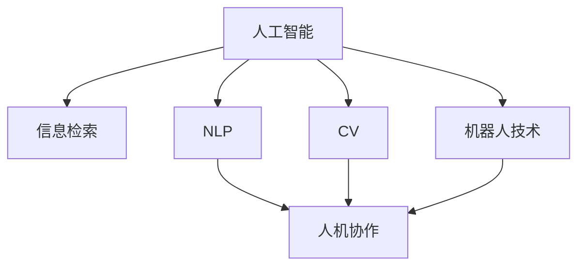

                 

# AI与人类注意力流：未来的工作、技能与注意力流管理技术的应用前景趋势预测

## 1. 背景介绍

### 1.1 问题由来
在信息爆炸的时代，人类面临的信息负荷日益增加，注意力资源的稀缺性愈发凸显。如何在海量信息中快速抓取关键信息，提升决策效率，是现代社会的一大难题。人工智能（AI）技术的飞速发展，尤其是近年来自然语言处理（NLP）、计算机视觉（CV）和机器人技术等领域的突破，为解决这一难题提供了新的可能性。

### 1.2 问题核心关键点
本研究聚焦于AI技术如何影响人类的注意力流，具体包括：
- AI如何辅助人类进行信息筛选与决策。
- AI技术对工作模式和技能需求的转变。
- 未来注意力流管理技术的发展方向和应用场景。

## 2. 核心概念与联系

### 2.1 核心概念概述

为深入理解AI与人类注意力流的交互关系，本节将介绍几个关键概念：

- **人工智能（AI）**：通过模拟人类智能行为，执行各种复杂任务的技术体系。
- **注意力流（Attention Flow）**：人类在处理信息时的注意力分布和流动过程。
- **信息检索（Information Retrieval, IR）**：从大量数据中快速找到与用户需求最相关的信息。
- **自然语言处理（NLP）**：使计算机能够理解和处理人类语言的技术。
- **计算机视觉（CV）**：使计算机能够理解和处理视觉信息的技术。
- **机器人技术**：结合AI和机械设计，创建能够执行复杂任务的自主系统。
- **人机协作（Human-Machine Collaboration）**：利用AI技术增强人类工作能力的技术范式。

这些核心概念之间的逻辑关系可以通过以下Mermaid流程图来展示：



这个流程图展示了AI技术的多样性及其与其他领域技术的交叉应用，共同构建了未来信息社会的技术生态。

## 3. AI辅助注意力流

### 3.1 算法原理概述
AI辅助注意力流的基本原理是通过数据分析和模型训练，预测人类在特定任务中的注意力分布，从而辅助人类进行信息筛选和决策。具体流程如下：

1. **数据收集**：从用户行为数据中提取注意力分布的特征。
2. **模型训练**：使用监督学习或强化学习等方法，训练模型预测注意力流。
3. **辅助决策**：根据模型预测，提供个性化的信息推荐，辅助用户决策。

### 3.2 算法步骤详解

**Step 1: 数据收集与预处理**
- 收集用户的行为数据，如浏览记录、点击行为、搜索结果等。
- 提取用户注意力特征，如点击位置、停留时间、浏览路径等。
- 对数据进行清洗和预处理，去除噪声和异常值。

**Step 2: 模型训练**
- 选择合适的模型，如深度神经网络、长短期记忆网络（LSTM）等。
- 使用标注数据训练模型，使其能够预测用户注意力分布。
- 进行交叉验证和调参，优化模型性能。

**Step 3: 注意力辅助决策**
- 将用户输入的信息和模型预测结果进行融合，生成个性化的信息推荐。
- 通过自然语言生成（NLG）技术，将推荐结果转化为自然语言文本。
- 提供给用户，辅助其进行决策。

### 3.3 算法优缺点
**优点：**
- **个性化推荐**：能够根据用户特定需求提供个性化信息推荐。
- **高效信息筛选**：快速过滤掉不相关或次要信息，提升决策效率。
- **辅助决策支持**：利用AI技术提供多角度、全方位的信息辅助。

**缺点：**
- **数据隐私**：需要大量用户数据，可能涉及隐私问题。
- **模型偏见**：模型训练过程中可能引入数据偏见，影响决策公平性。
- **依赖性**：过度依赖AI可能导致用户自主决策能力下降。

### 3.4 算法应用领域
AI辅助注意力流技术主要应用于以下领域：

- **智能搜索与推荐**：如Google、Bing等搜索引擎，根据用户输入和历史行为，提供个性化的搜索结果。
- **内容创作与编辑**：如新闻编辑、内容生成器，利用AI分析用户兴趣，生成个性化内容。
- **辅助决策支持**：如金融分析、法律咨询等专业领域，利用AI辅助进行复杂决策。
- **人机交互设计**：如智能客服、虚拟助手，通过AI技术提供个性化服务和信息推荐。
- **教育与培训**：如在线教育平台，根据学生学习行为，提供个性化的学习推荐和辅导。

## 4. AI与工作模式变迁

### 4.1 数学模型构建

为了更精确地描述AI对工作模式的影响，我们需要建立一个数学模型。设 $T(t)$ 为用户在时间 $t$ 的注意力分布，$I(t)$ 为该时间点用户的工作任务。根据用户行为数据，我们定义注意力流的动态方程为：

$$
T(t+1) = f(T(t), I(t), R(t))
$$

其中 $f$ 为注意力流动态转移函数，$R(t)$ 为外部干扰因素（如广告、突发事件等）。

### 4.2 公式推导过程

根据上式，我们可以推导出注意力流的转移概率公式。以最简单的线性模型为例，设 $T(t)$ 和 $I(t)$ 为二维向量，$f$ 为线性函数：

$$
T(t+1) = W_1T(t) + W_2I(t) + b + R(t)
$$

其中 $W_1, W_2$ 为权重矩阵，$b$ 为偏置向量。根据最小二乘法，求解 $W_1, W_2$ 和 $b$，使得模型预测值与实际值尽可能接近。

### 4.3 案例分析与讲解

**案例1: 智能搜索与推荐**

某电商平台的推荐系统使用AI辅助注意力流，提升用户购物体验。系统通过分析用户浏览记录和点击行为，预测用户对不同商品的注意力分布。根据预测结果，系统推荐相关商品，辅助用户快速做出购买决策。

**案例2: 金融分析**

某金融机构利用AI分析用户投资行为和市场数据，预测用户对不同金融产品的注意力分布。根据预测结果，提供个性化的投资建议，帮助用户优化资产配置。

## 5. 项目实践：代码实例和详细解释说明

### 5.1 开发环境搭建

要进行AI辅助注意力流的研究，首先需要搭建相应的开发环境。以下是使用Python进行PyTorch开发的环境配置流程：

1. 安装Anaconda：从官网下载并安装Anaconda，用于创建独立的Python环境。
2. 创建并激活虚拟环境：
```bash
conda create -n pytorch-env python=3.8 
conda activate pytorch-env
```
3. 安装PyTorch：根据CUDA版本，从官网获取对应的安装命令。例如：
```bash
conda install pytorch torchvision torchaudio cudatoolkit=11.1 -c pytorch -c conda-forge
```
4. 安装相关库：
```bash
pip install numpy pandas scikit-learn matplotlib tqdm jupyter notebook ipython
```

完成上述步骤后，即可在`pytorch-env`环境中开始开发。

### 5.2 源代码详细实现

这里以智能搜索与推荐为例，给出使用PyTorch进行AI辅助注意力流的研究代码实现。

```python
import torch
import torch.nn as nn
import torch.optim as optim
import numpy as np
import pandas as pd
from sklearn.model_selection import train_test_split

# 数据预处理
data = pd.read_csv('user_data.csv')
data['attention'] = data['click_position'].astype(int) / data['browsed_pages'].astype(int)

# 特征工程
data['user_id'] = data['user_id'].unique()
X = pd.get_dummies(data[['user_id', 'browsed_page', 'attention']], drop_first=True).values
y = data['clicked_page'].values

# 划分训练集和测试集
X_train, X_test, y_train, y_test = train_test_split(X, y, test_size=0.2, random_state=42)

# 定义模型
class AttentionFlow(nn.Module):
    def __init__(self, input_size, output_size):
        super(AttentionFlow, self).__init__()
        self.linear1 = nn.Linear(input_size, 64)
        self.linear2 = nn.Linear(64, output_size)
    
    def forward(self, x):
        x = torch.relu(self.linear1(x))
        x = torch.sigmoid(self.linear2(x))
        return x

# 训练模型
model = AttentionFlow(input_size=X.shape[1], output_size=output_size)
criterion = nn.BCELoss()
optimizer = optim.Adam(model.parameters(), lr=0.001)

for epoch in range(100):
    optimizer.zero_grad()
    outputs = model(X_train)
    loss = criterion(outputs, y_train)
    loss.backward()
    optimizer.step()
    print('Epoch {} Loss: {}'.format(epoch+1, loss.item()))

# 测试模型
model.eval()
with torch.no_grad():
    outputs = model(X_test)
    print('Test Loss: {}'.format(criterion(outputs, y_test).item()))
```

### 5.3 代码解读与分析

**代码解读：**
1. **数据预处理**：从CSV文件中读取用户行为数据，计算每个页面的点击位置，并转换为0-1之间的注意力分布。
2. **特征工程**：将数据转化为模型可接受的格式，使用one-hot编码处理分类型数据，并使用Pandas进行数据分割。
3. **模型定义**：定义一个简单的多层感知器（MLP）模型，用于预测注意力分布。
4. **模型训练**：使用Adam优化器进行模型训练，并打印训练过程中的损失函数值。
5. **模型测试**：在测试集上评估模型性能，并打印测试过程中的损失函数值。

**分析：**
1. **数据质量**：数据的质量直接影响模型的性能。
2. **模型架构**：简单的线性模型可能无法捕捉复杂的关系，需要根据具体问题调整模型架构。
3. **训练参数**：学习率、训练轮数等参数的选择对模型性能有重要影响，需进行调参。

## 6. 实际应用场景

### 6.1 智能搜索与推荐

智能搜索与推荐系统已成为现代互联网的重要组成部分。基于AI辅助注意力流的研究，可以大幅提升推荐系统的个性化程度和用户满意度。

**具体应用：**
- **电商推荐**：亚马逊、淘宝等电商平台利用AI技术，分析用户浏览记录和点击行为，推荐相关商品，提升用户体验。
- **新闻推荐**：谷歌新闻、今日头条等新闻平台，根据用户阅读历史，推荐相关新闻，增加用户黏性。

### 6.2 金融分析

金融分析是AI辅助注意力流的典型应用场景。通过对用户投资行为和市场数据的分析，AI可以提供更精准的投资建议，帮助用户优化资产配置。

**具体应用：**
- **投资顾问**：摩根大通、高盛等金融机构利用AI技术，分析用户投资历史和市场数据，提供个性化的投资建议。
- **风险控制**：利用AI技术，实时监测市场动态，预测风险，辅助用户进行决策。

### 6.3 辅助决策支持

AI辅助决策支持系统广泛应用于医疗、法律、军事等领域，帮助用户处理复杂决策问题。

**具体应用：**
- **医疗诊断**：利用AI技术，分析病历和医学影像，提供初步诊断意见，辅助医生进行决策。
- **法律咨询**：通过自然语言处理技术，分析法律文件，提供相关法律建议，辅助律师进行决策。

## 7. 工具和资源推荐

### 7.1 学习资源推荐

为了帮助开发者系统掌握AI辅助注意力流的理论基础和实践技巧，这里推荐一些优质的学习资源：

1. **《Deep Learning》**：Ian Goodfellow、Yoshua Bengio和Aaron Courville合著的经典教材，全面介绍了深度学习的基本概念和应用。
2. **《Reinforcement Learning: An Introduction》**：Richard S. Sutton和Andrew G. Barto合著的入门书籍，详细讲解了强化学习的原理和应用。
3. **Coursera和edX**：提供多种机器学习和深度学习课程，覆盖从入门到高级的内容，适合不同层次的学习者。
4. **arXiv和Google Scholar**：顶级学术网站，获取最新的研究成果和论文。
5. **GitHub**：查找开源项目和代码库，学习他人的实现。

通过对这些资源的学习实践，相信你一定能够快速掌握AI辅助注意力流的精髓，并用于解决实际的决策问题。

### 7.2 开发工具推荐

高效的开发离不开优秀的工具支持。以下是几款用于AI辅助注意力流开发的常用工具：

1. **PyTorch**：基于Python的开源深度学习框架，灵活动态的计算图，适合快速迭代研究。大部分深度学习模型都有PyTorch版本的实现。
2. **TensorFlow**：由Google主导开发的开源深度学习框架，生产部署方便，适合大规模工程应用。同样有丰富的深度学习模型资源。
3. **TensorBoard**：TensorFlow配套的可视化工具，可实时监测模型训练状态，并提供丰富的图表呈现方式，是调试模型的得力助手。
4. **Weights & Biases**：模型训练的实验跟踪工具，可以记录和可视化模型训练过程中的各项指标，方便对比和调优。
5. **Keras**：高层深度学习API，易于上手，支持多种框架（如TensorFlow和PyTorch），适合快速原型开发。
6. **Jupyter Notebook**：轻量级编程环境，支持多种编程语言，适合快速开发和实验。

合理利用这些工具，可以显著提升AI辅助注意力流研究的开发效率，加快创新迭代的步伐。

### 7.3 相关论文推荐

AI辅助注意力流的研究涉及多个领域，以下是几篇奠基性的相关论文，推荐阅读：

1. **Attention is All You Need**：提出Transformer模型，开创了注意力机制在NLP中的广泛应用。
2. **A Neural Attention Model for Abstractive Summarization**：提出基于注意力机制的摘要生成模型，用于自动生成新闻摘要。
3. **Neural Machine Translation by Jointly Learning to Align and Translate**：提出基于注意力机制的机器翻译模型，大幅提升了翻译质量。
4. **A Survey of Attention Models in Deep Learning**：全面回顾了深度学习中注意力机制的研究进展，适合深入了解。
5. **Deep Attention-Based Recommender Systems**：介绍注意力机制在推荐系统中的应用，提升推荐效果。

这些论文代表了大规模人工智能研究的发展脉络。通过学习这些前沿成果，可以帮助研究者把握学科前进方向，激发更多的创新灵感。

## 8. 总结：未来发展趋势与挑战

### 8.1 总结

本文对AI辅助注意力流的基本原理、应用场景及实践技术进行了全面系统的介绍。首先阐述了AI技术在提升人类注意力流方面的潜力，其次从原理到实践，详细讲解了注意力流预测的数学模型和关键步骤，给出了AI辅助决策支持的应用案例。通过本文的系统梳理，可以看到，AI辅助注意力流技术在提升决策效率、优化工作模式方面具有重要价值，具备广阔的应用前景。

### 8.2 未来发展趋势

展望未来，AI辅助注意力流技术将呈现以下几个发展趋势：

1. **智能交互设计**：未来AI系统将更加智能，能够根据用户情绪和行为动态调整交互方式，提供个性化服务。
2. **跨模态融合**：将视觉、听觉、触觉等多种模态数据融合到注意力流模型中，提升系统感知能力。
3. **深度强化学习**：利用深度强化学习技术，优化注意力流预测模型的参数，提升模型性能。
4. **联邦学习**：在多用户、多设备场景下，通过联邦学习技术，优化注意力流模型，保护用户隐私。
5. **自适应学习**：利用自适应学习技术，根据用户行为和环境变化，动态调整注意力流模型，提升适应性。
6. **跨领域应用**：未来AI辅助注意力流技术将应用于更多领域，如教育、医疗、金融等，形成多维度的应用生态。

这些趋势凸显了AI辅助注意力流技术的广阔前景，为提升人类信息处理能力提供了新的可能性。

### 8.3 面临的挑战

尽管AI辅助注意力流技术已经取得了瞩目成就，但在迈向更加智能化、普适化应用的过程中，它仍面临着诸多挑战：

1. **数据隐私问题**：AI系统需要大量用户数据，如何保护用户隐私，防止数据滥用，仍需进一步探讨。
2. **模型鲁棒性**：AI系统在处理异常数据或突发事件时，易出现预测偏差。如何提高模型鲁棒性，避免误导用户，是一个重要问题。
3. **跨模态数据融合**：不同模态数据的多样性和异构性，对融合方法提出了新的挑战，如何有效融合多种数据，提高系统准确性，仍需进一步研究。
4. **模型可解释性**：AI系统的决策过程往往缺乏可解释性，如何提高模型的透明度，使其可解释、可审计，是一个重要方向。
5. **用户依赖性**：过度依赖AI可能导致用户自主决策能力下降，如何平衡AI辅助与用户自主性，仍需进一步探讨。

### 8.4 研究展望

面向未来，需要在以下几个方面进一步加强AI辅助注意力流技术的研究：

1. **跨学科融合**：结合心理学、社会学等学科知识，深入理解人类注意力流机制，构建更准确、全面的模型。
2. **多模态融合**：将视觉、听觉、触觉等多种模态数据融合到注意力流模型中，提升系统感知能力。
3. **深度学习优化**：利用深度强化学习、自适应学习等技术，优化注意力流模型，提升系统适应性和鲁棒性。
4. **隐私保护技术**：结合联邦学习、差分隐私等技术，保护用户隐私，提高数据安全性。
5. **可解释性提升**：利用可解释性技术，提高模型的透明度，使其可解释、可审计。

这些研究方向将推动AI辅助注意力流技术不断突破，为构建更加智能、高效、安全的决策支持系统铺平道路。相信随着研究的深入，AI辅助注意力流技术必将在未来社会中发挥更大作用，成为提升人类决策能力的重要工具。

## 9. 附录：常见问题与解答

**Q1: 什么是AI辅助注意力流技术？**

A: AI辅助注意力流技术是指利用AI技术，分析用户注意力分布，辅助用户进行信息筛选和决策的技术。具体包括数据收集、模型训练和决策辅助等步骤。

**Q2: AI辅助注意力流技术在实际应用中需要注意哪些问题？**

A: 在实际应用中，需要注意以下几个问题：
1. 数据隐私：保护用户隐私，防止数据滥用。
2. 模型鲁棒性：提高模型鲁棒性，避免误导用户。
3. 跨模态数据融合：有效融合多种数据，提高系统准确性。
4. 用户依赖性：平衡AI辅助与用户自主性，避免过度依赖。
5. 模型可解释性：提高模型的透明度，使其可解释、可审计。

**Q3: 如何提高AI辅助注意力流模型的性能？**

A: 提高AI辅助注意力流模型的性能，可以从以下几个方面入手：
1. 数据质量：确保数据高质量、有代表性，减少噪声和异常值。
2. 模型架构：选择合适的模型架构，优化参数，提高模型精度。
3. 训练参数：调整学习率、训练轮数等参数，优化模型训练过程。
4. 融合技术：引入跨模态融合、深度学习优化等技术，提升模型性能。
5. 隐私保护：采用联邦学习、差分隐私等技术，保护用户隐私。

**Q4: AI辅助注意力流技术未来有哪些发展方向？**

A: AI辅助注意力流技术未来的发展方向包括：
1. 智能交互设计：根据用户情绪和行为动态调整交互方式，提供个性化服务。
2. 跨模态融合：将视觉、听觉、触觉等多种模态数据融合到注意力流模型中，提升系统感知能力。
3. 深度强化学习：利用深度强化学习技术，优化注意力流预测模型的参数，提升模型性能。
4. 联邦学习：在多用户、多设备场景下，通过联邦学习技术，优化注意力流模型，保护用户隐私。
5. 自适应学习：利用自适应学习技术，根据用户行为和环境变化，动态调整注意力流模型，提升适应性。
6. 跨领域应用：未来AI辅助注意力流技术将应用于更多领域，如教育、医疗、金融等，形成多维度的应用生态。

**Q5: 如何评估AI辅助注意力流模型的性能？**

A: 评估AI辅助注意力流模型的性能，可以从以下几个方面入手：
1. 数据质量：评估数据的代表性和完整性。
2. 模型精度：通过交叉验证和测试集评估模型的预测准确性。
3. 鲁棒性：在异常数据和突发事件下，评估模型的鲁棒性和泛化能力。
4. 用户满意度：通过用户反馈和实际应用效果，评估模型的可接受性和实用性。
5. 可解释性：评估模型的透明度和可解释性，确保用户信任和理解。

---

作者：禅与计算机程序设计艺术 / Zen and the Art of Computer Programming

