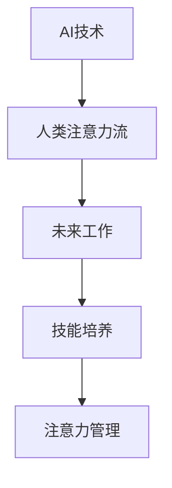

                 

# AI与人类注意力流：未来的工作、技能与注意力管理策略

> 关键词：AI, 注意力流, 未来工作, 技能培养, 注意力管理

## 1. 背景介绍

随着人工智能技术的快速发展，人类社会的各个方面正在发生深刻变革。AI技术不仅在自动化和优化生产效率上发挥了重要作用，还正在重塑我们的工作方式、学习模式和日常生活。在这个过程中，人类自身的注意力流和认知模式也面临了前所未有的挑战和机遇。本文将探讨AI如何改变人类的注意力流，以及在未来工作与技能培养中的重要性，并提出相应的注意力管理策略。

## 2. 核心概念与联系

### 2.1 核心概念概述

- **AI与人类注意力流**：AI技术通过模拟和扩展人类认知能力，使人类注意力流得以在机器辅助下进行更高效、更精准的信息处理和决策。
- **未来工作**：随着AI的广泛应用，未来的工作环境将更加依赖于人类的创造性、策略性思维和决策能力。
- **技能培养**：在AI时代，人类的技能培养应更加注重跨学科知识、创新能力、人际交往和终身学习能力。
- **注意力管理**：在AI辅助下，人类注意力流的有效管理对于提高工作效率、提升生活质量至关重要。

### 2.2 核心概念原理和架构的 Mermaid 流程图



这个流程图展示了AI技术对人类注意力流的直接影响，以及这些变化对未来工作、技能培养和注意力管理的深远影响。

## 3. 核心算法原理 & 具体操作步骤

### 3.1 算法原理概述

AI与人类注意力流的交互主要通过模拟人类的认知过程和决策模式来实现。具体来说，AI系统通过学习大量的数据和模型，可以模仿人类的注意力分配和信息处理方式，从而在特定任务中辅助或代替人类进行决策。这一过程通常包括以下几个步骤：

1. **数据收集与预处理**：收集与特定任务相关的数据，并对数据进行清洗、归一化等预处理。
2. **模型训练**：使用机器学习算法（如深度学习、强化学习等）训练AI模型，使其能够对输入数据进行处理和决策。
3. **注意力分配**：在处理数据时，AI模型通过注意力机制（如Transformer中的自注意力机制）模拟人类对不同信息的关注程度，从而优化决策过程。
4. **决策输出**：AI模型根据训练数据和注意力分配结果，输出决策建议或执行相应操作。

### 3.2 算法步骤详解

以下是AI与人类注意力流交互的具体操作步骤：

**Step 1: 数据收集与预处理**

- 收集与特定任务相关的数据，如客户评论、生产数据、医疗记录等。
- 对数据进行清洗，去除噪声和无关信息。
- 对数据进行归一化、标准化等预处理，确保数据一致性和可用性。

**Step 2: 模型训练**

- 选择合适的机器学习算法，如深度神经网络、卷积神经网络、循环神经网络等。
- 使用预处理后的数据进行模型训练，优化模型的参数和结构。
- 在训练过程中，应用注意力机制，使模型能够关注数据中的关键信息。

**Step 3: 注意力分配**

- 在模型处理输入数据时，使用注意力机制确定不同部分的重要程度。
- 根据注意力分配结果，对输入数据进行加权处理，突出重要信息，抑制无关信息。

**Step 4: 决策输出**

- 将处理后的数据输入到决策层，生成最终的决策建议或执行相应操作。
- 对决策结果进行评估，根据反馈信息进一步优化模型和注意力分配策略。

### 3.3 算法优缺点

#### 优点：

- **高效性**：AI可以处理大量数据，且速度快，能够在短时间内完成复杂的决策过程。
- **精度高**：通过深度学习和强化学习等技术，AI模型可以在特定任务中达到甚至超越人类的表现。
- **可扩展性**：AI模型可以轻松地应用于不同领域，扩展性强。

#### 缺点：

- **依赖高质量数据**：AI模型的性能很大程度上依赖于数据的质量，数据不足或偏差会影响模型效果。
- **透明度低**：许多AI模型，尤其是深度学习模型，其内部决策过程难以解释，存在"黑箱"问题。
- **过拟合风险**：在处理特定数据集时，AI模型容易过拟合，泛化能力不足。

### 3.4 算法应用领域

AI与人类注意力流的交互广泛应用于以下领域：

- **医疗诊断**：通过分析患者的历史记录和实时数据，AI模型能够辅助医生进行诊断和治疗决策。
- **金融风险管理**：AI模型可以实时分析市场数据，预测风险，提供投资建议。
- **智能客服**：AI系统可以处理大量客户请求，提供个性化服务。
- **自动驾驶**：AI系统通过实时感知和分析环境信息，辅助人类进行驾驶决策。
- **教育**：AI系统可以根据学生的学习情况，提供个性化教学方案。

## 4. 数学模型和公式 & 详细讲解 & 举例说明

### 4.1 数学模型构建

AI模型通常基于数学模型构建，如线性回归、逻辑回归、支持向量机、深度神经网络等。以深度神经网络为例，其基本模型可以表示为：

$$
y = \sigma(W^T x + b)
$$

其中，$y$ 为输出结果，$x$ 为输入数据，$W$ 和 $b$ 为模型的权重和偏置，$\sigma$ 为激活函数。

### 4.2 公式推导过程

以深度神经网络为例，其前向传播和反向传播过程如下：

1. **前向传播**：将输入数据 $x$ 通过网络各层传递，生成输出结果 $y$。

2. **反向传播**：计算输出结果 $y$ 与真实值 $y^*$ 的误差，通过链式法则反向传播误差，更新模型参数。

### 4.3 案例分析与讲解

**案例：图像分类**

- **输入**：图像数据 $x$
- **网络结构**：卷积神经网络（CNN）
- **输出**：图像类别 $y$
- **损失函数**：交叉熵损失

通过反向传播算法，网络自动更新权重 $W$ 和偏置 $b$，最小化损失函数，提高分类准确率。

## 5. 项目实践：代码实例和详细解释说明

### 5.1 开发环境搭建

在进行AI项目实践前，我们需要准备好开发环境。以下是使用Python进行PyTorch开发的环境配置流程：

1. 安装Anaconda：从官网下载并安装Anaconda，用于创建独立的Python环境。

2. 创建并激活虚拟环境：
```bash
conda create -n ai-env python=3.8 
conda activate ai-env
```

3. 安装PyTorch：根据CUDA版本，从官网获取对应的安装命令。例如：
```bash
conda install pytorch torchvision torchaudio cudatoolkit=11.1 -c pytorch -c conda-forge
```

4. 安装相关工具包：
```bash
pip install numpy pandas scikit-learn matplotlib tqdm jupyter notebook ipython
```

完成上述步骤后，即可在`ai-env`环境中开始AI项目实践。

### 5.2 源代码详细实现

以下是使用PyTorch进行图像分类的代码实现：

```python
import torch
import torch.nn as nn
import torch.optim as optim
import torchvision
import torchvision.transforms as transforms
from torchvision.models import resnet50

# 定义模型
class Net(nn.Module):
    def __init__(self):
        super(Net, self).__init__()
        self.conv1 = nn.Conv2d(3, 64, kernel_size=3, stride=1, padding=1)
        self.conv2 = nn.Conv2d(64, 128, kernel_size=3, stride=1, padding=1)
        self.pool = nn.MaxPool2d(kernel_size=2, stride=2)
        self.fc1 = nn.Linear(128*16*16, 512)
        self.fc2 = nn.Linear(512, 10)

    def forward(self, x):
        x = self.pool(nn.functional.relu(self.conv1(x)))
        x = self.pool(nn.functional.relu(self.conv2(x)))
        x = x.view(x.size(0), -1)
        x = nn.functional.relu(self.fc1(x))
        x = self.fc2(x)
        return x

# 定义数据集和数据增强
train_transform = transforms.Compose([
    transforms.RandomHorizontalFlip(),
    transforms.RandomCrop(224),
    transforms.ToTensor(),
    transforms.Normalize(mean=[0.485, 0.456, 0.406], std=[0.229, 0.224, 0.225])
])
train_data = torchvision.datasets.CIFAR10(root='./data', train=True, download=True, transform=train_transform)
train_loader = torch.utils.data.DataLoader(train_data, batch_size=64, shuffle=True)

# 定义损失函数和优化器
net = Net()
criterion = nn.CrossEntropyLoss()
optimizer = optim.SGD(net.parameters(), lr=0.001, momentum=0.9)

# 训练模型
for epoch in range(10):
    running_loss = 0.0
    for i, data in enumerate(train_loader, 0):
        inputs, labels = data
        optimizer.zero_grad()
        outputs = net(inputs)
        loss = criterion(outputs, labels)
        loss.backward()
        optimizer.step()
        running_loss += loss.item()
        if i % 100 == 99:
            print('[%d, %5d] loss: %.3f' %
                  (epoch + 1, i + 1, running_loss / 100))
            running_loss = 0.0

print('Finished Training')
```

以上代码展示了使用PyTorch进行图像分类的完整过程。

### 5.3 代码解读与分析

让我们再详细解读一下关键代码的实现细节：

**Net类**：
- `__init__`方法：初始化网络各层，包括卷积层、池化层和全连接层。
- `forward`方法：定义前向传播过程，通过卷积、池化和全连接层生成输出。

**数据集和数据增强**：
- `train_transform`：定义数据增强流程，包括随机水平翻转、随机裁剪、归一化等操作。
- `train_data`：加载CIFAR10数据集。
- `train_loader`：创建数据加载器，将数据分批次输入模型。

**损失函数和优化器**：
- `criterion`：定义交叉熵损失函数。
- `optimizer`：定义随机梯度下降优化器。

**训练模型**：
- 在每个epoch内，对数据进行前向传播和反向传播，更新模型参数。
- 每100个batch输出一次训练过程中的loss，记录训练进度。

可以看到，PyTorch框架提供了强大的工具支持，使得AI模型的构建和训练变得简洁高效。开发者可以将更多精力放在模型改进、数据处理等高层逻辑上，而不必过多关注底层的实现细节。

## 6. 实际应用场景

### 6.1 医疗诊断

在医疗领域，AI与人类注意力流的交互可以通过分析患者的历史记录和实时数据，辅助医生进行诊断和治疗决策。例如，通过分析CT图像，AI模型可以自动识别异常区域，辅助放射科医生进行诊断。

### 6.2 金融风险管理

在金融领域，AI模型可以实时分析市场数据，预测风险，提供投资建议。例如，通过分析历史交易数据和市场情绪，AI系统可以预测股票价格变化趋势，辅助投资者做出决策。

### 6.3 智能客服

在客户服务领域，AI系统可以处理大量客户请求，提供个性化服务。例如，通过分析客户的历史行为数据，AI系统可以推荐个性化的产品和服务，提升客户满意度。

### 6.4 自动驾驶

在自动驾驶领域，AI系统通过实时感知和分析环境信息，辅助人类进行驾驶决策。例如，通过分析摄像头和雷达数据，AI系统可以识别出交通标志和行人，辅助驾驶员进行驾驶决策。

### 6.5 教育

在教育领域，AI系统可以根据学生的学习情况，提供个性化教学方案。例如，通过分析学生的作业和考试成绩，AI系统可以推荐适合的教材和学习资源，辅助教师进行教学。

## 7. 工具和资源推荐

### 7.1 学习资源推荐

为了帮助开发者系统掌握AI与人类注意力流的应用，这里推荐一些优质的学习资源：

1. 《深度学习》书籍：Ian Goodfellow、Yoshua Bengio 和 Aaron Courville 的深度学习教材，全面介绍了深度学习的基本概念和应用。
2. Coursera《深度学习专项课程》：由Ian Goodfellow等人主讲的深度学习课程，涵盖了从基础到高级的深度学习知识。
3. PyTorch官方文档：PyTorch官方文档，提供了详细的API文档和样例代码，是PyTorch学习的重要资源。
4. TensorFlow官方文档：TensorFlow官方文档，提供了丰富的教程和示例代码，是TensorFlow学习的重要资源。
5. Kaggle竞赛平台：Kaggle平台提供了大量的数据集和竞赛，可以锻炼数据处理和模型构建能力。

通过对这些资源的学习实践，相信你一定能够快速掌握AI与人类注意力流的应用，并用于解决实际的AI问题。

### 7.2 开发工具推荐

高效的开发离不开优秀的工具支持。以下是几款用于AI项目开发的常用工具：

1. PyTorch：基于Python的开源深度学习框架，灵活动态的计算图，适合快速迭代研究。
2. TensorFlow：由Google主导开发的开源深度学习框架，生产部署方便，适合大规模工程应用。
3. Jupyter Notebook：支持多种编程语言和库，适合数据探索和模型验证。
4. Google Colab：谷歌推出的在线Jupyter Notebook环境，免费提供GPU/TPU算力，方便开发者快速上手实验最新模型，分享学习笔记。
5. Weights & Biases：模型训练的实验跟踪工具，可以记录和可视化模型训练过程中的各项指标，方便对比和调优。

合理利用这些工具，可以显著提升AI项目开发效率，加快创新迭代的步伐。

### 7.3 相关论文推荐

AI与人类注意力流的研究源于学界的持续研究。以下是几篇奠基性的相关论文，推荐阅读：

1. "Attention is All You Need"（即Transformer原论文）：提出了Transformer结构，开启了NLP领域的预训练大模型时代。
2. "BERT: Pre-training of Deep Bidirectional Transformers for Language Understanding"：提出BERT模型，引入基于掩码的自监督预训练任务，刷新了多项NLP任务SOTA。
3. "Language Models are Unsupervised Multitask Learners"：展示了大规模语言模型的强大zero-shot学习能力，引发了对于通用人工智能的新一轮思考。
4. "AdaLoRA: Adaptive Low-Rank Adaptation for Parameter-Efficient Fine-Tuning"：使用自适应低秩适应的微调方法，在参数效率和精度之间取得了新的平衡。
5. "Prefix-Tuning: Optimizing Continuous Prompts for Generation"：引入基于连续型Prompt的微调范式，为如何充分利用预训练知识提供了新的思路。

这些论文代表了大语言模型微调技术的发展脉络。通过学习这些前沿成果，可以帮助研究者把握学科前进方向，激发更多的创新灵感。

## 8. 总结：未来发展趋势与挑战

### 8.1 总结

本文对AI与人类注意力流的交互及其在未来工作、技能培养和注意力管理中的应用进行了全面系统的介绍。首先阐述了AI技术对人类注意力流的影响，明确了AI在提升工作效率、优化决策过程、辅助人机协同等方面的独特价值。其次，通过数学模型和代码实例，详细讲解了AI模型构建和训练的流程，帮助读者系统掌握AI与人类注意力流的交互方法。最后，通过实际应用场景和资源推荐，展示了AI技术在多个领域的广泛应用，并为未来的AI实践提供了参考。

通过本文的系统梳理，可以看到，AI与人类注意力流的交互正在成为AI技术应用的重要范式，极大地提升了人类工作的效率和质量。未来，伴随AI技术的不断进步，AI与人类注意力流的交互将进一步深入，为人类社会带来更加深刻的变革。

### 8.2 未来发展趋势

展望未来，AI与人类注意力流的交互将呈现以下几个发展趋势：

1. **智能化程度提升**：随着深度学习和强化学习等技术的进步，AI模型将更加智能化，能够更好地模拟和扩展人类认知能力。
2. **多模态融合**：未来的AI系统将不仅处理文本数据，还将整合图像、视频、语音等多模态信息，实现全面的人机交互。
3. **跨领域应用**：AI技术将拓展到更多领域，如智能制造、智慧城市、智慧医疗等，为各行业带来创新和变革。
4. **实时化应用**：未来的AI系统将更加注重实时性，能够实时处理和响应任务，提升用户体验。
5. **自适应能力增强**：未来的AI系统将具备更强的自适应能力，能够根据环境变化和用户需求动态调整策略。

### 8.3 面临的挑战

尽管AI与人类注意力流的交互取得了显著进展，但在迈向更加智能化、普适化应用的过程中，它仍面临诸多挑战：

1. **数据隐私与安全**：AI系统的数据隐私和安全问题日益突出，如何在保护隐私的同时，实现数据的高效利用，是一个重要课题。
2. **伦理与社会责任**：AI系统的决策过程往往难以解释，如何确保其决策的公正性和透明性，避免歧视和不公，是一个重要的伦理问题。
3. **计算资源与成本**：大规模AI系统的训练和部署需要大量的计算资源，如何降低成本，提高效率，是一个重要挑战。
4. **模型泛化能力**：当前的AI模型往往在特定领域表现良好，但泛化能力有限，如何提高模型的泛化能力，实现更广泛的应用，是一个重要课题。
5. **模型可解释性**：当前的AI模型，尤其是深度学习模型，往往存在"黑箱"问题，难以解释其内部决策过程，如何提高模型的可解释性，是一个重要的研究方向。

### 8.4 研究展望

面对AI与人类注意力流交互所面临的挑战，未来的研究需要在以下几个方面寻求新的突破：

1. **数据隐私保护技术**：研究如何在大规模数据处理中保护个人隐私，确保数据安全。
2. **AI伦理与社会责任**：研究如何建立AI系统的伦理准则，确保其决策的公正性和透明性。
3. **计算资源优化技术**：研究如何降低大规模AI系统的计算成本，提高资源利用效率。
4. **模型泛化能力提升**：研究如何提高AI模型的泛化能力，实现更广泛的应用。
5. **模型可解释性增强**：研究如何提高AI模型的可解释性，增强其透明度和可信度。

这些研究方向的探索，必将引领AI与人类注意力流交互技术迈向更高的台阶，为构建安全、可靠、可解释、可控的智能系统铺平道路。面向未来，AI与人类注意力流交互技术还需要与其他人工智能技术进行更深入的融合，如知识表示、因果推理、强化学习等，多路径协同发力，共同推动自然语言理解和智能交互系统的进步。只有勇于创新、敢于突破，才能不断拓展AI与人类注意力流交互的边界，让智能技术更好地造福人类社会。

## 9. 附录：常见问题与解答

**Q1: AI与人类注意力流的交互是否适用于所有领域？**

A: AI与人类注意力流的交互适用于需要大量信息处理和决策的领域，如医疗、金融、客服、自动驾驶等。但对于一些依赖人类直觉和创造性的领域，如艺术、教育等，可能需要结合人类专家的判断。

**Q2: 如何训练一个高效的AI模型？**

A: 训练一个高效的AI模型需要考虑多个因素，如数据质量、模型结构、优化算法等。以下是一些关键步骤：
1. 数据收集与预处理：收集高质量的数据，并进行清洗、归一化等预处理。
2. 模型选择与设计：选择合适的模型结构，并进行适当的调整。
3. 优化算法与超参数调整：选择合适的优化算法，并进行超参数调整，如学习率、批量大小等。
4. 正则化与对抗训练：使用正则化技术和对抗训练，防止过拟合和泛化能力不足。
5. 模型评估与验证：在训练过程中，使用验证集对模型进行评估，及时调整训练策略。

**Q3: AI与人类注意力流的交互是否会导致人类失业？**

A: AI技术的应用可能会改变某些职业的工作方式，但也会创造新的就业机会。AI与人类注意力流的交互可以提高工作效率，让人们有更多时间进行创造性和战略性工作，而不是重复性劳动。

**Q4: 未来的工作会越来越依赖AI吗？**

A: 未来的工作将越来越依赖AI技术，但人类自身的创造性、策略性思维和决策能力仍然是不可替代的。AI技术可以辅助人类进行信息处理和决策，但最终的决策仍需由人类进行。

通过本文的系统梳理，可以看到，AI与人类注意力流的交互正在成为AI技术应用的重要范式，极大地提升了人类工作的效率和质量。未来，伴随AI技术的不断进步，AI与人类注意力流的交互将进一步深入，为人类社会带来更加深刻的变革。

