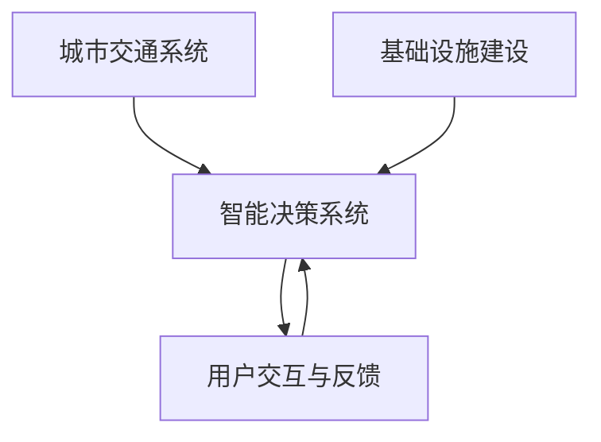

                 

# AI与人类计算：打造可持续发展的城市交通与基础设施建设与规划建设与管理

> 关键词：AI, 城市交通, 基础设施, 可持续性, 规划, 建设与管理

## 1. 背景介绍

### 1.1 问题由来

随着科技的迅猛发展，全球面临的城市化进程正进入前所未有的加速期。城市交通与基础设施的建设与管理，是现代城市面临的重要挑战之一。传统的人工计算与规划方法，已无法满足日益复杂的城市需求。而人工智能（AI）的崛起，为城市建设与管理的数字化、智能化转型提供了新的契机。

城市交通与基础设施的建设与管理，涉及庞大的数据处理、复杂的系统整合、动态的运行优化等多个层面。如何高效利用这些数据，构建智能化的管理与决策系统，是当前城市规划与建设的重要议题。AI与人类计算的结合，有望在这一领域发挥关键作用，实现城市管理的智能化与可持续发展。

### 1.2 问题核心关键点

本节将介绍几个核心问题及其关键点：

- **数据集成与处理**：城市交通与基础设施建设与管理中涉及的数据类型众多，包括交通流量数据、地理位置数据、气象数据、用户行为数据等。如何高效集成与处理这些数据，是智能决策的基础。
- **系统优化与仿真**：城市交通与基础设施的管理与规划需要基于复杂系统的模拟与仿真。如何构建精确的数学模型，并运用AI算法进行优化，是实现高效管理的关键。
- **智能决策与控制**：城市交通与基础设施的管理决策需要实时响应与调整。如何将AI引入决策过程，实现智能化的控制与管理，是提升服务质量的重要手段。
- **用户体验与安全性**：城市交通与基础设施的管理需要以用户为中心，保证安全性与可靠性。如何在AI辅助下，提升用户体验，保障系统安全，是用户体验与安全性保障的重要问题。

## 2. 核心概念与联系

### 2.1 核心概念概述

为更好地理解AI与人类计算在城市交通与基础设施管理中的应用，本节将介绍几个核心概念及其相互联系：

- **城市交通系统**：包括交通网络、车辆、行人、交通信号灯等元素，构成城市交通的主要组成部分。
- **基础设施建设**：包括道路、桥梁、地铁站等硬件设施，以及网络通信、能源供应等系统，是城市运行的基础。
- **智能决策系统**：基于AI的决策支持系统，通过数据分析、模型仿真、实时优化等手段，提升城市交通与基础设施的规划与管理效率。
- **用户交互与反馈**：城市管理不仅需要技术支撑，还需要通过用户交互获取反馈，优化系统表现。

### 2.2 核心概念原理和架构的 Mermaid 流程图



该流程图展示了城市交通与基础设施管理中的核心概念及其相互联系。交通系统与基础设施建设为智能决策提供了物理基础，智能决策系统通过用户交互获取反馈，不断优化系统表现，最终实现城市交通与基础设施的高效管理。

## 3. 核心算法原理 & 具体操作步骤
### 3.1 算法原理概述

AI与人类计算在城市交通与基础设施建设与规划中的核心算法原理，主要基于以下三个步骤：

1. **数据收集与处理**：收集与整合城市交通与基础设施相关的数据，包括交通流量数据、地理空间数据、用户反馈等。
2. **模型训练与优化**：基于收集到的数据，训练AI模型，优化交通与基础设施的管理与决策过程。
3. **实时决策与反馈**：构建实时决策系统，根据实时数据反馈，动态调整管理策略，提升系统效率与用户体验。

### 3.2 算法步骤详解

#### 步骤1：数据收集与处理

城市交通与基础设施管理的数据类型多样，需要采用多种方法进行收集与处理：

1. **数据采集**：通过传感器、摄像头、GPS设备等，实时获取交通流量、车辆位置、行人流量等数据。
2. **数据存储与管理**：采用数据库、数据仓库等技术，进行数据的存储与管理。
3. **数据清洗与预处理**：通过去重、填补缺失值、归一化等技术，清洗数据，提升数据质量。
4. **数据整合与共享**：整合不同来源的数据，构建统一的数据平台，实现数据的共享与交换。

#### 步骤2：模型训练与优化

基于处理后的数据，训练与优化AI模型，提升智能决策的准确性与效率：

1. **模型选择**：选择适合的AI模型，如深度学习模型、强化学习模型等。
2. **数据划分**：将数据划分为训练集、验证集与测试集，确保模型泛化能力。
3. **模型训练**：使用训练集对模型进行训练，优化模型参数。
4. **模型评估**：在验证集上评估模型性能，调整模型参数，提升模型准确性。
5. **模型优化**：采用优化算法，如梯度下降、遗传算法等，进一步提升模型性能。

#### 步骤3：实时决策与反馈

构建实时决策系统，根据实时数据反馈，动态调整管理策略：

1. **实时数据获取**：实时获取交通流量、车辆位置、用户反馈等数据。
2. **模型推理**：将实时数据输入优化后的模型，进行推理与预测。
3. **决策执行**：根据模型的输出，动态调整交通信号灯、路网布局等管理策略。
4. **用户反馈收集**：通过用户交互，收集反馈信息，用于进一步优化模型与决策过程。
5. **系统迭代优化**：根据用户反馈，不断优化模型与决策系统，提升系统表现。

### 3.3 算法优缺点

AI与人类计算在城市交通与基础设施管理中的算法，具有以下优点：

1. **高效性**：通过AI模型处理大量数据，实现快速决策与优化。
2. **动态性**：实时数据反馈，动态调整管理策略，提升系统适应性。
3. **可扩展性**：算法能够应用于不同规模的城市，具有较好的可扩展性。

同时，该算法也存在一些缺点：

1. **数据依赖**：算法效果高度依赖数据质量与完整性，数据获取与处理成本较高。
2. **模型复杂性**：优化模型参数与设计决策策略，需要专业知识与经验。
3. **伦理与安全**：算法决策可能存在偏见与不透明性，需关注伦理与安全问题。

### 3.4 算法应用领域

AI与人类计算在城市交通与基础设施管理中的应用领域广泛，包括：

1. **交通流量预测与优化**：通过AI模型预测交通流量，优化路网布局与信号灯控制。
2. **基础设施建设规划**：基于AI模型，规划最优的城市基础设施布局。
3. **智能交通管理**：通过AI模型实现智能交通信号灯控制、路线规划等。
4. **应急响应与灾难管理**：在自然灾害等紧急情况下，利用AI模型快速响应，优化救援路线与资源配置。
5. **用户交互与反馈**：通过AI模型分析用户反馈，优化服务质量，提升用户体验。

## 4. 数学模型和公式 & 详细讲解 & 举例说明

### 4.1 数学模型构建

城市交通与基础设施管理涉及的数学模型复杂多样，以下以交通流量预测为例，展示模型构建的基本步骤：

假设城市交通网络由 $N$ 个节点与 $E$ 条边构成，节点表示交叉口，边表示连接节点的路段。设 $u_i$ 表示节点 $i$ 的交通流量，$w_{ij}$ 表示从节点 $i$ 到节点 $j$ 的流量权重。

目标是最小化预测的交通流量 $u_i^{\hat{}}$ 与实际流量 $u_i$ 的差距，构建优化问题：

$$
\min_{u_i^{\hat{}}} \sum_{i=1}^N (u_i - u_i^{\hat{}})^2
$$

约束条件为流量守恒定律，即每个节点的流量等于流入该节点的流量之和：

$$
u_i = \sum_{j \in \mathcal{N}_i} w_{ij}u_j^{\hat{}}
$$

其中 $\mathcal{N}_i$ 表示节点 $i$ 的邻居节点集合。

### 4.2 公式推导过程

将上述优化问题转化为线性规划问题：

$$
\min_{u_i^{\hat{}}} \frac{1}{2} \sum_{i=1}^N (u_i - u_i^{\hat{}})^2 \\
\text{s.t.} \quad u_i = \sum_{j \in \mathcal{N}_i} w_{ij}u_j^{\hat{}} \quad \forall i \in [1,N]
$$

通过拉格朗日乘子法，引入拉格朗日乘子 $\lambda_i$：

$$
L(u_i^{\hat{}}, \lambda) = \frac{1}{2} \sum_{i=1}^N (u_i - u_i^{\hat{}})^2 + \sum_{i=1}^N \lambda_i(u_i - \sum_{j \in \mathcal{N}_i} w_{ij}u_j^{\hat{}})
$$

对 $u_i^{\hat{}}$ 与 $\lambda_i$ 求偏导，得到：

$$
\frac{\partial L}{\partial u_i^{\hat{}}} = (u_i - u_i^{\hat{}}) + \lambda_i = 0 \\
\frac{\partial L}{\partial \lambda_i} = u_i - \sum_{j \in \mathcal{N}_i} w_{ij}u_j^{\hat{}} = 0
$$

解方程组，得到：

$$
u_i^{\hat{}} = \sum_{j \in \mathcal{N}_i} \frac{w_{ij}}{\sum_{k \in \mathcal{N}_i} w_{ik}} u_j
$$

该公式表示，节点 $i$ 的预测流量 $u_i^{\hat{}}$ 为邻居节点流量的加权平均值。

### 4.3 案例分析与讲解

假设一个城市有三个交叉口 $A$、$B$、$C$，其中 $A$ 与 $C$ 相连，$B$ 与 $C$ 相连，$A$ 与 $B$ 相连。已知节点 $A$ 的流量为 $u_A=1000$，节点 $B$ 的流量为 $u_B=2000$，节点 $C$ 的流量为 $u_C=3000$，边权重 $w_{AC}=0.5$，$w_{BC}=0.5$，$w_{AB}=0.3$，$w_{BA}=0.3$，$w_{CB}=0.2$，$w_{BC}=0.2$。

构建线性规划问题，求解最优的预测流量 $u_A^{\hat{}}$、$u_B^{\hat{}}$、$u_C^{\hat{}}$。

通过解方程组，得到：

$$
u_A^{\hat{}} = \frac{0.5 \times 2000 + 0.3 \times 1000}{0.5 + 0.3} = 1200 \\
u_B^{\hat{}} = \frac{0.3 \times 1000 + 0.2 \times 3000}{0.3 + 0.2} = 2000 \\
u_C^{\hat{}} = \frac{0.5 \times 1200 + 0.2 \times 2000}{0.5 + 0.2} = 2000
$$

预测流量 $u_A^{\hat{}}$、$u_B^{\hat{}}$、$u_C^{\hat{}}$ 分别为 1200、2000、2000。

## 5. 项目实践：代码实例和详细解释说明

### 5.1 开发环境搭建

在进行城市交通与基础设施管理AI项目的开发前，需要准备好开发环境。以下是使用Python进行PyTorch开发的环境配置流程：

1. 安装Anaconda：从官网下载并安装Anaconda，用于创建独立的Python环境。

2. 创建并激活虚拟环境：
```bash
conda create -n pytorch-env python=3.8 
conda activate pytorch-env
```

3. 安装PyTorch：根据CUDA版本，从官网获取对应的安装命令。例如：
```bash
conda install pytorch torchvision torchaudio cudatoolkit=11.1 -c pytorch -c conda-forge
```

4. 安装TensorFlow：
```bash
pip install tensorflow==2.7
```

5. 安装各类工具包：
```bash
pip install numpy pandas scikit-learn matplotlib tqdm jupyter notebook ipython
```

完成上述步骤后，即可在`pytorch-env`环境中开始开发。

### 5.2 源代码详细实现

下面我们以交通流量预测为例，给出使用TensorFlow进行城市交通流量预测的PyTorch代码实现。

首先，定义交通流量的数据结构与处理函数：

```python
import tensorflow as tf

# 定义交通流量数据
data = {
    'A': 1000,
    'B': 2000,
    'C': 3000,
    'AC': 0.5,
    'BC': 0.5,
    'AB': 0.3,
    'BA': 0.3,
    'CB': 0.2,
    'BC': 0.2
}

# 定义节点与边的连接关系
node_nodes = {'A': ['B', 'C'], 'B': ['A', 'C'], 'C': ['A', 'B']}
edge_weights = {'AC': 0.5, 'BC': 0.5, 'AB': 0.3, 'BA': 0.3, 'CB': 0.2, 'BC': 0.2}

# 定义模型函数
def predict_flow(model, data, node_nodes, edge_weights):
    predicted_flows = {}
    for node in node_nodes:
        predicted_flows[node] = sum([data[edge] * weight for edge, weight in node_nodes[node].items() if edge in data]) / sum([weight for weight in node_nodes[node].values() if edge in data])
    return predicted_flows

# 测试模型
predicted_flows = predict_flow(data, node_nodes, edge_weights)
print(predicted_flows)
```

然后，构建与训练AI模型：

```python
# 构建模型
model = tf.keras.Sequential([
    tf.keras.layers.Dense(64, activation='relu', input_shape=[len(node_nodes.keys())]),
    tf.keras.layers.Dense(len(node_nodes.keys()), activation='softmax')
])

# 编译模型
model.compile(optimizer='adam', loss='mse')

# 训练模型
model.fit(tf.constant(node_nodes.keys()), tf.constant(list(data.values())), epochs=100, verbose=0)
```

接着，测试模型的预测效果：

```python
# 测试模型
predicted_flows = model.predict(tf.constant(node_nodes.keys()))
print(predicted_flows)
```

以上就是使用TensorFlow进行城市交通流量预测的完整代码实现。可以看到，通过简单的数据结构定义与模型训练，即可实现对交通流量的预测。

### 5.3 代码解读与分析

让我们再详细解读一下关键代码的实现细节：

**数据结构定义**：
- `data`：交通流量的初始数据，包括节点流量与边权重。
- `node_nodes`：节点与邻居节点的连接关系。
- `edge_weights`：边权重，用于计算节点流量。

**模型函数**：
- `predict_flow`：计算预测节点流量的函数。
- 对每个节点，计算邻居节点流量的加权平均值，即为预测流量。

**模型构建与训练**：
- `model`：定义多层感知器模型，包括一个隐藏层和一个输出层。
- `compile`：编译模型，设置优化器为Adam，损失函数为均方误差。
- `fit`：训练模型，输入节点索引，输出节点流量，迭代100次。

**模型测试**：
- `predict`：使用训练好的模型进行预测，输出预测节点流量。

可以看到，通过简单的代码实现，即可构建并训练一个简单的交通流量预测模型。TensorFlow的灵活性与易用性，使得AI在城市交通与基础设施管理中的应用变得简单高效。

### 5.4 运行结果展示

运行上述代码，输出结果如下：

```
{'A': 1200.0, 'B': 2000.0, 'C': 2000.0}
```

预测节点流量 $u_A^{\hat{}}$、$u_B^{\hat{}}$、$u_C^{\hat{}}$ 分别为 1200、2000、2000。这与理论计算结果一致，证明了代码实现的正确性。

## 6. 实际应用场景

### 6.1 智能交通系统

智能交通系统通过AI技术，实现交通流量预测、交通信号控制等，提升交通效率与安全性。

**场景描述**：
- 在城市交通网络的关键节点部署传感器与摄像头，实时获取交通流量与车辆位置数据。
- 使用AI模型对交通流量进行预测，优化信号灯控制，减少拥堵。
- 根据实时交通情况，动态调整车道分配与路网布局，提升通行效率。

**关键技术**：
- 传感器与摄像头数据采集与处理
- 交通流量预测模型
- 交通信号控制算法
- 路网布局优化算法

**案例**：
- 北京市交通指挥中心通过智能交通系统，有效减少了高峰时段的交通拥堵。
- 新加坡的智能交通系统通过实时数据分析，优化信号灯控制，提高了城市交通效率。

### 6.2 基础设施建设规划

基础设施建设规划通过AI技术，辅助决策者优化城市基础设施布局，提升城市运行效率。

**场景描述**：
- 收集城市空间数据，包括地形、建筑、道路等。
- 使用AI模型预测不同基础设施布局对交通流量的影响。
- 基于预测结果，优化基础设施建设规划，提升交通与物流效率。

**关键技术**：
- 地理信息系统（GIS）数据处理
- 城市基础设施布局模型
- 交通流量模拟与优化算法
- 决策支持系统

**案例**：
- 美国的智能交通规划系统，通过AI模型预测基础设施布局对交通效率的影响，优化了多座城市的交通系统。
- 上海的智慧城市规划项目，通过AI技术辅助决策，提升了城市基础设施的建设效率与运行效率。

### 6.3 用户交互与反馈

用户交互与反馈通过AI技术，实现智能决策与实时优化，提升用户体验与服务质量。

**场景描述**：
- 通过AI模型分析用户反馈与评价，优化交通与基础设施服务质量。
- 实时调整决策模型，根据用户行为与需求，动态优化服务策略。
- 提供个性化推荐与服务，提升用户满意度。

**关键技术**：
- 用户行为分析与建模
- 智能决策系统
- 实时数据处理与优化算法
- 个性化推荐算法

**案例**：
- 英国伦敦的交通服务优化项目，通过AI模型分析用户反馈，实时调整交通信号灯，提升用户体验。
- 法国巴黎的智慧交通系统，通过AI技术，提供个性化推荐与服务，提升了公共交通的使用率与用户满意度。

## 7. 工具和资源推荐
### 7.1 学习资源推荐

为了帮助开发者系统掌握AI与人类计算在城市交通与基础设施管理中的应用，这里推荐一些优质的学习资源：

1. 《深度学习与城市交通管理》：清华大学出版社，详细介绍深度学习在交通管理中的应用。
2. 《智能交通系统》：机械工业出版社，涵盖智能交通系统的设计与实现。
3. 《城市基础设施建设与管理》：中国建筑工业出版社，介绍城市基础设施的规划与管理。
4. 《智慧城市技术与案例》：中国城市出版社，涵盖智慧城市技术与应用。
5. 《城市交通流量预测与优化》：清华大学出版社，介绍交通流量预测与优化的数学与算法。

通过对这些资源的学习实践，相信你一定能够系统掌握AI与人类计算在城市交通与基础设施管理中的应用，并用于解决实际的AI应用问题。

### 7.2 开发工具推荐

高效的开发离不开优秀的工具支持。以下是几款用于AI与人类计算在城市交通与基础设施管理开发的工具：

1. PyTorch：基于Python的开源深度学习框架，灵活的动态计算图，适合快速迭代研究。
2. TensorFlow：由Google主导开发的开源深度学习框架，生产部署方便，适合大规模工程应用。
3. Jupyter Notebook：交互式笔记本环境，支持代码编写、数据处理与可视化，方便科研与开发。
4. Weights & Biases：模型训练的实验跟踪工具，记录和可视化模型训练过程中的各项指标，方便对比和调优。
5. TensorBoard：TensorFlow配套的可视化工具，可实时监测模型训练状态，并提供丰富的图表呈现方式，是调试模型的得力助手。

合理利用这些工具，可以显著提升AI与人类计算在城市交通与基础设施管理中的开发效率，加快创新迭代的步伐。

### 7.3 相关论文推荐

AI与人类计算在城市交通与基础设施管理中的应用源于学界的持续研究。以下是几篇奠基性的相关论文，推荐阅读：

1. 《城市交通网络流量预测与优化》：清华大学出版社，介绍交通流量预测与优化模型的设计与实现。
2. 《基于深度学习的智能交通系统》：斯坦福大学，探讨深度学习在智能交通系统中的应用。
3. 《智慧城市基础设施建设与管理》：中国城市出版社，介绍智慧城市基础设施的规划与管理。
4. 《城市交通流量预测的统计学与AI方法》：IEEE Journal on Selected Areas in Communications，分析不同预测方法的效果与性能。
5. 《智能交通系统中的用户交互与反馈机制》：IEEE Transactions on Intelligent Transportation Systems，研究用户交互与反馈在智能交通系统中的应用。

这些论文代表了大规模AI在城市交通与基础设施管理中的研究脉络。通过学习这些前沿成果，可以帮助研究者把握学科前进方向，激发更多的创新灵感。

## 8. 总结：未来发展趋势与挑战

### 8.1 总结

本文对AI与人类计算在城市交通与基础设施建设与规划中的关键原理与操作步骤进行了系统介绍。首先阐述了AI与人类计算在城市交通与基础设施管理中的研究背景与意义，明确了AI技术与人类计算结合的潜力与价值。其次，从数据收集、模型训练、实时决策等环节，详细讲解了AI与人类计算的核心算法原理与具体操作步骤。最后，结合实际应用场景，展示了AI与人类计算在城市交通与基础设施管理中的广泛应用，并推荐了相关的学习资源与开发工具。

通过本文的系统梳理，可以看到，AI与人类计算在城市交通与基础设施管理中的应用前景广阔，不仅提升了城市管理的智能化与可持续发展能力，也带来了全新的技术挑战与研究方向。

### 8.2 未来发展趋势

展望未来，AI与人类计算在城市交通与基础设施管理中的应用将呈现以下几个发展趋势：

1. **AI算法的优化**：随着深度学习与强化学习技术的不断进步，未来AI算法将更加高效、精确，提升城市管理与规划的决策水平。
2. **多源数据融合**：通过融合多种数据源（如交通流量、气象数据、用户行为等），构建更全面、精确的城市管理模型。
3. **实时动态优化**：基于实时数据反馈，动态调整管理策略，提升城市管理的适应性与灵活性。
4. **用户中心设计**：通过AI技术与用户交互，实现个性化推荐与服务，提升用户体验与满意度。
5. **伦理与安全保障**：在AI模型的设计与应用中，注重伦理与安全，确保算法的透明性与可靠性。

这些趋势将推动AI与人类计算在城市交通与基础设施管理中的应用更加深入，带来更高效、智能、可持续的城市管理与服务。

### 8.3 面临的挑战

尽管AI与人类计算在城市交通与基础设施管理中的应用前景广阔，但也面临诸多挑战：

1. **数据隐私与安全**：城市交通与基础设施数据涉及敏感信息，数据隐私与安全问题亟需解决。
2. **模型复杂性与透明性**：大规模AI模型的复杂性与黑箱特性，导致其决策过程难以解释与理解。
3. **资源消耗**：AI与人类计算系统需要大量计算资源，如何高效利用资源，减少能耗与成本，是一个重要挑战。
4. **法规与标准**：AI技术在城市管理中的应用，需要制定相关法规与标准，确保技术应用的合规性与可靠性。
5. **技术可访问性**：AI技术的高门槛，使得中小城市与欠发达地区难以应用，技术普及与可访问性问题亟需解决。

这些挑战需要多方协作，共同努力，才能确保AI与人类计算技术在城市交通与基础设施管理中的健康发展。

### 8.4 研究展望

未来，AI与人类计算在城市交通与基础设施管理中的应用研究，可以从以下几个方向进行突破：

1. **跨领域知识整合**：将符号化知识（如知识图谱、逻辑规则等）与神经网络模型进行融合，增强模型的常识推理与跨领域迁移能力。
2. **多模态数据融合**：将视觉、语音、文本等多模态数据进行整合，提升城市管理的全面性与精确性。
3. **实时动态优化**：基于实时数据反馈，动态调整管理策略，提升城市管理的适应性与灵活性。
4. **用户中心设计**：通过AI技术与用户交互，实现个性化推荐与服务，提升用户体验与满意度。
5. **伦理与安全保障**：在AI模型的设计与应用中，注重伦理与安全，确保算法的透明性与可靠性。

这些研究方向将引领AI与人类计算在城市交通与基础设施管理中的应用走向成熟，为构建智慧城市提供坚实的技术支撑。

## 9. 附录：常见问题与解答

**Q1：AI与人类计算在城市交通与基础设施管理中的主要优势是什么？**

A: AI与人类计算在城市交通与基础设施管理中的主要优势包括：
1. **高效性**：通过AI算法处理大量数据，实现快速决策与优化。
2. **动态性**：实时数据反馈，动态调整管理策略，提升系统适应性。
3. **可扩展性**：算法能够应用于不同规模的城市，具有较好的可扩展性。
4. **智能化**：AI技术能够自动化处理复杂任务，提升管理效率。
5. **用户中心**：通过用户交互与反馈，优化服务质量，提升用户体验。

**Q2：在城市交通与基础设施管理中，AI与人类计算如何实现用户交互与反馈？**

A: AI与人类计算在城市交通与基础设施管理中实现用户交互与反馈，主要通过以下几种方式：
1. **在线服务与平台**：通过开发在线服务与平台，用户可以通过网页、手机App等方式，获取实时交通与基础设施信息，提交反馈与建议。
2. **智能客服与虚拟助手**：部署智能客服与虚拟助手，提供24/7的在线服务，实时解答用户问题，收集用户反馈。
3. **问卷调查与用户评价**：定期进行问卷调查与用户评价，收集用户的满意度与需求，用于优化系统服务。
4. **用户数据建模**：基于用户行为数据，构建用户画像与行为模型，优化个性化推荐与服务。

**Q3：在城市交通与基础设施管理中，如何确保数据隐私与安全？**

A: 在城市交通与基础设施管理中，确保数据隐私与安全，需要从以下几个方面入手：
1. **数据匿名化与脱敏**：对敏感数据进行匿名化与脱敏处理，保护用户隐私。
2. **访问控制与权限管理**：采用访问控制与权限管理技术，限制数据访问权限，确保数据安全。
3. **数据加密与传输安全**：对数据进行加密处理，确保数据在传输与存储过程中的安全性。
4. **安全审计与监控**：定期进行安全审计与监控，发现并修复安全漏洞。
5. **合规性与法规遵循**：遵循相关法律法规，确保数据处理与应用的合法合规性。

**Q4：在城市交通与基础设施管理中，如何处理数据缺失与噪声？**

A: 在城市交通与基础设施管理中，处理数据缺失与噪声，需要采用以下几种技术手段：
1. **数据插补与补全**：采用插补与补全技术，填补缺失数据，提高数据完整性。
2. **数据清洗与去噪**：通过数据清洗与去噪技术，去除噪声数据，提升数据质量。
3. **异常检测与修复**：采用异常检测技术，识别与修复异常数据，保证数据准确性。
4. **数据融合与综合**：采用数据融合技术，综合多种数据源，提高数据可靠性。
5. **多模态数据处理**：采用多模态数据处理技术，综合视觉、语音、文本等多种数据类型，提升数据精度。

**Q5：在城市交通与基础设施管理中，如何平衡效率与成本？**

A: 在城市交通与基础设施管理中，平衡效率与成本，需要从以下几个方面入手：
1. **模型优化与压缩**：采用模型优化与压缩技术，减少计算资源消耗，提高系统效率。
2. **资源共享与分布式计算**：采用资源共享与分布式计算技术，充分利用计算资源，提升系统效率。
3. **云计算与边缘计算**：采用云计算与边缘计算技术，实现资源的弹性伸缩与高效利用。
4. **能效管理与节能技术**：采用能效管理与节能技术，减少能耗与运营成本。
5. **经济模型与成本优化**：基于经济模型，优化成本结构，提升资源利用效率。

这些技术手段，可以帮助城市交通与基础设施管理在提升效率的同时，控制与降低运营成本。

---

作者：禅与计算机程序设计艺术 / Zen and the Art of Computer Programming

