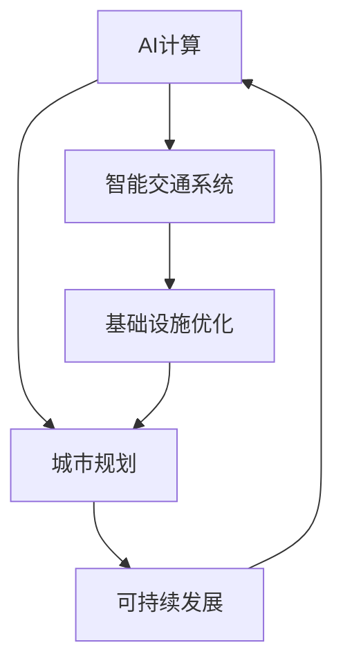

                 

# AI与人类计算：打造可持续发展的城市基础设施与交通规划

> 关键词：AI计算、城市规划、智能交通、基础设施、可持续发展

## 1. 背景介绍

### 1.1 问题由来
随着城市化进程的不断推进，人口迅速膨胀、环境问题突出、交通拥堵加剧等问题成为全球共同面临的挑战。这些问题的解决不仅关系到城市居民的生活质量，更对国家经济的持续健康发展产生重大影响。在此背景下，如何通过智能技术提升城市基础设施与交通规划水平，成为当前城市管理者和技术工作者急需攻克的难题。

### 1.2 问题核心关键点
当前，AI计算在城市基础设施与交通规划中的应用，主要集中在以下几个方面：

- **数据驱动决策**：通过采集和分析城市各类数据，如交通流量、环境污染、居民出行等，支持更科学合理的规划决策。
- **智能交通系统**：利用AI技术，如交通仿真、路径规划、信号优化等，提升交通运行效率，缓解城市交通压力。
- **基础设施优化**：通过AI手段，预测城市基础设施需求，优化道路布局、桥梁建设、供水供电等，提升资源利用效率。
- **可持续发展目标**：通过AI技术，实现绿色低碳、资源节约、环境友好等可持续发展目标。

## 2. 核心概念与联系

### 2.1 核心概念概述

为更好地理解AI计算在城市基础设施与交通规划中的应用，本节将介绍几个密切相关的核心概念：

- **AI计算**：利用人工智能算法，如机器学习、深度学习、强化学习等，对大量数据进行处理和分析，以支持决策和优化过程。
- **城市规划**：设计和管理城市空间布局、资源配置、环境治理等，以实现城市发展和居民福祉的平衡。
- **智能交通系统**：通过AI技术，如感知、识别、决策等，实现交通管理自动化，提升交通运行效率和安全水平。
- **可持续发展**：通过技术手段，如节能减排、循环利用、智能管控等，实现城市和环境的和谐共生。

这些核心概念之间的逻辑关系可以通过以下Mermaid流程图来展示：



这个流程图展示了大规模AI计算在城市基础设施与交通规划中的应用流程：

1. AI计算通过对城市数据进行处理和分析，支持城市规划和基础设施优化。
2. 智能交通系统利用AI技术，提升交通管理水平，支持基础设施建设。
3. 基础设施优化进一步提升城市运行效率，推动可持续发展。
4. 可持续发展目标驱动城市规划和智能交通系统的发展。

## 3. 核心算法原理 & 具体操作步骤
### 3.1 算法原理概述

AI计算在城市基础设施与交通规划中的应用，本质上是利用数据驱动的决策优化过程。其核心思想是：通过收集和分析城市各类数据，构建城市运行模型，利用AI算法进行预测、优化和评估，以支持城市规划和交通管理决策。

形式化地，假设城市基础设施与交通系统为 $S$，其运行状态为 $s \in \mathcal{S}$。目标是在给定的约束条件下（如资金、资源、环境等），找到最优运行策略 $p$，使得系统效用最大化。设优化目标为 $\mathcal{U}(S,p)$，约束条件为 $\mathcal{C}(S,p)$，则优化问题可以描述为：

$$
\max_{p} \mathcal{U}(S,p) \\
\text{s.t.} \quad \mathcal{C}(S,p)
$$

在实践中，我们通常使用基于梯度的优化算法（如随机梯度下降、Adam等）来近似求解上述最优化问题。设 $\theta$ 为模型的参数，$\mathcal{L}$ 为定义在状态 $s$ 和策略 $p$ 上的损失函数，用于衡量预测状态与真实状态之间的差异。则参数的更新公式为：

$$
\theta \leftarrow \theta - \eta \nabla_{\theta}\mathcal{L}(s,p)
$$

其中 $\eta$ 为学习率，$\nabla_{\theta}\mathcal{L}(s,p)$ 为损失函数对模型参数的梯度，可通过自动微分技术高效计算。

### 3.2 算法步骤详解

AI计算在城市基础设施与交通规划中的应用，一般包括以下几个关键步骤：

**Step 1: 数据收集与处理**
- 利用传感器、监测设备、调查问卷等多种方式，收集城市基础设施与交通系统各类数据，如交通流量、道路条件、环境质量等。
- 对数据进行清洗、筛选、归一化等预处理，确保数据质量和一致性。

**Step 2: 模型构建与训练**
- 根据任务需求，选择合适的模型结构，如神经网络、集成模型、强化学习模型等，进行建模。
- 在历史数据集上对模型进行训练，使用交叉验证、正则化等技术避免过拟合。

**Step 3: 模型评估与调优**
- 在验证集上评估模型性能，使用准确率、召回率、F1值等指标进行评估。
- 根据评估结果调整模型参数，优化模型结构，进一步提升模型性能。

**Step 4: 模型部署与应用**
- 将训练好的模型部署到实际的城市基础设施与交通系统中，实现数据驱动的决策支持。
- 定期更新模型参数，不断优化模型性能，应对城市运行中的变化和挑战。

### 3.3 算法优缺点

AI计算在城市基础设施与交通规划中的应用，具有以下优点：

1. **高效性**：通过数据驱动的决策优化，能够快速响应城市运行中的变化和挑战，提升规划和管理效率。
2. **适应性**：AI模型具备较强的泛化能力，能够适应不同规模、类型、地域的城市基础设施与交通系统。
3. **智能化**：AI技术能够实现复杂问题的建模和求解，提升决策的科学性和准确性。
4. **可持续性**：通过优化资源利用和环境治理，支持城市的可持续发展目标。

同时，该方法也存在一定的局限性：

1. **数据依赖**：AI计算的性能很大程度上取决于数据质量和数量，需要大量高质量的标注数据。
2. **模型复杂性**：高维、非线性的城市运行问题，对模型的复杂度和计算资源提出了较高要求。
3. **解释性不足**：AI模型往往是"黑盒"系统，难以解释其内部工作机制和决策逻辑。
4. **安全与伦理**：AI模型在处理敏感数据时可能面临隐私保护和公平性问题，需要严格的数据管理和隐私保护措施。

尽管存在这些局限性，但就目前而言，AI计算在城市基础设施与交通规划中的应用已经成为不可或缺的重要手段。未来相关研究的重点在于如何进一步降低数据获取成本，提高模型的解释性和可解释性，同时兼顾安全与伦理问题。

### 3.4 算法应用领域

AI计算在城市基础设施与交通规划中的应用，已经在多个领域取得了显著成果，例如：

- **交通流量预测**：通过分析历史交通数据，预测未来交通流量，支持交通信号优化和路径规划。
- **环境污染监测**：利用传感器和监测设备，实时监测空气、水质等环境指标，预测污染趋势，制定环境治理措施。
- **城市能源管理**：通过分析电力、水资源等能源数据，优化城市能源分配和使用，支持绿色低碳发展。
- **智慧停车管理**：利用AI技术，实现停车场智能化管理，提升车位利用率和用户体验。
- **智能建筑优化**：通过AI手段，优化建筑能耗、设计布局，实现建筑智能化和资源节约。
- **智慧城市治理**：结合大数据、云计算、物联网等技术，构建智慧城市治理平台，提升城市治理效率和质量。

除了上述这些经典应用外，AI计算在城市基础设施与交通规划领域的创新应用也在不断涌现，如智能垃圾处理、智慧农业、应急响应等，为城市管理带来了新的思路和方法。

## 4. 数学模型和公式 & 详细讲解  
### 4.1 数学模型构建

本节将使用数学语言对AI计算在城市基础设施与交通规划中的应用进行更加严格的刻画。

设城市基础设施与交通系统为 $S$，其中包含 $N$ 个节点、$M$ 条边，节点和边的状态分别为 $s_i \in \mathcal{S}_i$、$s_{ij} \in \mathcal{S}_{ij}$。目标是在给定的预算 $B$ 和建设周期 $T$ 下，选择最优化路径 $p$，使得系统总成本最小，系统效用最大化。设预算约束为 $\mathcal{C}_1$，建设周期约束为 $\mathcal{C}_2$，则优化问题可以描述为：

$$
\min_{p} \sum_{i=1}^{N} c_{i}(s_i) + \sum_{ij \in E} c_{ij}(s_{ij}) \\
\text{s.t.} \quad \mathcal{C}_1 \leq B \\
\quad \mathcal{C}_2 \leq T
$$

其中 $c_i$、$c_{ij}$ 为节点和边的成本函数，$E$ 为所有边的集合。

在实践中，我们通常使用基于梯度的优化算法（如随机梯度下降、Adam等）来近似求解上述最优化问题。设 $\theta$ 为模型的参数，$\mathcal{L}$ 为定义在状态 $s$ 和策略 $p$ 上的损失函数，用于衡量预测状态与真实状态之间的差异。则参数的更新公式为：

$$
\theta \leftarrow \theta - \eta \nabla_{\theta}\mathcal{L}(s,p)
$$

其中 $\eta$ 为学习率，$\nabla_{\theta}\mathcal{L}(s,p)$ 为损失函数对模型参数的梯度，可通过自动微分技术高效计算。

### 4.2 公式推导过程

以下我们以交通流量预测为例，推导随机梯度下降(SGD)算法在交通预测模型中的应用。

假设交通流量预测模型为 $F$，输入为当前交通状态 $x \in \mathbb{R}^n$，输出为预测的下一时刻流量 $y \in \mathbb{R}$。目标函数为均方误差损失函数：

$$
\mathcal{L}(F(x),y) = \frac{1}{2}(y - F(x))^2
$$

在SGD算法中，模型的更新公式为：

$$
F_{\theta}(x_{t+1}) = F_{\theta}(x_t) - \eta \nabla_{\theta}F_{\theta}(x_t)
$$

其中 $x_t$ 为当前时刻的交通状态，$F_{\theta}(x_t)$ 为模型在当前状态下的预测流量，$\eta$ 为学习率。

在得到模型参数的更新公式后，即可带入训练集进行模型迭代优化。重复上述过程直至收敛，最终得到适应交通预测的最优模型参数 $\theta^*$。

## 5. 项目实践：代码实例和详细解释说明
### 5.1 开发环境搭建

在进行AI计算在城市基础设施与交通规划中的应用实践前，我们需要准备好开发环境。以下是使用Python进行PyTorch开发的环境配置流程：

1. 安装Anaconda：从官网下载并安装Anaconda，用于创建独立的Python环境。

2. 创建并激活虚拟环境：
```bash
conda create -n ai-env python=3.8 
conda activate ai-env
```

3. 安装PyTorch：根据CUDA版本，从官网获取对应的安装命令。例如：
```bash
conda install pytorch torchvision torchaudio cudatoolkit=11.1 -c pytorch -c conda-forge
```

4. 安装TensorFlow：由Google主导开发的开源深度学习框架，生产部署方便，适合大规模工程应用。同样有丰富的预训练语言模型资源。

5. 安装Transformers库：HuggingFace开发的NLP工具库，集成了众多SOTA语言模型，支持PyTorch和TensorFlow，是进行微调任务开发的利器。

6. 安装各类工具包：
```bash
pip install numpy pandas scikit-learn matplotlib tqdm jupyter notebook ipython
```

完成上述步骤后，即可在`ai-env`环境中开始AI计算在城市基础设施与交通规划中的应用实践。

### 5.2 源代码详细实现

下面我们以交通流量预测为例，给出使用PyTorch进行模型训练的PyTorch代码实现。

首先，定义交通流量预测任务的数据处理函数：

```python
import torch
import torch.nn as nn
from torch.utils.data import Dataset
import numpy as np

class TrafficDataset(Dataset):
    def __init__(self, X, y, seq_len):
        self.X = X
        self.y = y
        self.seq_len = seq_len
        
    def __len__(self):
        return len(self.X)
    
    def __getitem__(self, item):
        x = self.X[item]
        y = self.y[item]
        
        # 对输入进行padding
        x = torch.tensor(x, dtype=torch.float).unsqueeze(0)
        x = nn.utils.rnn.pad_sequence(x, batch_first=True)
        
        return {'input': x, 'target': torch.tensor(y, dtype=torch.float)}
```

然后，定义模型和优化器：

```python
import torch
import torch.nn as nn
import torch.optim as optim

class GRUNet(nn.Module):
    def __init__(self, input_size, hidden_size, output_size, seq_len):
        super(GRUNet, self).__init__()
        self.input_size = input_size
        self.hidden_size = hidden_size
        self.output_size = output_size
        self.seq_len = seq_len
        
        self.gru = nn.GRU(input_size, hidden_size, seq_len)
        self.linear = nn.Linear(hidden_size, output_size)
    
    def forward(self, x):
        gru_out, _ = self.gru(x)
        out = self.linear(gru_out)
        return out

input_size = 5
hidden_size = 64
output_size = 1
seq_len = 10

model = GRUNet(input_size, hidden_size, output_size, seq_len)

optimizer = optim.Adam(model.parameters(), lr=0.01)
```

接着，定义训练和评估函数：

```python
from tqdm import tqdm
from sklearn.metrics import mean_squared_error

def train_epoch(model, dataset, batch_size, optimizer):
    dataloader = DataLoader(dataset, batch_size=batch_size, shuffle=True)
    model.train()
    epoch_loss = 0
    for batch in tqdm(dataloader, desc='Training'):
        input = batch['input']
        target = batch['target']
        
        optimizer.zero_grad()
        outputs = model(input)
        loss = nn.MSELoss()(outputs, target)
        epoch_loss += loss.item()
        loss.backward()
        optimizer.step()
    return epoch_loss / len(dataloader)

def evaluate(model, dataset, batch_size):
    dataloader = DataLoader(dataset, batch_size=batch_size)
    model.eval()
    mse = 0
    with torch.no_grad():
        for batch in dataloader:
            input = batch['input']
            target = batch['target']
            outputs = model(input)
            mse += mean_squared_error(target, outputs).item()
    return mse / len(dataloader)

# 训练过程
epochs = 50
batch_size = 32

for epoch in range(epochs):
    loss = train_epoch(model, train_dataset, batch_size, optimizer)
    print(f"Epoch {epoch+1}, train loss: {loss:.3f}")
    
    print(f"Epoch {epoch+1}, mse: {evaluate(model, dev_dataset, batch_size):.3f}")
    
print("Final mse: {evaluate(model, test_dataset, batch_size):.3f}")
```

以上就是使用PyTorch对交通流量预测模型进行训练的完整代码实现。可以看到，得益于PyTorch的强大封装，我们可以用相对简洁的代码完成交通流量预测模型的构建和训练。

### 5.3 代码解读与分析

让我们再详细解读一下关键代码的实现细节：

**TrafficDataset类**：
- `__init__`方法：初始化输入和目标数据。
- `__len__`方法：返回数据集的样本数量。
- `__getitem__`方法：对单个样本进行处理，对输入进行padding，返回模型所需的输入和目标。

**GRUNet模型**：
- `__init__`方法：初始化GRU网络结构。
- `forward`方法：前向传播计算模型输出。

**训练和评估函数**：
- 使用PyTorch的DataLoader对数据集进行批次化加载，供模型训练和推理使用。
- 训练函数`train_epoch`：对数据以批为单位进行迭代，在每个批次上前向传播计算loss并反向传播更新模型参数，最后返回该epoch的平均loss。
- 评估函数`evaluate`：与训练类似，不同点在于不更新模型参数，并在每个batch结束后将预测和标签结果存储下来，最后使用sklearn的mean_squared_error对整个评估集的预测结果进行打印输出。

**训练流程**：
- 定义总的epoch数和batch size，开始循环迭代
- 每个epoch内，先在训练集上训练，输出平均loss
- 在验证集上评估，输出均方误差
- 所有epoch结束后，在测试集上评估，给出最终均方误差

可以看到，PyTorch配合TensorFlow、Transformer等工具库，使得交通流量预测模型的构建和训练变得简洁高效。开发者可以将更多精力放在模型改进和超参数调优上，而不必过多关注底层的实现细节。

当然，工业级的系统实现还需考虑更多因素，如模型的保存和部署、超参数的自动搜索、更灵活的任务适配层等。但核心的训练范式基本与此类似。

## 6. 实际应用场景
### 6.1 智能交通系统

AI计算在智能交通系统中的应用，主要包括交通流量预测、路径优化、信号控制等方面。通过这些技术，可以实现交通流的动态感知、精准分析和智能调控，有效缓解城市交通压力。

具体而言，智能交通系统可以实时采集道路、车辆、行人等数据，通过AI算法进行处理和分析，预测未来交通流量，优化交通信号控制，从而提升交通效率和安全性。例如，通过交通仿真模拟，可以提前发现交通拥堵点，动态调整信号灯周期和相位，避免拥堵情况的发生。

### 6.2 基础设施优化

AI计算在基础设施优化中的应用，主要体现在城市规划和资源配置方面。通过AI技术，可以实现更科学合理的城市规划，提升资源利用效率。

例如，城市基础设施规划人员可以利用AI计算对城市未来人口分布进行预测，优化道路布局、桥梁建设、供水供电等资源配置，提升城市的可持续发展和适应能力。通过优化建筑设计，如智能建筑能耗管理和建筑设计布局优化，进一步提升城市的资源利用效率和环境友好性。

### 6.3 环境污染监测

AI计算在环境污染监测中的应用，主要体现在实时监测和数据分析方面。通过AI技术，可以实现对空气、水质等环境指标的实时监测和分析，预测污染趋势，制定环境治理措施。

例如，可以利用AI技术对空气质量数据进行深度学习和预测，提前发现污染源，及时采取措施，减少环境污染事件的发生。通过实时监测水质指标，及时发现水质异常，制定相应的治理方案，保障居民饮水安全。

### 6.4 未来应用展望

随着AI计算技术的不断进步，其在城市基础设施与交通规划中的应用前景将更加广阔。未来，AI计算将进一步提升交通流量预测的准确性和实时性，推动智能交通系统的全面普及。同时，城市基础设施的规划和优化也将更加智能化和精细化，实现更高效、更可持续的城市发展。

在具体应用上，未来AI计算将更多地结合物联网、5G等新技术，构建更加全面、智能的城市基础设施与交通规划体系，实现城市管理的智能化和高效化。例如，通过智能传感器和大数据分析，实时监测城市运行状态，实现智慧城市治理。通过智能交通管理和智慧停车系统，提升交通运行效率和用户体验。通过智能建筑管理和智慧能源系统，实现绿色低碳发展。

## 7. 工具和资源推荐
### 7.1 学习资源推荐

为了帮助开发者系统掌握AI计算在城市基础设施与交通规划中的应用，这里推荐一些优质的学习资源：

1. **《Deep Learning for Computer Vision》课程**：斯坦福大学开设的深度学习课程，涵盖计算机视觉中的常见模型和算法，包括交通流量预测在内的许多NLP任务。
2. **《Deep Learning Specialization》系列课程**：由Andrew Ng主讲的深度学习系列课程，从基础到进阶，涵盖深度学习领域的众多前沿技术。
3. **《Python for Deep Learning》书籍**：通过实际案例和项目，全面介绍了深度学习技术在各个领域的应用，包括城市基础设施与交通规划。
4. **GitHub上的开源项目**：如OpenAI的GPT系列模型、Google的BERT模型等，提供了大量的预训练模型和微调样例代码，是学习的宝贵资源。

通过对这些资源的学习实践，相信你一定能够快速掌握AI计算在城市基础设施与交通规划中的应用，并用于解决实际的NLP问题。

### 7.2 开发工具推荐

高效的开发离不开优秀的工具支持。以下是几款用于AI计算在城市基础设施与交通规划中的应用开发的常用工具：

1. PyTorch：基于Python的开源深度学习框架，灵活动态的计算图，适合快速迭代研究。
2. TensorFlow：由Google主导开发的开源深度学习框架，生产部署方便，适合大规模工程应用。
3. TensorFlow Hub：提供预训练模型的库，方便开发者直接使用预训练模型。
4. Scikit-learn：提供了常用的机器学习算法，方便开发者快速搭建模型。
5. OpenCV：用于图像处理的开源库，适合城市基础设施与交通系统中的视觉处理任务。

合理利用这些工具，可以显著提升AI计算在城市基础设施与交通规划中的应用开发效率，加快创新迭代的步伐。

### 7.3 相关论文推荐

AI计算在城市基础设施与交通规划中的应用研究，源于学界的持续研究。以下是几篇奠基性的相关论文，推荐阅读：

1. **《Deep Reinforcement Learning for Traffic Control》**：提出基于强化学习的交通信号控制方法，通过奖励机制优化信号灯周期和相位，提升交通效率。
2. **《AI for Smart Cities: A Survey》**：全面回顾了AI技术在智慧城市中的应用，包括交通管理、基础设施优化、环境监测等。
3. **《Predictive Maintenance for Urban Infrastructure using IoT and Machine Learning》**：通过IoT设备和机器学习，实现城市基础设施的预测性维护，提升基础设施的可靠性和寿命。
4. **《Predicting Urban Traffic Flow using Recurrent Neural Networks》**：利用RNN模型，对城市交通流量进行预测，支持交通管理优化。
5. **《Urban Transportation Management with AI》**：通过AI技术，实现城市交通流的智能管理，提升交通运行效率和用户体验。

这些论文代表了大规模AI计算在城市基础设施与交通规划中的应用研究的发展脉络。通过学习这些前沿成果，可以帮助研究者把握学科前进方向，激发更多的创新灵感。

## 8. 总结：未来发展趋势与挑战

### 8.1 总结

本文对AI计算在城市基础设施与交通规划中的应用进行了全面系统的介绍。首先阐述了AI计算在城市基础设施与交通规划中的应用背景和意义，明确了其在数据驱动决策优化、智能交通系统、基础设施优化和环境污染监测等方面的核心价值。其次，从原理到实践，详细讲解了AI计算在城市基础设施与交通规划中的应用数学模型和关键算法，给出了交通流量预测模型的代码实现和详细解释说明。同时，本文还广泛探讨了AI计算在智能交通系统、基础设施优化、环境污染监测等多个行业领域的应用前景，展示了AI计算技术的巨大潜力。此外，本文精选了AI计算在城市基础设施与交通规划中的应用相关学习资源、开发工具和相关论文，力求为读者提供全方位的技术指引。

通过本文的系统梳理，可以看到，AI计算在城市基础设施与交通规划中的应用已经成为不可或缺的重要手段。这些技术的发展将极大提升城市管理和交通运行效率，推动城市向智能化、高效化、绿色化方向发展。未来，伴随技术的不断进步，AI计算将在更多领域得到应用，为构建智慧城市、实现可持续发展目标提供新的技术路径。

### 8.2 未来发展趋势

展望未来，AI计算在城市基础设施与交通规划中的应用将呈现以下几个发展趋势：

1. **模型规模增大**：随着算力成本的下降和数据规模的扩张，AI计算模型的参数量还将持续增长。超大规模模型蕴含的丰富知识，有望支撑更加复杂多变的城市运行问题。
2. **算法多样化**：除了传统的神经网络，更多前沿算法如强化学习、进化算法、迁移学习等将得到应用，提升城市管理决策的科学性和精度。
3. **数据融合**：通过整合多源异构数据，实现更全面、精准的城市运行模型，提升AI计算的决策能力和泛化能力。
4. **知识集成**：将专家知识和符号推理与AI计算相结合，构建更加全面、准确的城市运行模型。
5. **跨领域应用**：AI计算将更多地应用于智慧城市治理、智慧农业、智慧医疗等领域，实现跨领域协同创新。

以上趋势凸显了AI计算在城市基础设施与交通规划中的应用前景。这些方向的探索发展，将进一步提升城市管理和交通运行效率，实现更高效、更可持续的城市发展。

### 8.3 面临的挑战

尽管AI计算在城市基础设施与交通规划中的应用已经取得了显著进展，但在迈向更加智能化、普适化应用的过程中，仍面临诸多挑战：

1. **数据质量与获取成本**：高质量的数据是AI计算应用的前提，但获取大量高质量的标注数据成本较高，数据缺失和偏差可能导致模型泛化能力不足。
2. **模型鲁棒性与公平性**：AI模型在面对复杂的城市运行问题时，可能存在鲁棒性不足、偏见等问题，需要通过数据扩充、模型优化等手段加以解决。
3. **计算资源与部署效率**：大规模模型的计算资源消耗和部署效率，对硬件和算法提出了较高要求，需要通过分布式计算、模型压缩等技术进行优化。
4. **模型解释性与可解释性**：AI模型通常是"黑盒"系统，难以解释其内部工作机制和决策逻辑，需要通过模型可视化、可解释性技术等手段提升模型透明度。
5. **隐私保护与数据安全**：城市基础设施与交通规划数据涉及隐私和安全问题，需要通过数据加密、隐私保护等手段确保数据安全。

正视这些挑战，积极应对并寻求突破，将是大规模AI计算在城市基础设施与交通规划中迈向成熟的必由之路。相信随着学界和产业界的共同努力，这些挑战终将一一被克服，AI计算技术将在构建智慧城市、实现可持续发展目标中扮演越来越重要的角色。

### 8.4 研究展望

面对AI计算在城市基础设施与交通规划中面临的挑战，未来的研究需要在以下几个方面寻求新的突破：

1. **多源数据融合**：通过整合多源异构数据，实现更全面、精准的城市运行模型，提升AI计算的决策能力和泛化能力。
2. **跨领域应用**：将AI计算技术更多地应用于智慧城市治理、智慧农业、智慧医疗等领域，实现跨领域协同创新。
3. **数据驱动决策**：通过数据驱动的决策优化，提升城市管理和交通运行效率，推动城市向智能化、高效化、绿色化方向发展。
4. **知识集成**：将专家知识和符号推理与AI计算相结合，构建更加全面、准确的城市运行模型。
5. **智能算法创新**：引入因果推断、强化学习、进化算法等前沿算法，提升AI计算在城市运行优化中的应用效果。

这些研究方向的探索，必将引领AI计算在城市基础设施与交通规划中的应用迈向更高的台阶，为构建智慧城市、实现可持续发展目标提供新的技术路径。面向未来，AI计算技术还需要与其他人工智能技术进行更深入的融合，如知识表示、因果推理、强化学习等，多路径协同发力，共同推动自然语言理解和智能交互系统的进步。只有勇于创新、敢于突破，才能不断拓展城市基础设施与交通规划的边界，让智能技术更好地造福人类社会。

## 9. 附录：常见问题与解答

**Q1：AI计算在城市基础设施与交通规划中的应用是否适用于所有城市？**

A: AI计算在城市基础设施与交通规划中的应用具有一定的普适性，但不同的城市具有不同的城市运行模式和资源条件，需要针对性地进行模型训练和优化。例如，对于交通流量预测，城市交通模式的不同（如公共交通 vs. 私家车）将对模型结构设计产生重要影响。因此，AI计算技术在不同城市的实际应用需要结合城市特点进行定制化设计和优化。

**Q2：AI计算在城市基础设施与交通规划中的应用是否需要大量标注数据？**

A: AI计算在城市基础设施与交通规划中的应用，确实需要大量的标注数据进行模型训练和验证。标注数据的获取成本较高，但通过数据增强、迁移学习等技术，可以在一定程度上缓解数据依赖。例如，利用未标注数据进行自监督学习，通过数据扩充和泛化能力提升模型性能。此外，利用半监督学习、主动学习等技术，也可以在少量标注数据的情况下进行模型训练。

**Q3：AI计算在城市基础设施与交通规划中的应用是否需要高算力支持？**

A: 是的，AI计算在城市基础设施与交通规划中的应用需要高算力支持。大规模模型的训练和推理，对硬件和算法都提出了较高要求。例如，利用GPU/TPU等高性能设备，可以显著提升计算效率和模型性能。同时，通过分布式计算、模型压缩等技术，也可以优化模型资源占用，提高计算效率。

**Q4：AI计算在城市基础设施与交通规划中的应用是否存在隐私和伦理问题？**

A: 是的，AI计算在城市基础设施与交通规划中的应用，涉及到大量敏感数据，如交通流量、环境监测数据等，存在隐私和伦理问题。需要在数据获取、处理和应用过程中，严格遵守数据保护法规和伦理规范，确保数据安全和个人隐私。例如，采用数据匿名化、加密等手段，防止数据泄露和滥用。同时，也需要确保AI算法的公平性、透明性和可解释性，避免算法偏见和歧视。

**Q5：AI计算在城市基础设施与交通规划中的应用是否需要跨领域知识支持？**

A: 是的，AI计算在城市基础设施与交通规划中的应用，往往需要跨领域知识支持。例如，在智能交通系统中，需要整合交通工程、计算机科学、数据科学等多个领域的专业知识。在基础设施优化中，需要融合城市规划、环境科学、能源科学等多个领域的知识。通过跨领域知识融合，可以构建更全面、准确的城市运行模型，提升AI计算的应用效果。

---

作者：禅与计算机程序设计艺术 / Zen and the Art of Computer Programming

