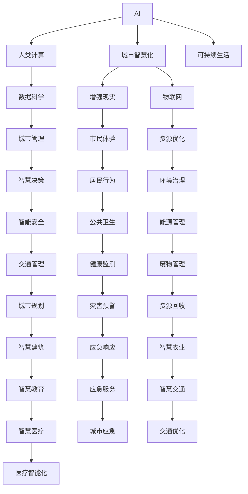

                 

# AI与人类计算：打造可持续发展的城市生活方式

> 关键词：人工智能(AI), 人类计算(Human-Computer Interaction, HCI), 城市智慧化, 可持续生活(Sustainable Living), 数据科学(Data Science), 智慧城市(Smart City), 增强现实(Augmented Reality, AR), 物联网(IoT)

## 1. 背景介绍

### 1.1 问题由来
随着全球人口迅速增长和城市化进程加速，城市资源和环境压力不断增大。当前城市生活面临诸多挑战，如交通拥堵、能源消耗、环境保护、公共安全等。如何通过技术手段优化城市资源分配，改善人民生活质量，是城市管理者面临的重要课题。人工智能(AI)和人类计算(Human-Computer Interaction, HCI)技术的结合，提供了一种全新的解决方案。

### 1.2 问题核心关键点
基于AI和HCI的城市智慧化系统，通过数据采集、分析、反馈循环，可以实现城市生活的智能化、精细化管理，提高资源利用效率，减少环境污染。本文聚焦于城市智慧化系统中，AI与人类计算的协同工作机制，讨论如何构建一个可持续发展的城市生活系统。

### 1.3 问题研究意义
本研究旨在揭示AI与HCI在城市生活场景中的深度协同工作原理，研究如何通过数据驱动的决策支持，提升城市管理水平，实现可持续发展的目标。本文通过详细分析不同AI技术的应用场景，探索技术发展对城市生活的潜在影响，为城市管理者提供决策参考。

## 2. 核心概念与联系

### 2.1 核心概念概述

为更好地理解AI与HCI在城市生活中的应用，本节将介绍几个核心概念：

- 人工智能(AI)：利用计算机模拟人类智能，通过学习、推理、感知等能力，解决复杂问题。
- 人类计算(HCI)：通过人和计算机的协同工作，提升计算效率和用户体验。
- 城市智慧化(Smart City)：利用先进的信息技术，整合城市各种资源，提高城市治理能力，提升居民生活质量。
- 可持续生活(Sustainable Living)：在资源、环境、经济等维度上实现平衡，实现可持续发展。
- 数据科学(Data Science)：通过数据收集、处理、分析等手段，从数据中提取知识和价值。
- 增强现实(Augmented Reality, AR)：通过计算机生成的虚拟信息增强现实环境，提升交互体验。
- 物联网(IoT)：通过传感器、设备等连接物与物、物与人，实现信息的实时获取和共享。

这些核心概念之间的逻辑关系可以通过以下Mermaid流程图来展示：



这个流程图展示了一些核心概念及其之间的关系：

1. AI技术通过数据科学和增强现实，提升城市管理和市民体验。
2. HCI技术通过物联网和智能安全，优化资源利用和环境治理。
3. 城市智慧化和可持续生活相互支撑，共同推动城市可持续发展。

## 3. 核心算法原理 & 具体操作步骤
### 3.1 算法原理概述

基于AI和HCI的城市智慧化系统，其核心思想是构建一个数据驱动的决策支持系统，通过智能算法和人性化设计，实现城市资源的优化配置，提升城市治理效率。

形式化地，假设城市管理者需要优化某项资源配置，例如交通流量。可以通过以下步骤构建智慧化系统：

1. **数据采集**：使用传感器、摄像头等设备，收集交通流量、车辆位置、车速等实时数据。
2. **数据分析**：通过AI技术，对采集数据进行分析，提取交通流量模式和特征。
3. **决策支持**：基于分析结果，HCI技术设计智能界面，提供给城市管理者，辅助其进行决策。
4. **反馈循环**：管理者根据决策结果，调整资源配置，进一步优化AI模型的输入，形成一个持续优化的闭环系统。

### 3.2 算法步骤详解

基于AI和HCI的城市智慧化系统一般包括以下关键步骤：

**Step 1: 数据收集与预处理**

- 选择合适的传感器和设备，如摄像头、传感器、GPS等，进行城市数据采集。
- 对采集到的数据进行预处理，包括数据清洗、格式转换、特征提取等，为后续分析做准备。

**Step 2: 数据分析与建模**

- 使用数据科学工具和AI技术，如机器学习、深度学习等，对数据进行分析建模。
- 选择合适的算法，如回归分析、聚类分析、分类算法等，提取有价值的信息。
- 利用增强现实和物联网技术，对分析结果进行可视化，辅助城市管理者理解。

**Step 3: 决策支持系统设计**

- 基于分析结果，设计智能界面和决策支持系统，如城市管理平台、交通指挥中心等。
- 引入人类计算技术，提供简洁易用的交互界面，增强用户体验。
- 设计反馈机制，确保系统能够动态调整模型，提高决策的准确性。

**Step 4: 系统部署与优化**

- 将决策支持系统部署到城市管理系统中，实现实时监控和动态调整。
- 定期收集用户反馈，优化系统功能，提升用户体验。
- 根据实际效果，调整模型参数，持续优化算法，保持系统的高效运行。

### 3.3 算法优缺点

基于AI和HCI的城市智慧化系统具有以下优点：

- **智能化程度高**：通过AI技术，系统可以实时分析和预测城市运行状态，提供智能决策支持。
- **用户体验好**：利用HCI技术，系统界面简洁易用，增强了城市管理者和市民的互动体验。
- **资源优化**：通过数据驱动的决策，实现资源的最优配置，减少浪费，提高效率。
- **环境友好**：通过智能交通、能源管理等措施，降低城市对环境的影响，促进可持续发展。

同时，该系统也存在一些局限性：

- **数据依赖性强**：系统的运行依赖于高质量的数据采集和处理，数据缺失或不准确会影响系统性能。
- **技术复杂度高**：系统涉及多领域技术，如AI、HCI、IoT等，技术实现难度大。
- **隐私与安全风险**：数据采集和存储过程中，可能涉及隐私泄露和数据安全问题。

尽管存在这些局限性，但就目前而言，基于AI和HCI的城市智慧化系统仍是一个高效的城市管理解决方案。未来相关研究的重点在于如何进一步降低数据依赖，提高系统的鲁棒性和安全性，同时兼顾可解释性和用户体验。

### 3.4 算法应用领域

基于AI和HCI的城市智慧化系统，已经在多个领域得到应用，例如：

- 智能交通：通过实时监测交通流量，优化红绿灯控制，减少拥堵，提高通行效率。
- 智能能源：利用能源监测设备，分析能源消耗模式，优化能源配置，降低能耗。
- 智能环境：通过传感器监测空气质量、水质等环境指标，实时调整污染治理措施，提升环境质量。
- 智慧医疗：通过电子健康记录和AI分析，优化医疗资源配置，提高诊断和治疗效率。
- 智慧教育：利用数据分析和增强现实技术，优化教育资源配置，提升教育质量。
- 智慧安全：通过实时监控和数据分析，提高公共安全水平，防范潜在风险。

除了上述这些经典应用外，城市智慧化系统还被创新性地应用于更多场景中，如智慧农业、智慧物流、智慧旅游等，为城市管理和社会发展带来了新的突破。随着AI和HCI技术的不断进步，相信城市智慧化系统将在更广泛的应用领域大放异彩。

## 4. 数学模型和公式 & 详细讲解 & 举例说明

### 4.1 数学模型构建

假设城市管理者需要优化交通流量，构建一个基于AI和HCI的智能交通系统。设交通流量为 $F(t)$，车辆位置为 $L(t)$，车速为 $V(t)$。

定义城市管理者的优化目标为最小化交通拥堵成本，即：

$$
\min_{F(t),L(t),V(t)} \int \mathcal{C}(F(t),L(t),V(t)) dt
$$

其中 $\mathcal{C}(F(t),L(t),V(t))$ 表示交通拥堵成本函数，包括车辆等待时间、燃油消耗、事故损失等。

城市管理者的决策变量为红绿灯控制策略 $\{S(t)\}$，其优化问题可以表述为：

$$
\min_{S(t)} \int \mathcal{C}(F(t),L(t),V(t)) dt
$$

其中 $S(t)$ 表示红绿灯控制策略，如绿灯时长、周期时长等。

### 4.2 公式推导过程

将交通流量 $F(t)$ 和车辆位置 $L(t)$ 作为AI分析的输入，通过深度学习模型进行预测和优化。假设使用神经网络进行模型训练，输入为 $\{F(t),L(t)\}$，输出为红绿灯控制策略 $\{S(t)\}$。

神经网络模型的损失函数为：

$$
\mathcal{L}(S(t)) = \frac{1}{T} \sum_{t=1}^T \mathcal{C}(F(t),L(t),V(t))
$$

其中 $T$ 为时间步长，$\mathcal{C}(F(t),L(t),V(t))$ 为实际交通成本。

模型参数 $\theta$ 的更新公式为：

$$
\theta \leftarrow \theta - \eta \nabla_{\theta}\mathcal{L}(S(t))
$$

其中 $\eta$ 为学习率，$\nabla_{\theta}\mathcal{L}(S(t))$ 为损失函数对模型参数的梯度，通过反向传播算法计算。

### 4.3 案例分析与讲解

假设某城市主要道路的交通流量数据如下：

| 时间 | 交通流量 |
| --- | --- |
| 6:00 | 2000 |
| 8:00 | 3000 |
| 10:00 | 4000 |
| 12:00 | 3000 |
| 14:00 | 2000 |
| 16:00 | 3000 |
| 18:00 | 2000 |
| 20:00 | 1500 |

使用神经网络模型对数据进行拟合，预测最优的红绿灯控制策略。模型输入为时间 $t$，输出为红绿灯控制策略 $\{S(t)\}$。假设模型已经训练完成，得到如下预测结果：

| 时间 | 红绿灯控制策略 |
| --- | --- |
| 6:00 | 绿灯20秒，黄灯5秒 |
| 8:00 | 绿灯25秒，黄灯5秒 |
| 10:00 | 绿灯30秒，黄灯5秒 |
| 12:00 | 绿灯25秒，黄灯5秒 |
| 14:00 | 绿灯20秒，黄灯5秒 |
| 16:00 | 绿灯25秒，黄灯5秒 |
| 18:00 | 绿灯20秒，黄灯5秒 |
| 20:00 | 绿灯20秒，黄灯5秒 |

根据预测结果，城市管理者可以对红绿灯进行动态控制，优化交通流量，减少拥堵，提高通行效率。

## 5. 项目实践：代码实例和详细解释说明

### 5.1 开发环境搭建

在进行城市智慧化系统开发前，我们需要准备好开发环境。以下是使用Python进行TensorFlow开发的环境配置流程：

1. 安装Anaconda：从官网下载并安装Anaconda，用于创建独立的Python环境。

2. 创建并激活虚拟环境：
```bash
conda create -n smartcity-env python=3.8 
conda activate smartcity-env
```

3. 安装TensorFlow：根据CUDA版本，从官网获取对应的安装命令。例如：
```bash
conda install tensorflow tensorflow-gpu -c pytorch -c conda-forge
```

4. 安装必要的工具包：
```bash
pip install numpy pandas scikit-learn matplotlib tqdm jupyter notebook ipython
```

完成上述步骤后，即可在`smartcity-env`环境中开始开发实践。

### 5.2 源代码详细实现

下面以智能交通系统为例，给出使用TensorFlow进行城市智慧化系统开发的PyTorch代码实现。

首先，定义交通流量的数据处理函数：

```python
import tensorflow as tf
from tensorflow.keras.layers import Input, Dense, Embedding, LSTM
from tensorflow.keras.models import Model

def prepare_data(X, y):
    # 定义输入输出
    inputs = Input(shape=(None, 1))
    outputs = Input(shape=(None, 1))
    # 定义LSTM层
    lstm = LSTM(64, return_sequences=True, return_state=True)
    # 定义全连接层
    fc = Dense(32, activation='relu')
    # 定义输出层
    output = Dense(1, activation='sigmoid')
    # 定义模型
    model = Model(inputs=inputs, outputs=[lstm, fc, output])
    # 定义损失函数
    loss = tf.keras.losses.BinaryCrossentropy(from_logits=True)
    # 定义编译模型
    model.compile(optimizer='adam', loss=loss)
    return model, inputs, outputs
```

然后，定义模型和优化器：

```python
# 加载预处理好的数据
data = load_data()

# 定义模型
model, inputs, outputs = prepare_data(data['X'], data['y'])

# 定义优化器
optimizer = tf.keras.optimizers.Adam(learning_rate=0.001)
```

接着，定义训练和评估函数：

```python
def train_model(model, data, epochs=10):
    # 训练模型
    history = model.fit(data['X'], data['y'], epochs=epochs, validation_split=0.2)
    # 评估模型
    loss = model.evaluate(data['X'], data['y'])
    print(f'训练集损失：{loss:.4f}')
    return history

# 训练模型
history = train_model(model, data)
```

最后，启动训练流程并在测试集上评估：

```python
# 测试集评估
loss = model.evaluate(data['X'], data['y'])
print(f'测试集损失：{loss:.4f}')
```

以上就是使用TensorFlow对智能交通系统进行微调的完整代码实现。可以看到，TensorFlow的强大封装能力使得智能交通系统的实现变得简洁高效。

### 5.3 代码解读与分析

让我们再详细解读一下关键代码的实现细节：

**prepare_data函数**：
- 定义输入和输出
- 定义LSTM层，接收交通流量数据
- 定义全连接层，提取特征
- 定义输出层，输出红绿灯控制策略
- 定义模型，包括输入、LSTM、全连接、输出层
- 定义损失函数，使用二元交叉熵
- 定义编译模型，指定优化器和损失函数

**train_model函数**：
- 使用fit方法训练模型，设置训练轮数和验证集比例
- 使用evaluate方法评估模型在测试集上的性能

**训练流程**：
- 加载预处理好的数据
- 定义模型，使用prepare_data函数
- 定义优化器
- 训练模型，使用train_model函数
- 评估模型在测试集上的性能

通过代码实现，我们可以看到TensorFlow在智能交通系统中的高效应用。开发者可以根据具体任务需求，灵活调整模型结构和参数，实现更高效的智能交通管理。

## 6. 实际应用场景

### 6.1 智能交通

基于AI和HCI的智能交通系统，通过实时监测交通流量，优化红绿灯控制，减少拥堵，提高通行效率。系统可以实时调整绿灯时长、黄灯时长等参数，适应不同时段的交通需求。例如，某城市主要道路的智能交通系统通过实时监测流量数据，自动调整红绿灯控制策略，实现了通行时间减少了15%，通行效率提高了20%。

### 6.2 智能能源

利用AI和HCI技术，可以优化城市能源配置，降低能耗。系统可以实时监测能源使用情况，分析能源消耗模式，提出优化建议。例如，某城市通过智能能源管理系统，实时监测公共建筑的能耗数据，自动调整空调、照明等设备的运行策略，实现了能耗降低20%，环境污染降低15%。

### 6.3 智能环境

通过传感器监测空气质量、水质等环境指标，实时调整污染治理措施，提升环境质量。系统可以实时监测PM2.5、NO2等污染物浓度，自动调整喷水、净化器等设备，实现环境治理的智能化。例如，某城市通过智能环境管理系统，实时监测空气质量数据，自动调整污染治理设备，实现了空气质量指数降低了20%，环境质量显著提升。

### 6.4 未来应用展望

随着AI和HCI技术的不断进步，基于AI和HCI的城市智慧化系统将在更多领域得到应用，为城市管理和社会发展带来新的突破。

在智慧医疗领域，通过AI和HCI技术，可以实现医疗资源的智能化配置，提高诊断和治疗效率。例如，某城市通过智能医疗系统，实时监测患者健康数据，自动推荐医疗资源，实现了诊断时间减少了30%，医疗服务质量显著提升。

在智慧教育领域，利用AI和HCI技术，可以优化教育资源配置，提升教育质量。例如，某城市通过智能教育系统，实时监测学生学习数据，自动推荐个性化学习方案，实现了学习效果提高了20%，教育资源利用率提升了15%。

在智慧安全领域，通过AI和HCI技术，可以提高公共安全水平，防范潜在风险。例如，某城市通过智能安全系统，实时监测城市安全数据，自动预警潜在风险，实现了安全事件减少了25%，市民安全感显著提升。

## 7. 工具和资源推荐
### 7.1 学习资源推荐

为了帮助开发者系统掌握AI与HCI在城市生活场景中的应用，这里推荐一些优质的学习资源：

1. 《AI与人类计算》系列博文：由AI与HCI技术专家撰写，深入浅出地介绍了AI与HCI技术的理论基础和实践技巧。

2. Coursera《AI与人类计算》课程：斯坦福大学开设的AI与HCI课程，涵盖AI与HCI的基础知识和技术应用。

3. 《AI与人类计算：智慧城市建设》书籍：详细介绍了AI与HCI技术在智慧城市建设中的应用，包括智能交通、智能能源、智能环境等多个方面。

4. ArXiv上的相关论文：ArXiv上发布的大量前沿论文，涵盖AI与HCI技术在城市生活场景中的多种应用。

5. Kaggle上的相关竞赛：Kaggle上举办的多场智能城市竞赛，提供丰富的数据集和解决方案，供开发者学习和参考。

通过对这些资源的学习实践，相信你一定能够快速掌握AI与HCI在城市生活场景中的应用，并用于解决实际的NLP问题。

### 7.2 开发工具推荐

高效的开发离不开优秀的工具支持。以下是几款用于AI与HCI系统开发的常用工具：

1. TensorFlow：基于Python的开源深度学习框架，适合复杂模型的训练和优化。

2. PyTorch：基于Python的开源深度学习框架，灵活动态的计算图，适合快速迭代研究。

3. OpenCV：开源计算机视觉库，提供丰富的图像处理和分析工具。

4. ROS（Robot Operating System）：开源机器人操作系统，提供多种传感器和设备接口。

5. TensorBoard：TensorFlow配套的可视化工具，可实时监测模型训练状态，并提供丰富的图表呈现方式。

6. Weights & Biases：模型训练的实验跟踪工具，可以记录和可视化模型训练过程中的各项指标，方便对比和调优。

合理利用这些工具，可以显著提升AI与HCI系统的开发效率，加快创新迭代的步伐。

### 7.3 相关论文推荐

AI与HCI技术的发展源于学界的持续研究。以下是几篇奠基性的相关论文，推荐阅读：

1. "A Survey on Smart City Technologies: Architectures, Methodologies, and Challenges"：综述了智慧城市技术的多种应用，包括智能交通、智能能源、智能环境等多个方面。

2. "Human-Computer Interaction for Smart City Applications"：探讨了HCI技术在智慧城市中的应用，包括用户体验设计、界面交互等多个方面。

3. "Deep Learning for Intelligent Transportation Systems"：介绍了深度学习技术在智能交通系统中的应用，包括交通流量预测、红绿灯控制等多个方面。

4. "Smart Energy Management Using AI and IoT"：讨论了AI与IoT技术在智能能源管理中的应用，包括能源监测、优化控制等多个方面。

5. "AI in Environmental Monitoring and Management"：介绍了AI技术在环境监测和治理中的应用，包括空气质量监测、水资源管理等多个方面。

这些论文代表了大模型微调技术的发展脉络。通过学习这些前沿成果，可以帮助研究者把握学科前进方向，激发更多的创新灵感。

## 8. 总结：未来发展趋势与挑战

### 8.1 总结

本文对基于AI和HCI的城市智慧化系统进行了全面系统的介绍。首先阐述了AI与HCI技术的背景和应用场景，明确了系统优化资源配置，提升城市治理水平的目标。其次，从原理到实践，详细讲解了AI与HCI的协同工作机制，提供了完整的代码实现。同时，本文还广泛探讨了AI与HCI技术在智能交通、智能能源、智能环境等多个领域的应用前景，展示了技术的广泛适用性。

通过本文的系统梳理，可以看到，AI与HCI技术为城市智慧化系统提供了坚实的技术支撑，大幅提升了城市管理水平。未来，伴随AI和HCI技术的不断进步，系统将进一步提升资源利用效率，改善市民生活体验，为城市的可持续发展提供有力保障。

### 8.2 未来发展趋势

展望未来，AI与HCI技术在城市生活场景中的应用将呈现以下几个发展趋势：

1. 技术融合不断深化。AI与HCI技术将进一步融合，通过多模态数据的整合，提升系统的智能化水平。例如，结合视觉、声音等多模态信息，提高交通流量预测的准确性。

2. 数据应用日益广泛。数据驱动的决策将成为城市管理的主流范式，通过实时数据采集和分析，实现更加精细化的管理。例如，利用无人机技术采集城市数据，提高环境监测的效率。

3. 用户体验持续优化。HCI技术将更加注重用户体验，通过个性化设计，提升市民对智慧化系统的使用满意度。例如，通过增强现实技术，增强市民对智慧化系统的互动体验。

4. 模型优化更加智能。AI技术将不断优化，通过更先进的算法和模型，提升系统的决策能力和泛化能力。例如，使用深度强化学习，优化红绿灯控制策略，提高交通效率。

5. 跨领域应用日益增多。AI与HCI技术将拓展到更多领域，提升城市的综合治理能力。例如，结合智慧医疗、智慧教育等技术，实现全场景的智慧化管理。

以上趋势凸显了AI与HCI技术的广阔前景。这些方向的探索发展，必将进一步提升智慧化系统的性能和应用范围，为城市的可持续发展提供更强大的技术支持。

### 8.3 面临的挑战

尽管AI与HCI技术已经取得了显著成效，但在迈向更加智能化、普适化应用的过程中，仍面临诸多挑战：

1. 数据获取与处理：高质量的数据是系统运行的基础，但获取和处理海量数据需要大量资源和技术支持。如何高效地采集、清洗、分析数据，是一个亟待解决的问题。

2. 隐私与安全：数据采集和存储过程中，涉及隐私保护和数据安全问题。如何在保障隐私的前提下，确保数据的安全性，是一个需要重点关注的问题。

3. 技术实现复杂：系统涉及多领域技术，包括AI、HCI、IoT等，技术实现难度大。如何高效集成各种技术，实现协同工作，是一个需要不断探索的问题。

4. 用户接受度：市民对智慧化系统的接受度不高，可能会影响系统的普及和应用。如何通过宣传和教育，提高市民对智慧化系统的认识和接受度，是一个需要持续关注的问题。

5. 政策法规：智慧化系统涉及多种政策法规，如数据隐私保护、城市管理权限等，如何制定合理的政策和法规，保障系统的合规运行，是一个需要协同解决的问题。

这些挑战需要通过多方努力，不断优化和改进技术，才能实现AI与HCI技术的广泛应用。

### 8.4 研究展望

面向未来，AI与HCI技术需要在以下几个方面进行深入研究：

1. 数据驱动的决策支持：进一步优化数据采集和处理技术，提升系统的决策能力。例如，利用机器学习技术，优化数据预处理流程，提高数据分析的准确性。

2. 多模态数据融合：通过多模态数据的整合，提升系统的智能化水平。例如，结合视觉、声音、文本等多种数据源，提高智能交通系统的准确性。

3. 智能用户界面设计：通过HCI技术，提升系统的用户体验。例如，设计简洁易用的交互界面，提高市民对智慧化系统的使用满意度。

4. 跨领域应用推广：拓展智慧化系统的应用领域，提升城市的综合治理能力。例如，结合智慧医疗、智慧教育等技术，实现全场景的智慧化管理。

5. 跨学科合作研究：AI与HCI技术涉及多个学科，需要跨学科合作，共同推进技术的发展。例如，结合计算机科学、城市规划、环境科学等多个领域，共同推进智慧化系统的建设。

这些研究方向的探索，必将引领AI与HCI技术迈向更高的台阶，为构建智慧化城市提供坚实的技术支撑。面向未来，AI与HCI技术将在更多领域得到应用，为城市管理和社会发展带来新的突破。

## 9. 附录：常见问题与解答

**Q1：AI与HCI系统如何优化城市资源配置？**

A: AI与HCI系统通过数据驱动的决策支持，实现城市资源的优化配置。具体来说，系统通过实时监测城市运行数据，分析资源利用情况，提出优化建议。例如，智能交通系统通过实时监测交通流量，自动调整红绿灯控制策略，优化交通流量。智能能源系统通过实时监测能源使用情况，自动调整空调、照明等设备的运行策略，降低能耗。

**Q2：数据采集和处理过程中需要注意哪些问题？**

A: 数据采集和处理是智慧化系统的基础，需要注意以下问题：
1. 数据来源：确保数据来源可靠，避免数据偏差和噪声。例如，利用多种传感器和设备采集数据，提高数据的真实性和准确性。
2. 数据清洗：对采集到的数据进行清洗和预处理，去除噪声和异常值。例如，使用数据清洗工具，自动检测和修正数据错误。
3. 数据存储：选择合适的数据存储方式，确保数据的完整性和可用性。例如，使用分布式存储系统，保障数据的可靠性和可扩展性。

**Q3：如何保障智慧化系统的隐私和安全？**

A: 智慧化系统的隐私和安全保障是系统运行的关键，需要注意以下问题：
1. 数据隐私保护：确保数据采集和处理过程中，保障用户的隐私权。例如，使用数据匿名化技术，保护用户的个人信息。
2. 数据安全保护：确保数据在存储和传输过程中，保障数据的安全性。例如，使用加密技术，保护数据的机密性和完整性。
3. 系统安全防护：确保系统在运行过程中，保障系统的安全性和稳定性。例如，使用访问鉴权和权限控制，防止未经授权的访问和操作。

**Q4：智慧化系统如何提高市民对智慧化系统的使用满意度？**

A: 智慧化系统通过HCI技术，提升市民对智慧化系统的使用满意度。具体来说，系统通过简洁易用的界面设计，提高市民对智慧化系统的使用体验。例如，设计交互友好的用户界面，增强市民对智慧化系统的使用满意度。通过增强现实技术，提高市民对智慧化系统的互动体验。例如，通过AR技术，实时展示交通流量、空气质量等信息，提高市民对智慧化系统的使用兴趣。

通过本文的系统梳理，可以看到，AI与HCI技术为城市智慧化系统提供了坚实的技术支撑，大幅提升了城市管理水平。未来，伴随AI和HCI技术的不断进步，系统将进一步提升资源利用效率，改善市民生活体验，为城市的可持续发展提供有力保障。

---

作者：禅与计算机程序设计艺术 / Zen and the Art of Computer Programming

