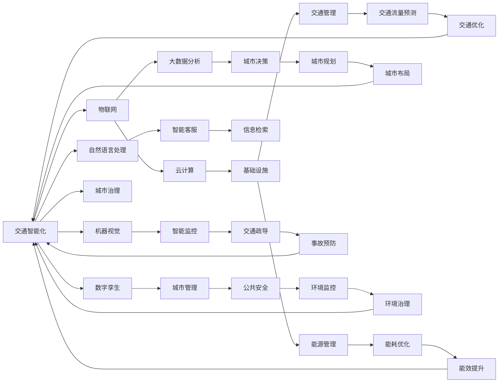

                 

# AI与人类计算：打造可持续发展的城市生活方式与基础设施

> 关键词：人工智能,城市规划,可持续发展,人机协同,智慧城市,数字基础设施

## 1. 背景介绍

### 1.1 问题由来
随着全球城市化进程的加速，城市人口不断增长，资源紧张、环境污染、交通拥堵等问题日益突出。传统城市管理方式难以应对复杂的城市发展需求，如何在人口稠密、资源有限的背景下实现城市的可持续、高效发展，成为城市规划者亟需解决的重要课题。

在这样一个背景下，人工智能技术的崛起，为城市管理带来了新的可能性。通过整合数据资源，利用AI算法模型对城市运行状态进行实时监测、分析与优化，不仅可以提高城市管理效率，还能为市民提供更加便捷、舒适的生活环境。这一趋势，也引领了智慧城市、智能基础设施等概念的兴起，成为未来城市发展的方向。

### 1.2 问题核心关键点
智慧城市、智能基础设施建设，其核心在于将AI技术与城市管理相结合，实现对人、事、物的智能感知与控制，从而提高城市运行效率和居民生活质量。具体而言，智慧城市建设包含以下几个关键要素：

1. **数据采集与融合**：通过传感器、摄像头、GPS等技术，采集城市各项运行数据，利用数据融合技术对数据进行处理，生成综合的城市运行状态图。
2. **智能分析与决策**：基于人工智能算法模型对城市运行状态进行分析，实时调整城市运行策略，优化城市服务与资源配置。
3. **人机协同交互**：通过自然语言处理、机器视觉等技术，提供智能化的互动体验，满足市民多样化、个性化的需求。
4. **基础设施智慧化**：将AI技术应用于城市基础设施的运营与维护，提升基础设施的自动化、智能化水平，减少运维成本。

### 1.3 问题研究意义
智慧城市与智能基础设施的建设，对城市管理和服务具有深远的意义：

1. **提高城市管理效率**：通过AI技术实时监测城市运行状态，自动调度资源，能够显著提高城市管理的响应速度和处理能力。
2. **优化城市服务**：AI可以分析市民的需求，提供定制化的城市服务，提升市民的满意度和幸福感。
3. **助力可持续发展**：智慧城市能够有效利用资源，降低能耗，减少环境污染，助力实现城市绿色、低碳的可持续发展。
4. **推动科技创新**：智慧城市的建设需要跨学科合作，促进AI与城市管理、城市规划、环境科学等领域的融合，推动科技发展。
5. **增强城市竞争力**：智慧城市通过提高服务水平和管理效率，能够吸引更多人才和投资，提升城市的国际竞争力和吸引力。

## 2. 核心概念与联系

### 2.1 核心概念概述

智慧城市与智能基础设施建设，涉及多个交叉学科的概念和技术，包括但不限于以下几个核心要素：

- **人工智能(AI)**：用于分析、处理城市运行数据，提高城市管理的智能化水平。
- **物联网(IoT)**：通过各种传感器、设备，采集城市运行数据，实现数据共享和协同管理。
- **云计算(Cloud Computing)**：提供强大的计算能力和存储能力，支持大规模数据分析与处理。
- **自然语言处理(NLP)**：用于智能客服、信息检索、知识图谱等，增强人机互动体验。
- **机器视觉(Machine Vision)**：应用于交通管理、公共安全、智能监控等，提升城市运行的实时监控与分析能力。
- **大数据分析(Big Data Analysis)**：对海量城市数据进行挖掘与分析，发现城市运行规律与问题，指导城市决策。
- **数字孪生(Digital Twin)**：构建城市虚拟模型，实现物理世界与数字世界的深度融合，提升城市治理的精准性。

这些概念通过逻辑框架图关联起来，展示了智慧城市与智能基础设施建设的关键要素及相互作用关系。



### 2.2 核心概念原理和架构的 Mermaid 流程图
以下是一个简化的智慧城市系统架构图，展示了各个核心概念及其之间的连接关系。

```mermaid
graph LR
    A[传感器] --> B[数据采集中心]
    B --> C[数据存储]
    B --> D[数据清洗]
    D --> E[数据融合]
    E --> F[大数据分析]
    F --> G[决策支持系统]
    G --> H[城市运行指挥中心]
    H --> I[智能监控系统]
    H --> J[智能客服系统]
    H --> K[能源管理系统]
    H --> L[交通管理系统]
    H --> M[环境监测系统]
    H --> N[公共安全系统]
    I --> O[交通流量预测]
    I --> P[事故预防]
    J --> Q[信息检索]
    K --> R[能效提升]
    L --> S[交通优化]
    M --> T[环境治理]
    N --> U[安全预警]
    O --> V[实时监控]
    V --> W[城市预警]
    W --> X[应急响应]
    Q --> Y[智能建议]
    R --> Z[智能维护]
    S --> AA[交通疏导]
    U --> BB[安全管理]
    V --> CC[事故处理]
    W --> DD[规划调整]
    X --> EE[应急管理]
    Y --> FF[信息推送]
    Z --> GG[基础设施优化]
    AA --> HH[交通智能化]
    BB --> II[公共安全智能化]
    CC --> JJ[事故处理智能化]
    DD --> KK[规划智能化]
    EE --> LL[应急智能化]
    FF --> MM[信息服务智能化]
    GG --> NN[基础设施智能化]
    HH --> oo[城市智能治理]
    II --> pp[安全智能治理]
    JJ --> qq[事故处理智能治理]
    KK --> rr[规划智能治理]
    LL --> ss[应急智能治理]
    MM --> tt[信息服务智能治理]
    NN --> uu[基础设施智能治理]
    oo --> vv[城市智能治理]
    pp --> ww[安全智能治理]
    qq --> xx[事故处理智能治理]
    rr --> yy[规划智能治理]
    ss --> zz[应急智能治理]
    tt --> Aa[信息服务智能治理]
    uu --> Ab[基础设施智能治理]
    vv --> Ac[城市智能治理]
    ww --> Ad[安全智能治理]
    xx --> Ae[事故处理智能治理]
    yy --> Af[规划智能治理]
    zz --> Ag[应急智能治理]
    Aa --> Ah[信息服务智能治理]
    Ab --> Ai[基础设施智能治理]
    Ac --> Aj[城市智能治理]
    Ad --> Ak[安全智能治理]
    Ae --> Al[事故处理智能治理]
    Af --> Am[规划智能治理]
    Ag --> An[应急智能治理]
    Ah --> Ao[信息服务智能治理]
    Ai --> Ap[基础设施智能治理]
    Aj --> Aq[城市智能治理]
    Ak --> Ar[安全智能治理]
    Al --> As[事故处理智能治理]
    Am --> At[规划智能治理]
    An --> Au[应急智能治理]
    Ao --> Av[信息服务智能治理]
    Ap --> Aw[基础设施智能治理]
    Aq --> Ax[城市智能治理]
    Ar --> Ay[安全智能治理]
    As --> Az[事故处理智能治理]
    At --> Aa[规划智能治理]
    Au --> Ab[应急智能治理]
    Av --> Ac[信息服务智能治理]
    Aw --> Ad[基础设施智能治理]
    Ax --> Ae[城市智能治理]
    Ay --> Af[安全智能治理]
    Az --> Ag[应急智能治理]
    Aa --> Ab[信息服务智能治理]
    Ab --> Ac[基础设施智能治理]
    Ac --> Ad[城市智能治理]
    Ad --> Ae[安全智能治理]
    Ae --> Af[事故处理智能治理]
    Af --> Ag[规划智能治理]
    Ag --> Ah[应急智能治理]
    Ah --> Ai[信息服务智能治理]
    Ai --> Aj[基础设施智能治理]
    Aj --> Ak[城市智能治理]
    Ak --> Al[安全智能治理]
    Al --> Am[事故处理智能治理]
    Am --> An[规划智能治理]
    An --> Ao[应急智能治理]
    Ao --> Ap[信息服务智能治理]
    Ap --> Aq[基础设施智能治理]
    Aq --> Ar[城市智能治理]
    Ar --> As[安全智能治理]
    As --> At[事故处理智能治理]
    At --> Aa[规划智能治理]
    Aa --> Ab[应急智能治理]
    Ab --> Ac[信息服务智能治理]
    Ac --> Ad[基础设施智能治理]
    Ad --> Ae[城市智能治理]
    Ae --> Af[安全智能治理]
    Af --> Ag[事故处理智能治理]
    Ag --> Ah[规划智能治理]
    Ah --> Ai[应急智能治理]
    Ai --> Aj[信息服务智能治理]
    Aj --> Ak[基础设施智能治理]
    Ak --> Al[城市智能治理]
    Al --> Am[安全智能治理]
    Am --> An[事故处理智能治理]
    An --> Ao[规划智能治理]
    Ao --> Ap[应急智能治理]
    Ap --> Aq[信息服务智能治理]
    Aq --> Ar[基础设施智能治理]
    Ar --> As[城市智能治理]
    As --> At[安全智能治理]
    At --> Aa[事故处理智能治理]
    Aa --> Ab[规划智能治理]
    Ab --> Ac[信息服务智能治理]
    Ac --> Ad[基础设施智能治理]
    Ad --> Ae[城市智能治理]
    Ae --> Af[安全智能治理]
    Af --> Ag[事故处理智能治理]
    Ag --> Ah[规划智能治理]
    Ah --> Ai[应急智能治理]
    Ai --> Aj[信息服务智能治理]
    Aj --> Ak[基础设施智能治理]
    Ak --> Al[城市智能治理]
    Al --> Am[安全智能治理]
    Am --> An[事故处理智能治理]
    An --> Ao[规划智能治理]
    Ao --> Ap[应急智能治理]
    Ap --> Aq[信息服务智能治理]
    Aq --> Ar[基础设施智能治理]
    Ar --> As[城市智能治理]
    As --> At[安全智能治理]
    At --> Aa[事故处理智能治理]
    Aa --> Ab[规划智能治理]
    Ab --> Ac[信息服务智能治理]
    Ac --> Ad[基础设施智能治理]
    Ad --> Ae[城市智能治理]
    Ae --> Af[安全智能治理]
    Af --> Ag[事故处理智能治理]
    Ag --> Ah[规划智能治理]
    Ah --> Ai[应急智能治理]
    Ai --> Aj[信息服务智能治理]
    Aj --> Ak[基础设施智能治理]
    Ak --> Al[城市智能治理]
    Al --> Am[安全智能治理]
    Am --> An[事故处理智能治理]
    An --> Ao[规划智能治理]
    Ao --> Ap[应急智能治理]
    Ap --> Aq[信息服务智能治理]
    Aq --> Ar[基础设施智能治理]
    Ar --> As[城市智能治理]
    As --> At[安全智能治理]
    At --> Aa[事故处理智能治理]
    Aa --> Ab[规划智能治理]
    Ab --> Ac[信息服务智能治理]
    Ac --> Ad[基础设施智能治理]
    Ad --> Ae[城市智能治理]
    Ae --> Af[安全智能治理]
    Af --> Ag[事故处理智能治理]
    Ag --> Ah[规划智能治理]
    Ah --> Ai[应急智能治理]
    Ai --> Aj[信息服务智能治理]
    Aj --> Ak[基础设施智能治理]
    Ak --> Al[城市智能治理]
    Al --> Am[安全智能治理]
    Am --> An[事故处理智能治理]
    An --> Ao[规划智能治理]
    Ao --> Ap[应急智能治理]
    Ap --> Aq[信息服务智能治理]
    Aq --> Ar[基础设施智能治理]
    Ar --> As[城市智能治理]
    As --> At[安全智能治理]
    At --> Aa[事故处理智能治理]
    Aa --> Ab[规划智能治理]
    Ab --> Ac[信息服务智能治理]
    Ac --> Ad[基础设施智能治理]
    Ad --> Ae[城市智能治理]
    Ae --> Af[安全智能治理]
    Af --> Ag[事故处理智能治理]
    Ag --> Ah[规划智能治理]
    Ah --> Ai[应急智能治理]
    Ai --> Aj[信息服务智能治理]
    Aj --> Ak[基础设施智能治理]
    Ak --> Al[城市智能治理]
    Al --> Am[安全智能治理]
    Am --> An[事故处理智能治理]
    An --> Ao[规划智能治理]
    Ao --> Ap[应急智能治理]
    Ap --> Aq[信息服务智能治理]
    Aq --> Ar[基础设施智能治理]
    Ar --> As[城市智能治理]
    As --> At[安全智能治理]
    At --> Aa[事故处理智能治理]
    Aa --> Ab[规划智能治理]
    Ab --> Ac[信息服务智能治理]
    Ac --> Ad[基础设施智能治理]
    Ad --> Ae[城市智能治理]
    Ae --> Af[安全智能治理]
    Af --> Ag[事故处理智能治理]
    Ag --> Ah[规划智能治理]
    Ah --> Ai[应急智能治理]
    Ai --> Aj[信息服务智能治理]
    Aj --> Ak[基础设施智能治理]
    Ak --> Al[城市智能治理]
    Al --> Am[安全智能治理]
    Am --> An[事故处理智能治理]
    An --> Ao[规划智能治理]
    Ao --> Ap[应急智能治理]
    Ap --> Aq[信息服务智能治理]
    Aq --> Ar[基础设施智能治理]
    Ar --> As[城市智能治理]
    As --> At[安全智能治理]
    At --> Aa[事故处理智能治理]
    Aa --> Ab[规划智能治理]
    Ab --> Ac[信息服务智能治理]
    Ac --> Ad[基础设施智能治理]
    Ad --> Ae[城市智能治理]
    Ae --> Af[安全智能治理]
    Af --> Ag[事故处理智能治理]
    Ag --> Ah[规划智能治理]
    Ah --> Ai[应急智能治理]
    Ai --> Aj[信息服务智能治理]
    Aj --> Ak[基础设施智能治理]
    Ak --> Al[城市智能治理]
    Al --> Am[安全智能治理]
    Am --> An[事故处理智能治理]
    An --> Ao[规划智能治理]
    Ao --> Ap[应急智能治理]
    Ap --> Aq[信息服务智能治理]
    Aq --> Ar[基础设施智能治理]
    Ar --> As[城市智能治理]
    As --> At[安全智能治理]
    At --> Aa[事故处理智能治理]
    Aa --> Ab[规划智能治理]
    Ab --> Ac[信息服务智能治理]
    Ac --> Ad[基础设施智能治理]
    Ad --> Ae[城市智能治理]
    Ae --> Af[安全智能治理]
    Af --> Ag[事故处理智能治理]
    Ag --> Ah[规划智能治理]
    Ah --> Ai[应急智能治理]
    Ai --> Aj[信息服务智能治理]
    Aj --> Ak[基础设施智能治理]
    Ak --> Al[城市智能治理]
    Al --> Am[安全智能治理]
    Am --> An[事故处理智能治理]
    An --> Ao[规划智能治理]
    Ao --> Ap[应急智能治理]
    Ap --> Aq[信息服务智能治理]
    Aq --> Ar[基础设施智能治理]
    Ar --> As[城市智能治理]
    As --> At[安全智能治理]
    At --> Aa[事故处理智能治理]
    Aa --> Ab[规划智能治理]
    Ab --> Ac[信息服务智能治理]
    Ac --> Ad[基础设施智能治理]
    Ad --> Ae[城市智能治理]
    Ae --> Af[安全智能治理]
    Af --> Ag[事故处理智能治理]
    Ag --> Ah[规划智能治理]
    Ah --> Ai[应急智能治理]
    Ai --> Aj[信息服务智能治理]
    Aj --> Ak[基础设施智能治理]
    Ak --> Al[城市智能治理]
    Al --> Am[安全智能治理]
    Am --> An[事故处理智能治理]
    An --> Ao[规划智能治理]
    Ao --> Ap[应急智能治理]
    Ap --> Aq[信息服务智能治理]
    Aq --> Ar[基础设施智能治理]
    Ar --> As[城市智能治理]
    As --> At[安全智能治理]
    At --> Aa[事故处理智能治理]
    Aa --> Ab[规划智能治理]
    Ab --> Ac[信息服务智能治理]
    Ac --> Ad[基础设施智能治理]
    Ad --> Ae[城市智能治理]
    Ae --> Af[安全智能治理]
    Af --> Ag[事故处理智能治理]
    Ag --> Ah[规划智能治理]
    Ah --> Ai[应急智能治理]
    Ai --> Aj[信息服务智能治理]
    Aj --> Ak[基础设施智能治理]
    Ak --> Al[城市智能治理]
    Al --> Am[安全智能治理]
    Am --> An[事故处理智能治理]
    An --> Ao[规划智能治理]
    Ao --> Ap[应急智能治理]
    Ap --> Aq[信息服务智能治理]
    Aq --> Ar[基础设施智能治理]
    Ar --> As[城市智能治理]
    As --> At[安全智能治理]
    At --> Aa[事故处理智能治理]
    Aa --> Ab[规划智能治理]
    Ab --> Ac[信息服务智能治理]
    Ac --> Ad[基础设施智能治理]
    Ad --> Ae[城市智能治理]
    Ae --> Af[安全智能治理]
    Af --> Ag[事故处理智能治理]
    Ag --> Ah[规划智能治理]
    Ah --> Ai[应急智能治理]
    Ai --> Aj[信息服务智能治理]
    Aj --> Ak[基础设施智能治理]
    Ak --> Al[城市智能治理]
    Al --> Am[安全智能治理]
    Am --> An[事故处理智能治理]
    An --> Ao[规划智能治理]
    Ao --> Ap[应急智能治理]
    Ap --> Aq[信息服务智能治理]
    Aq --> Ar[基础设施智能治理]
    Ar --> As[城市智能治理]
    As --> At[安全智能治理]
    At --> Aa[事故处理智能治理]
    Aa --> Ab[规划智能治理]
    Ab --> Ac[信息服务智能治理]
    Ac --> Ad[基础设施智能治理]
    Ad --> Ae[城市智能治理]
    Ae --> Af[安全智能治理]
    Af --> Ag[事故处理智能治理]
    Ag --> Ah[规划智能治理]
    Ah --> Ai[应急智能治理]
    Ai --> Aj[信息服务智能治理]
    Aj --> Ak[基础设施智能治理]
    Ak --> Al[城市智能治理]
    Al --> Am[安全智能治理]
    Am --> An[事故处理智能治理]
    An --> Ao[规划智能治理]
    Ao --> Ap[应急智能治理]
    Ap --> Aq[信息服务智能治理]
    Aq --> Ar[基础设施智能治理]
    Ar --> As[城市智能治理]
    As --> At[安全智能治理]
    At --> Aa[事故处理智能治理]
    Aa --> Ab[规划智能治理]
    Ab --> Ac[信息服务智能治理]
    Ac --> Ad[基础设施智能治理]
    Ad --> Ae[城市智能治理]
    Ae --> Af[安全智能治理]
    Af --> Ag[事故处理智能治理]
    Ag --> Ah[规划智能治理]
    Ah --> Ai[应急智能治理]
    Ai --> Aj[信息服务智能治理]
    Aj --> Ak[基础设施智能治理]
    Ak --> Al[城市智能治理]
    Al --> Am[安全智能治理]
    Am --> An[事故处理智能治理]
    An --> Ao[规划智能治理]
    Ao --> Ap[应急智能治理]
    Ap --> Aq[信息服务智能治理]
    Aq --> Ar[基础设施智能治理]
    Ar --> As[城市智能治理]
    As --> At[安全智能治理]
    At --> Aa[事故处理智能治理]
    Aa --> Ab[规划智能治理]
    Ab --> Ac[信息服务智能治理]
    Ac --> Ad[基础设施智能治理]
    Ad --> Ae[城市智能治理]
    Ae --> Af[安全智能治理]
    Af --> Ag[事故处理智能治理]
    Ag --> Ah[规划智能治理]
    Ah --> Ai[应急智能治理]
    Ai --> Aj[信息服务智能治理]
    Aj --> Ak[基础设施智能治理]
    Ak --> Al[城市智能治理]
    Al --> Am[安全智能治理]
    Am --> An[事故处理智能治理]
    An --> Ao[规划智能治理]
    Ao --> Ap[应急智能治理]
    Ap --> Aq[信息服务智能治理]
    Aq --> Ar[基础设施智能治理]
    Ar --> As[城市智能治理]
    As --> At[安全智能治理]
    At --> Aa[事故处理智能治理]
    Aa --> Ab[规划智能治理]
    Ab --> Ac[信息服务智能治理]
    Ac --> Ad[基础设施智能治理]
    Ad --> Ae[城市智能治理]
    Ae --> Af[安全智能治理]
    Af --> Ag[事故处理智能治理]
    Ag --> Ah[规划智能治理]
    Ah --> Ai[应急智能治理]
    Ai --> Aj[信息服务智能治理]
    Aj --> Ak[基础设施智能治理]
    Ak --> Al[城市智能治理]
    Al --> Am[安全智能治理]
    Am --> An[事故处理智能治理]
    An --> Ao[规划智能治理]
    Ao --> Ap[应急智能治理]
    Ap --> Aq[信息服务智能治理]
    Aq --> Ar[基础设施智能治理]
    Ar --> As[城市智能治理]
    As --> At[安全智能治理]
    At --> Aa[事故处理智能治理]
    Aa --> Ab[规划智能治理]
    Ab --> Ac[信息服务智能治理]
    Ac --> Ad[基础设施智能治理]
    Ad --> Ae[城市智能治理]
    Ae --> Af[安全智能治理]
    Af --> Ag[事故处理智能治理]
    Ag --> Ah[规划智能治理]
    Ah --> Ai[应急智能治理]
    Ai --> Aj[信息服务智能治理]
    Aj --> Ak[基础设施智能治理]
    Ak --> Al[城市智能治理]
    Al --> Am[安全智能治理]
    Am --> An[事故处理智能治理]
    An --> Ao[规划智能治理]
    Ao --> Ap[应急智能治理]
    Ap --> Aq[信息服务智能治理]
    Aq --> Ar[基础设施智能治理]
    Ar --> As[城市智能治理]
    As --> At[安全智能治理]
    At --> Aa[事故处理智能治理]
    Aa --> Ab[规划智能治理]
    Ab --> Ac[信息服务智能治理]
    Ac --> Ad[基础设施智能治理]
    Ad --> Ae[城市智能治理]
    Ae --> Af[安全智能治理]
    Af --> Ag[事故处理智能治理]
    Ag --> Ah[规划智能治理]
    Ah --> Ai[应急智能治理]
    Ai --> Aj[信息服务智能治理]
    Aj --> Ak[基础设施智能治理]
    Ak --> Al[城市智能治理]
    Al --> Am[安全智能治理]
    Am --> An[事故处理智能治理]
    An --> Ao[规划智能治理]
    Ao --> Ap[应急智能治理]
    Ap --> Aq[信息服务智能治理]
    Aq --> Ar[基础设施智能治理]
    Ar --> As[城市智能治理]
    As --> At[安全智能治理]
    At --> Aa[事故处理智能治理]
    Aa --> Ab[规划智能治理]
    Ab --> Ac[信息服务智能治理]
    Ac --> Ad[基础设施智能治理]
    Ad --> Ae[城市智能治理]
    Ae --> Af[安全智能治理]
    Af --> Ag[事故处理智能治理]
    Ag --> Ah[规划智能治理]
    Ah --> Ai[应急智能治理]
    Ai --> Aj[信息服务智能治理]
    Aj --> Ak[基础设施智能治理]
    Ak --> Al[城市智能治理]
    Al --> Am[安全智能治理]
    Am --> An[事故处理智能治理]
    An --> Ao[规划智能治理]
    Ao --> Ap[应急智能治理]
    Ap --> Aq[信息服务智能治理]
    Aq --> Ar[基础设施智能治理]
    Ar --> As[城市智能治理]
    As --> At[安全智能治理]
    At --> Aa[事故处理智能治理]
    Aa --> Ab[规划智能治理]
    Ab --> Ac[信息服务智能治理]
    Ac --> Ad[基础设施智能治理]
    Ad --> Ae[城市智能治理]
    Ae --> Af[安全智能治理]
    Af --> Ag[事故处理智能治理]
    Ag --> Ah[规划智能治理]
    Ah --> Ai[应急智能治理]
    Ai --> Aj[信息服务智能治理]
    Aj --> Ak[基础设施智能治理]
    Ak --> Al[城市智能治理]
    Al --> Am[安全智能治理]
    Am --> An[事故处理智能治理]
    An --> Ao[规划智能治理]
    Ao --> Ap[应急智能治理]
    Ap --> Aq[信息服务智能治理]
    Aq --> Ar[基础设施智能治理]
    Ar --> As[城市智能治理]
    As --> At[安全智能治理]
    At --> Aa[事故处理智能治理]
    Aa --> Ab[规划智能治理]
    Ab --> Ac[信息服务智能治理]
    Ac --> Ad[基础设施智能治理]
    Ad --> Ae[城市智能治理]
    Ae --> Af[安全智能治理]
    Af --> Ag[事故处理智能治理]
    Ag --> Ah[规划智能治理]
    Ah --> Ai[应急智能治理]
    Ai --> Aj[信息服务智能治理]
    Aj --> Ak[基础设施智能治理]
    Ak --> Al[城市智能治理]
    Al --> Am[安全智能治理]
    Am --> An[事故处理智能治理]
    An --> Ao[规划智能治理]
    Ao --> Ap[应急智能治理]
    Ap --> Aq[信息服务智能治理]
    Aq --> Ar[基础设施智能治理]
    Ar --> As[城市智能治理]
    As --> At[安全智能治理]
    At --> Aa[事故处理智能治理]
    Aa --> Ab[规划智能治理]
    Ab --> Ac[信息服务智能治理]
    Ac --> Ad[基础设施智能治理]
    Ad --> Ae[城市智能治理]
    Ae --> Af[安全智能治理]
    Af --> Ag[事故处理智能治理]
    Ag --> Ah[规划智能治理]
    Ah --> Ai[应急智能治理]
    Ai --> Aj[信息服务智能治理]
    Aj --> Ak[基础设施智能治理]
    Ak --> Al[城市智能治理]
    Al --> Am[安全智能治理]
    Am --> An[事故处理智能治理]
    An --> Ao[规划智能治理]
    Ao --> Ap[应急智能治理]
    Ap --> Aq[信息服务智能治理]
    Aq --> Ar[基础设施智能治理]
    Ar --> As[城市智能治理]
    As --> At[安全智能治理]
    At --> Aa[事故处理智能治理]
    Aa --> Ab[规划智能治理]
    Ab --> Ac[信息服务智能治理]
    Ac --> Ad[基础设施智能治理]
    Ad --> Ae[城市智能治理]
    Ae --> Af[安全智能治理]
    Af --> Ag[事故处理智能治理]
    Ag --> Ah[规划智能治理]
    Ah --> Ai[应急智能治理]
    Ai --> Aj[信息服务智能治理]
    Aj --> Ak[基础设施智能治理]
    Ak --> Al[城市智能治理]
    Al --> Am[安全智能治理]
    Am --> An[事故处理智能治理]
    An --> Ao[规划智能治理]
    Ao --> Ap[应急智能治理]
    Ap --> Aq[信息服务智能治理]
    Aq --> Ar[基础设施智能治理]
    Ar --> As[城市智能治理]
    As --> At[安全智能治理]
    At --> Aa[事故处理智能治理]
    Aa --> Ab[规划智能治理]
    Ab --> Ac[信息服务智能治理]
    Ac --> Ad[基础设施智能治理]
    Ad --> Ae[城市智能治理]
    Ae --> Af[安全智能治理]
    Af --> Ag[事故处理智能治理]
    Ag --> Ah[规划智能治理]
    Ah --> Ai[应急智能治理]
    Ai --> Aj[信息服务智能治理]
    Aj --> Ak[基础设施智能治理]
    Ak --> Al[城市智能治理]
    Al --> Am[安全智能治理]
    Am --> An[事故处理智能治理]
    An --> Ao[规划智能治理]
    Ao --> Ap[应急智能治理]
    Ap --> Aq[信息服务智能治理]
    Aq --> Ar[基础设施智能治理]
    Ar --> As[城市智能治理]
    As --> At[安全智能治理]
    At --> Aa[事故处理智能治理]
    Aa --> Ab[规划智能治理]
    Ab --> Ac[信息服务智能治理]
    Ac --> Ad[基础设施智能治理]
    Ad --> Ae[城市智能治理]
    Ae --> Af[安全智能治理]
    Af --> Ag[事故处理智能治理]
    Ag --> Ah[规划智能治理]
    Ah --> Ai[应急智能治理]
    Ai --> Aj[信息服务智能治理]
    Aj --> Ak[基础设施智能治理]
    Ak --> Al[城市智能治理]
    Al --> Am[安全智能治理]
    Am --> An[事故处理智能治理]
    An --> Ao[规划智能治理]
    Ao --> Ap[应急智能治理]
    Ap --> Aq[信息服务智能治理]
    Aq --> Ar[基础设施智能治理]
    Ar --> As[城市智能治理]
    As --> At[安全智能治理]
    At --> Aa[事故处理智能治理]
    Aa --> Ab[规划智能治理]
    Ab --> Ac[信息服务智能治理]
    Ac --> Ad[基础设施智能治理]
    Ad --> Ae[城市智能治理]
    Ae --> Af[安全智能治理]
    Af --> Ag[事故处理智能治理]
    Ag --> Ah[规划智能治理]
    Ah --> Ai[应急智能治理]
    Ai --> Aj[信息服务智能治理]
    Aj --> Ak[基础设施智能治理]
    Ak --> Al[城市智能治理]
    Al --> Am[安全智能治理]
    Am --> An[事故处理智能治理]
    An --> Ao[规划智能治理]
    Ao --> Ap[应急智能治理]
    Ap --> Aq[信息服务智能治理]
    Aq --> Ar[基础设施智能治理]
    Ar --> As[城市智能治理]
    As --> At[安全智能治理]
    At --> Aa[事故处理智能治理]
    Aa --> Ab[规划智能治理]
    Ab --> Ac[信息服务智能治理]
    Ac --> Ad[基础设施智能治理]
    Ad --> Ae[城市智能治理]
    Ae --> Af[安全智能治理]
    Af --> Ag[事故处理智能治理]
    Ag --> Ah[规划智能治理]
    Ah --> Ai[应急智能治理]
    Ai --> Aj[信息服务智能治理]
    Aj --> Ak[基础设施智能治理]
    Ak --> Al[城市智能治理]
    Al --> Am[安全智能治理]
    Am --> An[事故处理智能治理]
    An --> Ao[规划智能治理]
    Ao --> Ap[应急智能治理]
    Ap --> Aq[信息服务智能治理]
    Aq --> Ar[基础设施智能治理]
    Ar --> As[城市智能治理]
    As --> At[安全智能治理]
    At --> Aa[事故处理智能治理]
    Aa --> Ab[规划智能治理]
    Ab --> Ac[信息服务智能治理]
    Ac --> Ad[基础设施智能治理]
    Ad --> Ae[城市智能治理]
    Ae --> Af[安全智能治理]
    Af --> Ag[事故处理智能治理]
    Ag --> Ah[规划智能治理]
    Ah --> Ai[应急智能治理]
    Ai --> Aj[信息服务智能治理]
    Aj --> Ak[基础设施智能治理]
    Ak --> Al[城市智能治理]
    Al --> Am[安全智能治理]
    Am --> An[事故处理智能治理]
    An --> Ao[规划智能治理]
    Ao --> Ap[应急智能治理]
    Ap --> Aq[信息服务智能治理]
    Aq --> Ar[基础设施智能治理]
    Ar --> As[城市智能治理]
    As --> At[安全智能治理]
    At --> Aa[事故处理智能治理]
    Aa --> Ab[规划智能治理]
    Ab --> Ac[信息服务智能治理]
    Ac --> Ad[基础设施智能治理]
    Ad --> Ae[城市智能治理]
    Ae --> Af[安全智能治理]
    Af --> Ag[事故处理智能治理]
    Ag --> Ah[规划智能治理]
    Ah --> Ai[应急智能治理]
    Ai --> Aj[信息服务智能治理]
    Aj --> Ak[基础设施智能治理]
    Ak --> Al[城市智能治理]
    Al --> Am[安全智能治理]
    Am --> An[事故处理智能治理]
    An --> Ao[规划智能治理]
    Ao --> Ap[应急智能治理]
    Ap --> Aq[信息服务智能治理]
    Aq --> Ar[基础设施智能治理]
    Ar --> As[城市智能治理]
    As --> At[安全智能治理]
    At --> Aa[事故处理智能治理]
    Aa --> Ab[规划智能治理]
    Ab --> Ac[信息服务智能治理]
    Ac --> Ad[基础设施智能治理]
    Ad --> Ae[城市智能治理]
    Ae --> Af[安全智能治理]
    Af --> Ag[事故处理智能治理]
    Ag --> Ah[规划智能治理]
    Ah --> Ai[应急智能治理]
    Ai --> Aj[信息服务智能治理]
    Aj --> Ak[基础设施智能治理]
    Ak --> Al[城市智能治理]
    Al --> Am[安全智能治理]
    Am --> An[事故处理智能治理]
    An --> Ao[规划智能治理]
    Ao --> Ap[应急智能治理]
    Ap --> Aq[信息服务智能治理]
    Aq --> Ar[基础设施智能治理]
    Ar --> As[城市智能治理]
    As --> At[安全智能治理]
    At --> Aa[事故处理智能治理]
    Aa --> Ab[规划智能治理]
    Ab --> Ac[信息服务智能治理]
    Ac --> Ad[基础设施智能治理]
    Ad --> Ae[城市智能治理]
    Ae --> Af[安全智能治理]
    Af --> Ag[事故处理智能治理]
    Ag --> Ah[规划智能治理]
    Ah --> Ai[应急智能治理]
    Ai --> Aj[信息服务智能治理]
    Aj --> Ak[基础设施智能治理]
    Ak --> Al[城市智能治理]
    Al --> Am[安全智能治理]
    Am --> An[事故处理智能治理]
    An --> Ao[规划智能治理]
    Ao --> Ap[应急智能治理]
    Ap --> Aq[信息服务智能治理]
    Aq --> Ar[基础设施智能治理]
    Ar --> As[城市智能治理]
    As --> At[安全智能治理]
    At --> Aa[事故处理智能治理]
    Aa --> Ab[规划智能治理]
    Ab --> Ac[信息服务智能治理]
    Ac --> Ad[基础设施智能治理]
    Ad --> Ae[城市智能治理]
    Ae --> Af[安全智能治理]
    Af --> Ag[事故处理智能治理]
    Ag --> Ah[规划智能治理]
    Ah --> Ai[应急智能治理]
    Ai --> Aj[信息服务智能治理]
    Aj --> Ak[基础设施智能治理]
    Ak --> Al[城市智能治理]
    Al --> Am[安全智能治理]
    Am --> An[事故处理智能治理]
    An --> Ao[规划智能治理]
    Ao --> Ap[应急智能治理]
    Ap --> Aq[信息服务智能治理]
    Aq --> Ar[基础设施智能治理]
    Ar --> As[城市智能治理]
    As --> At[安全智能治理]
    At --> Aa[事故处理智能治理]
    Aa --> Ab[规划智能治理]
    Ab --> Ac[信息服务智能治理]
    Ac --> Ad[基础设施智能治理]
    Ad --> Ae[城市智能治理]
    Ae --> Af[安全智能治理]
    Af --> Ag[事故处理智能治理]
    Ag --> Ah[规划智能治理]
    Ah --> Ai[应急智能治理]
    Ai --> Aj[信息服务智能治理]
    Aj --> Ak[基础设施智能治理]
    Ak --> Al[城市智能治理]
    Al --> Am[安全智能治理]
    Am --> An[事故处理智能治理]
    An --> Ao[规划智能治理]
    Ao --> Ap[应急智能治理]
    Ap --> Aq[信息服务智能治理]
    Aq --> Ar[基础设施智能治理]
    Ar --> As[城市智能治理]
    As --> At[安全智能治理]
    At --> Aa[事故处理智能治理]
    Aa --> Ab[规划智能治理]
    Ab --> Ac[信息服务智能治理]
    Ac --> Ad[基础设施智能治理]
    Ad --> Ae[城市智能治理]
    Ae --> Af[安全智能治理]
    Af --> Ag[事故处理智能治理]
    Ag --> Ah[规划智能治理]
    Ah --> Ai[应急智能治理]
    Ai --> Aj[信息服务智能治理]
    Aj --> Ak[基础设施智能治理]
    Ak --> Al[城市智能治理]
    Al --> Am[安全智能治理]
    Am --> An[事故处理智能治理]
    An --> Ao[规划智能治理]
    Ao --> Ap[应急智能治理]
    Ap --> Aq[信息服务智能治理]
    Aq --> Ar[基础设施智能治理]
    Ar --> As[城市智能治理]
    As --> At[安全智能治理]
    At --> Aa[事故处理智能治理]
    Aa --> Ab[规划智能治理]
    Ab --> Ac[信息服务智能治理]
    Ac --> Ad[基础设施智能治理]
    Ad --> Ae[城市智能治理]
    Ae --> Af[安全智能治理]
    Af --> Ag[事故处理智能治理]
    Ag --> Ah[规划智能治理]
    Ah --> Ai[应急智能治理]
    Ai --> Aj[信息服务智能治理]
    Aj --> Ak[基础设施智能治理]
    Ak --> Al[城市智能治理]
    Al --> Am[安全智能治理]
    Am --> An[事故处理智能治理]
    An --> Ao[规划智能治理]
    Ao --> Ap[应急智能治理]
    Ap --> Aq[信息服务智能治理]
    Aq --> Ar[基础设施智能治理]
    Ar --> As[城市智能治理]
    As --> At[安全智能治理]
    At --> Aa[事故处理智能治理]
    Aa --> Ab[规划智能治理]
    Ab --> Ac[信息服务智能治理]
    Ac --> Ad[基础设施智能治理]
    Ad --> Ae[城市智能治理]
    Ae --> Af[安全智能治理]
    Af --> Ag[事故处理智能治理]
    Ag --> Ah[规划智能治理]
    Ah --> Ai[应急智能治理]
    Ai --> Aj[信息服务智能治理]
    Aj --> Ak[基础设施智能治理]
    Ak --> Al[城市智能治理]
    Al --> Am[安全智能治理]
    Am --> An[事故处理智能治理]
    An --> Ao[规划智能治理]
    Ao --> Ap[应急智能治理]
    Ap --> Aq[信息服务智能治理]
    Aq --> Ar[基础设施智能治理]
    Ar --> As[城市智能治理]
    As --> At[安全智能治理]
    At --> Aa[事故处理智能治理]
    Aa --> Ab[规划智能治理]
    Ab --> Ac[信息服务智能治理]
    Ac --> Ad[基础设施智能治理]
    Ad --> Ae[城市智能治理]
    Ae --> Af[安全智能治理]
    Af --> Ag[事故处理智能治理]
    Ag --> Ah[规划智能治理]
    Ah --> Ai[应急智能治理]
    Ai --> Aj[信息服务智能治理]
    Aj --> Ak[基础设施智能治理]
    Ak --> Al[城市智能治理]
    Al --> Am[安全智能治理]
    Am --> An[事故处理智能治理]
    An --> Ao[规划智能治理]
    Ao --> Ap[应急智能治理]
    Ap --> Aq[信息服务智能治理]
    Aq --> Ar[基础设施智能治理]
    Ar --> As[城市智能治理]
    As --> At[安全智能治理]
    At --> Aa[事故处理智能治理]
    Aa --> Ab[规划智能治理]
    Ab --> Ac[信息服务智能治理]
    Ac --> Ad[基础设施智能治理]
    Ad --> Ae[城市智能治理]
    Ae --> Af[安全智能治理]
    Af --> Ag[事故处理智能治理]
    Ag --> Ah[规划智能治理]
    Ah --> Ai[应急智能治理]
    Ai --> Aj[信息服务智能治理]
    Aj --> Ak[基础设施智能治理]
    Ak --> Al[城市智能治理]
    Al --> Am[安全智能治理]
    Am --> An[事故处理智能治理]
    An --> Ao[规划智能治理]
    Ao --> Ap[应急智能治理]
    Ap --> Aq[信息服务智能治理]
    Aq --> Ar[基础设施智能治理]
    Ar --> As[城市智能治理]
    As --> At[安全智能治理]
    At --> Aa[事故处理智能治理]
    Aa --> Ab[规划智能治理]


