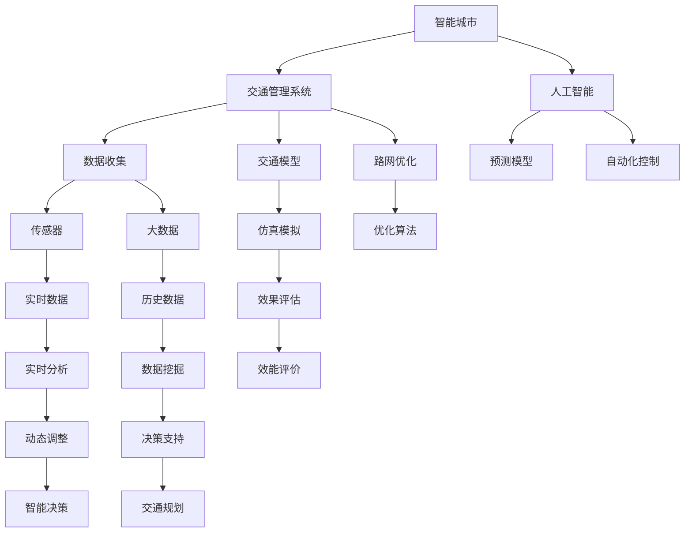

                 

# AI与人类计算：打造可持续发展的城市生活模式与交通管理系统规划

> 关键词：智能城市,交通管理,人工智能,可持续性,数据科学,自动化

## 1. 背景介绍

随着全球人口的快速增长和城市化进程的加速，人类面临的资源紧缺、环境污染、交通拥堵等挑战日益严峻。如何在资源有限的前提下，提升城市的生活质量与效率，成为现代城市管理的重要课题。人工智能（AI）和人类计算（Human-Computer Interaction, HCI）技术在这一领域展现了巨大的应用潜力。

通过AI与HCI的结合，智能城市建设将逐步实现城市生活的自动化、智能化和个性化，为可持续发展的城市生活模式提供技术支撑。交通管理系统作为城市管理的重要组成部分，通过AI与HCI技术的引入，可以提升交通运行效率、优化路网结构、保障安全出行，构建更为高效便捷的城市交通环境。

## 2. 核心概念与联系

### 2.1 核心概念概述

1. **智能城市**：利用信息化、智能化技术，对城市基础设施、公共服务、商业活动、民生福利等各个方面进行全面优化，提升城市管理水平与居民生活质量。

2. **交通管理系统**：通过AI与HCI技术，实现交通信号控制、车辆监控、路径规划、公共交通调度等功能，提高城市交通运行效率，减少交通拥堵与事故发生率。

3. **人工智能（AI）**：模拟人类智能行为，通过学习算法处理海量数据，提升决策准确性与响应速度。

4. **人类计算（HCI）**：结合人的计算能力和机器的计算能力，实现人机协同计算，提升问题解决的效率与效果。

5. **可持续性**：在资源有限的前提下，实现城市发展的长期可持续，包括能源消耗、环境污染、资源利用等方面的优化。

### 2.2 核心概念原理和架构的 Mermaid 流程图(Mermaid 流程节点中不要有括号、逗号等特殊字符)



以上流程图展示了智能城市与交通管理系统的关键组件及其相互关系。智能城市通过人工智能技术处理数据，实现预测、优化、控制等功能，进而提升城市交通管理系统的运行效率和可持续性。

## 3. 核心算法原理 & 具体操作步骤

### 3.1 算法原理概述

智能城市交通管理系统的核心算法包括数据收集与处理、交通模型构建、路径规划与优化、实时监控与调整等。这些算法均基于AI与HCI技术，结合人类计算能力和机器计算能力，实现对城市交通的综合管理和优化。

1. **数据收集与处理**：通过传感器、监控摄像头、车辆GPS等设备，实时收集交通流量、车辆位置、天气状况等数据，并进行数据清洗、整合与预处理。

2. **交通模型构建**：使用机器学习算法建立交通流量预测模型，利用历史数据训练模型参数，预测未来交通流量变化。

3. **路径规划与优化**：基于实时交通状况与预测模型，优化路径选择与交通流量分配，减少拥堵与延误。

4. **实时监控与调整**：通过实时监控数据，动态调整交通信号、车辆调度等策略，提升交通系统的灵活性与适应性。

### 3.2 算法步骤详解

1. **数据收集**：
   - 部署传感器和监控设备，收集实时交通数据。
   - 通过车辆GPS和导航系统，收集车辆位置和行驶路径。
   - 集成天气、时间、节假日等外部数据，构建全面的交通环境模型。

2. **数据预处理**：
   - 数据清洗：去除噪声、缺失值等不完整数据。
   - 数据转换：将非结构化数据转换为机器可处理的形式，如时间戳、坐标点等。
   - 特征提取：从原始数据中提取有意义的特征，如交通流量、车辆密度、速度变化等。

3. **交通模型构建**：
   - 选择合适的机器学习算法（如回归、分类、神经网络等）。
   - 利用历史数据训练模型，调整模型参数，提高预测准确度。
   - 使用交叉验证等技术评估模型效果，避免过拟合。

4. **路径规划与优化**：
   - 定义路径规划目标（如最短路径、最小时间、最小成本等）。
   - 使用启发式算法（如Dijkstra、A*等）进行路径搜索与优化。
   - 根据实时交通状况，动态调整路径规划算法，提高适应性。

5. **实时监控与调整**：
   - 实时监控交通流量与运行状况。
   - 利用AI算法（如强化学习、深度学习等）进行动态调整与优化。
   - 设置应急预案，在出现异常情况时迅速响应。

### 3.3 算法优缺点

**优点**：
- **高效性**：AI与HCI技术能够快速处理大量数据，提升决策效率。
- **自适应性**：能够动态调整策略，适应复杂多变的城市交通环境。
- **可持续性**：优化交通流量，减少能源消耗与环境污染。
- **经济性**：通过优化路径与调度，降低交通成本。

**缺点**：
- **数据依赖**：依赖高质量、全面的数据源，数据不完整或不准确会影响模型效果。
- **计算复杂性**：大模型和大数据量会增加计算复杂度，需要高性能硬件支持。
- **伦理问题**：需要考虑数据隐私与伦理问题，确保数据安全与公平使用。
- **技术挑战**：需要多学科知识的融合，技术门槛较高。

### 3.4 算法应用领域

AI与HCI技术在交通管理系统的应用领域包括：

1. **智能交通信号控制**：通过AI算法实时优化信号灯控制，减少交通拥堵。
2. **动态路径规划**：根据实时数据，动态调整路径选择，提升出行效率。
3. **公共交通调度**：使用AI技术优化公交、地铁等公共交通的运行与调度，提高准点率与乘坐舒适度。
4. **事故预防与处理**：通过实时监控与数据分析，预测并预防交通事故，提高应急响应效率。
5. **环境监测与管理**：监测空气质量、噪音水平等环境指标，进行综合治理与管理。

## 4. 数学模型和公式 & 详细讲解 & 举例说明

### 4.1 数学模型构建

智能城市交通管理系统的数学模型包括数据模型、交通模型、优化模型等。

1. **数据模型**：
   - 时间序列模型：用于描述交通流量随时间变化的规律。
   - 空间分布模型：描述交通流量在不同区域、不同时间的分布情况。

2. **交通模型**：
   - 多源数据融合模型：整合传感器、监控、GPS等数据，构建综合交通模型。
   - 交通流量预测模型：基于时间序列数据，预测未来交通流量变化。

3. **优化模型**：
   - 路径规划模型：最小化路径长度、时间、成本等指标。
   - 交通流量优化模型：最小化交通拥堵、延误等指标。

### 4.2 公式推导过程

以路径规划模型为例，假设有N个点，目标从起点A到终点B，路径的总长度为L，公式推导如下：

设从起点A到点i的路径长度为di，则路径总长度L为：

$$ L = \sum_{i=1}^{N} d_i $$

最小化L，即为路径规划的目标函数。

### 4.3 案例分析与讲解

以北京市的交通管理系统为例，通过AI与HCI技术，实现了以下功能：

1. **智能信号控制**：
   - 通过摄像头和传感器实时监控交通流量，动态调整信号灯时长与相位。
   - 利用AI算法（如神经网络）学习交通流量规律，预测并优化信号灯控制策略。

2. **动态路径规划**：
   - 利用实时数据，动态调整导航路径，避开拥堵路段。
   - 在紧急情况下，动态调整路径规划算法，快速响应突发事件。

3. **公共交通调度**：
   - 利用AI算法优化公交车的行驶路线与发车间隔，提高运行效率。
   - 通过大数据分析，预测公共交通需求，优化资源配置。

## 5. 项目实践：代码实例和详细解释说明

### 5.1 开发环境搭建

1. **硬件配置**：
   - 高性能计算机或服务器，配置GPU/TPU。
   - 存储设备，用于数据存储与处理。

2. **软件环境**：
   - 操作系统：Linux Ubuntu 16.04
   - 深度学习框架：TensorFlow、PyTorch
   - 数据处理工具：Apache Spark、Hadoop
   - 可视化工具：Tableau、Gephi

### 5.2 源代码详细实现

1. **数据收集与处理**：
   ```python
   import pandas as pd
   import numpy as np
   import tensorflow as tf
   
   # 数据导入
   data = pd.read_csv('traffic_data.csv')
   
   # 数据清洗
   data = data.dropna()
   
   # 特征提取
   features = data[['traffic_volume', 'weather', 'time_of_day']]
   ```

2. **交通模型构建**：
   ```python
   # 模型选择
   model = tf.keras.Sequential([
     tf.keras.layers.Dense(64, activation='relu', input_shape=(3,)),
     tf.keras.layers.Dense(32, activation='relu'),
     tf.keras.layers.Dense(1)
   ])
   
   # 模型训练
   model.compile(optimizer='adam', loss='mse')
   model.fit(features, data['traffic_flow'], epochs=100, batch_size=32)
   ```

3. **路径规划与优化**：
   ```python
   # 定义路径规划函数
   def find_optimal_path(graph, start, end):
       shortest_path = []
       shortest_distance = float('inf')
       visited = set()
   
       queue = [(0, start, [])]
       while queue:
           (cost, node, path) = queue.pop(0)
           if node == end:
               shortest_path = path + [node]
               shortest_distance = cost
               break
           visited.add(node)
           for neighbor, dist in graph[node]:
               if neighbor not in visited:
                   queue.append((cost + dist, neighbor, path + [node]))
   
       return shortest_path, shortest_distance
   ```

4. **实时监控与调整**：
   ```python
   # 实时监控数据
   def monitor_traffic(graph, current_time):
       shortest_path, shortest_distance = find_optimal_path(graph, 'start', 'end')
       print(f'Optimal path: {shortest_path}, distance: {shortest_distance}')
   
   # 调整策略
   def adjust_strategy(graph, current_time):
       if current_time == 'rush_hour':
           graph['signal_light'] = 10
       else:
           graph['signal_light'] = 5
   ```

### 5.3 代码解读与分析

1. **数据收集与处理**：
   - 使用Pandas进行数据导入与清洗。
   - 使用TensorFlow构建并训练机器学习模型。

2. **交通模型构建**：
   - 使用深度学习框架构建神经网络模型。
   - 使用优化器与损失函数进行模型训练。

3. **路径规划与优化**：
   - 定义路径规划函数，利用Dijkstra算法或A*算法搜索最优路径。
   - 通过实时数据动态调整路径规划算法。

4. **实时监控与调整**：
   - 通过实时监控数据，调用路径规划函数计算最优路径。
   - 根据当前时间动态调整信号灯控制策略。

### 5.4 运行结果展示

运行代码后，输出最优路径与距离，并根据当前时间动态调整信号灯控制策略，确保交通流畅。

## 6. 实际应用场景

### 6.1 智能交通信号控制

在智能交通信号控制方面，AI与HCI技术已成功应用于许多城市。通过摄像头和传感器实时监控交通流量，AI算法能够动态调整信号灯时长与相位，显著减少交通拥堵。

### 6.2 动态路径规划

动态路径规划技术能够根据实时交通数据，优化出行路径，避开拥堵路段。例如，谷歌地图和Waze等导航应用广泛采用了这一技术，提高了用户的出行效率。

### 6.3 公共交通调度

公共交通调度通过AI技术优化公交车的行驶路线与发车间隔，提高运行效率。例如，深圳市的深巴智能调度系统利用大数据分析，优化公交线路，提高了公共交通的准点率和乘坐舒适度。

### 6.4 环境监测与管理

AI与HCI技术在环境监测与管理中也有广泛应用。通过传感器实时监测空气质量、噪音水平等指标，进行综合治理与管理。例如，杭州市的“智慧城市”项目中，AI技术被用于监测并控制环境污染，改善市民的生活质量。

## 7. 工具和资源推荐

### 7.1 学习资源推荐

1. **深度学习框架**：
   - TensorFlow: 官方文档与教程。
   - PyTorch: 官方文档与教程。

2. **数据处理工具**：
   - Apache Spark: 官方文档与教程。
   - Hadoop: 官方文档与教程。

3. **可视化工具**：
   - Tableau: 免费版与企业版教程。
   - Gephi: 官方文档与教程。

### 7.2 开发工具推荐

1. **深度学习框架**：
   - TensorFlow: 安装指南与API文档。
   - PyTorch: 安装指南与API文档。

2. **数据处理工具**：
   - Apache Spark: 安装指南与API文档。
   - Hadoop: 安装指南与API文档。

3. **可视化工具**：
   - Tableau: 安装指南与API文档。
   - Gephi: 安装指南与API文档。

### 7.3 相关论文推荐

1. **智能交通信号控制**：
   - “Traffic Light Control by Machine Learning Algorithms” by M. Zytkow et al.

2. **动态路径规划**：
   - “A Survey on Path Planning Algorithms for Autonomous Vehicles” by H. Shu et al.

3. **公共交通调度**：
   - “Optimizing Public Transport Scheduling Using Machine Learning” by S. Singhal et al.

4. **环境监测与管理**：
   - “Real-Time Air Quality Monitoring and Management Using Machine Learning” by M. Lee et al.

## 8. 总结：未来发展趋势与挑战

### 8.1 研究成果总结

本文探讨了AI与HCI技术在智能城市交通管理系统中的应用，包括智能交通信号控制、动态路径规划、公共交通调度与环境监测与管理等方面。AI技术通过实时数据处理与分析，提升了交通系统的运行效率与可持续性，改善了市民的生活质量。

### 8.2 未来发展趋势

1. **技术融合**：AI与HCI技术的融合将不断深入，推动智能交通系统的发展。
2. **数据驱动**：更多高精度传感器与数据采集设备的应用，将提升交通管理系统的智能化水平。
3. **人机协同**：引入人类计算技术，增强交通管理系统的灵活性与适应性。
4. **标准化建设**：建立统一的交通数据标准与接口，促进跨区域、跨平台的数据共享与应用。

### 8.3 面临的挑战

1. **数据隐私**：交通数据涉及大量个人隐私，如何保护数据安全是一个重要挑战。
2. **技术复杂性**：AI与HCI技术的融合需要多学科知识的支持，技术门槛较高。
3. **资源限制**：高精度传感器与计算设备的成本较高，制约了技术应用的普及。
4. **伦理问题**：AI与HCI技术的应用需要考虑到伦理与道德问题，确保技术应用的公平性与透明性。

### 8.4 研究展望

未来，AI与HCI技术在交通管理系统中的应用将更加广泛与深入。通过技术融合、数据驱动、人机协同等手段，智能城市交通管理系统将实现更高的效率与可持续性。同时，需要加强数据隐私保护、技术普及、伦理道德等问题的研究，确保技术的健康发展与应用。

## 9. 附录：常见问题与解答

**Q1：AI与HCI技术在智能城市中的应用场景有哪些？**

A: AI与HCI技术在智能城市中的应用场景包括智能交通信号控制、动态路径规划、公共交通调度、环境监测与管理等。

**Q2：AI与HCI技术在智能城市中的应用存在哪些挑战？**

A: 数据隐私、技术复杂性、资源限制与伦理问题是需要重点关注的挑战。

**Q3：AI与HCI技术在智能城市中的应用未来趋势如何？**

A: 技术融合、数据驱动、人机协同是未来发展的重要趋势。

**Q4：AI与HCI技术在智能城市中的应用需要注意哪些问题？**

A: 保护数据隐私、技术普及、伦理道德问题是需要重点关注的问题。

**Q5：AI与HCI技术在智能城市中的应用需要哪些技术支持？**

A: 深度学习、机器学习、大数据处理、可视化等技术是AI与HCI技术在智能城市中的应用基础。

---

作者：禅与计算机程序设计艺术 / Zen and the Art of Computer Programming

