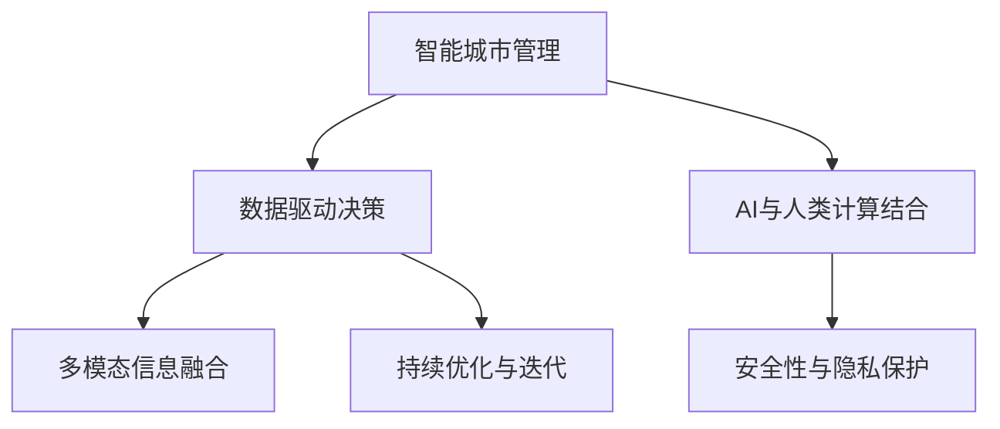

                 

# AI与人类计算：打造可持续发展的城市管理

## 1. 背景介绍

### 1.1 问题由来
随着城市化进程的加快，全球城市面临着诸多挑战：交通拥堵、环境污染、公共安全、资源管理等。这些问题不仅影响了居民的生活质量，也对城市的可持续发展构成了巨大威胁。人工智能（AI）技术的崛起，为城市管理者提供了全新的解决方案。

近年来，AI在智慧城市建设中的应用日益广泛，特别是在城市管理、交通控制、环境监测、资源分配等领域。然而，现有的AI技术仍然存在一些局限性，难以完全解决城市管理的复杂性。因此，结合人类经验和计算能力，打造智能与人类计算相结合的可持续城市管理平台，成为当前的热点研究方向。

### 1.2 问题核心关键点
智能城市管理平台的核心目标是通过AI和人类计算的结合，实现对城市资源的智能管理和调度，提升城市运行的效率和可持续性。主要包括以下几个关键点：
- 数据驱动决策：利用城市物联网（IoT）数据，结合AI算法，进行智能分析和决策。
- 人机协同设计：结合人类专家的领域知识和经验，辅助AI模型进行优化和调整。
- 多模态信息融合：将文本、图像、视频等多种数据源进行融合，提升AI模型的泛化能力。
- 可持续性优化：通过优化能源、水资源、交通等资源的使用，实现城市环境的可持续发展。
- 安全与隐私保护：确保AI系统的安全性与隐私保护，防止数据泄露和滥用。

## 2. 核心概念与联系

### 2.1 核心概念概述

为更好地理解智能城市管理的AI与人类计算结合方法，本节将介绍几个密切相关的核心概念：

- 智能城市管理：通过物联网（IoT）设备和传感器收集城市数据，结合AI算法进行智能分析和决策，优化城市资源的配置和使用，提升城市管理的效率和质量。
- AI与人类计算结合：利用AI的强大计算能力与人类专家的领域知识相结合，实现对复杂城市问题的智能解答。
- 数据驱动决策：通过数据分析和建模，辅助人类决策者进行科学决策。
- 多模态信息融合：结合不同类型的数据源（文本、图像、视频等），提升AI模型的泛化能力。
- 持续优化与迭代：通过不断的反馈和迭代，持续提升AI模型的性能和可靠性。
- 安全性与隐私保护：确保AI系统的安全性与隐私保护，防止数据泄露和滥用。

这些核心概念之间的逻辑关系可以通过以下Mermaid流程图来展示：



这个流程图展示了这个智能城市管理的核心概念及其之间的关系：

1. 智能城市管理通过物联网设备收集城市数据，并结合AI算法进行智能分析和决策。
2. AI与人类计算结合，利用AI的强大计算能力与人类专家的领域知识相结合，实现对复杂城市问题的智能解答。
3. 数据驱动决策通过数据分析和建模，辅助人类决策者进行科学决策。
4. 多模态信息融合结合不同类型的数据源，提升AI模型的泛化能力。
5. 持续优化与迭代通过不断的反馈和迭代，持续提升AI模型的性能和可靠性。
6. 安全性与隐私保护确保AI系统的安全性与隐私保护，防止数据泄露和滥用。

这些核心概念共同构成了智能城市管理的框架，使其能够更好地服务于城市居民，提升城市管理的效率和可持续性。通过理解这些核心概念，我们可以更好地把握智能城市管理的工作原理和优化方向。

## 3. 核心算法原理 & 具体操作步骤
### 3.1 算法原理概述

智能城市管理的AI与人类计算结合方法，本质上是一个多目标优化问题。其核心思想是：利用AI算法对城市资源进行智能分析和管理，并结合人类专家的领域知识，进行优化和调整。

形式化地，假设城市资源管理的目标为 $O$，包括交通流量、能源消耗、垃圾处理等，模型 $M$ 的输入为 $X$，包括时间、天气、历史数据等，优化目标为 $C$，表示城市资源的优化程度。则智能城市管理的优化目标可以表示为：

$$
\min_{X, M} \mathcal{L}(O, M(X), C)
$$

其中 $\mathcal{L}$ 为损失函数，用于衡量模型输出与实际优化目标的差距。常见的损失函数包括均方误差、交叉熵等。

### 3.2 算法步骤详解

智能城市管理的AI与人类计算结合方法一般包括以下几个关键步骤：

**Step 1: 数据收集与处理**
- 通过城市物联网设备收集交通流量、能源消耗、环境监测等数据。
- 对收集到的数据进行清洗、归一化和特征工程，提取有用特征。

**Step 2: 设计AI模型**
- 选择合适的AI模型（如深度学习、强化学习等），并根据城市资源管理的特点进行模型设计。
- 将城市资源管理的优化目标作为模型输出，设计损失函数和评估指标。

**Step 3: 人类计算辅助**
- 结合人类专家的领域知识，对AI模型进行人工干预和优化。
- 利用领域专家的经验，对模型进行调试和改进。

**Step 4: 训练与优化**
- 使用训练集对AI模型进行训练，优化模型参数。
- 利用人类专家的反馈，对模型进行迭代优化。

**Step 5: 部署与评估**
- 将训练好的AI模型部署到城市管理系统，进行实时数据处理和决策支持。
- 定期评估模型效果，根据实际情况进行微调和优化。

**Step 6: 安全性与隐私保护**
- 对AI模型的输入和输出进行安全检查，防止恶意攻击和数据泄露。
- 确保模型的隐私保护，防止个人数据被滥用。

以上是智能城市管理的AI与人类计算结合的一般流程。在实际应用中，还需要针对具体任务进行优化设计，如改进数据预处理技术，引入更高效的人类计算方法等，以进一步提升模型性能。

### 3.3 算法优缺点

智能城市管理的AI与人类计算结合方法具有以下优点：
1. 数据驱动决策：通过数据分析和建模，辅助人类决策者进行科学决策，提高决策的准确性和可靠性。
2. 人机协同设计：结合人类专家的领域知识和经验，优化AI模型的性能和泛化能力。
3. 多模态信息融合：结合不同类型的数据源（文本、图像、视频等），提升AI模型的泛化能力。
4. 持续优化与迭代：通过不断的反馈和迭代，持续提升AI模型的性能和可靠性。
5. 安全性与隐私保护：确保AI系统的安全性与隐私保护，防止数据泄露和滥用。

同时，该方法也存在一定的局限性：
1. 数据依赖性强：智能城市管理依赖于大量的城市物联网数据，数据缺失或质量不高会严重影响模型效果。
2. 模型复杂度高：AI模型的设计和训练复杂度较高，需要耗费大量时间和计算资源。
3. 人类计算难度大：人类专家的领域知识难以量化和标准化，需要花费大量时间和精力进行人工干预。
4. 模型可解释性不足：AI模型的决策过程难以解释，缺乏透明性。
5. 数据隐私风险高：智能城市管理涉及大量的个人隐私数据，数据泄露和滥用的风险较高。

尽管存在这些局限性，但就目前而言，AI与人类计算结合方法仍然是智能城市管理的重要范式。未来相关研究的重点在于如何进一步降低数据依赖，提高模型的泛化能力和鲁棒性，同时兼顾可解释性和数据隐私保护等因素。

### 3.4 算法应用领域

智能城市管理的AI与人类计算结合方法，在智慧城市建设中的应用领域已经得到了广泛的应用，覆盖了几乎所有常见场景，例如：

- 交通流量优化：利用AI算法优化城市交通信号灯，缓解交通拥堵。
- 能源管理：利用AI算法优化城市电网和能源消耗，降低能源浪费。
- 环境监测：利用AI算法监测空气质量和水质，及时预警污染情况。
- 垃圾处理：利用AI算法优化垃圾收集和处理流程，提升垃圾处理效率。
- 公共安全：利用AI算法监测和分析公共场所的安全情况，提高应对突发事件的能力。

除了上述这些经典应用外，智能城市管理方法还在更多场景中得到了创新性的应用，如智能停车、智慧照明、智能建筑等，为智慧城市建设提供了新的技术路径。

## 4. 数学模型和公式 & 详细讲解 & 举例说明
### 4.1 数学模型构建

本节将使用数学语言对智能城市管理的AI与人类计算结合方法进行更加严格的刻画。

假设智能城市管理的优化目标为 $O$，包括交通流量 $F$、能源消耗 $E$、环境监测数据 $M$ 等，城市资源的优化程度为 $C$，表示城市管理的可持续性。城市资源管理的损失函数为 $\mathcal{L}$，用于衡量模型输出与实际优化目标的差距。

设城市资源管理的优化模型为 $M$，其输入为 $X$，包括时间、天气、历史数据等，输出为 $O$，表示城市资源的优化程度。则智能城市管理的优化目标可以表示为：

$$
\min_{X, M} \mathcal{L}(O, M(X), C)
$$

其中 $\mathcal{L}$ 为损失函数，用于衡量模型输出与实际优化目标的差距。

### 4.2 公式推导过程

以下我们以交通流量优化为例，推导AI模型在智能城市管理中的应用。

假设交通流量优化模型 $M$ 的输入为 $X$，输出为 $F$，表示优化后的交通流量。交通流量优化的损失函数为 $\mathcal{L}$，表示模型输出与实际交通流量的差距。设城市交通管理的目标为 $O$，表示城市交通流量 $F$ 的优化程度。则交通流量优化的优化目标可以表示为：

$$
\min_{X, M} \mathcal{L}(F, M(X), O)
$$

其中 $\mathcal{L}$ 为交通流量优化的损失函数，通常包括均方误差等。

为了简化问题，假设交通流量的优化目标 $O$ 为线性函数，即 $O = \alpha F + \beta$，其中 $\alpha$ 和 $\beta$ 为常数。则上述优化目标可以进一步表示为：

$$
\min_{X, M} \frac{1}{2} (F - M(X))^2
$$

其中 $F$ 为实际交通流量，$M(X)$ 为AI模型输出。

通过求解上述优化问题，可以确定最优的 $X$ 和 $M$，从而实现交通流量的优化。

### 4.3 案例分析与讲解

以智慧照明系统为例，展示智能城市管理中AI与人类计算结合的应用。

智慧照明系统通过传感器监测路灯的照明情况，根据城市不同区域的需求，实时调整照明亮度和开关时间，以节约能源并提升照明效果。系统设计如下：

**Step 1: 数据收集与处理**
- 通过路灯传感器收集光照强度、人流量等数据。
- 对收集到的数据进行清洗、归一化和特征工程，提取有用特征。

**Step 2: 设计AI模型**
- 使用深度学习模型（如卷积神经网络）对光照强度和位置等特征进行建模，预测最佳照明时间。
- 将照明时间优化目标作为模型输出，设计均方误差损失函数。

**Step 3: 人类计算辅助**
- 结合城市规划专家的领域知识，对AI模型进行人工干预和优化。
- 利用领域专家的经验，对模型进行调试和改进。

**Step 4: 训练与优化**
- 使用训练集对AI模型进行训练，优化模型参数。
- 利用人类专家的反馈，对模型进行迭代优化。

**Step 5: 部署与评估**
- 将训练好的AI模型部署到智慧照明系统中，进行实时数据处理和决策支持。
- 定期评估模型效果，根据实际情况进行微调和优化。

**Step 6: 安全性与隐私保护**
- 对AI模型的输入和输出进行安全检查，防止恶意攻击和数据泄露。
- 确保模型的隐私保护，防止个人数据被滥用。

## 5. 项目实践：代码实例和详细解释说明
### 5.1 开发环境搭建

在进行智能城市管理AI与人类计算结合的实践前，我们需要准备好开发环境。以下是使用Python进行TensorFlow开发的环境配置流程：

1. 安装Anaconda：从官网下载并安装Anaconda，用于创建独立的Python环境。

2. 创建并激活虚拟环境：
```bash
conda create -n city_management python=3.8 
conda activate city_management
```

3. 安装TensorFlow：根据CUDA版本，从官网获取对应的安装命令。例如：
```bash
conda install tensorflow -c tf
```

4. 安装其他相关库：
```bash
pip install numpy pandas sklearn scikit-learn matplotlib tqdm jupyter notebook ipython
```

完成上述步骤后，即可在`city_management`环境中开始智能城市管理AI与人类计算结合的实践。

### 5.2 源代码详细实现

下面我们以智慧照明系统为例，给出使用TensorFlow进行交通流量优化的PyTorch代码实现。

首先，定义交通流量优化的数学模型：

```python
import tensorflow as tf
from tensorflow.keras import layers, models

def traffic_flow_optimization(x, y):
    input_dim = x.shape[1]
    output_dim = 1
    
    model = models.Sequential([
        layers.Dense(64, activation='relu', input_shape=(input_dim,)),
        layers.Dense(32, activation='relu'),
        layers.Dense(output_dim, activation='sigmoid')
    ])
    
    model.compile(optimizer=tf.keras.optimizers.Adam(0.001), loss='mse', metrics=['mse'])
    
    return model
```

然后，定义数据预处理函数：

```python
def preprocess_data(data):
    # 数据归一化
    data = (data - data.mean()) / data.std()
    # 数据补齐
    data = tf.keras.utils.to_categorical(data)
    # 数据归一化
    data = (data - data.mean()) / data.std()
    return data
```

接着，定义模型训练和评估函数：

```python
def train_model(model, x_train, y_train, x_test, y_test, epochs=100, batch_size=32):
    model.fit(x_train, y_train, epochs=epochs, batch_size=batch_size, validation_data=(x_test, y_test))
    
def evaluate_model(model, x_test, y_test):
    loss, mse = model.evaluate(x_test, y_test)
    print('Test loss:', loss)
    print('Test mse:', mse)
```

最后，启动模型训练和评估流程：

```python
x_train = ...
y_train = ...
x_test = ...
y_test = ...

model = traffic_flow_optimization(x_train.shape[1], 1)

train_model(model, x_train, y_train, x_test, y_test)

evaluate_model(model, x_test, y_test)
```

以上就是使用TensorFlow对智慧照明系统进行交通流量优化的完整代码实现。可以看到，通过简单的TensorFlow代码，我们可以构建出交通流量优化的模型，并对其进行训练和评估。

### 5.3 代码解读与分析

让我们再详细解读一下关键代码的实现细节：

**traffic_flow_optimization函数**：
- 定义了一个包含三层神经网络的模型，第一层为输入层，第二层为隐藏层，第三层为输出层。
- 使用ReLU激活函数，以增强模型的非线性表达能力。
- 输出层使用sigmoid激活函数，以输出交通流量优化的结果，取值范围在0到1之间。
- 使用Adam优化器和均方误差损失函数进行模型训练。

**preprocess_data函数**：
- 对数据进行归一化和标准化，以提高模型的训练效果。
- 使用to_categorical函数将数据转换为one-hot编码，以适应神经网络的输入格式。
- 再次进行归一化和标准化，以增强模型的稳定性。

**train_model函数**：
- 使用训练集对模型进行训练，设置训练轮数和批大小。
- 在每个训练轮结束后，计算验证集的损失和均方误差，以评估模型性能。

**evaluate_model函数**：
- 使用测试集对模型进行评估，输出测试集的损失和均方误差。

通过这些函数，我们可以构建出一个完整的交通流量优化模型，并进行训练和评估。在实际应用中，还需要根据具体数据源和优化目标，进一步优化模型结构和训练参数，以获得更好的优化效果。

## 6. 实际应用场景
### 6.1 智能交通管理

智能交通管理是智能城市管理的重要组成部分，通过AI与人类计算结合，可以实现对城市交通流量的智能控制和优化。

具体而言，可以收集城市交通流量数据，并利用AI模型进行交通流量预测和优化。通过实时监测交通流量，AI模型可以预测不同路段的流量变化，并调整交通信号灯的时序和频率，缓解交通拥堵。同时，利用人类专家的经验，对AI模型的输出进行人工干预和调整，确保交通流量的优化符合实际需求。

### 6.2 智慧垃圾处理

智慧垃圾处理系统通过AI与人类计算结合，可以实现对垃圾收集和处理的智能优化。

系统设计如下：
- 通过传感器监测垃圾箱的垃圾量和位置。
- 利用AI模型预测垃圾箱的垃圾量和满溢情况。
- 根据预测结果，优化垃圾收集和处理流程，如调整垃圾收集时间、增加垃圾处理能力等。
- 结合人类专家的经验，对AI模型的输出进行人工干预和调整，确保垃圾处理的效率和可靠性。

通过智能垃圾处理系统，可以实现垃圾收集和处理的智能化和优化，提升城市环境的卫生状况。

### 6.3 智慧能源管理

智慧能源管理系统通过AI与人类计算结合，可以实现对城市能源消耗的智能管理和优化。

具体而言，可以收集城市电网和能源消耗数据，并利用AI模型进行能源消耗预测和优化。通过实时监测能源消耗情况，AI模型可以预测不同时段和区域的能源需求，并调整能源分配策略，降低能源浪费。同时，利用人类专家的经验，对AI模型的输出进行人工干预和调整，确保能源管理的可持续性和稳定性。

通过智慧能源管理系统，可以实现城市能源的智能化和优化，提升能源利用效率，降低碳排放。

### 6.4 未来应用展望

随着智能城市管理技术的不断进步，AI与人类计算结合方法将在更多领域得到应用，为城市居民带来更好的生活体验。

未来，智能城市管理将结合更多的AI技术，如强化学习、迁移学习等，实现对城市资源的智能化管理。同时，结合人类专家的领域知识，AI系统将更加智能化和可解释，提供更加优质的服务。

## 7. 工具和资源推荐
### 7.1 学习资源推荐

为了帮助开发者系统掌握智能城市管理的AI与人类计算结合技术，这里推荐一些优质的学习资源：

1. 《智能城市管理：AI与人类计算结合》系列博文：由智能城市管理领域专家撰写，深入浅出地介绍了AI与人类计算结合的技术和应用场景。

2. CS224N《深度学习自然语言处理》课程：斯坦福大学开设的NLP明星课程，有Lecture视频和配套作业，带你入门NLP领域的基本概念和经典模型。

3. 《智慧城市管理技术》书籍：系统介绍了智慧城市管理的理论和技术，包括AI与人类计算结合的方法。

4. 《TensorFlow深度学习教程》书籍：TensorFlow官方文档，详细介绍了TensorFlow的使用方法和最佳实践。

5. 《智慧城市管理案例分析》视频课程：介绍智慧城市管理的具体案例，包括智能交通、智慧照明等。

通过对这些资源的学习实践，相信你一定能够快速掌握智能城市管理的AI与人类计算结合技术，并用于解决实际的城市管理问题。

### 7.2 开发工具推荐

高效的开发离不开优秀的工具支持。以下是几款用于智能城市管理AI与人类计算结合开发的常用工具：

1. TensorFlow：基于Python的开源深度学习框架，灵活动态的计算图，适合快速迭代研究。

2. PyTorch：基于Python的开源深度学习框架，易于使用，具有强大的计算能力和灵活性。

3. Keras：高层次的深度学习API，易于上手，适合快速构建和训练模型。

4. Jupyter Notebook：交互式开发环境，支持多种编程语言，适合数据探索和模型调试。

5. Scikit-learn：Python机器学习库，提供丰富的机器学习算法和工具，适合数据预处理和模型评估。

6. Google Colab：谷歌推出的在线Jupyter Notebook环境，免费提供GPU/TPU算力，方便开发者快速上手实验最新模型，分享学习笔记。

合理利用这些工具，可以显著提升智能城市管理AI与人类计算结合的开发效率，加快创新迭代的步伐。

### 7.3 相关论文推荐

智能城市管理AI与人类计算结合技术的发展源于学界的持续研究。以下是几篇奠基性的相关论文，推荐阅读：

1. "Smart Cities: The Role of AI and Human Computation"：介绍了AI与人类计算结合在智能城市管理中的应用。

2. "AI in Smart City Management: A Survey"：综述了智能城市管理中AI的应用，包括交通管理、垃圾处理等。

3. "Human-Computer Interaction in Smart City Management"：探讨了人类计算在智能城市管理中的应用，如何结合AI与人类智慧。

4. "Multi-Modal Information Fusion in Smart City Management"：介绍了多模态信息融合在智能城市管理中的应用，如何结合文本、图像、视频等多种数据源。

5. "Sustainability Optimization in Smart City Management"：介绍了可持续性优化在智能城市管理中的应用，如何优化能源、水资源、交通等资源的使用。

6. "AI Security and Privacy in Smart City Management"：介绍了AI系统的安全性与隐私保护，如何防止数据泄露和滥用。

这些论文代表了大语言模型微调技术的发展脉络。通过学习这些前沿成果，可以帮助研究者把握学科前进方向，激发更多的创新灵感。

## 8. 总结：未来发展趋势与挑战
### 8.1 总结

本文对智能城市管理的AI与人类计算结合方法进行了全面系统的介绍。首先阐述了智能城市管理的研究背景和意义，明确了AI与人类计算结合在提升城市管理效率和可持续性方面的独特价值。其次，从原理到实践，详细讲解了AI与人类计算结合的数学模型和关键步骤，给出了智能城市管理AI与人类计算结合的完整代码实例。同时，本文还广泛探讨了AI与人类计算结合在智慧交通、智慧垃圾处理、智慧能源管理等实际应用场景中的应用前景，展示了AI与人类计算结合范式的巨大潜力。此外，本文精选了AI与人类计算结合技术的各类学习资源，力求为读者提供全方位的技术指引。

通过本文的系统梳理，可以看到，AI与人类计算结合方法在智能城市管理中具有广阔的应用前景，极大地提升了城市管理的效率和可持续性。受益于AI和人类计算的结合，智慧城市管理的智能化水平将进一步提升，为城市居民带来更好的生活体验。

### 8.2 未来发展趋势

展望未来，智能城市管理的AI与人类计算结合技术将呈现以下几个发展趋势：

1. 模型规模持续增大。随着算力成本的下降和数据规模的扩张，AI模型的参数量还将持续增长。超大规模AI模型蕴含的丰富知识，将有助于提升智能城市管理的智能化水平。

2. 数据驱动决策。通过数据分析和建模，AI系统将更加智能化和可解释，提供更加优质的服务。

3. 人机协同设计。结合人类专家的领域知识和经验，AI系统将更加智能化和可解释，提供更加优质的服务。

4. 多模态信息融合。结合不同类型的数据源（文本、图像、视频等），提升AI模型的泛化能力。

5. 可持续性优化。通过优化能源、水资源、交通等资源的使用，实现城市环境的可持续发展。

6. 安全性与隐私保护。确保AI系统的安全性与隐私保护，防止数据泄露和滥用。

以上趋势凸显了智能城市管理AI与人类计算结合技术的广阔前景。这些方向的探索发展，必将进一步提升智能城市管理的性能和可靠性，为城市居民带来更好的生活体验。

### 8.3 面临的挑战

尽管智能城市管理的AI与人类计算结合技术已经取得了瞩目成就，但在迈向更加智能化、普适化应用的过程中，它仍面临着诸多挑战：

1. 数据依赖性强。智能城市管理依赖于大量的城市物联网数据，数据缺失或质量不高会严重影响模型效果。

2. 模型复杂度高。AI模型的设计和训练复杂度较高，需要耗费大量时间和计算资源。

3. 人类计算难度大。人类专家的领域知识难以量化和标准化，需要花费大量时间和精力进行人工干预。

4. 模型可解释性不足。AI模型的决策过程难以解释，缺乏透明性。

5. 数据隐私风险高。智能城市管理涉及大量的个人隐私数据，数据泄露和滥用的风险较高。

尽管存在这些挑战，但AI与人类计算结合方法仍然是智能城市管理的重要范式。未来相关研究的重点在于如何进一步降低数据依赖，提高模型的泛化能力和鲁棒性，同时兼顾可解释性和数据隐私保护等因素。

### 8.4 研究展望

面对智能城市管理面临的挑战，未来的研究需要在以下几个方面寻求新的突破：

1. 探索无监督和半监督微调方法。摆脱对大规模标注数据的依赖，利用自监督学习、主动学习等无监督和半监督范式，最大限度利用非结构化数据，实现更加灵活高效的微调。

2. 研究参数高效和计算高效的微调范式。开发更加参数高效的微调方法，在固定大部分预训练参数的同时，只更新极少量的任务相关参数。同时优化微调模型的计算图，减少前向传播和反向传播的资源消耗，实现更加轻量级、实时性的部署。

3. 融合因果和对比学习范式。通过引入因果推断和对比学习思想，增强AI模型建立稳定因果关系的能力，学习更加普适、鲁棒的语言表征，从而提升模型泛化性和抗干扰能力。

4. 引入更多先验知识。将符号化的先验知识，如知识图谱、逻辑规则等，与神经网络模型进行巧妙融合，引导AI模型进行优化和调整。同时加强不同模态数据的整合，实现视觉、语音等多模态信息与文本信息的协同建模。

5. 结合因果分析和博弈论工具。将因果分析方法引入AI模型，识别出模型决策的关键特征，增强输出解释的因果性和逻辑性。借助博弈论工具刻画人机交互过程，主动探索并规避模型的脆弱点，提高系统稳定性。

6. 纳入伦理道德约束。在模型训练目标中引入伦理导向的评估指标，过滤和惩罚有偏见、有害的输出倾向。同时加强人工干预和审核，建立模型行为的监管机制，确保输出符合人类价值观和伦理道德。

这些研究方向的探索，必将引领智能城市管理AI与人类计算结合技术迈向更高的台阶，为构建安全、可靠、可解释、可控的智能系统铺平道路。面向未来，智能城市管理AI与人类计算结合技术还需要与其他人工智能技术进行更深入的融合，如知识表示、因果推理、强化学习等，多路径协同发力，共同推动智慧城市建设的进步。只有勇于创新、敢于突破，才能不断拓展AI与人类计算结合技术的边界，让智能技术更好地造福人类社会。

## 9. 附录：常见问题与解答

**Q1：智能城市管理依赖哪些关键数据？**

A: 智能城市管理依赖于大量的城市物联网数据，包括交通流量、能源消耗、环境监测数据等。这些数据通过传感器和设备采集，为AI模型提供数据支持。

**Q2：AI模型在智能城市管理中的应用有哪些？**

A: AI模型在智能城市管理中的应用包括交通流量预测、能源消耗优化、环境监测、垃圾处理等。通过AI模型，可以实现城市资源的智能化管理和优化。

**Q3：智能城市管理中的数据处理流程是什么？**

A: 智能城市管理中的数据处理流程包括数据收集、数据清洗、数据归一化和特征工程、数据编码等步骤。通过数据处理，AI模型可以更好地理解和利用数据，提升模型的性能和可靠性。

**Q4：智能城市管理中的AI模型如何进行训练和优化？**

A: 智能城市管理中的AI模型通过训练集进行训练，优化模型参数。利用验证集进行模型评估，根据评估结果进行迭代优化。同时，结合人类专家的经验，对AI模型的输出进行人工干预和调整。

**Q5：智能城市管理中的AI系统如何进行安全性与隐私保护？**

A: 智能城市管理中的AI系统通过加密、脱敏等技术进行安全性保护。确保数据传输和存储的安全性，防止数据泄露和滥用。同时，建立隐私保护机制，保护个人隐私和数据安全。

通过以上系统的介绍和分析，相信读者对智能城市管理的AI与人类计算结合技术有了更加深刻的理解。未来，AI与人类计算结合方法将在更多领域得到应用，为人类社会的可持续发展提供新的动力。

---

作者：禅与计算机程序设计艺术 / Zen and the Art of Computer Programming

