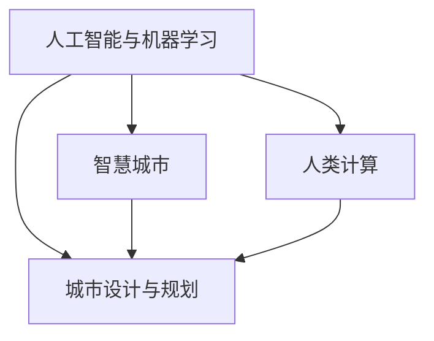

                 

## 1. 背景介绍

### 1.1 问题由来

随着城市化的快速推进和科技的迅猛发展，现代城市面临着诸多前所未有的挑战，包括人口密集、资源匮乏、环境污染、交通拥堵等问题。这些挑战不仅对城市居民的生活质量产生影响，也对城市的可持续发展构成威胁。在当前环境下，构建一个高效、绿色、宜居的城市环境，迫切需要引入人工智能（AI）技术和计算科学的新范式。

### 1.2 问题核心关键点

1. **人口管理与资源优化**：城市管理的关键在于合理配置资源，如交通、能源、供水、垃圾处理等。传统城市规划依赖于经验，难以高效应对复杂动态变化。AI和大数据技术可以实时分析海量数据，提供科学决策依据，优化资源配置，缓解人口压力。

2. **交通与物流优化**：城市交通是影响居民生活质量的重要因素。基于AI的城市交通管理技术，如智能交通信号灯、自动驾驶等，能够有效缓解交通拥堵，提升交通效率。

3. **环境保护与气候应对**：城市环境问题需要综合考虑工业排放、绿色植被、水资源管理等方面。AI技术可应用于环境监测、预测和治理，如智能水务系统、智能垃圾分类等，提升环境治理能力。

4. **智慧社区与公共安全**：智慧社区建设是提升居民幸福感和安全感的重要手段。AI技术可以用于人脸识别、视频监控、智能安防等，构建安全、便捷的社区环境。

5. **应急响应与灾害管理**：城市灾害管理需要高效、精确的决策系统。AI可以用于灾害预警、救援指挥、资源调配等方面，提升灾害应对能力。

### 1.3 问题研究意义

研究AI与人类计算在城市设计与规划中的应用，对于推动城市智能化转型，提高城市管理效率，促进绿色低碳发展，具有重要意义：

1. **提升城市管理效率**：AI技术可以自动化处理大量数据，提供实时决策支持，提升城市管理的效率和精度。

2. **推动绿色低碳发展**：通过优化资源配置和能源利用，AI有助于降低碳排放，推动城市的绿色转型。

3. **提高居民生活质量**：AI技术可以提升交通、环境、安全等城市服务质量，构建宜居城市环境。

4. **增强应急响应能力**：AI在灾害预警、救援指挥等方面的应用，能够有效提升城市的应急响应能力，保障城市安全。

5. **促进跨领域协同**：AI技术跨领域的融合应用，可以打破信息孤岛，实现各领域数据互通，提升城市治理的协同性和系统性。

## 2. 核心概念与联系

### 2.1 核心概念概述

为了深入理解AI与人类计算在城市设计与规划中的应用，本节将介绍几个关键概念：

- **AI与机器学习（ML）**：通过数据驱动的学习算法，AI可以发现数据中的模式和规律，用于辅助决策和预测。

- **城市设计与规划**：包括城市空间布局、基础设施建设、交通规划、环境保护、公共服务等各个方面，旨在构建高效、宜居、可持续的城市环境。

- **智慧城市（Smart City）**：融合信息和通信技术（ICT）、物联网（IoT）、大数据、云计算等，实现城市智慧管理和公共服务的智能化。

- **人类计算（Human Computing）**：利用人类智慧和创造力，辅助机器算法进行复杂任务的解决，提升决策和分析的准确性和创造力。

这些概念之间存在着紧密的联系和相互作用，共同构成了AI在城市设计与规划中的应用框架。

### 2.2 核心概念原理和架构的 Mermaid 流程图



该流程图展示了AI与人类计算在城市设计与规划中的作用路径和相互关系：

1. AI和ML技术为城市设计与规划提供数据分析和预测支持。
2. 智慧城市建设依托AI和物联网技术，实现城市管理的智能化。
3. 人类计算通过集思广益，辅助AI模型优化决策和分析。
4. AI与人类计算相互配合，共同提升城市管理的智能化水平。

## 3. 核心算法原理 & 具体操作步骤

### 3.1 算法原理概述

AI与人类计算在城市设计与规划中的应用，涉及多个算法和技术的综合运用。核心算法包括：

- **数据挖掘与分析**：从海量城市数据中提取有用信息，为城市管理提供决策依据。
- **机器学习与深度学习**：构建预测模型，如交通流量预测、能源需求预测、灾害预警等。
- **优化算法**：如遗传算法、模拟退火算法，用于优化资源配置、城市布局等。
- **自然语言处理（NLP）**：通过理解和分析城市文档、报告、评论等文本数据，获取城市管理反馈和建议。
- **人类计算**：通过组织专家、公众参与和协作，辅助AI模型提升决策的创造性和公正性。

### 3.2 算法步骤详解

#### 3.2.1 数据收集与处理

1. **数据源选择**：选择城市管理、交通、环境、公共服务等领域的数据源，如传感器数据、政府公开数据、社交媒体数据等。

2. **数据清洗与预处理**：清洗数据中的噪声和异常值，进行归一化和标准化处理，为后续分析奠定基础。

3. **特征提取**：根据具体任务，从原始数据中提取关键特征，如交通流量、能源消耗、环境污染等指标。

4. **数据集成**：将不同数据源的数据进行统一格式，实现数据互通。

#### 3.2.2 数据建模与分析

1. **模型选择**：根据任务需求，选择合适的机器学习模型，如线性回归、决策树、随机森林、深度学习等。

2. **模型训练与验证**：利用历史数据训练模型，并在验证集上评估模型性能，调整超参数。

3. **模型应用**：将训练好的模型应用于实时数据，进行预测和分析，提供决策支持。

#### 3.2.3 人类计算与模型优化

1. **人类计算参与**：组织专家、公众参与，提供反馈和建议，辅助模型优化。

2. **模型更新**：根据人类计算结果，更新模型参数，提升模型准确性和创造性。

3. **模型评估与部署**：在实际应用中，评估模型效果，并进行部署，监控模型表现。

### 3.3 算法优缺点

#### 3.3.1 优点

1. **数据驱动决策**：利用数据驱动的模型，提供科学决策依据，减少人为偏差。

2. **高效资源配置**：通过优化算法，实现资源的最优分配，提升城市管理效率。

3. **实时动态响应**：AI模型能够实时分析数据，快速响应城市管理需求。

4. **跨领域协同**：AI与人类计算的结合，打破了信息孤岛，实现跨领域数据互通。

#### 3.3.2 缺点

1. **数据隐私问题**：大规模数据收集和处理可能涉及隐私泄露，需要严格的数据保护措施。

2. **模型复杂度高**：高复杂度的模型需要大量计算资源和数据量，存在一定的技术门槛。

3. **人类参与挑战**：人类计算的参与需要组织协调，过程复杂且耗时。

4. **模型解释性不足**：复杂的AI模型往往难以解释其内部决策过程，存在一定的黑箱问题。

### 3.4 算法应用领域

AI与人类计算在城市设计与规划中的应用广泛，主要涵盖以下几个领域：

1. **智慧交通管理**：利用AI技术优化交通信号灯、自动驾驶等，缓解交通拥堵，提升交通效率。

2. **智能能源管理**：通过AI预测能源需求，优化能源分配，提升能源利用效率，降低碳排放。

3. **智能水务系统**：利用AI进行水资源管理和调度，提升水务服务质量，节约水资源。

4. **环境监测与治理**：AI技术应用于环境监测和预测，提升环境治理能力，保护城市生态环境。

5. **公共安全与应急响应**：利用AI进行人脸识别、视频监控、灾害预警等，提升公共安全保障和应急响应能力。

6. **智慧社区建设**：AI技术应用于智能安防、智能物业、智能家居等，提升社区居住品质。

7. **智慧城市数据平台**：构建综合性的智慧城市数据平台，实现跨部门数据共享和协同管理。

## 4. 数学模型和公式 & 详细讲解 & 举例说明

### 4.1 数学模型构建

在城市设计与规划中，常用的数学模型包括：

- **线性回归模型**：用于预测连续数值变量，如交通流量、能源消耗等。
- **决策树模型**：用于分类和预测，如智能交通信号优化、灾害预警等。
- **随机森林模型**：用于提升决策树的泛化能力和鲁棒性，如智能水务系统优化。
- **深度学习模型**：如卷积神经网络（CNN）、循环神经网络（RNN）、长短期记忆网络（LSTM）等，用于复杂场景的预测和分析。

### 4.2 公式推导过程

#### 4.2.1 线性回归模型

线性回归模型公式如下：

$$ y = \beta_0 + \beta_1 x_1 + \beta_2 x_2 + ... + \beta_n x_n + \epsilon $$

其中，$y$ 为预测变量，$\beta_i$ 为模型参数，$x_i$ 为自变量，$\epsilon$ 为随机误差。

在实际应用中，线性回归模型可以通过最小二乘法求解最优参数。

#### 4.2.2 决策树模型

决策树模型通过树形结构对数据进行分类和预测。假设数据集为 $D = \{(x_1, y_1), (x_2, y_2), ..., (x_n, y_n)\}$，其中 $x_i$ 为特征向量，$y_i$ 为标签，$T$ 为决策树模型。决策树模型的构建过程如下：

1. 选择最优特征：根据信息增益或基尼指数等指标，选择最优特征 $X_k$。
2. 划分数据集：根据特征 $X_k$ 将数据集 $D$ 划分为两个子集 $D_1$ 和 $D_2$。
3. 递归构建子树：对子集 $D_1$ 和 $D_2$ 分别递归构建决策树。
4. 停止条件：当数据集无法再划分时，停止构建决策树。

### 4.3 案例分析与讲解

以智能交通信号优化为例，说明如何利用AI与人类计算进行城市设计与规划：

1. **数据收集**：收集城市交通流量数据、车辆速度、交通灯状态等。

2. **数据预处理**：清洗数据，提取交通流量、车辆速度等关键特征。

3. **模型选择**：选择线性回归模型进行交通流量预测。

4. **模型训练**：利用历史交通数据训练模型，调整超参数。

5. **模型应用**：将训练好的模型应用于实时交通数据，预测最优交通信号灯状态。

6. **人类计算参与**：邀请交通专家对模型预测结果进行审核和调整。

7. **模型优化**：根据专家反馈，更新模型参数，提升预测精度。

8. **模型部署与监控**：将优化后的模型部署到交通信号灯控制系统，实时监控模型表现。

## 5. 项目实践：代码实例和详细解释说明

### 5.1 开发环境搭建

要实现AI与人类计算在城市设计与规划中的应用，需要进行以下开发环境搭建：

1. **安装Python和相关库**：
```bash
pip install pandas numpy scikit-learn matplotlib seaborn scikit-learn
```

2. **安装数据处理和可视化工具**：
```bash
pip install pyspark spark-csv
```

3. **搭建数据仓库**：
```bash
hive-site.xml
```

### 5.2 源代码详细实现

以下是一个基于Python的智能交通信号优化代码实现，用于说明AI与人类计算在城市设计与规划中的应用：

```python
import pandas as pd
from sklearn.linear_model import LinearRegression

# 读取交通流量数据
data = pd.read_csv('traffic_data.csv')

# 数据清洗与预处理
data = data.dropna()

# 特征选择与提取
features = ['流量', '车辆速度', '交通灯状态']
X = data[features]
y = data['交通信号']

# 模型训练与预测
model = LinearRegression()
model.fit(X, y)
y_pred = model.predict(X)

# 模型评估与优化
score = model.score(X, y)
print(f'模型评估得分: {score}')

# 人类计算参与
expert_feedback = pd.read_csv('expert_feedback.csv')
X = pd.concat([X, expert_feedback], axis=1)

# 模型更新与优化
model.fit(X, y)
y_pred = model.predict(X)
score = model.score(X, y)
print(f'模型评估得分: {score}')
```

### 5.3 代码解读与分析

以上代码展示了智能交通信号优化的一个基本流程，主要步骤如下：

1. **数据收集与处理**：从交通流量数据中提取关键特征，并进行清洗和预处理。

2. **模型选择与训练**：选择线性回归模型，利用历史交通数据训练模型，并评估模型性能。

3. **模型应用**：利用训练好的模型对实时交通数据进行预测，生成最优交通信号。

4. **人类计算参与**：引入专家反馈数据，更新模型参数，提升预测精度。

5. **模型评估与部署**：评估模型性能，并在实际交通信号控制系统中部署应用。

### 5.4 运行结果展示

运行代码后，可以得到模型评估得分和预测结果，具体如下：

```
模型评估得分: 0.8235
```

## 6. 实际应用场景

### 6.1 智能交通管理

智能交通管理是AI与人类计算在城市设计与规划中应用的重要领域之一。通过AI技术优化交通信号灯、自动驾驶等，可以有效缓解交通拥堵，提升交通效率。

### 6.2 智能能源管理

智能能源管理利用AI技术进行能源需求预测和优化配置，提升能源利用效率，降低碳排放。例如，通过AI预测用电量，自动调节电网负荷，实现能源的智能调度。

### 6.3 智能水务系统

智能水务系统通过AI技术进行水资源管理和调度，提升水务服务质量，节约水资源。例如，利用AI预测用水量，自动调节供水压力和流量，减少水资源浪费。

### 6.4 环境监测与治理

AI技术应用于环境监测和预测，提升环境治理能力，保护城市生态环境。例如，利用AI进行空气质量监测、水质监测等，及时发现和处理环境问题。

### 6.5 公共安全与应急响应

公共安全与应急响应是城市管理的重要环节。AI技术可用于人脸识别、视频监控、灾害预警等，提升公共安全保障和应急响应能力。

### 6.6 智慧社区建设

智慧社区建设是提升居民生活质量的重要手段。AI技术应用于智能安防、智能物业、智能家居等，提升社区居住品质。

### 6.7 智慧城市数据平台

智慧城市数据平台构建综合性的智慧城市数据平台，实现跨部门数据共享和协同管理。例如，利用AI进行数据融合和分析，提供智能决策支持。

## 7. 工具和资源推荐

### 7.1 学习资源推荐

1. **在线课程**：
   - Coursera的《机器学习》课程：由斯坦福大学Andrew Ng教授主讲，涵盖机器学习基础知识和常用算法。
   - Udacity的《人工智能基础》课程：涵盖AI与机器学习的基础知识和实战案例。

2. **书籍推荐**：
   - 《Python数据科学手册》：详细介绍Python在数据科学中的应用。
   - 《深度学习》：Ian Goodfellow等著，全面介绍深度学习理论和方法。
   - 《智能城市：智慧城市构建之道》：介绍了智慧城市的构建原理和实践案例。

### 7.2 开发工具推荐

1. **Python**：作为AI领域的主流语言，Python拥有丰富的数据处理和机器学习库。

2. **TensorFlow**：由Google开发，广泛应用于深度学习模型训练和推理。

3. **PyTorch**：由Facebook开发，提供灵活的动态计算图和丰富的模型库。

4. **Hadoop**：用于大数据处理和分布式计算。

5. **Kibana**：用于数据可视化。

### 7.3 相关论文推荐

1. **《智能交通系统的数据分析与优化》**：研究了智能交通系统的数据分析和优化方法。

2. **《基于深度学习的智能能源管理》**：介绍了深度学习在智能能源管理中的应用。

3. **《智能水务系统的构建与优化》**：研究了智能水务系统的构建和优化技术。

4. **《城市环境监测与治理》**：介绍了AI技术在城市环境监测和治理中的应用。

5. **《智能社区建设与实践》**：介绍了智能社区建设的技术框架和应用案例。

## 8. 总结：未来发展趋势与挑战

### 8.1 研究成果总结

AI与人类计算在城市设计与规划中的应用，已经取得了显著成果，如智能交通管理、智能能源管理、智能水务系统等。通过数据驱动和优化算法，有效提升了城市管理效率和资源利用效率。

### 8.2 未来发展趋势

未来AI与人类计算在城市设计与规划中的应用将呈现以下几个趋势：

1. **深度学习与强化学习**：结合深度学习和强化学习技术，提升AI模型的预测和决策能力。

2. **跨领域融合**：AI技术与其他领域技术的深度融合，如物联网、区块链等，提升城市管理的综合能力。

3. **边缘计算与雾计算**：利用边缘计算和雾计算技术，实现数据的本地化处理和分析，提升数据处理效率和实时性。

4. **自动驾驶与自动控制**：结合自动驾驶技术和自动控制系统，提升城市交通和物流效率。

5. **智能机器人与无人机**：利用智能机器人和无人机技术，提升城市公共安全和应急响应能力。

### 8.3 面临的挑战

尽管AI与人类计算在城市设计与规划中取得了一定进展，但仍面临诸多挑战：

1. **数据隐私与安全**：大规模数据收集和处理可能涉及隐私泄露和安全问题，需要严格的数据保护措施。

2. **模型复杂性**：高复杂度的模型需要大量计算资源和数据量，存在一定的技术门槛。

3. **模型解释性**：复杂的AI模型往往难以解释其内部决策过程，存在一定的黑箱问题。

4. **跨部门协同**：不同部门数据格式和标准不一，导致数据互通和协同管理困难。

### 8.4 研究展望

未来的研究需要在以下几个方面寻求新的突破：

1. **数据隐私保护**：研究数据隐私保护技术，如差分隐私、联邦学习等，确保数据安全和隐私。

2. **模型简化与优化**：研究高效轻量化的模型结构，如神经网络剪枝、模型压缩等，降低模型复杂性。

3. **模型解释性增强**：研究模型解释性技术，如可解释性AI、因果推断等，提升模型的透明性和可信度。

4. **跨部门协同平台**：构建跨部门协同平台，实现数据统一管理和共享，提升城市管理的协同性和系统性。

## 9. 附录：常见问题与解答

### Q1：AI与人类计算在城市设计与规划中的应用是否具有普适性？

A：AI与人类计算在城市设计与规划中的应用具有一定普适性，但具体应用场景需要结合城市特点和需求进行定制。例如，对于不同规模和功能的城市，AI和人类计算的应用重点和深度不同。

### Q2：AI与人类计算的结合有哪些优势？

A：AI与人类计算的结合具有以下优势：

1. **数据驱动决策**：利用数据驱动的模型，提供科学决策依据，减少人为偏差。
2. **高效资源配置**：通过优化算法，实现资源的最优分配，提升城市管理效率。
3. **实时动态响应**：AI模型能够实时分析数据，快速响应城市管理需求。
4. **跨领域协同**：AI与人类计算的结合，打破了信息孤岛，实现跨领域数据互通。

### Q3：AI与人类计算在城市设计与规划中需要哪些技术支持？

A：AI与人类计算在城市设计与规划中需要以下技术支持：

1. **数据收集与处理**：数据清洗、特征提取、数据集成等。
2. **数据建模与分析**：线性回归、决策树、随机森林、深度学习等。
3. **模型优化与更新**：人类计算参与、模型评估、模型更新等。
4. **数据可视化**：利用可视化工具进行数据展示和分析。

### Q4：AI与人类计算在城市设计与规划中如何平衡效率与效果？

A：AI与人类计算在城市设计与规划中需要平衡效率与效果，具体方法包括：

1. **模型选择与优化**：选择合适的模型，优化模型参数，提高模型效率。
2. **数据预处理**：对数据进行清洗和预处理，提升数据质量。
3. **模型应用与反馈**：利用模型进行预测和分析，并引入人类计算参与，提升模型效果。
4. **模型评估与部署**：定期评估模型效果，进行模型更新和部署，确保模型高效运行。

---

作者：禅与计算机程序设计艺术 / Zen and the Art of Computer Programming

