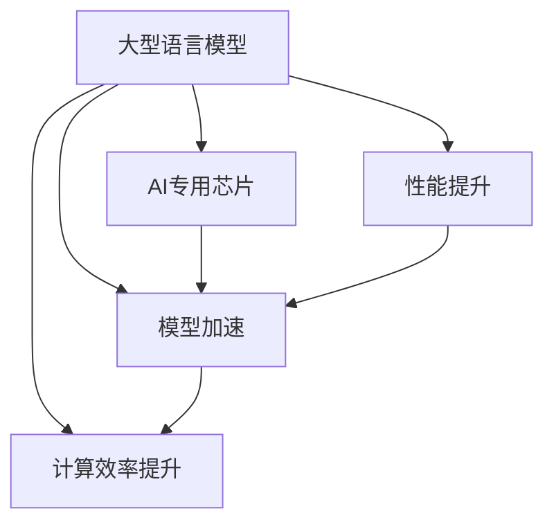

                 

# AI专用芯片：驱动LLM性能提升

> 关键词：人工智能专用芯片, 大型语言模型, 计算效率, 性能提升, 硬件优化, 模型加速

## 1. 背景介绍

在人工智能领域，特别是自然语言处理（NLP）方面，大型语言模型（LLMs）已经成为一种新的主流技术。这些模型，如GPT-3、BERT等，由于其庞大的参数量和复杂的计算需求，对计算资源提出了极高的要求。然而，尽管CPU和GPU在处理通用任务上表现出色，但对于特定的深度学习模型，其计算效率和性能仍有提升空间。这就需要AI专用芯片（ASIC）的介入。

AI专用芯片，顾名思义，是为特定的人工智能应用设计的高效硬件加速器。通过优化数据流动、控制逻辑和计算单元，ASIC可以大幅提升计算效率，降低能耗，并在特定场景中发挥出远超通用芯片的性能优势。本文将介绍AI专用芯片如何驱动大型语言模型的性能提升，以及未来的发展趋势和面临的挑战。

## 2. 核心概念与联系

### 2.1 核心概念概述

为了更好地理解AI专用芯片在大型语言模型性能提升中的作用，我们需要了解几个关键概念：

- **大型语言模型（LLMs）**：指通过自监督学习在大规模无标签文本数据上预训练得到的模型。这些模型具备强大的自然语言处理能力，广泛应用于文本生成、翻译、问答等任务。

- **AI专用芯片（ASIC）**：专为人工智能应用设计的高性能硬件加速器。ASIC通过优化数据流动、控制逻辑和计算单元，大幅提升AI任务的计算效率，降低能耗。

- **模型加速**：通过硬件加速技术，将深度学习模型的计算过程转移到ASIC芯片上，从而加速模型的推理和训练过程。

- **计算效率**：指硬件在执行特定任务时的计算速度，通常用每秒执行的浮点运算次数（FLOPS）来衡量。

- **性能提升**：通过硬件优化和算法改进，使AI模型在计算速度、能耗、精度等方面得到显著提高。

这些核心概念通过以下Mermaid流程图来展示它们之间的联系：



## 3. 核心算法原理 & 具体操作步骤

### 3.1 算法原理概述

AI专用芯片的计算原理主要基于硬件并行性和流水线化，通过大规模的向量/矩阵运算和高度优化的控制逻辑，实现对深度学习模型的加速。这种硬件加速方式的优势在于：

1. **高并行性**：ASIC芯片可以并行执行大量浮点运算，大大缩短模型计算时间。
2. **低延迟**：ASIC芯片的计算单元和存储单元直接相连，减少了数据在芯片和内存之间的传输延迟。
3. **高能效比**：ASIC芯片通过精细的工艺设计和能效管理，可以在保证性能的同时，降低能耗。

大型语言模型的计算过程主要涉及大量的矩阵乘法和激活函数计算，这些操作天然适合在ASIC芯片上并行加速。通过将模型的前向和反向传播过程转移到ASIC芯片上，可以显著提升计算效率，降低延迟，从而加速模型的推理和训练。

### 3.2 算法步骤详解

以下是使用AI专用芯片进行大型语言模型加速的一般步骤：

**Step 1: 选择合适的ASIC芯片**

- 评估目标模型的计算需求，选择合适的ASIC芯片。根据模型参数量、计算复杂度等因素，选择能够高效处理这些计算的芯片。

**Step 2: 模型适配与优化**

- 将模型适配到ASIC芯片的计算架构上。这可能包括数据格式转换、计算图优化等步骤。
- 对模型进行优化，例如剪枝、量化、融合等操作，减少芯片计算量，提高效率。

**Step 3: 编写优化代码**

- 使用ASIC芯片的SDK或API，编写优化后的模型代码。这一步可能需要与芯片厂商紧密合作，了解芯片的具体接口和优化技巧。
- 对代码进行性能调优，确保其在ASIC芯片上能够高效运行。

**Step 4: 测试与验证**

- 在ASIC芯片上对模型进行测试，评估其性能表现。
- 根据测试结果进行微调，直至达到理想的性能指标。

**Step 5: 部署与集成**

- 将模型部署到实际应用中，或与现有系统集成。
- 持续监控模型的运行状态，确保其在实际环境中能够稳定运行。

### 3.3 算法优缺点

使用AI专用芯片进行大型语言模型加速有以下优点：

1. **高性能**：ASIC芯片通过高度优化的硬件设计，能够显著提升模型的计算效率，加速推理和训练过程。
2. **低能耗**：ASIC芯片通过精细的能效管理，可以在保证性能的同时，大幅降低能耗。
3. **高稳定性**：ASIC芯片的计算单元和存储单元直接相连，减少了数据传输延迟，提高了系统稳定性。
4. **可扩展性**：ASIC芯片可以通过堆叠、互联等技术实现大规模并行计算，适合处理大规模数据集。

同时，使用ASIC芯片也存在以下缺点：

1. **高开发成本**：开发和优化ASIC芯片需要大量的时间和资源，且存在较高的开发风险。
2. **兼容性问题**：ASIC芯片通常是针对特定应用设计的，可能与其他硬件系统存在兼容性问题。
3. **灵活性不足**：ASIC芯片的计算架构和性能特性难以灵活调整，适用于特定场景。

### 3.4 算法应用领域

AI专用芯片在大型语言模型的应用领域广泛，主要包括以下几个方面：

- **自然语言处理（NLP）**：包括文本分类、情感分析、机器翻译、问答系统等。
- **计算机视觉（CV）**：如图像识别、物体检测、人脸识别等。
- **语音处理**：如语音识别、语音合成、情感识别等。
- **推荐系统**：如个性化推荐、用户行为分析等。
- **自动驾驶**：如环境感知、决策制定等。

## 4. 数学模型和公式 & 详细讲解 & 举例说明

### 4.1 数学模型构建

为了更深入地理解模型加速的原理，我们通过一个简单的数学模型来阐述：

设大型语言模型 $M_{\theta}$ 的参数为 $\theta$，计算矩阵为 $A$，向量为 $b$，激活函数为 $f$。模型的前向传播计算为：

$$
M_{\theta}(x) = f(Ax + b)
$$

其中 $x$ 为输入数据。

### 4.2 公式推导过程

在ASIC芯片上，模型的前向传播计算可以并行化执行，通过使用高效的向量-矩阵乘法（VMM）和矩阵-矩阵乘法（MMM）操作，加速模型计算。假设ASIC芯片的计算单元数量为 $N$，则前向传播的并行计算可以表示为：

$$
M_{\theta}^{ASIC}(x) = f\left(\frac{1}{N}\sum_{i=1}^N Ax_i + b\right)
$$

其中 $x_i$ 为输入数据的并行化部分。

通过这种并行计算方式，模型在前向传播阶段的计算效率得到了显著提升。

### 4.3 案例分析与讲解

以BERT模型为例，其计算过程主要包括矩阵乘法和激活函数计算。在ASIC芯片上，可以通过优化计算图，将矩阵乘法和激活函数并行化执行，从而加速模型的前向传播计算。例如，通过优化VMM和MMM操作，使计算过程更加高效。

具体实现时，可以使用ASIC芯片的SDK和API，将BERT模型适配到芯片上。在适配过程中，需要对模型的计算图进行优化，例如将连续的矩阵乘法合并为单个操作，减少数据传输开销，提高计算效率。

## 5. 项目实践：代码实例和详细解释说明

### 5.1 开发环境搭建

在进行模型加速实践前，我们需要准备好开发环境。以下是使用TensorFlow和Google Cloud Platform（GCP）进行ASIC芯片加速的开发环境配置流程：

1. 安装TensorFlow：
```bash
pip install tensorflow
```

2. 注册Google Cloud账号，创建项目，并启用GPU和TPU资源。

3. 安装TensorFlow TPU客户端库：
```bash
pip install tensorflow-estimator
```

4. 安装TensorFlow TPU支持库：
```bash
pip install tensorflow-tensorboard
```

5. 安装Google Cloud SDK：
```bash
gcloud init
```

完成上述步骤后，即可在GCP上开始模型的加速实践。

### 5.2 源代码详细实现

以下是一个使用TensorFlow和Google Cloud TPU进行BERT模型加速的代码实现：

```python
import tensorflow as tf
from tensorflow import estimator
from tensorflow_tpu import tpu_strategy

# 定义模型
class BERTModel(tf.keras.Model):
    def __init__(self, max_seq_length, num_labels):
        super(BERTModel, self).__init__()
        self.max_seq_length = max_seq_length
        self.num_labels = num_labels
        self.embedding = tf.keras.layers.Embedding(input_dim=30522, output_dim=128)
        self.bert_layer = BERTLayer(max_seq_length, num_labels)
        
    def call(self, inputs):
        input_ids, attention_mask = inputs
        sequence_output, pooled_output = self.bert_layer([input_ids, attention_mask])
        logits = self.bert_layer(sequence_output)
        return logits

# 定义TPU加速策略
tpu_strategy = tpu_strategy.TPUStrategy(tpu)

# 定义模型适配函数
def create_model():
    max_seq_length = 128
    num_labels = 2
    model = BERTModel(max_seq_length, num_labels)
    tpu_model = tpu_strategy.run(model)
    return tpu_model

# 定义训练函数
def train_model():
    tpu_model = create_model()
    input_fn = tf.estimator.inputs.tpu_input_fn
    train_input_fn = input_fn(train_data, tpu_strategy.extended.batch_size, shuffle=True)
    eval_input_fn = input_fn(eval_data, tpu_strategy.extended.batch_size, shuffle=False)
    estimator.train(input_fn=train_input_fn, steps=num_steps)
    estimator.evaluate(input_fn=eval_input_fn)

# 加载数据
train_data = ...
eval_data = ...

# 设置超参数
num_steps = ...

# 开始训练
train_model()
```

### 5.3 代码解读与分析

让我们详细解读一下关键代码的实现细节：

**BERTModel类**：
- `__init__`方法：初始化模型的参数，包括最大序列长度和标签数量。
- `call`方法：定义模型的计算过程，包括输入数据的前向传播和输出计算。

**tpu_strategy**：
- 定义了TPU加速策略，用于将模型适配到TPU芯片上。

**create_model函数**：
- 创建模型并适配到TPU芯片上，使用`tpu_strategy.run`方法将模型并行化执行。

**train_model函数**：
- 定义输入数据函数，使用`tf.estimator.inputs.tpu_input_fn`将数据适配到TPU芯片上。
- 调用`estimator.train`和`estimator.evaluate`方法，训练和评估模型。

在实际应用中，还需要根据具体的硬件环境和数据特性，对模型进行进一步优化。例如，可以使用模型压缩技术减少模型大小，使用批量归一化加速模型收敛等。

### 5.4 运行结果展示

运行上述代码后，可以在GCP控制台中查看模型的训练和评估结果。通过TensorBoard等工具，可以可视化模型的训练过程和性能指标，确保模型在ASIC芯片上的高效运行。

## 6. 实际应用场景

### 6.1 智能客服系统

在智能客服系统中，基于ASIC芯片加速的大型语言模型可以提供实时响应和高精度回答，提升客户满意度。例如，可以将客户咨询输入到模型中，模型在ASIC芯片上高效推理，给出最佳答复，并根据历史数据不断优化模型，提升客服系统的智能化水平。

### 6.2 金融舆情监测

在金融领域，舆情监测需要实时处理大量的文本数据，通过加速大型语言模型，可以在短时间内分析出市场动态，快速预警风险。例如，可以构建基于ASIC芯片的舆情分析系统，对新闻、评论等数据进行实时处理，帮助金融机构及时应对市场变化。

### 6.3 个性化推荐系统

在个性化推荐系统中，大型语言模型可以用于分析用户行为和兴趣，提供更加精准的推荐结果。通过ASIC芯片加速，可以在短时间内处理大规模用户数据，提升推荐系统的实时性和准确性。

### 6.4 未来应用展望

随着AI专用芯片技术的不断进步，基于ASIC芯片加速的大语言模型将广泛应用于更多场景，如智能交通、智能家居、智慧医疗等。未来，通过更加精细化的硬件设计和算法优化，ASIC芯片将能够提供更高的计算效率和更低的能耗，进一步推动大型语言模型的性能提升。

## 7. 工具和资源推荐

### 7.1 学习资源推荐

为了帮助开发者掌握AI专用芯片在大语言模型中的应用，推荐以下学习资源：

1. Google Cloud TPU文档：详细介绍了如何使用GCP TPU进行模型加速和优化。
2. TensorFlow TPU文档：提供了TensorFlow在TPU上的运行和优化指南。
3. 《深度学习优化技巧》：介绍如何通过算法优化和硬件加速，提升深度学习模型的性能。

### 7.2 开发工具推荐

以下是几款用于大型语言模型加速开发的常用工具：

1. TensorFlow：基于数据流图和计算图的深度学习框架，适合进行模型加速和优化。
2. PyTorch：灵活的深度学习框架，提供丰富的加速和优化工具。
3. Google Cloud TPU：高效的TPU加速服务，适合大规模模型的训练和推理。

### 7.3 相关论文推荐

以下几篇论文代表了AI专用芯片在大语言模型中的应用研究进展：

1. "AI Accelerator: A Custom Application-Specific Instruction-Set Computer for Machine Learning"：介绍了AI专用芯片的设计原理和优化技术。
2. "A Survey of Accelerated Deep Learning with Application-Specific Integrated Circuits"：综述了AI专用芯片在深度学习中的应用现状和未来方向。
3. "Towards General AI: A Survey of Architectures and Algorithms"：探讨了构建通用人工智能的架构和算法，包括AI专用芯片的应用。

## 8. 总结：未来发展趋势与挑战

### 8.1 研究成果总结

本文详细介绍了AI专用芯片如何通过硬件优化加速大型语言模型的计算过程，提升了模型的推理和训练效率。通过ASIC芯片的并行计算和低延迟特性，可以显著提高模型的性能，降低能耗，并增强系统的稳定性和鲁棒性。

### 8.2 未来发展趋势

未来的AI专用芯片将向以下几个方向发展：

1. **更高的计算效率**：随着芯片设计和制造技术的进步，ASIC芯片的计算效率将不断提升，支持更大规模和更复杂模型的加速。
2. **更低的能耗**：通过先进的能效管理技术和硬件优化，ASIC芯片的能耗将进一步降低，适合在移动和边缘计算等场景中使用。
3. **更广泛的适用性**：ASIC芯片的计算架构将更加灵活，支持更多的深度学习模型和应用场景。
4. **更强的可编程性**：未来的ASIC芯片将具备更强的可编程能力，能够适应更复杂和多样化的应用需求。
5. **更全面的工具链**：更多的开发工具和优化技术将被开发出来，帮助开发者更高效地进行模型加速和优化。

### 8.3 面临的挑战

尽管AI专用芯片在大型语言模型加速方面展现了巨大潜力，但仍面临以下挑战：

1. **开发成本高**：ASIC芯片的开发和优化需要大量的资源和时间，且存在较高的失败风险。
2. **兼容性和标准化问题**：不同厂商的ASIC芯片可能存在兼容性问题，缺乏统一的标准和接口。
3. **灵活性不足**：ASIC芯片的计算架构和性能特性难以灵活调整，适用于特定场景。
4. **硬件资源有限**：大型模型需要大量的计算资源，ASIC芯片的资源限制可能成为瓶颈。

### 8.4 研究展望

面对这些挑战，未来的研究需要在以下几个方面进行探索：

1. **硬件与软件协同优化**：探索硬件加速与算法优化的协同方式，提高整个系统的性能和效率。
2. **通用性与专用性结合**：开发通用性和专用性相结合的芯片架构，提升芯片的灵活性和适用性。
3. **开源和标准化**：推动芯片设计、优化和应用的标准化，降低开发成本，提高兼容性。
4. **跨学科融合**：结合计算机科学、电子工程、材料科学等领域的最新进展，推动芯片技术的持续进步。

这些研究方向的探索，将进一步推动AI专用芯片在大型语言模型中的应用，为构建高性能、低能耗、高可靠性的AI系统奠定基础。

## 9. 附录：常见问题与解答

**Q1: 使用ASIC芯片加速大型语言模型时，需要注意哪些问题？**

A: 使用ASIC芯片加速大型语言模型时，需要注意以下问题：

1. **模型适配**：确保模型能够适配到ASIC芯片的计算架构上，可能需要对模型的计算图进行优化。
2. **数据格式转换**：将模型输入数据转换为ASIC芯片支持的格式，例如TPU兼容的数据格式。
3. **性能调优**：优化模型的计算过程，减少数据传输开销，提高计算效率。
4. **硬件资源管理**：合理分配ASIC芯片的资源，避免资源浪费和过载。
5. **软件库和工具支持**：使用ASIC芯片厂商提供的SDK和API，确保模型的正确运行和高效优化。

**Q2: 如何评估ASIC芯片加速后的性能提升？**

A: 评估ASIC芯片加速后的性能提升，可以从以下几个方面进行：

1. **计算效率**：测量模型在ASIC芯片上的计算速度，对比通用芯片和ASIC芯片的计算效率。
2. **能耗降低**：评估模型在ASIC芯片上的能耗，对比通用芯片和ASIC芯片的能耗差异。
3. **模型精度**：测量模型在ASIC芯片上的推理结果和通用芯片的推理结果的一致性，确保模型精度不受影响。
4. **应用效果**：评估模型在实际应用中的效果，例如响应速度、稳定性和可靠性。

**Q3: 未来AI专用芯片的发展趋势有哪些？**

A: 未来AI专用芯片的发展趋势包括：

1. **更高的计算效率**：芯片设计和制造技术的进步将提升ASIC芯片的计算效率，支持更大规模和更复杂模型的加速。
2. **更低的能耗**：先进的能效管理技术和硬件优化将进一步降低ASIC芯片的能耗。
3. **更广泛的适用性**：ASIC芯片的计算架构将更加灵活，支持更多的深度学习模型和应用场景。
4. **更强的可编程性**：未来的ASIC芯片将具备更强的可编程能力，适应更复杂和多样化的应用需求。
5. **更全面的工具链**：更多的开发工具和优化技术将被开发出来，帮助开发者更高效地进行模型加速和优化。

**Q4: 面对ASIC芯片的发展挑战，应该如何应对？**

A: 面对ASIC芯片的发展挑战，可以采取以下措施：

1. **硬件与软件协同优化**：探索硬件加速与算法优化的协同方式，提高整个系统的性能和效率。
2. **通用性与专用性结合**：开发通用性和专用性相结合的芯片架构，提升芯片的灵活性和适用性。
3. **开源和标准化**：推动芯片设计、优化和应用的标准化，降低开发成本，提高兼容性。
4. **跨学科融合**：结合计算机科学、电子工程、材料科学等领域的最新进展，推动芯片技术的持续进步。

通过这些措施，可以克服ASIC芯片发展中面临的挑战，推动其应用范围和性能不断提升。

---

作者：禅与计算机程序设计艺术 / Zen and the Art of Computer Programming

