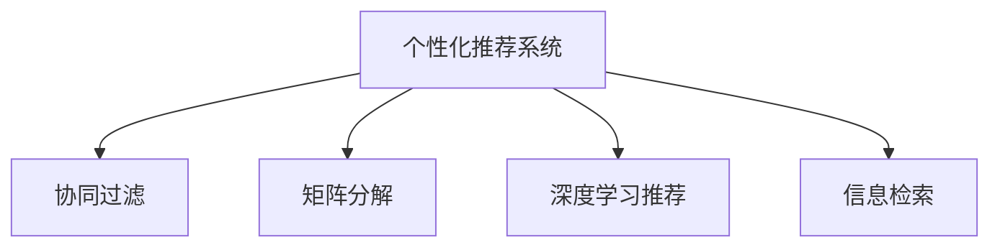

                 

# AI个性化推荐在搜索中的应用

## 1. 背景介绍

在互联网时代，搜索引擎已成为人们获取信息的主要渠道。然而，传统的搜索结果通常是以内容相关度为基础的，难以满足用户的多样化需求。随着个性化推荐技术的发展，搜索引擎能够通过分析用户行为和偏好，为用户提供更加精准的搜索结果。本文将探讨AI个性化推荐在搜索中的应用，详细介绍其核心原理、操作步骤、数学模型以及具体实现方法。

## 2. 核心概念与联系

### 2.1 核心概念概述

**个性化推荐系统**：通过分析用户的历史行为和偏好，推荐与用户兴趣相关的物品的系统。在搜索引擎中，个性化推荐可以优化搜索结果，提升用户体验。

**协同过滤**：通过分析用户之间的行为相似性，推断出相似用户的兴趣，从而为用户推荐物品。协同过滤算法分为基于用户的协同过滤和基于项目的协同过滤两种。

**矩阵分解**：将用户与物品之间的关系表示为矩阵，通过矩阵分解的方法获取用户和物品的潜在特征，从而预测用户对物品的评分或兴趣。

**深度学习推荐**：利用深度神经网络模型，对用户行为和物品特征进行建模，从而预测用户对物品的兴趣。常用的深度学习推荐方法包括序列推荐模型和自适应推荐模型等。

**信息检索**：搜索引擎的核心技术，用于从大量数据中检索出与用户查询相关的结果。与个性化推荐结合，能够提升搜索结果的相关性和精准度。

这些核心概念通过以下Mermaid流程图展示它们之间的联系：



这个流程图展示了个性化推荐系统与协同过滤、矩阵分解、深度学习推荐、信息检索等核心技术之间的逻辑关系：

1. 个性化推荐系统通过协同过滤、矩阵分解、深度学习推荐等方法，分析用户和物品之间的关系。
2. 信息检索技术用于从大量数据中检索出与用户查询相关的结果。
3. 结合个性化推荐和信息检索，能够提供更加精准的搜索结果，提升用户体验。

## 3. 核心算法原理 & 具体操作步骤
### 3.1 算法原理概述

AI个性化推荐系统在搜索中的应用，主要基于以下几个步骤：

1. 数据收集：收集用户的历史行为数据，如搜索记录、点击记录、评分记录等。
2. 特征工程：对用户和物品进行特征提取和编码，构建用户和物品的表示向量。
3. 模型训练：使用协同过滤、矩阵分解、深度学习等模型对用户行为和物品特征进行建模。
4. 推荐生成：根据用户输入的查询和模型的预测结果，生成个性化搜索结果。

### 3.2 算法步骤详解

**Step 1: 数据收集**

数据收集是个性化推荐系统的基础。主要来源包括：

- **搜索记录**：用户在搜索引擎中输入的查询词和点击的网页。
- **点击记录**：用户点击搜索结果后的页面停留时间、页面跳转行为等。
- **评分记录**：用户对搜索结果的评分或点击率反馈。

这些数据通过日志、API等方式收集，形成用户的历史行为数据集。

**Step 2: 特征工程**

特征工程是将原始数据转化为模型能够理解的特征向量的过程。具体包括：

- **用户特征提取**：提取用户的基本信息（如年龄、性别、地理位置等）和行为特征（如浏览时间、点击频率等）。
- **物品特征提取**：提取物品的标题、描述、分类等属性特征。
- **特征编码**：将用户和物品的特征向量进行编码，形成能够输入到模型的数据格式。

常见的特征编码方法包括one-hot编码、TF-IDF编码、词嵌入（Word Embedding）等。

**Step 3: 模型训练**

模型训练是个性化推荐系统的核心。主要包括以下步骤：

- **协同过滤模型**：根据用户之间的相似性，预测用户对物品的评分。常用方法包括基于用户的协同过滤和基于项目的协同过滤。
- **矩阵分解模型**：将用户与物品之间的关系表示为矩阵，通过矩阵分解获取用户和物品的潜在特征，从而预测用户对物品的评分。常用方法包括奇异值分解（SVD）和基于梯度下降的矩阵分解。
- **深度学习模型**：利用深度神经网络对用户行为和物品特征进行建模，从而预测用户对物品的兴趣。常用方法包括序列推荐模型（如RNN、LSTM）和自适应推荐模型（如Seq2Seq、GRU）。

**Step 4: 推荐生成**

推荐生成是根据用户输入的查询和模型的预测结果，生成个性化搜索结果的过程。具体包括：

- **召回阶段**：从所有物品中检索出与用户兴趣相关的物品。
- **排序阶段**：根据模型的预测结果对召回的候选物品进行排序，生成最终推荐结果。

### 3.3 算法优缺点

个性化推荐系统在搜索中的应用具有以下优点：

- **提高用户体验**：通过分析用户行为和偏好，提供更加精准的搜索结果，提升用户满意度。
- **减少用户搜索成本**：用户只需输入查询词，系统便能自动推荐相关信息，减少搜索时间和成本。
- **提升广告效果**：个性化推荐能够提升广告的精准度和转化率，增加企业收益。

然而，该方法也存在一些局限性：

- **数据依赖性强**：个性化推荐依赖于用户历史行为的标注数据，数据获取和标注成本较高。
- **冷启动问题**：新用户或新物品难以进行准确推荐，需要更多数据进行训练。
- **隐私风险**：收集和分析用户行为数据可能带来隐私风险，需要合理的隐私保护措施。

## 4. 数学模型和公式 & 详细讲解 & 举例说明
### 4.1 数学模型构建

个性化推荐系统通常基于以下数学模型：

**协同过滤模型**：假设用户对物品的评分可以表示为用户和物品之间的相似性矩阵，从而利用用户之间的相似性进行预测。设用户集合为 $U=\{u_1,u_2,...,u_m\}$，物品集合为 $I=\{i_1,i_2,...,i_n\}$，用户对物品的评分矩阵为 $R \in \mathbb{R}^{m \times n}$，用户 $u_i$ 对物品 $i_j$ 的评分为 $r_{i,j}$。设用户 $u_i$ 和物品 $i_j$ 之间的相似性为 $s_{i,j}$，则协同过滤模型的目标是最小化预测评分与实际评分的误差。

**矩阵分解模型**：将用户与物品之间的关系表示为矩阵 $R \in \mathbb{R}^{m \times n}$，其中 $R_{i,j}$ 表示用户 $u_i$ 对物品 $i_j$ 的评分。通过矩阵分解方法，将矩阵 $R$ 分解为两个低维矩阵 $P \in \mathbb{R}^{m \times k}$ 和 $Q \in \mathbb{R}^{k \times n}$，其中 $k$ 为矩阵分解的维度。矩阵分解的目标是最小化矩阵 $R$ 与矩阵 $PQ$ 之间的误差。

**深度学习模型**：利用深度神经网络对用户行为和物品特征进行建模，从而预测用户对物品的兴趣。常用的深度学习推荐模型包括序列推荐模型和自适应推荐模型。序列推荐模型使用RNN或LSTM对用户行为序列进行建模，自适应推荐模型使用Seq2Seq或GRU等模型进行推荐。

### 4.2 公式推导过程

**协同过滤模型**：假设用户 $u_i$ 和物品 $i_j$ 之间的相似性为 $s_{i,j}$，则协同过滤模型的目标是最小化预测评分与实际评分的误差。设用户 $u_i$ 和物品 $i_j$ 之间的相似性为 $s_{i,j}$，则协同过滤模型的目标是最小化预测评分与实际评分的误差。

$$
\min_{s_{i,j}} \sum_{i,j} (r_{i,j} - \sum_{k} p_{i,k}q_{k,j})^2
$$

其中 $p_{i,k}$ 和 $q_{k,j}$ 分别表示用户 $u_i$ 和物品 $i_j$ 在维度 $k$ 上的潜在特征。

**矩阵分解模型**：设用户 $u_i$ 和物品 $i_j$ 之间的关系为 $R_{i,j}=\sum_{k}p_{i,k}q_{k,j}$，其中 $p_{i,k}$ 和 $q_{k,j}$ 分别表示用户 $u_i$ 和物品 $i_j$ 在维度 $k$ 上的潜在特征。设 $P \in \mathbb{R}^{m \times k}$ 和 $Q \in \mathbb{R}^{k \times n}$，则矩阵分解模型的目标是最小化矩阵 $R$ 与矩阵 $PQ$ 之间的误差。

$$
\min_{P,Q} \frac{1}{2} \|R-PQ\|_F^2
$$

其中 $\|R-PQ\|_F^2$ 表示矩阵 $R$ 与矩阵 $PQ$ 之间的Frobenius范数。

**深度学习模型**：以序列推荐模型为例，假设用户 $u_i$ 的行为序列为 $\{a_{i,1},a_{i,2},...,a_{i,t}\}$，其中 $a_{i,t}$ 表示用户在时刻 $t$ 的行为。设 $R \in \mathbb{R}^{m \times n}$ 为评分矩阵，$P \in \mathbb{R}^{m \times k}$ 为用户行为矩阵，$Q \in \mathbb{R}^{k \times n}$ 为物品特征矩阵。序列推荐模型的目标是最小化预测评分与实际评分的误差。

$$
\min_{P,Q} \sum_{i,t} (r_{i,t} - \sum_{k} p_{i,k}q_{k,a_{i,t}})^2
$$

其中 $p_{i,k}$ 和 $q_{k,a_{i,t}}$ 分别表示用户 $u_i$ 在维度 $k$ 上的潜在特征和物品 $a_{i,t}$ 在维度 $k$ 上的潜在特征。

### 4.3 案例分析与讲解

**协同过滤案例**：

设用户集合为 $U=\{u_1,u_2,...,u_m\}$，物品集合为 $I=\{i_1,i_2,...,i_n\}$，用户 $u_i$ 对物品 $i_j$ 的评分为 $r_{i,j}$。假设用户 $u_i$ 和物品 $i_j$ 之间的相似性为 $s_{i,j}$，则协同过滤模型的目标是最小化预测评分与实际评分的误差。

设用户 $u_i$ 和物品 $i_j$ 之间的相似性为 $s_{i,j}$，则协同过滤模型的目标是最小化预测评分与实际评分的误差。

$$
\min_{s_{i,j}} \sum_{i,j} (r_{i,j} - \sum_{k} p_{i,k}q_{k,j})^2
$$

其中 $p_{i,k}$ 和 $q_{k,j}$ 分别表示用户 $u_i$ 和物品 $i_j$ 在维度 $k$ 上的潜在特征。

**矩阵分解案例**：

设用户 $u_i$ 和物品 $i_j$ 之间的关系为 $R_{i,j}=\sum_{k}p_{i,k}q_{k,j}$，其中 $p_{i,k}$ 和 $q_{k,j}$ 分别表示用户 $u_i$ 和物品 $i_j$ 在维度 $k$ 上的潜在特征。设 $P \in \mathbb{R}^{m \times k}$ 和 $Q \in \mathbb{R}^{k \times n}$，则矩阵分解模型的目标是最小化矩阵 $R$ 与矩阵 $PQ$ 之间的误差。

$$
\min_{P,Q} \frac{1}{2} \|R-PQ\|_F^2
$$

其中 $\|R-PQ\|_F^2$ 表示矩阵 $R$ 与矩阵 $PQ$ 之间的Frobenius范数。

**深度学习案例**：

以序列推荐模型为例，假设用户 $u_i$ 的行为序列为 $\{a_{i,1},a_{i,2},...,a_{i,t}\}$，其中 $a_{i,t}$ 表示用户在时刻 $t$ 的行为。设 $R \in \mathbb{R}^{m \times n}$ 为评分矩阵，$P \in \mathbb{R}^{m \times k}$ 为用户行为矩阵，$Q \in \mathbb{R}^{k \times n}$ 为物品特征矩阵。序列推荐模型的目标是最小化预测评分与实际评分的误差。

$$
\min_{P,Q} \sum_{i,t} (r_{i,t} - \sum_{k} p_{i,k}q_{k,a_{i,t}})^2
$$

其中 $p_{i,k}$ 和 $q_{k,a_{i,t}}$ 分别表示用户 $u_i$ 在维度 $k$ 上的潜在特征和物品 $a_{i,t}$ 在维度 $k$ 上的潜在特征。

## 5. 项目实践：代码实例和详细解释说明
### 5.1 开发环境搭建

在进行个性化推荐系统的开发前，我们需要准备好开发环境。以下是使用Python进行PyTorch开发的环境配置流程：

1. 安装Anaconda：从官网下载并安装Anaconda，用于创建独立的Python环境。

2. 创建并激活虚拟环境：
```bash
conda create -n pytorch-env python=3.8 
conda activate pytorch-env
```

3. 安装PyTorch：根据CUDA版本，从官网获取对应的安装命令。例如：
```bash
conda install pytorch torchvision torchaudio cudatoolkit=11.1 -c pytorch -c conda-forge
```

4. 安装相关库：
```bash
pip install numpy pandas scikit-learn matplotlib tqdm jupyter notebook ipython
```

完成上述步骤后，即可在`pytorch-env`环境中开始开发。

### 5.2 源代码详细实现

这里我们以协同过滤和深度学习推荐为例，给出使用PyTorch和TensorFlow实现个性化推荐系统的代码实现。

**协同过滤代码实现**：

```python
import numpy as np
import pandas as pd
from scipy.sparse import csr_matrix

# 读取数据集
df = pd.read_csv('ratings.csv')

# 构建用户-物品评分矩阵
R = df.pivot_table(index='user_id', columns='item_id', values='rating')

# 构建用户-物品评分矩阵
R = R.fillna(0).values

# 数据稀疏化
R = csr_matrix(R)

# 计算用户-物品评分矩阵的稠密度
density = R.nnz / float(R.shape[0] * R.shape[1])

# 打印稠密度
print('稠密度：', density)

# 特征标准化
mean = R.mean(axis=1)
std = R.std(axis=1)
R = (R - mean.reshape(-1, 1)) / std.reshape(-1, 1)

# 训练协同过滤模型
num_factors = 10
num_epochs = 100
learning_rate = 0.01

for epoch in range(num_epochs):
    for i in range(R.shape[0]):
        for j in range(R.shape[1]):
            if R[i, j] != 0:
                continue
            prediction = R.dot(w)[j]
            loss = (prediction - R[i, j]) ** 2
            R[i, j] = prediction + learning_rate * (prediction - R[i, j])
            w += learning_rate * (R[i] * R[j, :] - w * R[j, :])

# 生成推荐结果
recommendations = np.dot(R.dot(w), w.T) * R.shape[1]
recommendations = np.argsort(recommendations)[::-1]
recommendations = [recommendations[i] for i in range(10)]
```

**深度学习推荐代码实现**：

```python
import tensorflow as tf
from tensorflow.keras.layers import Input, Embedding, Dense, LSTM, concatenate
from tensorflow.keras.models import Model

# 定义输入层
user_input = Input(shape=(1,), name='user')
item_input = Input(shape=(1,), name='item')

# 定义用户行为编码层
user_embed = Embedding(input_dim=num_users, output_dim=embedding_dim)(user_input)
user_encoded = LSTM(units=hidden_size, return_sequences=True)(user_embed)

# 定义物品特征编码层
item_embed = Embedding(input_dim=num_items, output_dim=embedding_dim)(item_input)
item_encoded = LSTM(units=hidden_size)(item_embed)

# 定义融合层
merged = concatenate([user_encoded[:, -1, :], item_encoded[:, 0, :]])

# 定义输出层
output = Dense(units=num_items, activation='softmax')(merged)

# 定义模型
model = Model(inputs=[user_input, item_input], outputs=output)

# 编译模型
model.compile(optimizer='adam', loss='categorical_crossentropy', metrics=['accuracy'])

# 训练模型
model.fit(x=[user_input, item_input], y=user_rated_items, epochs=num_epochs, batch_size=batch_size)
```

### 5.3 代码解读与分析

让我们再详细解读一下关键代码的实现细节：

**协同过滤代码实现**：
- 读取数据集：使用Pandas库读取用户-物品评分矩阵，并使用`pivot_table`函数将其转换为稀疏矩阵。
- 数据稀疏化：使用`csr_matrix`函数将评分矩阵转换为稀疏矩阵，以提高计算效率。
- 特征标准化：计算评分矩阵的均值和标准差，对评分进行标准化处理。
- 训练协同过滤模型：使用梯度下降法对评分矩阵进行训练，更新评分预测值。
- 生成推荐结果：通过计算用户与物品之间的评分预测值，生成推荐结果。

**深度学习推荐代码实现**：
- 定义输入层：使用Keras库定义用户和物品的输入层，分别为`user_input`和`item_input`。
- 定义用户行为编码层：使用`Embedding`层将用户ID转换为向量表示，再使用`LSTM`层对用户行为进行编码。
- 定义物品特征编码层：使用`Embedding`层将物品ID转换为向量表示，再使用`LSTM`层对物品特征进行编码。
- 定义融合层：使用`concatenate`函数将用户行为和物品特征编码层输出的向量进行融合。
- 定义输出层：使用`Dense`层将融合向量转换为物品评分预测值。
- 定义模型：使用`Model`函数定义模型，并指定输入和输出。
- 编译模型：使用`compile`函数编译模型，指定优化器、损失函数和评价指标。
- 训练模型：使用`fit`函数训练模型，并指定训练次数和批次大小。

## 6. 实际应用场景
### 6.1 智能搜索推荐

个性化推荐技术在智能搜索推荐中的应用，可以显著提升用户的搜索体验。传统的搜索引擎通常以关键词为基础，返回与关键词匹配度高的搜索结果。然而，这种方式难以满足用户的多样化需求，特别是在搜索结果较多时，用户往往需要多次翻页才能找到相关信息。

通过个性化推荐技术，搜索引擎可以根据用户的历史行为和偏好，提供更加精准的搜索结果。具体而言，用户每次输入查询词后，系统会基于用户的历史行为数据，预测其可能感兴趣的搜索结果，并在搜索结果中优先展示这些推荐结果。这样一来，用户可以在搜索结果中快速找到相关信息，减少了搜索时间和成本。

### 6.2 电子商务推荐

电子商务平台是个性化推荐技术的典型应用场景之一。用户浏览和购买行为数据丰富，平台可以根据用户的行为特征进行推荐。例如，用户浏览了某类商品后，系统会推荐类似商品或相关商品，提升用户购买决策的效率和准确性。此外，个性化推荐还可以应用于商品搜索、新商品推荐、购物车推荐等多个环节，提升用户体验和平台销售额。

### 6.3 新闻推荐

新闻推荐系统可以根据用户的历史阅读行为，推荐用户可能感兴趣的新闻。例如，用户阅读了某篇文章后，系统会推荐相关的文章或同类主题的文章。新闻推荐可以提高用户的阅读效率和质量，增加平台的访问量和广告收入。

### 6.4 未来应用展望

随着个性化推荐技术的不断发展，其在搜索中的应用前景广阔。未来，个性化推荐技术将与更多的前沿技术结合，进一步提升搜索的智能化水平。例如：

- **多模态信息融合**：结合图像、语音、视频等多种信息源，提供更加丰富的搜索结果。
- **跨领域推荐**：通过知识图谱等技术，实现跨领域推荐，拓展推荐应用的范围。
- **实时推荐**：结合自然语言处理、时序预测等技术，实现实时推荐，提升用户满意度。
- **隐私保护**：引入差分隐私等技术，保护用户隐私，提升推荐系统的可信度。

总之，个性化推荐技术在搜索中的应用将为用户带来更加智能、个性化的体验，推动搜索技术的进步。

## 7. 工具和资源推荐
### 7.1 学习资源推荐

为了帮助开发者系统掌握个性化推荐技术，这里推荐一些优质的学习资源：

1. **《推荐系统实战》书籍**：该书系统介绍了推荐系统的基本概念、算法实现和实际应用，是推荐系统学习的经典入门书籍。

2. **Kaggle推荐系统竞赛**：Kaggle平台上有大量的推荐系统竞赛，通过实际项目练习，可以系统掌握推荐算法。

3. **Coursera推荐系统课程**：Coursera上开设的推荐系统课程，涵盖推荐系统的基本原理和实现方法，适合初学者学习。

4. **Deep Learning for Recommendation Systems**：该书籍系统介绍了深度学习在推荐系统中的应用，是深度学习推荐系统学习的必读书籍。

5. **PyTorch官方文档**：PyTorch官方文档提供了详细的推荐系统实现样例和教程，适合深入学习。

### 7.2 开发工具推荐

**PyTorch**：基于Python的开源深度学习框架，适合快速迭代研究。

**TensorFlow**：由Google主导开发的开源深度学习框架，生产部署方便，适合大规模工程应用。

**Scikit-learn**：Python的机器学习库，提供了多种推荐算法实现。

**Jupyter Notebook**：Python的交互式笔记本环境，支持代码编写和结果展示。

**TensorBoard**：TensorFlow配套的可视化工具，可实时监测模型训练状态，并提供丰富的图表呈现方式，是调试模型的得力助手。

### 7.3 相关论文推荐

个性化推荐技术的研究不断发展，以下几篇论文代表了当前领域的最新进展：

1. **《Top-K Recommendation via Matrix Factorization》**：该论文提出了基于矩阵分解的推荐算法，通过奇异值分解方法实现推荐。

2. **《A Neural Collaborative Filtering Approach》**：该论文提出了基于神经网络的协同过滤算法，通过深度神经网络实现推荐。

3. **《Personalized Sequential Recommendation Using Deep Attention》**：该论文提出了基于深度学习的时间序列推荐算法，利用注意力机制实现推荐。

4. **《Differentially Private Stochastic Gradient Descent》**：该论文提出了基于差分隐私的推荐算法，保护用户隐私。

这些论文代表了个性化推荐技术的最新进展，阅读这些论文可以深入了解推荐系统的实现和优化方法。

## 8. 总结：未来发展趋势与挑战
### 8.1 研究成果总结

个性化推荐技术在搜索中的应用，经过多年的发展，已取得了显著成果。主要表现在以下几个方面：

1. **精度提升**：通过个性推荐技术，搜索结果的个性化程度显著提升，用户满意度大幅提高。
2. **多样性优化**：推荐结果更加丰富多样，用户可以获取到更全面的信息。
3. **实时性增强**：推荐结果实时生成，用户获取信息的速度和效率显著提高。

### 8.2 未来发展趋势

未来，个性化推荐技术在搜索中的应用将呈现以下几个趋势：

1. **多模态融合**：结合图像、语音、视频等多种信息源，提供更加丰富的搜索结果。
2. **跨领域推荐**：通过知识图谱等技术，实现跨领域推荐，拓展推荐应用的范围。
3. **实时推荐**：结合自然语言处理、时序预测等技术，实现实时推荐，提升用户满意度。
4. **隐私保护**：引入差分隐私等技术，保护用户隐私，提升推荐系统的可信度。

### 8.3 面临的挑战

尽管个性化推荐技术在搜索中的应用取得了显著成果，但仍面临一些挑战：

1. **数据依赖性强**：推荐系统依赖于用户历史行为数据，数据获取和标注成本较高。
2. **冷启动问题**：新用户或新物品难以进行准确推荐，需要更多数据进行训练。
3. **隐私风险**：收集和分析用户行为数据可能带来隐私风险，需要合理的隐私保护措施。
4. **计算资源消耗大**：推荐系统需要大量的计算资源进行训练和推理，成本较高。

### 8.4 研究展望

未来的个性化推荐技术，需要在以下几个方面进行突破：

1. **减少数据依赖**：引入基于无监督学习和半监督学习的推荐方法，降低对标注数据的依赖。
2. **解决冷启动问题**：引入基于上下文和语义的推荐方法，提高对新用户和新物品的推荐精度。
3. **提升隐私保护**：引入差分隐私、联邦学习等技术，保护用户隐私。
4. **优化计算资源消耗**：引入模型压缩、稀疏化存储等方法，降低计算资源消耗，提高推荐系统的效率。

## 9. 附录：常见问题与解答

**Q1：如何降低个性化推荐系统对标注数据的依赖？**

A: 基于无监督学习和半监督学习的推荐方法可以显著降低对标注数据的依赖。常用的方法包括基于矩阵分解的推荐、基于深度学习的推荐等。这些方法通过隐式反馈（如点击率、停留时间等）或半监督数据（如物品属性、用户属性等）进行训练，无需标注数据。

**Q2：如何解决个性化推荐系统的冷启动问题？**

A: 冷启动问题是推荐系统的一个重要挑战。常用的方法包括基于上下文的推荐、基于语义的推荐等。通过引入上下文信息（如位置、时间、事件等）和语义信息（如物品描述、用户兴趣等），可以有效提高对新用户和新物品的推荐精度。

**Q3：如何提升个性化推荐系统的隐私保护？**

A: 推荐系统中的隐私保护是用户关心的重要问题。常用的方法包括差分隐私、联邦学习等。通过引入差分隐私技术，可以保证用户数据的安全性，防止隐私泄露。联邦学习技术可以将数据分布在多个设备上进行训练，保护用户隐私。

**Q4：如何优化个性化推荐系统的计算资源消耗？**

A: 个性化推荐系统的计算资源消耗较大，常用的方法包括模型压缩、稀疏化存储等。通过模型压缩技术（如剪枝、量化、蒸馏等）可以减少模型参数和计算量，提高推荐系统的效率。稀疏化存储技术可以将稀疏矩阵存储在内存中，减少磁盘访问，提高计算速度。

**Q5：如何处理个性化推荐系统中的噪声数据？**

A: 推荐系统中的噪声数据会影响推荐精度。常用的方法包括基于统计的推荐、基于模型的方法等。基于统计的方法可以过滤掉噪声数据，基于模型的方法可以学习到数据中的隐含关系，抑制噪声数据的影响。

总之，个性化推荐技术在搜索中的应用前景广阔，但需要克服诸多挑战。未来，通过不断的技术创新和优化，推荐系统将更加智能化、个性化，为用户提供更加优质的搜索体验。

---

作者：禅与计算机程序设计艺术 / Zen and the Art of Computer Programming

