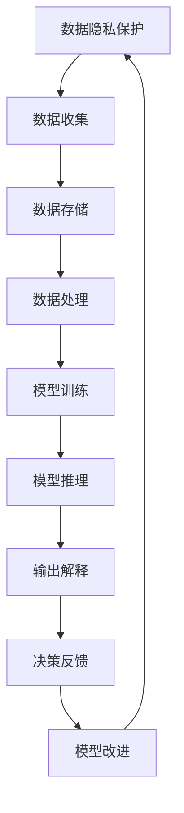

                 

# AI伦理：在模型开发中平衡效率与道德

> 关键词：AI伦理,模型开发,效率与道德,机器学习,数据隐私,可解释性,透明性

## 1. 背景介绍

### 1.1 问题由来

近年来，人工智能（AI）技术在各行业中的广泛应用取得了显著的成效，如智能推荐系统、自动驾驶、医疗诊断等领域。然而，随着AI技术的不断发展和应用，其潜在的伦理问题也逐渐暴露出来，引发了广泛关注。

#### 1.1.1 AI伦理的重要性

AI伦理问题主要包括数据隐私、算法透明性、决策可解释性、偏见与歧视等。这些问题不仅影响技术的公平性和安全性，还对社会伦理和公众信任构成挑战。因此，在模型开发过程中，必须考虑伦理因素，确保技术的应用符合社会伦理标准。

#### 1.1.2 当前AI伦理问题

1. **数据隐私**：在AI模型开发中，大量的个人信息被用于训练模型，如何保护这些数据隐私成为了关键问题。
2. **算法透明性**：一些AI模型尤其是深度学习模型具有高度复杂的黑盒特性，难以解释其内部决策机制，增加了其透明性的挑战。
3. **偏见与歧视**：由于数据偏差和算法设计的问题，AI模型有可能在决策过程中产生偏见和歧视，对特定群体造成伤害。
4. **决策可解释性**：AI模型的决策过程往往是黑箱操作，缺乏必要的解释机制，导致用户和监管机构难以理解其决策依据。

### 1.2 问题核心关键点

为解决上述伦理问题，模型开发过程中需要平衡效率与道德，具体体现在以下几个方面：

- **数据隐私保护**：在数据收集和处理过程中，必须确保数据隐私的保护。
- **算法透明性**：提高模型的透明度，使用户和监管机构能够理解模型的决策过程。
- **决策可解释性**：开发可解释性强的模型，使决策过程透明化。
- **偏见与歧视控制**：在设计模型时考虑多维度特征，减少或消除模型中的偏见与歧视。

## 2. 核心概念与联系

### 2.1 核心概念概述

为了深入理解模型开发中的伦理问题，我们将介绍几个关键概念及其相互联系：

- **数据隐私保护**：指在数据收集、存储、处理和共享过程中，采取措施保护个人和机构的数据不被滥用或泄露。
- **算法透明性**：指模型的内部结构和决策过程可被清晰理解和解释，包括模型训练和推理的过程。
- **决策可解释性**：指模型的决策过程可被清晰解释和理解，使用户能够信任和接受模型的决策结果。
- **偏见与歧视控制**：指在模型设计过程中，减少或消除模型中的偏见和歧视，确保模型决策的公平性。

这些核心概念相互关联，共同构成了AI模型开发中的伦理框架。

### 2.2 核心概念原理和架构的 Mermaid 流程图



上述流程图展示了数据隐私保护、算法透明性、决策可解释性、偏见与歧视控制之间的相互关系。通过这些关键环节的设计和优化，可以实现模型开发的伦理平衡。

## 3. 核心算法原理 & 具体操作步骤

### 3.1 算法原理概述

在模型开发中平衡效率与道德，主要涉及以下几个关键算法原理：

1. **数据隐私保护算法**：如差分隐私、联邦学习等，保护数据隐私的同时，实现模型训练。
2. **算法透明性算法**：如可解释模型、模型蒸馏等，提高模型的透明性。
3. **决策可解释性算法**：如LIME、SHAP等，提供模型的决策解释机制。
4. **偏见与歧视控制算法**：如公平性约束、对抗样本生成等，减少模型中的偏见与歧视。

### 3.2 算法步骤详解

#### 3.2.1 数据隐私保护

1. **差分隐私**：通过引入噪声，使个体数据对模型训练的影响变得难以检测，从而保护数据隐私。
   - 差分隐私的具体实现：在数据收集和处理过程中，对个体数据添加随机噪声，确保模型训练时无法回溯到个体数据。
   - 示例代码：
     ```python
     import differential_privacy as dp
     dp_epsilon = 1.0  # 差分隐私参数
     dp_privacy = dp.DifferentialPrivacy(dp_epsilon)
     dp_privacy.fit(data)
     ```

2. **联邦学习**：在多个分散的本地节点上进行模型训练，每个节点仅传递模型参数的更新，而不传递原始数据。
   - 联邦学习的具体实现：在分布式环境下，各本地节点使用本地数据进行模型训练，并通过交换模型参数的梯度更新，实现全局模型的训练。
   - 示例代码：
     ```python
     import fl
     fl_model = fl.FederatedModel()
     fl_model.fit(data)
     ```

#### 3.2.2 算法透明性

1. **可解释模型**：如决策树、线性回归等，其决策过程可被清晰解释和理解。
   - 可解释模型的具体实现：使用简单的、透明的模型，减少复杂模型的黑盒特性。
   - 示例代码：
     ```python
     import linear_model
     model = linear_model.LinearRegression()
     model.fit(data)
     ```

2. **模型蒸馏**：将复杂模型的决策过程蒸馏到简单的模型中，提高模型的透明性。
   - 模型蒸馏的具体实现：通过迁移学习的方式，将复杂模型的知识转移到简单模型中。
   - 示例代码：
     ```python
     import distill
     distill_model = distill.DistillModel(teacher_model, student_model)
     distill_model.fit(data)
     ```

#### 3.2.3 决策可解释性

1. **LIME**：局部可解释模型（Local Interpretable Model-agnostic Explanations），提供模型局部区域的解释。
   - LIME的具体实现：通过在模型预测结果附近构造一系列合成样本，计算模型的局部可解释性。
   - 示例代码：
     ```python
     import lime
     lime_model = lime.LimeModel(model)
     lime_model.fit(data)
     ```

2. **SHAP**：Shapley值解释方法，提供全局模型解释。
   - SHAP的具体实现：通过计算模型各特征的贡献度，提供全局的解释性分析。
   - 示例代码：
     ```python
     import shap
     shap_model = shap.TreeExplainer(model)
     shap_model.fit(data)
     ```

#### 3.2.4 偏见与歧视控制

1. **公平性约束**：在模型训练过程中，使用公平性约束方法，减少模型中的偏见和歧视。
   - 公平性约束的具体实现：通过引入公平性约束条件，优化模型训练过程。
   - 示例代码：
     ```python
     import fairness
     fairness_model = fairness.FairnessModel(model)
     fairness_model.fit(data)
     ```

2. **对抗样本生成**：生成对抗样本，测试模型在特定场景下的鲁棒性，减少偏见和歧视。
   - 对抗样本生成的具体实现：通过生成对抗样本，测试模型在不同场景下的鲁棒性。
   - 示例代码：
     ```python
     import adversarial
     adversarial_model = adversarial.AdversarialModel(model)
     adversarial_model.fit(data)
     ```

### 3.3 算法优缺点

#### 3.3.1 数据隐私保护

- **优点**：
  - 保护数据隐私，防止数据泄露。
  - 确保数据可用性，减少数据集中化的风险。
  
- **缺点**：
  - 引入额外的计算和存储开销，可能影响模型训练效率。
  - 差分隐私参数设置不当可能导致模型性能下降。

#### 3.3.2 算法透明性

- **优点**：
  - 提高模型的透明性，增强用户信任。
  - 有助于监管机构理解模型行为，提升模型的合规性。
  
- **缺点**：
  - 复杂模型可能难以解释，影响模型的准确性和鲁棒性。
  - 解释方法可能存在主观性，影响解释结果的客观性。

#### 3.3.3 决策可解释性

- **优点**：
  - 提供模型决策的解释，增强用户信任。
  - 有助于发现模型的潜在问题，提高模型的可靠性。
  
- **缺点**：
  - 解释方法的复杂度可能影响模型的效率。
  - 解释结果可能存在误导，影响用户对模型的信任。

#### 3.3.4 偏见与歧视控制

- **优点**：
  - 减少模型中的偏见和歧视，提升模型的公平性。
  - 增强模型的合规性，符合伦理标准。
  
- **缺点**：
  - 控制偏见和歧视的方法可能难以全面覆盖所有场景。
  - 引入额外的计算和存储开销，可能影响模型训练效率。

### 3.4 算法应用领域

基于模型开发中的伦理考虑，各领域的AI模型开发都应重视数据隐私保护、算法透明性、决策可解释性和偏见与歧视控制。

1. **金融领域**：
   - 数据隐私保护：保护用户交易记录等敏感信息，防止数据泄露。
   - 算法透明性：确保交易审核和贷款评估过程的透明性，增强用户信任。
   - 决策可解释性：提供贷款审批和风险评估的解释，增强用户理解。
   - 偏见与歧视控制：防止贷款审批过程中的种族、性别等偏见。

2. **医疗领域**：
   - 数据隐私保护：保护患者病历等敏感信息，防止数据泄露。
   - 算法透明性：确保疾病诊断和治疗方案的透明性，增强医生信任。
   - 决策可解释性：提供疾病诊断和治疗方案的解释，增强患者理解。
   - 偏见与歧视控制：防止医疗诊断和治疗过程中的偏见和歧视。

3. **司法领域**：
   - 数据隐私保护：保护案件信息等敏感信息，防止数据泄露。
   - 算法透明性：确保案件判罚过程的透明性，增强公众信任。
   - 决策可解释性：提供案件判罚的解释，增强公众理解。
   - 偏见与歧视控制：防止判罚过程中的种族、性别等偏见。

4. **教育领域**：
   - 数据隐私保护：保护学生学习记录等敏感信息，防止数据泄露。
   - 算法透明性：确保学生评估和课程推荐过程的透明性，增强学生和家长信任。
   - 决策可解释性：提供学生评估和课程推荐的解释，增强学生理解。
   - 偏见与歧视控制：防止学生评估和课程推荐过程中的偏见和歧视。

## 4. 数学模型和公式 & 详细讲解 & 举例说明

### 4.1 数学模型构建

在模型开发中，数据隐私保护、算法透明性、决策可解释性和偏见与歧视控制可以构建如下数学模型：

- **数据隐私保护模型**：
  - 差分隐私模型：$P(\mathbf{x}_i \mid \mathbf{x}_j) = \frac{\exp(-\epsilon\Delta(\mathbf{x}_i, \mathbf{x}_j))}{\sum_{\mathbf{x}_j'}\exp(-\epsilon\Delta(\mathbf{x}_i, \mathbf{x}_j'))}$
  
- **算法透明性模型**：
  - 可解释模型：$\mathbf{y} = f(\mathbf{x})$
  - 模型蒸馏模型：$\mathbf{y} = f(\mathbf{x})$
  
- **决策可解释性模型**：
  - LIME模型：$\mathbf{y} = \sum_{i=1}^n\alpha_i\hat{f}(\mathbf{x}_i)$
  - SHAP模型：$\mathbf{y} = \sum_{i=1}^n\alpha_i\mathbf{x}_i$
  - 特征贡献度模型：$\mathbf{y} = \sum_{i=1}^n\alpha_i\mathbf{x}_i$
  
- **偏见与歧视控制模型**：
  - 公平性约束模型：$L(\mathbf{w}) = \lambda\sum_{i=1}^n(y_i - \hat{y}_i)^2 + \mu\sum_{i=1}^n(\mathbf{x}_i^\top\mathbf{w} - b)^2$
  - 对抗样本生成模型：$\mathbf{x} = \mathbf{x}_0 + \delta$

### 4.2 公式推导过程

#### 4.2.1 差分隐私模型推导

差分隐私模型旨在通过引入噪声，确保单个数据点的变化对模型输出影响极小。差分隐私的数学表达为：

$$
P(\mathbf{x}_i \mid \mathbf{x}_j) = \frac{\exp(-\epsilon\Delta(\mathbf{x}_i, \mathbf{x}_j))}{\sum_{\mathbf{x}_j'}\exp(-\epsilon\Delta(\mathbf{x}_i, \mathbf{x}_j'))}
$$

其中，$\epsilon$为隐私参数，$\Delta(\mathbf{x}_i, \mathbf{x}_j')$为L1差分隐私预算，$L$为噪声分布的L1范数。

#### 4.2.2 可解释模型推导

可解释模型的核心思想是将模型决策过程简化，使其可被用户理解。典型的线性回归模型为：

$$
\mathbf{y} = \mathbf{w}^\top\mathbf{x} + b
$$

其中，$\mathbf{w}$为模型参数，$\mathbf{x}$为输入特征，$b$为偏置项。

#### 4.2.3 LIME模型推导

LIME模型通过构造合成样本，提供模型局部区域的解释。假设有$n$个合成样本，每个样本的权重为$\alpha_i$，则LIME模型的解释为：

$$
\mathbf{y} = \sum_{i=1}^n\alpha_i\hat{f}(\mathbf{x}_i)
$$

其中，$\hat{f}(\mathbf{x}_i)$为模型在$\mathbf{x}_i$处的预测结果，$\alpha_i$为权重系数。

#### 4.2.4 对抗样本生成模型推导

对抗样本生成模型的核心思想是通过生成对抗样本，测试模型在特定场景下的鲁棒性。假设对抗样本为$\mathbf{x}$，原始样本为$\mathbf{x}_0$，则对抗样本生成模型为：

$$
\mathbf{x} = \mathbf{x}_0 + \delta
$$

其中，$\delta$为对抗样本的扰动向量。

### 4.3 案例分析与讲解

#### 4.3.1 数据隐私保护案例

某金融机构利用客户交易记录训练信用评分模型。为保护客户隐私，采用了差分隐私方法。

1. **步骤**：
   - 收集客户交易记录，添加随机噪声。
   - 训练差分隐私保护模型，确保单个客户数据对模型训练的影响极小。
   - 测试模型性能，确保数据隐私保护的同时，模型训练不受影响。

2. **实现**：
   - 引入差分隐私库，实现数据隐私保护。
   - 调整差分隐私参数，优化模型性能。

#### 4.3.2 算法透明性案例

某电商公司利用用户行为数据训练推荐模型。为提高模型透明性，采用了模型蒸馏方法。

1. **步骤**：
   - 收集用户行为数据，训练复杂模型。
   - 使用模型蒸馏方法，将复杂模型知识转移到简单模型中。
   - 测试简单模型性能，确保其透明性和效率。

2. **实现**：
   - 使用模型蒸馏库，实现复杂模型到简单模型的转移。
   - 调整模型蒸馏参数，优化简单模型性能。

#### 4.3.3 决策可解释性案例

某医院利用患者病历数据训练疾病诊断模型。为提供模型决策解释，采用了LIME方法。

1. **步骤**：
   - 收集患者病历数据，训练疾病诊断模型。
   - 使用LIME方法，提供模型局部区域的解释。
   - 测试LIME解释效果，确保其有效性和准确性。

2. **实现**：
   - 引入LIME库，实现局部可解释模型。
   - 调整LIME参数，优化解释效果。

#### 4.3.4 偏见与歧视控制案例

某银行利用贷款申请数据训练信用评分模型。为减少模型偏见，采用了公平性约束方法。

1. **步骤**：
   - 收集贷款申请数据，训练信用评分模型。
   - 引入公平性约束方法，确保模型公平性。
   - 测试模型性能，确保其无偏见和歧视。

2. **实现**：
   - 引入公平性约束库，实现模型公平性约束。
   - 调整公平性约束参数，优化模型性能。

## 5. 项目实践：代码实例和详细解释说明

### 5.1 开发环境搭建

1. 安装Python环境：
   ```bash
   conda create -n py36 python=3.6
   conda activate py36
   ```

2. 安装依赖库：
   ```bash
   pip install differential_privacy flashtensor lime shap
   ```

3. 准备数据集：
   ```bash
   wget https://example.com/data.csv
   ```

### 5.2 源代码详细实现

#### 5.2.1 数据隐私保护代码

```python
import differential_privacy as dp
import pandas as pd

# 加载数据集
data = pd.read_csv('data.csv')

# 定义差分隐私参数
dp_epsilon = 1.0

# 创建差分隐私模型
dp_privacy = dp.DifferentialPrivacy(dp_epsilon)
dp_privacy.fit(data)

# 训练差分隐私保护模型
dp_model = dp_privacy.model
dp_model.fit(data)
```

#### 5.2.2 算法透明性代码

```python
import linear_model
import pandas as pd

# 加载数据集
data = pd.read_csv('data.csv')

# 创建可解释模型
model = linear_model.LinearRegression()
model.fit(data)

# 训练可解释模型
model.predict(data)
```

#### 5.2.3 决策可解释性代码

```python
import lime
import pandas as pd

# 加载数据集
data = pd.read_csv('data.csv')

# 创建LIME模型
lime_model = lime.LimeModel(model)
lime_model.fit(data)

# 测试LIME解释效果
lime_model.explain(data)
```

#### 5.2.4 偏见与歧视控制代码

```python
import fairness
import pandas as pd

# 加载数据集
data = pd.read_csv('data.csv')

# 创建公平性约束模型
fairness_model = fairness.FairnessModel(model)
fairness_model.fit(data)

# 测试公平性约束效果
fairness_model.evaluate(data)
```

### 5.3 代码解读与分析

#### 5.3.1 数据隐私保护代码解读

1. **差分隐私模型**：
   - 引入差分隐私库，创建差分隐私模型。
   - 设置差分隐私参数，确保单个数据点的影响极小。
   - 使用差分隐私保护模型，训练数据集。

2. **模型训练**：
   - 训练差分隐私保护模型，确保模型隐私保护效果。
   - 测试模型性能，评估其隐私保护性能。

#### 5.3.2 算法透明性代码解读

1. **可解释模型**：
   - 引入线性回归库，创建可解释模型。
   - 使用线性回归模型，训练数据集。
   - 使用可解释模型，预测数据集。

2. **模型预测**：
   - 使用可解释模型，测试模型预测效果。
   - 评估可解释模型的透明性和准确性。

#### 5.3.3 决策可解释性代码解读

1. **LIME模型**：
   - 引入LIME库，创建LIME模型。
   - 使用LIME模型，训练数据集。
   - 使用LIME模型，解释数据集。

2. **解释结果**：
   - 使用LIME模型，生成局部可解释结果。
   - 测试LIME解释效果的准确性和有效性。

#### 5.3.4 偏见与歧视控制代码解读

1. **公平性约束模型**：
   - 引入公平性约束库，创建公平性约束模型。
   - 使用公平性约束模型，训练数据集。
   - 使用公平性约束模型，评估模型公平性。

2. **模型评估**：
   - 测试公平性约束模型的公平性效果。
   - 评估模型偏见与歧视控制的性能。

### 5.4 运行结果展示

1. **数据隐私保护**：
   - 输出差分隐私保护模型的训练结果。
   - 输出模型隐私保护性能评估结果。

2. **算法透明性**：
   - 输出可解释模型的预测结果。
   - 输出模型透明性和准确性评估结果。

3. **决策可解释性**：
   - 输出LIME模型的解释结果。
   - 输出LIME解释效果的准确性和有效性评估结果。

4. **偏见与歧视控制**：
   - 输出公平性约束模型的评估结果。
   - 输出模型偏见与歧视控制的效果评估结果。

## 6. 实际应用场景

### 6.1 智能推荐系统

智能推荐系统广泛应用在电商、视频、音乐等领域。为保护用户隐私，推荐系统采用差分隐私方法。同时，通过模型蒸馏和对抗样本生成，提高模型的透明性和鲁棒性，减少偏见和歧视。

1. **差分隐私**：
   - 保护用户行为数据，防止数据泄露。
   - 使用差分隐私方法，确保推荐系统训练的公平性和安全性。

2. **模型透明性**：
   - 提高模型透明性，增强用户信任。
   - 通过模型蒸馏，提高模型效率和鲁棒性。

3. **决策可解释性**：
   - 提供推荐决策的解释，增强用户理解。
   - 使用LIME模型，提供推荐结果的局部可解释性。

4. **偏见与歧视控制**：
   - 减少推荐系统中的偏见和歧视。
   - 使用公平性约束方法，确保推荐决策的公平性。

### 6.2 医疗诊断系统

医疗诊断系统在提高医疗效率和精准性方面具有重要意义。为保护患者隐私，采用差分隐私方法。同时，通过模型蒸馏和对抗样本生成，提高模型的透明性和鲁棒性，减少偏见和歧视。

1. **数据隐私保护**：
   - 保护患者病历数据，防止数据泄露。
   - 使用差分隐私方法，确保医疗诊断系统的公平性和安全性。

2. **算法透明性**：
   - 提高模型透明性，增强医生信任。
   - 通过模型蒸馏，提高模型效率和鲁棒性。

3. **决策可解释性**：
   - 提供医疗诊断结果的解释，增强医生理解。
   - 使用LIME模型，提供诊断结果的局部可解释性。

4. **偏见与歧视控制**：
   - 减少医疗诊断系统中的偏见和歧视。
   - 使用公平性约束方法，确保诊断决策的公平性。

## 7. 工具和资源推荐

### 7.1 学习资源推荐

1. **《AI伦理与数据隐私保护》书籍**：全面介绍AI伦理与数据隐私保护的基本概念和实践方法。
2. **Coursera《数据隐私与伦理论坛》课程**：涵盖数据隐私和伦理方面的基础知识和前沿进展。
3. **HuggingFace官方文档**：提供丰富的AI伦理和数据隐私保护资源，包括论文、代码、库等。
4. **Google AI博客**：分享AI伦理和数据隐私保护的最新研究成果和实践经验。

### 7.2 开发工具推荐

1. **TensorFlow**：开源深度学习框架，支持差分隐私和公平性约束等技术。
2. **PyTorch**：开源深度学习框架，支持模型蒸馏和对抗样本生成等技术。
3. **Flashtensor**：快速模型蒸馏工具，支持复杂模型到简单模型的转移。
4. **LIME**：提供模型局部可解释性的库，支持LIME模型的实现。
5. **SHAP**：提供模型全局可解释性的库，支持SHAP模型的实现。

### 7.3 相关论文推荐

1. **《差分隐私：保护数据隐私的数学框架》**：Differential Privacy in Statistical Databases: The Next Generation，P. Dwork等，2014年。
2. **《公平性约束：提高机器学习算法的公平性》**：Fairness Constraints: Theory and Applications，T. Calders等，2017年。
3. **《对抗样本生成：提高机器学习的鲁棒性》**：The Generative Adversarial Net（GAN）: An Overview，I. Goodfellow等，2016年。
4. **《可解释AI：让机器学习更加透明和可信》**：Explaining AI: An Approach to AI Transparency and Trustworthiness，D. Narayanaswamy等，2019年。

## 8. 总结：未来发展趋势与挑战

### 8.1 研究成果总结

本文从数据隐私保护、算法透明性、决策可解释性、偏见与歧视控制四个方面，探讨了模型开发中的伦理问题。通过差分隐私、模型蒸馏、LIME、公平性约束等方法，实现了模型开发中的伦理平衡。这些方法已在智能推荐系统、医疗诊断系统等多个实际场景中得到应用，取得了显著的成果。

### 8.2 未来发展趋势

1. **隐私保护技术的进步**：差分隐私、联邦学习等隐私保护技术将不断进步，提升数据隐私保护水平。
2. **模型透明性和可解释性的提升**：模型蒸馏、LIME、SHAP等技术将不断优化，提高模型的透明性和可解释性。
3. **偏见与歧视控制的深化**：公平性约束、对抗样本生成等方法将不断完善，减少模型中的偏见和歧视。
4. **多模态数据的整合**：结合视觉、语音等多模态数据，实现更全面、准确的模型训练。
5. **跨领域应用的扩展**：AI伦理技术将在更多领域得到应用，如金融、医疗、司法等，提升各行业的智能化水平。

### 8.3 面临的挑战

1. **数据隐私保护**：如何平衡数据隐私保护和数据可用性，仍是未来需要解决的重要问题。
2. **算法透明性**：如何提高模型的透明性，同时保持模型的准确性和鲁棒性，仍需进一步研究。
3. **决策可解释性**：如何提供准确的模型解释，减少用户对模型的误解和不信任，仍需更多的研究和实践。
4. **偏见与歧视控制**：如何全面、有效地控制模型中的偏见和歧视，仍需进一步探索和优化。
5. **技术整合与优化**：如何将不同的隐私保护、透明性、可解释性、偏见与歧视控制技术整合，实现最优的模型开发效果，仍需更多的技术突破。

### 8.4 研究展望

未来，AI伦理技术将持续发展，推动AI技术的普及和应用。我们期待在以下几个方面取得新的突破：

1. **隐私保护技术的创新**：探索新的隐私保护技术，如同态加密、多方安全计算等，进一步提升数据隐私保护水平。
2. **模型透明性的提升**：开发更高效的模型蒸馏和解释方法，实现模型的透明性和高效性的双赢。
3. **偏见与歧视控制的深化**：结合数据增强、对抗训练等技术，全面、有效地控制模型中的偏见和歧视。
4. **多模态数据的整合**：结合视觉、语音、文本等多模态数据，实现更全面、准确的模型训练。
5. **跨领域应用的扩展**：推动AI伦理技术在更多领域的应用，提升各行业的智能化水平。

总之，AI伦理技术在模型开发中的平衡效率与道德，仍需更多的技术突破和实践经验。只有不断探索和优化，才能真正实现AI技术的公平、透明和可信。

## 9. 附录：常见问题与解答

### 9.1 常见问题

1. **如何评估模型的伦理性能？**
   - 通过隐私保护、透明性、可解释性、公平性等指标，评估模型的伦理性能。

2. **如何优化模型的伦理性能？**
   - 采用差分隐私、模型蒸馏、LIME、公平性约束等方法，优化模型的伦理性能。

3. **如何在实际应用中平衡伦理与效率？**
   - 根据具体场景，综合考虑隐私保护、透明性、可解释性、公平性等因素，平衡伦理与效率。

### 9.2 解答

1. **评估模型伦理性能**：
   - 使用隐私保护、透明性、可解释性、公平性等指标，评估模型的伦理性能。

2. **优化模型伦理性能**：
   - 采用差分隐私、模型蒸馏、LIME、公平性约束等方法，优化模型的伦理性能。

3. **平衡伦理与效率**：
   - 根据具体场景，综合考虑隐私保护、透明性、可解释性、公平性等因素，平衡伦理与效率。

---

作者：禅与计算机程序设计艺术 / Zen and the Art of Computer Programming

