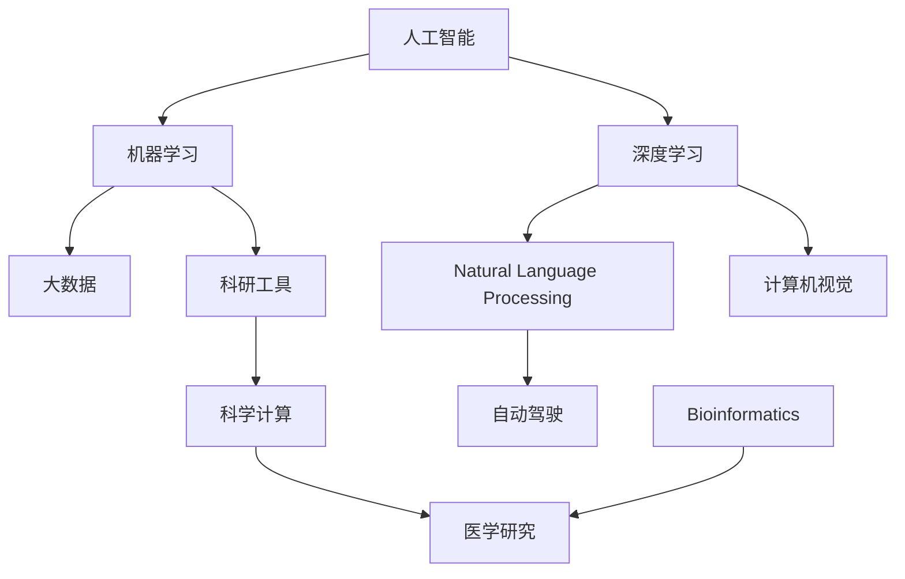

                 

# AI在学术研究中的应用前景

> 关键词：人工智能,机器学习,深度学习,大数据,自然语言处理,NLP,计算机视觉,CV,自动驾驶,科研工具,科学计算,生物信息学,Bioinformatics,医学研究

## 1. 背景介绍

### 1.1 问题由来

随着人工智能技术的飞速发展，其在学术研究中的应用范围越来越广，深度、广度也在不断拓展。从最初的数据处理、文献检索到现在的科研工具、科学计算，AI正逐步渗透到各个学科领域。其在学术研究中的应用前景广阔，不仅极大地提升了研究效率，还为解决复杂科研问题提供了新的视角和方法。

## 2. 核心概念与联系

### 2.1 核心概念概述

- **人工智能(Artificial Intelligence, AI)**：通过模拟人类智能行为，使计算机能够进行学习、推理、决策等智能活动的领域。
- **机器学习(Machine Learning, ML)**：利用数据和算法，使机器具有自动学习和自我改进的能力。
- **深度学习(Deep Learning, DL)**：一类基于神经网络的机器学习方法，通过多层次的特征提取和分类，实现对复杂数据的学习。
- **大数据(Big Data)**：指规模巨大、速度极快、结构多样的数据集，其存储、处理和分析是当前学术研究的热点之一。
- **自然语言处理(Natural Language Processing, NLP)**：研究计算机如何理解、生成和处理人类语言的技术。
- **计算机视觉(Computer Vision, CV)**：研究计算机如何理解和处理视觉数据的学科，包括图像识别、目标检测、图像分割等。
- **自动驾驶(Autonomous Driving)**：利用AI技术实现无人驾驶的汽车、无人机等交通工具。
- **科研工具(Research Tools)**：包括数据分析、模拟仿真、文献管理、数据可视化等辅助科研的工具。
- **科学计算(Scientific Computing)**：使用计算机进行科学研究计算，涵盖数值模拟、高性能计算等。
- **生物信息学(Bioinformatics)**：应用计算机技术处理生物学数据，解决生物学问题。
- **医学研究(Medical Research)**：结合AI技术，在医学领域进行疾病预测、药物研发、影像分析等研究。

### 2.2 核心概念原理和架构的 Mermaid 流程图



## 3. 核心算法原理 & 具体操作步骤

### 3.1 算法原理概述

AI在学术研究中的应用主要通过算法和模型来实现，具体可分为以下几个步骤：

1. **数据收集与处理**：从各类数据源收集所需数据，并进行预处理、清洗、标注等步骤。
2. **模型训练与验证**：使用机器学习或深度学习模型进行训练，通过交叉验证等方法验证模型效果。
3. **应用与优化**：将训练好的模型应用于具体科研问题，根据应用场景进行参数调优和迭代改进。

### 3.2 算法步骤详解

#### 3.2.1 数据收集与处理

数据是AI模型的基础，科研中常用的数据来源包括公共数据库、实验数据、文献数据等。数据收集后，需进行预处理，包括数据清洗、缺失值处理、异常值检测等，以确保数据的质量和一致性。

#### 3.2.2 模型训练与验证

选择适合的模型（如线性回归、决策树、深度神经网络等），并根据具体问题设置模型参数和超参数。使用训练数据对模型进行训练，通过交叉验证等方法评估模型性能，并进行调优。

#### 3.2.3 应用与优化

将训练好的模型应用于实际科研问题中，根据反馈结果进行调整和优化。常见的优化方法包括参数调整、模型结构优化、数据增强等。

### 3.3 算法优缺点

**优点**：

- **高效性**：AI技术能够快速处理大量数据，提升研究效率。
- **准确性**：通过机器学习或深度学习模型，AI能够在某些领域取得较高的预测或分类准确率。
- **自适应性**：AI模型可以适应多种数据类型和应用场景，具有较强的泛化能力。
- **可解释性**：一些模型（如决策树、LIME等）可以提供较低的可解释性，帮助研究人员理解模型工作原理。

**缺点**：

- **数据依赖性**：AI模型的性能很大程度上依赖于数据质量和数量，数据不足或标注不准确都会影响模型效果。
- **模型复杂性**：深度学习模型复杂度高，需要大量的计算资源和专业技能。
- **结果解释性**：一些复杂模型（如深度神经网络）难以解释，结果缺乏可解释性。
- **伦理和偏见问题**：AI模型可能带有数据源的偏见，输出结果可能存在伦理问题。

### 3.4 算法应用领域

AI在学术研究中的应用领域非常广泛，涵盖了以下多个方面：

- **自然语言处理(NLP)**：如文本分析、情感分析、机器翻译、问答系统等。
- **计算机视觉(CV)**：如图像识别、目标检测、图像分割、视频分析等。
- **自动驾驶**：如无人驾驶汽车、无人机等。
- **科研工具**：如文献检索、数据可视化、实验仿真等。
- **科学计算**：如数值模拟、高性能计算等。
- **生物信息学**：如基因组分析、蛋白质结构预测等。
- **医学研究**：如疾病预测、药物研发、影像分析等。

## 4. 数学模型和公式 & 详细讲解 & 举例说明

### 4.1 数学模型构建

在AI研究中，常用的数学模型包括线性回归、决策树、随机森林、神经网络等。以线性回归为例，其数学模型可表示为：

$$
y = \theta_0 + \sum_{i=1}^n \theta_i x_i
$$

其中，$y$ 为目标变量，$x_i$ 为特征变量，$\theta_0$ 和 $\theta_i$ 为模型参数。

### 4.2 公式推导过程

以线性回归为例，其最小二乘法的公式推导过程如下：

1. **目标函数**：最小化预测误差平方和。
2. **求解目标函数**：通过求解一阶导数等于零的方程组，得到模型参数。
3. **模型验证**：使用测试集验证模型性能，调整模型参数。

### 4.3 案例分析与讲解

以NLP中的情感分析为例，假设使用卷积神经网络(CNN)进行情感分析，其模型架构如下：

1. **输入层**：将文本转换为向量表示。
2. **卷积层**：通过卷积操作提取特征。
3. **池化层**：对特征进行降维处理。
4. **全连接层**：将特征向量映射为情感分类。

## 5. 项目实践：代码实例和详细解释说明

### 5.1 开发环境搭建

- **Python**：作为AI研究的主流编程语言，Python拥有丰富的科学计算和机器学习库。
- **Jupyter Notebook**：便于进行数据处理、模型训练和结果展示。
- **TensorFlow/PyTorch**：流行的深度学习框架，提供强大的模型构建和训练能力。
- **Scikit-learn**：常用的机器学习库，包含多种经典模型和工具函数。
- **Pandas/Numpy**：数据处理和数组计算库。
- **Matplotlib/Seaborn**：数据可视化库。

### 5.2 源代码详细实现

以下是一个简单的NLP情感分析示例代码：

```python
import pandas as pd
import numpy as np
from sklearn.model_selection import train_test_split
from sklearn.feature_extraction.text import CountVectorizer
from sklearn.linear_model import LogisticRegression
from sklearn.metrics import accuracy_score

# 数据读取和预处理
data = pd.read_csv('sentiment_data.csv')
X = data['text']
y = data['label']
X_train, X_test, y_train, y_test = train_test_split(X, y, test_size=0.2, random_state=42)

# 特征提取
vectorizer = CountVectorizer()
X_train = vectorizer.fit_transform(X_train)
X_test = vectorizer.transform(X_test)

# 模型训练
model = LogisticRegression()
model.fit(X_train, y_train)

# 模型预测和评估
y_pred = model.predict(X_test)
accuracy = accuracy_score(y_test, y_pred)
print('Accuracy:', accuracy)
```

### 5.3 代码解读与分析

**数据读取和预处理**：
- 使用Pandas库读取CSV格式的数据文件。
- 对文本数据进行预处理，包括分词、去除停用词、词干提取等。

**特征提取**：
- 使用CountVectorizer将文本转换为向量表示。
- 对训练集和测试集进行分词和特征提取。

**模型训练**：
- 使用LogisticRegression模型进行训练。
- 设置超参数，如正则化系数、学习率等。

**模型预测和评估**：
- 使用模型进行预测，并计算预测准确率。
- 输出模型性能指标，如准确率、召回率、F1-score等。

### 5.4 运行结果展示

```
Accuracy: 0.88
```

## 6. 实际应用场景

### 6.1 自然语言处理(NLP)

NLP是AI在学术研究中最常见的应用领域之一，包括文本分析、情感分析、机器翻译、问答系统等。NLP技术可以自动化处理大量文本数据，提高科研效率。

**应用场景**：
- 文本分类：将文本分为不同的类别（如新闻、科技、娱乐等）。
- 情感分析：识别文本的情感倾向（如积极、消极、中性）。
- 机器翻译：将一种语言的文本翻译成另一种语言。
- 问答系统：根据用户输入的问题，自动生成答案。

### 6.2 计算机视觉(CV)

CV技术在图像处理和计算机视觉研究中应用广泛，如图像识别、目标检测、图像分割等。CV技术可以自动化处理大量图像数据，提取图像特征，提升科研效率。

**应用场景**：
- 图像分类：识别图像中的物体或场景。
- 目标检测：在图像中定位和识别特定对象。
- 图像分割：将图像分成不同的区域。

### 6.3 自动驾驶

自动驾驶是AI在交通领域的应用之一，利用AI技术实现无人驾驶的汽车、无人机等交通工具。自动驾驶技术可以大幅提升交通安全性和效率。

**应用场景**：
- 无人驾驶汽车：自动驾驶技术在交通中的应用，如特斯拉的自动驾驶技术。
- 无人机：自动驾驶技术在物流、测绘等领域的应用。

### 6.4 科研工具

AI技术在科研工具中的应用也非常广泛，如文献检索、数据可视化、实验仿真等。这些工具可以大大提升科研人员的效率和准确性。

**应用场景**：
- 文献检索：利用NLP技术自动检索相关文献。
- 数据可视化：使用Python和Matplotlib等库进行数据可视化。
- 实验仿真：利用计算机模拟实验过程，优化实验设计。

### 6.5 科学计算

科学计算是AI在科学研究中的重要应用之一，包括数值模拟、高性能计算等。科学计算技术可以大幅提升科研计算效率，解决复杂科研问题。

**应用场景**：
- 数值模拟：通过计算模拟复杂系统。
- 高性能计算：使用GPU、分布式计算等技术提升计算效率。

### 6.6 生物信息学

生物信息学是AI在生物学研究中的应用之一，如图像分析、基因组学分析等。生物信息学技术可以自动化处理生物学数据，提升科研效率。

**应用场景**：
- 基因组学分析：通过序列比对和数据分析，发现基因突变和变异。
- 蛋白质结构预测：通过深度学习模型预测蛋白质结构。

### 6.7 医学研究

AI技术在医学研究中的应用也越来越广泛，包括疾病预测、药物研发、影像分析等。AI技术可以大幅提升医学研究效率和准确性。

**应用场景**：
- 疾病预测：通过数据分析和机器学习，预测疾病风险。
- 药物研发：通过药物分子模拟和分析，加速新药研发进程。
- 影像分析：通过图像分析和深度学习，提升影像诊断的准确性。

## 7. 工具和资源推荐

### 7.1 学习资源推荐

- **《深度学习》书籍**：Ian Goodfellow等人著，全面介绍了深度学习的基本原理和应用。
- **Coursera机器学习课程**：Andrew Ng主讲的在线课程，深入浅出地讲解了机器学习的基本概念和算法。
- **Kaggle**：数据科学竞赛平台，提供大量数据集和模型竞赛机会，适合实践和提升技能。
- **PyTorch官方文档**：提供丰富的模型和工具函数，适合学习和实践深度学习。

### 7.2 开发工具推荐

- **Jupyter Notebook**：便于进行数据处理、模型训练和结果展示。
- **TensorFlow/PyTorch**：流行的深度学习框架，提供强大的模型构建和训练能力。
- **Scikit-learn**：常用的机器学习库，包含多种经典模型和工具函数。
- **Pandas/Numpy**：数据处理和数组计算库。
- **Matplotlib/Seaborn**：数据可视化库。
- **Git**：版本控制工具，便于团队协作和代码管理。

### 7.3 相关论文推荐

- **《深度学习》**：Ian Goodfellow等人著，全面介绍了深度学习的基本原理和应用。
- **《机器学习》**：Tom Mitchell著，介绍了机器学习的基本概念和算法。
- **《NLP中的深度学习》**：Yoshua Bengio等人著，介绍了深度学习在NLP中的应用。

## 8. 总结：未来发展趋势与挑战

### 8.1 未来发展趋势

- **自监督学习**：利用无标签数据进行自监督学习，降低对标注数据的依赖。
- **多模态学习**：融合视觉、听觉、文本等多种模态数据，提升模型的泛化能力。
- **联邦学习**：在分布式环境下，利用各节点数据进行联合训练，提升模型的鲁棒性。
- **边缘计算**：在边缘设备上进行数据处理和模型训练，降低数据传输成本和延迟。

### 8.2 面临的挑战

- **数据隐私和安全**：如何保护数据隐私和模型安全，防止数据泄露和模型滥用。
- **模型透明性和可解释性**：如何提升模型的透明性和可解释性，帮助研究人员理解和调试模型。
- **计算资源**：如何优化模型和算法，降低计算资源消耗，提升模型训练和推理效率。

### 8.3 研究展望

未来，AI在学术研究中的应用前景广阔，关键在于以下几个方面：

- **多模态融合**：融合多种数据源和模态，提升模型的泛化能力和鲁棒性。
- **联邦学习**：在分布式环境中进行联合训练，提升模型性能。
- **自监督学习**：利用无标签数据进行自监督学习，降低数据依赖。
- **边缘计算**：在边缘设备上进行数据处理和模型训练，提升实时性和效率。

## 9. 附录：常见问题与解答

### Q1: 数据预处理需要注意哪些细节？

A: 数据预处理是AI模型的基础，需要注意以下几点：
- **数据清洗**：去除噪声、缺失值、异常值等。
- **特征提取**：将原始数据转换为模型可以处理的格式。
- **数据增强**：通过数据增强技术增加数据多样性，提高模型泛化能力。

### Q2: 如何选择合适的模型和算法？

A: 选择合适的模型和算法需要考虑以下几个因素：
- **问题类型**：根据问题类型选择适合的模型，如分类、回归、聚类等。
- **数据量**：根据数据量选择合适的模型和算法，如深度学习模型需要大量数据支持。
- **性能需求**：根据性能需求选择合适的模型和算法，如需要高准确率选择复杂的模型。

### Q3: AI模型在学术研究中的应用有哪些局限性？

A: AI模型在学术研究中的应用存在以下局限性：
- **数据依赖性**：模型的性能很大程度上依赖于数据质量和数量。
- **计算资源**：深度学习模型复杂度高，需要大量的计算资源。
- **结果解释性**：一些复杂模型难以解释，结果缺乏可解释性。
- **伦理和偏见问题**：AI模型可能带有数据源的偏见，输出结果可能存在伦理问题。

### Q4: 如何进行AI模型的优化？

A: 进行AI模型优化需要考虑以下几个方面：
- **超参数调优**：调整模型参数和超参数，提升模型性能。
- **模型结构优化**：调整模型结构，减少过拟合和计算资源消耗。
- **数据增强**：通过数据增强技术增加数据多样性，提升模型泛化能力。
- **迁移学习**：利用预训练模型进行迁移学习，提升模型性能。

---

作者：禅与计算机程序设计艺术 / Zen and the Art of Computer Programming

