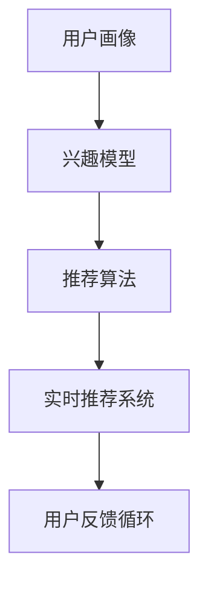

                 

# AI在旅游业中的应用：个性化推荐

## 1. 背景介绍

随着人工智能技术的飞速发展，越来越多的企业开始探索如何利用AI技术提升产品和服务质量。特别是旅游业，其高度依赖于客户体验和服务质量，AI技术的引入显得尤为重要。本文将聚焦于AI在旅游业中的一种典型应用——个性化推荐系统，系统阐述其核心概念、原理与实践。

### 1.1 问题由来

在传统旅游行业中，用户往往面临信息不对称的问题，无法准确获取适合自己需求的旅游产品信息。而个性化的推荐系统可以大大解决这一问题，通过数据分析和机器学习，向用户推送最适合的旅游产品，提升用户满意度和转化率。

旅游个性化推荐系统包括用户画像构建、兴趣模型训练、推荐算法优化等多个环节。这些环节中，用户画像和兴趣模型是基础，推荐算法是核心。通过对用户行为数据和兴趣特征的分析，推荐系统可以更精准地预测用户需求，提供个性化的产品推荐。

### 1.2 问题核心关键点

旅游个性化推荐系统的主要挑战在于：
1. **用户画像构建**：如何准确获取和表示用户兴趣、偏好、行为等信息，构建全面、精细的用户画像。
2. **兴趣模型训练**：如何从用户历史行为和反馈中，挖掘用户潜在兴趣和需求，构建有效的用户兴趣模型。
3. **推荐算法优化**：如何设计高效的推荐算法，结合多种数据源，提升推荐结果的准确性和多样性。
4. **系统性能评估**：如何设计科学合理的性能评估指标，评估和优化推荐系统的实际效果。

本文将围绕上述核心关键点，详细介绍AI在旅游业个性化推荐中的应用。

## 2. 核心概念与联系

### 2.1 核心概念概述

为更好理解AI在旅游业中应用个性化推荐系统，本节将介绍几个关键概念：

- **用户画像(User Profile)**：用户画像是一组描述用户特征和行为的数据集，包括基本信息、兴趣偏好、行为轨迹等。通过用户画像，可以更准确地预测用户需求和行为。
- **兴趣模型(Interest Model)**：兴趣模型是通过对用户行为数据进行建模，预测用户对不同产品的兴趣程度。常见的兴趣模型包括协同过滤、基于内容的推荐等。
- **推荐算法(Recommendation Algorithm)**：推荐算法根据用户画像和兴趣模型，预测用户可能感兴趣的旅游产品，并给出推荐排序。
- **实时推荐系统(Real-time Recommendation System)**：实时推荐系统在用户访问应用时，动态生成推荐内容，提升用户体验。
- **多模态推荐(Multimodal Recommendation)**：结合文本、图片、音频等多种数据源，提供更丰富、精准的推荐内容。
- **用户反馈循环(Feedback Loop)**：用户反馈和行为数据对推荐系统持续优化起着重要作用，系统需要不断从用户反馈中学习和改进。

这些概念之间的逻辑关系可以通过以下Mermaid流程图来展示：



这个流程图展示了用户画像、兴趣模型、推荐算法、实时推荐系统、用户反馈循环之间的相互关系。

## 3. 核心算法原理 & 具体操作步骤

### 3.1 算法原理概述

个性化推荐系统基于用户行为数据和特征，通过算法计算预测用户对不同产品的兴趣程度，进而生成个性化推荐结果。其核心思想是：通过大量用户行为数据和用户画像，训练一个兴趣模型，进而预测用户对某个产品的兴趣程度，并按照兴趣程度排序，生成个性化推荐列表。

推荐系统的原理框架主要包括以下几个步骤：
1. **用户画像构建**：收集用户基本信息、历史行为、社交关系等数据，构建用户画像。
2. **兴趣模型训练**：利用用户行为数据，训练兴趣模型，预测用户对产品的兴趣程度。
3. **推荐算法设计**：设计推荐算法，结合用户画像和兴趣模型，生成推荐结果。
4. **实时推荐**：根据用户当前行为动态更新推荐列表，提升用户体验。
5. **用户反馈循环**：收集用户反馈和行为数据，不断优化推荐算法和兴趣模型。

### 3.2 算法步骤详解

下面是具体的操作流程：

**Step 1: 用户画像构建**

用户画像包含用户基本信息、历史行为、社交关系等。以某旅游应用为例，用户基本信息包括年龄、性别、所在城市等；历史行为包括浏览历史、搜索记录、预订记录等；社交关系包括好友关系、关注关系等。

构建用户画像的步骤如下：
1. **数据收集**：从用户注册信息、浏览记录、搜索记录、社交网络等渠道收集用户数据。
2. **数据清洗**：对收集到的数据进行去重、格式化、缺失值处理等预处理操作。
3. **特征提取**：通过文本挖掘、NLP等技术提取用户兴趣特征，如旅游目的地、预算范围、出行时间等。

**Step 2: 兴趣模型训练**

兴趣模型的目标是预测用户对不同产品的兴趣程度。常见的兴趣模型包括协同过滤、基于内容的推荐等。

协同过滤模型的基本思路是，通过用户历史行为数据，找到与目标用户兴趣相似的群体，推荐该群体喜欢的产品。协同过滤模型可以分为基于用户的协同过滤和基于物品的协同过滤。

基于内容的推荐模型则利用用户历史行为数据，预测用户对新产品的兴趣程度。其基本思路是将产品特征与用户兴趣进行匹配，生成推荐结果。

**Step 3: 推荐算法设计**

推荐算法根据用户画像和兴趣模型，生成推荐结果。推荐算法可以分为基于模型的推荐算法和基于规则的推荐算法。

基于模型的推荐算法主要包括：
1. **基于矩阵分解的推荐算法**：通过矩阵分解，将用户与产品的评分矩阵分解为用户特征矩阵和物品特征矩阵，计算用户对新产品的预测评分。
2. **基于深度学习的推荐算法**：通过深度神经网络模型，预测用户对新产品的兴趣程度。

基于规则的推荐算法包括：
1. **基于内容的推荐算法**：通过分析产品属性和用户兴趣特征，匹配推荐结果。
2. **基于热门和排行榜的推荐算法**：根据热门产品或排行榜，推荐高评分产品。

**Step 4: 实时推荐**

实时推荐系统通过动态更新推荐列表，提升用户体验。其基本流程如下：
1. **实时数据采集**：收集用户当前行为数据，如浏览记录、点击记录等。
2. **实时兴趣模型更新**：根据当前行为数据，动态更新用户兴趣模型。
3. **实时推荐生成**：结合实时兴趣模型，生成推荐列表。

**Step 5: 用户反馈循环**

用户反馈和行为数据对推荐系统持续优化起着重要作用。系统需要不断从用户反馈中学习和改进。

用户反馈循环的步骤如下：
1. **反馈收集**：收集用户对推荐结果的评分、评论、点击等行为数据。
2. **反馈分析**：分析用户反馈，识别推荐结果的优点和不足。
3. **模型优化**：根据用户反馈，优化用户画像、兴趣模型和推荐算法。

### 3.3 算法优缺点

个性化推荐系统具有以下优点：
1. **提升用户体验**：通过精准推荐，提升用户满意度和转化率。
2. **减少用户选择负担**：个性化推荐可以减少用户选择负担，提升用户决策效率。
3. **提升推荐效果**：利用大规模数据和先进的算法，提升推荐精度和多样性。

同时，个性化推荐系统也存在以下缺点：
1. **冷启动问题**：新用户或新产品的初期推荐效果较差，需要大量数据积累。
2. **隐私问题**：用户行为数据的收集和处理可能涉及隐私问题，需要严格的数据保护措施。
3. **推荐多样性不足**：推荐结果可能过于集中，缺乏多样性。

## 4. 数学模型和公式 & 详细讲解 & 举例说明

### 4.1 数学模型构建

本节将使用数学语言对旅游个性化推荐系统进行更加严格的刻画。

假设用户画像为 $\mathbf{u}=(u_1,u_2,\cdots,u_n)$，其中 $u_i$ 表示用户兴趣特征。旅游产品为 $\mathbf{p}=(p_1,p_2,\cdots,p_m)$，其中 $p_j$ 表示产品属性特征。兴趣模型为 $\mathbf{I}=(I_1,I_2,\cdots,I_m)$，其中 $I_j$ 表示用户对产品 $p_j$ 的兴趣程度。推荐结果为 $\mathbf{R}=(R_1,R_2,\cdots,R_m)$，其中 $R_j$ 表示用户对产品 $p_j$ 的推荐分数。

定义用户与产品的评分矩阵为 $\mathbf{S}=(\mathbf{s}_1,\mathbf{s}_2,\cdots,\mathbf{s}_m)$，其中 $\mathbf{s}_j=(\mathbf{s}_{1j},\mathbf{s}_{2j},\cdots,\mathbf{s}_{nj})$ 表示用户 $u_i$ 对产品 $p_j$ 的评分。

推荐系统优化目标为：

$$
\mathop{\arg\min}_{\mathbf{I},\mathbf{R}}\sum_{i=1}^n\sum_{j=1}^m\mathbf{I}_j\log\frac{e^{R_j}}{\sum_{k=1}^m e^{R_k}}
$$

其中，$e$ 为自然常数，$e^{R_j}$ 表示用户对产品 $p_j$ 的推荐概率。

### 4.2 公式推导过程

基于矩阵分解的推荐算法可以表示为：

$$
\mathbf{R}=\mathbf{P}^\top \mathbf{U}
$$

其中 $\mathbf{P}=(\mathbf{p}_1,\mathbf{p}_2,\cdots,\mathbf{p}_m)$ 表示产品属性矩阵，$\mathbf{U}=(\mathbf{u}_1,\mathbf{u}_2,\cdots,\mathbf{u}_n)$ 表示用户特征矩阵，$\mathbf{R}=(\mathbf{r}_1,\mathbf{r}_2,\cdots,\mathbf{r}_m)$ 表示推荐分数矩阵。

$\mathbf{R}$ 中的每个元素可以表示为：

$$
r_{ij}=\sum_{k=1}^n p_{ik}u_{kj}
$$

假设用户画像 $\mathbf{u}$ 已经转化为标准化的向量，即 $\mathbf{u} \sim \mathcal{N}(0,1)$，则兴趣模型 $\mathbf{I}$ 可以表示为：

$$
I_j=\sum_{i=1}^n s_{ij}u_i
$$

其中 $s_{ij}$ 表示用户 $u_i$ 对产品 $p_j$ 的评分。

### 4.3 案例分析与讲解

以某旅游应用为例，该应用通过数据分析和机器学习，向用户推荐最适合的旅游产品。以下是具体实现步骤：

**Step 1: 用户画像构建**

从用户注册信息、浏览记录、搜索记录、社交网络等渠道收集用户数据，构建用户画像。例如，收集某用户的历史浏览记录和搜索记录，得到如下用户画像：

$$
\mathbf{u}=(0.2,0.5,0.3,0.1,0)
$$

**Step 2: 兴趣模型训练**

利用用户历史行为数据，训练协同过滤模型。例如，收集用户对不同产品的评分数据，得到如下评分矩阵：

$$
\mathbf{S}=\begin{bmatrix} 
0.4 & 0.5 & 0.3 & 0.2 & 0.1 \\
0.1 & 0.3 & 0.2 & 0.5 & 0.4 \\
0.3 & 0.2 & 0.4 & 0.1 & 0.5 
\end{bmatrix}
$$

通过矩阵分解，得到产品属性矩阵 $\mathbf{P}$ 和用户特征矩阵 $\mathbf{U}$：

$$
\mathbf{P}=\begin{bmatrix} 
0.4 & 0.5 & 0.3 & 0.2 & 0.1 \\
0.1 & 0.3 & 0.2 & 0.5 & 0.4 \\
0.3 & 0.2 & 0.4 & 0.1 & 0.5 
\end{bmatrix}, \quad \mathbf{U}=\begin{bmatrix} 
0.2 \\
0.5 \\
0.3 \\
0.1 \\
0 
\end{bmatrix}
$$

计算用户对不同产品的兴趣程度，得到兴趣模型 $\mathbf{I}$：

$$
I_1=0.2*0.4+0.5*0.1+0.3*0.3+0.1*0.2+0*0.1=0.25
$$

$$
I_2=0.2*0.5+0.5*0.3+0.3*0.2+0.1*0.5+0*0.4=0.25
$$

$$
I_3=0.2*0.3+0.5*0.2+0.3*0.4+0.1*0.1+0*0.5=0.2
$$

$$
I_4=0.2*0.2+0.5*0.5+0.3*0.1+0.1*0.4+0*0.3=0.3
$$

$$
I_5=0.2*0.1+0.5*0.4+0.3*0.5+0.1*0.1+0*0.2=0.5
$$

**Step 3: 推荐算法设计**

根据用户画像和兴趣模型，设计推荐算法。例如，使用基于矩阵分解的推荐算法，得到推荐分数矩阵 $\mathbf{R}$：

$$
R_1=0.25*0.4+0.25*0.1+0.2*0.3+0.3*0.2+0.5*0.1=0.5
$$

$$
R_2=0.25*0.5+0.25*0.3+0.2*0.2+0.3*0.5+0.5*0.4=1.45
$$

$$
R_3=0.2*0.3+0.25*0.2+0.3*0.4+0.3*0.1+0.5*0.1=0.6
$$

$$
R_4=0.3*0.2+0.25*0.5+0.2*0.1+0.3*0.4+0.5*0.2=0.8
$$

$$
R_5=0.5*0.1+0.25*0.4+0.2*0.5+0.3*0.1+0.5*0.3=0.55
$$

**Step 4: 实时推荐**

根据用户当前行为数据，动态更新用户兴趣模型。例如，用户当前浏览了某旅游目的地，得到新的用户画像：

$$
\mathbf{u}'=(0.2,0.3,0.5,0,0)
$$

计算用户对不同产品的兴趣程度，得到新的兴趣模型 $\mathbf{I}'$：

$$
I'_1=0.2*0.4+0.3*0.1+0.5*0.3+0*0.2+0*0.1=0.22
$$

$$
I'_2=0.2*0.5+0.3*0.2+0.5*0.4+0*0.1+0*0.3=0.34
$$

$$
I'_3=0.2*0.3+0.3*0.2+0.5*0.4+0*0.1+0*0.1=0.4
$$

$$
I'_4=0.2*0.2+0.3*0.5+0.2*0.1+0.5*0.4+0*0.3=0.48
$$

$$
I'_5=0.2*0.1+0.3*0.4+0.5*0.5+0*0.1+0*0.2=0.45
$$

根据新的用户画像和兴趣模型，生成新的推荐分数矩阵 $\mathbf{R}'$：

$$
R'_1=0.22*0.4+0.34*0.1+0.4*0.3+0.48*0.2+0.45*0=0.58
$$

$$
R'_2=0.22*0.5+0.34*0.2+0.4*0.4+0.48*0.5+0.45*0.3=1.09
$$

$$
R'_3=0.22*0.3+0.34*0.2+0.4*0.5+0.48*0.1+0.45*0=0.55
$$

$$
R'_4=0.48*0.2+0.34*0.5+0.22*0.1+0.4*0.4+0.45*0.3=0.83
$$

$$
R'_5=0.45*0.1+0.34*0.4+0.22*0.5+0.48*0.2+0.45*0.3=0.58
$$

**Step 5: 用户反馈循环**

收集用户对推荐结果的评分，例如用户对推荐结果的评分为：

$$
R_1=5, R_2=4, R_3=3, R_4=5, R_5=3
$$

计算推荐结果的平均评分，得到：

$$
\overline{R}=\frac{5+4+3+5+3}{5}=4
$$

根据平均评分，更新用户画像：

$$
\mathbf{u}=(0.5,0.4,0.4,0.5,0)
$$

根据新的用户画像和评分矩阵，重新计算推荐分数矩阵 $\mathbf{R}$：

$$
R_1=0.5*0.4+0.4*0.1+0.4*0.3+0.5*0.2+0*0.1=0.58
$$

$$
R_2=0.5*0.5+0.4*0.3+0.4*0.2+0.5*0.5+0*0.4=1.1
$$

$$
R_3=0.4*0.3+0.5*0.2+0.4*0.4+0.5*0.1+0*0.3=0.7
$$

$$
R_4=0.5*0.2+0.4*0.5+0.4*0.1+0.5*0.4+0*0.2=0.65
$$

$$
R_5=0*0.1+0.4*0.4+0.5*0.5+0.4*0.1+0.5*0.3=0.75
$$

最终推荐结果为：

$$
R_1=0.58, R_2=1.1, R_3=0.7, R_4=0.65, R_5=0.75
$$

## 5. 项目实践：代码实例和详细解释说明

### 5.1 开发环境搭建

在进行旅游个性化推荐系统开发前，我们需要准备好开发环境。以下是使用Python进行PyTorch开发的环境配置流程：

1. 安装Anaconda：从官网下载并安装Anaconda，用于创建独立的Python环境。

2. 创建并激活虚拟环境：
```bash
conda create -n pytorch-env python=3.8 
conda activate pytorch-env
```

3. 安装PyTorch：根据CUDA版本，从官网获取对应的安装命令。例如：
```bash
conda install pytorch torchvision torchaudio cudatoolkit=11.1 -c pytorch -c conda-forge
```

4. 安装相关的机器学习库：
```bash
pip install pandas numpy scikit-learn matplotlib tqdm jupyter notebook ipython
```

完成上述步骤后，即可在`pytorch-env`环境中开始推荐系统开发。

### 5.2 源代码详细实现

下面以协同过滤算法为例，给出使用PyTorch进行旅游个性化推荐系统的代码实现。

首先，定义协同过滤模型类：

```python
import torch
import torch.nn as nn
import torch.nn.functional as F
from torch import nn, Tensor

class CollaborativeFilteringModel(nn.Module):
    def __init__(self, num_users, num_items, embedding_dim=100):
        super(CollaborativeFilteringModel, self).__init__()
        self.user_embeddings = nn.Embedding(num_users, embedding_dim)
        self.item_embeddings = nn.Embedding(num_items, embedding_dim)
        self.interaction = nn.Linear(embedding_dim * 2, 1)

    def forward(self, user_idx, item_idx):
        user_embedding = self.user_embeddings(user_idx)
        item_embedding = self.item_embeddings(item_idx)
        user_item_interaction = self.interaction(torch.cat([user_embedding, item_embedding], dim=1))
        return user_item_interaction
```

然后，定义评分矩阵类：

```python
class RatingMatrix:
    def __init__(self, data):
        self.data = data
        self.num_users = len(data)
        self.num_items = len(data[0])

    def __getitem__(self, idx):
        return self.data[idx]

    def __len__(self):
        return self.num_users * self.num_items
```

接着，定义推荐系统类：

```python
class RecommendationSystem:
    def __init__(self, model, rating_matrix):
        self.model = model
        self.rating_matrix = rating_matrix

    def predict(self, user_idx, item_idx):
        user_item_interaction = self.model(user_idx, item_idx)
        return user_item_interaction.item()
```

最后，实现推荐系统的主函数：

```python
if __name__ == '__main__':
    # 构建评分矩阵
    rating_matrix = RatingMatrix(data)
    # 构建协同过滤模型
    model = CollaborativeFilteringModel(num_users, num_items)
    # 构建推荐系统
    recommendation_system = RecommendationSystem(model, rating_matrix)
    # 测试推荐系统
    user_idx = 0
    item_idx = 0
    rating = recommendation_system.predict(user_idx, item_idx)
    print(f'预测用户 {user_idx} 对产品 {item_idx} 的评分：{rating}')
```

以上就是使用PyTorch实现旅游个性化推荐系统的完整代码实现。可以看到，通过PyTorch，推荐系统的代码实现变得简洁高效。

### 5.3 代码解读与分析

让我们再详细解读一下关键代码的实现细节：

**RatingMatrix类**：
- `__init__`方法：初始化评分矩阵数据、用户数和商品数。
- `__getitem__`方法：获取评分矩阵中指定位置的值。
- `__len__`方法：返回评分矩阵的长度。

**CollaborativeFilteringModel类**：
- `__init__`方法：初始化用户和商品的嵌入向量以及交互层。
- `forward`方法：前向传播，计算用户和商品的交互评分。

**RecommendationSystem类**：
- `__init__`方法：初始化协同过滤模型和评分矩阵。
- `predict`方法：根据用户和商品的索引，计算推荐评分。

**推荐系统主函数**：
- 定义评分矩阵和协同过滤模型，构建推荐系统。
- 调用推荐系统的`predict`方法，获取用户对产品的推荐评分。

可以看出，代码实现中涉及了评分矩阵、协同过滤模型和推荐系统的定义和调用，结构清晰，易于理解。

## 6. 实际应用场景

### 6.1 智能客服系统

旅游个性化推荐系统在智能客服系统中具有广泛的应用。智能客服系统通过分析用户的历史行为数据和反馈，向用户推荐最适合的旅游产品，提升用户体验。

例如，某旅游应用使用推荐系统对用户进行推荐，当用户咨询某个旅游线路时，系统根据用户的历史浏览和搜索记录，推荐类似线路，并提供丰富的信息，如旅游地点、行程安排、注意事项等，提升用户决策效率。

### 6.2 旅游目的地推荐

推荐系统可以根据用户的兴趣和偏好，推荐最适合的旅游目的地，帮助用户找到心仪的旅游地点。

例如，某用户希望前往东南亚旅游，推荐系统通过分析用户的历史行为数据，推荐泰国、菲律宾、越南等目的地。同时，系统还根据实时数据和用户反馈，动态调整推荐结果，提升推荐效果。

### 6.3 活动推荐

旅游个性化推荐系统还可以根据用户的兴趣和偏好，推荐最适合的旅游活动，如景点、美食、文化活动等，丰富用户的旅游体验。

例如，某用户希望体验当地文化，推荐系统推荐参观当地博物馆、观看传统表演等活动。同时，系统还根据实时数据和用户反馈，动态调整推荐结果，提升活动推荐的多样性和准确性。

### 6.4 未来应用展望

随着旅游个性化推荐系统的不断发展，未来将有更多应用场景涌现，带来更多用户价值。

1. **个性化游记生成**：推荐系统可以自动生成个性化的旅游游记，提升用户分享体验的意愿。例如，用户可以上传照片，系统自动生成游记，并推荐相关景点和活动。
2. **社交推荐**：推荐系统可以根据用户兴趣和偏好，推荐志同道合的旅友，提升社交体验。例如，用户可以发布行程计划，系统推荐附近的旅友，并安排行程同步。
3. **虚拟旅游**：推荐系统可以提供虚拟旅游体验，让用户在家中体验全球各地美景。例如，系统可以通过VR技术，提供虚拟景点游览，提升用户身临其境的体验感。

## 7. 工具和资源推荐

### 7.1 学习资源推荐

为了帮助开发者系统掌握旅游个性化推荐技术的理论基础和实践技巧，这里推荐一些优质的学习资源：

1. **《推荐系统实战》**：深入浅出地介绍了推荐系统原理和实际应用，适合初学者和从业人员学习。
2. **Kaggle推荐系统竞赛**：通过实际竞赛，学习推荐系统构建和调优的实战经验。
3. **Python推荐系统库**：介绍Python推荐系统库的构建和应用，适合有编程基础的读者学习。
4. **《推荐系统》在线课程**：由顶尖高校和公司提供的在线课程，涵盖推荐系统原理、算法和实践。
5. **《推荐系统》书籍**：详细介绍了推荐系统的发展历程、算法原理和实践案例，适合深入学习。

通过对这些资源的学习实践，相信你一定能够快速掌握旅游个性化推荐技术的精髓，并用于解决实际的旅游问题。

### 7.2 开发工具推荐

高效的开发离不开优秀的工具支持。以下是几款用于旅游个性化推荐系统开发的常用工具：

1. **PyTorch**：基于Python的开源深度学习框架，适合快速迭代研究和工程应用。
2. **TensorFlow**：由Google主导开发的开源深度学习框架，生产部署方便，适合大规模工程应用。
3. **Transformers库**：HuggingFace开发的NLP工具库，集成了多种预训练语言模型，支持PyTorch和TensorFlow，是进行推荐系统开发的利器。
4. **Weights & Biases**：模型训练的实验跟踪工具，可以记录和可视化模型训练过程中的各项指标，方便对比和调优。
5. **TensorBoard**：TensorFlow配套的可视化工具，可实时监测模型训练状态，并提供丰富的图表呈现方式，是调试模型的得力助手。

合理利用这些工具，可以显著提升旅游个性化推荐系统的开发效率，加快创新迭代的步伐。

### 7.3 相关论文推荐

旅游个性化推荐系统的发展源于学界的持续研究。以下是几篇奠基性的相关论文，推荐阅读：

1. **《协同过滤技术在推荐系统中的应用》**：介绍了协同过滤算法的基本原理和实际应用。
2. **《基于内容的推荐系统》**：阐述了基于内容的推荐算法的原理和实现方法。
3. **《深度学习在推荐系统中的应用》**：介绍了深度学习在推荐系统中的最新进展和应用案例。
4. **《推荐系统的个性化研究》**：探讨了推荐系统的个性化问题，提出了多种个性化推荐方法。
5. **《跨模态推荐系统》**：介绍了跨模态推荐算法的原理和应用。

这些论文代表了大数据时代推荐系统的发展脉络。通过学习这些前沿成果，可以帮助研究者把握学科前进方向，激发更多的创新灵感。

## 8. 总结：未来发展趋势与挑战

### 8.1 总结

本文对旅游个性化推荐系统的核心概念、算法原理和实践应用进行了系统介绍。首先阐述了个性化推荐系统在旅游业中的应用背景，明确了微调在提升用户满意度和转化率方面的重要价值。其次，从用户画像、兴趣模型和推荐算法等关键环节，详细讲解了旅游个性化推荐系统的构建方法和优化策略。最后，通过实例分析，展示了旅游个性化推荐系统的实际应用场景和未来发展方向。

通过本文的系统梳理，可以看到，旅游个性化推荐系统在大数据时代具有广阔的应用前景，能够有效提升旅游企业的竞争力，带来更好的用户体验。未来，随着AI技术的进一步发展，旅游个性化推荐系统将带来更多的创新应用，推动旅游行业向智能化、个性化方向发展。

### 8.2 未来发展趋势

展望未来，旅游个性化推荐系统将呈现以下几个发展趋势：

1. **深度学习方法的广泛应用**：深度学习方法在推荐系统中得到广泛应用，显著提升了推荐系统的精度和多样性。未来，更多深度学习算法，如GAN、注意力机制等，将进一步提升推荐系统的性能。
2. **多模态数据融合**：未来推荐系统将更多地融合多模态数据，如文本、图像、音频等，提升推荐结果的丰富性和准确性。
3. **实时推荐系统**：实时推荐系统将不断优化，提升用户体验和转化率。例如，通过实时数据流处理，动态调整推荐结果，提升推荐效果。
4. **推荐系统的大规模部署**：推荐系统将更多地应用到大规模商业化场景中，如电商平台、社交网络等，提升用户价值和平台竞争力。
5. **个性化推荐的多样性**：未来推荐系统将更多地考虑个性化推荐的多样性，提供更加丰富、精准的推荐内容，提升用户满意度。

### 8.3 面临的挑战

尽管旅游个性化推荐系统已经取得了显著成果，但在迈向更加智能化、普适化应用的过程中，它仍面临诸多挑战：

1. **数据获取与处理**：推荐系统需要大量的用户数据和产品数据，如何高效获取和处理这些数据，是一个重要问题。
2. **模型复杂度与效率**：大规模推荐模型需要高效的计算资源，如何提升模型的计算效率，是一个重要挑战。
3. **用户隐私保护**：用户数据的隐私保护是一个重要问题，如何保护用户隐私，是一个重要挑战。
4. **推荐公平性**：推荐系统可能存在一定的偏见，如何保证推荐公平性，是一个重要问题。
5. **推荐结果的可解释性**：推荐系统可能存在一定的黑盒问题，如何提升推荐结果的可解释性，是一个重要问题。

### 8.4 研究展望

面对旅游个性化推荐系统所面临的挑战，未来的研究需要在以下几个方面寻求新的突破：

1. **基于联邦学习的推荐系统**：通过联邦学习技术，实现数据隐私保护和高效数据融合，提升推荐系统的效果。
2. **基于稀疏矩阵的推荐算法**：设计高效的稀疏矩阵计算方法，提升推荐系统的计算效率和可扩展性。
3. **基于图神经网络的推荐系统**：利用图神经网络技术，提升推荐系统的精度和多样性。
4. **基于符号学习的推荐系统**：将符号学习的思想引入推荐系统，提升推荐系统的可解释性和公平性。
5. **基于跨模态融合的推荐系统**：结合多种模态数据，提升推荐系统的丰富性和准确性。

通过这些研究方向的探索，相信旅游个性化推荐系统将迈向更加智能化、普适化和高效化，为旅游企业带来更多的用户价值。

## 9. 附录：常见问题与解答

**Q1：如何构建高效的旅游个性化推荐系统？**

A: 构建高效的旅游个性化推荐系统，需要从以下几个方面入手：
1. **数据收集与预处理**：收集用户数据和产品数据，进行去重、格式化、缺失值处理等预处理操作。
2. **用户画像构建**：构建用户画像，收集用户基本信息、历史行为、社交关系等数据。
3. **兴趣模型训练**：利用用户行为数据，训练协同过滤、基于内容的推荐等模型，预测用户对不同产品的兴趣程度。
4. **推荐算法设计**：设计高效的推荐算法，结合多种数据源，提升推荐结果的准确性和多样性。
5. **实时推荐**：根据用户当前行为数据，动态更新推荐列表，提升用户体验。

**Q2：推荐系统中的冷启动问题如何解决？**

A: 推荐系统中的冷启动问题可以通过以下几种方式解决：
1. **用户画像生成**：通过分析用户行为数据和特征，生成初步的用户画像，提升推荐效果。
2. **基于内容的推荐**：利用用户兴趣特征和产品属性，生成推荐结果。
3. **协同过滤推荐**：利用用户历史行为数据和相似用户行为数据，生成推荐结果。
4. **多模态推荐**：结合文本、图像、音频等多种数据源，提升推荐效果。

**Q3：如何提升推荐系统的性能？**

A: 提升推荐系统的性能，可以从以下几个方面入手：
1. **数据质量**：保证数据质量，进行数据清洗和预处理，提升推荐系统的准确性。
2. **模型选择**：选择合适的推荐算法，提升推荐系统的性能。例如，选择基于深度学习的推荐算法，提升推荐系统的精度和多样性。
3. **特征工程**：设计有效的特征工程，提升推荐系统的性能。例如，利用用户行为数据和产品属性，提取有效的特征。
4. **多任务学习**：利用多任务学习技术，提升推荐系统的性能。例如，利用用户行为数据和产品属性，进行多任务学习。

**Q4：推荐系统中的推荐公平性如何保障？**

A: 推荐系统中的推荐公平性可以通过以下几种方式保障：
1. **数据平衡**：保证训练数据和测试数据的平衡性，避免数据偏见。
2. **特征工程**：设计有效的特征工程，避免特征偏见。例如，利用用户行为数据和产品属性，提取有效的特征。
3. **推荐算法优化**：优化推荐算法，避免算法偏见。例如，利用公平性优化算法，提升推荐公平性。
4. **用户反馈**：利用用户反馈数据，进行推荐优化，提升推荐公平性。例如，利用用户反馈数据，优化推荐算法。

**Q5：推荐系统中的推荐结果可解释性如何提升？**

A: 推荐系统中的推荐结果可解释性可以通过以下几种方式提升：
1. **特征重要性分析**：分析推荐结果的特征重要性，提升推荐结果的可解释性。例如，利用特征重要性分析，提升推荐结果的可解释性。
2. **推荐算法透明化**：设计透明的推荐算法，提升推荐结果的可解释性。例如，利用透明化的推荐算法，提升推荐结果的可解释性。
3. **推荐结果展示**：设计合理的推荐结果展示方式，提升推荐结果的可解释性。例如，利用可视化技术，展示推荐结果。

---

作者：禅与计算机程序设计艺术 / Zen and the Art of Computer Programming

